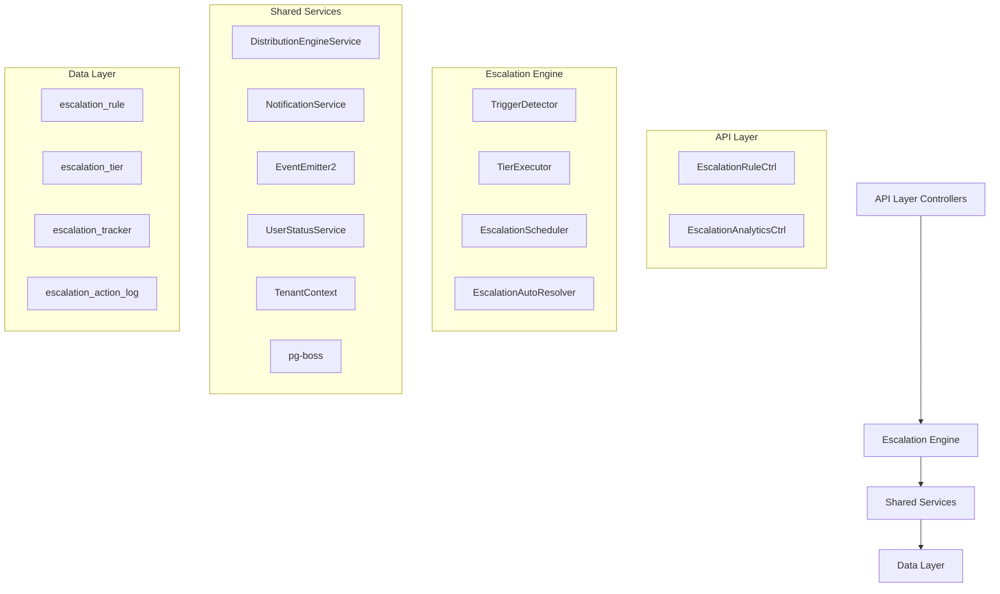

The Escalation Module automates responses when assigned leads go stale. A scheduled engine detects trigger conditions (no first contact, went cold) and executes tiered escalation actions — notifications, temperature changes, tag additions, and redistribution to new agents.

<Note>
**Status:** Active — fully implemented  
**Module Path:** `src/modules/crm/escalation/`
</Note>

## Overview

The Escalation Module provides automated lead management through intelligent escalation workflows. When leads become stale or unresponsive, the system automatically triggers predefined actions to ensure no opportunities are lost.

### Design Principles

<CardGroup cols={2}>
  <Card title="pg-boss Scheduling" icon="clock">
    Escalation scheduler uses pg-boss recurring job for reliability
  </Card>
  <Card title="Tiered Actions" icon="layers">
    Rules have ordered tiers with configurable delays; actions execute in sequence
  </Card>
  <Card title="Auto-resolution" icon="check-circle">
    Events (activity, stage change, reassignment) automatically resolve active trackers
  </Card>
  <Card title="RLS Compliance" icon="shield">
    All entities carry `organization_id` for row-level security
  </Card>
</CardGroup>

<Tip>
The system uses idempotency through partial unique index + `ON CONFLICT DO NOTHING` to prevent duplicate trackers.
</Tip>

## Architecture

### High-Level Diagram



### Component Responsibilities

<AccordionGroup>
  <Accordion title="EscalationScheduler">
    pg-boss recurring job that runs every 60 seconds to detect new triggers and process due escalations
  </Accordion>
  
  <Accordion title="TriggerDetector">
    Scans leads for unmet conditions (no first contact, went cold); creates tracker records
  </Accordion>
  
  <Accordion title="TierExecutor">
    Executes escalation tier actions (notify, redistribute, change temp, add tag)
  </Accordion>
  
  <Accordion title="EscalationAutoResolver">
    Listens to domain events and resolves active trackers when conditions change
  </Accordion>
  
  <Accordion title="EscalationRuleService">
    CRUD for escalation rules; handles tracker cancellation on deactivation/deletion
  </Accordion>
</AccordionGroup>

## Entity Specifications

### EscalationRule

Defines when and how a lead should be escalated. Evaluated by `TriggerDetector`.

| Column | Type | Description |
|--------|------|-------------|
| `id` | uuid PK | Primary key |
| `organization_id` | uuid FK | RLS compliance |
| `name` | varchar | Human-readable rule name |
| `is_active` | bool | Default true |
| `priority` | int | Evaluation order |
| `trigger_type` | enum | `NO_FIRST_CONTACT`, `WENT_COLD` |
| `trigger_config` | jsonb | `{thresholdMinutes?, thresholdValue?, thresholdUnit?}` |
| `conditions` | jsonb | `EscalationCondition[]` — AND-joined applicability filters |
| `respect_business_hours` | bool | Default true. References org business hours schedule |
| `created_by` | uuid FK | Creator reference |
| `created_at, updated_at` | timestamp | Audit timestamps |
| `is_deleted` | bool | Soft delete flag |

#### EscalationCondition Interface

```typescript
interface EscalationCondition {
  field: 'temperature' | 'leadSource' | 'language' | 'sourceChannel';
  operator: 'eq' | 'in';
  value: string | string[];
}
```

#### SQL Field Mapping

<Info>
Used by `TriggerDetector.buildApplicabilityExtraWhere` for condition evaluation
</Info>

| Field | SQL Column | Table | Notes |
|-------|------------|-------|--------|
| `temperature` | `l.temperature` | lead | Direct column mapping |
| `leadSource` | `l.lead_source` | lead | Direct column mapping |
| `sourceChannel` | `l.source_channel` | lead | Direct column mapping |
| `language` | `p.languages` | person | Adds `LEFT JOIN person p ON p.id = l.person_id`; matches JSONB entries by `languages[].code` |

### EscalationTier

Each tier represents a delayed action set that executes in `tier_order` sequence.

| Column | Type | Description |
|--------|------|-------------|
| `id` | uuid PK | Primary key |
| `escalation_rule_id` | uuid FK | Parent rule reference |
| `organization_id` | uuid FK | RLS compliance |
| `tier_order` | int | Execution order (1, 2, 3... max 10) |
| `delay_minutes` | int | Minutes after previous tier (Tier 1 always 0) |
| `actions` | jsonb | `TierAction[]` array |

<Warning>
Tier 1 (lowest tier_order) always has `delay_minutes = 0` — the threshold is the sole timing control. Subsequent tiers use minutes after the previous tier completed.
</Warning>

## Tier Action Types

<Tabs>
  <Tab title="NOTIFY_AGENT">
    **Parameters:** `message?: string`
    
    Resolved from lead's current stakeholder (assigned agent).
    
    ```json
    {
      "type": "NOTIFY_AGENT",
      "message": "Lead requires immediate attention"
    }
    ```
  </Tab>
  
  <Tab title="NOTIFY_ADMIN">
    **Parameters:** `message?: string`
    
    Self-resolving — queries all org users with the `system.admin` permission key via `UserOrgRole → RolePermission → Permission`. Skipped if no admin users found.
    
    ```json
    {
      "type": "NOTIFY_ADMIN",
      "message": "Escalated lead requires admin review"
    }
    ```
  </Tab>
  
  <Tab title="NOTIFY_TEAM_LEAD">
    **Parameters:** `message?: string`
    
    Self-resolving — queries all team members with the `team.admin` permission key in the lead's assigned team. Skipped if the lead has no team stakeholder or no team leaders exist. Notifies ALL team leaders.
    
    ```json
    {
      "type": "NOTIFY_TEAM_LEAD",
      "message": "Team lead attention required"
    }
    ```
  </Tab>
  
  <Tab title="REDISTRIBUTE">
    **Parameters:** None
    
    Distribution engine delegation — removes current stakeholders, calls `DistributionEngineService.redistribute()` which re-runs the full pipeline excluding the current assignee.
    
    ```json
    {
      "type": "REDISTRIBUTE"
    }
    ```
  </Tab>
</Tabs>

## Escalation Engine

### TriggerDetector

The `TriggerDetector` scans for leads meeting escalation criteria and creates tracker records.

<Steps>
  <Step title="Query Active Rules">
    Fetches all active escalation rules ordered by priority
  </Step>
  
  <Step title="Build Trigger Queries">
    Constructs SQL queries based on trigger type and conditions
  </Step>
  
  <Step title="Detect Triggers">
    Executes queries to find leads meeting escalation criteria
  </Step>
  
  <Step title="Create Trackers">
    Creates escalation tracker records for triggered leads
  </Step>
</Steps>

#### Trigger Types

<CodeGroup>
  ```sql NO_FIRST_CONTACT
  SELECT l.id, l.assigned_at
  FROM lead l
  WHERE l.organization_id = $1
    AND l.assigned_at IS NOT NULL
    AND l.assigned_at <= NOW() - INTERVAL '$2 minutes'
    AND NOT EXISTS (
      SELECT 1 FROM activity a 
      WHERE a.lead_id = l.id 
        AND a.direction = 'OUTBOUND'
    )
  ```
  
  ```sql WENT_COLD
  SELECT l.id, MAX(a.created_at) as last_activity
  FROM lead l
  LEFT JOIN activity a ON a.lead_id = l.id
  WHERE l.organization_id = $1
    AND l.assigned_at IS NOT NULL
  GROUP BY l.id
  HAVING MAX(a.created_at) <= NOW() - INTERVAL '$2 minutes'
  ```
</CodeGroup>

### TierExecutor

Processes escalation tiers and executes their associated actions.

```typescript
class TierExecutor {
  async executeTier(tracker: EscalationTracker, tier: EscalationTier): Promise<void> {
    for (const action of tier.actions) {
      await this.executeAction(tracker, action);
    }
    
    // Mark tier as completed
    tracker.current_tier_order = tier.tier_order;
    tracker.last_tier_executed_at = new Date();
    await this.escalationTrackerRepo.persistAndFlush(tracker);
  }
}
```

## API Endpoints

### Escalation Rules Management

<CodeGroup>
  ```typescript GET /escalation/rules
  // List escalation rules with pagination and filtering
  GET /api/escalation/rules?page=1&limit=20&is_active=true
  
  Response: {
    data: EscalationRule[],
    meta: PaginationMeta
  }
  ```
  
  ```typescript POST /escalation/rules
  // Create new escalation rule
  POST /api/escalation/rules
  
  Body: {
    name: string,
    trigger_type: 'NO_FIRST_CONTACT' | 'WENT_COLD',
    trigger_config: object,
    conditions: EscalationCondition[],
    tiers: CreateEscalationTierDto[]
  }
  ```
  
  ```typescript PUT /escalation/rules/:id
  // Update escalation rule
  PUT /api/escalation/rules/{id}
  
  Body: UpdateEscalationRuleDto
  ```
  
  ```typescript DELETE /escalation/rules/:id
  // Soft delete escalation rule
  DELETE /api/escalation/rules/{id}
  ```
</CodeGroup>

### Analytics Endpoints

<CodeGroup>
  ```typescript GET /escalation/analytics/overview
  // Get escalation overview metrics
  GET /api/escalation/analytics/overview?period=30d
  
  Response: {
    totalEscalations: number,
    resolvedEscalations: number,
    activeEscalations: number,
    averageResolutionTime: number
  }
  ```
  
  ```typescript GET /escalation/analytics/by-rule
  // Get metrics grouped by escalation rule
  GET /api/escalation/analytics/by-rule?period=7d
  
  Response: {
    ruleId: string,
    ruleName: string,
    triggerCount: number,
    resolutionRate: number
  }[]
  ```
</CodeGroup>

## Security & Permissions

### Required Permissions

<CardGroup cols={2}>
  <Card title="escalation.read" icon="eye">
    View escalation rules and analytics
  </Card>
  <Card title="escalation.write" icon="pencil">
    Create and modify escalation rules
  </Card>
  <Card title="escalation.delete" icon="trash">
    Delete escalation rules
  </Card>
  <Card title="escalation.admin" icon="shield-check">
    Full escalation module administration
  </Card>
</CardGroup>

### Row-Level Security (RLS)

All escalation entities include `organization_id` for RLS compliance:

```sql
-- Example RLS policy for escalation_rule
CREATE POLICY escalation_rule_tenant_isolation ON escalation_rule
  USING (organization_id = current_setting('app.current_organization_id')::uuid);
```

<Warning>
All database operations must include organization context to ensure proper tenant isolation.
</Warning>

## Analytics & Metrics

### Key Performance Indicators

<Tabs>
  <Tab title="Trigger Metrics">
    - **Trigger Rate**: Percentage of leads that trigger escalation
    - **Time to Trigger**: Average time from assignment to escalation
    - **Trigger Distribution**: Breakdown by trigger type and rule
  </Tab>
  
  <Tab title="Resolution Metrics">
    - **Resolution Rate**: Percentage of escalations that resolve naturally
    - **Resolution Time**: Average time from trigger to resolution
    - **Resolution Methods**: Breakdown by resolution type
  </Tab>
  
  <Tab title="Action Metrics">
    - **Action Execution Rate**: Success rate of tier actions
    - **Notification Delivery**: Success rate of notifications
    - **Redistribution Success**: Success rate of lead redistributions
  </Tab>
</Tabs>

### Data Retention

<Info>
Escalation analytics data is retained according to the organization's data retention policy, typically 2+ years for compliance and trend analysis.
</Info>

## Edge Case Handling

### Business Hours Respect

When `respect_business_hours = true`:

<Steps>
  <Step title="Threshold Calculation">
    Only counts business hours toward trigger thresholds
  </Step>
  
  <Step title="Execution Timing">
    Delays tier execution until next business hours period
  </Step>
  
  <Step title="Weekend Handling">
    Pauses escalation progress over weekends and holidays
  </Step>
</Steps>

### Concurrent Modifications

<CodeGroup>
  ```typescript Lead Reassignment
  // When lead is reassigned during active escalation
  if (tracker.status === 'ACTIVE') {
    tracker.status = 'RESOLVED';
    tracker.resolution_reason = 'LEAD_REASSIGNED';
    tracker.resolved_at = new Date();
  }
  ```
  
  ```typescript Rule Deactivation
  // When escalation rule is deactivated
  await this.cancelActiveTrackers(rule.id, 'RULE_DEACTIVATED');
  ```
</CodeGroup>

### Error Recovery

<Warning>
The system includes comprehensive error handling for:
- Failed notification delivery
- Distribution engine errors
- Database constraint violations
- Network timeouts during external calls
</Warning>

## Performance & Scaling

### Optimization Strategies

<CardGroup cols={2}>
  <Card title="Database Indexing" icon="database">
    Strategic indexes on frequently queried columns for optimal performance
  </Card>
  <Card title="Batch Processing" icon="layer-group">
    Process multiple escalations in batches to reduce overhead
  </Card>
  <Card title="Caching" icon="memory">
    Cache active rules and business hours for faster lookups
  </Card>
  <Card title="Queue Management" icon="clock">
    pg-boss job queue prevents resource contention
  </Card>
</CardGroup>

### Key Database Indexes

```sql
-- Escalation tracker performance indexes
CREATE INDEX idx_escalation_tracker_status_due ON escalation_tracker 
  (status, next_tier_due_at) WHERE status = 'ACTIVE';

CREATE INDEX idx_escalation_tracker_lead_org ON escalation_tracker 
  (lead_id, organization_id);

-- Lead query optimization
CREATE INDEX idx_lead_assigned_at_org ON lead 
  (assigned_at, organization_id) WHERE assigned_at IS NOT NULL;
```

<Tip>
The escalation scheduler is designed to handle high-volume organizations with thousands of leads efficiently through optimized queries and batch processing.
</Tip>

## Module Structure

```
src/modules/crm/escalation/
├── controllers/
│   ├── escalation-rule.controller.ts
│   └── escalation-analytics.controller.ts
├── entities/
│   ├── escalation-rule.entity.ts
│   ├── escalation-tier.entity.ts
│   ├── escalation-tracker.entity.ts
│   └── escalation-action-log.entity.ts
├── services/
│   ├── escalation-rule.service.ts
│   ├── escalation-scheduler.service.ts
│   ├── trigger-detector.service.ts
│   ├── tier-executor.service.ts
│   └── escalation-auto-resolver.service.ts
├── dto/
│   ├── create-escalation-rule.dto.ts
│   ├── update-escalation-rule.dto.ts
│   └── escalation-analytics.dto.ts
└── escalation.module.ts
```

## Integration Points

### External Service Dependencies

<AccordionGroup>
  <Accordion title="Distribution Engine">
    **Service**: `DistributionEngineService`
    **Usage**: Lead redistribution via `REDISTRIBUTE` action
    **Dependency**: Must handle exclusion of current assignee
  </Accordion>
  
  <Accordion title="Notification Service">
    **Service**: `NotificationService`
    **Usage**: Deliver escalation notifications to agents, admins, team leads
    **Dependency**: Handles delivery failures gracefully
  </Accordion>
  
  <Accordion title="Business Hours Service">
    **Service**: `BusinessHoursService`
    **Usage**: Respect organization business hours when configured
    **Dependency**: Timezone-aware calculations
  </Accordion>
  
  <Accordion title="Event System">
    **Service**: `EventEmitter2`
    **Usage**: Listen for lead lifecycle events for auto-resolution
    **Events**: `lead.assigned`, `lead.stage_changed`, `activity.created`
  </Accordion>
</AccordionGroup>

### Event Listeners

```typescript
@EventPattern('lead.assigned')
async handleLeadAssigned(event: LeadAssignedEvent) {
  await this.autoResolver.resolveByReassignment(event.leadId);
}

@EventPattern('activity.created')
async handleActivityCreated(event: ActivityCreatedEvent) {
  if (event.direction === 'OUTBOUND') {
    await this.autoResolver.resolveByFirstContact(event.leadId);
  }
}

@EventPattern('lead.stage_changed')
async handleLeadStageChanged(event: LeadStageChangedEvent) {
  await this.autoResolver.resolveByStageChange(event.leadId);
}
```

<Check>
The Escalation Module is fully integrated with the CRM ecosystem and provides robust, automated lead management capabilities with comprehensive monitoring and analytics.
</Check>