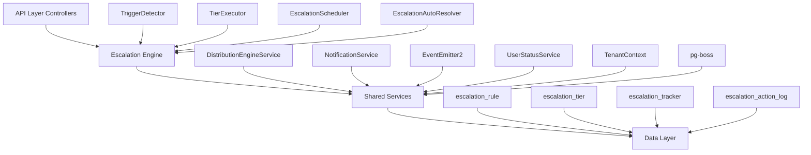

The Escalation Module automates responses when assigned leads go stale. A scheduled engine detects trigger conditions (no first contact, went cold) and executes tiered escalation actions — notifications, temperature changes, tag additions, and redistribution to new agents.

<Note>
This module is currently **Active** and fully implemented at `src/modules/crm/escalation/`
</Note>

## Design Principles

| Principle | Decision |
|-----------|----------|
| pg-boss scheduling | Escalation scheduler uses pg-boss recurring job for reliability |
| Tiered actions | Rules have ordered tiers with configurable delays; actions execute in sequence |
| Auto-resolution | Events (activity, stage change, reassignment) automatically resolve active trackers |
| Idempotency | Partial unique index + `ON CONFLICT DO NOTHING` prevents duplicate trackers |
| Distribution delegation | Reassignment uses the distribution engine (`REDISTRIBUTE` action), not a separate paradigm |
| RLS compliance | All entities carry `organization_id` for row-level security |

## Architecture

### High-Level Diagram



### Component Responsibilities

<CardGroup cols={2}>
<Card title="EscalationScheduler" icon="clock">
pg-boss recurring job that runs every 60 seconds to detect new triggers and process due escalations
</Card>

<Card title="TriggerDetector" icon="radar">
Scans leads for unmet conditions (no first contact, went cold); creates tracker records
</Card>

<Card title="TierExecutor" icon="play">
Executes escalation tier actions (notify, redistribute, change temp, add tag)
</Card>

<Card title="EscalationAutoResolver" icon="check-circle">
Listens to domain events and resolves active trackers when conditions change
</Card>
</CardGroup>

## Entity Specifications

### EscalationRule

Defines when and how a lead should be escalated. Evaluated by `TriggerDetector`.

| Column | Type | Notes |
|--------|------|-------|
| id | uuid PK | |
| organization_id | uuid FK | RLS |
| name | varchar | Human-readable rule name |
| is_active | bool | default true |
| priority | int | Evaluation order |
| trigger_type | enum | `NO_FIRST_CONTACT`, `WENT_COLD` |
| trigger_config | jsonb | `{thresholdMinutes?, thresholdValue?, thresholdUnit?}` |
| conditions | jsonb | `EscalationCondition[]` — AND-joined applicability filters; `[]` = all leads |
| respect_business_hours | bool | default true. References org business hours schedule. |
| created_by | uuid FK | |
| created_at, updated_at | timestamp | |
| is_deleted | bool | soft delete |

<Warning>
Rules are evaluated in ascending `priority` order (lower number = higher priority). Active rules must use unique priorities within the organization.
</Warning>

#### EscalationCondition Structure

```typescript
interface EscalationCondition {
  field: 'temperature' | 'leadSource' | 'language' | 'sourceChannel';
  operator: 'eq' | 'in';
  value: string | string[];
}
```

#### SQL Field Mapping

| Field | SQL Column | Table | Notes |
|-------|------------|-------|-------|
| `temperature` | `l.temperature` | lead | |
| `leadSource` | `l.lead_source` | lead | |
| `sourceChannel` | `l.source_channel` | lead | |
| `language` | `p.languages` | person | Adds `LEFT JOIN person p ON p.id = l.person_id`; matches JSONB entries by `languages[].code` |

### EscalationTier

Each tier in an escalation rule represents a delayed action set. Tiers execute in `tier_order` sequence.

| Column | Type | Notes |
|--------|------|-------|
| id | uuid PK | |
| escalation_rule_id | uuid FK | |
| organization_id | uuid FK | RLS |
| tier_order | int | 1, 2, 3... (max 10) |
| delay_minutes | int | Tier 1: always 0 — threshold is the sole timing control. Subsequent tiers: minutes after the previous tier completed. |
| actions | jsonb | `TierAction[]` — see Tier Actions below |

### Tier Action Types

| Action Type | Parameters | Resolution |
|-------------|------------|------------|
| `NOTIFY_AGENT` | `message?: string` | Resolved from lead's current stakeholder (assigned agent) |
| `NOTIFY_ADMIN` | `message?: string` | **Self-resolving** — queries all org users with the `system.admin` permission key |
| `NOTIFY_ROLE` | `roleId: string, message?: string` | Resolved from `UserOrgRole` entries |
| `NOTIFY_USER` | `userId: string, message?: string` | Direct user notification |
| `CHANGE_TEMPERATURE` | `temperature: LeadTemperature` | Updates lead temperature |
| `ADD_TAG` | `tagId: string` | Applies tag to lead |
| `REDISTRIBUTE` | `distributionStrategy?: DistributionStrategy` | Uses distribution engine for reassignment |

### EscalationTracker

Tracks active escalation processes for individual leads.

| Column | Type | Notes |
|--------|------|-------|
| id | uuid PK | |
| organization_id | uuid FK | RLS |
| lead_id | uuid FK | |
| escalation_rule_id | uuid FK | |
| trigger_type | enum | Snapshot from rule |
| current_tier | int | Next tier to execute (1-based) |
| next_execution_at | timestamp | When next tier should run |
| status | enum | `ACTIVE`, `RESOLVED`, `CANCELLED` |
| triggered_at | timestamp | When escalation started |
| resolved_at | timestamp | When escalation ended |
| resolution_reason | enum | `ACTIVITY_DETECTED`, `STAGE_CHANGED`, `REASSIGNED`, `MANUAL`, `RULE_DEACTIVATED` |

<Info>
Partial unique index prevents duplicate active trackers: `(lead_id, escalation_rule_id) WHERE status = 'ACTIVE'`
</Info>

## Escalation Engine

### TriggerDetector

<Steps>
<Step title="Query Eligible Leads">
Finds leads that match escalation rule criteria but lack active trackers
</Step>

<Step title="Apply Business Hours">
Respects organization business hours when `respect_business_hours` is true
</Step>

<Step title="Create Trackers">
Inserts new `EscalationTracker` records with idempotency protection
</Step>
</Steps>

#### NO_FIRST_CONTACT Trigger

```sql
-- Leads assigned but never contacted within threshold
SELECT l.id 
FROM lead l
LEFT JOIN activity a ON a.lead_id = l.id 
  AND a.type = 'FIRST_CONTACT'
WHERE l.assigned_to IS NOT NULL
  AND l.stage != 'CLOSED'
  AND a.id IS NULL
  AND l.assigned_at <= (NOW() - INTERVAL '${thresholdMinutes} minutes')
```

#### WENT_COLD Trigger

```sql
-- Leads with no recent activity beyond threshold
SELECT l.id
FROM lead l
LEFT JOIN activity a ON a.lead_id = l.id
WHERE l.assigned_to IS NOT NULL
  AND l.stage != 'CLOSED'
  AND (
    SELECT MAX(a2.created_at)
    FROM activity a2
    WHERE a2.lead_id = l.id
  ) <= (NOW() - INTERVAL '${thresholdMinutes} minutes')
```

### TierExecutor

<Tabs>
<Tab title="Execution Flow">
1. **Fetch Due Trackers**: Query trackers where `next_execution_at <= NOW()`
2. **Load Tier Configuration**: Get actions for current tier
3. **Execute Actions**: Process each action in sequence
4. **Update Tracker**: Advance to next tier or mark complete
5. **Log Actions**: Record execution details in `escalation_action_log`
</Tab>

<Tab title="Action Resolution">
- **NOTIFY_* Actions**: Resolve target users and send notifications
- **CHANGE_TEMPERATURE**: Update lead record directly
- **ADD_TAG**: Create lead-tag association
- **REDISTRIBUTE**: Delegate to distribution engine with strategy
</Tab>
</Tabs>

### EscalationAutoResolver

Listens for domain events that should terminate active escalations:

<AccordionGroup>
<Accordion title="Activity Events">
- `activity.created` → Resolves with reason `ACTIVITY_DETECTED`
- Applies to all trigger types
</Accordion>

<Accordion title="Lead Events">
- `lead.stage_changed` → Resolves with reason `STAGE_CHANGED`
- `lead.reassigned` → Resolves with reason `REASSIGNED`
- Only processes if lead stage is not `CLOSED`
</Accordion>

<Accordion title="Rule Events">
- `escalation_rule.deactivated` → Resolves with reason `RULE_DEACTIVATED`
- `escalation_rule.deleted` → Resolves with reason `RULE_DEACTIVATED`
</Accordion>
</AccordionGroup>

## API Endpoints

### EscalationRule Management

<CodeGroup>
```typescript GET /api/escalation-rules
// List escalation rules with filters
interface GetEscalationRulesQuery {
  page?: number;
  limit?: number;
  isActive?: boolean;
  triggerType?: EscalationTriggerType;
}

interface EscalationRuleListItem {
  id: string;
  name: string;
  isActive: boolean;
  priority: number;
  triggerType: EscalationTriggerType;
  triggerConfig: EscalationTriggerConfig;
  tierCount: number;
  createdAt: string;
  updatedAt: string;
}
```

```typescript POST /api/escalation-rules
// Create new escalation rule
interface CreateEscalationRuleDto {
  name: string;
  triggerType: EscalationTriggerType;
  triggerConfig: EscalationTriggerConfig;
  conditions: EscalationCondition[];
  respectBusinessHours: boolean;
  tiers: CreateEscalationTierDto[];
}

interface CreateEscalationTierDto {
  tierOrder: number;
  delayMinutes: number;
  actions: TierAction[];
}
```

```typescript GET /api/escalation-rules/:id
// Get escalation rule details
interface EscalationRuleDetail extends EscalationRuleListItem {
  conditions: EscalationCondition[];
  respectBusinessHours: boolean;
  tiers: EscalationTierDetail[];
  createdBy: { id: string; name: string };
}
```
</CodeGroup>

### Analytics Endpoints

<CodeGroup>
```typescript GET /api/escalation-analytics/overview
interface EscalationOverviewQuery {
  dateFrom?: string;
  dateTo?: string;
  ruleIds?: string[];
}

interface EscalationOverview {
  totalTriggered: number;
  totalResolved: number;
  averageResolutionTime: number; // minutes
  resolutionReasons: Record<EscalationResolutionReason, number>;
  triggerTypeBreakdown: Record<EscalationTriggerType, number>;
}
```

```typescript GET /api/escalation-analytics/rule-performance
interface RulePerformanceMetrics {
  ruleId: string;
  ruleName: string;
  triggeredCount: number;
  resolvedCount: number;
  averageResolutionTime: number;
  tierCompletionRates: number[]; // completion rate per tier
}
```
</CodeGroup>

## Security & Permissions

### Required Permissions

| Action | Permission Key | Notes |
|--------|----------------|-------|
| View escalation rules | `escalation.view` | Read access to rules and analytics |
| Create/edit rules | `escalation.manage` | Full CRUD operations |
| View analytics | `escalation.analytics` | Access to performance metrics |

### Row-Level Security

<Warning>
All escalation entities include `organization_id` and are subject to RLS policies that filter by current user's organization context.
</Warning>

```sql
-- Example RLS policy for escalation_rule
CREATE POLICY escalation_rule_org_isolation ON escalation_rule
  USING (organization_id = current_setting('app.current_organization_id')::uuid);
```

## Performance & Scaling

### Database Optimizations

<Tabs>
<Tab title="Indexes">
```sql
-- Critical indexes for escalation performance
CREATE INDEX idx_escalation_tracker_next_execution 
  ON escalation_tracker (next_execution_at) 
  WHERE status = 'ACTIVE';

CREATE INDEX idx_lead_assigned_stage 
  ON lead (assigned_to, stage, assigned_at) 
  WHERE assigned_to IS NOT NULL AND stage != 'CLOSED';

CREATE INDEX idx_activity_lead_created 
  ON activity (lead_id, created_at DESC);
```
</Tab>

<Tab title="Query Optimization">
- **Trigger Detection**: Uses covering indexes to avoid table scans
- **Business Hours**: Cached organization settings to reduce lookups  
- **Batch Processing**: Processes escalations in configurable batch sizes
- **Connection Pooling**: Leverages pg-boss connection management
</Tab>
</Tabs>

### Scaling Considerations

<Info>
The escalation engine is designed to handle high-volume scenarios:
- **Horizontal Scaling**: pg-boss supports multiple worker instances
- **Rate Limiting**: Configurable batch sizes prevent resource exhaustion
- **Circuit Breaker**: Failed escalations are retried with exponential backoff
</Info>

## Integration Points

### Distribution Engine

The `REDISTRIBUTE` action delegates lead reassignment to the existing distribution engine:

```typescript
await this.distributionEngine.redistributeLead(leadId, {
  strategy: action.distributionStrategy || 'ROUND_ROBIN',
  excludeCurrentAgent: true,
  reason: 'ESCALATION'
});
```

### Notification Service

All notification actions use the centralized notification service:

```typescript
await this.notificationService.send({
  type: 'ESCALATION_ALERT',
  recipients: resolvedUsers,
  content: {
    message: action.message || defaultMessage,
    leadId: tracker.leadId,
    ruleName: tracker.escalationRule.name
  }
});
```

### Event System

<Steps>
<Step title="Event Emission">
Escalation engine emits events for audit and integration:
- `escalation.triggered`
- `escalation.tier_executed` 
- `escalation.resolved`
</Step>

<Step title="Event Consumption">
Auto-resolver listens for domain events:
- `activity.created`
- `lead.stage_changed`
- `lead.reassigned`
</Step>
</Steps>

## Edge Case Handling

### Business Hours Respect

<AccordionGroup>
<Accordion title="Threshold Calculation">
When `respect_business_hours` is true, only business hours count toward trigger thresholds. For example, a 4-hour threshold might span 2 calendar days if it includes non-business hours.
</Accordion>

<Accordion title="Execution Timing">
Tier execution is deferred to the next business hours period if the current time falls outside business hours.
</Accordion>
</AccordionGroup>

### Concurrent Modifications

<Warning>
The system handles concurrent scenarios gracefully:
- **Rule Priority Conflicts**: Backend rejects conflicting priority assignments
- **Lead Reassignment**: Active trackers are resolved when leads are reassigned
- **Rule Deactivation**: All active trackers for deactivated rules are cancelled
</Warning>

### Data Consistency

- **Soft Deletes**: Rules use soft deletion to preserve tracker history
- **Idempotent Operations**: Duplicate tracker creation is prevented by unique constraints
- **Transaction Safety**: Critical operations use database transactions for atomicity

<Check>
This specification provides a comprehensive overview of the Escalation Module. For implementation details, refer to the source code at `src/modules/crm/escalation/`.
</Check>