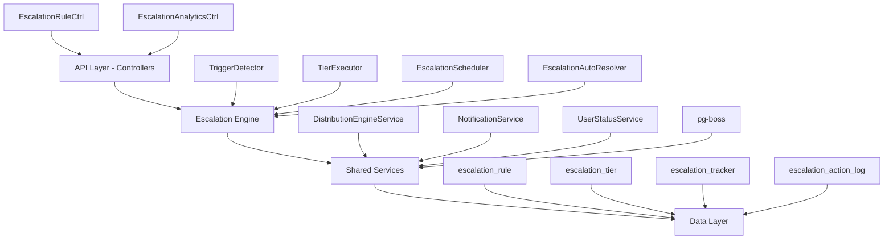

<Note>
**Status:** Active — fully implemented  
**Module Path:** `src/modules/crm/escalation/`
</Note>

The Escalation Module automates responses when assigned leads go stale. A scheduled engine detects trigger conditions (no first contact, went cold) and executes tiered escalation actions — notifications, temperature changes, tag additions, and redistribution to new agents.

## Design Principles

<AccordionGroup>
<Accordion title="Core Design Decisions">

| Principle               | Decision                                                                                   |
| ----------------------- | ------------------------------------------------------------------------------------------ |
| pg-boss scheduling      | Escalation scheduler uses pg-boss recurring job for reliability                            |
| Tiered actions          | Rules have ordered tiers with configurable delays; actions execute in sequence             |
| Auto-resolution         | Events (activity, stage change, reassignment) automatically resolve active trackers        |
| Idempotency             | Partial unique index + `ON CONFLICT DO NOTHING` prevents duplicate trackers                |
| Distribution delegation | Reassignment uses the distribution engine (`REDISTRIBUTE` action), not a separate paradigm |
| RLS compliance          | All entities carry `organization_id` for row-level security                                |

</Accordion>
</AccordionGroup>

## Architecture

### High-Level Diagram



### Component Responsibilities

<CardGroup cols={2}>
<Card title="EscalationScheduler" icon="clock">
pg-boss recurring job that runs every 60 seconds to detect new triggers and process due escalations
</Card>

<Card title="TriggerDetector" icon="radar">
Scans leads for unmet conditions (no first contact, went cold); creates tracker records
</Card>

<Card title="TierExecutor" icon="play">
Executes escalation tier actions (notify, redistribute, change temp, add tag)
</Card>

<Card title="EscalationAutoResolver" icon="check-circle">
Listens to domain events and resolves active trackers when conditions change
</Card>
</CardGroup>

## Entity Specifications

### EscalationRule

Defines when and how a lead should be escalated. Evaluated by `TriggerDetector`.

<Tabs>
<Tab title="Schema">

| Column                 | Type      | Notes                                                                        |
| ---------------------- | --------- | ---------------------------------------------------------------------------- |
| id                     | uuid PK   |                                                                              |
| organization_id        | uuid FK   | RLS                                                                          |
| name                   | varchar   | Human-readable rule name                                                     |
| is_active              | bool      | default true                                                                 |
| priority               | int       | Evaluation order                                                             |
| trigger_type           | enum      | `NO_FIRST_CONTACT`, `WENT_COLD`                                              |
| trigger_config         | jsonb     | `{thresholdMinutes?, thresholdValue?, thresholdUnit?}`                       |
| conditions             | jsonb     | `EscalationCondition[]` — AND-joined applicability filters; `[]` = all leads |
| respect_business_hours | bool      | default true. References org business hours schedule.                        |
| created_by             | uuid FK   |                                                                              |
| created_at, updated_at | timestamp |                                                                              |
| is_deleted             | bool      | soft delete                                                                  |

</Tab>
<Tab title="Priority Logic">

<Warning>
Rules are evaluated in ascending `priority` order (lower number = higher priority). Active rules must use unique priorities within the organization.
</Warning>

**Priority Assignment:**
- **Create mode:** Frontend defaults `priority` to one greater than the highest active escalation rule priority
- **Edit mode:** Preserves existing rule priority
- **Validation:** Frontend disables submission when an active rule would reuse another active rule's priority

**Backend Enforcement:**
The backend enforces priority uniqueness on create, priority update, and reactivation. If another active, non-deleted rule in the same organization uses the requested priority, the write is rejected with `400 Bad Request`.

<Note>
Inactive rules may keep duplicate priorities until activation.
</Note>

</Tab>
</Tabs>

#### EscalationCondition Interface

```typescript
interface EscalationCondition {
  field: 'temperature' | 'leadSource' | 'language' | 'sourceChannel';
  operator: 'eq' | 'in';
  value: string | string[];
}
```

**SQL Field Mapping** (used by `TriggerDetector.buildApplicabilityExtraWhere`):

| Field           | SQL Column         | Table  | Notes                                                                                        |
| --------------- | ------------------ | ------ | -------------------------------------------------------------------------------------------- |
| `temperature`   | `l.temperature`    | lead   |                                                                                              |
| `leadSource`    | `l.lead_source`    | lead   |                                                                                              |
| `sourceChannel` | `l.source_channel` | lead   |                                                                                              |
| `language`      | `p.languages`      | person | Adds `LEFT JOIN person p ON p.id = l.person_id`; matches JSONB entries by `languages[].code` |

### EscalationTier

Each tier in an escalation rule represents a delayed action set. Tiers execute in `tier_order` sequence.

| Column             | Type    | Notes                                                                                                                                     |
| ------------------ | ------- | ----------------------------------------------------------------------------------------------------------------------------------------- |
| id                 | uuid PK |                                                                                                                                           |
| escalation_rule_id | uuid FK |                                                                                                                                           |
| organization_id    | uuid FK | RLS                                                                                                                                       |
| tier_order         | int     | 1, 2, 3... (max 10)                                                                                                                       |
| delay_minutes      | int     | Tier 1 (lowest tier_order): always 0 — threshold is the sole timing control. Subsequent tiers: minutes after the previous tier completed. |
| actions            | jsonb   | `TierAction[]` — see Tier Actions below                                                                                                   |

#### Tier Action Types

<AccordionGroup>
<Accordion title="NOTIFY_AGENT">
**Parameters:** `message?: string`

**Resolution:** Resolved from lead's current stakeholder (assigned agent)
</Accordion>

<Accordion title="NOTIFY_ADMIN">
**Parameters:** `message?: string`

**Resolution:** Self-resolving — queries all org users with the `system.admin` permission key via `UserOrgRole → RolePermission → Permission`. Skipped if no admin users found.
</Accordion>

<Accordion title="REDISTRIBUTE">
**Parameters:** `targetType: 'TEAM' | 'USER'`, `targetId?: string`, `distributionAlgorithm?: string`

**Resolution:** Uses distribution engine to reassign lead. If `targetType` is `USER` and `targetId` is provided, assigns directly to that user.
</Accordion>

<Accordion title="CHANGE_TEMPERATURE">
**Parameters:** `newTemperature: 'COLD' | 'WARM' | 'HOT'`

**Resolution:** Updates lead temperature directly
</Accordion>

<Accordion title="ADD_TAG">
**Parameters:** `tagName: string`

**Resolution:** Creates or finds tag and associates with lead
</Accordion>
</AccordionGroup>

### EscalationTracker

Tracks active escalation instances for specific leads.

<Tabs>
<Tab title="Schema">

| Column               | Type      | Notes                                           |
| -------------------- | --------- | ----------------------------------------------- |
| id                   | uuid PK   |                                                 |
| organization_id      | uuid FK   | RLS                                             |
| escalation_rule_id   | uuid FK   |                                                 |
| lead_id              | uuid FK   |                                                 |
| trigger_type         | enum      | `NO_FIRST_CONTACT`, `WENT_COLD`                 |
| current_tier         | int       | 1, 2, 3... (corresponds to tier_order)         |
| next_execution_at    | timestamp | When the next tier should execute               |
| status               | enum      | `ACTIVE`, `COMPLETED`, `CANCELLED`, `RESOLVED`  |
| triggered_at         | timestamp | When escalation was first triggered             |
| resolved_at          | timestamp | When escalation was resolved/completed          |
| created_at           | timestamp |                                                 |

</Tab>
<Tab title="Unique Constraints">

<Info>
Partial unique index prevents duplicate trackers:
`CREATE UNIQUE INDEX escalation_tracker_unique_active ON escalation_tracker (organization_id, lead_id, escalation_rule_id) WHERE status = 'ACTIVE'`
</Info>

This ensures only one active tracker per lead-rule combination.

</Tab>
</Tabs>

### EscalationActionLog

Audit trail for all escalation actions taken.

| Column               | Type      | Notes                                    |
| -------------------- | --------- | ---------------------------------------- |
| id                   | uuid PK   |                                          |
| organization_id      | uuid FK   | RLS                                      |
| escalation_tracker_id| uuid FK   |                                          |
| tier_order           | int       |                                          |
| action_type          | enum      | `NOTIFY_AGENT`, `REDISTRIBUTE`, etc.     |
| action_params        | jsonb     | Parameters passed to action              |
| executed_at          | timestamp |                                          |
| execution_status     | enum      | `SUCCESS`, `FAILED`, `SKIPPED`           |
| error_details        | text      | Error message if execution failed        |

## Escalation Engine

### TriggerDetector

<Steps>
<Step title="Query Active Rules">
Fetches all active escalation rules for the organization, ordered by priority
</Step>

<Step title="Scan Leads">
For each rule, queries leads matching the trigger conditions:
- **NO_FIRST_CONTACT:** Leads with no activities of type 'CALL', 'EMAIL', 'MEETING' within threshold
- **WENT_COLD:** Leads that changed to 'COLD' temperature within threshold and haven't been escalated yet
</Step>

<Step title="Apply Conditions">
Filters leads based on rule conditions using `buildApplicabilityExtraWhere()`
</Step>

<Step title="Create Trackers">
Creates tracker records with `ON CONFLICT DO NOTHING` for idempotency
</Step>
</Steps>

### TierExecutor

Processes escalation trackers that are due for execution:

<CodeGroup>
```sql SQL Query
SELECT et.* FROM escalation_tracker et
JOIN escalation_rule er ON er.id = et.escalation_rule_id
WHERE et.organization_id = $1
  AND et.status = 'ACTIVE'
  AND et.next_execution_at <= NOW()
  AND er.is_active = true
  AND er.is_deleted = false
ORDER BY et.next_execution_at ASC
```

```typescript Execution Flow
async executeEscalationTier(tracker: EscalationTracker) {
  const tier = await this.getTierForTracker(tracker);
  
  for (const action of tier.actions) {
    try {
      await this.executeAction(action, tracker);
      await this.logActionExecution(tracker, action, 'SUCCESS');
    } catch (error) {
      await this.logActionExecution(tracker, action, 'FAILED', error);
    }
  }
  
  await this.advanceToNextTier(tracker);
}
```
</CodeGroup>

### EscalationAutoResolver

<Warning>
Listens to domain events and automatically resolves active trackers when conditions change
</Warning>

**Trigger Events:**
- Lead activity created
- Lead stage changed
- Lead reassigned
- Lead temperature changed

```typescript
@OnEvent('lead.activity.created')
async handleLeadActivity(event: LeadActivityCreatedEvent) {
  await this.resolveEscalationsForLead(
    event.leadId, 
    'Lead activity detected'
  );
}

@OnEvent('lead.updated')
async handleLeadUpdate(event: LeadUpdatedEvent) {
  if (event.changes.stage || event.changes.assignedTo) {
    await this.resolveEscalationsForLead(
      event.leadId, 
      'Lead updated'
    );
  }
}
```

## API Endpoints

<Tabs>
<Tab title="Rules">

### Escalation Rules

**GET** `/api/escalation/rules`
- **Purpose:** List escalation rules for organization
- **Query Params:** `includeInactive?: boolean`
- **Response:** `EscalationRule[]` with populated tiers

**POST** `/api/escalation/rules`
- **Purpose:** Create new escalation rule
- **Body:** `CreateEscalationRuleDto`
- **Validation:** Priority uniqueness, tier order validation

**PUT** `/api/escalation/rules/:id`
- **Purpose:** Update escalation rule
- **Body:** `UpdateEscalationRuleDto`
- **Validation:** Priority conflicts, active tracker handling

**DELETE** `/api/escalation/rules/:id`
- **Purpose:** Soft delete rule and cancel active trackers
- **Response:** `204 No Content`

</Tab>
<Tab title="Analytics">

### Escalation Analytics

**GET** `/api/escalation/analytics/overview`
- **Purpose:** High-level escalation metrics
- **Query Params:** `startDate`, `endDate`, `ruleId?`
- **Response:** Trigger counts, resolution rates, avg resolution time

**GET** `/api/escalation/analytics/rule-performance`
- **Purpose:** Per-rule performance metrics
- **Response:** Success rates, action effectiveness, timing analysis

**GET** `/api/escalation/analytics/action-logs`
- **Purpose:** Detailed action execution history
- **Query Params:** Pagination, filtering by rule, lead, action type
- **Response:** Paginated action logs with execution details

</Tab>
</Tabs>

## Security & Permissions

### Required Permissions

<CardGroup cols={2}>
<Card title="escalation.rules.manage" icon="shield">
Create, update, delete escalation rules
</Card>

<Card title="escalation.analytics.view" icon="chart-line">
Access escalation analytics and reports
</Card>

<Card title="escalation.trackers.view" icon="eye">
View active escalation trackers
</Card>

<Card title="escalation.trackers.resolve" icon="check">
Manually resolve escalation trackers
</Card>
</CardGroup>

### Row Level Security

All escalation entities include `organization_id` for RLS enforcement:

```sql
-- Example RLS Policy
CREATE POLICY escalation_rule_org_access ON escalation_rule
FOR ALL TO authenticated
USING (organization_id = current_setting('app.current_organization_id')::uuid);
```

<Note>
The `TenantContext` service automatically sets `app.current_organization_id` for all database queries.
</Note>

## Performance & Scaling

### Optimization Strategies

<AccordionGroup>
<Accordion title="Database Indexes">

**Critical Indexes:**
- `escalation_tracker_next_execution` for scheduler queries
- `escalation_tracker_lead_rule_status` for duplicate prevention
- `escalation_rule_org_priority` for rule evaluation order
- `lead_temperature_updated_at` for WENT_COLD triggers

</Accordion>

<Accordion title="Batch Processing">

The escalation scheduler processes trackers in batches:
- Default batch size: 100 trackers
- Configurable via `ESCALATION_BATCH_SIZE` environment variable
- Implements exponential backoff for failed executions

</Accordion>

<Accordion title="Caching Strategy">

- **Rule caching:** Active rules cached for 5 minutes
- **Business hours:** Organization business hours cached for 1 hour
- **User permissions:** Permission checks cached per request

</Accordion>
</AccordionGroup>

### Monitoring

<Tip>
Key metrics to monitor:
- Escalation trigger rate
- Action execution success rate
- Average resolution time
- Scheduler job health
- Database query performance
</Tip>

## Integration Points

### Distribution Engine

Escalation module delegates lead reassignment to the distribution engine:

```typescript
interface RedistributeAction {
  type: 'REDISTRIBUTE';
  targetType: 'TEAM' | 'USER';
  targetId?: string;
  distributionAlgorithm?: 'ROUND_ROBIN' | 'WORKLOAD_BASED';
}
```

### Notification System

All notification actions use the centralized notification service:

```typescript
await this.notificationService.sendNotification({
  recipientId: agentId,
  type: 'ESCALATION_ALERT',
  title: 'Lead Escalation',
  message: actionParams.message || defaultMessage,
  metadata: {
    leadId: tracker.lead_id,
    escalationRuleId: tracker.escalation_rule_id
  }
});
```

### Event System

The module both emits and listens to domain events:

**Emitted Events:**
- `escalation.triggered`
- `escalation.tier.executed`
- `escalation.resolved`

**Listened Events:**
- `lead.activity.created`
- `lead.updated`
- `lead.assigned`

<Check>
The Escalation Module is fully integrated with the CRM system and ready for production use.
</Check>