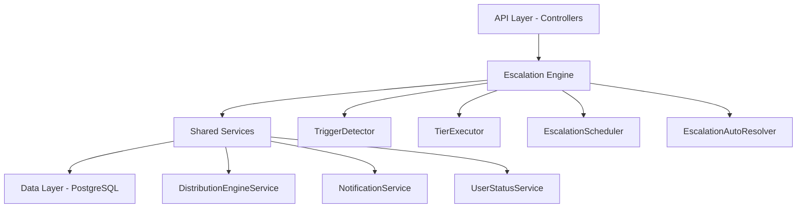

The Escalation Module automates responses when assigned leads go stale. A scheduled engine detects trigger conditions (no first contact, went cold) and executes tiered escalation actions — notifications, temperature changes, tag additions, and redistribution to new agents.

<Note>
**Status:** Active — fully implemented  
**Module Path:** `src/modules/crm/escalation/`
</Note>

## Overview

The Escalation Module provides automated lead management through configurable rules and tiered actions. When leads meet specific trigger conditions, the system automatically executes escalation workflows to ensure no opportunities are missed.

### Design Principles

| Principle | Decision |
|-----------|----------|
| pg-boss scheduling | Escalation scheduler uses pg-boss recurring job for reliability |
| Tiered actions | Rules have ordered tiers with configurable delays; actions execute in sequence |
| Auto-resolution | Events (activity, stage change, reassignment) automatically resolve active trackers |
| Idempotency | Partial unique index + `ON CONFLICT DO NOTHING` prevents duplicate trackers |
| Distribution delegation | Reassignment uses the distribution engine (`REDISTRIBUTE` action), not a separate paradigm |
| RLS compliance | All entities carry `organization_id` for row-level security |

## Architecture

### High-Level System Design



### Component Responsibilities

<AccordionGroup>
<Accordion title="EscalationScheduler">
pg-boss recurring job that runs every 60 seconds to detect new triggers and process due escalations
</Accordion>

<Accordion title="TriggerDetector">
Scans leads for unmet conditions (no first contact, went cold); creates tracker records
</Accordion>

<Accordion title="TierExecutor">
Executes escalation tier actions (notify, redistribute, change temp, add tag)
</Accordion>

<Accordion title="EscalationAutoResolver">
Listens to domain events and resolves active trackers when conditions change
</Accordion>

<Accordion title="EscalationRuleService">
CRUD for escalation rules; handles tracker cancellation on deactivation/deletion
</Accordion>
</AccordionGroup>

## Entity Specifications

### EscalationRule

Defines when and how a lead should be escalated. Evaluated by `TriggerDetector`.

| Column | Type | Notes |
|--------|------|-------|
| id | uuid PK | |
| organization_id | uuid FK | RLS |
| name | varchar | Human-readable rule name |
| is_active | bool | default true |
| priority | int | Evaluation order |
| trigger_type | enum | `NO_FIRST_CONTACT`, `WENT_COLD` |
| trigger_config | jsonb | `{thresholdMinutes?, thresholdValue?, thresholdUnit?}` |
| conditions | jsonb | `EscalationCondition[]` — AND-joined applicability filters |
| respect_business_hours | bool | default true. References org business hours schedule |
| created_by | uuid FK | |
| created_at, updated_at | timestamp | |
| is_deleted | bool | soft delete |

<Warning>
Rules are evaluated in ascending `priority` order (lower number = higher priority). Active rules must use unique priorities within the organization.
</Warning>

#### EscalationCondition Schema

```typescript
interface EscalationCondition {
  field: 'temperature' | 'leadSource' | 'language' | 'sourceChannel';
  operator: 'eq' | 'in';
  value: string | string[];
}
```

#### SQL Field Mapping

| Field | SQL Column | Table | Notes |
|-------|------------|-------|-------|
| `temperature` | `l.temperature` | lead | |
| `leadSource` | `l.lead_source` | lead | |
| `sourceChannel` | `l.source_channel` | lead | |
| `language` | `p.languages` | person | Adds `LEFT JOIN person p ON p.id = l.person_id` |

### EscalationTier

Each tier represents a delayed action set. Tiers execute in `tier_order` sequence.

| Column | Type | Notes |
|--------|------|-------|
| id | uuid PK | |
| escalation_rule_id | uuid FK | |
| organization_id | uuid FK | RLS |
| tier_order | int | 1, 2, 3... (max 10) |
| delay_minutes | int | Tier 1: always 0; subsequent tiers: minutes after previous |
| actions | jsonb | `TierAction[]` |

### Tier Action Types

<Tabs>
<Tab title="Notification Actions">

| Action Type | Parameters | Resolution |
|-------------|------------|------------|
| `NOTIFY_AGENT` | `message?: string` | Resolved from lead's current stakeholder |
| `NOTIFY_ADMIN` | `message?: string` | Queries all org users with `system.admin` permission |
| `NOTIFY_MANAGER` | `userId: string, message?: string` | Direct user notification |

</Tab>
<Tab title="Lead Actions">

| Action Type | Parameters | Effect |
|-------------|------------|---------|
| `CHANGE_TEMPERATURE` | `temperature: string` | Updates lead temperature |
| `ADD_TAG` | `tagId: string` | Adds tag to lead |
| `REDISTRIBUTE` | `teamIds?: string[], userIds?: string[]` | Reassigns lead using distribution engine |

</Tab>
</Tabs>

### EscalationTracker

Tracks active escalations for individual leads.

| Column | Type | Notes |
|--------|------|-------|
| id | uuid PK | |
| organization_id | uuid FK | RLS |
| lead_id | uuid FK | |
| escalation_rule_id | uuid FK | |
| current_tier | int | Current tier being processed |
| next_tier_due_at | timestamp | When next tier should execute |
| status | enum | `ACTIVE`, `RESOLVED`, `CANCELLED` |
| resolution_reason | enum | `LEAD_ACTIVITY`, `STAGE_CHANGE`, etc. |
| created_at, updated_at | timestamp | |

<Info>
Partial unique index prevents duplicate active trackers: `(lead_id, escalation_rule_id) WHERE status = 'ACTIVE'`
</Info>

## Escalation Engine

### TriggerDetector

Scans for leads meeting escalation criteria.

<Steps>
<Step title="Query Active Rules">
Fetches all active escalation rules ordered by priority
</Step>

<Step title="Build Lead Query">
Constructs SQL query based on trigger type and conditions
</Step>

<Step title="Execute Detection">
Finds leads without active trackers for each rule
</Step>

<Step title="Create Trackers">
Creates new escalation tracker records with `ON CONFLICT DO NOTHING`
</Step>
</Steps>

#### Trigger Types

<CodeGroup>
```sql NO_FIRST_CONTACT
SELECT DISTINCT l.id as lead_id
FROM lead l
LEFT JOIN activity a ON a.lead_id = l.id 
  AND a.activity_type IN ('EMAIL_SENT', 'CALL_MADE', 'MEETING_SCHEDULED')
WHERE l.organization_id = $1
  AND l.assigned_user_id IS NOT NULL
  AND l.stage != 'UNQUALIFIED'
  AND l.created_at <= NOW() - INTERVAL '${thresholdMinutes} minutes'
  AND a.id IS NULL
```

```sql WENT_COLD
SELECT l.id as lead_id
FROM lead l
WHERE l.organization_id = $1
  AND l.assigned_user_id IS NOT NULL
  AND l.stage != 'UNQUALIFIED'
  AND l.temperature = 'COLD'
  AND l.last_activity_at <= NOW() - INTERVAL '${thresholdMinutes} minutes'
```
</CodeGroup>

### TierExecutor

Processes due escalation tiers and executes configured actions.

<Steps>
<Step title="Fetch Due Trackers">
Queries trackers where `next_tier_due_at <= NOW()`
</Step>

<Step title="Load Context">
Fetches lead, rule, and tier data
</Step>

<Step title="Execute Actions">
Processes each action in the tier sequentially
</Step>

<Step title="Update Tracker">
Advances to next tier or marks as resolved
</Step>
</Steps>

### EscalationAutoResolver

Listens for domain events and automatically resolves active trackers.

#### Resolution Events

| Event | Trigger | Reason |
|-------|---------|---------|
| `lead.activity.created` | New activity on lead | `LEAD_ACTIVITY` |
| `lead.stage.changed` | Stage transition | `STAGE_CHANGE` |
| `lead.assigned` | Agent reassignment | `REASSIGNED` |
| `lead.unqualified` | Lead marked unqualified | `STAGE_CHANGE` |

<Note>
Resolution uses bulk updates for performance: `UPDATE escalation_tracker SET status = 'RESOLVED' WHERE lead_id = ? AND status = 'ACTIVE'`
</Note>

## API Endpoints

### Escalation Rules

<AccordionGroup>
<Accordion title="GET /escalation/rules">
**List escalation rules**

Query Parameters:
- `page?: number` - Page number (default: 1)
- `limit?: number` - Items per page (default: 20)
- `sortBy?: string` - Sort field (default: 'priority')
- `sortOrder?: 'asc' | 'desc'` - Sort direction
- `isActive?: boolean` - Filter by active status

Response:
```typescript
{
  data: EscalationRuleDto[],
  pagination: PaginationDto
}
```
</Accordion>

<Accordion title="POST /escalation/rules">
**Create escalation rule**

Body:
```typescript
{
  name: string,
  triggerType: 'NO_FIRST_CONTACT' | 'WENT_COLD',
  triggerConfig: object,
  conditions?: EscalationCondition[],
  respectBusinessHours?: boolean,
  tiers: CreateTierDto[]
}
```
</Accordion>

<Accordion title="PUT /escalation/rules/:id">
**Update escalation rule**

Same body structure as create endpoint.
</Accordion>

<Accordion title="DELETE /escalation/rules/:id">
**Delete escalation rule**

Soft deletes the rule and cancels all active trackers.
</Accordion>
</AccordionGroup>

### Analytics

<AccordionGroup>
<Accordion title="GET /escalation/analytics/overview">
**Get escalation overview metrics**

Query Parameters:
- `dateFrom?: string` - ISO date string
- `dateTo?: string` - ISO date string
- `teamIds?: string[]` - Filter by teams
- `userIds?: string[]` - Filter by users

Response:
```typescript
{
  totalEscalations: number,
  activeTrackers: number,
  resolvedTrackers: number,
  averageResolutionTime: number,
  escalationsByRule: Array<{
    ruleId: string,
    ruleName: string,
    count: number
  }>
}
```
</Accordion>

<Accordion title="GET /escalation/analytics/performance">
**Get escalation performance metrics**

Returns resolution rates, response times, and trend data.
</Accordion>
</AccordionGroup>

## Security & Permissions

### Required Permissions

| Action | Permission | Notes |
|--------|------------|-------|
| View rules | `escalation.rules.read` | |
| Create/edit rules | `escalation.rules.write` | |
| Delete rules | `escalation.rules.delete` | |
| View analytics | `escalation.analytics.read` | |

### Row-Level Security

All escalation entities include `organization_id` for RLS enforcement:

```sql
CREATE POLICY escalation_rule_org_policy ON escalation_rule
  FOR ALL TO authenticated
  USING (organization_id = current_setting('app.current_organization_id')::uuid);
```

<Warning>
Notification resolution queries must respect RLS when fetching user lists for admin notifications.
</Warning>

## Analytics & Metrics

### Key Metrics

<CardGroup cols={2}>
<Card title="Escalation Volume" icon="chart-line">
- Total escalations triggered
- Active vs resolved trackers
- Escalations by rule and tier
</Card>

<Card title="Performance Metrics" icon="stopwatch">
- Average resolution time
- Response time to first action
- Success rate by escalation type
</Card>

<Card title="Agent Impact" icon="users">
- Notifications sent per agent
- Escalation resolution rates
- Lead redistribution patterns
</Card>

<Card title="Rule Effectiveness" icon="target">
- Trigger accuracy
- False positive rates
- Business hour compliance
</Card>
</CardGroup>

### Reporting Queries

<CodeGroup>
```sql Escalation Summary
SELECT 
  er.name as rule_name,
  COUNT(et.id) as total_escalations,
  COUNT(CASE WHEN et.status = 'ACTIVE' THEN 1 END) as active_count,
  COUNT(CASE WHEN et.status = 'RESOLVED' THEN 1 END) as resolved_count,
  AVG(EXTRACT(EPOCH FROM (et.updated_at - et.created_at))/60) as avg_duration_minutes
FROM escalation_tracker et
JOIN escalation_rule er ON er.id = et.escalation_rule_id
WHERE et.organization_id = $1
  AND et.created_at >= $2
  AND et.created_at <= $3
GROUP BY er.id, er.name
ORDER BY total_escalations DESC;
```

```sql Resolution Trends
SELECT 
  DATE_TRUNC('day', et.created_at) as date,
  COUNT(*) as escalations_created,
  COUNT(CASE WHEN et.status = 'RESOLVED' THEN 1 END) as escalations_resolved
FROM escalation_tracker et
WHERE et.organization_id = $1
  AND et.created_at >= $2
  AND et.created_at <= $3
GROUP BY DATE_TRUNC('day', et.created_at)
ORDER BY date;
```
</CodeGroup>

## Edge Case Handling

<AccordionGroup>
<Accordion title="Business Hours Compliance">
When `respect_business_hours = true`, escalations only trigger during configured business hours. The system queues actions until the next business period if triggered outside hours.
</Accordion>

<Accordion title="Agent Availability">
If the assigned agent is inactive or unavailable, `NOTIFY_AGENT` actions are skipped. The system logs this as a failed action but continues with remaining tier actions.
</Accordion>

<Accordion title="Concurrent Rule Updates">
Active trackers continue executing under their original rule configuration even if the rule is modified. New trackers use the updated rule configuration.
</Accordion>

<Accordion title="Lead Reassignment During Escalation">
When a lead is reassigned, all active escalation trackers are resolved with reason `REASSIGNED`. New triggers will evaluate under the new assignment.
</Accordion>

<Accordion title="Distribution Engine Failures">
If `REDISTRIBUTE` actions fail, the escalation continues but logs the failure. Manual intervention may be required for lead reassignment.
</Accordion>
</AccordionGroup>

## Performance & Scaling

### Optimization Strategies

<Tabs>
<Tab title="Database">
- Partial indexes on escalation tracker status
- Composite indexes for trigger detection queries
- Partitioning on `created_at` for historical data
</Tab>

<Tab title="Scheduling">
- pg-boss queue management and job concurrency limits
- Batch processing for large trigger detection runs
- Circuit breakers for external service dependencies
</Tab>

<Tab title="Caching">
- Cache active escalation rules in Redis
- Memoize business hours calculations
- Cache user permission lookups for notifications
</Tab>
</Tabs>

### Monitoring

<Check>**Key Performance Indicators**</Check>

- Escalation detection runtime
- Action execution success rates
- Queue depth and processing lag
- Database query performance
- Memory usage during batch operations

## Integration Points

### External Dependencies

| Service | Purpose | Fallback |
|---------|---------|----------|
| NotificationService | Send escalation notifications | Log failures, continue processing |
| DistributionEngine | Redistribute leads | Manual assignment required |
| UserStatusService | Check agent availability | Assume available |
| BusinessHoursService | Validate timing | Ignore business hours constraint |

### Event Integrations

The escalation module both emits and consumes domain events:

<CodeGroup>
```typescript Emitted Events
// When escalation is triggered
EventEmitter.emit('escalation.triggered', {
  leadId: string,
  ruleId: string,
  trackerId: string
});

// When escalation is resolved
EventEmitter.emit('escalation.resolved', {
  leadId: string,
  ruleId: string,
  trackerId: string,
  reason: string
});
```

```typescript Consumed Events
// Auto-resolution triggers
EventEmitter.on('lead.activity.created', handleLeadActivity);
EventEmitter.on('lead.stage.changed', handleStageChange);
EventEmitter.on('lead.assigned', handleReassignment);
```
</CodeGroup>

<Tip>
The escalation module is designed to be resilient to integration failures. Core escalation logic continues to function even when external services are unavailable.
</Tip>