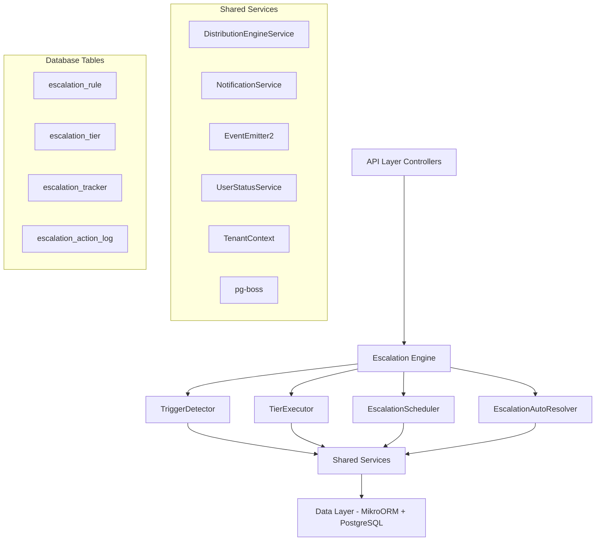

The Escalation Module automates responses when assigned leads go stale. A scheduled engine detects trigger conditions (no first contact, went cold) and executes tiered escalation actions — notifications, temperature changes, tag additions, and redistribution to new agents.

<Note>
**Status:** Active — fully implemented  
**Module Path:** `src/modules/crm/escalation/`
</Note>

## Overview

### Design Principles

<CardGroup cols={2}>
  <Card title="pg-boss Scheduling" icon="clock">
    Escalation scheduler uses pg-boss recurring job for reliability
  </Card>
  <Card title="Tiered Actions" icon="layer-group">
    Rules have ordered tiers with configurable delays; actions execute in sequence
  </Card>
  <Card title="Auto-resolution" icon="check-circle">
    Events (activity, stage change, reassignment) automatically resolve active trackers
  </Card>
  <Card title="Idempotency" icon="shield">
    Partial unique index + `ON CONFLICT DO NOTHING` prevents duplicate trackers
  </Card>
</CardGroup>

<Info>
The module delegates distribution through the distribution engine (`REDISTRIBUTE` action) and ensures RLS compliance with `organization_id` on all entities.
</Info>

## Architecture

### High-level System Diagram



### Component Responsibilities

| Component | Responsibility |
|-----------|----------------|
| **EscalationScheduler** | pg-boss recurring job that runs every 60 seconds to detect new triggers and process due escalations |
| **TriggerDetector** | Scans leads for unmet conditions (no first contact, went cold); creates tracker records |
| **TierExecutor** | Executes escalation tier actions (notify, redistribute, change temp, add tag) |
| **EscalationAutoResolver** | Listens to domain events and resolves active trackers when conditions change |
| **EscalationRuleService** | CRUD for escalation rules; handles tracker cancellation on deactivation/deletion |

## Entity Specifications

### EscalationRule

Defines when and how a lead should be escalated. Evaluated by `TriggerDetector`.

<CodeGroup>

```sql SQL Schema
CREATE TABLE escalation_rule (
    id uuid PRIMARY KEY,
    organization_id uuid NOT NULL,
    name varchar NOT NULL,
    is_active boolean DEFAULT true,
    priority integer NOT NULL,
    trigger_type escalation_trigger_type NOT NULL,
    trigger_config jsonb,
    conditions jsonb DEFAULT '[]'::jsonb,
    respect_business_hours boolean DEFAULT true,
    created_by uuid,
    created_at timestamp DEFAULT NOW(),
    updated_at timestamp DEFAULT NOW(),
    is_deleted boolean DEFAULT false
);
```

```typescript TypeScript Interface
interface EscalationRule {
  id: string;
  organizationId: string;
  name: string;
  isActive: boolean;
  priority: number;
  triggerType: 'NO_FIRST_CONTACT' | 'WENT_COLD';
  triggerConfig: {
    thresholdMinutes?: number;
    thresholdValue?: number;
    thresholdUnit?: string;
  };
  conditions: EscalationCondition[];
  respectBusinessHours: boolean;
  createdBy: string;
  createdAt: Date;
  updatedAt: Date;
  isDeleted: boolean;
}
```

</CodeGroup>

<Warning>
Rules are evaluated in ascending `priority` order (lower number = higher priority). Active rules must use unique priorities within the organization. The backend enforces this invariant and rejects conflicting priorities with `400 Bad Request`.
</Warning>

#### EscalationCondition Structure

```typescript
interface EscalationCondition {
  field: 'temperature' | 'leadSource' | 'language' | 'sourceChannel';
  operator: 'eq' | 'in';
  value: string | string[];
}
```

**SQL Field Mapping:**

| Field | SQL Column | Table | Notes |
|-------|------------|-------|-------|
| `temperature` | `l.temperature` | lead | Direct column mapping |
| `leadSource` | `l.lead_source` | lead | Direct column mapping |
| `sourceChannel` | `l.source_channel` | lead | Direct column mapping |
| `language` | `p.languages` | person | Requires `LEFT JOIN person p ON p.id = l.person_id`; matches JSONB entries by `languages[].code` |

### EscalationTier

Each tier represents a delayed action set that executes in `tier_order` sequence.

<CodeGroup>

```sql SQL Schema
CREATE TABLE escalation_tier (
    id uuid PRIMARY KEY,
    escalation_rule_id uuid NOT NULL,
    organization_id uuid NOT NULL,
    tier_order integer NOT NULL CHECK (tier_order BETWEEN 1 AND 10),
    delay_minutes integer NOT NULL,
    actions jsonb NOT NULL DEFAULT '[]'::jsonb
);
```

```typescript TypeScript Interface
interface EscalationTier {
  id: string;
  escalationRuleId: string;
  organizationId: string;
  tierOrder: number; // 1-10
  delayMinutes: number;
  actions: TierAction[];
}
```

</CodeGroup>

<Note>
**Tier 1** (lowest tier_order): always has `delay_minutes = 0` — threshold is the sole timing control.  
**Subsequent tiers**: `delay_minutes` represents minutes after the previous tier completed.
</Note>

#### Tier Action Types

<AccordionGroup>
  <Accordion title="NOTIFY_AGENT">
    **Parameters:** `message?: string`  
    **Resolution:** Uses lead's current stakeholder (assigned agent)
  </Accordion>
  
  <Accordion title="NOTIFY_ADMIN">
    **Parameters:** `message?: string`  
    **Resolution:** Self-resolving — queries all org users with the `system.admin` permission key via `UserOrgRole → RolePermission → Permission`. Skipped if no admin users found.
  </Accordion>
  
  <Accordion title="NOTIFY_USER">
    **Parameters:** `userId: string, message?: string`  
    **Resolution:** Direct user notification to specified user ID
  </Accordion>
  
  <Accordion title="CHANGE_TEMPERATURE">
    **Parameters:** `temperature: LeadTemperature`  
    **Values:** `HOT`, `WARM`, `COLD`
  </Accordion>
  
  <Accordion title="ADD_TAG">
    **Parameters:** `tagName: string`  
    **Behavior:** Creates tag if it doesn't exist, then associates with lead
  </Accordion>
  
  <Accordion title="REDISTRIBUTE">
    **Parameters:** `distributionRuleId?: string`  
    **Behavior:** Uses distribution engine. If no rule specified, uses organization's default distribution rule
  </Accordion>
</AccordionGroup>

### EscalationTracker

Tracks the lifecycle of an escalation for a specific lead-rule combination.

```sql
CREATE TABLE escalation_tracker (
    id uuid PRIMARY KEY,
    organization_id uuid NOT NULL,
    lead_id uuid NOT NULL,
    escalation_rule_id uuid NOT NULL,
    status escalation_status DEFAULT 'ACTIVE',
    current_tier integer DEFAULT 1,
    trigger_detected_at timestamp NOT NULL DEFAULT NOW(),
    next_tier_due_at timestamp,
    resolved_at timestamp,
    resolution_reason escalation_resolution_reason
);

-- Partial unique index for idempotency
CREATE UNIQUE INDEX idx_escalation_tracker_active_unique 
ON escalation_tracker (organization_id, lead_id, escalation_rule_id) 
WHERE status = 'ACTIVE';
```

<Info>
The partial unique index ensures only one active tracker exists per lead-rule combination, preventing duplicate escalations.
</Info>

#### Status Values

- `ACTIVE` - Currently processing escalation tiers
- `COMPLETED` - All tiers executed successfully  
- `RESOLVED` - Auto-resolved due to external changes
- `CANCELLED` - Manually cancelled or rule deactivated

#### Resolution Reasons

- `LEAD_ACTIVITY` - Lead had new activity
- `STAGE_CHANGED` - Lead stage was updated
- `REASSIGNED` - Lead was reassigned to different agent
- `RULE_DEACTIVATED` - Escalation rule was deactivated
- `MANUAL_CANCEL` - Manually cancelled by user

### EscalationActionLog

Audit trail for all executed escalation actions.

```sql
CREATE TABLE escalation_action_log (
    id uuid PRIMARY KEY,
    organization_id uuid NOT NULL,
    escalation_tracker_id uuid NOT NULL,
    tier_order integer NOT NULL,
    action_type tier_action_type NOT NULL,
    action_data jsonb,
    status action_execution_status DEFAULT 'PENDING',
    executed_at timestamp,
    error_message text,
    retry_count integer DEFAULT 0
);
```

## Escalation Engine

### Trigger Detection Process

<Steps>
  <Step title="Rule Evaluation">
    TriggerDetector queries active escalation rules ordered by priority
  </Step>
  
  <Step title="Lead Scanning">
    For each rule, scans leads matching the trigger type and conditions:
    - **NO_FIRST_CONTACT**: No activities with `first_contact = true`
    - **WENT_COLD**: Temperature changed to COLD within threshold period
  </Step>
  
  <Step title="Tracker Creation">
    Creates escalation tracker with `ON CONFLICT DO NOTHING` for idempotency
  </Step>
  
  <Step title="First Tier Scheduling">
    Immediately processes tier 1 (delay_minutes = 0) or schedules for business hours
  </Step>
</Steps>

### Tier Execution Workflow

```typescript
// Simplified tier execution flow
async function executeTier(trackerId: string, tierOrder: number) {
  const tracker = await findTracker(trackerId);
  const tier = await findTier(tracker.escalationRuleId, tierOrder);
  
  for (const action of tier.actions) {
    try {
      await executeAction(tracker, action);
      await logActionSuccess(tracker.id, tierOrder, action);
    } catch (error) {
      await logActionFailure(tracker.id, tierOrder, action, error);
    }
  }
  
  // Schedule next tier or complete escalation
  const nextTier = await findTier(tracker.escalationRuleId, tierOrder + 1);
  if (nextTier) {
    await scheduleNextTier(tracker, nextTier);
  } else {
    await completeEscalation(tracker.id);
  }
}
```

### Auto-Resolution Events

The system automatically resolves active escalation trackers when these events occur:

<Tabs>
  <Tab title="Lead Activity">
    **Event:** `LeadActivityCreated`  
    **Condition:** Any new activity on the lead  
    **Resolution:** `LEAD_ACTIVITY`
  </Tab>
  
  <Tab title="Stage Change">
    **Event:** `LeadStageChanged`  
    **Condition:** Lead moves to any new stage  
    **Resolution:** `STAGE_CHANGED`
  </Tab>
  
  <Tab title="Reassignment">
    **Event:** `LeadReassigned`  
    **Condition:** Lead assigned to different agent  
    **Resolution:** `REASSIGNED`
  </Tab>
  
  <Tab title="Rule Deactivation">
    **Event:** Rule set to `is_active = false`  
    **Condition:** Escalation rule deactivated  
    **Resolution:** `RULE_DEACTIVATED`
  </Tab>
</Tabs>

## API Endpoints

### Escalation Rules

<CodeGroup>

```typescript GET /api/escalation/rules
// List escalation rules with pagination
interface GetEscalationRulesQuery {
  page?: number;
  limit?: number;
  isActive?: boolean;
}

interface GetEscalationRulesResponse {
  rules: EscalationRule[];
  totalCount: number;
  page: number;
  limit: number;
}
```

```typescript POST /api/escalation/rules
// Create new escalation rule
interface CreateEscalationRuleRequest {
  name: string;
  triggerType: 'NO_FIRST_CONTACT' | 'WENT_COLD';
  triggerConfig: object;
  conditions: EscalationCondition[];
  respectBusinessHours: boolean;
  tiers: CreateEscalationTierRequest[];
}

interface CreateEscalationRuleResponse {
  rule: EscalationRule;
}
```

```typescript PUT /api/escalation/rules/:id
// Update escalation rule
interface UpdateEscalationRuleRequest {
  name?: string;
  isActive?: boolean;
  priority?: number;
  triggerConfig?: object;
  conditions?: EscalationCondition[];
  respectBusinessHours?: boolean;
  tiers?: UpdateEscalationTierRequest[];
}
```

```typescript DELETE /api/escalation/rules/:id
// Soft delete escalation rule
// Automatically cancels active trackers
```

</CodeGroup>

### Escalation Analytics

<CodeGroup>

```typescript GET /api/escalation/analytics/overview
// High-level escalation metrics
interface EscalationOverviewResponse {
  totalActiveEscalations: number;
  escalationsTriggeredToday: number;
  escalationsResolvedToday: number;
  averageResolutionTime: number; // minutes
  topTriggerTypes: Array<{
    triggerType: string;
    count: number;
  }>;
}
```

```typescript GET /api/escalation/analytics/performance
// Rule performance metrics
interface EscalationPerformanceQuery {
  ruleId?: string;
  startDate?: string;
  endDate?: string;
}

interface EscalationPerformanceResponse {
  ruleMetrics: Array<{
    ruleId: string;
    ruleName: string;
    triggeredCount: number;
    resolvedCount: number;
    averageResolutionTime: number;
    resolutionReasons: Array<{
      reason: string;
      count: number;
    }>;
  }>;
}
```

</CodeGroup>

### Escalation Trackers

<CodeGroup>

```typescript GET /api/escalation/trackers
// List active escalation trackers
interface GetEscalationTrackersQuery {
  status?: 'ACTIVE' | 'COMPLETED' | 'RESOLVED' | 'CANCELLED';
  ruleId?: string;
  page?: number;
  limit?: number;
}

interface GetEscalationTrackersResponse {
  trackers: Array<EscalationTracker & {
    lead: { id: string; firstName: string; lastName: string; };
    rule: { id: string; name: string; };
  }>;
  totalCount: number;
}
```

```typescript POST /api/escalation/trackers/:id/cancel
// Manually cancel an active escalation
interface CancelEscalationRequest {
  reason?: string;
}

interface CancelEscalationResponse {
  success: boolean;
  tracker: EscalationTracker;
}
```

</CodeGroup>

## Security & Permissions

### Required Permissions

| Operation | Permission Key | Description |
|-----------|----------------|-------------|
| View Rules | `escalation.rules.read` | View escalation rules and analytics |
| Manage Rules | `escalation.rules.write` | Create, update, delete escalation rules |
| Cancel Trackers | `escalation.trackers.cancel` | Manually cancel active escalations |
| View Analytics | `escalation.analytics.read` | Access escalation performance metrics |

### Row-Level Security

All escalation entities include `organization_id` for RLS enforcement:

```sql
-- Example RLS policy for escalation_rule
CREATE POLICY escalation_rule_org_isolation ON escalation_rule
    FOR ALL TO authenticated
    USING (organization_id = current_setting('app.current_organization_id')::uuid);
```

<Warning>
The system validates that users can only access escalation data within their organization context.
</Warning>

## Analytics & Metrics

### Key Performance Indicators

<CardGroup cols={2}>
  <Card title="Escalation Volume" icon="chart-line">
    - Total escalations triggered per day/week/month
    - Escalations by trigger type and rule
    - Peak escalation hours
  </Card>
  
  <Card title="Resolution Metrics" icon="clock">
    - Average time to resolution
    - Resolution reason distribution
    - Manual vs automatic resolution rates
  </Card>
  
  <Card title="Rule Effectiveness" icon="target">
    - Trigger accuracy (true positives)
    - Action success rates
    - Most effective tier configurations
  </Card>
  
  <Card title="Agent Impact" icon="users">
    - Escalations per agent
    - Response times to escalated leads
    - Conversion rates post-escalation
  </Card>
</CardGroup>

### Analytics Queries

<CodeGroup>

```sql Daily Escalation Volume
SELECT 
    DATE(trigger_detected_at) as escalation_date,
    COUNT(*) as total_escalations,
    COUNT(*) FILTER (WHERE status = 'RESOLVED') as resolved_count,
    AVG(EXTRACT(EPOCH FROM (resolved_at - trigger_detected_at))/60) as avg_resolution_minutes
FROM escalation_tracker 
WHERE organization_id = $1 
    AND trigger_detected_at >= $2 
    AND trigger_detected_at < $3
GROUP BY DATE(trigger_detected_at)
ORDER BY escalation_date DESC;
```

```sql Rule Performance
SELECT 
    er.id,
    er.name,
    COUNT(et.*) as triggered_count,
    COUNT(*) FILTER (WHERE et.status = 'RESOLVED') as resolved_count,
    COUNT(*) FILTER (WHERE et.resolution_reason = 'LEAD_ACTIVITY') as activity_resolved,
    AVG(EXTRACT(EPOCH FROM (et.resolved_at - et.trigger_detected_at))/60) as avg_resolution_minutes
FROM escalation_rule er
LEFT JOIN escalation_tracker et ON et.escalation_rule_id = er.id
WHERE er.organization_id = $1 
    AND er.is_active = true
GROUP BY er.id, er.name
ORDER BY triggered_count DESC;
```

</CodeGroup>

## Edge Case Handling

### Business Hours Considerations

<Steps>
  <Step title="Threshold Calculation">
    When `respect_business_hours = true`, only count business hours toward trigger thresholds
  </Step>
  
  <Step title="Execution Timing">
    Schedule tier execution for next business hour if outside business hours
  </Step>
  
  <Step title="Weekend Handling">
    Escalations triggered on weekends wait until next business day for execution
  </Step>
</Steps>

### Concurrent Modification Scenarios

| Scenario | Handling |
|----------|----------|
| Rule deleted while tracker active | Auto-resolve with `RULE_DEACTIVATED` reason |
| Lead reassigned during escalation | Auto-resolve with `REASSIGNED` reason |
| Multiple rules trigger simultaneously | Process in priority order; create separate trackers |
| Tier actions fail partially | Log individual action failures; continue with successful actions |

### Data Consistency

<Info>
The system uses database transactions for critical operations and implements idempotency through unique constraints to prevent duplicate processing.
</Info>

## Performance & Scaling

### Optimization Strategies

<Tabs>
  <Tab title="Database Indexes">
    ```sql
    -- Critical indexes for performance
    CREATE INDEX idx_escalation_tracker_status_due 
    ON escalation_tracker (status, next_tier_due_at) 
    WHERE status = 'ACTIVE';
    
    CREATE INDEX idx_escalation_rule_active_priority 
    ON escalation_rule (organization_id, is_active, priority) 
    WHERE is_active = true AND is_deleted = false;
    
    CREATE INDEX idx_lead_escalation_lookup 
    ON lead (organization_id, temperature, created_at, assigned_to)
    WHERE assigned_to IS NOT NULL;
    ```
  </Tab>
  
  <Tab title="Query Optimization">
    - Limit trigger detection to recent leads (configurable window)
    - Use prepared statements for repeated queries
    - Batch tracker updates where possible
    - Implement query result caching for analytics
  </Tab>
  
  <Tab title="Job Processing">
    - Use pg-boss concurrency controls to prevent overlap
    - Implement exponential backoff for failed actions
    - Monitor job queue depth and processing times
    - Scale worker processes based on organization size
  </Tab>
</Tabs>

### Monitoring & Alerting

<CodeGroup>

```typescript Health Checks
// Monitor escalation system health
interface EscalationHealthCheck {
  schedulerStatus: 'RUNNING' | 'STOPPED' | 'ERROR';
  queueDepth: number;
  averageProcessingTime: number;
  failedActionsLast24h: number;
  oldestUnprocessedTracker: Date | null;
}
```

```typescript Performance Metrics
// Key performance indicators
interface EscalationPerformanceMetrics {
  triggersDetectedPerMinute: number;
  actionsExecutedPerMinute: number;
  averageDetectionLatency: number;
  actionSuccessRate: number;
  systemResourceUsage: {
    cpuPercent: number;
    memoryMB: number;
    dbConnections: number;
  };
}
```

</CodeGroup>

## Module Structure

```
src/modules/crm/escalation/
├── controllers/
│   ├── escalation-rule.controller.ts
│   └── escalation-analytics.controller.ts
├── services/
│   ├── escalation-rule.service.ts
│   ├── escalation-scheduler.service.ts
│   ├── trigger-detector.service.ts
│   ├── tier-executor.service.ts
│   └── escalation-auto-resolver.service.ts
├── entities/
│   ├── escalation-rule.entity.ts
│   ├── escalation-tier.entity.ts
│   ├── escalation-tracker.entity.ts
│   └── escalation-action-log.entity.ts
├── dto/
│   ├── create-escalation-rule.dto.ts
│   ├── update-escalation-rule.dto.ts
│   └── escalation-analytics.dto.ts
├── types/
│   ├── escalation-condition.type.ts
│   ├── tier-action.type.ts
│   └── escalation-enums.type.ts
├── jobs/
│   └── escalation-processor.job.ts
└── escalation.module.ts
```

## Integration Points

### External Dependencies

<AccordionGroup>
  <Accordion title="Distribution Engine">
    **Usage:** `REDISTRIBUTE` action delegates to distribution service  
    **Interface:** `DistributionEngineService.redistributeLead()`
  </Accordion>
  
  <Accordion title="Notification Service">
    **Usage:** All notification actions use centralized notification system  
    **Interface:** `NotificationService.sendNotification()`
  </Accordion>
  
  <Accordion title="Business Hours Service">
    **Usage:** Validates business hours for execution timing  
    **Interface:** `BusinessHoursService.isBusinessHour()`
  </Accordion>
  
  <Accordion title="User Management">
    **Usage:** Resolves admin users and validates permissions  
    **Interface:** `UserService.getUsersWithPermission()`
  </Accordion>
</AccordionGroup>

### Event System

The escalation module both emits and listens to domain events:

**Emitted Events:**
- `EscalationTriggered` - When new escalation tracker created
- `EscalationTierExecuted` - When tier completes successfully  
- `EscalationResolved` - When tracker auto-resolves
- `EscalationCompleted` - When all tiers complete

**Consumed Events:**
- `LeadActivityCreated` - Triggers auto-resolution
- `LeadStageChanged` - Triggers auto-resolution  
- `LeadReassigned` - Triggers auto-resolution
- `OrganizationBusinessHoursChanged` - Updates execution schedules

<Check>
This specification provides complete implementation guidance for the Escalation Module, ensuring reliable automated lead management with comprehensive monitoring and analytics capabilities.
</Check>