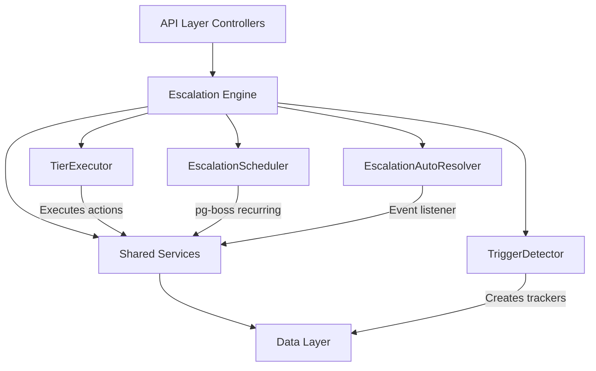

The Escalation Module automates responses when assigned leads go stale. A scheduled engine detects trigger conditions and executes tiered escalation actions including notifications, temperature changes, tag additions, and redistribution to new agents.

## Overview

The escalation system operates on a tiered approach where rules are evaluated by priority and executed through a scheduled engine using pg-boss for reliability.

### Design principles

<CardGroup cols={2}>
  <Card title="Scheduling" icon="clock">
    Uses pg-boss recurring jobs for reliable escalation detection and execution
  </Card>
  <Card title="Tiered Actions" icon="layer-group">
    Rules have ordered tiers with configurable delays that execute in sequence
  </Card>
  <Card title="Auto-Resolution" icon="check-circle">
    Events automatically resolve active trackers when conditions change
  </Card>
  <Card title="Idempotency" icon="shield">
    Prevents duplicate trackers with partial unique indexes and conflict handling
  </Card>
</CardGroup>

## Architecture

### High-level system diagram



### Component responsibilities

<AccordionGroup>
  <Accordion title="EscalationScheduler">
    pg-boss recurring job that runs every 60 seconds to detect new triggers and process due escalations
  </Accordion>
  <Accordion title="TriggerDetector">
    Scans leads for unmet conditions (no first contact, went cold) and creates tracker records
  </Accordion>
  <Accordion title="TierExecutor">
    Executes escalation tier actions including notifications, redistribution, temperature changes, and tag additions
  </Accordion>
  <Accordion title="EscalationAutoResolver">
    Listens to domain events and resolves active trackers when conditions change
  </Accordion>
  <Accordion title="EscalationRuleService">
    Provides CRUD operations for escalation rules and handles tracker cancellation on deactivation/deletion
  </Accordion>
</AccordionGroup>

## Entity Specifications

### EscalationRule

Defines when and how a lead should be escalated, evaluated by the TriggerDetector.

| Column | Type | Description |
|--------|------|-------------|
| `id` | uuid PK | Primary key |
| `organization_id` | uuid FK | Row-level security identifier |
| `name` | varchar | Human-readable rule name |
| `is_active` | bool | Rule activation status (default: true) |
| `priority` | int | Evaluation order |
| `trigger_type` | enum | `NO_FIRST_CONTACT` or `WENT_COLD` |
| `trigger_config` | jsonb | Threshold configuration object |
| `conditions` | jsonb | Array of EscalationCondition objects |
| `respect_business_hours` | bool | Use organization business hours (default: true) |
| `created_by` | uuid FK | User who created the rule |
| `created_at`, `updated_at` | timestamp | Audit timestamps |
| `is_deleted` | bool | Soft delete flag |

<Note>
The `conditions` array contains AND-joined filters. An empty array `[]` means the rule applies to all leads.
</Note>

#### EscalationCondition interface

```typescript
interface EscalationCondition {
  field: 'temperature' | 'leadSource' | 'language' | 'sourceChannel';
  operator: 'eq' | 'in';
  value: string | string[];
}
```

#### SQL field mapping

| Field | SQL Column | Table | Notes |
|-------|------------|-------|-------|
| `temperature` | `l.temperature` | lead | Direct column reference |
| `leadSource` | `l.lead_source` | lead | Direct column reference |
| `sourceChannel` | `l.source_channel` | lead | Direct column reference |
| `language` | `p.language` | person | Requires LEFT JOIN on person table |

### EscalationTier

Each tier represents a delayed action set that executes in `tier_order` sequence.

| Column | Type | Description |
|--------|------|-------------|
| `id` | uuid PK | Primary key |
| `escalation_rule_id` | uuid FK | Parent rule reference |
| `organization_id` | uuid FK | Row-level security identifier |
| `tier_order` | int | Execution order (1, 2, 3... max 10) |
| `delay_minutes` | int | Minutes after previous tier completion |
| `actions` | jsonb | Array of TierAction objects |

<Warning>
Tier 1 (lowest tier_order) always has `delay_minutes = 0`. The threshold is the sole timing control. Subsequent tiers specify minutes after the previous tier completed.
</Warning>

#### Tier action types

<Tabs>
  <Tab title="NOTIFY_AGENT">
    **Parameters:** `message?: string`
    
    Sends notification to the lead's current assigned agent (stakeholder).
  </Tab>
  <Tab title="NOTIFY_ADMIN">
    **Parameters:** `message?: string`
    
    Self-resolving action that queries all organization users with `system.admin` permission. Skipped if no admin users found.
  </Tab>
  <Tab title="NOTIFY_TEAM_LEAD">
    **Parameters:** `message?: string`
    
    Self-resolving action that notifies all team members with `team.admin` permission in the lead's assigned team. Skipped if no team stakeholder or team leaders exist.
  </Tab>
  <Tab title="REDISTRIBUTE">
    **Parameters:** None
    
    Delegates to distribution engine, removes current stakeholders, and calls `DistributionEngineService.redistribute()`. Creates distribution log entry with method `REDISTRIBUTION`.
  </Tab>
</Tabs>

<CodeGroup>
```typescript NOTIFY_AGENT Example
{
  type: 'NOTIFY_AGENT',
  message: 'Lead requires immediate attention - no contact in 24 hours'
}
```

```typescript REDISTRIBUTE Example
{
  type: 'REDISTRIBUTE'
}
```
</CodeGroup>

### EscalationTracker

Tracks active escalations for individual leads, ensuring single escalation per lead per rule.

| Column | Type | Description |
|--------|------|-------------|
| `id` | uuid PK | Primary key |
| `organization_id` | uuid FK | Row-level security |
| `escalation_rule_id` | uuid FK | Source rule |
| `lead_id` | uuid FK | Target lead |
| `trigger_type` | enum | Copied from rule |
| `triggered_at` | timestamp | Initial trigger time |
| `current_tier` | int | Currently executing tier (1-based) |
| `next_execution_at` | timestamp | When next tier should execute |
| `is_resolved` | bool | Completion status |
| `resolved_at` | timestamp | Resolution timestamp |
| `resolved_by` | enum | Resolution reason |

<Info>
Partial unique index on `(escalation_rule_id, lead_id)` WHERE `is_resolved = false` ensures single active escalation per lead per rule.
</Info>

#### Resolution reasons

| Value | Description |
|-------|-------------|
| `COMPLETED` | All tiers executed successfully |
| `REDISTRIBUTED` | Lead was reassigned via REDISTRIBUTE action |
| `ACTIVITY_DETECTED` | New activity detected on lead |
| `STAGE_CHANGED` | Lead stage was updated |
| `REASSIGNED` | Lead was manually reassigned |
| `RULE_DEACTIVATED` | Source rule was deactivated |

### EscalationActionLog

Audit trail for all executed escalation actions.

| Column | Type | Description |
|--------|------|-------------|
| `id` | uuid PK | Primary key |
| `organization_id` | uuid FK | Row-level security |
| `escalation_tracker_id` | uuid FK | Source tracker |
| `tier_order` | int | Which tier was executed |
| `action_type` | enum | Type of action performed |
| `action_config` | jsonb | Action parameters |
| `executed_at` | timestamp | Execution time |
| `success` | bool | Execution result |
| `error_message` | text | Error details if failed |
| `metadata` | jsonb | Additional execution context |

## Escalation Engine

### Trigger Detection

The TriggerDetector scans leads based on trigger type and evaluates conditions.

<Steps>
  <Step title="Query Lead Candidates">
    Builds SQL query filtering leads by:
    - Organization membership
    - Active status
    - Assigned stakeholder presence
    - No existing active tracker for the rule
  </Step>
  <Step title="Apply Trigger Logic">
    Evaluates specific conditions based on trigger type:
    - **NO_FIRST_CONTACT**: No activities with `direction = 'OUTBOUND'`
    - **WENT_COLD**: Last activity older than threshold
  </Step>
  <Step title="Check Business Hours">
    If `respect_business_hours = true`, adjusts threshold calculation to exclude non-business time
  </Step>
  <Step title="Create Trackers">
    Creates `EscalationTracker` records for qualifying leads with `ON CONFLICT DO NOTHING` for idempotency
  </Step>
</Steps>

### Tier Execution

The TierExecutor processes due escalations and executes configured actions.

<Tabs>
  <Tab title="Notification Actions">
    **NOTIFY_AGENT**, **NOTIFY_ADMIN**, **NOTIFY_TEAM_LEAD**
    
    Uses `NotificationService.sendEscalationNotification()` with resolved recipient lists.
    
    ```typescript
    await this.notificationService.sendEscalationNotification({
      recipients: resolvedUsers,
      escalationRule: rule,
      lead: lead,
      message: action.message || defaultMessage,
      tier: tierOrder
    });
    ```
  </Tab>
  <Tab title="Redistribution">
    **REDISTRIBUTE**
    
    Delegates to distribution engine for intelligent reassignment.
    
    ```typescript
    const result = await this.distributionEngineService.redistribute(
      leadId,
      organizationId,
      { excludeCurrentAssignee: true }
    );
    
    if (result.outcome === 'ASSIGNED') {
      // Auto-resolve tracker
      await this.resolveTracker(tracker, 'REDISTRIBUTED');
    }
    ```
  </Tab>
</Tabs>

### Auto-Resolution

The EscalationAutoResolver listens for domain events that should cancel active escalations.

<AccordionGroup>
  <Accordion title="Activity Detection">
    Listens for `ActivityCreatedEvent` and resolves trackers with `resolvedBy = 'ACTIVITY_DETECTED'`
  </Accordion>
  <Accordion title="Stage Changes">
    Listens for `LeadStageChangedEvent` and resolves trackers with `resolvedBy = 'STAGE_CHANGED'`
  </Accordion>
  <Accordion title="Reassignment">
    Listens for `LeadReassignedEvent` and resolves trackers with `resolvedBy = 'REASSIGNED'`
  </Accordion>
  <Accordion title="Rule Deactivation">
    When rules are deactivated, resolves all active trackers with `resolvedBy = 'RULE_DEACTIVATED'`
  </Accordion>
</AccordionGroup>

## API Endpoints

### Escalation Rules

<CodeGroup>
```http GET /api/escalation-rules
GET /api/escalation-rules?page=1&limit=20&isActive=true

Response:
{
  "data": [
    {
      "id": "uuid",
      "name": "No Contact 24h",
      "triggerType": "NO_FIRST_CONTACT",
      "isActive": true,
      "tiers": [...]
    }
  ],
  "pagination": {
    "total": 50,
    "page": 1,
    "limit": 20
  }
}
```

```http POST /api/escalation-rules
POST /api/escalation-rules
Content-Type: application/json

{
  "name": "Cold Lead Recovery",
  "triggerType": "WENT_COLD",
  "triggerConfig": {
    "thresholdValue": 7,
    "thresholdUnit": "days"
  },
  "conditions": [
    {
      "field": "temperature",
      "operator": "in",
      "value": ["HOT", "WARM"]
    }
  ],
  "tiers": [
    {
      "tierOrder": 1,
      "delayMinutes": 0,
      "actions": [
        {
          "type": "NOTIFY_AGENT",
          "message": "Lead has gone cold - follow up needed"
        }
      ]
    }
  ]
}
```
</CodeGroup>

### Analytics

<CodeGroup>
```http GET /api/escalation-analytics/summary
GET /api/escalation-analytics/summary?startDate=2024-01-01&endDate=2024-01-31

Response:
{
  "totalEscalations": 245,
  "activeTrackers": 12,
  "resolutionBreakdown": {
    "COMPLETED": 150,
    "REDISTRIBUTED": 45,
    "ACTIVITY_DETECTED": 30,
    "STAGE_CHANGED": 15,
    "REASSIGNED": 5
  },
  "avgResolutionTime": 4.2,
  "topRules": [
    {
      "ruleId": "uuid",
      "ruleName": "24h No Contact",
      "escalationCount": 89
    }
  ]
}
```

```http GET /api/escalation-analytics/tracker-history
GET /api/escalation-analytics/tracker-history/{trackerId}

Response:
{
  "tracker": {
    "id": "uuid",
    "leadId": "uuid",
    "ruleName": "Cold Lead Recovery",
    "triggeredAt": "2024-01-15T09:00:00Z",
    "currentTier": 2,
    "isResolved": false
  },
  "executionLog": [
    {
      "tierOrder": 1,
      "actionType": "NOTIFY_AGENT",
      "executedAt": "2024-01-15T09:00:00Z",
      "success": true
    }
  ]
}
```
</CodeGroup>

## Security & Permissions

### Row-Level Security

All escalation entities include `organization_id` for tenant isolation.

<Warning>
RLS policies are enforced at the database level. All queries must include organization context.
</Warning>

### Permission Requirements

| Action | Required Permission | Notes |
|--------|-------------------|-------|
| View escalation rules | `escalation.view` | Read-only access |
| Create/edit rules | `escalation.manage` | Full CRUD operations |
| View analytics | `escalation.analytics` | Dashboard and reporting access |
| Manual resolution | `escalation.resolve` | Resolve active trackers |

### Data Validation

<Steps>
  <Step title="Rule Validation">
    - Maximum 10 tiers per rule
    - Tier 1 must have `delayMinutes = 0`
    - Unique tier orders within rule
    - Valid trigger configuration
  </Step>
  <Step title="Condition Validation">
    - Valid field names and operators
    - Type-appropriate values
    - Maximum 10 conditions per rule
  </Step>
  <Step title="Action Validation">
    - Valid action types
    - Required parameters present
    - Maximum 5 actions per tier
  </Step>
</Steps>

## Analytics & Metrics

### Key Performance Indicators

<CardGroup cols={2}>
  <Card title="Escalation Volume" icon="chart-line">
    Total escalations triggered per period with trend analysis
  </Card>
  <Card title="Resolution Rate" icon="percentage">
    Percentage of escalations resolved vs. completed through all tiers
  </Card>
  <Card title="Response Time" icon="stopwatch">
    Average time from escalation to resolution or first agent response
  </Card>
  <Card title="Rule Effectiveness" icon="target">
    Success rate per rule based on desired outcomes
  </Card>
</CardGroup>

### Reporting Capabilities

- **Rule Performance**: Escalation count, resolution breakdown, average duration per rule
- **Agent Impact**: Notifications sent, response times, escalation workload per agent
- **Lead Recovery**: Conversion rates for escalated leads vs. non-escalated
- **System Health**: Failed actions, error rates, scheduler performance

## Edge Case Handling

<AccordionGroup>
  <Accordion title="Concurrent Modifications">
    Uses optimistic locking and `ON CONFLICT DO NOTHING` to handle race conditions during tracker creation.
  </Accordion>
  <Accordion title="Missing Recipients">
    Actions gracefully skip when recipients cannot be resolved (no admins, no team leads, etc.) and log the outcome.
  </Accordion>
  <Accordion title="Distribution Failures">
    REDISTRIBUTE actions that fail to find new assignees are logged but don't cause tracker failure. Manual intervention may be required.
  </Accordion>
  <Accordion title="Business Hours Edge Cases">
    Handles timezone changes, holiday schedules, and organization settings updates during active escalations.
  </Accordion>
  <Accordion title="Scheduler Downtime">
    pg-boss ensures job recovery after system restarts. Missed executions are caught up on next scheduler run.
  </Accordion>
</AccordionGroup>

## Performance & Scaling

### Database Optimization

```sql
-- Critical indexes for performance
CREATE INDEX idx_escalation_tracker_next_execution 
  ON escalation_tracker (organization_id, next_execution_at) 
  WHERE is_resolved = false;

CREATE INDEX idx_escalation_tracker_lead_rule 
  ON escalation_tracker (lead_id, escalation_rule_id) 
  WHERE is_resolved = false;

CREATE INDEX idx_escalation_rule_active 
  ON escalation_rule (organization_id, priority) 
  WHERE is_active = true AND is_deleted = false;
```

### Scaling Considerations

<Tip>
The scheduler processes organizations in batches to avoid memory issues with large datasets. Default batch size is 1000 leads per organization per run.
</Tip>

| Component | Scaling Strategy | Limits |
|-----------|------------------|--------|
| Scheduler | Configurable batch sizes, per-org processing | 10K leads per batch |
| Notifications | Async queuing via pg-boss | 100 recipients per action |
| Analytics | Materialized views for historical data | Real-time for last 30 days |
| Trackers | Automatic cleanup of resolved trackers > 90 days | Retention configurable |

## Module Structure

```
src/modules/crm/escalation/
├── controllers/
│   ├── escalation-rule.controller.ts
│   └── escalation-analytics.controller.ts
├── services/
│   ├── escalation-rule.service.ts
│   ├── escalation-scheduler.service.ts
│   ├── trigger-detector.service.ts
│   ├── tier-executor.service.ts
│   └── escalation-auto-resolver.service.ts
├── entities/
│   ├── escalation-rule.entity.ts
│   ├── escalation-tier.entity.ts
│   ├── escalation-tracker.entity.ts
│   └── escalation-action-log.entity.ts
├── dto/
│   ├── create-escalation-rule.dto.ts
│   ├── update-escalation-rule.dto.ts
│   └── escalation-analytics.dto.ts
├── types/
│   ├── escalation-trigger.types.ts
│   ├── escalation-action.types.ts
│   └── escalation-condition.types.ts
└── __tests__/
    ├── escalation-scheduler.service.spec.ts
    ├── trigger-detector.service.spec.ts
    └── tier-executor.service.spec.ts
```

## Integration Points

### Distribution Engine

<Check>
Escalation module delegates all reassignment logic to the existing distribution engine via `REDISTRIBUTE` actions.
</Check>

### Notification System

Uses `NotificationService.sendEscalationNotification()` for all notification actions with escalation-specific templates.

### Event System

Subscribes to domain events for auto-resolution:
- `ActivityCreatedEvent`
- `LeadStageChangedEvent` 
- `LeadReassignedEvent`

### Business Hours

Integrates with organization business hours settings for threshold calculations when `respect_business_hours = true`.

<Note>
The escalation module is fully implemented and active in production. This specification serves as the definitive reference for maintenance and future enhancements.
</Note>