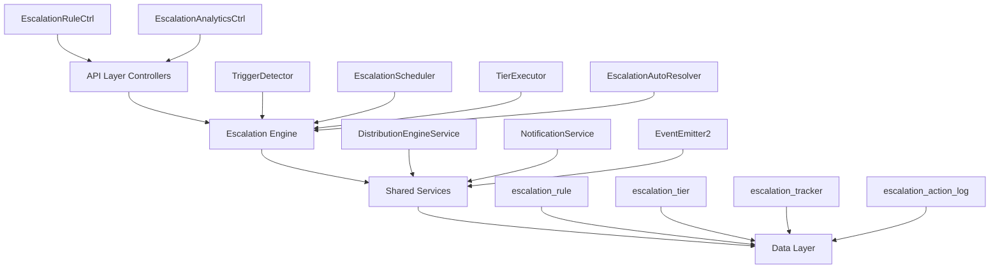

<Note>
**Status:** Active — fully implemented  
**Module Path:** `src/modules/crm/escalation/`
</Note>

## Overview

The Escalation Module automates responses when assigned leads go stale. A scheduled engine detects trigger conditions (no first contact, went cold) and executes tiered escalation actions — notifications, temperature changes, tag additions, and redistribution to new agents.

### Design Principles

| Principle | Decision |
|-----------|----------|
| pg-boss scheduling | Escalation scheduler uses pg-boss recurring job for reliability |
| Tiered actions | Rules have ordered tiers with configurable delays; actions execute in sequence |
| Auto-resolution | Events (activity, stage change, reassignment) automatically resolve active trackers |
| Idempotency | Partial unique index + `ON CONFLICT DO NOTHING` prevents duplicate trackers |
| Distribution delegation | Reassignment uses the distribution engine (`REDISTRIBUTE` action), not a separate paradigm |
| RLS compliance | All entities carry `organization_id` for row-level security |

## Architecture

### High-Level Diagram



### Component Responsibilities

<CardGroup cols={2}>
  <Card title="EscalationScheduler" icon="clock">
    pg-boss recurring job that runs every 60 seconds to detect new triggers and process due escalations
  </Card>
  <Card title="TriggerDetector" icon="search">
    Scans leads for unmet conditions (no first contact, went cold); creates tracker records
  </Card>
  <Card title="TierExecutor" icon="play">
    Executes escalation tier actions (notify, redistribute, change temp, add tag)
  </Card>
  <Card title="EscalationAutoResolver" icon="check">
    Listens to domain events and resolves active trackers when conditions change
  </Card>
</CardGroup>

## Entity Specifications

### EscalationRule

Defines when and how a lead should be escalated. Evaluated by `TriggerDetector`.

| Column | Type | Notes |
|--------|------|-------|
| id | uuid PK | |
| organization_id | uuid FK | RLS |
| name | varchar | Human-readable rule name |
| is_active | bool | default true |
| priority | int | Evaluation order |
| trigger_type | enum | `NO_FIRST_CONTACT`, `WENT_COLD` |
| trigger_config | jsonb | `{thresholdMinutes?, thresholdValue?, thresholdUnit?}` |
| conditions | jsonb | `EscalationCondition[]` — AND-joined applicability filters; `[]` = all leads |
| respect_business_hours | bool | default true. References org business hours schedule. |
| created_by | uuid FK | |
| created_at, updated_at | timestamp | |
| is_deleted | bool | soft delete |

<Warning>
Rules are evaluated in ascending `priority` order (lower number = higher priority). Active rules must use unique priorities within the organization.
</Warning>

#### EscalationCondition Structure

```typescript
interface EscalationCondition {
  field: 'temperature' | 'leadSource' | 'language' | 'sourceChannel';
  operator: 'eq' | 'in';
  value: string | string[];
}
```

#### SQL Field Mapping

| Field | SQL Column | Table | Notes |
|-------|------------|-------|-------|
| `temperature` | `l.temperature` | lead | |
| `leadSource` | `l.lead_source` | lead | |
| `sourceChannel` | `l.source_channel` | lead | |
| `language` | `p.languages` | person | Adds `LEFT JOIN person p ON p.id = l.person_id`; matches JSONB entries by `languages[].code` |

### EscalationTier

Each tier in an escalation rule represents a delayed action set. Tiers execute in `tier_order` sequence.

| Column | Type | Notes |
|--------|------|-------|
| id | uuid PK | |
| escalation_rule_id | uuid FK | |
| organization_id | uuid FK | RLS |
| tier_order | int | 1, 2, 3... (max 10) |
| delay_minutes | int | Tier 1: always 0 — threshold is the sole timing control. Subsequent tiers: minutes after the previous tier completed. |
| actions | jsonb | `TierAction[]` — see Tier Actions below |

### Tier Action Types

<Tabs>
  <Tab title="Notification Actions">
    <AccordionGroup>
      <Accordion title="NOTIFY_AGENT">
        **Parameters:** `message?: string`  
        **Resolution:** Resolved from lead's current stakeholder (assigned agent)
      </Accordion>
      <Accordion title="NOTIFY_ADMIN">
        **Parameters:** `message?: string`  
        **Resolution:** Self-resolving — queries all org users with the `system.admin` permission key via `UserOrgRole → RolePermission → Permission`. Skipped if no admin users found.
      </Accordion>
      <Accordion title="NOTIFY_TEAM">
        **Parameters:** `teamId: string, message?: string`  
        **Resolution:** Resolved from team membership via `UserOrgRole.team_id`
      </Accordion>
      <Accordion title="NOTIFY_USERS">
        **Parameters:** `userIds: string[], message?: string`  
        **Resolution:** Direct user ID list
      </Accordion>
    </AccordionGroup>
  </Tab>
  <Tab title="Lead Actions">
    <AccordionGroup>
      <Accordion title="CHANGE_TEMPERATURE">
        **Parameters:** `temperature: string`  
        **Effect:** Updates lead.temperature
      </Accordion>
      <Accordion title="ADD_TAG">
        **Parameters:** `tagName: string`  
        **Effect:** Adds tag to lead if not already present
      </Accordion>
      <Accordion title="REDISTRIBUTE">
        **Parameters:** `distributionType: 'round_robin' | 'random'`  
        **Effect:** Reassigns lead using distribution engine
      </Accordion>
    </AccordionGroup>
  </Tab>
</Tabs>

### EscalationTracker

Tracks escalation progress for a specific lead-rule combination.

| Column | Type | Notes |
|--------|------|-------|
| id | uuid PK | |
| organization_id | uuid FK | RLS |
| lead_id | uuid FK | |
| escalation_rule_id | uuid FK | |
| status | enum | `ACTIVE`, `RESOLVED`, `CANCELLED` |
| trigger_type | enum | Copied from rule |
| current_tier | int | 1-based; increments as tiers complete |
| next_execution_at | timestamp | When next tier should execute |
| created_at, updated_at | timestamp | |
| resolved_at | timestamp | When status changed to RESOLVED/CANCELLED |
| resolved_reason | text | Why it was resolved |

<Info>
**Unique constraint:** `(lead_id, escalation_rule_id)` WHERE `status = 'ACTIVE'` prevents duplicate active trackers.
</Info>

### EscalationActionLog

Audit trail for executed escalation actions.

| Column | Type | Notes |
|--------|------|-------|
| id | uuid PK | |
| organization_id | uuid FK | RLS |
| escalation_tracker_id | uuid FK | |
| tier_order | int | Which tier this action belonged to |
| action_type | enum | Action that was executed |
| action_config | jsonb | Action parameters |
| status | enum | `SUCCESS`, `FAILED`, `SKIPPED` |
| result | jsonb | Execution result/error details |
| executed_at | timestamp | |

## Escalation Engine

### TriggerDetector

<Steps>
  <Step title="Fetch Active Rules">
    Query active escalation rules ordered by priority
  </Step>
  <Step title="Apply Rule Conditions">
    For each rule, build SQL WHERE clause from conditions array
  </Step>
  <Step title="Detect Triggers">
    Execute trigger-specific queries to find eligible leads
  </Step>
  <Step title="Create Trackers">
    Insert tracker records with `ON CONFLICT DO NOTHING` for idempotency
  </Step>
</Steps>

#### Trigger Types

<CodeGroup>
```sql NO_FIRST_CONTACT
SELECT l.id
FROM lead l
LEFT JOIN escalation_tracker et ON et.lead_id = l.id 
  AND et.escalation_rule_id = $rule_id 
  AND et.status = 'ACTIVE'
WHERE l.organization_id = $org_id
  AND l.assigned_agent_id IS NOT NULL
  AND l.first_contact_at IS NULL
  AND l.created_at <= $threshold_time
  AND et.id IS NULL
  {applicability_conditions}
```

```sql WENT_COLD
SELECT l.id
FROM lead l
LEFT JOIN escalation_tracker et ON et.lead_id = l.id 
  AND et.escalation_rule_id = $rule_id 
  AND et.status = 'ACTIVE'
WHERE l.organization_id = $org_id
  AND l.assigned_agent_id IS NOT NULL
  AND l.last_activity_at IS NOT NULL
  AND l.last_activity_at <= $threshold_time
  AND et.id IS NULL
  {applicability_conditions}
```
</CodeGroup>

### TierExecutor

<Steps>
  <Step title="Query Due Trackers">
    Find trackers where `next_execution_at <= NOW()`
  </Step>
  <Step title="Execute Tier Actions">
    Process each action in the tier's actions array
  </Step>
  <Step title="Update Tracker">
    Increment `current_tier` and set `next_execution_at` for next tier
  </Step>
  <Step title="Log Actions">
    Create `EscalationActionLog` entries for audit trail
  </Step>
</Steps>

### EscalationAutoResolver

Listens to domain events and resolves active trackers when conditions change:

| Event | Trigger | Resolution Reason |
|-------|---------|-------------------|
| `lead.activity.created` | Any lead activity | "Lead had new activity" |
| `lead.stage.changed` | Stage change | "Lead stage changed" |
| `lead.assigned` | Agent reassignment | "Lead was reassigned" |
| `lead.first_contact.recorded` | First contact recorded | "First contact was made" |

## API Endpoints

### EscalationRule Management

<CodeGroup>
```http GET /escalation/rules
GET /api/v1/escalation/rules
Authorization: Bearer {token}
```

```http POST /escalation/rules
POST /api/v1/escalation/rules
Authorization: Bearer {token}
Content-Type: application/json

{
  "name": "Follow up cold leads",
  "trigger_type": "WENT_COLD",
  "trigger_config": {
    "thresholdValue": 7,
    "thresholdUnit": "days"
  },
  "conditions": [
    {
      "field": "temperature",
      "operator": "in",
      "value": ["WARM", "HOT"]
    }
  ],
  "tiers": [
    {
      "tier_order": 1,
      "delay_minutes": 0,
      "actions": [
        {
          "type": "NOTIFY_AGENT",
          "message": "Lead has gone cold"
        }
      ]
    }
  ]
}
```
</CodeGroup>

### Analytics & Metrics

<CodeGroup>
```http GET /escalation/analytics
GET /api/v1/escalation/analytics?period=30d&rule_id=123
Authorization: Bearer {token}
```

```json Response
{
  "summary": {
    "total_escalations": 45,
    "active_trackers": 12,
    "resolution_rate": 0.73
  },
  "by_rule": [
    {
      "rule_id": "123",
      "rule_name": "Follow up cold leads",
      "escalations": 15,
      "avg_resolution_time": 4.2
    }
  ],
  "by_trigger": {
    "NO_FIRST_CONTACT": 20,
    "WENT_COLD": 25
  }
}
```
</CodeGroup>

## Security & Permissions

### Required Permissions

| Action | Permission | Notes |
|--------|------------|-------|
| View rules | `escalation.rules.read` | |
| Create/edit rules | `escalation.rules.write` | |
| Delete rules | `escalation.rules.delete` | |
| View analytics | `escalation.analytics.read` | |

<Warning>
All escalation entities include `organization_id` for RLS enforcement. Users can only access escalation data within their organization.
</Warning>

### RLS Policies

<CodeGroup>
```sql escalation_rule
CREATE POLICY escalation_rule_access ON escalation_rule
FOR ALL TO authenticated
USING (organization_id = get_user_org_id());
```

```sql escalation_tracker
CREATE POLICY escalation_tracker_access ON escalation_tracker
FOR ALL TO authenticated
USING (organization_id = get_user_org_id());
```
</CodeGroup>

## Performance & Scaling

### Optimization Strategies

<CardGroup cols={2}>
  <Card title="Indexing" icon="database">
    - Composite index on `(organization_id, is_active, priority)`
    - Index on `next_execution_at` for due tracker queries
    - Partial index on active trackers
  </Card>
  <Card title="Batch Processing" icon="layer-group">
    - Process trackers in batches of 100
    - Use connection pooling for concurrent execution
    - Implement exponential backoff for failures
  </Card>
</CardGroup>

### Monitoring Metrics

| Metric | Description | Alert Threshold |
|--------|-------------|-----------------|
| Escalation lag | Time between trigger and first execution | > 5 minutes |
| Failed actions | Actions that failed to execute | > 5% failure rate |
| Queue depth | Number of due trackers waiting | > 1000 trackers |

## Edge Case Handling

<AccordionGroup>
  <Accordion title="Business Hours Respect">
    When `respect_business_hours = true`, the scheduler:
    - Skips execution outside business hours
    - Adjusts `next_execution_at` to next business day
    - Uses organization timezone for calculations
  </Accordion>

  <Accordion title="Agent Unavailability">
    For `NOTIFY_AGENT` actions:
    - Check agent status via `UserStatusService`
    - Skip notification if agent is inactive/deleted
    - Log as `SKIPPED` with reason in action log
  </Accordion>

  <Accordion title="Concurrent Modifications">
    - Tracker updates use optimistic locking
    - Rule priority conflicts return `400 Bad Request`
    - Lead reassignments auto-resolve trackers
  </Accordion>

  <Accordion title="Partial Failures">
    - Failed actions are logged but don't block tier progression
    - Tier execution continues even if some actions fail
    - Failed actions can be retried via admin interface
  </Accordion>
</AccordionGroup>

## Integration Points

### Distribution Engine

<CodeGroup>
```typescript REDISTRIBUTE Action
await this.distributionEngine.redistributeLead({
  leadId: tracker.lead_id,
  organizationId: tracker.organization_id,
  distributionType: action.distributionType,
  excludeCurrentAgent: true
});
```
</CodeGroup>

### Notification Service

<CodeGroup>
```typescript Notification Delivery
await this.notificationService.send({
  recipients: resolvedUsers,
  type: 'ESCALATION_ALERT',
  data: {
    leadId: tracker.lead_id,
    ruleName: rule.name,
    tierOrder: currentTier,
    message: action.message
  }
});
```
</CodeGroup>

### Event System

<CodeGroup>
```typescript Event Emission
this.eventEmitter.emit('escalation.tracker.created', {
  trackerId: tracker.id,
  leadId: tracker.lead_id,
  ruleId: tracker.escalation_rule_id
});
```
</CodeGroup>

<Check>
The Escalation Module provides a comprehensive, scalable solution for automated lead follow-up with full audit trails, flexible configuration, and robust error handling.
</Check>