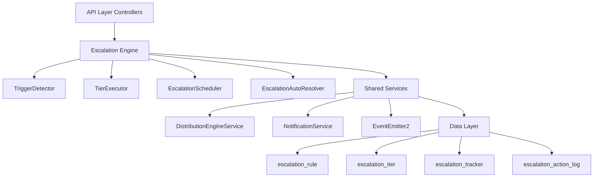

The Escalation Module automates responses when assigned leads go stale. A scheduled engine detects trigger conditions (no first contact, went cold) and executes tiered escalation actions — notifications, temperature changes, tag additions, and redistribution to new agents.

<Note>
**Status:** Active — fully implemented  
**Module Path:** `src/modules/crm/escalation/`
</Note>

## Overview

The Escalation Module follows a tiered approach to handling stale leads with automated detection and response mechanisms.

### Design principles

<CardGroup cols={2}>
  <Card title="pg-boss scheduling" icon="clock">
    Escalation scheduler uses pg-boss recurring job for reliability
  </Card>
  <Card title="Tiered actions" icon="layer-group">
    Rules have ordered tiers with configurable delays; actions execute in sequence
  </Card>
  <Card title="Auto-resolution" icon="check-circle">
    Events (activity, stage change, reassignment) automatically resolve active trackers
  </Card>
  <Card title="Idempotency" icon="shield">
    Partial unique index + `ON CONFLICT DO NOTHING` prevents duplicate trackers
  </Card>
</CardGroup>

<Info>
Distribution delegation: Reassignment uses the distribution engine (`REDISTRIBUTE` action), not a separate paradigm. All entities carry `organization_id` for row-level security compliance.
</Info>

## Architecture

### High-level diagram



### Component responsibilities

| Component | Responsibility |
|-----------|---------------|
| **EscalationScheduler** | pg-boss recurring job that runs every 60 seconds to detect new triggers and process due escalations |
| **TriggerDetector** | Scans leads for unmet conditions (no first contact, went cold); creates tracker records |
| **TierExecutor** | Executes escalation tier actions (notify, redistribute, change temp, add tag) |
| **EscalationAutoResolver** | Listens to domain events and resolves active trackers when conditions change |
| **EscalationRuleService** | CRUD for escalation rules; handles tracker cancellation on deactivation/deletion |

## Entity specifications

### EscalationRule

Defines when and how a lead should be escalated. Evaluated by `TriggerDetector`.

<AccordionGroup>
  <Accordion title="Schema definition">
    | Column | Type | Notes |
    |--------|------|-------|
    | id | uuid PK | |
    | organization_id | uuid FK | RLS |
    | name | varchar | Human-readable rule name |
    | is_active | bool | default true |
    | priority | int | Evaluation order |
    | trigger_type | enum | `NO_FIRST_CONTACT`, `WENT_COLD` |
    | trigger_config | jsonb | `{thresholdMinutes?, thresholdValue?, thresholdUnit?}` |
    | conditions | jsonb | `EscalationCondition[]` — AND-joined applicability filters; `[]` = all leads |
    | respect_business_hours | bool | default true. References org business hours schedule. |
    | created_by | uuid FK | |
    | created_at, updated_at | timestamp | |
    | is_deleted | bool | soft delete |
  </Accordion>
  
  <Accordion title="Priority rules">
    <Warning>
    Rules are evaluated in ascending `priority` order (lower number = higher priority). Active rules must use unique priorities within the organization.
    </Warning>
    
    - Frontend defaults `priority` to one greater than the highest active escalation rule priority
    - Edit mode preserves the existing rule priority
    - Frontend disables submission when an active rule would reuse another active rule's priority
    - Rule cards block reactivation of paused rules with a conflicting priority
    - Backend enforces invariant on create, priority update, and reactivation
    - Inactive rules may keep duplicate priorities until activation
  </Accordion>
</AccordionGroup>

#### EscalationCondition interface

```typescript
interface EscalationCondition {
  field: 'temperature' | 'leadSource' | 'language' | 'sourceChannel';
  operator: 'eq' | 'in';
  value: string | string[];
}
```

#### SQL field mapping

Used by `TriggerDetector.buildApplicabilityExtraWhere`:

| Field | SQL Column | Table | Notes |
|-------|------------|-------|-------|
| `temperature` | `l.temperature` | lead | |
| `leadSource` | `l.lead_source` | lead | |
| `sourceChannel` | `l.source_channel` | lead | |
| `language` | `p.languages` | person | Adds `LEFT JOIN person p ON p.id = l.person_id`; matches JSONB entries by `languages[].code` |

### EscalationTier

Each tier in an escalation rule represents a delayed action set. Tiers execute in `tier_order` sequence.

| Column | Type | Notes |
|--------|------|-------|
| id | uuid PK | |
| escalation_rule_id | uuid FK | |
| organization_id | uuid FK | RLS |
| tier_order | int | 1, 2, 3... (max 10) |
| delay_minutes | int | Tier 1: always 0 — threshold is the sole timing control. Subsequent tiers: minutes after the previous tier completed. |
| actions | jsonb | `TierAction[]` — see Tier Actions below |

#### Tier action types

<Tabs>
  <Tab title="NOTIFY_AGENT">
    **Parameters:** `message?: string`
    
    Resolved from lead's current stakeholder (assigned agent)
  </Tab>
  
  <Tab title="NOTIFY_ADMIN">
    **Parameters:** `message?: string`
    
    **Self-resolving** — queries all org users with the `system.admin` permission key via `UserOrgRole → RolePermission → Permission`. Skipped if no admin users found.
  </Tab>
  
  <Tab title="NOTIFY_MANAGER">
    **Parameters:** `message?: string`
    
    **Self-resolving** — queries the assigned agent's manager via `User.manager_id`. Falls back to admins if manager not found.
  </Tab>
  
  <Tab title="CHANGE_TEMPERATURE">
    **Parameters:** `temperature: LeadTemperature`
    
    Updates lead temperature directly
  </Tab>
  
  <Tab title="ADD_TAG">
    **Parameters:** `tagName: string`
    
    Adds tag to lead if not already present
  </Tab>
  
  <Tab title="REDISTRIBUTE">
    **Parameters:** `distributionStrategy: DistributionStrategy`
    
    Uses DistributionEngineService to reassign lead
  </Tab>
</Tabs>

### EscalationTracker

Tracks active escalation progress for a specific lead-rule combination.

<AccordionGroup>
  <Accordion title="Schema definition">
    | Column | Type | Notes |
    |--------|------|-------|
    | id | uuid PK | |
    | organization_id | uuid FK | RLS |
    | lead_id | uuid FK | |
    | escalation_rule_id | uuid FK | |
    | current_tier | int | 1-based; next tier to execute |
    | last_executed_at | timestamp | nullable; when current_tier-1 completed |
    | next_execution_at | timestamp | when current_tier should execute |
    | status | enum | `ACTIVE`, `RESOLVED`, `CANCELLED` |
    | resolved_reason | varchar | nullable; why tracker was resolved |
    | created_at, updated_at | timestamp | |
  </Accordion>
  
  <Accordion title="Constraints and indexes">
    **Unique constraint:** `(lead_id, escalation_rule_id) WHERE status = 'ACTIVE'`
    
    This ensures only one active tracker per lead-rule combination.
    
    **Indexes:**
    - `(organization_id, next_execution_at, status)` for scheduler queries
    - `(lead_id, status)` for auto-resolution lookups
  </Accordion>
</AccordionGroup>

### EscalationActionLog

Audit trail of all executed escalation actions.

| Column | Type | Notes |
|--------|------|-------|
| id | uuid PK | |
| organization_id | uuid FK | RLS |
| escalation_tracker_id | uuid FK | |
| tier_order | int | which tier executed |
| action_type | enum | `NOTIFY_AGENT`, `NOTIFY_ADMIN`, etc. |
| action_params | jsonb | action-specific parameters |
| execution_result | jsonb | success/failure details |
| executed_at | timestamp | |

## Type definitions

### Core enums

```typescript
enum TriggerType {
  NO_FIRST_CONTACT = 'NO_FIRST_CONTACT',
  WENT_COLD = 'WENT_COLD'
}

enum TrackerStatus {
  ACTIVE = 'ACTIVE',
  RESOLVED = 'RESOLVED', 
  CANCELLED = 'CANCELLED'
}

enum ActionType {
  NOTIFY_AGENT = 'NOTIFY_AGENT',
  NOTIFY_ADMIN = 'NOTIFY_ADMIN',
  NOTIFY_MANAGER = 'NOTIFY_MANAGER',
  CHANGE_TEMPERATURE = 'CHANGE_TEMPERATURE',
  ADD_TAG = 'ADD_TAG',
  REDISTRIBUTE = 'REDISTRIBUTE'
}
```

### Trigger configuration interfaces

<CodeGroup>
```typescript No First Contact
interface NoFirstContactConfig {
  thresholdMinutes: number; // e.g., 1440 for 24 hours
}
```

```typescript Went Cold
interface WentColdConfig {
  thresholdValue: number;    // e.g., 7
  thresholdUnit: 'days' | 'hours' | 'minutes'; // e.g., 'days'
}
```
</CodeGroup>

### Action parameter interfaces

<CodeGroup>
```typescript Notification Actions
interface NotifyActionParams {
  message?: string; // Custom message template
}
```

```typescript Temperature Change
interface ChangeTemperatureParams {
  temperature: LeadTemperature; // 'HOT' | 'WARM' | 'COLD'
}
```

```typescript Tag Addition
interface AddTagParams {
  tagName: string;
}
```

```typescript Redistribution
interface RedistributeParams {
  distributionStrategy: DistributionStrategy;
}
```
</CodeGroup>

## Escalation engine

### EscalationScheduler

<Steps>
  <Step title="Job registration">
    Registers a recurring pg-boss job named `escalation-check` that runs every 60 seconds.
  </Step>
  
  <Step title="Trigger detection">
    Calls `TriggerDetector.detectAndCreateTrackers()` to scan for new escalation candidates.
  </Step>
  
  <Step title="Tier execution">
    Calls `TierExecutor.executeReadyTiers()` to process trackers with `next_execution_at <= now()`.
  </Step>
  
  <Step title="Error handling">
    Catches and logs errors to prevent job failure cascades.
  </Step>
</Steps>

<Warning>
The scheduler respects business hours when `respect_business_hours = true`. Actions are delayed until the next business period if triggered outside business hours.
</Warning>

### TriggerDetector

Scans leads for escalation trigger conditions and creates tracker records.

#### Detection logic

<Tabs>
  <Tab title="NO_FIRST_CONTACT">
    **Query conditions:**
    - Lead has `assigned_to` (stakeholder)
    - Lead `created_at` is older than threshold
    - No activities exist for the lead
    - No existing active tracker for this rule
  </Tab>
  
  <Tab title="WENT_COLD">
    **Query conditions:**
    - Lead has `assigned_to` (stakeholder)  
    - Lead `temperature != 'COLD'`
    - Last activity is older than threshold
    - No existing active tracker for this rule
  </Tab>
</Tabs>

#### Applicability filtering

Rules with `conditions` are filtered using `buildApplicabilityExtraWhere()`:

```sql
-- Example: temperature = 'WARM' AND leadSource IN ('website', 'referral')
WHERE l.temperature = 'WARM' 
  AND l.lead_source = ANY(ARRAY['website', 'referral'])
```

### TierExecutor

Executes actions for trackers whose `next_execution_at` has passed.

<Steps>
  <Step title="Query ready trackers">
    Find all `ACTIVE` trackers with `next_execution_at <= now()`.
  </Step>
  
  <Step title="Execute tier actions">
    For each tracker, execute all actions in the current tier sequentially.
  </Step>
  
  <Step title="Update tracker state">
    - Set `last_executed_at = now()`
    - Increment `current_tier`
    - Calculate `next_execution_at` based on next tier's `delay_minutes`
    - Resolve tracker if no more tiers exist
  </Step>
  
  <Step title="Log action results">
    Create `EscalationActionLog` entries for audit trail.
  </Step>
</Steps>

#### Action execution details

<AccordionGroup>
  <Accordion title="NOTIFY_AGENT/ADMIN/MANAGER">
    - Resolves recipient user(s) based on action type
    - Uses `NotificationService.createNotification()`
    - Includes lead context and custom message if provided
    - Logs success/failure with recipient details
  </Accordion>
  
  <Accordion title="CHANGE_TEMPERATURE">
    - Updates lead entity directly via repository
    - Emits `lead.temperature.changed` domain event
    - Logs old and new temperature values
  </Accordion>
  
  <Accordion title="ADD_TAG">
    - Checks if tag already exists on lead
    - Creates lead-tag association if missing
    - Emits `lead.tag.added` domain event
    - Logs tag name and creation result
  </Accordion>
  
  <Accordion title="REDISTRIBUTE">
    - Calls `DistributionEngineService.redistributeLead()`
    - Uses provided distribution strategy
    - Emits `lead.reassigned` domain event
    - Logs old and new assignee details
  </Accordion>
</AccordionGroup>

### EscalationAutoResolver

Listens to domain events and automatically resolves active trackers when escalation conditions no longer apply.

#### Resolved events

| Event | Resolution Logic |
|-------|-----------------|
| `lead.activity.created` | Resolves `NO_FIRST_CONTACT` trackers for the lead |
| `lead.temperature.changed` | Resolves `WENT_COLD` trackers if new temperature is `COLD` |
| `lead.stage.changed` | Resolves all trackers if new stage is terminal (`WON`, `LOST`) |
| `lead.reassigned` | Resolves all trackers (new agent gets fresh escalation timeline) |
| `lead.deleted` | Resolves all trackers for the lead |

<Note>
Resolution sets `status = 'RESOLVED'`, `resolved_reason`, and `updated_at`. Resolved trackers are excluded from future scheduler runs but remain for audit purposes.
</Note>

## API endpoints

### Escalation rules

<AccordionGroup>
  <Accordion title="POST /api/escalation-rules">
    **Create escalation rule**
    
    ```typescript
    interface CreateEscalationRuleDto {
      name: string;
      triggerType: TriggerType;
      triggerConfig: NoFirstContactConfig | WentColdConfig;
      conditions?: EscalationCondition[];
      respectBusinessHours?: boolean;
      priority?: number;
      tiers: CreateEscalationTierDto[];
    }
    
    interface CreateEscalationTierDto {
      tierOrder: number;
      delayMinutes: number;
      actions: TierAction[];
    }
    ```
    
    **Validation:**
    - `name` required, max 100 characters
    - `triggerConfig` must match `triggerType`
    - `tiers` must have sequential `tierOrder` starting from 1
    - Tier 1 must have `delayMinutes = 0`
    - Priority must be unique among active rules
  </Accordion>
  
  <Accordion title="GET /api/escalation-rules">
    **List escalation rules**
    
    **Query parameters:**
    - `isActive?: boolean` - filter by active status
    - `triggerType?: TriggerType` - filter by trigger type
    - `page?: number` - pagination
    - `limit?: number` - page size (max 100)
    
    **Response includes tiers and action counts for dashboard display.**
  </Accordion>
  
  <Accordion title="GET /api/escalation-rules/:id">
    **Get escalation rule details**
    
    Returns full rule with embedded tiers and actions. Used by edit forms.
  </Accordion>
  
  <Accordion title="PUT /api/escalation-rules/:id">
    **Update escalation rule**
    
    Same validation as create. Priority uniqueness enforced if `isActive = true`.
  </Accordion>
  
  <Accordion title="DELETE /api/escalation-rules/:id">
    **Soft delete escalation rule**
    
    Sets `isDeleted = true` and cancels all active trackers for this rule.
  </Accordion>
  
  <Accordion title="PATCH /api/escalation-rules/:id/toggle">
    **Toggle rule active status**
    
    ```typescript
    interface ToggleRuleDto {
      isActive: boolean;
    }
    ```
    
    Validates priority uniqueness when activating. Cancels active trackers when deactivating.
  </Accordion>
</AccordionGroup>

### Analytics and tracking

<AccordionGroup>
  <Accordion title="GET /api/escalation-analytics">
    **Escalation analytics overview**
    
    **Query parameters:**
    - `startDate?: string` - ISO date
    - `endDate?: string` - ISO date  
    - `ruleId?: uuid` - filter by specific rule
    
    **Response:**
    ```typescript
    interface EscalationAnalytics {
      totalTriggered: number;
      totalResolved: number;
      totalCancelled: number;
      averageResolutionTime: number; // minutes
      triggersByRule: Array<{
        ruleId: uuid;
        ruleName: string;
        triggerCount: number;
      }>;
      actionsByType: Array<{
        actionType: ActionType;
        executionCount: number;
        successRate: number;
      }>;
    }
    ```
  </Accordion>
  
  <Accordion title="GET /api/escalation-trackers">
    **List escalation trackers**
    
    **Query parameters:**
    - `status?: TrackerStatus` - filter by status
    - `leadId?: uuid` - trackers for specific lead
    - `ruleId?: uuid` - trackers for specific rule
    - `page?: number`
    - `limit?: number`
    
    Used by escalation monitoring dashboards and lead detail views.
  </Accordion>
  
  <Accordion title="POST /api/escalation-trackers/:id/resolve">
    **Manually resolve tracker**
    
    ```typescript
    interface ResolveTrackerDto {
      reason: string;
    }
    ```
    
    Allows manual intervention to stop escalation for a specific tracker.
  </Accordion>
</AccordionGroup>

## Security & permissions

### Permission requirements

| Endpoint | Permission Key | Notes |
|----------|---------------|-------|
| Create/Update Rules | `escalation.manage` | Admin-level permission |
| View Rules | `escalation.view` | Standard user permission |
| View Analytics | `escalation.analytics` | Manager-level permission |
| Resolve Trackers | `escalation.manage` | Emergency intervention |

### Row-level security

<Check>
All escalation entities include `organization_id` and are subject to RLS policies that filter by user's organization context.
</Check>

**Policy examples:**

```sql
-- escalation_rule RLS policy
CREATE POLICY escalation_rule_org_isolation ON escalation_rule
FOR ALL USING (organization_id = current_setting('app.current_organization_id')::uuid);

-- escalation_tracker RLS policy  
CREATE POLICY escalation_tracker_org_isolation ON escalation_tracker
FOR ALL USING (organization_id = current_setting('app.current_organization_id')::uuid);
```

### Data validation

<Warning>
All user inputs are validated and sanitized:
- HTML content in custom messages is stripped
- SQL injection prevention via parameterized queries
- JSON schema validation for trigger configs and conditions
- Enum validation for trigger types and action types
</Warning>

## Analytics & metrics

### Key performance indicators

<CardGroup cols={2}>
  <Card title="Escalation effectiveness" icon="chart-line">
    - Triggers per rule per day
    - Average resolution time by trigger type
    - Action success rates
    - Lead conversion post-escalation
  </Card>
  
  <Card title="Operational metrics" icon="gauge">
    - Scheduler job performance
    - Database query execution times
    - Notification delivery rates
    - Rule evaluation coverage
  </Card>
</CardGroup>

### Reporting queries

<Tabs>
  <Tab title="Rule effectiveness">
    ```sql
    -- Escalation rule effectiveness report
    SELECT 
      er.name as rule_name,
      COUNT(et.id) as total_triggers,
      AVG(EXTRACT(EPOCH FROM (et.updated_at - et.created_at))/60) as avg_resolution_minutes,
      COUNT(CASE WHEN et.status = 'RESOLVED' THEN 1 END) as resolved_count,
      COUNT(CASE WHEN et.status = 'CANCELLED' THEN 1 END) as cancelled_count
    FROM escalation_rule er
    LEFT JOIN escalation_tracker et ON et.escalation_rule_id = er.id
    WHERE er.organization_id = $1
      AND et.created_at >= $2 AND et.created_at <= $3
    GROUP BY er.id, er.name
    ORDER BY total_triggers DESC;
    ```
  </Tab>
  
  <Tab title="Action performance">
    ```sql
    -- Action type performance report
    SELECT 
      eal.action_type,
      COUNT(*) as execution_count,
      COUNT(CASE WHEN (eal.execution_result->>'success')::boolean THEN 1 END) as success_count,
      ROUND(
        COUNT(CASE WHEN (eal.execution_result->>'success')::boolean THEN 1 END) * 100.0 / COUNT(*), 
        2
      ) as success_rate
    FROM escalation_action_log eal
    WHERE eal.organization_id = $1
      AND eal.executed_at >= $2 AND eal.executed_at <= $3
    GROUP BY eal.action_type
    ORDER BY execution_count DESC;
    ```
  </Tab>
</Tabs>

## Edge case handling

### Business hours respect

<Steps>
  <Step title="Threshold calculation">
    When `respectBusinessHours = true`, escalation thresholds are calculated using only business hours.
  </Step>
  
  <Step title="Execution delays">
    Tier execution is delayed until the next business period if triggered outside business hours.
  </Step>
  
  <Step title="Weekend/holiday handling">
    Business hours service accounts for organization-specific weekend definitions and holiday calendars.
  </Step>
</Steps>

### Concurrent modifications

<Warning>
**Lead reassignment during escalation:** Active trackers are resolved when a lead is reassigned, giving the new agent a fresh escalation timeline.

**Rule changes during execution:** Tracker execution uses a snapshot of the rule/tier configuration from creation time, stored in the tracker's metadata.
</Warning>

### Notification failures

| Failure Type | Handling Strategy |
|--------------|------------------|
| User not found | Log error, continue with tier execution |
| Email delivery failure | Retry with exponential backoff via job queue |
| Invalid notification template | Use fallback template, log template error |
| Permission errors | Skip notification, log security violation |

### Data consistency

<Check>
**Database transactions:** All escalation operations are wrapped in transactions to ensure consistency.

**Idempotency:** Duplicate tracker creation is prevented by unique constraints with conflict resolution.

**Audit trail:** Complete action logs provide audit trail and debugging information.
</Check>

## Performance & scaling

### Database optimization

<Tabs>
  <Tab title="Query performance">
    **Indexes:**
    - `(organization_id, next_execution_at, status)` on `escalation_tracker`
    - `(lead_id, status)` on `escalation_tracker` 
    - `(organization_id, is_active, priority)` on `escalation_rule`
    - `(escalation_tracker_id, executed_at)` on `escalation_action_log`
  </Tab>
  
  <Tab title="Query optimization">
    **Trigger detection queries use:**
    - Proper join ordering for lead applicability
    - `EXISTS` subqueries to avoid duplicate trackers
    - Limit clauses to prevent large batch processing
    - Connection pooling for scheduler jobs
  </Tab>
  
  <Tab title="Data archival">
    **Retention policies:**
    - Archive resolved trackers older than 90 days
    - Archive action logs older than 1 year
    - Compress large JSON fields in archived records
  </Tab>
</Tabs>

### Scalability considerations

<CardGroup cols={2}>
  <Card title="Horizontal scaling" icon="server">
    - pg-boss provides distributed job execution
    - Read replicas for analytics queries
    - Separate notification queue processing
  </Card>
  
  <Card title="Performance monitoring" icon="chart-bar">
    - Scheduler execution time tracking
    - Rule evaluation performance metrics
    - Database connection pool monitoring
  </Card>
</CardGroup>

### Resource limits

| Resource | Limit | Rationale |
|----------|-------|-----------|
| Max rules per org | 50 | Prevent rule explosion and evaluation overhead |
| Max tiers per rule | 10 | Keep escalation chains manageable |
| Max conditions per rule | 20 | Balance flexibility with query performance |
| Batch size for tracker processing | 100 | Memory usage and transaction duration |

## RLS policies

### Policy definitions

<CodeGroup>
```sql escalation_rule
CREATE POLICY escalation_rule_org_isolation ON escalation_rule
FOR ALL USING (organization_id = current_setting('app.current_organization_id')::uuid);

CREATE POLICY escalation_rule_creator_access ON escalation_rule
FOR UPDATE USING (
  created_by = current_setting('app.current_user_id')::uuid OR
  EXISTS (
    SELECT 1 FROM user_organization_role uor
    JOIN role_permission rp ON rp.role_id = uor.role_id
    JOIN permission p ON p.id = rp.permission_id
    WHERE uor.user_id = current_setting('app.current_user_id')::uuid
      AND p.key = 'escalation.manage'
  )
);
```

```sql escalation_tracker
CREATE POLICY escalation_tracker_org_isolation ON escalation_tracker
FOR ALL USING (organization_id = current_setting('app.current_organization_id')::uuid);

CREATE POLICY escalation_tracker_lead_access ON escalation_tracker
FOR SELECT USING (
  EXISTS (
    SELECT 1 FROM lead l
    WHERE l.id = escalation_tracker.lead_id
      AND (
        l.assigned_to = current_setting('app.current_user_id')::uuid OR
        EXISTS (
          SELECT 1 FROM user_organization_role uor
          JOIN role_permission rp ON rp.role_id = uor.role_id  
          JOIN permission p ON p.id = rp.permission_id
          WHERE uor.user_id = current_setting('app.current_user_id')::uuid
            AND p.key IN ('lead.view_all', 'escalation.view')
        )
      )
  )
);
```
</CodeGroup>

### Permission matrix

| Action | Required Permission | Additional Checks |
|--------|-------------------|------------------|
| Create rule | `escalation.manage` | Organization member |
| View rule | `escalation.view` | Organization member |
| Update rule | `escalation.manage` + rule creator | Organization member |
| Delete rule | `escalation.manage` | Organization member |
| View tracker | `escalation.view` OR lead access | Lead stakeholder or manager |
| Resolve tracker | `escalation.manage` | Organization member |
| View analytics | `escalation.analytics` | Organization member |

## Module structure

### File organization

```
src/modules/crm/escalation/
├── controllers/
│   ├── escalation-rule.controller.ts
│   └── escalation-analytics.controller.ts
├── entities/
│   ├── escalation-rule.entity.ts
│   ├── escalation-tier.entity.ts
│   ├── escalation-tracker.entity.ts
│   └── escalation-action-log.entity.ts
├── services/
│   ├── escalation-rule.service.ts
│   ├── escalation-scheduler.service.ts
│   ├── trigger-detector.service.ts
│   ├── tier-executor.service.ts
│   ├── escalation-auto-resolver.service.ts
│   └── escalation-analytics.service.ts
├── dto/
│   ├── create-escalation-rule.dto.ts
│   ├── update-escalation-rule.dto.ts
│   └── escalation-analytics.dto.ts
├── types/
│   ├── escalation-types.ts
│   └── tier-action.types.ts
├── guards/
│   └── escalation-permissions.guard.ts
└── escalation.module.ts
```

### Dependencies

<AccordionGroup>
  <Accordion title="Internal modules">
    - `CrmModule` (Lead, Person entities)
    - `UserModule` (User, Role, Permission entities)
    - `NotificationModule` (NotificationService)
    - `DistributionModule` (DistributionEngineService)
    - `OrganizationModule` (business hours, tenant context)
  </Accordion>
  
  <Accordion title="External packages">
    - `pg-boss` (job scheduling)
    - `@mikro-orm/postgresql` (ORM)
    - `@nestjs/event-emitter` (domain events)
    - `class-validator` (DTO validation)
    - `class-transformer` (serialization)
  </Accordion>
</AccordionGroup>

## Integration points

### Domain events

<Tabs>
  <Tab title="Emitted events">
    - `escalation.rule.created`
    - `escalation.rule.updated` 
    - `escalation.rule.deleted`
    - `escalation.tracker.created`
    - `escalation.tracker.resolved`
    - `escalation.tier.executed`
  </Tab>
  
  <Tab title="Consumed events">
    - `lead.activity.created` → auto-resolve NO_FIRST_CONTACT trackers
    - `lead.temperature.changed` → auto-resolve WENT_COLD trackers
    - `lead.stage.changed` → auto-resolve all trackers if terminal stage
    - `lead.reassigned` → auto-resolve all trackers
    - `lead.deleted` → auto-resolve all trackers
  </Tab>
</Tabs>

### Service dependencies

<Steps>
  <Step title="NotificationService">
    Used by notification actions to send alerts to agents, admins, and managers.
  </Step>
  
  <Step title="DistributionEngineService">
    Used by `REDISTRIBUTE` actions to reassign leads using configured distribution strategies.
  </Step>
  
  <Step title="UserStatusService">
    Checks agent availability for redistribution and manager hierarchy for notifications.
  </Step>
  
  <Step title="BusinessHoursService">
    Calculates business hour windows for threshold evaluation and execution scheduling.
  </Step>
</Steps>

<Tip>
The escalation module is designed to be self-contained while integrating seamlessly with the broader CRM system through well-defined service interfaces and domain events.
</Tip>