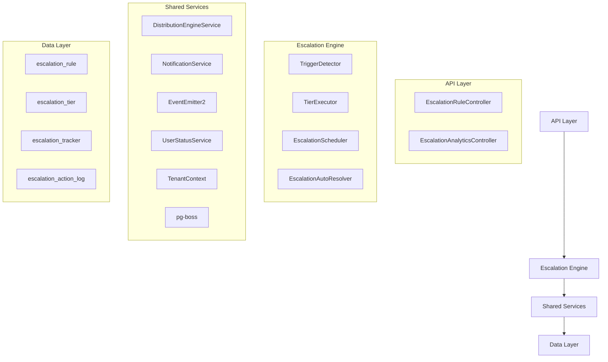

The Escalation Module automates responses when assigned leads go stale. A scheduled engine detects trigger conditions (no first contact, went cold) and executes tiered escalation actions — notifications, temperature changes, tag additions, and redistribution to new agents.

## Overview

<Info>
**Module Status:** Active — fully implemented  
**Module Path:** `src/modules/crm/escalation/`
</Info>

The Escalation Module provides automated lead management through configurable escalation rules that trigger when leads become stale or require attention.

### Design Principles

| Principle | Decision |
|-----------|----------|
| **pg-boss scheduling** | Escalation scheduler uses pg-boss recurring job for reliability |
| **Tiered actions** | Rules have ordered tiers with configurable delays; actions execute in sequence |
| **Auto-resolution** | Events (activity, stage change, reassignment) automatically resolve active trackers |
| **Idempotency** | Partial unique index + `ON CONFLICT DO NOTHING` prevents duplicate trackers |
| **Distribution delegation** | Reassignment uses the distribution engine (`REDISTRIBUTE` action), not a separate paradigm |
| **RLS compliance** | All entities carry `organization_id` for row-level security |

## Architecture

### High-Level System Design



### Component Responsibilities

<CardGroup cols={2}>
  <Card title="EscalationScheduler" icon="clock">
    pg-boss recurring job that runs every 60 seconds to detect new triggers and process due escalations
  </Card>
  <Card title="TriggerDetector" icon="radar">
    Scans leads for unmet conditions (no first contact, went cold); creates tracker records
  </Card>
  <Card title="TierExecutor" icon="play">
    Executes escalation tier actions (notify, redistribute, change temp, add tag)
  </Card>
  <Card title="EscalationAutoResolver" icon="check-circle">
    Listens to domain events and resolves active trackers when conditions change
  </Card>
</CardGroup>

## Entity Specifications

### EscalationRule

<Note>
Defines when and how a lead should be escalated. Evaluated by `TriggerDetector`.
</Note>

| Column | Type | Description |
|--------|------|-------------|
| `id` | uuid PK | Primary key |
| `organization_id` | uuid FK | RLS compliance |
| `name` | varchar | Human-readable rule name |
| `is_active` | bool | Default true |
| `priority` | int | Evaluation order (lower = higher priority) |
| `trigger_type` | enum | `NO_FIRST_CONTACT`, `WENT_COLD` |
| `trigger_config` | jsonb | `{thresholdMinutes?, thresholdValue?, thresholdUnit?}` |
| `conditions` | jsonb | `EscalationCondition[]` — AND-joined filters |
| `respect_business_hours` | bool | Default true, references org business hours |
| `created_by` | uuid FK | User who created the rule |
| `created_at`, `updated_at` | timestamp | Audit timestamps |
| `is_deleted` | bool | Soft delete flag |

<Warning>
Rules are evaluated in ascending `priority` order. Active rules must use unique priorities within the organization. The backend enforces this invariant on create, priority update, and reactivation.
</Warning>

#### EscalationCondition Structure

```typescript
interface EscalationCondition {
  field: 'temperature' | 'leadSource' | 'language' | 'sourceChannel';
  operator: 'eq' | 'in';
  value: string | string[];
}
```

#### SQL Field Mapping

| Field | SQL Column | Table | Notes |
|-------|------------|-------|-------|
| `temperature` | `l.temperature` | lead | Direct mapping |
| `leadSource` | `l.lead_source` | lead | Direct mapping |
| `sourceChannel` | `l.source_channel` | lead | Direct mapping |
| `language` | `p.languages` | person | Requires JOIN, matches JSONB `languages[].code` |

### EscalationTier

Each tier represents a delayed action set that executes in `tier_order` sequence.

| Column | Type | Description |
|--------|------|-------------|
| `id` | uuid PK | Primary key |
| `escalation_rule_id` | uuid FK | Parent rule reference |
| `organization_id` | uuid FK | RLS compliance |
| `tier_order` | int | Execution order (1, 2, 3... max 10) |
| `delay_minutes` | int | Minutes after previous tier (Tier 1: always 0) |
| `actions` | jsonb | `TierAction[]` array |

<Tip>
Tier 1 always has `delay_minutes = 0` — the rule's threshold provides the initial timing control. Subsequent tiers specify minutes after the previous tier completed.
</Tip>

#### Tier Action Types

<Tabs>
  <Tab title="Notification Actions">
    | Action Type | Parameters | Resolution |
    |-------------|------------|------------|
    | `NOTIFY_AGENT` | `message?: string` | Resolved from lead's current stakeholder |
    | `NOTIFY_ADMIN` | `message?: string` | Self-resolving — queries org users with `system.admin` permission |
    | `NOTIFY_MANAGER` | `userId: string, message?: string` | Specific user notification |
  </Tab>
  
  <Tab title="Lead Management Actions">
    | Action Type | Parameters | Resolution |
    |-------------|------------|------------|
    | `CHANGE_TEMPERATURE` | `temperature: LeadTemperature` | Updates lead temperature |
    | `ADD_TAG` | `tagName: string` | Creates/assigns tag to lead |
    | `REDISTRIBUTE` | `message?: string` | Uses DistributionEngine for reassignment |
  </Tab>
</Tabs>

### EscalationTracker

Tracks the lifecycle of an escalation instance for a specific lead.

| Column | Type | Description |
|--------|------|-------------|
| `id` | uuid PK | Primary key |
| `organization_id` | uuid FK | RLS compliance |
| `escalation_rule_id` | uuid FK | Source rule |
| `lead_id` | uuid FK | Target lead |
| `trigger_type` | enum | Copy of rule's trigger type |
| `status` | enum | `ACTIVE`, `RESOLVED`, `CANCELLED` |
| `triggered_at` | timestamp | When escalation started |
| `resolved_at` | timestamp | When escalation completed |
| `resolution_reason` | enum | Why escalation ended |
| `current_tier` | int | Next tier to execute |
| `last_tier_executed_at` | timestamp | Previous tier completion time |

<Check>
**Uniqueness Constraint:** Partial unique index on `(lead_id, escalation_rule_id)` where `status = 'ACTIVE'` prevents duplicate active trackers.
</Check>

### EscalationActionLog

Audit trail for all executed escalation actions.

| Column | Type | Description |
|--------|------|-------------|
| `id` | uuid PK | Primary key |
| `organization_id` | uuid FK | RLS compliance |
| `escalation_tracker_id` | uuid FK | Parent tracker |
| `tier_order` | int | Which tier executed |
| `action_type` | varchar | Action that was performed |
| `action_config` | jsonb | Action parameters |
| `status` | enum | `SUCCESS`, `FAILED`, `SKIPPED` |
| `result_data` | jsonb | Execution results/errors |
| `executed_at` | timestamp | When action ran |

## Escalation Engine

### TriggerDetector

<Steps>
  <Step title="Query Active Rules">
    Fetches all active escalation rules ordered by priority
  </Step>
  
  <Step title="Build Lead Query">
    For each rule, constructs SQL to find eligible leads:
    - Applies trigger-specific conditions
    - Adds applicability filters from rule conditions
    - Excludes leads with active trackers for this rule
  </Step>
  
  <Step title="Create Trackers">
    Uses `INSERT ... ON CONFLICT DO NOTHING` for idempotent tracker creation
  </Step>
</Steps>

#### Trigger Types

<AccordionGroup>
  <Accordion title="NO_FIRST_CONTACT">
    **Condition:** Lead assigned for X minutes without any activity
    
    **SQL Logic:**
    ```sql
    WHERE l.stakeholder_id IS NOT NULL
      AND l.last_activity_at IS NULL
      AND l.updated_at <= NOW() - INTERVAL '{thresholdMinutes} minutes'
    ```
    
    **Config:** `{thresholdMinutes: number}`
  </Accordion>
  
  <Accordion title="WENT_COLD">
    **Condition:** Lead had activity but none for X time period
    
    **SQL Logic:**
    ```sql
    WHERE l.stakeholder_id IS NOT NULL
      AND l.last_activity_at IS NOT NULL
      AND l.last_activity_at <= NOW() - INTERVAL '{thresholdMinutes} minutes'
    ```
    
    **Config:** `{thresholdMinutes: number}`
  </Accordion>
</AccordionGroup>

### TierExecutor

Processes escalation tiers when their delay period expires.

<CodeGroup>
```typescript Tier Execution Flow
async executeTier(tracker: EscalationTracker): Promise<void> {
  const tier = await this.getTierByOrder(
    tracker.escalation_rule_id, 
    tracker.current_tier
  );
  
  const actionResults = [];
  
  for (const action of tier.actions) {
    try {
      const result = await this.executeAction(action, tracker);
      actionResults.push({ action, result, status: 'SUCCESS' });
    } catch (error) {
      actionResults.push({ action, error, status: 'FAILED' });
    }
  }
  
  await this.logTierExecution(tracker, tier, actionResults);
  await this.advanceToNextTier(tracker);
}
```

```typescript Action Resolution
async executeAction(action: TierAction, tracker: EscalationTracker): Promise<any> {
  switch (action.type) {
    case 'NOTIFY_AGENT':
      return this.notifyCurrentStakeholder(tracker.lead_id, action.message);
      
    case 'NOTIFY_ADMIN':
      return this.notifyOrgAdmins(tracker.organization_id, action.message);
      
    case 'REDISTRIBUTE':
      return this.distributionEngine.redistributeLead(
        tracker.lead_id, 
        action.message
      );
      
    case 'CHANGE_TEMPERATURE':
      return this.updateLeadTemperature(tracker.lead_id, action.temperature);
      
    case 'ADD_TAG':
      return this.addLeadTag(tracker.lead_id, action.tagName);
  }
}
```
</CodeGroup>

### EscalationAutoResolver

Listens to domain events and automatically resolves active trackers when conditions change.

#### Auto-Resolution Events

| Event | Resolution Reason | Trigger |
|-------|------------------|---------|
| Lead activity recorded | `ACTIVITY_OCCURRED` | Any new activity on the lead |
| Lead stage changed | `STAGE_CHANGED` | Lead moved to different stage |
| Lead reassigned | `LEAD_REASSIGNED` | Stakeholder changed |
| Lead temperature changed | `TEMPERATURE_CHANGED` | Manual temperature update |

<Warning>
Auto-resolution only affects `ACTIVE` trackers. Once resolved or cancelled, trackers remain in their final state for audit purposes.
</Warning>

## API Endpoints

### Escalation Rules Management

<Tabs>
  <Tab title="Create Rule">
    ```typescript
    POST /api/escalation-rules
    
    interface CreateRuleRequest {
      name: string;
      trigger_type: 'NO_FIRST_CONTACT' | 'WENT_COLD';
      trigger_config: {
        thresholdMinutes?: number;
        thresholdValue?: number;
        thresholdUnit?: 'minutes' | 'hours' | 'days';
      };
      conditions: EscalationCondition[];
      respect_business_hours: boolean;
      tiers: CreateTierRequest[];
    }
    ```
  </Tab>
  
  <Tab title="Update Rule">
    ```typescript
    PATCH /api/escalation-rules/:id
    
    interface UpdateRuleRequest {
      name?: string;
      is_active?: boolean;
      priority?: number;
      conditions?: EscalationCondition[];
      respect_business_hours?: boolean;
      tiers?: UpdateTierRequest[];
    }
    ```
  </Tab>
  
  <Tab title="List Rules">
    ```typescript
    GET /api/escalation-rules
    
    Query Parameters:
    - is_active?: boolean
    - include_deleted?: boolean
    - sort_by?: 'priority' | 'created_at' | 'name'
    - sort_order?: 'asc' | 'desc'
    ```
  </Tab>
</Tabs>

### Analytics & Monitoring

<CardGroup cols={2}>
  <Card title="Rule Performance" icon="chart-line">
    ```typescript
    GET /api/escalation-rules/:id/analytics
    
    Response: {
      total_triggers: number;
      avg_resolution_time: number;
      success_rate: number;
      action_breakdown: Record<string, number>;
    }
    ```
  </Card>
  
  <Card title="Active Trackers" icon="list">
    ```typescript
    GET /api/escalation-trackers
    
    Query Parameters:
    - status?: 'ACTIVE' | 'RESOLVED' | 'CANCELLED'
    - rule_id?: string
    - lead_id?: string
    - limit?: number
    - offset?: number
    ```
  </Card>
</CardGroup>

## Security & Permissions

### Permission Requirements

| Action | Permission Key | Notes |
|--------|----------------|-------|
| Create/Edit Rules | `escalation.manage` | Full rule management |
| View Rules | `escalation.view` | Read-only access |
| View Analytics | `escalation.analytics` | Reporting access |
| Cancel Trackers | `escalation.manage` | Administrative control |

### Row-Level Security

<Note>
All escalation entities include `organization_id` and are protected by RLS policies. Users can only access escalation data within their organization.
</Note>

```sql
-- Example RLS Policy for escalation_rule
CREATE POLICY escalation_rule_tenant_isolation ON escalation_rule
  FOR ALL TO authenticated
  USING (organization_id = current_setting('app.current_organization_id')::uuid);
```

## Performance & Scaling

### Optimization Strategies

<Steps>
  <Step title="Database Indexing">
    Key indexes for escalation performance:
    - `(organization_id, is_active, priority)` on `escalation_rule`
    - `(lead_id, escalation_rule_id, status)` on `escalation_tracker`
    - `(organization_id, status, last_tier_executed_at)` on `escalation_tracker`
  </Step>
  
  <Step title="Query Optimization">
    - Trigger detection uses single query per rule
    - Batch processing for tracker creation
    - Efficient joins for applicability filtering
  </Step>
  
  <Step title="Scheduling Efficiency">
    - pg-boss recurring job every 60 seconds
    - Configurable batch sizes for processing
    - Business hours respect reduces unnecessary checks
  </Step>
</Steps>

### Monitoring Metrics

| Metric | Purpose | Alert Threshold |
|--------|---------|----------------|
| `escalation_scheduler_duration_ms` | Scheduler performance | > 30 seconds |
| `escalation_triggers_created_total` | System activity | Trend analysis |
| `escalation_actions_failed_total` | Error rate | > 5% failure rate |
| `escalation_active_trackers_count` | System load | > 10k active |

## Edge Case Handling

<AccordionGroup>
  <Accordion title="Concurrent Lead Updates">
    **Scenario:** Lead activity occurs while escalation tier is executing
    
    **Solution:** Auto-resolver processes events asynchronously. If resolution occurs during tier execution, the tracker is marked resolved but current tier actions complete normally.
  </Accordion>
  
  <Accordion title="Rule Deletion with Active Trackers">
    **Scenario:** Rule is deleted while trackers are active
    
    **Solution:** All active trackers for the rule are automatically cancelled with reason `RULE_DELETED`. Scheduled processing skips cancelled trackers.
  </Accordion>
  
  <Accordion title="Business Hours Boundaries">
    **Scenario:** Tier execution due outside business hours
    
    **Solution:** When `respect_business_hours = true`, tier execution is delayed until the next business hours period begins.
  </Accordion>
  
  <Accordion title="Agent Availability">
    **Scenario:** Notify action targets unavailable agent
    
    **Solution:** 
    - `NOTIFY_AGENT` falls back to admin notification if agent unavailable
    - `REDISTRIBUTE` handles agent capacity automatically
    - Failed actions are logged but don't block tier progression
  </Accordion>
</AccordionGroup>

## Module Structure

```
src/modules/crm/escalation/
├── controllers/
│   ├── escalation-rule.controller.ts
│   └── escalation-analytics.controller.ts
├── entities/
│   ├── escalation-rule.entity.ts
│   ├── escalation-tier.entity.ts
│   ├── escalation-tracker.entity.ts
│   └── escalation-action-log.entity.ts
├── services/
│   ├── escalation-rule.service.ts
│   ├── escalation-scheduler.service.ts
│   ├── trigger-detector.service.ts
│   ├── tier-executor.service.ts
│   └── escalation-auto-resolver.service.ts
├── types/
│   ├── escalation-condition.type.ts
│   ├── tier-action.type.ts
│   └── escalation-enums.type.ts
└── escalation.module.ts
```

## Integration Points

<CardGroup cols={3}>
  <Card title="Distribution Engine" icon="shuffle">
    **Purpose:** Lead redistribution via `REDISTRIBUTE` action
    
    **Interface:** `redistributeLead(leadId, message?)`
  </Card>
  
  <Card title="Notification Service" icon="bell">
    **Purpose:** User notifications for all notification actions
    
    **Interface:** `sendNotification(userId, message, metadata)`
  </Card>
  
  <Card title="Lead Management" icon="user-group">
    **Purpose:** Lead updates (temperature, tags, stakeholder)
    
    **Interface:** Direct entity updates through MikroORM
  </Card>
</CardGroup>

### Event Dependencies

| Emitted Events | Consumed Events |
|----------------|-----------------|
| `escalation.tracker.created` | `lead.activity.recorded` |
| `escalation.tracker.resolved` | `lead.stage.changed` |
| `escalation.action.executed` | `lead.stakeholder.changed` |
| `escalation.tier.completed` | `lead.temperature.changed` |

<Tip>
The escalation module integrates seamlessly with the existing CRM event system, automatically responding to lead lifecycle changes without requiring manual intervention.
</Tip>