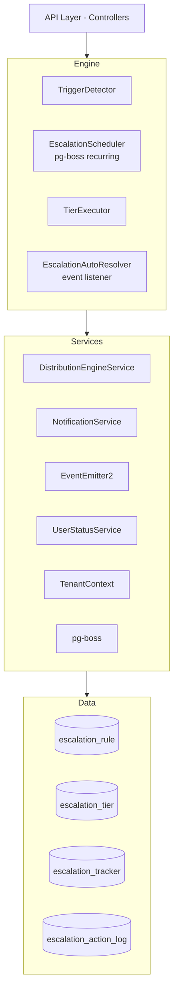

## Overview

The Escalation Module automates responses when assigned leads go stale. A scheduled engine detects trigger conditions (no first contact, went cold) and executes tiered escalation actions — notifications, temperature changes, tag additions, and redistribution to new agents.

### Design Principles

<AccordionGroup>
  <Accordion title="pg-boss scheduling">
    Escalation scheduler uses pg-boss recurring job for reliability
  </Accordion>
  
  <Accordion title="Tiered actions">
    Rules have ordered tiers with configurable delays; actions execute in sequence
  </Accordion>
  
  <Accordion title="Auto-resolution">
    Events (activity, stage change, reassignment) automatically resolve active trackers
  </Accordion>
  
  <Accordion title="Idempotency">
    Partial unique index + `ON CONFLICT DO NOTHING` prevents duplicate trackers
  </Accordion>
  
  <Accordion title="Distribution delegation">
    Reassignment uses the distribution engine (`REDISTRIBUTE` action), not a separate paradigm
  </Accordion>
  
  <Accordion title="RLS compliance">
    All entities carry `organization_id` for row-level security
  </Accordion>
</AccordionGroup>

---

## Architecture

### High-level diagram



### Component responsibilities

| Component | Responsibility |
|-----------|---------------|
| **EscalationScheduler** | pg-boss recurring job that runs every 60 seconds to detect new triggers and process due escalations |
| **TriggerDetector** | Scans leads for unmet conditions (no first contact, went cold); creates tracker records |
| **TierExecutor** | Executes escalation tier actions (notify, redistribute, change temp, add tag) |
| **EscalationAutoResolver** | Listens to domain events and resolves active trackers when conditions change |
| **EscalationRuleService** | CRUD for escalation rules; handles tracker cancellation on deactivation/deletion |

---

## Entity specifications

### EscalationRule

Defines when and how a lead should be escalated. Evaluated by `TriggerDetector`.

<Tabs>
  <Tab title="Schema">
    | Column | Type | Notes |
    |--------|------|-------|
    | id | uuid PK | |
    | organization_id | uuid FK | RLS |
    | name | varchar | Human-readable rule name |
    | is_active | bool | default true |
    | priority | int | Evaluation order |
    | trigger_type | enum | `NO_FIRST_CONTACT`, `WENT_COLD` |
    | trigger_config | jsonb | `{thresholdMinutes?, thresholdValue?, thresholdUnit?}` |
    | condition_groups | jsonb | `[{conditions:[{field,operator,value}]}]` — AND-within-OR groups; `[]` = all leads |
    | respect_business_hours | bool | default true. References org business hours schedule. |
    | created_by | uuid FK | |
    | created_at, updated_at | timestamp | |
    | is_deleted | bool | soft delete |
  </Tab>
  
  <Tab title="Priority Rules">
    <Warning>
      Rules are evaluated in ascending `priority` order (lower number = higher priority). Active rules must use unique priorities within the organization.
    </Warning>

    - Frontend defaults `priority` to one greater than the highest active escalation rule priority
    - Edit mode preserves the existing rule priority
    - Frontend disables submission when an active rule would reuse another active rule's priority
    - Backend enforces the invariant on create, priority update, and reactivation
    - Inactive rules may keep duplicate priorities until activation
    - Rejection returns `400 Bad Request` on conflict
  </Tab>
  
  <Tab title="Duplicate Prevention">
    <Info>
      Rule `name` is a display label only — duplicate names are allowed.
    </Info>

    The backend rejects create/update when another **non-deleted** rule in the same organization has an identical **behavior fingerprint**:

    - `triggerType`
    - Normalized `triggerConfig`
    - Canonical `conditionGroups`
    - Canonical tiers/actions (`tierOrder`, `delayMinutes`, action type + params)

    Comparison ignores group/condition ordering within JSONB and treats legacy `thresholdMinutes` as equivalent to `thresholdValue` + `thresholdUnit: MINUTES`.

    On conflict: `400 Bad Request` with message `An escalation rule with identical trigger, conditions, and actions already exists.`

    **Location:** `src/modules/crm/escalation/escalation-rule-fingerprint.util.ts`
  </Tab>
</Tabs>

#### Applicability conditions

Escalation reuses the shared rule-condition module (`src/modules/crm/shared/rule-conditions/`). Stored shape matches distribution rules: `ConditionGroup[]` where conditions within a group are AND-joined and multiple groups are OR-joined.

```typescript
interface ConditionGroup {
  conditions: RuleCondition[]; // AND within group
}
// A lead matches when ANY group fully passes. Empty conditionGroups[] = all leads.
```

<Note>
  Same 8 fields, 6 operators, and value-shape validation as distribution rules.
</Note>

**API shape:**
- `CreateEscalationRuleDto` / `UpdateEscalationRuleDto` accept optional `conditionGroups?: ConditionGroupDto[]`
- `EscalationRuleDto` returns `conditionGroups: ConditionGroup[]`
- Omitted or empty `conditionGroups` means the rule applies to all leads

**Migration:** `Migration20260607120000_EscalationConditionsToGroups` replaced the flat `conditions` JSONB column with `condition_groups`.

#### SQL field mapping

Used by `LeadScanService.buildApplicabilityExtraWhere`:

<AccordionGroup>
  <Accordion title="temperature">
    - **SQL:** `l.temperature`
    - **Table:** lead
    - **Operators:** eq, in
    - **Notes:** Case-insensitive
  </Accordion>
  
  <Accordion title="leadSource">
    - **SQL:** `l.lead_source`
    - **Table:** lead
    - **Operators:** eq, in
    - **Notes:** Case-insensitive
  </Accordion>
  
  <Accordion title="intent">
    - **SQL:** `l.intent`
    - **Table:** lead
    - **Operators:** eq
    - **Notes:** Case-insensitive
  </Accordion>
  
  <Accordion title="budget">
    - **SQL:** `l.budget`
    - **Table:** lead
    - **Operators:** eq, gte, lte, between
    - **Notes:** Numeric; `between` accepts `{ min, max }` or `[min, max]`
  </Accordion>
  
  <Accordion title="tags">
    - **SQL:** `l.tag_ids`
    - **Table:** lead
    - **Operators:** contains
    - **Notes:** `EXISTS` + `jsonb_array_elements_text` + `IN (?)` per label — lead has any of the tag labels
  </Accordion>
  
  <Accordion title="sourceChannel">
    - **SQL:** `pc.channel_type`
    - **Table:** person_channel
    - **Operators:** eq, in
    - **Notes:** `LEFT JOIN person_channel pc ON pc.id = l.source_channel_id AND pc.is_deleted = false`
  </Accordion>
  
  <Accordion title="language">
    - **SQL:** `p.languages`
    - **Table:** person
    - **Operators:** eq
    - **Notes:** `LEFT JOIN person p ON p.id = l.person_id`; matches JSONB `languages[].code`
  </Accordion>
  
  <Accordion title="area">
    - **SQL:** wished snapshot names
    - **Table:** lead_property_interest
    - **Operators:** eq, in, contains
    - **Notes:** `EXISTS` subquery flattening `wished_area_snapshots`, `wished_community_snapshots`, `wished_subcommunity_snapshots`, `wished_project_snapshots`, `wished_building_snapshots`; case-insensitive name match via `name` / `nameEn` / `nameAr`
  </Accordion>
</AccordionGroup>

<Warning>
  Unknown `field` keys (corrupt/legacy JSONB only — HTTP DTO validation rejects them on write) are skipped with a warning. Groups whose conditions are all empty or skipped produce `AND FALSE` (no leads match).
</Warning>

### EscalationTier

Each tier in an escalation rule represents a delayed action set. Tiers execute in `tier_order` sequence.

| Column | Type | Notes |
|--------|------|-------|
| id | uuid PK | |
| escalation_rule_id | uuid FK | |
| tier_order | int | Execution sequence (1-based) |
| delay_minutes | int | Minutes after trigger before this tier executes |
| actions | jsonb | Array of action objects: `[{type, params}]` |
| created_at, updated_at | timestamp | |

**Action types:**

```typescript
enum EscalationActionType {
  NOTIFY_MANAGER = 'NOTIFY_MANAGER',
  NOTIFY_ADMIN = 'NOTIFY_ADMIN', 
  NOTIFY_CUSTOM_USER = 'NOTIFY_CUSTOM_USER',
  CHANGE_TEMPERATURE = 'CHANGE_TEMPERATURE',
  ADD_TAG = 'ADD_TAG',
  REDISTRIBUTE = 'REDISTRIBUTE'
}
```

<Tabs>
  <Tab title="NOTIFY_MANAGER">
    ```json
    {
      "type": "NOTIFY_MANAGER",
      "params": {
        "message": "Lead {leadName} has not been contacted..."
      }
    }
    ```
    Sends notification to the lead's assigned agent's manager.
  </Tab>
  
  <Tab title="NOTIFY_ADMIN">
    ```json
    {
      "type": "NOTIFY_ADMIN",
      "params": {
        "roleId": "uuid",
        "message": "Lead escalation..."
      }
    }
    ```
    Sends notification to all users with specified role.
  </Tab>
  
  <Tab title="NOTIFY_CUSTOM_USER">
    ```json
    {
      "type": "NOTIFY_CUSTOM_USER",
      "params": {
        "userId": "uuid",
        "message": "Custom notification..."
      }
    }
    ```
    Sends notification to specific user.
  </Tab>
  
  <Tab title="CHANGE_TEMPERATURE">
    ```json
    {
      "type": "CHANGE_TEMPERATURE",
      "params": {
        "temperature": "COLD"
      }
    }
    ```
    Updates lead temperature to specified value.
  </Tab>
  
  <Tab title="ADD_TAG">
    ```json
    {
      "type": "ADD_TAG",
      "params": {
        "tagId": "uuid"
      }
    }
    ```
    Adds specified tag to lead.
  </Tab>
  
  <Tab title="REDISTRIBUTE">
    ```json
    {
      "type": "REDISTRIBUTE",
      "params": {}
    }
    ```
    Triggers distribution engine to reassign lead.
  </Tab>
</Tabs>

### EscalationTracker

Tracks the escalation lifecycle for a single lead. Created when trigger conditions are met.

| Column | Type | Notes |
|--------|------|-------|
| id | uuid PK | |
| organization_id | uuid FK | RLS |
| lead_id | uuid FK | |
| escalation_rule_id | uuid FK | |
| status | enum | `ACTIVE`, `RESOLVED`, `CANCELLED` |
| triggered_at | timestamp | When tracker was created |
| last_tier_executed | int | nullable; highest tier_order completed |
| next_tier_due_at | timestamp | nullable; when next tier should execute |
| resolved_at | timestamp | nullable |
| resolution_reason | varchar | nullable; `ACTIVITY_DETECTED`, `STAGE_CHANGED`, `REASSIGNED`, `RULE_DEACTIVATED` |
| created_at, updated_at | timestamp | |

<Info>
  **Idempotency:** Partial unique index on `(lead_id, escalation_rule_id) WHERE status = 'ACTIVE'` prevents duplicate active trackers.
</Info>

### EscalationActionLog

Audit trail for every escalation action executed.

| Column | Type | Notes |
|--------|------|-------|
| id | uuid PK | |
| organization_id | uuid FK | RLS |
| escalation_tracker_id | uuid FK | |
| tier_order | int | Which tier this action belonged to |
| action_type | varchar | |
| action_params | jsonb | |
| executed_at | timestamp | |
| status | enum | `SUCCESS`, `FAILED`, `SKIPPED` |
| error_message | text | nullable |
| created_at | timestamp | |

---

## Type definitions

### Trigger types

```typescript
enum EscalationTriggerType {
  NO_FIRST_CONTACT = 'NO_FIRST_CONTACT',
  WENT_COLD = 'WENT_COLD'
}
```

<Tabs>
  <Tab title="NO_FIRST_CONTACT">
    Lead has been assigned but no activity logged within threshold window.
    
    **Trigger config:**
    ```json
    {
      "thresholdValue": 24,
      "thresholdUnit": "HOURS"
    }
    ```
  </Tab>
  
  <Tab title="WENT_COLD">
    Lead temperature changed to COLD and remained COLD for threshold duration.
    
    **Trigger config:**
    ```json
    {
      "thresholdValue": 7,
      "thresholdUnit": "DAYS"
    }
    ```
  </Tab>
</Tabs>

### Threshold units

```typescript
enum ThresholdUnit {
  MINUTES = 'MINUTES',
  HOURS = 'HOURS',
  DAYS = 'DAYS'
}
```

<Note>
  Legacy `thresholdMinutes` field is converted to `thresholdValue` + `thresholdUnit: MINUTES` for backward compatibility.
</Note>

### Resolution reasons

```typescript
enum EscalationResolutionReason {
  ACTIVITY_DETECTED = 'ACTIVITY_DETECTED',
  STAGE_CHANGED = 'STAGE_CHANGED',
  REASSIGNED = 'REASSIGNED',
  RULE_DEACTIVATED = 'RULE_DEACTIVATED',
  MANUAL = 'MANUAL'
}
```

---

## Escalation engine

### Scheduler architecture

<Steps>
  <Step title="pg-boss recurring job">
    `EscalationScheduler` registers a recurring job named `escalation-check` that runs every 60 seconds.
  </Step>
  
  <Step title="Trigger detection">
    `TriggerDetector.detectAndCreateTrackers()` scans for new violations:
    - Queries active rules in priority order
    - For each rule, scans applicable leads using `LeadScanService`
    - Creates `ACTIVE` trackers for leads without existing active trackers
  </Step>
  
  <Step title="Tier execution">
    `TierExecutor.processOverdueEscalations()` finds trackers where `next_tier_due_at <= now()`:
    - Loads next pending tier
    - Executes each action in sequence
    - Logs results to `escalation_action_log`
    - Updates tracker with `last_tier_executed` and calculates `next_tier_due_at`
  </Step>
  
  <Step title="Auto-resolution">
    `EscalationAutoResolver` listens to domain events and resolves active trackers when trigger conditions no longer apply.
  </Step>
</Steps>

### TriggerDetector

**Module path:** `src/modules/crm/escalation/services/trigger-detector.service.ts`

<CodeGroup>
```typescript detectAndCreateTrackers
async detectAndCreateTrackers(orgId: string): Promise<void> {
  const rules = await this.ruleRepo.find({
    organization_id: orgId,
    is_active: true,
    is_deleted: false
  }, { orderBy: { priority: 'ASC' } });

  for (const rule of rules) {
    const leads = await this.scanLeadsForRule(rule);
    
    for (const lead of leads) {
      await this.createTracker(lead, rule);
    }
  }
}
```

```typescript scanLeadsForRule
async scanLeadsForRule(rule: EscalationRule): Promise<Lead[]> {
  const triggerCondition = this.buildTriggerCondition(rule);
  const applicabilityWhere = this.buildApplicabilityWhere(rule);
  
  return this.leadScanService.scan({
    organizationId: rule.organization_id,
    triggerCondition,
    applicabilityWhere,
    respectBusinessHours: rule.respect_business_hours
  });
}
```
</CodeGroup>

**Trigger condition building:**

| Trigger Type | SQL Logic |
|--------------|-----------|
| `NO_FIRST_CONTACT` | `assigned_to IS NOT NULL AND assigned_at <= threshold AND NOT EXISTS (activity since assigned_at)` |
| `WENT_COLD` | `temperature = 'COLD' AND temperature_updated_at <= threshold` |

<Warning>
  Business hours respect: When `respect_business_hours = true`, threshold calculations exclude non-business hours using the organization's configured schedule.
</Warning>

### TierExecutor

**Module path:** `src/modules/crm/escalation/services/tier-executor.service.ts`

<Steps>
  <Step title="Find overdue trackers">
    ```sql
    SELECT * FROM escalation_tracker
    WHERE status = 'ACTIVE'
      AND next_tier_due_at <= NOW()
      AND organization_id = ?
    ORDER BY next_tier_due_at ASC
    ```
  </Step>
  
  <Step title="Load next tier">
    ```typescript
    const nextTier = await this.tierRepo.findOne({
      escalation_rule_id: tracker.escalation_rule_id,
      tier_order: (tracker.last_tier_executed || 0) + 1
    });
    ```
  </Step>
  
  <Step title="Execute actions">
    For each action in `tier.actions`:
    
    <Tabs>
      <Tab title="NOTIFY_*">
        ```typescript
        await this.notificationService.create({
          recipientId,
          type: 'ESCALATION_ALERT',
          title: 'Lead Escalation',
          message: interpolated_message,
          metadata: { leadId, trackerId }
        });
        ```
      </Tab>
      
      <Tab title="CHANGE_TEMPERATURE">
        ```typescript
        await this.leadService.update(leadId, {
          temperature: params.temperature,
          temperature_updated_at: new Date()
        });
        ```
      </Tab>
      
      <Tab title="ADD_TAG">
        ```typescript
        await this.leadService.addTag(leadId, params.tagId);
        ```
      </Tab>
      
      <Tab title="REDISTRIBUTE">
        ```typescript
        await this.distributionEngine.redistribute(leadId, {
          reason: 'ESCALATION',
          context: { trackerId }
        });
        ```
      </Tab>
    </Tabs>
  </Step>
  
  <Step title="Update tracker">
    ```typescript
    tracker.last_tier_executed = nextTier.tier_order;
    tracker.next_tier_due_at = this.calculateNextDueDate(tracker);
    await this.trackerRepo.flush();
    ```
  </Step>
  
  <Step title="Log action results">
    ```typescript
    await this.actionLogRepo.create({
      escalation_tracker_id: tracker.id,
      tier_order: nextTier.tier_order,
      action_type: action.type,
      status: 'SUCCESS',
      executed_at: new Date()
    });
    ```
  </Step>
</Steps>

### EscalationAutoResolver

**Module path:** `src/modules/crm/escalation/services/escalation-auto-resolver.service.ts`

Listens to domain events and automatically resolves active escalation trackers when trigger conditions no longer apply.

<Tabs>
  <Tab title="Activity detected">
    ```typescript
    @OnEvent('lead.activity.created')
    async onActivityCreated(payload: { leadId: string }) {
      await this.resolveActiveTrackers(payload.leadId, 'ACTIVITY_DETECTED');
    }
    ```
  </Tab>
  
  <Tab title="Stage changed">
    ```typescript
    @OnEvent('lead.stage.changed')
    async onStageChanged(payload: { leadId: string }) {
      await this.resolveActiveTrackers(payload.leadId, 'STAGE_CHANGED');
    }
    ```
  </Tab>
  
  <Tab title="Reassigned">
    ```typescript
    @OnEvent('lead.assigned')
    async onLeadAssigned(payload: { leadId: string }) {
      await this.resolveActiveTrackers(payload.leadId, 'REASSIGNED');
    }
    ```
  </Tab>
  
  <Tab title="Rule deactivated">
    ```typescript
    @OnEvent('escalation.rule.deactivated')
    async onRuleDeactivated(payload: { ruleId: string }) {
      await this.cancelTrackersForRule(payload.ruleId, 'RULE_DEACTIVATED');
    }
    ```
  </Tab>
</Tabs>

**Resolution logic:**

```typescript
async resolveActiveTrackers(
  leadId: string,
  reason: EscalationResolutionReason
): Promise<void> {
  const trackers = await this.trackerRepo.find({
    lead_id: leadId,
    status: 'ACTIVE'
  });

  for (const tracker of trackers) {
    tracker.status = 'RESOLVED';
    tracker.resolved_at = new Date();
    tracker.resolution_reason = reason;
  }

  await this.trackerRepo.flush();
}
```

---

## API endpoints

### Rule management

<CodeGroup>
```typescript POST /escalation-rules
@Post()
@Permissions('escalation:create')
async createRule(@Body() dto: CreateEscalationRuleDto) {
  return this.ruleService.create(dto);
}
```

```typescript GET /escalation-rules
@Get()
@Permissions('escalation:read')
async listRules(@Query() query: ListEscalationRulesDto) {
  return this.ruleService.findAll(query);
}
```

```typescript GET /escalation-rules/:id
@Get(':id')
@Permissions('escalation:read')
async getRule(@Param('id') id: string) {
  return this.ruleService.findOne(id);
}
```

```typescript PATCH /escalation-rules/:id
@Patch(':id')
@Permissions('escalation:update')
async updateRule(
  @Param('id') id: string,
  @Body() dto: UpdateEscalationRuleDto
) {
  return this.ruleService.update(id, dto);
}
```

```typescript DELETE /escalation-rules/:id
@Delete(':id')
@Permissions('escalation:delete')
async deleteRule(@Param('id') id: string) {
  return this.ruleService.softDelete(id);
}
```

```typescript POST /escalation-rules/:id/activate
@Post(':id/activate')
@Permissions('escalation:update')
async activateRule(@Param('id') id: string) {
  return this.ruleService.activate(id);
}
```

```typescript POST /escalation-rules/:id/deactivate
@Post(':id/deactivate')
@Permissions('escalation:update')
async deactivateRule(@Param('id') id: string) {
  return this.ruleService.deactivate(id);
}
```
</CodeGroup>

### Tracker management

<CodeGroup>
```typescript GET /escalation-trackers
@Get()
@Permissions('escalation:read')
async listTrackers(@Query() query: ListEscalationTrackersDto) {
  return this.trackerService.findAll(query);
}
```

```typescript GET /escalation-trackers/:id
@Get(':id')
@Permissions('escalation:read')
async getTracker(@Param('id') id: string) {
  return this.trackerService.findOne(id);
}
```

```typescript POST /escalation-trackers/:id/resolve
@Post(':id/resolve')
@Permissions('escalation:update')
async resolveTracker(
  @Param('id') id: string,
  @Body() dto: ResolveTrackerDto
) {
  return this.trackerService.resolve(id, dto.reason);
}
```
</CodeGroup>

### Analytics

<CodeGroup>
```typescript GET /escalation-analytics/summary
@Get('summary')
@Permissions('escalation:read')
async getSummary(@Query() query: EscalationSummaryDto) {
  return this.analyticsService.getSummary(query);
}
```

```typescript GET /escalation-analytics/rule-performance
@Get('rule-performance')
@Permissions('escalation:read')
async getRulePerformance(@Query() query: RulePerformanceDto) {
  return this.analyticsService.getRulePerformance(query);
}
```

```typescript GET /escalation-analytics/action-logs
@Get('action-logs')
@Permissions('escalation:read')
async getActionLogs(@Query() query: ActionLogsDto) {
  return this.analyticsService.getActionLogs(query);
}
```
</CodeGroup>

---

## Security & permissions

### Permission matrix

| Action | Permission | Description |
|--------|-----------|-------------|
| Create rule | `escalation:create` | Create new escalation rules |
| Read rules | `escalation:read` | View escalation rules and trackers |
| Update rule | `escalation:update` | Modify escalation rules, activate/deactivate |
| Delete rule | `escalation:delete` | Soft delete escalation rules |
| Resolve tracker | `escalation:update` | Manually resolve active trackers |
| View analytics | `escalation:read` | Access escalation analytics and logs |

<Warning>
  All endpoints enforce organization-level isolation via RLS policies. Users can only access data from their own organization.
</Warning>

### Data access patterns

<Tabs>
  <Tab title="Organization isolation">
    All queries automatically filter by `organization_id` from tenant context:
    
    ```typescript
    const rules = await this.ruleRepo.find({
      organization_id: this.tenantContext.organizationId,
      is_deleted: false
    });
    ```
  </Tab>
  
  <Tab title="User visibility">
    - Admins: See all escalation data within organization
    - Managers: See escalations for their team's leads
    - Agents: See escalations for their own assigned leads
  </Tab>
  
  <Tab title="Action authorization">
    Notification actions respect recipient visibility:
    - `NOTIFY_MANAGER`: Only sends if manager exists and is active
    - `NOTIFY_ADMIN`: Only sends to users with specified role in org
    - `NOTIFY_CUSTOM_USER`: Validates user belongs to organization
  </Tab>
</Tabs>

---

## Analytics & metrics

### Summary metrics

```typescript
interface EscalationSummary {
  totalActiveTrackers: number;
  totalResolvedToday: number;
  totalCancelledToday: number;
  averageResolutionTimeMinutes: number;
  topTriggerTypes: Array<{
    triggerType: string;
    count: number;
  }>;
  activeRulesCount: number;
  leadsAtRisk: number; // Leads matching active rules but not yet escalated
}
```

### Rule performance

```typescript
interface RulePerformance {
  ruleId: string;
  ruleName: string;
  triggeredCount: number;
  resolvedCount: number;
  cancelledCount: number;
  averageResolutionTimeMinutes: number;
  resolutionReasons: Array<{
    reason: string;
    count: number;
  }>;
  tierExecutionCounts: Array<{
    tierOrder: number;
    executionCount: number;
  }>;
}
```

### Action logs

Queryable audit trail with filters:
- Date range
- Action type
- Status (SUCCESS, FAILED, SKIPPED)
- Tracker ID
- Rule ID

<Info>
  Action logs are retained indefinitely for compliance and audit purposes.
</Info>

---

## Edge case handling

<AccordionGroup>
  <Accordion title="Concurrent tracker creation">
    **Problem:** Multiple scheduler runs might detect the same lead violation simultaneously.
    
    **Solution:** Partial unique index `(lead_id, escalation_rule_id) WHERE status = 'ACTIVE'` + `ON CONFLICT DO NOTHING` in insert statement ensures idempotent tracker creation.
  </Accordion>
  
  <Accordion title="Rule priority conflicts">
    **Problem:** Two admins activate rules with same priority simultaneously.
    
    **Solution:** Backend validates priority uniqueness within transaction; rejects second activation with `400 Bad Request`.
  </Accordion>
  
  <Accordion title="Stale tracker due dates">
    **Problem:** System downtime causes trackers to miss their due dates by hours.
    
    **Solution:** `TierExecutor` processes all overdue trackers in FIFO order by `next_tier_due_at`; no tier is skipped.
  </Accordion>
  
  <Accordion title="Manager not found">
    **Problem:** `NOTIFY_MANAGER` action but assigned agent has no manager.
    
    **Solution:** Action is logged as `SKIPPED` with `error_message: "Assigned agent has no active manager"`.
  </Accordion>
  
  <Accordion title="Redistribution fails">
    **Problem:** `REDISTRIBUTE` action but no eligible agents in distribution pool.
    
    **Solution:** 
    - Action logs as `FAILED` with error message
    - Tracker remains active and continues to next tier
    - Admin receives notification about failed redistribution
  </Accordion>
  
  <Accordion title="Rule deleted mid-escalation">
    **Problem:** Rule soft-deleted while active trackers exist.
    
    **Solution:** `EscalationRuleService.softDelete()` automatically cancels all active trackers with reason `RULE_DEACTIVATED`.
  </Accordion>
  
  <Accordion title="Rapid lead reassignment">
    **Problem:** Lead reassigned multiple times during escalation.
    
    **Solution:** Each reassignment triggers auto-resolution; new trigger detection may create new tracker if conditions still met.
  </Accordion>
  
  <Accordion title="Business hours edge cases">
    **Problem:** Lead assigned Friday 5pm, rule has 2-hour threshold with business hours respect.
    
    **Solution:** Threshold calculation skips weekend; triggers Monday 11am (2 business hours after Friday 5pm).
  </Accordion>
</AccordionGroup>

---

## Performance & scaling

### Query optimization

<Tabs>
  <Tab title="Trigger detection">
    - Indexed on `(organization_id, is_active, priority) WHERE is_deleted = false`
    - Lead scan uses covering index on `(organization_id, assigned_to, assigned_at)`
    - Condition evaluation uses JSONB indexes on `tag_ids`, `temperature`
  </Tab>
  
  <Tab title="Tracker queries">
    - Partial unique index: `(lead_id, escalation_rule_id) WHERE status = 'ACTIVE'`
    - Index on `(status, next_tier_due_at)` for overdue processing
    - Index on `(organization_id, status)` for analytics
  </Tab>
  
  <Tab title="Action logs">
    - Index on `(escalation_tracker_id, executed_at DESC)`
    - Index on `(organization_id, executed_at DESC)` for analytics
    - Index on `(action_type, status)` for filtering
  </Tab>
</Tabs>

### Batch processing

<Steps>
  <Step title="Batch size limits">
    - Trigger detection processes max 1000 leads per rule per run
    - Tier execution processes max 100 overdue trackers per run
    - Prevents single organization from monopolizing scheduler time
  </Step>
  
  <Step title="Organization round-robin">
    Scheduler cycles through organizations with pending work to ensure fair resource distribution.
  </Step>
  
  <Step title="Rate limiting">
    Notification actions respect rate limits:
    - Max 10 notifications per user per minute
    - Excess notifications queued for next run
  </Step>
</Steps>

### Monitoring

<CardGroup cols={2}>
  <Card title="Key metrics" icon="chart-line">
    - Scheduler job duration
    - Trackers created per run
    - Tiers executed per run
    - Action success/failure rates
    - Query execution times
  </Card>
  
  <Card title="Alerting thresholds" icon="bell">
    - Job duration > 30 seconds
    - Action failure rate > 5%
    - Overdue trackers > 100
    - Stale trackers (active > 7 days)
  </Card>
</CardGroup>

---

## RLS policies

### escalation_rule

```sql
-- Org isolation
CREATE POLICY org_isolation ON escalation_rule
  USING (organization_id = current_setting('app.current_organization_id')::uuid);

-- Soft delete exclusion
CREATE POLICY exclude_deleted ON escalation_rule
  USING (is_deleted = false);
```

### escalation_tier

```sql
-- Via parent rule
CREATE POLICY via_rule ON escalation_tier
  USING (
    EXISTS (
      SELECT 1 FROM escalation_rule r
      WHERE r.id = escalation_tier.escalation_rule_id
        AND r.organization_id = current_setting('app.current_organization_id')::uuid
        AND r.is_deleted = false
    )
  );
```

### escalation_tracker

```sql
-- Org isolation
CREATE POLICY org_isolation ON escalation_tracker
  USING (organization_id = current_setting('app.current_organization_id')::uuid);

-- User visibility (agents see own leads only)
CREATE POLICY user_visibility ON escalation_tracker
  USING (
    CASE current_setting('app.current_user_role')
      WHEN 'admin' THEN true
      WHEN 'manager' THEN
        EXISTS (
          SELECT 1 FROM lead l
          INNER JOIN "user" u ON u.id = l.assigned_to
          WHERE l.id = escalation_tracker.lead_id
            AND u.manager_id = current_setting('app.current_user_id')::uuid
        )
      ELSE
        EXISTS (
          SELECT 1 FROM lead l
          WHERE l.id = escalation_tracker.lead_id
            AND l.assigned_to = current_setting('app.current_user_id')::uuid
        )
    END
  );
```

### escalation_action_log

```sql
-- Via parent tracker
CREATE POLICY via_tracker ON escalation_action_log
  USING (
    EXISTS (
      SELECT 1 FROM escalation_tracker t
      WHERE t.id = escalation_action_log.escalation_tracker_id
        AND t.organization_id = current_setting('app.current_organization_id')::uuid
    )
  );
```

<Note>
  All RLS policies leverage `current_setting()` session variables set by middleware at request start.
</Note>

---

## Module structure

```
src/modules/crm/escalation/
├── controllers/
│   ├── escalation-rule.controller.ts
│   ├── escalation-tracker.controller.ts
│   └── escalation-analytics.controller.ts
├── services/
│   ├── escalation-rule.service.ts
│   ├── escalation-tracker.service.ts
│   ├── trigger-detector.service.ts
│   ├── tier-executor.service.ts
│   ├── escalation-auto-resolver.service.ts
│   ├── escalation-scheduler.service.ts
│   └── escalation-analytics.service.ts
├── entities/
│   ├── escalation-rule.entity.ts
│   ├── escalation-tier.entity.ts
│   ├── escalation-tracker.entity.ts
│   └── escalation-action-log.entity.ts
├── dto/
│   ├── create-escalation-rule.dto.ts
│   ├── update-escalation-rule.dto.ts
│   ├── escalation-rule.dto.ts
│   ├── list-escalation-rules.dto.ts
│   ├── escalation-tracker.dto.ts
│   ├── list-escalation-trackers.dto.ts
│   └── escalation-analytics.dto.ts
├── types/
│   ├── escalation-trigger.types.ts
│   ├── escalation-action.types.ts
│   └── escalation-status.types.ts
├── utils/
│   ├── escalation-rule-fingerprint.util.ts
│   └── business-hours-calculator.util.ts
├── escalation.module.ts
└── README.md
```

<Tip>
  Each service is fully unit-testable with mocked dependencies. Integration tests cover full escalation lifecycle in test database.
</Tip>

---

## Integration points

### Distribution engine

<Steps>
  <Step title="REDISTRIBUTE action">
    When `REDISTRIBUTE` action executes, `TierExecutor` calls:
    
    ```typescript
    await this.distributionEngine.redistribute(leadId, {
      reason: 'ESCALATION',
      context: {
        trackerId: tracker.id,
        tierOrder: tier.tier_order
      }
    });
    ```
  </Step>
  
  <Step title="Reassignment event">
    Distribution engine emits `lead.assigned` event after successful redistribution, triggering `EscalationAutoResolver` to resolve the tracker.
  </Step>
  
  <Step title="Failure handling">
    If redistribution fails (no eligible agents), action logs as `FAILED` but tracker continues to next tier.
  </Step>
</Steps>

### Notification service

<Tabs>
  <Tab title="Notification types">
    All escalation notifications use type `ESCALATION_ALERT` with metadata:
    
    ```typescript
    {
      type: 'ESCALATION_ALERT',
      leadId: string,
      trackerId: string,
      ruleId: string,
      ruleName: string,
      tierOrder: number
    }
    ```
  </Tab>
  
  <Tab title="Message interpolation">
    Action `params.message` supports placeholders:
    
    - `{leadName}`: Lead person's full name
    - `{leadPhone}`: Lead person's primary phone
    - `{leadEmail}`: Lead person's primary email
    - `{agentName}`: Assigned agent's full name
    - `{ruleName}`: Escalation rule name
    - `{daysSinceAssigned}`: Days since lead assignment
  </Tab>
  
  <Tab title="Delivery channels">
    Notifications are delivered via:
    - In-app notification center
    - Email (if user preferences enabled)
    - SMS (if configured and urgent)
  </Tab>
</Tabs>

### Activity tracking

<CodeGroup>
```typescript Activity creation
// Auto-resolver listens to this event
eventEmitter.emit('lead.activity.created', {
  leadId: lead.id,
  activityType: 'CALL',
  userId: currentUser.id
});
```

```typescript Stage change
eventEmitter.emit('lead.stage.changed', {
  leadId: lead.id,
  oldStage: 'NEW',
  newStage: 'CONTACTED'
});
```

```typescript Lead assignment
eventEmitter.emit('lead.assigned', {
  leadId: lead.id,
  oldAssignedTo: previousAgentId,
  newAssignedTo: newAgentId
});
```
</CodeGroup>

### Tag management

```typescript
// ADD_TAG action integration
await this.leadService.addTag(leadId, params.tagId);

// Emits event for audit trail
eventEmitter.emit('lead.tag.added', {
  leadId,
  tagId: params.tagId,
  source: 'ESCALATION',
  trackerId: tracker.id
});
```

### Business hours

```typescript
interface BusinessHoursConfig {
  timezone: string;
  schedule: {
    [day: string]: { // 'monday', 'tuesday', etc.
      enabled: boolean;
      start: string; // 'HH:mm' format
      end: string;
    };
  };
}

// Used by BusinessHoursCalculator to skip non-business hours
// in threshold calculations when respect_business_hours = true
```

<Warning>
  If organization has no business hours configured and `respect_business_hours = true`, escalation falls back to 24/7 schedule.
</Warning>

---

## Status & version

<Check>
  **Status:** Active — fully implemented  
  **Module Path:** `src/modules/crm/escalation/`  
  **Specification Version:** v40  
  **Last Updated:** 2026-06-07
</Check>

<CardGroup cols={2}>
  <Card title="Related Specifications" icon="book" href="/backend/distribution/distribution-module-specification">
    Distribution Module Spec
  </Card>
  
  <Card title="Shared Rule Conditions" icon="filter" href="/backend/shared/rule-conditions">
    Rule Condition Module
  </Card>
  
  <Card title="Notification Service" icon="bell" href="/backend/notifications/notification-service">
    Notification Integration
  </Card>
  
  <Card title="Activity Tracking" icon="clock" href="/backend/crm/activity-tracking">
    Activity Module
  </Card>
</CardGroup>