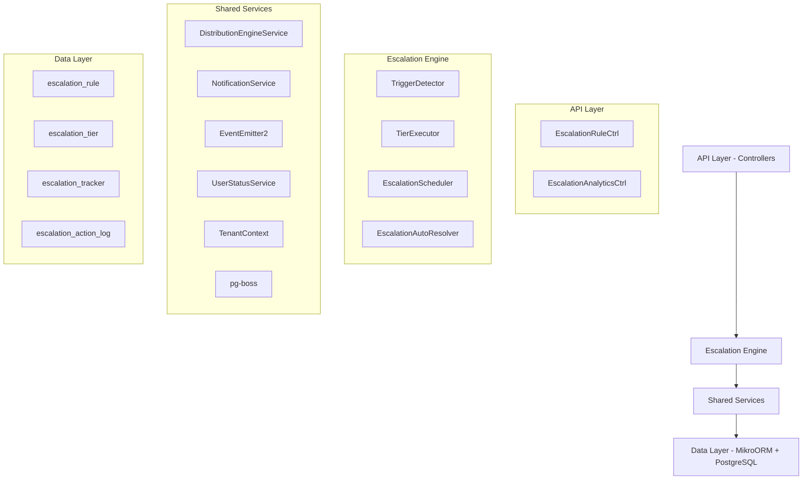

## Overview

The Escalation Module automates responses when assigned leads go stale. A scheduled engine detects trigger conditions (no first contact, went cold) and executes tiered escalation actions — notifications, temperature changes, tag additions, and redistribution to new agents.

<Info>
**Status:** Active — fully implemented  
**Module Path:** `src/modules/crm/escalation/`
</Info>

### Design Principles

| Principle | Decision |
|-----------|----------|
| pg-boss scheduling | Escalation scheduler uses pg-boss recurring job for reliability |
| Tiered actions | Rules have ordered tiers with configurable delays; actions execute in sequence |
| Auto-resolution | Events (activity, stage change, reassignment) automatically resolve active trackers |
| Idempotency | Partial unique index + `ON CONFLICT DO NOTHING` prevents duplicate trackers |
| Distribution delegation | Reassignment uses the distribution engine (`REDISTRIBUTE` action), not a separate paradigm |
| RLS compliance | All entities carry `organization_id` for row-level security |

## Architecture

### High-Level Diagram



### Component Responsibilities

<CardGroup cols={2}>
  <Card title="EscalationScheduler" icon="clock">
    pg-boss recurring job that runs every 60 seconds to detect new triggers and process due escalations
  </Card>
  <Card title="TriggerDetector" icon="radar">
    Scans leads for unmet conditions (no first contact, went cold); creates tracker records
  </Card>
  <Card title="TierExecutor" icon="play">
    Executes escalation tier actions (notify, redistribute, change temp, add tag)
  </Card>
  <Card title="EscalationAutoResolver" icon="check-circle">
    Listens to domain events and resolves active trackers when conditions change
  </Card>
</CardGroup>

## Entity Specifications

### EscalationRule

Defines when and how a lead should be escalated. Evaluated by `TriggerDetector`.

<AccordionGroup>
  <Accordion title="Schema Definition">
    | Column | Type | Notes |
    |--------|------|-------|
    | id | uuid PK | |
    | organization_id | uuid FK | RLS |
    | name | varchar | Human-readable rule name |
    | is_active | bool | default true |
    | priority | int | Evaluation order |
    | trigger_type | enum | `NO_FIRST_CONTACT`, `WENT_COLD` |
    | trigger_config | jsonb | `{thresholdMinutes?, thresholdValue?, thresholdUnit?}` |
    | condition_groups | jsonb | `[{conditions:[{field,operator,value}]}]` — AND-within-OR groups; `[]` = all leads |
    | respect_business_hours | bool | default true. References org business hours schedule. |
    | created_by | uuid FK | |
    | created_at, updated_at | timestamp | |
    | is_deleted | bool | soft delete |
  </Accordion>
</AccordionGroup>

<Note>
Rules are evaluated in ascending `priority` order (lower number = higher priority). Active rules must use unique priorities within the organization.
</Note>

**Duplicate Rule Prevention**

<Warning>
The backend rejects create/update when another **non-deleted** rule in the same organization has an identical **behavior fingerprint**: `triggerType`, normalized `triggerConfig`, canonical `conditionGroups`, and canonical tiers/actions.
</Warning>

**Applicability Condition Shape**

Escalation reuses the shared rule-condition module (`src/modules/crm/shared/rule-conditions/`). Stored shape matches distribution rules:

```typescript
interface ConditionGroup {
  conditions: RuleCondition[]; // AND within group
}
// A lead matches when ANY group fully passes. Empty conditionGroups[] = all leads.
```

**SQL Field Mapping**

| Field | SQL Column / Expression | Table / Join | Operators | Notes |
|-------|-------------------------|--------------|-----------|-------|
| `temperature` | `l.temperature` | lead | eq, in | Case-insensitive |
| `leadSource` | `l.lead_source` | lead | eq, in | Case-insensitive |
| `intent` | `l.intent` | lead | eq | Case-insensitive |
| `budget` | `l.budget` | lead | eq, gte, lte, between | Numeric; `between` accepts `{ min, max }` or `[min, max]` |
| `tags` | `l.tag_ids` | lead | contains | `EXISTS` + `jsonb_array_elements_text` + `IN (?)` per label |
| `sourceChannel` | `pc.channel_type` | person_channel | eq, in | `LEFT JOIN person_channel` |
| `language` | `p.languages` | person | eq | `LEFT JOIN person`; matches JSONB `languages[].code` |
| `area` | wished snapshot names | lead_property_interest | eq, in, contains | `EXISTS` subquery flattening area snapshots |

### EscalationTier

Each tier in an escalation rule represents a delayed action set. Tiers execute in `tier_order` sequence.

| Column | Type | Notes |
|--------|------|-------|
| id | uuid PK | |
| organization_id | uuid FK | RLS |
| escalation_rule_id | uuid FK | |
| tier_order | int | Execution sequence (1, 2, 3...) |
| delay_minutes | int | Minutes to wait after rule trigger or previous tier |
| actions | jsonb | Array of action definitions |

### EscalationTracker

Tracks active escalations for individual leads. Created when trigger conditions are met.

| Column | Type | Notes |
|--------|------|-------|
| id | uuid PK | |
| organization_id | uuid FK | RLS |
| escalation_rule_id | uuid FK | |
| lead_id | uuid FK | |
| triggered_at | timestamp | When escalation was triggered |
| current_tier | int | Next tier to execute (1-based) |
| status | enum | `ACTIVE`, `RESOLVED`, `CANCELLED` |
| resolved_at | timestamp | When escalation was resolved |
| resolution_reason | enum | `ACTIVITY`, `STAGE_CHANGE`, `REASSIGNMENT`, `RULE_DEACTIVATED` |

<Note>
Partial unique index prevents duplicate active trackers: `organization_id, escalation_rule_id, lead_id WHERE status = 'ACTIVE'`
</Note>

### EscalationActionLog

Audit log of executed escalation actions.

| Column | Type | Notes |
|--------|------|-------|
| id | uuid PK | |
| organization_id | uuid FK | RLS |
| escalation_tracker_id | uuid FK | |
| tier_order | int | Which tier executed this action |
| action_type | enum | `NOTIFY`, `REDISTRIBUTE`, `CHANGE_TEMPERATURE`, `ADD_TAG` |
| action_config | jsonb | Action-specific parameters |
| executed_at | timestamp | When action was executed |
| success | bool | Whether action completed successfully |
| error_message | text | Error details if failed |

## Type Definitions

### Enums

<CodeGroup>

```typescript Trigger Types
export enum EscalationTriggerType {
  NO_FIRST_CONTACT = 'NO_FIRST_CONTACT',
  WENT_COLD = 'WENT_COLD'
}
```

```typescript Action Types
export enum EscalationActionType {
  NOTIFY = 'NOTIFY',
  REDISTRIBUTE = 'REDISTRIBUTE', 
  CHANGE_TEMPERATURE = 'CHANGE_TEMPERATURE',
  ADD_TAG = 'ADD_TAG'
}
```

```typescript Tracker Status
export enum EscalationTrackerStatus {
  ACTIVE = 'ACTIVE',
  RESOLVED = 'RESOLVED',
  CANCELLED = 'CANCELLED'
}
```

```typescript Resolution Reasons
export enum EscalationResolutionReason {
  ACTIVITY = 'ACTIVITY',
  STAGE_CHANGE = 'STAGE_CHANGE', 
  REASSIGNMENT = 'REASSIGNMENT',
  RULE_DEACTIVATED = 'RULE_DEACTIVATED'
}
```

</CodeGroup>

### Action Configurations

<Tabs>
  <Tab title="NOTIFY">
    ```typescript
    interface NotifyActionConfig {
      recipients: Array<{
        type: 'user' | 'role' | 'email';
        value: string; // user ID, role name, or email
      }>;
      template?: string;
      message?: string;
    }
    ```
  </Tab>
  <Tab title="REDISTRIBUTE">
    ```typescript
    interface RedistributeActionConfig {
      strategy: 'round_robin' | 'least_leads' | 'specific_user';
      targetUserId?: string; // Required if strategy is 'specific_user'
      excludeOriginalAgent?: boolean;
    }
    ```
  </Tab>
  <Tab title="CHANGE_TEMPERATURE">
    ```typescript
    interface ChangeTemperatureActionConfig {
      temperature: 'HOT' | 'WARM' | 'COLD';
    }
    ```
  </Tab>
  <Tab title="ADD_TAG">
    ```typescript
    interface AddTagActionConfig {
      tagIds: string[];
    }
    ```
  </Tab>
</Tabs>

## Escalation Engine

### Trigger Detection Logic

<Steps>
  <Step title="Rule Evaluation">
    `TriggerDetector` evaluates active escalation rules in priority order for each organization.
  </Step>
  <Step title="Lead Scanning">
    For each rule, scans leads matching the applicability conditions using `LeadScanService`.
  </Step>
  <Step title="Trigger Condition Check">
    Applies trigger-specific logic:
    - **NO_FIRST_CONTACT**: Lead assigned but no activity within threshold
    - **WENT_COLD**: Lead was warm/hot but no recent activity within threshold
  </Step>
  <Step title="Tracker Creation">
    Creates `EscalationTracker` record if no active tracker exists for the lead + rule combination.
  </Step>
</Steps>

### Tier Execution

<CodeGroup>

```typescript Execution Flow
async executeDueTiers(organizationId: string): Promise<void> {
  const dueTrackers = await this.findDueTrackers(organizationId);
  
  for (const tracker of dueTrackers) {
    const tier = await this.getCurrentTier(tracker);
    if (!tier) continue;
    
    await this.executeTierActions(tracker, tier);
    await this.advanceTracker(tracker);
  }
}
```

```typescript Action Execution
private async executeTierActions(
  tracker: EscalationTracker,
  tier: EscalationTier
): Promise<void> {
  for (const action of tier.actions) {
    try {
      switch (action.type) {
        case EscalationActionType.NOTIFY:
          await this.executeNotifyAction(tracker, action);
          break;
        case EscalationActionType.REDISTRIBUTE:
          await this.executeRedistributeAction(tracker, action);
          break;
        // ... other actions
      }
      
      await this.logActionExecution(tracker, action, true);
    } catch (error) {
      await this.logActionExecution(tracker, action, false, error.message);
    }
  }
}
```

</CodeGroup>

### Auto-Resolution

The escalation system automatically resolves active trackers when certain events occur:

<CardGroup cols={2}>
  <Card title="Activity Events" icon="activity">
    Any lead activity (call, email, note) resolves with reason `ACTIVITY`
  </Card>
  <Card title="Stage Changes" icon="arrow-right">
    Lead stage progression resolves with reason `STAGE_CHANGE`
  </Card>
  <Card title="Reassignment" icon="user-group">
    Lead assignment to different user resolves with reason `REASSIGNMENT`
  </Card>
  <Card title="Rule Changes" icon="settings">
    Rule deactivation/deletion resolves with reason `RULE_DEACTIVATED`
  </Card>
</CardGroup>

## API Endpoints

### Rule Management

<AccordionGroup>
  <Accordion title="GET /escalation/rules">
    **Description:** List escalation rules for organization
    
    **Query Parameters:**
    - `isActive?: boolean` - Filter by active status
    - `page?: number` - Page number (default: 1)
    - `limit?: number` - Items per page (default: 10)
    
    **Response:** `PaginatedResponse<EscalationRuleDto>`
  </Accordion>

  <Accordion title="POST /escalation/rules">
    **Description:** Create new escalation rule
    
    **Body:** `CreateEscalationRuleDto`
    
    **Validation:**
    - Unique priority among active rules
    - Valid condition groups
    - At least one tier with valid actions
    
    **Response:** `EscalationRuleDto`
  </Accordion>

  <Accordion title="PUT /escalation/rules/:id">
    **Description:** Update escalation rule
    
    **Body:** `UpdateEscalationRuleDto`
    
    **Side Effects:**
    - Cancels active trackers if rule becomes inactive
    - Updates fingerprint for duplicate detection
    
    **Response:** `EscalationRuleDto`
  </Accordion>

  <Accordion title="DELETE /escalation/rules/:id">
    **Description:** Soft delete escalation rule
    
    **Side Effects:**
    - Sets `is_deleted = true`
    - Cancels all active trackers
    - Preserves audit trail
    
    **Response:** `204 No Content`
  </Accordion>
</AccordionGroup>

### Analytics

<AccordionGroup>
  <Accordion title="GET /escalation/analytics/summary">
    **Description:** Get escalation metrics summary
    
    **Query Parameters:**
    - `startDate?: string` - ISO date string
    - `endDate?: string` - ISO date string
    - `ruleIds?: string[]` - Filter by specific rules
    
    **Response:**
    ```typescript
    {
      totalTriggered: number;
      totalResolved: number;
      averageResolutionTime: number; // minutes
      topResolutionReasons: Array<{
        reason: EscalationResolutionReason;
        count: number;
      }>;
    }
    ```
  </Accordion>

  <Accordion title="GET /escalation/analytics/rule-performance">
    **Description:** Get per-rule performance metrics
    
    **Response:**
    ```typescript
    Array<{
      ruleId: string;
      ruleName: string;
      triggered: number;
      resolved: number;
      averageResolutionTime: number;
      successRate: number; // percentage
    }>
    ```
  </Accordion>
</AccordionGroup>

### Tracker Management

<AccordionGroup>
  <Accordion title="GET /escalation/trackers">
    **Description:** List active escalation trackers
    
    **Query Parameters:**
    - `status?: EscalationTrackerStatus` - Filter by status
    - `ruleId?: string` - Filter by rule
    - `leadId?: string` - Filter by lead
    
    **Response:** `PaginatedResponse<EscalationTrackerDto>`
  </Accordion>

  <Accordion title="PUT /escalation/trackers/:id/resolve">
    **Description:** Manually resolve escalation tracker
    
    **Body:**
    ```typescript
    {
      reason: EscalationResolutionReason;
      note?: string;
    }
    ```
    
    **Response:** `EscalationTrackerDto`
  </Accordion>
</AccordionGroup>

## Security & Permissions

### Row-Level Security (RLS)

All escalation entities implement organization-based RLS:

<CodeGroup>

```sql escalation_rule Policy
CREATE POLICY escalation_rule_tenant_isolation ON escalation_rule
  FOR ALL TO authenticated
  USING (organization_id = current_setting('app.current_organization_id')::uuid);
```

```sql escalation_tracker Policy  
CREATE POLICY escalation_tracker_tenant_isolation ON escalation_tracker
  FOR ALL TO authenticated
  USING (organization_id = current_setting('app.current_organization_id')::uuid);
```

```sql escalation_action_log Policy
CREATE POLICY escalation_action_log_tenant_isolation ON escalation_action_log
  FOR ALL TO authenticated  
  USING (organization_id = current_setting('app.current_organization_id')::uuid);
```

</CodeGroup>

### Permission Requirements

| Action | Required Permission | Notes |
|--------|-------------------|-------|
| View escalation rules | `escalation:read` | Can view rules and trackers |
| Create/edit rules | `escalation:write` | Can manage escalation configuration |
| Resolve trackers | `escalation:resolve` | Can manually resolve escalations |
| View analytics | `escalation:analytics` | Can access performance metrics |
| Delete rules | `escalation:delete` | Can soft-delete rules |

<Warning>
System-generated escalation actions (notifications, redistributions) bypass permission checks as they execute in the background scheduler context.
</Warning>

## Analytics & Metrics

### Key Performance Indicators

<CardGroup cols={2}>
  <Card title="Trigger Rate" icon="chart-line">
    Number of escalations triggered per time period
  </Card>
  <Card title="Resolution Rate" icon="check">
    Percentage of escalations that resolve successfully
  </Card>
  <Card title="Resolution Time" icon="clock">
    Average time from trigger to resolution
  </Card>
  <Card title="Action Success Rate" icon="target">
    Percentage of escalation actions that execute without errors
  </Card>
</CardGroup>

### Tracking Implementation

<Steps>
  <Step title="Escalation Triggered">
    Record metrics when `EscalationTracker` is created
  </Step>
  <Step title="Action Executed">
    Log success/failure in `EscalationActionLog`
  </Step>
  <Step title="Escalation Resolved">
    Update tracker with resolution timestamp and reason
  </Step>
  <Step title="Metrics Aggregation">
    Background job aggregates daily/weekly/monthly summaries
  </Step>
</Steps>

## Edge Case Handling

### Business Hours Respect

<Note>
When `respect_business_hours = true`, escalation timers pause outside business hours and resume when business hours begin.
</Note>

```typescript
calculateEffectiveDelay(
  baseDelayMinutes: number, 
  respectBusinessHours: boolean,
  organizationId: string
): number {
  if (!respectBusinessHours) {
    return baseDelayMinutes;
  }
  
  // Adjust delay based on business hours schedule
  return this.businessHoursService.adjustDelayForBusinessHours(
    baseDelayMinutes,
    organizationId
  );
}
```

### Concurrent Modifications

<Tabs>
  <Tab title="Duplicate Tracker Prevention">
    ```sql
    CREATE UNIQUE INDEX CONCURRENTLY idx_escalation_tracker_active_unique
    ON escalation_tracker (organization_id, escalation_rule_id, lead_id)
    WHERE status = 'ACTIVE';
    ```
  </Tab>
  <Tab title="Priority Conflicts">
    ```typescript
    // Backend validation prevents priority conflicts
    async validateUniquePriority(
      organizationId: string,
      priority: number,
      excludeRuleId?: string
    ): Promise<void> {
      const existing = await this.escalationRuleRepo.findOne({
        organization_id: organizationId,
        priority,
        is_active: true,
        is_deleted: false,
        ...(excludeRuleId && { id: { $ne: excludeRuleId } })
      });
      
      if (existing) {
        throw new BadRequestException('Priority already in use by another active rule');
      }
    }
    ```
  </Tab>
</Tabs>

### Action Failures

When escalation actions fail, the system:

1. **Logs the failure** in `EscalationActionLog` with error details
2. **Continues executing** remaining actions in the tier
3. **Advances to next tier** on schedule regardless of failures
4. **Emits failure events** for monitoring/alerting

<Tip>
Consider implementing retry logic for transient failures (network timeouts, temporary service unavailability).
</Tip>

## Performance & Scaling

### Optimization Strategies

<CardGroup cols={2}>
  <Card title="Index Optimization" icon="database">
    Strategic indexes on high-query columns: `organization_id`, `is_active`, `status`, `triggered_at`
  </Card>
  <Card title="Batch Processing" icon="layer-group">
    Process multiple trackers in batches to reduce database round trips
  </Card>
  <Card title="Parallel Execution" icon="arrows-split">
    Execute tier actions concurrently where possible (notifications, tag updates)
  </Card>
  <Card title="Smart Scheduling" icon="clock">
    Stagger pg-boss execution across organizations to distribute load
  </Card>
</CardGroup>

### Key Indexes

```sql
-- Critical indexes for escalation performance
CREATE INDEX idx_escalation_rule_org_active ON escalation_rule 
  (organization_id, is_active, priority) WHERE is_deleted = false;

CREATE INDEX idx_escalation_tracker_due ON escalation_tracker 
  (organization_id, status, triggered_at, current_tier) 
  WHERE status = 'ACTIVE';

CREATE INDEX idx_escalation_action_log_tracker ON escalation_action_log 
  (escalation_tracker_id, executed_at);
```

### Monitoring

<Steps>
  <Step title="Job Execution Time">
    Monitor pg-boss escalation job execution duration
  </Step>
  <Step title="Queue Depth">
    Track number of active trackers awaiting tier execution
  </Step>
  <Step title="Action Success Rates">
    Alert on high failure rates for specific action types
  </Step>
  <Step title="Database Performance">
    Monitor query performance and index utilization
  </Step>
</Steps>

## Integration Points

### Distribution Engine

<Note>
`REDISTRIBUTE` actions delegate to the distribution engine rather than implementing separate assignment logic.
</Note>

```typescript
async executeRedistributeAction(
  tracker: EscalationTracker,
  action: RedistributeActionConfig
): Promise<void> {
  await this.distributionEngine.redistributeLead(
    tracker.lead_id,
    {
      strategy: action.strategy,
      targetUserId: action.targetUserId,
      excludeUserId: action.excludeOriginalAgent ? tracker.lead.assigned_to : undefined
    }
  );
}
```

### Event System

The escalation module integrates with the domain event system for auto-resolution:

<CodeGroup>

```typescript Event Listeners
@OnEvent('lead.activity.created')
async handleLeadActivity(payload: LeadActivityCreatedEvent): Promise<void> {
  await this.autoResolver.resolveByActivity(payload.leadId, payload.organizationId);
}

@OnEvent('lead.stage.changed') 
async handleStageChange(payload: LeadStageChangedEvent): Promise<void> {
  await this.autoResolver.resolveByStageChange(payload.leadId, payload.organizationId);
}

@OnEvent('lead.assigned')
async handleReassignment(payload: LeadAssignedEvent): Promise<void> {
  await this.autoResolver.resolveByReassignment(payload.leadId, payload.organizationId);
}
```

```typescript Auto-Resolution Logic
async resolveByActivity(leadId: string, organizationId: string): Promise<void> {
  await this.escalationTrackerRepo.nativeUpdate(
    {
      lead_id: leadId,
      organization_id: organizationId,
      status: EscalationTrackerStatus.ACTIVE
    },
    {
      status: EscalationTrackerStatus.RESOLVED,
      resolved_at: new Date(),
      resolution_reason: EscalationResolutionReason.ACTIVITY
    }
  );
}
```

</CodeGroup>

### Notification Service

<Tabs>
  <Tab title="In-App Notifications">
    ```typescript
    await this.notificationService.create({
      organizationId: tracker.organization_id,
      recipientId: action.recipients.filter(r => r.type === 'user')[0]?.value,
      type: 'escalation_triggered',
      title: `Lead escalated: ${lead.name}`,
      message: action.message || `Lead ${lead.name} has been escalated due to ${tracker.rule.trigger_type}`,
      data: {
        leadId: tracker.lead_id,
        ruleId: tracker.escalation_rule_id,
        trackerId: tracker.id
      }
    });
    ```
  </Tab>
  <Tab title="Email Notifications">
    ```typescript
    await this.emailService.send({
      to: action.recipients.filter(r => r.type === 'email').map(r => r.value),
      template: action.template || 'lead-escalation',
      variables: {
        leadName: lead.name,
        leadId: lead.id,
        escalationReason: tracker.rule.trigger_type,
        assignedAgent: lead.assigned_to?.name
      }
    });
    ```
  </Tab>
</Tabs>

<Check>
The Escalation Module provides a comprehensive automated response system for stale leads, with robust configuration options, reliable execution, and detailed audit trails.
</Check>