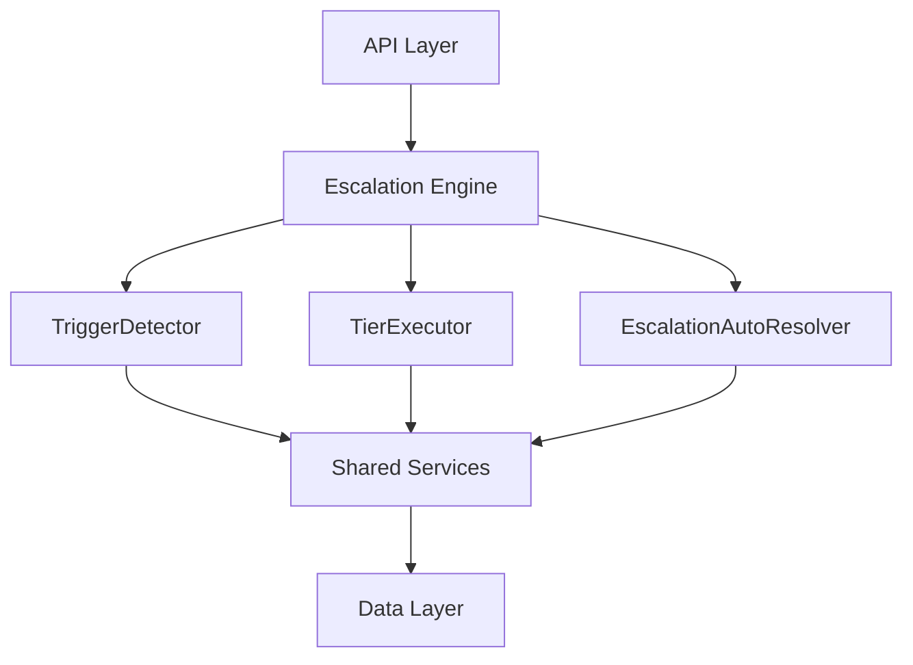

The Escalation Module automates responses when assigned leads go stale. A scheduled engine detects trigger conditions (no first contact, went cold) and executes tiered escalation actions — notifications, temperature changes, tag additions, and redistribution to new agents.

<Note>
**Status:** Active — fully implemented  
**Module Path:** `src/modules/crm/escalation/`
</Note>

## Architecture

### Design Principles

<CardGroup cols={2}>
  <Card title="pg-boss Scheduling" icon="clock">
    Escalation scheduler uses pg-boss recurring job for reliability
  </Card>
  <Card title="Tiered Actions" icon="list-ol">
    Rules have ordered tiers with configurable delays; actions execute in sequence
  </Card>
  <Card title="Auto-resolution" icon="check-circle">
    Events (activity, stage change, reassignment) automatically resolve active trackers
  </Card>
  <Card title="Idempotency" icon="shield">
    Partial unique index + `ON CONFLICT DO NOTHING` prevents duplicate trackers
  </Card>
</CardGroup>

### High-Level Flow



### Component Responsibilities

| Component | Responsibility |
|-----------|----------------|
| **EscalationScheduler** | pg-boss recurring job that runs every 60 seconds to detect new triggers and process due escalations |
| **TriggerDetector** | Scans leads for unmet conditions (no first contact, went cold); creates tracker records |
| **TierExecutor** | Executes escalation tier actions (notify, redistribute, change temp, add tag) |
| **EscalationAutoResolver** | Listens to domain events and resolves active trackers when conditions change |
| **EscalationRuleService** | CRUD for escalation rules; handles tracker cancellation on deactivation/deletion |

## Entity Specifications

### EscalationRule

Defines when and how a lead should be escalated. Evaluated by `TriggerDetector`.

<AccordionGroup>
  <Accordion title="Table Structure">
    | Column | Type | Notes |
    |--------|------|-------|
    | id | uuid PK | |
    | organization_id | uuid FK | RLS |
    | name | varchar | Human-readable rule name |
    | is_active | bool | default true |
    | priority | int | Evaluation order |
    | trigger_type | enum | `NO_FIRST_CONTACT`, `WENT_COLD` |
    | trigger_config | jsonb | `{thresholdMinutes?, thresholdValue?, thresholdUnit?}` |
    | conditions | jsonb | `EscalationCondition[]` — AND-joined applicability filters; `[]` = all leads |
    | respect_business_hours | bool | default true. References org business hours schedule. |
    | created_by | uuid FK | |
    | created_at, updated_at | timestamp | |
    | is_deleted | bool | soft delete |
  </Accordion>

  <Accordion title="EscalationCondition Structure">
    ```typescript
    interface EscalationCondition {
      field: 'temperature' | 'leadSource' | 'language' | 'sourceChannel';
      operator: 'eq' | 'in';
      value: string | string[];
    }
    ```

    **SQL field mapping (used by `TriggerDetector.buildApplicabilityExtraWhere`):**

    | Field | SQL Column | Table | Notes |
    |-------|-----------|-------|-------|
    | `temperature` | `l.temperature` | lead | |
    | `leadSource` | `l.lead_source` | lead | |
    | `sourceChannel` | `l.source_channel` | lead | |
    | `language` | `p.language` | person | Adds `LEFT JOIN person p ON p.id = l.person_id` |
  </Accordion>
</AccordionGroup>

### EscalationTier

Each tier in an escalation rule represents a delayed action set. Tiers execute in `tier_order` sequence.

| Column | Type | Notes |
|--------|------|-------|
| id | uuid PK | |
| escalation_rule_id | uuid FK | |
| organization_id | uuid FK | RLS |
| tier_order | int | 1, 2, 3... (max 10) |
| delay_minutes | int | Tier 1 (lowest tier_order): always 0 — threshold is the sole timing control. Subsequent tiers: minutes after the previous tier completed. |
| actions | jsonb | `TierAction[]` — see Tier Actions below |

#### Tier Action Types

<CardGroup cols={2}>
  <Card title="NOTIFY_AGENT" icon="bell">
    **Parameters:** `message?: string`  
    Resolved from lead's current stakeholder (assigned agent)
  </Card>
  <Card title="NOTIFY_ADMIN" icon="user-crown">
    **Parameters:** `message?: string`  
    Self-resolving — queries all org users with the `system.admin` permission key
  </Card>
  <Card title="NOTIFY_TEAM_LEAD" icon="users">
    **Parameters:** `message?: string`  
    Self-resolving — queries team members with `team.admin` permission in lead's assigned team
  </Card>
  <Card title="REDISTRIBUTE" icon="arrows-rotate">
    **Parameters:** _(no params)_  
    Distribution engine delegation — removes current stakeholders, calls redistribution
  </Card>
</CardGroup>

<Warning>
`REDISTRIBUTE` must be in the **last tier** only. The API rejects rules where REDISTRIBUTE appears in an intermediate tier.
</Warning>

#### Action Configuration Examples

<CodeGroup>
```json Notification Actions
{
  "type": "NOTIFY_AGENT", 
  "message": "Lead needs attention"
}
```

```json Temperature Change
{
  "type": "CHANGE_TEMPERATURE", 
  "temperature": "hot"
}
```

```json Tag Addition
{
  "type": "ADD_TAG", 
  "tagIds": ["tag-uuid-1", "tag-uuid-2"]
}
```
</CodeGroup>

### EscalationTracker

Tracks the escalation state of a specific lead against a specific rule.

<AccordionGroup>
  <Accordion title="Table Structure">
    | Column | Type | Notes |
    |--------|------|-------|
    | id | uuid PK | |
    | lead_id | uuid FK | |
    | escalation_rule_id | uuid FK | |
    | organization_id | uuid FK | RLS |
    | current_tier | int | 0 = triggered but not yet escalated; increments with each tier fired |
    | trigger_fired_at | timestamp | when the trigger condition was first detected |
    | next_escalation_at | timestamp | indexed for scheduler query; null after all tiers complete |
    | status | enum | `ACTIVE`, `RESOLVED`, `CANCELLED` |
    | resolved_at | timestamp nullable | |
    | resolved_by | enum nullable | See ResolvedBy types below |
    | history | jsonb | `TrackerHistoryEntry[]` — append-only summary |
    | created_at | timestamp | |
  </Accordion>

  <Accordion title="Key Indexes">
    | Index | Columns | Type | Notes |
    |-------|---------|------|-------|
    | `uq_escalation_tracker_lead_rule` | `(lead_id, escalation_rule_id) WHERE status = 'ACTIVE'` | Partial unique | Prevents duplicate ACTIVE trackers for the same lead+rule |
    | `idx_escalation_tracker_next_at` | `(next_escalation_at, status)` | Composite | Primary scheduler query |
    | `idx_escalation_tracker_lead` | `(lead_id, status)` | Composite | Auto-resolver lookups by lead |
    | `idx_escalation_tracker_org_status` | `(organization_id, status)` | Composite | Per-org active tracker counts |
  </Accordion>

  <Accordion title="Idempotency Implementation">
    <Check>
    The partial unique index is the database-level guard. `TriggerDetector` uses `INSERT ... ON CONFLICT ... DO NOTHING` to prevent `UniqueViolationError`.
    </Check>

    ```sql
    INSERT INTO escalation_tracker
      (id, lead_id, escalation_rule_id, organization_id, trigger_fired_at,
       next_escalation_at, status, history, current_tier, created_at)
    VALUES (gen_random_uuid(), $1, $2, $3, $4, $5, 'ACTIVE', '[]', 0, NOW())
    ON CONFLICT (lead_id, escalation_rule_id) WHERE status = 'ACTIVE' DO NOTHING;
    ```

    <Warning>
    `TriggerDetector` must **never** use `em.persistAndFlush()` for tracker creation — always use the raw `execute()` call with `ON CONFLICT DO NOTHING`.
    </Warning>
  </Accordion>
</AccordionGroup>

### EscalationActionLog

Normalized table recording every escalation tier action execution. Used for analytics queries.

| Column | Type | Notes |
|--------|------|-------|
| id | uuid PK | |
| tracker_id | uuid FK | references `escalation_tracker` |
| organization_id | uuid FK | RLS |
| tier_order | int | which tier triggered this action |
| action_type | varchar | e.g., `NOTIFY_AGENT`, `REDISTRIBUTE`, `CHANGE_TEMPERATURE` |
| action_params | jsonb nullable | serialized parameters |
| result | enum | `SUCCESS`, `FAILED`, `SKIPPED` |
| executed_at | timestamp | |

## Type Definitions

### Core Enums

<CodeGroup>
```typescript Trigger Types
enum TriggerType {
  NO_FIRST_CONTACT = 'NO_FIRST_CONTACT',
  WENT_COLD = 'WENT_COLD',
}
```

```typescript Action Types
enum EscalationActionType {
  NOTIFY_AGENT = 'NOTIFY_AGENT',
  NOTIFY_ADMIN = 'NOTIFY_ADMIN',
  NOTIFY_TEAM_LEAD = 'NOTIFY_TEAM_LEAD',
  REDISTRIBUTE = 'REDISTRIBUTE',
  CHANGE_TEMPERATURE = 'CHANGE_TEMPERATURE',
  ADD_TAG = 'ADD_TAG',
}
```

```typescript Status Types
enum EscalationStatus {
  ACTIVE = 'ACTIVE',
  RESOLVED = 'RESOLVED',
  CANCELLED = 'CANCELLED',
}
```
</CodeGroup>

### ResolvedBy Values

| Value | Description |
|---|---|
| `MANUAL` | User explicitly resolved via UI/API |
| `AUTO_ACTIVITY` | New activity added to lead |
| `AUTO_STAGE_CHANGE` | Lead moved to different stage |
| `AUTO_REASSIGNMENT` | Lead reassigned to different agent |
| `AUTO_ARCHIVED` | Lead archived |
| `AUTO_DELETED` | Lead deleted |
| `AUTO_ORPHANED` | Lead lost all stakeholders |
| `REDISTRIBUTED` | Completed redistribution action |

## Escalation Engine

### Scheduler Flow

<Steps>
  <Step title="Trigger Detection">
    `TriggerDetector` scans for leads meeting escalation conditions and creates tracker records
  </Step>
  <Step title="Due Processing">
    Identifies trackers with `next_escalation_at <= NOW()` and `status = ACTIVE`
  </Step>
  <Step title="Tier Execution">
    `TierExecutor` processes each due tracker, executing all actions in the current tier
  </Step>
  <Step title="Next Tier Scheduling">
    Updates `current_tier` and calculates `next_escalation_at` for subsequent tiers
  </Step>
  <Step title="Auto-resolution">
    `EscalationAutoResolver` listens for domain events and resolves active trackers when conditions change
  </Step>
</Steps>

### Business Hours Handling

<Info>
When `respect_business_hours` is enabled, the scheduler adjusts timing calculations to account for the organization's business hours schedule.
</Info>

## API Endpoints

### Escalation Rules Management

<Tabs>
  <Tab title="GET /escalation-rules">
    **Query Parameters:**
    - `page`, `limit` - Pagination
    - `search` - Filter by name
    - `isActive` - Filter by active status
    - `triggerType` - Filter by trigger type

    **Response:**
    ```json
    {
      "data": [
        {
          "id": "uuid",
          "name": "No Contact Escalation",
          "isActive": true,
          "triggerType": "NO_FIRST_CONTACT",
          "triggerConfig": {"thresholdMinutes": 1440},
          "conditions": [],
          "respectBusinessHours": true,
          "tiers": [...]
        }
      ],
      "meta": {"total": 10, "page": 1, "limit": 20}
    }
    ```
  </Tab>

  <Tab title="POST /escalation-rules">
    **Request Body:**
    ```json
    {
      "name": "Cold Lead Revival",
      "triggerType": "WENT_COLD",
      "triggerConfig": {"thresholdMinutes": 2880},
      "conditions": [
        {
          "field": "temperature",
          "operator": "eq",
          "value": "cold"
        }
      ],
      "respectBusinessHours": true,
      "tiers": [
        {
          "tierOrder": 1,
          "delayMinutes": 0,
          "actions": [
            {
              "type": "NOTIFY_AGENT",
              "message": "Lead has gone cold"
            }
          ]
        }
      ]
    }
    ```
  </Tab>
</Tabs>

### Analytics & Metrics

<Tabs>
  <Tab title="GET /escalation-analytics/overview">
    **Response:**
    ```json
    {
      "activeTrackers": 45,
      "resolvedToday": 12,
      "totalActionsExecuted": 156,
      "successRate": 0.92
    }
    ```
  </Tab>

  <Tab title="GET /escalation-analytics/action-breakdown">
    **Response:**
    ```json
    [
      {
        "actionType": "NOTIFY_AGENT",
        "count": 89,
        "successRate": 0.95
      },
      {
        "actionType": "REDISTRIBUTE", 
        "count": 23,
        "successRate": 0.87
      }
    ]
    ```
  </Tab>
</Tabs>

## Security & Permissions

### Row-Level Security

<Warning>
All escalation entities carry `organization_id` for RLS compliance. Users can only access escalation data within their organization.
</Warning>

### Required Permissions

| Action | Permission | Notes |
|--------|------------|-------|
| View escalation rules | `escalation.read` | |
| Create/edit rules | `escalation.write` | |
| View analytics | `escalation.analytics` | |
| Manual resolution | `escalation.resolve` | |

## Performance & Scaling

### Optimization Strategies

<CardGroup cols={2}>
  <Card title="Scheduler Efficiency" icon="clock">
    60-second intervals with indexed queries on `next_escalation_at`
  </Card>
  <Card title="Batch Processing" icon="layer-group">
    Process multiple trackers in single database transaction
  </Card>
  <Card title="Event Debouncing" icon="pause">
    Auto-resolver debounces rapid events to prevent excessive processing
  </Card>
  <Card title="Analytics Caching" icon="memory">
    Cache frequently accessed metrics with 5-minute TTL
  </Card>
</CardGroup>

### Database Considerations

<Tip>
The escalation system is designed to handle high-volume scenarios with proper indexing and efficient query patterns. Monitor the `escalation_tracker` table growth and consider archiving resolved trackers older than 90 days.
</Tip>

## Edge Case Handling

### Lead State Changes

<AccordionGroup>
  <Accordion title="Lead Deletion">
    - Active trackers are automatically resolved with `resolvedBy = AUTO_DELETED`
    - Cascade deletion removes associated tracker records
  </Accordion>

  <Accordion title="Lead Archival">
    - Trackers resolved with `resolvedBy = AUTO_ARCHIVED`
    - No new escalations trigger for archived leads
  </Accordion>

  <Accordion title="Stakeholder Removal">
    - If lead loses all stakeholders: `resolvedBy = AUTO_ORPHANED`
    - `NOTIFY_AGENT` actions are skipped for orphaned leads
  </Accordion>
</AccordionGroup>

### System Failures

<AccordionGroup>
  <Accordion title="Notification Failures">
    - Actions are marked as `FAILED` in action log
    - Tracker progression continues to next tier
    - Failed notifications are retried on subsequent scheduler runs
  </Accordion>

  <Accordion title="Distribution Engine Failures">
    - `REDISTRIBUTE` actions marked as `FAILED`
    - Tracker remains active for manual intervention
    - Original stakeholder assignment is preserved
  </Accordion>
</AccordionGroup>

## Integration Points

### Internal Dependencies

| Service | Usage | Integration Type |
|---------|-------|------------------|
| **DistributionEngineService** | Lead redistribution | Direct service call |
| **NotificationService** | Agent/admin notifications | Direct service call |
| **UserStatusService** | Business hours validation | Direct service call |
| **EventEmitter2** | Domain event listening | Event-driven |
| **TenantContext** | Organization scoping | Context injection |

### External Events

<Info>
The escalation system listens to the following domain events for auto-resolution:
</Info>

- `lead.activity.created` → Resolves with `AUTO_ACTIVITY`
- `lead.stage.changed` → Resolves with `AUTO_STAGE_CHANGE`
- `lead.stakeholder.assigned` → Resolves with `AUTO_REASSIGNMENT`
- `lead.archived` → Resolves with `AUTO_ARCHIVED`
- `lead.deleted` → Resolves with `AUTO_DELETED`

### Module Structure

```
src/modules/crm/escalation/
├── controllers/
│   ├── escalation-rule.controller.ts
│   └── escalation-analytics.controller.ts
├── entities/
│   ├── escalation-rule.entity.ts
│   ├── escalation-tier.entity.ts
│   ├── escalation-tracker.entity.ts
│   └── escalation-action-log.entity.ts
├── services/
│   ├── escalation-rule.service.ts
│   ├── escalation-scheduler.service.ts
│   ├── trigger-detector.service.ts
│   ├── tier-executor.service.ts
│   ├── escalation-auto-resolver.service.ts
│   └── escalation-analytics.service.ts
├── types/
│   └── escalation.types.ts
├── validators/
│   └── escalation-rule.validator.ts
└── escalation.module.ts
```

<Check>
The escalation module is fully self-contained with clear boundaries and well-defined integration points with other CRM modules.
</Check>