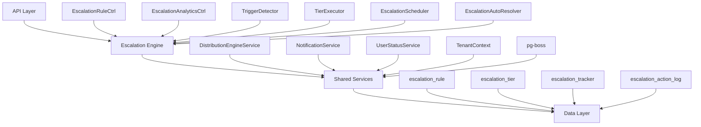

## Overview

The Escalation Module automates responses when assigned leads go stale. A scheduled engine detects trigger conditions (no first contact, went cold) and executes tiered escalation actions — notifications, temperature changes, tag additions, and redistribution to new agents.

<Info>
**Module Status:** Active — fully implemented  
**Module Path:** `src/modules/crm/escalation/`
</Info>

### Design Principles

| Principle | Decision |
|-----------|----------|
| pg-boss scheduling | Escalation scheduler uses pg-boss recurring job for reliability |
| Tiered actions | Rules have ordered tiers with configurable delays; actions execute in sequence |
| Auto-resolution | Events (activity, stage change, reassignment) automatically resolve active trackers |
| Idempotency | Partial unique index + `ON CONFLICT DO NOTHING` prevents duplicate trackers |
| Distribution delegation | Reassignment uses the distribution engine (`REDISTRIBUTE` action), not a separate paradigm |
| RLS compliance | All entities carry `organization_id` for row-level security |

## Architecture

### High-Level Component Diagram



### Component Responsibilities

<AccordionGroup>
<Accordion title="EscalationScheduler">
pg-boss recurring job that runs every 60 seconds to detect new triggers and process due escalations
</Accordion>

<Accordion title="TriggerDetector">
Scans leads for unmet conditions (no first contact, went cold); creates tracker records
</Accordion>

<Accordion title="TierExecutor">
Executes escalation tier actions (notify, redistribute, change temp, add tag)
</Accordion>

<Accordion title="EscalationAutoResolver">
Listens to domain events and resolves active trackers when conditions change
</Accordion>

<Accordion title="EscalationRuleService">
CRUD for escalation rules; handles tracker cancellation on deactivation/deletion
</Accordion>
</AccordionGroup>

## Entity Specifications

### EscalationRule

Defines when and how a lead should be escalated. Evaluated by `TriggerDetector`.

<CodeGroup>
```sql SQL Schema
CREATE TABLE escalation_rule (
    id uuid PRIMARY KEY DEFAULT gen_random_uuid(),
    organization_id uuid NOT NULL REFERENCES organization(id),
    name varchar NOT NULL,
    is_active boolean DEFAULT true,
    priority integer NOT NULL,
    trigger_type escalation_trigger_type NOT NULL,
    trigger_config jsonb,
    conditions jsonb DEFAULT '[]',
    respect_business_hours boolean DEFAULT true,
    created_by uuid NOT NULL REFERENCES "user"(id),
    created_at timestamp DEFAULT NOW(),
    updated_at timestamp DEFAULT NOW(),
    is_deleted boolean DEFAULT false
);
```

```typescript TypeScript Interface
interface EscalationRule {
  id: string;
  organizationId: string;
  name: string;
  isActive: boolean;
  priority: number;
  triggerType: TriggerType;
  triggerConfig: TriggerConfig;
  conditions: EscalationCondition[];
  respectBusinessHours: boolean;
  createdBy: string;
  createdAt: Date;
  updatedAt: Date;
  isDeleted: boolean;
}
```
</CodeGroup>

#### Trigger Configuration

<Tabs>
<Tab title="NO_FIRST_CONTACT">
```typescript
interface NoFirstContactConfig {
  thresholdMinutes: number; // Minutes since lead assignment
}
```
</Tab>

<Tab title="WENT_COLD">
```typescript
interface WentColdConfig {
  thresholdValue: number;
  thresholdUnit: 'hours' | 'days' | 'weeks';
}
```
</Tab>
</Tabs>

#### Escalation Conditions

<Note>
Conditions are AND-joined filters that determine rule applicability. Empty array `[]` means the rule applies to all leads.
</Note>

```typescript
interface EscalationCondition {
  field: 'temperature' | 'leadSource' | 'language' | 'sourceChannel';
  operator: 'eq' | 'in';
  value: string | string[];
}
```

**SQL Field Mapping:**

| Field | SQL Column | Table | Notes |
|-------|-----------|-------|-------|
| `temperature` | `l.temperature` | lead | |
| `leadSource` | `l.lead_source` | lead | |
| `sourceChannel` | `l.source_channel` | lead | |
| `language` | `p.language` | person | Adds `LEFT JOIN person p ON p.id = l.person_id` |

### EscalationTier

Each tier represents a delayed action set that executes in sequence.

<CodeGroup>
```sql SQL Schema
CREATE TABLE escalation_tier (
    id uuid PRIMARY KEY DEFAULT gen_random_uuid(),
    escalation_rule_id uuid NOT NULL REFERENCES escalation_rule(id),
    organization_id uuid NOT NULL REFERENCES organization(id),
    tier_order integer NOT NULL CHECK (tier_order BETWEEN 1 AND 10),
    delay_minutes integer NOT NULL,
    actions jsonb NOT NULL
);
```

```typescript TypeScript Interface
interface EscalationTier {
  id: string;
  escalationRuleId: string;
  organizationId: string;
  tierOrder: number; // 1-10
  delayMinutes: number; // 0 for tier 1, minutes after previous tier for others
  actions: TierAction[];
}
```
</CodeGroup>

#### Tier Actions

<Warning>
`REDISTRIBUTE` action must only appear in the last tier. The API will reject rules where `REDISTRIBUTE` appears in intermediate tiers.
</Warning>

<Tabs>
<Tab title="Notification Actions">
```typescript
// Notify current assigned agent
{ type: "NOTIFY_AGENT", message?: string }

// Notify all org admins with system.admin permission
{ type: "NOTIFY_ADMIN", message?: string }

// Notify all team leaders with team.admin permission
{ type: "NOTIFY_TEAM_LEAD", message?: string }
```
</Tab>

<Tab title="Lead Modification Actions">
```typescript
// Change lead temperature
{ 
  type: "CHANGE_TEMPERATURE", 
  temperature: "hot" | "warm" | "cold" 
}

// Add tags to lead
{ 
  type: "ADD_TAG", 
  tagIds: string[] 
}
```
</Tab>

<Tab title="Redistribution Action">
```typescript
// Redistribute to new agent (last tier only)
{ type: "REDISTRIBUTE" }
```
</Tab>
</Tabs>

### EscalationTracker

Tracks escalation state for a specific lead against a specific rule.

<CodeGroup>
```sql SQL Schema
CREATE TABLE escalation_tracker (
    id uuid PRIMARY KEY DEFAULT gen_random_uuid(),
    lead_id uuid NOT NULL REFERENCES lead(id),
    escalation_rule_id uuid NOT NULL REFERENCES escalation_rule(id),
    organization_id uuid NOT NULL REFERENCES organization(id),
    current_tier integer DEFAULT 0,
    trigger_fired_at timestamp NOT NULL,
    next_escalation_at timestamp,
    status escalation_status DEFAULT 'ACTIVE',
    resolved_at timestamp,
    resolved_by escalation_resolved_by,
    history jsonb DEFAULT '[]',
    created_at timestamp DEFAULT NOW()
);

-- Prevent duplicate active trackers
CREATE UNIQUE INDEX uq_escalation_tracker_lead_rule 
ON escalation_tracker (lead_id, escalation_rule_id) 
WHERE status = 'ACTIVE';
```

```typescript TypeScript Interface
interface EscalationTracker {
  id: string;
  leadId: string;
  escalationRuleId: string;
  organizationId: string;
  currentTier: number; // 0 = triggered but not escalated
  triggerFiredAt: Date;
  nextEscalationAt: Date | null;
  status: EscalationStatus;
  resolvedAt: Date | null;
  resolvedBy: ResolvedBy | null;
  history: TrackerHistoryEntry[];
  createdAt: Date;
}
```
</CodeGroup>

#### Key Indexes

<Steps>
<Step title="Scheduler Query Index">
```sql
CREATE INDEX idx_escalation_tracker_next_at 
ON escalation_tracker (next_escalation_at, status);
```
</Step>

<Step title="Auto-Resolver Index">
```sql
CREATE INDEX idx_escalation_tracker_lead 
ON escalation_tracker (lead_id, status);
```
</Step>

<Step title="Analytics Index">
```sql
CREATE INDEX idx_escalation_tracker_org_status 
ON escalation_tracker (organization_id, status);
```
</Step>
</Steps>

#### Idempotency Guarantee

<Note>
The `TriggerDetector` uses `INSERT ... ON CONFLICT DO NOTHING` to prevent duplicate tracker creation:
</Note>

```sql
INSERT INTO escalation_tracker
  (id, lead_id, escalation_rule_id, organization_id, trigger_fired_at,
   next_escalation_at, status, history, current_tier, created_at)
VALUES (gen_random_uuid(), $1, $2, $3, $4, $5, 'ACTIVE', '[]', 0, NOW())
ON CONFLICT (lead_id, escalation_rule_id) WHERE status = 'ACTIVE' DO NOTHING;
```

### EscalationActionLog

Normalized audit log for all escalation actions.

<CodeGroup>
```sql SQL Schema
CREATE TABLE escalation_action_log (
    id uuid PRIMARY KEY DEFAULT gen_random_uuid(),
    tracker_id uuid NOT NULL REFERENCES escalation_tracker(id),
    organization_id uuid NOT NULL REFERENCES organization(id),
    tier_order integer NOT NULL,
    action_type varchar NOT NULL,
    action_params jsonb,
    result escalation_action_result NOT NULL,
    executed_at timestamp DEFAULT NOW()
);
```

```typescript TypeScript Interface
interface EscalationActionLog {
  id: string;
  trackerId: string;
  organizationId: string;
  tierOrder: number;
  actionType: string;
  actionParams: Record<string, any> | null;
  result: ActionResult;
  executedAt: Date;
}
```
</CodeGroup>

## Escalation Engine

### Trigger Detection

The `TriggerDetector` scans for leads meeting escalation conditions:

<Steps>
<Step title="Query Active Rules">
Fetch all active escalation rules ordered by priority
</Step>

<Step title="Build Lead Query">
For each trigger type, construct SQL with:
- Base conditions (assigned, not archived, not deleted)
- Trigger-specific conditions
- Rule applicability filters
- Exclude leads with active trackers for this rule
</Step>

<Step title="Create Trackers">
Use `INSERT ... ON CONFLICT DO NOTHING` for idempotency
</Step>
</Steps>

### Tier Execution

<Warning>
Business hours are respected when `respectBusinessHours` is true. Actions are delayed until the next business hour window.
</Warning>

<CodeGroup>
```typescript Action Execution Flow
class TierExecutor {
  async executeTier(tracker: EscalationTracker): Promise<void> {
    const rule = await this.getRuleWithTiers(tracker.escalationRuleId);
    const tier = rule.tiers.find(t => t.tierOrder === tracker.currentTier + 1);
    
    if (!tier) {
      // No more tiers - mark as resolved
      await this.resolveTracker(tracker, null);
      return;
    }

    for (const action of tier.actions) {
      const result = await this.executeAction(action, tracker);
      await this.logAction(tracker, tier.tierOrder, action, result);
    }

    await this.advanceTracker(tracker, tier);
  }
}
```

```typescript Auto-Resolution
class EscalationAutoResolver {
  @OnEvent('lead.activity.created')
  async onLeadActivity(event: LeadActivityCreatedEvent): Promise<void> {
    await this.resolveActiveTrackers(
      event.leadId, 
      ResolvedBy.AUTO_ACTIVITY
    );
  }

  @OnEvent('lead.stage.changed')
  async onLeadStageChanged(event: LeadStageChangedEvent): Promise<void> {
    await this.resolveActiveTrackers(
      event.leadId, 
      ResolvedBy.AUTO_STAGE_CHANGE
    );
  }
}
```
</CodeGroup>

## API Endpoints

### Escalation Rules

<CodeGroup>
```http GET /api/v1/escalation/rules
Authorization: Bearer {token}

Response: {
  rules: EscalationRule[],
  totalCount: number
}
```

```http POST /api/v1/escalation/rules
Authorization: Bearer {token}
Content-Type: application/json

{
  "name": "No First Contact - High Priority",
  "priority": 1,
  "triggerType": "NO_FIRST_CONTACT",
  "triggerConfig": { "thresholdMinutes": 60 },
  "conditions": [
    { "field": "temperature", "operator": "eq", "value": "hot" }
  ],
  "respectBusinessHours": true,
  "tiers": [
    {
      "tierOrder": 1,
      "delayMinutes": 0,
      "actions": [
        { "type": "NOTIFY_AGENT", "message": "Lead needs attention" }
      ]
    }
  ]
}
```
</CodeGroup>

### Analytics

<CodeGroup>
```http GET /api/v1/escalation/analytics/summary
Authorization: Bearer {token}

Response: {
  activeTrackers: number,
  totalEscalations: number,
  avgResolutionTime: number,
  topTriggerTypes: Array<{
    triggerType: string,
    count: number
  }>
}
```

```http GET /api/v1/escalation/analytics/performance
Authorization: Bearer {token}
Query: ?startDate=2024-01-01&endDate=2024-01-31

Response: {
  rulePerformance: Array<{
    ruleId: string,
    ruleName: string,
    triggeredCount: number,
    resolvedCount: number,
    avgResolutionTime: number
  }>,
  actionBreakdown: Array<{
    actionType: string,
    successCount: number,
    failedCount: number,
    skippedCount: number
  }>
}
```
</CodeGroup>

## Security & Permissions

### Required Permissions

| Action | Permission Key | Scope |
|--------|---------------|--------|
| View rules | `crm.escalation.read` | Organization |
| Create/Edit rules | `crm.escalation.write` | Organization |
| Delete rules | `crm.escalation.delete` | Organization |
| View analytics | `crm.escalation.analytics` | Organization |
| Manual resolution | `crm.escalation.resolve` | Organization |

### Row-Level Security

<Note>
All escalation entities include `organization_id` for RLS enforcement. Users can only access escalation data within their organization context.
</Note>

<CodeGroup>
```sql RLS Policy - escalation_rule
CREATE POLICY escalation_rule_tenant_isolation ON escalation_rule
FOR ALL TO authenticated
USING (organization_id = auth.organization_id());
```

```sql RLS Policy - escalation_tracker  
CREATE POLICY escalation_tracker_tenant_isolation ON escalation_tracker
FOR ALL TO authenticated
USING (organization_id = auth.organization_id());
```

```sql RLS Policy - escalation_action_log
CREATE POLICY escalation_action_log_tenant_isolation ON escalation_action_log
FOR ALL TO authenticated  
USING (organization_id = auth.organization_id());
```
</CodeGroup>

## Edge Case Handling

### Redistribution Failures

<Warning>
When `REDISTRIBUTE` action fails (no available agents), the tracker remains active and will retry on the next scheduler run.
</Warning>

<Steps>
<Step title="Distribution Attempt">
Call `DistributionEngineService.redistribute()` excluding current assignee
</Step>

<Step title="Success Path">
If outcome is `ASSIGNED`, resolve tracker with `resolvedBy = REDISTRIBUTED`
</Step>

<Step title="Failure Path">
If outcome is `NO_AGENTS_AVAILABLE`, log failed action and keep tracker active
</Step>
</Steps>

### Business Hours Handling

<Tip>
When `respectBusinessHours` is enabled, escalation actions are delayed until the next business hour window. The scheduler calculates the next valid execution time based on the organization's business hours configuration.
</Tip>

### Orphaned Trackers

<Steps>
<Step title="Lead Deletion">
When a lead is deleted, active trackers are resolved with `resolvedBy = AUTO_DELETED`
</Step>

<Step title="Rule Deletion">
When a rule is deleted, all active trackers for that rule are cancelled with `status = CANCELLED`
</Step>

<Step title="Organization Archival">
Archived organizations have all active trackers resolved with `resolvedBy = AUTO_ARCHIVED`
</Step>
</Steps>

## Performance & Scaling

### Scheduler Optimization

<CardGroup cols={2}>
<Card title="Batch Processing" icon="layer-group">
Process multiple trackers per run with configurable batch size
</Card>

<Card title="Index Strategy" icon="magnifying-glass">
Optimized indexes for scheduler queries and auto-resolution lookups
</Card>

<Card title="pg-boss Reliability" icon="shield-check">
Leverages pg-boss for job persistence and retry logic
</Card>

<Card title="Tenant Isolation" icon="users">
Scheduler processes all organizations but maintains strict RLS isolation
</Card>
</CardGroup>

### Performance Metrics

| Metric | Target | Notes |
|--------|---------|--------|
| Scheduler execution time | < 5 seconds | For 10,000 active leads |
| Trigger detection latency | < 2 minutes | From condition met to tracker created |
| Action execution time | < 500ms | Per action (excluding redistribution) |
| Memory usage | < 100MB | Peak during scheduler run |

## Integration Points

### External Services

<AccordionGroup>
<Accordion title="Distribution Engine">
- **Service:** `DistributionEngineService`
- **Usage:** `REDISTRIBUTE` action delegates to full distribution pipeline
- **Outcome handling:** `ASSIGNED` resolves tracker, failures keep it active
</Accordion>

<Accordion title="Notification Service">
- **Service:** `NotificationService`
- **Usage:** All `NOTIFY_*` actions
- **Channels:** Email, in-app notifications, webhook integrations
</Accordion>

<Accordion title="Business Hours Service">
- **Service:** `BusinessHoursService`
- **Usage:** Delay calculation when `respectBusinessHours` is enabled
- **Fallback:** 24/7 operation if no business hours configured
</Accordion>

<Accordion title="User Management">
- **Service:** `UserService`, `RolePermissionService`
- **Usage:** Resolve notification recipients for admin/team lead actions
- **Queries:** Permission-based user lookups with org/team context
</Accordion>
</AccordionGroup>

### Event System

The module participates in the domain event system for auto-resolution:

<CodeGroup>
```typescript Event Listeners
// Auto-resolve on lead activity
@OnEvent('lead.activity.created')
async onLeadActivity(event: LeadActivityCreatedEvent)

// Auto-resolve on stage changes  
@OnEvent('lead.stage.changed')
async onLeadStageChanged(event: LeadStageChangedEvent)

// Auto-resolve on reassignment
@OnEvent('lead.stakeholder.assigned')
async onLeadReassigned(event: LeadStakeholderAssignedEvent)

// Cancel on rule deletion
@OnEvent('escalation.rule.deleted')
async onRuleDeleted(event: EscalationRuleDeletedEvent)
```

```typescript Event Emitters
// Emit when tracker is created
this.eventEmitter.emit('escalation.tracker.created', {
  trackerId: tracker.id,
  leadId: tracker.leadId,
  ruleId: tracker.escalationRuleId
});

// Emit when action is executed
this.eventEmitter.emit('escalation.action.executed', {
  trackerId: tracker.id,
  actionType: action.type,
  result: result
});
```
</CodeGroup>

<Check>
The escalation module is fully integrated with the CRM system's event-driven architecture, ensuring automatic resolution of escalations when lead conditions change and providing comprehensive audit trails for all escalation activities.
</Check>