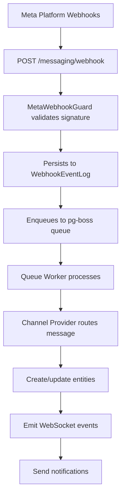

<Note>
This specification document covers the complete unified messaging module that replaces separate WhatsApp, Instagram, and Facebook Messenger implementations with a single, channel-agnostic system.
</Note>

## Overview

The Messaging module provides a unified, channel-agnostic messaging system for WhatsApp, Instagram, and Facebook Messenger. It replaces the separate per-channel modules with shared entities, a shared queue, and a single WebSocket namespace.

<Tabs>
  <Tab title="Problem Statement">
    - Duplicated logic across WhatsApp and Instagram modules
    - No webhook signature validation (security gap)
    - Inconsistent WebSocket auth (Instagram gateway has no JWT)
    - No Facebook Messenger support
    - Separate entity schemas per channel
    - No shared queue infrastructure
  </Tab>
  <Tab title="Solution">
    - Single `MessagingModule` with channel providers
    - Shared `MetaWebhookGuard` validates `X-Hub-Signature-256`
    - Single `/messaging` gateway with JWT auth
    - Third channel provider for Facebook Messenger
    - Unified entities: `Conversation`, `Message`, `ChannelAccount`
    - Shared `PgBossQueueService` for messaging + notifications
  </Tab>
</Tabs>

### Key Design Decisions

<AccordionGroup>
  <Accordion title="pg-boss over BullMQ">
    Project already uses pg-boss for notifications. No new Redis dependency. Interface-based design (`IQueueService`) allows swapping later.
  </Accordion>
  
  <Accordion title="Direct PersonChannel FK on Conversation">
    Conversations link directly to the CRM's `PersonChannel` via FK. Simpler model, no bidirectional sync overhead.
  </Accordion>
  
  <Accordion title="Archive as boolean, not status">
    `Conversation.isArchived` is orthogonal to `status` (OPEN/CLOSED), following `ARCHIVE_SYSTEM_SPECIFICATION.md`.
  </Accordion>
  
  <Accordion title="Simplified ownership (direct FKs)">
    Conversations use direct `assignedAgentId`/`assignedTeamId` FKs instead of the CRM `entity_stakeholder` pattern. Rationale: conversations have single-owner semantics. Transfer history is tracked via WebSocket events and notifications.
  </Accordion>
  
  <Accordion title="Transactional outbox">
    Outbound messages use an outbox table written in the same DB transaction as the Message entity, guaranteeing at-least-once delivery.
  </Accordion>
  
  <Accordion title="Per-conversation AI mode with cascade">
    Each conversation has an `aiMode` field (OFF, AUTO_REPLY, SUGGEST_ONLY, DRAFT). Default cascades: ChannelAccount.defaultAiMode → Organization default → OFF.
  </Accordion>
</AccordionGroup>

## Architecture & Module Structure

<Info>
The messaging system follows a webhook-to-queue-to-processor pattern with proper multi-tenancy support and WebSocket real-time updates.
</Info>



### Module Structure

```
src/modules/meta-platform/    ← Top-level infra module
  meta-platform.module.ts
  meta-graph-api.service.ts
  meta-api.error.ts
  meta-webhook.guard.ts
  meta-oauth.service.ts
  webhook-event-log.entity.ts

src/modules/queue/            ← Top-level infra module

src/modules/messaging/
  messaging.module.ts
  entities/               ← Core messaging entities
  enums/                  ← Channel, MessageType, etc.
  services/               ← Core services + providers/
    providers/            ← WhatsApp, Instagram, Messenger
  controllers/            ← API endpoints
  gateways/               ← WebSocket gateway
  queues/                 ← Background processors
  dto/                    ← Request/response DTOs
  utils/                  ← Utilities and helpers
  migration/              ← Legacy data migration
```

## Multi-Tenancy Patterns

<Warning>
The messaging module has unique multi-tenancy challenges because webhooks arrive without org context. Special patterns are required to handle this safely.
</Warning>

### Two-Step RLS Bypass (Webhook Processing)

The webhook controller receives events for ALL organizations from a single Meta App. Org context is unknown at arrival time.

<Steps>
  <Step title="Find the organization">
    Use `executeReadOnlyWithBypass()` to find which org owns the account
    ```typescript
    const account = await this.tenantContext.executeReadOnlyWithBypass(async (em) => {
      return em.findOne(ChannelAccount, { externalAccountId: job.data.accountId });
    });
    ```
  </Step>
  
  <Step title="Process within org context">
    Use `executeInOrg()` to process the event with proper RLS
    ```typescript
    await this.tenantContext.executeInOrg(
      account.organization.id,
      async (em) => {
        await this.processMessageInTransaction(em, job.data);
      },
      { userId: undefined }, // system action
    );
    ```
  </Step>
</Steps>

### Composable Transaction Pattern

Services that participate in existing transactions expose `*InTransaction` methods:

<CodeGroup>
```typescript Public API
// Public API — wraps TenantContext
async matchOrCreate(channel, identifier, profileData, orgId): Promise<MatchResult>;
```

```typescript Composable
// Composable — accepts EntityManager from caller's transaction
async matchOrCreateInTransaction(em, channel, identifier, profileData, orgId): Promise<MatchResult>;
```
</CodeGroup>

<Note>
The `em` parameter must always be the one provided by the TenantContext callback — never `this.em`.
</Note>

### Forbidden Patterns

<Warning>
These patterns will cause deadlocks or security vulnerabilities:
</Warning>

| Pattern | Why It's Forbidden |
|---------|-------------------|
| Using `*Impl` method names | Project convention uses `*InTransaction` suffix |
| Nesting TenantContext calls | Causes deadlocks or incorrect org context |
| Using `this.em` inside TenantContext callbacks | Bypasses the transaction-scoped EntityManager |
| Using `executeWithBypass()` with org context | Silently disables RLS, exposing cross-tenant data |

## Entities

### Core Entities Overview

<CardGroup cols={2}>
  <Card title="ChannelAccount" icon="link">
    Connected channel account (WA number, IG page, FB page) at org or personal level
  </Card>
  <Card title="Conversation" icon="message">
    Unified conversation thread linked to PersonChannel and CRM entities
  </Card>
  <Card title="Message" icon="envelope">
    Individual message record with status tracking
  </Card>
  <Card title="MessageTemplate" icon="template">
    Message templates (Meta-approved, quick-reply, AI prompt)
  </Card>
</CardGroup>

### ChannelAccount Entity

```typescript
@Entity('messaging_channel_account')
export class ChannelAccount {
  @PrimaryKey()
  id: string;

  @Enum(() => Channel)
  channel: Channel; // WHATSAPP, INSTAGRAM, MESSENGER

  @Property()
  externalAccountId: string; // Phone number (WA), Page ID (IG/Messenger)

  @Property({ nullable: true })
  pageId?: string; // Facebook Page ID for Instagram outbound messaging

  @Enum(() => ChannelAccountLevel)
  level: ChannelAccountLevel; // ORGANIZATION, PERSONAL

  @Property({ nullable: true })
  accessToken?: string; // Encrypted

  @Property()
  displayName: string;

  @Property({ nullable: true })
  profilePictureUrl?: string;

  @Property()
  isActive: boolean;

  @Enum(() => AiMode)
  defaultAiMode: AiMode;

  @Property()
  isArchived: boolean;

  // Relationships
  @ManyToOne(() => Organization)
  organization: Organization;

  @ManyToOne(() => User, { nullable: true })
  connectedByUser?: User; // For personal accounts

  @ManyToOne(() => User, { nullable: true })
  assignedAgent?: User;

  @ManyToOne(() => Team, { nullable: true })
  assignedTeam?: Team;

  @OneToMany(() => Conversation, conversation => conversation.channelAccount)
  conversations = new Collection<Conversation>(this);
}
```

### Conversation Entity

```typescript
@Entity('messaging_conversation')
export class Conversation {
  @PrimaryKey()
  id: string;

  @Enum(() => ConversationStatus)
  status: ConversationStatus; // OPEN, CLOSED

  @Property()
  isArchived: boolean;

  @Enum(() => AiMode)
  aiMode: AiMode;

  @Property({ nullable: true })
  lastMessageAt?: Date;

  @Property({ nullable: true })
  lastAgentMessageAt?: Date;

  @Property({ nullable: true })
  lastContactMessageAt?: Date;

  @Property()
  unreadCount: number;

  @Property()
  totalMessageCount: number;

  // Relationships
  @ManyToOne(() => ChannelAccount)
  channelAccount: ChannelAccount;

  @ManyToOne(() => PersonChannel)
  personChannel: PersonChannel;

  @ManyToOne(() => User, { nullable: true })
  assignedAgent?: User;

  @ManyToOne(() => Team, { nullable: true })
  assignedTeam?: Team;

  @OneToMany(() => Message, message => message.conversation)
  messages = new Collection<Message>(this);

  @Property()
  createdAt: Date;

  @Property()
  updatedAt: Date;
}
```

### Message Entity

<Tabs>
  <Tab title="Core Fields">
    ```typescript
    @Entity('messaging_message')
    export class Message {
      @PrimaryKey()
      id: string;

      @Property()
      externalMessageId: string; // Platform message ID

      @Enum(() => MessageDirection)
      direction: MessageDirection; // INBOUND, OUTBOUND

      @Enum(() => MessageType)
      type: MessageType; // TEXT, IMAGE, VIDEO, AUDIO, DOCUMENT, etc.

      @Enum(() => MessageStatus)
      status: MessageStatus; // PENDING, SENT, DELIVERED, READ, FAILED

      @Property({ type: 'jsonb', nullable: true })
      content?: MessageContent; // Type-safe JSON content

      @Property({ nullable: true })
      text?: string; // For quick text access

      @Property({ type: 'jsonb', nullable: true })
      metadata?: MessageMetadata; // Platform-specific data
    }
    ```
  </Tab>
  
  <Tab title="Relationships">
    ```typescript
    // Relationships
    @ManyToOne(() => Conversation)
    conversation: Conversation;

    @ManyToOne(() => User, { nullable: true })
    sentByUser?: User; // For outbound messages

    @ManyToOne(() => MessageTemplate, { nullable: true })
    template?: MessageTemplate; // If sent from template

    @Property()
    createdAt: Date;

    @Property()
    updatedAt: Date;
    ```
  </Tab>
</Tabs>

## Enums

### Core Enums

<AccordionGroup>
  <Accordion title="Channel">
    ```typescript
    export enum Channel {
      WHATSAPP = 'WHATSAPP',
      INSTAGRAM = 'INSTAGRAM',
      MESSENGER = 'MESSENGER',
    }
    ```
  </Accordion>
  
  <Accordion title="MessageType">
    ```typescript
    export enum MessageType {
      TEXT = 'TEXT',
      IMAGE = 'IMAGE',
      VIDEO = 'VIDEO',
      AUDIO = 'AUDIO',
      DOCUMENT = 'DOCUMENT',
      TEMPLATE = 'TEMPLATE',
      REACTION = 'REACTION',
      SYSTEM = 'SYSTEM',
    }
    ```
  </Accordion>
  
  <Accordion title="MessageStatus">
    ```typescript
    export enum MessageStatus {
      PENDING = 'PENDING',
      SENT = 'SENT',
      DELIVERED = 'DELIVERED',
      READ = 'READ',
      FAILED = 'FAILED',
    }
    ```
  </Accordion>
  
  <Accordion title="AiMode">
    ```typescript
    export enum AiMode {
      OFF = 'OFF',
      AUTO_REPLY = 'AUTO_REPLY',
      SUGGEST_ONLY = 'SUGGEST_ONLY',
      DRAFT = 'DRAFT',
    }
    ```
  </Accordion>
</AccordionGroup>

## Message Flows

### Inbound Message Flow

<Steps>
  <Step title="Webhook Reception">
    Meta platform sends webhook to `/messaging/webhook`
    - `@PublicEndpoint()` + `MetaWebhookGuard` validates signature
    - Returns 200 immediately
    - Persists to `WebhookEventLog`
    - Enqueues to pg-boss queue
  </Step>
  
  <Step title="Queue Processing">
    Webhook processor job executes:
    - Check idempotency using `externalEventId`
    - Find organization using RLS bypass
    - Process within org context
  </Step>
  
  <Step title="Message Processing">
    Within transaction:
    - Route to appropriate channel provider
    - Match or create `PersonChannel`
    - Match or create `Person` and `Lead`
    - Find or create `Conversation`
    - Create `Message` entity
    - Create CRM activity
    - Update `PersonChannel` stats
  </Step>
  
  <Step title="Real-time Updates">
    - Emit WebSocket events to connected clients
    - Send notification events for offline users
  </Step>
</Steps>

### Outbound Message Flow

<Steps>
  <Step title="API Request">
    Agent sends message via `/conversations/{id}/messages` endpoint
    - Validates permissions (`MESSAGING_SEND` required)
    - Creates `Message` and `MessageOutbox` in same transaction
  </Step>
  
  <Step title="Queue Processing">
    Message sender job processes outbox:
    - Calls appropriate channel provider
    - Updates message status based on API response
    - Removes outbox entry on success
    - Retries on failure (with exponential backoff)
  </Step>
  
  <Step title="Status Updates">
    Platform webhooks provide delivery status updates:
    - Updates `Message.status` (SENT → DELIVERED → READ)
    - Emits WebSocket events for real-time status
  </Step>
</Steps>

## Business Rules

### Conversation Management

<Check>
**Conversation Creation**: Automatically created on first message from new contact
</Check>

<Check>
**Assignment Logic**: Conversations can be assigned to individual agents or teams
</Check>

<Check>
**Auto-Close**: Conversations auto-close after configurable inactivity period
</Check>

### AI Integration

<Tabs>
  <Tab title="AI Mode Cascade">
    AI mode selection follows this hierarchy:
    1. Conversation-specific `aiMode`
    2. Channel account `defaultAiMode`
    3. Organization default AI mode
    4. System default (`OFF`)
  </Tab>
  
  <Tab title="AI Modes">
    - **OFF**: No AI assistance
    - **AUTO_REPLY**: AI automatically responds
    - **SUGGEST_ONLY**: AI suggests responses to agents
    - **DRAFT**: AI creates draft responses for review
  </Tab>
</Tabs>

### Message Templates

<CardGroup cols={3}>
  <Card title="META_APPROVED" icon="check-circle">
    Platform-approved templates for official communications
  </Card>
  <Card title="QUICK_REPLY" icon="reply">
    Agent shortcuts with variable resolution
  </Card>
  <Card title="AI_PROMPT" icon="robot">
    AI system prompts with optional SystemPrompt link
  </Card>
</CardGroup>

## RBAC Permissions & Access Control

### Permission Structure

<AccordionGroup>
  <Accordion title="MESSAGING_MANAGE">
    - Full conversation management
    - Can assign, transfer, archive conversations
    - Can manage channel accounts and templates
    - Can access all organization conversations
  </Accordion>
  
  <Accordion title="MESSAGING_SEND">
    - Can send messages in assigned conversations
    - Can close/reopen conversations
    - Can change AI mode for conversations
    - Limited to assigned or personal conversations
  </Accordion>
  
  <Accordion title="MESSAGING_VIEW">
    - Read-only access to assigned conversations
    - Cannot send messages or modify conversations
  </Accordion>
</AccordionGroup>

### Resource Permissions

Conversations return `ResourcePermissionsDto` with per-resource permissions:

```typescript
interface ResourcePermissionsDto {
  canView: boolean;
  canEdit: boolean;      // false for non-managers
  canTransfer: boolean;  // false for non-managers
  canAssign: boolean;    // false for non-managers
  canArchive: boolean;   // false for non-managers
}
```

<Note>
Operational actions (close, reopen, ai-mode) available to `MESSAGING_SEND` users are not gated by `canEdit`.
</Note>

## API Endpoints

### Conversation Endpoints

<AccordionGroup>
  <Accordion title="GET /conversations">
    List conversations with filtering and pagination
    
    **Query Parameters:**
    - `status`: Filter by conversation status
    - `assignedAgent`: Filter by assigned agent
    - `channel`: Filter by channel type
    - `isArchived`: Filter archived conversations
    - `search`: Search in contact names and last message
  </Accordion>
  
  <Accordion title="GET /conversations/{id}">
    Get single conversation with messages
    
    **Includes:**
    - Conversation details
    - Channel account info
    - Person/contact information
    - Recent messages (paginated)
  </Accordion>
  
  <Accordion title="POST /conversations/{id}/messages">
    Send message in conversation
    
    **Required Permission:** `MESSAGING_SEND`
    
    **Body:**
    ```typescript
    {
      type: MessageType;
      content: MessageContent;
      templateId?: string;
    }
    ```
  </Accordion>
  
  <Accordion title="PATCH /conversations/{id}">
    Update conversation properties
    
    **Required Permission:** `MESSAGING_MANAGE`
    
    **Updatable Fields:**
    - `status`
    - `assignedAgent`
    - `assignedTeam`
    - `isArchived`
    - `aiMode`
  </Accordion>
</AccordionGroup>

### Channel Account Endpoints

<AccordionGroup>
  <Accordion title="GET /channel-accounts">
    List organization channel accounts
    
    **Query Parameters:**
    - `channel`: Filter by channel type
    - `level`: Filter by account level
    - `isActive`: Filter active accounts
  </Accordion>
  
  <Accordion title="POST /channel-accounts/connect">
    Connect new channel account (organization-level)
    
    **Required Permission:** `MESSAGING_MANAGE`
  </Accordion>
  
  <Accordion title="POST /channel-accounts/connect-personal">
    Connect personal channel account
    
    **Required Permission:** `MESSAGING_SEND`
  </Accordion>
</AccordionGroup>

## WebSocket Events & Room Architecture

### Room Structure

<Tabs>
  <Tab title="Organization Rooms">
    - `org:{orgId}`: Organization-wide events
    - `org:{orgId}:conversations`: New conversations, assignments
    - `org:{orgId}:notifications`: System notifications
  </Tab>
  
  <Tab title="Conversation Rooms">
    - `conversation:{conversationId}`: Real-time messages
    - `conversation:{conversationId}:typing`: Typing indicators
    - `conversation:{conversationId}:status`: Status updates
  </Tab>
  
  <Tab title="User Rooms">
    - `user:{userId}`: Personal notifications
    - `user:{userId}:assignments`: Assignment changes
  </Tab>
</Tabs>

### Event Types

<AccordionGroup>
  <Accordion title="message-received">
    New inbound message arrived
    ```typescript
    {
      conversationId: string;
      message: MessageDto;
      conversation?: ConversationDto; // If conversation updated
    }
    ```
  </Accordion>
  
  <Accordion title="message-sent">
    Outbound message was sent
    ```typescript
    {
      conversationId: string;
      message: MessageDto;
    }
    ```
  </Accordion>
  
  <Accordion title="message-status-updated">
    Message delivery status changed
    ```typescript
    {
      messageId: string;
      status: MessageStatus;
      timestamp: Date;
    }
    ```
  </Accordion>
  
  <Accordion title="conversation-updated">
    Conversation properties changed
    ```typescript
    {
      conversation: ConversationDto;
      changes: string[]; // List of changed fields
    }
    ```
  </Accordion>
  
  <Accordion title="typing-indicator">
    Someone is typing in conversation
    ```typescript
    {
      conversationId: string;
      isTyping: boolean;
      userId?: string; // For agent typing
    }
    ```
  </Accordion>
</AccordionGroup>

## Error Handling & Retry Strategy

### Webhook Processing

<Warning>
Webhook events must be processed exactly once to prevent duplicate messages.
</Warning>

<Steps>
  <Step title="Idempotency Check">
    Use `externalEventId` to detect and skip duplicate webhooks
  </Step>
  
  <Step title="Organization Resolution">
    If organization cannot be found, log error and skip processing
  </Step>
  
  <Step title="Transaction Rollback">
    On processing failure, transaction rolls back and job retries
  </Step>
  
  <Step title="Dead Letter Queue">
    After max retries, move to dead letter queue for manual review
  </Step>
</Steps>

### Message Sending

<Tabs>
  <Tab title="Retry Policy">
    - **Max Retries**: 5 attempts
    - **Backoff**: Exponential (1s, 2s, 4s, 8s, 16s)
    - **Timeout**: 30 seconds per attempt
  </Tab>
  
  <Tab title="Failure Handling">
    - Rate limit errors: Retry with longer delay
    - Authentication errors: Mark account inactive
    - Permanent failures: Mark message as failed
    - Network errors: Standard retry with backoff
  </Tab>
</Tabs>

## Testing Strategy

### Unit Testing

<Check>
**Services**: Mock external dependencies (Meta API, queue, database)
</Check>

<Check>
**Entities**: Test validation rules and relationships
</Check>

<Check>
**Utilities**: Test helper functions and permission logic
</Check>

### Integration Testing

<Check>
**Webhook Processing**: End-to-end webhook to message creation
</Check>

<Check>
**Message Sending**: Outbox to external API delivery
</Check>

<Check>
**WebSocket Events**: Real-time event emission
</Check>

### E2E Testing

<Check>
**Complete Flows**: Inbound message → agent response → status updates
</Check>

<Check>
**Multi-tenant**: Cross-organization isolation
</Check>

<Check>
**Permissions**: RBAC enforcement across all endpoints
</Check>

## Module Dependencies & Integration Points

### External Dependencies

<CardGroup cols={2}>
  <Card title="Meta Platform Module" icon="link">
    - Graph API service
    - Webhook validation
    - OAuth flows
  </Card>
  
  <Card title="Queue Module" icon="clock">
    - pg-boss integration
    - Background job processing
    - Retry mechanisms
  </Card>
  
  <Card title="CRM Module" icon="users">
    - Person/PersonChannel entities
    - Activity creation
    - Lead management
  </Card>
  
  <Card title="Notification Module" icon="bell">
    - Event emission
    - Delivery tracking
    - User preferences
  </Card>
</CardGroup>

### Integration Bridges

<AccordionGroup>
  <Accordion title="CRM Bridge">
    Creates CRM activities for messaging events:
    - Message received/sent
    - Conversation status changes
    - Contact information updates
  </Accordion>
  
  <Accordion title="Notification Bridge">
    Emits notification events:
    - New message notifications
    - Assignment notifications
    - Status change notifications
  </Accordion>
</AccordionGroup>

## Future Phases

<CardGroup cols={2}>
  <Card title="Phase 2: Advanced Features" icon="rocket">
    - Message scheduling
    - Auto-responders
    - Advanced AI integration
    - Conversation analytics
  </Card>
  
  <Card title="Phase 3: Scale & Performance" icon="chart-line">
    - Message archiving
    - Performance optimizations
    - Advanced search
    - Conversation clustering
  </Card>
</CardGroup>

<Tip>
This specification covers Phase 1 implementation. Future phases will extend functionality while maintaining backward compatibility.
</Tip>