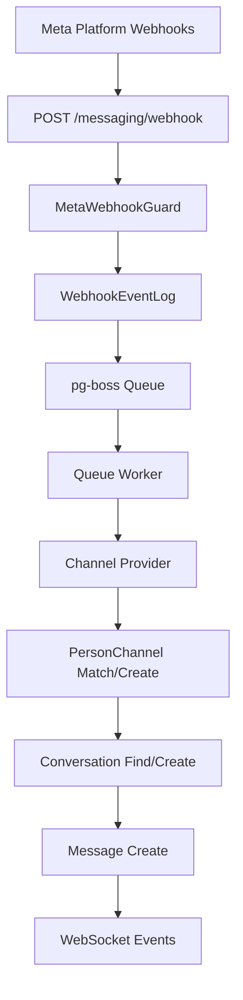
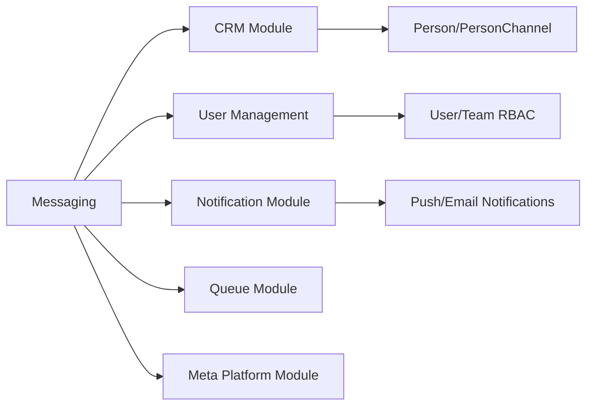

<Note>
**Last Updated:** 2026-04-15  
**Status:** Active
</Note>

## Overview

The Messaging module provides a unified, channel-agnostic messaging system for WhatsApp, Instagram, and Facebook Messenger. It replaces the separate per-channel modules with shared entities, a shared queue, and a single WebSocket namespace.

### Problem → Solution

| Problem | Solution |
| --- | --- |
| Duplicated logic across WhatsApp and Instagram modules | Single `MessagingModule` with channel providers |
| No webhook signature validation (security gap) | Shared `MetaWebhookGuard` validates `X-Hub-Signature-256` |
| Inconsistent WebSocket auth (Instagram gateway has no JWT) | Single `/messaging` gateway with JWT auth |
| No Facebook Messenger support | Third channel provider |
| Separate entity schemas per channel | Unified entities: `Conversation`, `Message`, `ChannelAccount` |
| No shared queue infrastructure | Shared `PgBossQueueService` for messaging + notifications |

### Key Design Decisions

<AccordionGroup>
  <Accordion title="Queue Technology Choice">
    **pg-boss over BullMQ** — Project already uses pg-boss for notifications. No new Redis dependency. Interface-based design (`IQueueService`) allows swapping later.
  </Accordion>
  
  <Accordion title="Conversation-CRM Linking">
    **Direct PersonChannel FK on Conversation** — Conversations link directly to the CRM's `PersonChannel` via FK. Simpler model, no bidirectional sync overhead. The lead FK was moved from Conversation to Lead (`Lead.sourceConversation`) — conversations discover related leads via `personChannel → person → leads`.
  </Accordion>
  
  <Accordion title="Archive Pattern">
    **Archive as boolean, not status** — `Conversation.isArchived` is orthogonal to `status` (OPEN/CLOSED), following `ARCHIVE_SYSTEM_SPECIFICATION.md`.
  </Accordion>
  
  <Accordion title="Assignment Entity">
    **`ConversationAssignment` entity (not `entity_stakeholder`)** — Conversations use a dedicated `conversation_assignment` table instead of the CRM `entity_stakeholder` pattern. Each assignment is one row with nullable `user_id` and `team_id`: `user + null` = direct assignment, `user + team` = agent on behalf of team, `null + team` = team pool.
  </Accordion>
  
  <Accordion title="Message Delivery">
    **Transactional outbox** — Outbound messages use an outbox table written in the same DB transaction as the Message entity, guaranteeing at-least-once delivery.
  </Accordion>
  
  <Accordion title="AI Configuration">
    **Per-conversation AI mode with cascade** — Each conversation has an `aiMode` field (OFF, AUTO_REPLY, SUGGEST_ONLY, DRAFT). Default cascades: ChannelAccount.defaultAiMode → Organization default → OFF.
  </Accordion>
  
  <Accordion title="Template System">
    **Three-tier template system** — `MessageTemplate` supports three types: `META_APPROVED` (platform-approved), `QUICK_REPLY` (agent shortcuts with variable resolution), and `AI_PROMPT` (AI system prompts with optional SystemPrompt link).
  </Accordion>
  
  <Accordion title="Personal Account Tokens">
    **Personal accounts share org WABA token** — WhatsApp personal accounts reuse the organization's WABA access token (same Business Account). Instagram and Messenger personal accounts use their own Page Access Token obtained via OAuth.
  </Accordion>
</AccordionGroup>

## Architecture & Module Structure



<Steps>
<Step title="Webhook Receipt">
Meta platforms send webhooks to `POST /messaging/webhook` with `@PublicEndpoint()` and `MetaWebhookGuard` validation of `X-Hub-Signature-256`.
</Step>

<Step title="Queue Processing">
Events are persisted to `WebhookEventLog` and enqueued to pg-boss for processing.
</Step>

<Step title="Organization Context">
Queue worker uses two-step RLS bypass to find organization, then processes within org context.
</Step>

<Step title="Message Processing">
Channel providers handle platform-specific logic, creating unified `Message` and `Conversation` entities.
</Step>
</Steps>

### Module Structure

```
src/modules/meta-platform/    ← Top-level infra module
  meta-platform.module.ts
  meta-graph-api.service.ts
  meta-api.error.ts
  meta-webhook.guard.ts
  meta-oauth.service.ts
  webhook-event-log.entity.ts

src/modules/queue/            ← Top-level infra module

src/modules/messaging/
  messaging.module.ts
  entities/               ← Core entities
  enums/                  ← Channel, MessageType, etc.
  services/               ← Core services + providers/
    providers/            ← WhatsApp, Instagram, Messenger
  controllers/            ← API endpoints
  gateways/               ← WebSocket gateway
  queues/                 ← Queue workers
  dto/                    ← Request/response DTOs
  utils/                  ← Utilities
```

## Multi-Tenancy Patterns

<Warning>
The messaging module introduces unique multi-tenancy challenges because webhooks arrive without org context.
</Warning>

### Two-Step RLS Bypass (Webhook Processing)

The webhook controller receives events for ALL organizations from a single Meta App. Organization context is unknown at arrival time.

<CodeGroup>
```typescript Step 1: Find Organization
// Step 1: Find which org owns this account (bypass RLS)
const account = await this.tenantContext.executeReadOnlyWithBypass(async (em) => {
  return em.findOne(ChannelAccount, { externalAccountId: job.data.accountId });
});
```

```typescript Step 2: Process in Context
// Step 2: Process within that org's context
await this.tenantContext.executeInOrg(
  account.organization.id,
  async (em) => {
    await this.processMessageInTransaction(em, job.data);
  },
  { userId: undefined }, // system action, no user
);
```
</CodeGroup>

### Composable `*InTransaction` Pattern

Services that participate in existing transactions expose `*InTransaction` methods:

```typescript
// Public API — wraps TenantContext
async matchOrCreate(channel, identifier, profileData, orgId): Promise<MatchResult>;

// Composable — accepts EntityManager from caller's transaction
async matchOrCreateInTransaction(em, channel, identifier, profileData, orgId): Promise<MatchResult>;
```

<Tip>
The `em` parameter must always be the one provided by the TenantContext callback — never `this.em`.
</Tip>

### Read-Only vs Mutation Methods

<Tabs>
<Tab title="Read-Only Methods">
Use `executeReadOnly()` for performance (READ COMMITTED + read-only transaction):
```typescript
// Read-only: findById, listConversations, etc.
return this.tenantContext.executeReadOnly(organizationId, async (em) => { ... });
```
</Tab>

<Tab title="Mutation Methods">
Use `executeInOrg()` with `{ userId }` for audit attribution:
```typescript  
// Mutation: updateConversation, archiveConversation, etc.
return this.tenantContext.executeInOrg(organizationId, async (em) => { ... }, { userId });
```
</Tab>
</Tabs>

### Forbidden Patterns

<Warning>
| Pattern | Why It's Forbidden |
| --- | --- |
| Using `*Impl` method names | Project convention uses `*InTransaction` suffix |
| Nesting TenantContext calls | Causes deadlocks or incorrect org context |
| Using `this.em` in transaction methods | Must use the `em` parameter from callback |
</Warning>

## Entities

### Core Entities

<AccordionGroup>
<Accordion title="ChannelAccount">
Represents a connected messaging account (WhatsApp Business, Instagram Business, Facebook Page).

**Key Fields:**
- `channel`: WHATSAPP | INSTAGRAM | MESSENGER
- `level`: ORGANIZATION | PERSONAL
- `externalAccountId`: Platform account identifier
- `accessToken`: OAuth token for API calls
- `defaultAiMode`: Default AI behavior for new conversations
</Accordion>

<Accordion title="Conversation">
A messaging thread between the organization and an external contact.

**Key Fields:**
- `personChannelId`: FK to CRM PersonChannel
- `channelAccountId`: FK to ChannelAccount
- `status`: OPEN | CLOSED
- `isArchived`: Boolean archive flag
- `aiMode`: AI behavior for this conversation
- `lastMessageAt`: Timestamp of most recent message
</Accordion>

<Accordion title="Message">
Individual messages within conversations.

**Key Fields:**
- `conversationId`: FK to Conversation
- `direction`: INBOUND | OUTBOUND
- `type`: TEXT | IMAGE | AUDIO | VIDEO | DOCUMENT | LOCATION | etc.
- `status`: SENT | DELIVERED | READ | FAILED (outbound only)
- `content`: Message content (JSON structure varies by type)
- `externalMessageId`: Platform message identifier
</Accordion>

<Accordion title="ConversationAssignment">
Tracks agent and team assignments to conversations.

**Key Fields:**
- `conversationId`: FK to Conversation
- `userId`: Nullable FK to User (assigned agent)
- `teamId`: Nullable FK to Team (assigned team)
- `canReply`: Whether assignee can send messages
- `assignedAt`: Assignment timestamp
</Accordion>
</AccordionGroup>

## Enums

<CardGroup cols={2}>
<Card title="Channel" icon="message">
- `WHATSAPP`
- `INSTAGRAM` 
- `MESSENGER`
</Card>

<Card title="MessageDirection" icon="arrow-right">
- `INBOUND`
- `OUTBOUND`
</Card>

<Card title="MessageType" icon="file">
- `TEXT`
- `IMAGE`
- `AUDIO`
- `VIDEO`
- `DOCUMENT`
- `LOCATION`
- `CONTACT`
- `INTERACTIVE`
- `TEMPLATE`
- `SYSTEM`
</Card>

<Card title="MessageStatus" icon="check">
- `SENT`
- `DELIVERED`
- `READ`
- `FAILED`
</Card>
</CardGroup>

## Message Flows

### Inbound Message Flow

<Steps>
<Step title="Webhook Receipt">
Meta platform sends webhook to `/messaging/webhook`
</Step>

<Step title="Validation & Queuing">
`MetaWebhookGuard` validates signature, event logged and queued
</Step>

<Step title="Organization Resolution">
Queue worker finds organization via channel account lookup
</Step>

<Step title="Contact Matching">
PersonChannel matched/created, Person and Lead updated
</Step>

<Step title="Conversation Handling">
Existing conversation found or new one created
</Step>

<Step title="Message Creation">
Message entity created with platform-specific content parsing
</Step>

<Step title="Events & Notifications">
WebSocket events emitted, notification events triggered
</Step>
</Steps>

### Outbound Message Flow

<Steps>
<Step title="API Request">
Agent or automation creates message via API
</Step>

<Step title="Transactional Write">
Message and MessageOutbox created in same transaction
</Step>

<Step title="Queue Processing">
`message-sender` worker processes outbox entry
</Step>

<Step title="Platform API Call">
Channel provider sends to Meta platform APIs
</Step>

<Step title="Status Updates">
Delivery/read receipts update message status
</Step>
</Steps>

## Business Rules

### Conversation Management

<Check>
**Auto-Creation Rules:**
- New inbound message creates conversation if none exists
- Conversations auto-reopen on new inbound messages if closed
- Archive status is preserved across status changes
</Check>

<Check>
**Assignment Rules:**
- Multiple assignments supported (agent + team pool)
- Team assignments inherit from team messaging permissions
- Personal account owners have implicit access to their conversations
</Check>

### AI Mode Cascade

Default AI mode cascades through these levels:
1. Conversation-specific `aiMode` (if set)
2. ChannelAccount `defaultAiMode`
3. Organization default AI mode
4. System default: `OFF`

<Info>
AI modes: `OFF`, `AUTO_REPLY`, `SUGGEST_ONLY`, `DRAFT`
</Info>

### Message Templates

<Tabs>
<Tab title="META_APPROVED">
Platform-approved templates with formal approval process. Used for automated messaging compliance.
</Tab>

<Tab title="QUICK_REPLY">  
Agent shortcuts with variable substitution. Support dynamic content insertion.
</Tab>

<Tab title="AI_PROMPT">
System prompts for AI responses. Can link to shared SystemPrompt entities.
</Tab>
</Tabs>

## RBAC Permissions & Access Control

### Permission Hierarchy

```
MESSAGING_MANAGE (Admin)
├── Full conversation access
├── Can assign/transfer/archive
├── Can manage channel accounts
└── Can configure AI settings

MESSAGING_WRITE (Agent)
├── Can view assigned conversations
├── Can reply to messages
├── Can close/reopen conversations
└── Cannot transfer or archive

Personal Account Owner
├── Full access to own account conversations
├── Bypasses team-based permissions
└── Cannot access other accounts
```

### ResourcePermissionsDto Pattern

Conversations return per-resource permissions following CRM patterns:

<CodeGroup>
```typescript Permission Calculation
// ConversationPermissionService computes in-memory
MESSAGING_MANAGE → fullAccess()
MESSAGING_WRITE → canView + canReply  
Personal account owner → canView + canReply
Assigned agent → canView + assignment.canReply
Team member → canView + team assignment.canReply
```

```typescript Permission Response
{
  "permissions": {
    "canView": true,
    "canReply": true,
    "canEdit": false,      // Admin only
    "canTransfer": false,  // Admin only  
    "canArchive": false,   // Admin only
    "canAssign": true      // Team managers for their teams
  }
}
```
</CodeGroup>

## WebSocket Events & Room Architecture

### Room Structure

<CardGroup cols={2}>
<Card title="Organization Room" icon="building">
`org-{orgId}`
- All organization users
- High-level notifications
- System announcements
</Card>

<Card title="Conversation Room" icon="comments">
`conversation-{conversationId}`
- Assigned agents/teams
- Real-time message updates
- Typing indicators
</Card>
</CardGroup>

### Event Types

<AccordionGroup>
<Accordion title="message-created">
**Emitted when:** New message arrives (inbound/outbound)
**Rooms:** Conversation room + organization room
**Payload:** Full message object with conversation context
</Accordion>

<Accordion title="conversation-updated">
**Emitted when:** Status, assignment, or archive changes
**Rooms:** Conversation room + organization room  
**Payload:** Updated conversation object with change type
</Accordion>

<Accordion title="message-status-updated">
**Emitted when:** Delivery/read receipt received
**Rooms:** Conversation room
**Payload:** Message ID and new status
</Accordion>

<Accordion title="typing-indicator">
**Emitted when:** Agent starts/stops typing
**Rooms:** Conversation room only
**Payload:** User info and typing state
</Accordion>
</AccordionGroup>

## API Endpoints

### Conversation Endpoints

<Tabs>
<Tab title="List Conversations">
```http
GET /api/messaging/conversations
Query params: status, isArchived, assignedToMe, channel, search, page, limit
```
</Tab>

<Tab title="Get Conversation">
```http
GET /api/messaging/conversations/{id}
Returns: Conversation with messages, assignments, permissions
```
</Tab>

<Tab title="Update Conversation">
```http
PATCH /api/messaging/conversations/{id}
Body: status, isArchived, aiMode
Requires: MESSAGING_MANAGE or assignment
```
</Tab>

<Tab title="Transfer Conversation">
```http
POST /api/messaging/conversations/{id}/transfer
Body: userId?, teamId?, removeExisting?
Requires: MESSAGING_MANAGE
```
</Tab>
</Tabs>

### Message Endpoints

<Tabs>
<Tab title="Send Message">
```http
POST /api/messaging/conversations/{conversationId}/messages
Body: type, content, templateId?
Requires: MESSAGING_WRITE + canReply permission
```
</Tab>

<Tab title="List Messages">
```http
GET /api/messaging/conversations/{conversationId}/messages
Query params: page, limit, before, after
Returns: Paginated message list
```
</Tab>

<Tab title="Message Status">
```http
GET /api/messaging/messages/{id}/status
Returns: Current delivery/read status
```
</Tab>
</Tabs>

## Error Handling & Retry Strategy

### Webhook Processing

<Steps>
<Step title="Immediate Response">
Always return 200 OK to Meta platforms to prevent retries
</Step>

<Step title="Queue Retry Logic">
Failed jobs retry with exponential backoff: 1m, 5m, 15m, 1h, 6h
</Step>

<Step title="Dead Letter Queue">
After 5 failures, jobs move to dead letter queue for manual review
</Step>

<Step title="Idempotency">
`externalEventId` prevents duplicate processing of webhook events
</Step>
</Steps>

### Message Sending

<Warning>
Outbound message failures are handled gracefully:
- Network errors: Automatic retry with backoff
- Platform errors (rate limits): Exponential backoff
- Business errors (invalid recipient): Mark as failed, no retry
- Authentication errors: Alert admins, pause account
</Warning>

## Deployment Considerations

### Database Migrations

<Check>
**Required migrations for new installations:**
- Core messaging entities and indexes
- RLS policies for multi-tenancy
- Queue job tables (if not already present)
- Webhook event log table
</Check>

### Environment Variables

```bash
# Meta Platform Integration
META_APP_ID=your_app_id
META_APP_SECRET=your_app_secret
META_WEBHOOK_VERIFY_TOKEN=your_verify_token

# Queue Configuration  
PGBOSS_DATABASE_URL=postgresql://...
QUEUE_CONCURRENCY=10

# WebSocket Configuration
WS_CORS_ORIGINS=https://app.example.com,http://localhost:3000
```

### Performance Considerations

<Tip>
**Optimization strategies:**
- Index on conversation.lastMessageAt for inbox sorting
- Partition message table by organization for large deployments  
- Use read replicas for message history queries
- Cache channel account tokens with TTL
</Tip>

## Module Dependencies & Integration Points

### Internal Dependencies



### External Dependencies

<CardGroup cols={2}>
<Card title="Meta Graph API" icon="meta">
- Message sending
- Account management
- Media upload/download
</Card>

<Card title="PostgreSQL" icon="database">
- Primary data storage
- Queue job storage
- RLS multi-tenancy
</Card>
</CardGroup>

## Testing Strategy

### Unit Tests

<AccordionGroup>
<Accordion title="Service Layer">
- Message processing logic
- Permission calculations
- AI mode cascading
- Template variable substitution
</Accordion>

<Accordion title="Provider Layer">
- Channel-specific message parsing
- Platform API integration
- Error handling and retries
</Accordion>
</AccordionGroup>

### Integration Tests

<Steps>
<Step title="Webhook Processing">
End-to-end webhook flow from receipt to message creation
</Step>

<Step title="Message Sending">
Outbound message flow through outbox to platform delivery
</Step>

<Step title="WebSocket Events">
Real-time event emission and room management
</Step>

<Step title="Multi-Tenancy">
RLS policy enforcement and organization isolation
</Step>
</Steps>

### E2E Tests

<Check>
**Critical user journeys:**
- Agent receives and replies to customer message
- Conversation assignment and transfer
- AI-assisted response generation
- Channel account connection and management
</Check>

## Known Gaps & Technical Debt

<Warning>
**Current limitations:**
- Media message handling incomplete for all channels
- Message reactions not implemented
- Bulk message operations missing
- Advanced Instagram features (story replies, etc.)
- Facebook Messenger thread control handover
</Warning>

<Info>
**Performance optimizations needed:**
- Message history pagination could be improved
- Conversation list queries may need optimization for large datasets  
- WebSocket room management could use Redis for horizontal scaling
</Info>

## Future Phases

### Phase 2: Advanced Features

- [ ] Message reactions and interactions
- [ ] Conversation tags and labels  
- [ ] Advanced AI features (sentiment analysis, intent detection)
- [ ] Bulk messaging operations
- [ ] Message scheduling

### Phase 3: Scale & Performance

- [ ] Redis-backed WebSocket rooms
- [ ] Message table partitioning
- [ ] Read replica support
- [ ] Advanced caching strategies
- [ ] Horizontal queue scaling

### Phase 4: Platform Expansion

- [ ] Additional Meta platform features
- [ ] Third-party channel integrations
- [ ] Advanced template management
- [ ] Conversation analytics and reporting

## Related Documentation

<CardGroup cols={2}>
<Card title="Multi-Tenancy Guide" icon="shield">
`Docs/MULTI_TENANCY.md` - Complete RLS reference
</Card>

<Card title="Archive System" icon="archive">
`ARCHIVE_SYSTEM_SPECIFICATION.md` - Archive pattern details
</Card>

<Card title="Queue Module" icon="list">
`src/modules/queue/` - Shared queue infrastructure
</Card>

<Card title="CRM Integration" icon="users">
`src/modules/crm/` - PersonChannel and Person entities
</Card>
</CardGroup>