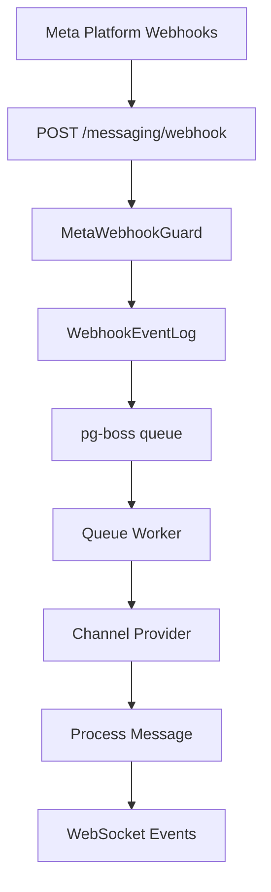

# Final Specification

<Info>
**Last Updated:** 2026-04-15  
**Status:** Active
</Info>

The Messaging module provides a unified, channel-agnostic messaging system for WhatsApp, Instagram, and Facebook Messenger. It replaces the separate per-channel modules with shared entities, a shared queue, and a single WebSocket namespace.

## Overview

### Problem → Solution

| Problem | Solution |
| --- | --- |
| Duplicated logic across WhatsApp and Instagram modules | Single `MessagingModule` with channel providers |
| No webhook signature validation (security gap) | Shared `MetaWebhookGuard` validates `X-Hub-Signature-256` |
| Inconsistent WebSocket auth (Instagram gateway has no JWT) | Single `/messaging` gateway with JWT auth |
| No Facebook Messenger support | Third channel provider |
| Separate entity schemas per channel | Unified entities: `Conversation`, `Message`, `ChannelAccount` |
| No shared queue infrastructure | Shared `PgBossQueueService` for messaging + notifications |

### Key Design Decisions

<AccordionGroup>
  <Accordion title="pg-boss over BullMQ">
    Project already uses pg-boss for notifications. No new Redis dependency. Interface-based design (`IQueueService`) allows swapping later.
  </Accordion>

  <Accordion title="Direct PersonChannel FK on Conversation">
    Conversations link directly to the CRM's `PersonChannel` via FK. Simpler model, no bidirectional sync overhead. The lead FK was moved from Conversation to Lead (`Lead.sourceConversation`).
  </Accordion>

  <Accordion title="Archive as boolean, not status">
    `Conversation.isArchived` is orthogonal to `status` (OPEN/CLOSED), following `ARCHIVE_SYSTEM_SPECIFICATION.md`.
  </Accordion>

  <Accordion title="ConversationAssignment entity">
    Conversations use a dedicated `conversation_assignment` table instead of the CRM `entity_stakeholder` pattern. Each assignment is one row with nullable `user_id` and `team_id`: `user + null` = direct assignment, `user + team` = agent on behalf of team, `null + team` = team pool.
  </Accordion>

  <Accordion title="Transactional outbox">
    Outbound messages use an outbox table written in the same DB transaction as the Message entity, guaranteeing at-least-once delivery.
  </Accordion>

  <Accordion title="Per-conversation AI mode with cascade">
    Each conversation has an `aiMode` field (OFF, AUTO_REPLY, SUGGEST_ONLY, DRAFT). Default cascades: ChannelAccount.defaultAiMode → Organization default → OFF.
  </Accordion>

  <Accordion title="Three-tier template system">
    `MessageTemplate` supports three types: `META_APPROVED` (platform-approved), `QUICK_REPLY` (agent shortcuts with variable resolution), and `AI_PROMPT` (AI system prompts with optional SystemPrompt link).
  </Accordion>

  <Accordion title="Personal accounts share org WABA token">
    WhatsApp personal accounts reuse the organization's WABA access token (same Business Account). Instagram and Messenger personal accounts use their own Page Access Token obtained via OAuth.
  </Accordion>
</AccordionGroup>

## Architecture & Module Structure



### Module Structure

```
src/modules/meta-platform/    <- Top-level infra module
  meta-platform.module.ts
  meta-graph-api.service.ts
  meta-api.error.ts
  meta-webhook.guard.ts
  meta-oauth.service.ts
  webhook-event-log.entity.ts

src/modules/queue/            <- Top-level infra module

src/modules/messaging/
  messaging.module.ts
  entities/               <- Core entities
  enums/                  <- Message types, statuses
  services/               <- Core services + providers/
    providers/            <- WhatsApp, Instagram, Messenger
  controllers/            <- API endpoints
  gateways/               <- WebSocket gateway
  queues/                 <- Background workers
  dto/                    <- Request/response DTOs
  utils/                  <- Utilities
```

## Multi-Tenancy Patterns

<Warning>
The messaging module introduces unique multi-tenancy challenges because webhooks arrive without org context.
</Warning>

### Two-Step RLS Bypass (Webhook Processing)

The webhook controller receives events for ALL organizations from a single Meta App. Org context is unknown at arrival time.

<Steps>
  <Step title="Find organization">
    ```typescript
    // Step 1: Find which org owns this account (bypass RLS)
    const account = await this.tenantContext.executeReadOnlyWithBypass(async (em) => {
      return em.findOne(ChannelAccount, { externalAccountId: job.data.accountId });
    });
    ```
  </Step>

  <Step title="Process within org context">
    ```typescript
    // Step 2: Process within that org's context
    await this.tenantContext.executeInOrg(
      account.organization.id,
      async (em) => {
        await this.processMessageInTransaction(em, job.data);
      },
      { userId: undefined },
    ); // system action, no user
    ```
  </Step>
</Steps>

### Composable `*InTransaction` Pattern

Services that participate in existing transactions expose `*InTransaction` methods:

<CodeGroup>
```typescript Public API
// Public API — wraps TenantContext
async matchOrCreate(channel, identifier, profileData, orgId): Promise<MatchResult>;
```

```typescript Composable
// Composable — accepts EntityManager from caller's transaction
async matchOrCreateInTransaction(em, channel, identifier, profileData, orgId): Promise<MatchResult>;
```
</CodeGroup>

<Note>
The `em` parameter must always be the one provided by the TenantContext callback — never `this.em`.
</Note>

### Read-Only vs Mutation Methods

<Tabs>
  <Tab title="Read-Only">
    ```typescript
    // Read-only: findById, listConversations, etc.
    return this.tenantContext.executeReadOnly(organizationId, async (em) => { ... });
    ```
  </Tab>
  
  <Tab title="Mutation">
    ```typescript
    // Mutation: updateConversation, archiveConversation, etc.
    return this.tenantContext.executeInOrg(organizationId, async (em) => { ... }, { userId });
    ```
  </Tab>
</Tabs>

## Entities

### Core Entities

<AccordionGroup>
  <Accordion title="ChannelAccount">
    Represents a connected messaging channel (WhatsApp, Instagram, Messenger).
    
    ```typescript
    @Entity()
    export class ChannelAccount {
      @PrimaryKey()
      id: number;

      @ManyToOne(() => Organization)
      organization: Organization;

      @Enum(() => Channel)
      channel: Channel;

      @Property()
      externalAccountId: string;

      @Property({ nullable: true })
      pageId?: string; // For Instagram outbound messaging

      @Property()
      name: string;

      @Property()
      profilePicture: string;

      @Property()
      accessToken: string;

      @Enum(() => ChannelAccountType)
      type: ChannelAccountType; // ORGANIZATION | PERSONAL

      @Enum(() => AiMode)
      defaultAiMode: AiMode;

      @Property()
      isActive: boolean = true;
    }
    ```
  </Accordion>

  <Accordion title="Conversation">
    Unified conversation entity across all channels.
    
    ```typescript
    @Entity()
    export class Conversation {
      @PrimaryKey()
      id: number;

      @ManyToOne(() => Organization)
      organization: Organization;

      @ManyToOne(() => ChannelAccount)
      channelAccount: ChannelAccount;

      @ManyToOne(() => PersonChannel)
      personChannel: PersonChannel;

      @Enum(() => ConversationStatus)
      status: ConversationStatus = ConversationStatus.OPEN;

      @Property()
      isArchived: boolean = false;

      @Enum(() => AiMode)
      aiMode: AiMode;

      @Property({ nullable: true })
      lastMessageAt?: Date;

      @Property({ nullable: true })
      lastAgentMessageAt?: Date;
    }
    ```
  </Accordion>

  <Accordion title="Message">
    Individual message within a conversation.
    
    ```typescript
    @Entity()
    export class Message {
      @PrimaryKey()
      id: number;

      @ManyToOne(() => Organization)
      organization: Organization;

      @ManyToOne(() => Conversation)
      conversation: Conversation;

      @Property()
      externalMessageId: string;

      @Enum(() => MessageDirection)
      direction: MessageDirection; // INBOUND | OUTBOUND

      @Enum(() => MessageType)
      type: MessageType;

      @Property()
      content: string;

      @Property({ type: 'json', nullable: true })
      metadata?: Record<string, any>;

      @Enum(() => MessageStatus)
      status: MessageStatus = MessageStatus.SENT;

      @Property({ nullable: true })
      sentByUser?: User;

      @Property()
      timestamp: Date;
    }
    ```
  </Accordion>
</AccordionGroup>

## Enums

<CodeGroup>
```typescript Channel
export enum Channel {
  WHATSAPP = 'whatsapp',
  INSTAGRAM = 'instagram',
  MESSENGER = 'messenger',
}
```

```typescript MessageType
export enum MessageType {
  TEXT = 'text',
  IMAGE = 'image',
  DOCUMENT = 'document',
  AUDIO = 'audio',
  VIDEO = 'video',
  STICKER = 'sticker',
  LOCATION = 'location',
  CONTACT = 'contact',
  TEMPLATE = 'template',
  INTERACTIVE = 'interactive',
  SYSTEM = 'system',
}
```

```typescript MessageStatus
export enum MessageStatus {
  QUEUED = 'queued',
  SENT = 'sent',
  DELIVERED = 'delivered',
  READ = 'read',
  FAILED = 'failed',
}
```

```typescript ConversationStatus
export enum ConversationStatus {
  OPEN = 'open',
  CLOSED = 'closed',
}
```

```typescript AiMode
export enum AiMode {
  OFF = 'off',
  AUTO_REPLY = 'auto_reply',
  SUGGEST_ONLY = 'suggest_only',
  DRAFT = 'draft',
}
```
</CodeGroup>

## Message Flows

### Inbound Message Processing

<Steps>
  <Step title="Webhook receipt">
    Meta webhook arrives at `POST /messaging/webhook` with signature validation
  </Step>
  
  <Step title="Event logging">
    Raw webhook payload stored in `WebhookEventLog`
  </Step>
  
  <Step title="Queue processing">
    Background worker processes event:
    - Find organization by account ID
    - Match/create PersonChannel
    - Find/create Conversation
    - Create Message record
  </Step>
  
  <Step title="Event emission">
    WebSocket events sent to relevant users
  </Step>
</Steps>

### Outbound Message Processing

<Steps>
  <Step title="Message creation">
    Agent creates message via API
  </Step>
  
  <Step title="Transactional outbox">
    Message and outbox record created in same transaction
  </Step>
  
  <Step title="Queue processing">
    Background worker sends via Meta API
  </Step>
  
  <Step title="Status updates">
    Delivery receipts update message status
  </Step>
</Steps>

## Business Rules

<Check>
**Message Immutability**: Messages cannot be edited or deleted after creation
</Check>

<Check>
**Conversation Lifecycle**: Conversations can be OPEN or CLOSED, with separate archive flag
</Check>

<Check>
**AI Mode Cascade**: Conversation AI mode defaults from ChannelAccount → Organization → OFF
</Check>

<Check>
**Assignment Model**: Multiple assignments per conversation supported (direct + team pool)
</Check>

## RBAC Permissions & Access Control

### Permission Levels

| Permission | Scope | Capabilities |
|------------|-------|-------------|
| `MESSAGING_MANAGE` | Organization | Full access to all conversations and settings |
| `MESSAGING_WRITE` | Organization | View and reply to conversations |
| `team_messaging.manage` | Team | Manage team assignments |
| Personal Account Owner | Account | View and reply to personal account conversations |

### ResourcePermissionsDto

Conversations return per-resource permissions following the CRM pattern:

```typescript
{
  canView: boolean;
  canEdit: boolean;
  canReply: boolean;
  canAssign: boolean;
  canTransfer: boolean;
  canArchive: boolean;
}
```

<Note>
`ConversationPermissionService` computes permissions in-memory with no extra DB queries.
</Note>

## Notification Types

<CardGroup cols={2}>
  <Card title="NEW_MESSAGE" icon="message">
    Triggered when a new inbound message arrives
  </Card>
  
  <Card title="CONVERSATION_ASSIGNED" icon="user-check">
    Triggered when conversation is assigned to agent/team
  </Card>
  
  <Card title="CONVERSATION_TRANSFERRED" icon="right-left">
    Triggered when conversation is transferred
  </Card>
  
  <Card title="CONVERSATION_STATUS_CHANGED" icon="toggle-on">
    Triggered when conversation status changes
  </Card>
</CardGroup>

## API Endpoints

<AccordionGroup>
  <Accordion title="Webhook Endpoints">
    ```typescript
    POST /messaging/webhook
    GET /messaging/webhook
    ```
    
    Handles Meta platform webhooks with signature validation.
  </Accordion>

  <Accordion title="Conversation Endpoints">
    ```typescript
    GET /messaging/conversations
    GET /messaging/conversations/:id
    PUT /messaging/conversations/:id
    POST /messaging/conversations/:id/archive
    POST /messaging/conversations/:id/assign
    POST /messaging/conversations/:id/transfer
    ```
  </Accordion>

  <Accordion title="Message Endpoints">
    ```typescript
    GET /messaging/conversations/:id/messages
    POST /messaging/conversations/:id/messages
    GET /messaging/messages/:id
    ```
  </Accordion>

  <Accordion title="Channel Account Endpoints">
    ```typescript
    GET /messaging/channel-accounts
    GET /messaging/channel-accounts/:id
    PUT /messaging/channel-accounts/:id
    DELETE /messaging/channel-accounts/:id
    ```
  </Accordion>
</AccordionGroup>

## WebSocket Events & Room Architecture

### Namespace: `/messaging`

All messaging WebSocket events use the `/messaging` namespace with JWT authentication.

### Room Structure

<CodeGroup>
```typescript Organization Room
messaging:org:{organizationId}
// All users in organization
```

```typescript Conversation Room
messaging:conversation:{conversationId}
// Users with access to specific conversation
```

```typescript User Room
messaging:user:{userId}
// Individual user notifications
```
</CodeGroup>

### Event Types

<AccordionGroup>
  <Accordion title="message-created">
    ```typescript
    {
      type: 'message-created',
      data: {
        message: MessageDto,
        conversation: ConversationSummaryDto
      }
    }
    ```
  </Accordion>

  <Accordion title="conversation-updated">
    ```typescript
    {
      type: 'conversation-updated',
      data: {
        conversation: ConversationDto,
        changes: string[]
      }
    }
    ```
  </Accordion>

  <Accordion title="message-status-updated">
    ```typescript
    {
      type: 'message-status-updated',
      data: {
        messageId: number,
        status: MessageStatus,
        timestamp: Date
      }
    }
    ```
  </Accordion>

  <Accordion title="typing-indicator">
    ```typescript
    {
      type: 'typing-indicator',
      data: {
        conversationId: number,
        isTyping: boolean,
        userId?: number
      }
    }
    ```
  </Accordion>
</AccordionGroup>

## Messaging-Specific Conventions

### Error Handling

<Warning>
All Meta API errors are wrapped in `MetaApiError` with structured error codes and retry strategies.
</Warning>

### Queue Job Types

| Job Type | Purpose | Retry Strategy |
|----------|---------|---------------|
| `webhook-processor` | Process inbound webhooks | 3 retries with exponential backoff |
| `message-sender` | Send outbound messages | 5 retries with exponential backoff |
| `media-downloader` | Download media attachments | 3 retries with exponential backoff |

### Database Patterns

<Tip>
Use `*InTransaction` service methods when participating in existing transactions from webhook processing.
</Tip>

## Query Patterns

### Conversation Queries

<CodeGroup>
```typescript List Conversations
// With filters and pagination
const conversations = await em.find(Conversation, {
  organization: orgId,
  isArchived: false,
  ...(filters.status && { status: filters.status }),
  ...(filters.assignedUserId && { 
    assignments: { user: filters.assignedUserId } 
  }),
}, {
  populate: ['channelAccount', 'personChannel', 'lastMessage'],
  orderBy: { lastMessageAt: 'DESC' },
  limit: pagination.limit,
  offset: pagination.offset,
});
```

```typescript Conversation Detail
// With full relations
const conversation = await em.findOne(Conversation, id, {
  populate: [
    'channelAccount',
    'personChannel.person',
    'assignments.user',
    'assignments.team',
    'messages',
  ],
});
```
</CodeGroup>

### Message Queries

```typescript
// Messages with media metadata
const messages = await em.find(Message, {
  conversation: conversationId,
}, {
  populate: ['sentByUser'],
  orderBy: { timestamp: 'ASC' },
});
```

## Error Handling & Retry Strategy

### Meta API Errors

<CodeGroup>
```typescript Rate Limiting
if (error.code === 'RATE_LIMITED') {
  const retryAfter = error.headers['retry-after'];
  throw new MetaApiError('Rate limited', 'RATE_LIMITED', { retryAfter });
}
```

```typescript Token Expiry
if (error.code === 'TOKEN_EXPIRED') {
  // Disable channel account and notify admins
  await this.channelAccountService.markAsInactive(accountId);
  throw new MetaApiError('Token expired', 'TOKEN_EXPIRED');
}
```
</CodeGroup>

### Queue Retry Logic

- **Webhook processing**: 3 retries with exponential backoff (1s, 5s, 25s)
- **Message sending**: 5 retries with exponential backoff (1s, 5s, 25s, 2m, 10m)
- **Media downloads**: 3 retries with linear backoff (30s, 60s, 90s)

## Deployment Considerations

<Warning>
Ensure Meta webhook URL is accessible and has valid SSL certificate before going live.
</Warning>

### Environment Variables

```bash
# Meta Platform
META_APP_ID=your_app_id
META_APP_SECRET=your_app_secret
META_WEBHOOK_VERIFY_TOKEN=your_verify_token

# Queue Configuration
PGBOSS_SCHEMA=pgboss
PGBOSS_MAX_CONNECTIONS=10

# WebSocket
WEBSOCKET_CORS_ORIGIN=https://your-frontend.com
```

### Database Migrations

<Steps>
  <Step title="Create messaging tables">
    Run migrations for core messaging entities
  </Step>
  
  <Step title="Migrate legacy data">
    Backfill from old WhatsApp/Instagram modules
  </Step>
  
  <Step title="Update RLS policies">
    Apply tenant isolation policies
  </Step>
</Steps>

## Module Dependencies & Integration Points

### Internal Dependencies

- **CRM Module**: PersonChannel, Person, Lead entities
- **Organization Module**: Organization, User, Team entities  
- **Queue Module**: PgBoss queue service
- **Meta Platform Module**: Webhook validation, API client

### External Dependencies

- **Meta Graph API**: WhatsApp Business API, Instagram API, Messenger API
- **PostgreSQL**: Primary database with pg-boss queues
- **WebSocket Gateway**: Real-time event delivery

## Testing Strategy

<Tabs>
  <Tab title="Unit Tests">
    - Service method logic
    - DTO validation
    - Permission calculations
    - Message formatting
  </Tab>
  
  <Tab title="Integration Tests">
    - Webhook processing end-to-end
    - Queue job execution
    - Database transactions
    - WebSocket event emission
  </Tab>
  
  <Tab title="E2E Tests">
    - Complete message flows
    - Multi-tenant isolation
    - API endpoint security
    - Real-time features
  </Tab>
</Tabs>

## Legacy Module Removal

### Migration Steps

<Steps>
  <Step title="Data migration">
    Migrate existing WhatsApp and Instagram data to unified schema
  </Step>
  
  <Step title="API compatibility">
    Maintain backward compatibility during transition period
  </Step>
  
  <Step title="Feature parity">
    Ensure all legacy features are replicated in new module
  </Step>
  
  <Step title="Gradual removal">
    Remove old modules after successful migration
  </Step>
</Steps>

## Known Gaps & Technical Debt

<Warning>
**Current Limitations**
- No message search functionality
- Limited media file size (25MB Meta limit)
- No message encryption at rest
- No conversation export feature
</Warning>

## Key Files Reference

<AccordionGroup>
  <Accordion title="Core Module Files">
    - `messaging.module.ts` - Main module definition
    - `messaging.service.ts` - Core business logic
    - `conversation.service.ts` - Conversation management
    - `message.service.ts` - Message handling
  </Accordion>

  <Accordion title="Entity Files">
    - `channel-account.entity.ts` - Channel account definition
    - `conversation.entity.ts` - Conversation definition
    - `message.entity.ts` - Message definition
    - `message-template.entity.ts` - Template definition
  </Accordion>

  <Accordion title="Controller Files">
    - `messaging-webhook.controller.ts` - Webhook handling
    - `conversation.controller.ts` - Conversation API
    - `message.controller.ts` - Message API
    - `channel-account.controller.ts` - Account management
  </Accordion>
</AccordionGroup>

## Future Phases

<CardGroup cols={2}>
  <Card title="Phase 2: Advanced Features" icon="rocket">
    - Message templates with variables
    - Conversation routing rules
    - Advanced AI integration
    - Analytics dashboard
  </Card>
  
  <Card title="Phase 3: Enterprise Features" icon="building">
    - Message encryption
    - Compliance logging
    - Advanced reporting
    - API rate limiting
  </Card>
  
  <Card title="Phase 4: Platform Expansion" icon="globe">
    - Additional messaging channels
    - Voice message support
    - Video call integration
    - Chatbot framework
  </Card>
  
  <Card title="Phase 5: AI Enhancement" icon="brain">
    - Sentiment analysis
    - Auto-categorization
    - Smart routing
    - Predictive responses
  </Card>
</CardGroup>

## Related Documentation

- `MULTI_TENANCY.md` - RLS patterns and tenant isolation
- `ARCHIVE_SYSTEM_SPECIFICATION.md` - Archive system design
- `WEBHOOK_SPECIFICATION.md` - Webhook security and processing
- `QUEUE_SYSTEM_SPECIFICATION.md` - Background job processing
- `WEBSOCKET_SPECIFICATION.md` - Real-time event architecture