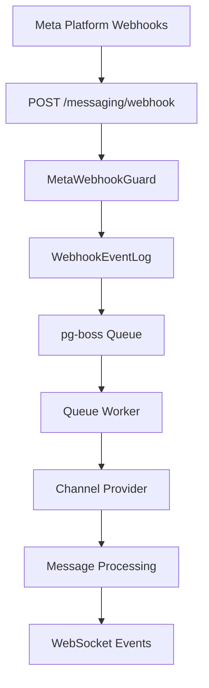

## Overview

A unified messaging module that provides a single, channel-agnostic messaging system for WhatsApp, Instagram, and Facebook Messenger. It replaces the separate per-channel modules with shared entities, a shared queue, and a single WebSocket namespace.

<Note>
**Last Updated:** 2026-03-17  
**Status:** Active  
**Specification:** `Docs/MESSAGING_MODULE_SPECIFICATION.md` (entity & enum definitions)
</Note>

### Problem → Solution

| Problem | Solution |
|---------|----------|
| Duplicated logic across WhatsApp and Instagram modules | Single `MessagingModule` with channel providers |
| No webhook signature validation (security gap) | Shared `MetaWebhookGuard` validates `X-Hub-Signature-256` |
| Inconsistent WebSocket auth (Instagram gateway has no JWT) | Single `/messaging` gateway with JWT auth |
| No Facebook Messenger support | Third channel provider |
| Separate entity schemas per channel | Unified entities: `Conversation`, `Message`, `ChannelAccount` |
| No shared queue infrastructure | Shared `PgBossQueueService` for messaging + notifications |

### Key Design Decisions

<AccordionGroup>
<Accordion title="Queue System">
**pg-boss over BullMQ** — Project already uses pg-boss for notifications. No new Redis dependency. Interface-based design (`IQueueService`) allows swapping later.
</Accordion>

<Accordion title="Data Model">
**Direct PersonChannel FK on Conversation** — Conversations link directly to the CRM's `PersonChannel` via FK. Simpler model, no bidirectional sync overhead.

**Archive as boolean, not status** — `Conversation.isArchived` is orthogonal to `status` (OPEN/CLOSED), following `ARCHIVE_SYSTEM_SPECIFICATION.md`.
</Accordion>

<Accordion title="Ownership Model">
**Simplified ownership (direct FKs, not `entity_stakeholder`)** — Conversations use direct `assignedAgentId`/`assignedTeamId` FKs instead of the CRM `entity_stakeholder` pattern used by Lead/Deal. Rationale: conversations have single-owner semantics (one agent, one team at a time).
</Accordion>

<Accordion title="Message Delivery">
**Transactional outbox** — Outbound messages use an outbox table written in the same DB transaction as the Message entity, guaranteeing at-least-once delivery.
</Accordion>

<Accordion title="AI Configuration">
**Per-conversation AI mode with cascade** — Each conversation has an `aiMode` field (OFF, AUTO_REPLY, SUGGEST_ONLY, DRAFT). Default cascades: ChannelAccount.defaultAiMode → Organization default → OFF.
</Accordion>

<Accordion title="Template System">
**Three-tier template system** — `MessageTemplate` supports three types: `META_APPROVED` (platform-approved), `QUICK_REPLY` (agent shortcuts with variable resolution), and `AI_PROMPT` (AI system prompts with optional SystemPrompt link).
</Accordion>

<Accordion title="Account Management">
**Personal accounts share org WABA token** — WhatsApp personal accounts reuse the organization's WABA access token (same Business Account). Instagram and Messenger personal accounts use their own Page Access Token obtained via OAuth.
</Accordion>
</AccordionGroup>

## Architecture



<Steps>
<Step title="Webhook Reception">
Meta webhooks arrive at `POST /messaging/webhook` with `@PublicEndpoint()` and `MetaWebhookGuard` validation using `X-Hub-Signature-256`.
</Step>

<Step title="Immediate Response">
Returns 200 immediately, persists to `WebhookEventLog`, and enqueues to pg-boss queue.
</Step>

<Step title="Queue Processing">
Worker processes webhook with idempotency check, finds organization context, and routes to appropriate channel provider.
</Step>

<Step title="Message Creation">
Creates or updates `PersonChannel`, `Person`, `Conversation`, and `Message` entities within organization transaction.
</Step>

<Step title="Event Broadcasting">
Emits WebSocket events and notification events to update connected clients.
</Step>
</Steps>

### Module Structure

```
src/modules/meta-platform/    ← Top-level infra module
  meta-platform.module.ts
  meta-graph-api.service.ts
  meta-api.error.ts
  meta-webhook.guard.ts
  meta-oauth.service.ts
  webhook-event-log.entity.ts

src/modules/queue/            ← Top-level infra module

src/modules/messaging/
  messaging.module.ts
  entities/               ← Core entities
  enums/                  ← Channel, MessageType, etc.
  services/               ← Core services + providers/
    providers/            ← WhatsApp, Instagram, Messenger
  controllers/            ← API endpoints
  gateways/               ← WebSocket gateway
  queues/                 ← Background workers
  dto/                    ← Request/response DTOs
  utils/                  ← Utilities
  migration/              ← Legacy migration
```

## Multi-Tenancy Patterns

<Warning>
The messaging module introduces unique multi-tenancy challenges because webhooks arrive without organization context.
</Warning>

### Two-Step RLS Bypass (Webhook Processing)

The webhook controller receives events for ALL organizations from a single Meta App. Organization context is unknown at arrival time.

<CodeGroup>
```typescript Step 1: Find Organization
// Step 1: Find which org owns this account (bypass RLS)
const account = await this.tenantContext.executeReadOnlyWithBypass(async (em) => {
  return em.findOne(ChannelAccount, { externalAccountId: job.data.accountId });
});
```

```typescript Step 2: Process in Context
// Step 2: Process within that org's context
await this.tenantContext.executeInOrg(
  account.organization.id,
  async (em) => {
    await this.processMessageInTransaction(em, job.data);
  },
  { userId: undefined }, // system action, no user
);
```
</CodeGroup>

### Composable Transaction Pattern

Services that participate in existing transactions expose `*InTransaction` methods:

```typescript
// Public API — wraps TenantContext
async matchOrCreate(channel, identifier, profileData, orgId): Promise<MatchResult>;

// Composable — accepts EntityManager from caller's transaction
async matchOrCreateInTransaction(em, channel, identifier, profileData, orgId): Promise<MatchResult>;
```

<Info>
The `em` parameter must always be the one provided by the TenantContext callback — never `this.em`.
</Info>

### Forbidden Patterns

| Pattern | Why It's Forbidden |
|---------|-------------------|
| Using `*Impl` method names | Project convention uses `*InTransaction` suffix |
| Nesting TenantContext calls | Causes deadlocks or incorrect org context |
| Using `this.em` inside TenantContext callbacks | Bypasses the transaction-scoped EntityManager |
| Using `executeWithBypass()` when you have org context | Silently disables RLS, exposing cross-tenant data |

### WebSocket Gateway Pattern

Every `@SubscribeMessage` handler must establish org context per message:

```typescript
@SubscribeMessage('join-conversation')
async handleJoinConversation(client: AuthenticatedSocket, data: { conversationId: string }) {
  return this.tenantContext.executeInOrg(client.organizationId, async (em) => {
    // Verify access, join room
  });
}
```

## Core Entities

### ChannelAccount

Represents a connected messaging account (WhatsApp number, Instagram business account, Facebook page).

```typescript
@Entity()
export class ChannelAccount {
  @PrimaryGeneratedColumn('uuid')
  id: string;

  @Column({ type: 'enum', enum: Channel })
  channel: Channel;

  @Column()
  externalAccountId: string; // Phone number, IG business account ID, or Page ID

  @Column({ nullable: true })
  pageId?: string; // Facebook Page ID (required for Instagram outbound)

  @Column()
  displayName: string;

  @Column({ nullable: true })
  profilePictureUrl?: string;

  @Column({ type: 'enum', enum: ChannelAccountType })
  accountType: ChannelAccountType; // PERSONAL, ORGANIZATION

  @Column({ type: 'enum', enum: AiMode, default: AiMode.OFF })
  defaultAiMode: AiMode;

  @ManyToOne(() => Organization)
  organization: Organization;
}
```

### Conversation

Unified conversation entity across all channels.

```typescript
@Entity()
export class Conversation {
  @PrimaryGeneratedColumn('uuid')
  id: string;

  @ManyToOne(() => PersonChannel)
  personChannel: PersonChannel;

  @ManyToOne(() => ChannelAccount)
  channelAccount: ChannelAccount;

  @Column({ type: 'enum', enum: ConversationStatus })
  status: ConversationStatus; // OPEN, CLOSED

  @Column({ default: false })
  isArchived: boolean;

  @Column({ type: 'enum', enum: AiMode })
  aiMode: AiMode;

  @ManyToOne(() => User, { nullable: true })
  assignedAgent?: User;

  @ManyToOne(() => Team, { nullable: true })
  assignedTeam?: Team;

  @Column({ nullable: true })
  lastMessageAt?: Date;
}
```

### Message

Unified message entity for all channels and directions.

```typescript
@Entity()
export class Message {
  @PrimaryGeneratedColumn('uuid')
  id: string;

  @ManyToOne(() => Conversation)
  conversation: Conversation;

  @Column({ type: 'enum', enum: MessageDirection })
  direction: MessageDirection; // INBOUND, OUTBOUND

  @Column({ type: 'enum', enum: MessageType })
  type: MessageType; // TEXT, IMAGE, AUDIO, etc.

  @Column({ type: 'jsonb' })
  content: MessageContent;

  @Column({ type: 'enum', enum: MessageStatus })
  status: MessageStatus; // PENDING, SENT, DELIVERED, etc.

  @Column({ nullable: true })
  externalMessageId?: string;

  @ManyToOne(() => User, { nullable: true })
  sentBy?: User;
}
```

## Channel Providers

Channel providers implement the `IChannelProvider` interface to handle channel-specific logic:

<Tabs>
<Tab title="WhatsApp Provider">
```typescript
@Injectable()
export class WhatsAppProvider implements IChannelProvider {
  async processWebhook(payload: any, account: ChannelAccount): Promise<void> {
    // Handle WhatsApp webhook format
    // Process status updates, messages, etc.
  }

  async sendMessage(message: Message, account: ChannelAccount): Promise<void> {
    // Send via WhatsApp Business API
  }

  async validateWebhook(payload: any): Promise<boolean> {
    // Validate WhatsApp-specific webhook structure
  }
}
```
</Tab>

<Tab title="Instagram Provider">
```typescript
@Injectable()
export class InstagramProvider implements IChannelProvider {
  async processWebhook(payload: any, account: ChannelAccount): Promise<void> {
    // Handle Instagram webhook format
    // Use pageId for outbound messaging
  }

  async sendMessage(message: Message, account: ChannelAccount): Promise<void> {
    // Send via Instagram Basic Display API
    // POST /{account.pageId}/messages
  }
}
```
</Tab>

<Tab title="Messenger Provider">
```typescript
@Injectable()
export class MessengerProvider implements IChannelProvider {
  async processWebhook(payload: any, account: ChannelAccount): Promise<void> {
    // Handle Messenger webhook format
  }

  async sendMessage(message: Message, account: ChannelAccount): Promise<void> {
    // Send via Messenger Platform API
  }
}
```
</Tab>
</Tabs>

## Message Flows

### Inbound Message Flow

<Steps>
<Step title="Webhook Reception">
Meta sends webhook to `/messaging/webhook` with signature validation.
</Step>

<Step title="Queue Processing">
Worker processes webhook, finds organization, and routes to channel provider.
</Step>

<Step title="Entity Resolution">
Match or create `PersonChannel`, `Person`, and `Conversation` entities.
</Step>

<Step title="Message Creation">
Create `Message` entity with parsed content and metadata.
</Step>

<Step title="CRM Integration">
Create CRM `Activity` record via bridge service.
</Step>

<Step title="Event Broadcasting">
Emit WebSocket events and notifications to update UI.
</Step>
</Steps>

### Outbound Message Flow

<Steps>
<Step title="Message Creation">
Agent creates message via API or WebSocket, stored in `Message` table.
</Step>

<Step title="Outbox Entry">
Create `MessageOutbox` entry in same transaction for guaranteed delivery.
</Step>

<Step title="Queue Processing">
Worker processes outbox entry and calls channel provider.
</Step>

<Step title="Platform Delivery">
Channel provider sends via Meta API and updates message status.
</Step>

<Step title="Status Updates">
Webhook delivers status updates (sent, delivered, read) back to system.
</Step>
</Steps>

## RBAC Permissions

### Core Permissions

| Permission | Description | Scope |
|------------|-------------|-------|
| `MESSAGING_MANAGE` | Full messaging management | Organization |
| `MESSAGING_SEND` | Send and receive messages | Conversation-level |
| `MESSAGING_VIEW` | View conversations and messages | Read-only access |

### Permission Hierarchy

<CodeGroup>
```typescript Manager Permissions
// MESSAGING_MANAGE grants full access
{
  canView: true,
  canEdit: true,
  canTransfer: true,
  canAssign: true,
  canArchive: true,
  canManageAi: true
}
```

```typescript Agent Permissions
// MESSAGING_SEND for assigned conversations
{
  canView: true,
  canEdit: false,
  canTransfer: false,
  canAssign: false,
  canArchive: false,
  canManageAi: false
}
```

```typescript Personal Account Access
// Personal account owners
{
  canView: true,
  canEdit: false, // No conversation management
  canTransfer: false,
  canAssign: false,
  canArchive: false,
  canManageAi: true // Can control AI for own accounts
}
```
</CodeGroup>

### Access Control Utilities

```typescript
// Check if user can access personal account
export function canAccessPersonalAccount(
  user: User,
  account: ChannelAccount,
): boolean {
  return account.accountType === ChannelAccountType.PERSONAL && 
         account.connectedBy?.id === user.id;
}

// Check conversation access
export function canAccessConversation(
  user: User,
  conversation: Conversation,
  orgPermissions: string[],
): boolean {
  // Managers can access all
  if (orgPermissions.includes('MESSAGING_MANAGE')) return true;
  
  // Assigned agent/team can access
  if (conversation.assignedAgent?.id === user.id) return true;
  if (conversation.assignedTeam && isUserInTeam(user, conversation.assignedTeam)) return true;
  
  // Personal account owner can access
  if (canAccessPersonalAccount(user, conversation.channelAccount)) return true;
  
  return false;
}
```

## API Endpoints

### Conversation Management

<Tabs>
<Tab title="List Conversations">
```typescript
GET /messaging/conversations
Query: {
  status?: ConversationStatus;
  isArchived?: boolean;
  assignedToMe?: boolean;
  channelAccountId?: string;
  page?: number;
  limit?: number;
}
```
</Tab>

<Tab title="Get Conversation">
```typescript
GET /messaging/conversations/:id
Returns: ConversationDetailDto & ResourcePermissionsDto
```
</Tab>

<Tab title="Update Conversation">
```typescript
PATCH /messaging/conversations/:id
Body: {
  status?: ConversationStatus;
  assignedAgentId?: string;
  assignedTeamId?: string;
  aiMode?: AiMode;
}
Requires: MESSAGING_MANAGE
```
</Tab>

<Tab title="Archive Conversation">
```typescript
POST /messaging/conversations/:id/archive
PUT /messaging/conversations/:id/unarchive
Requires: MESSAGING_MANAGE
```
</Tab>
</Tabs>

### Message Management

<Tabs>
<Tab title="List Messages">
```typescript
GET /messaging/conversations/:conversationId/messages
Query: {
  page?: number;
  limit?: number;
  beforeDate?: string;
}
```
</Tab>

<Tab title="Send Message">
```typescript
POST /messaging/conversations/:conversationId/messages
Body: {
  type: MessageType;
  content: MessageContent;
  templateId?: string; // For template messages
}
Requires: MESSAGING_SEND or conversation access
```
</Tab>
</Tabs>

### Channel Account Management

<Tabs>
<Tab title="List Accounts">
```typescript
GET /messaging/channel-accounts
Returns: Organization and personal accounts based on permissions
```
</Tab>

<Tab title="Connect Personal Account">
```typescript
POST /messaging/channel-accounts/connect/:channel
Initiates OAuth flow for personal account connection
```
</Tab>

<Tab title="Update Account Settings">
```typescript
PATCH /messaging/channel-accounts/:id
Body: {
  defaultAiMode?: AiMode;
  displayName?: string;
}
```
</Tab>
</Tabs>

## WebSocket Events

### Event Types

<CardGroup cols={2}>
<Card title="Conversation Events" icon="comments">
- `conversation-created`
- `conversation-updated`
- `conversation-archived`
- `conversation-assigned`
</Card>

<Card title="Message Events" icon="message">
- `message-received`
- `message-sent`
- `message-status-updated`
- `typing-indicator`
</Card>

<Card title="AI Events" icon="robot">
- `ai-suggestion-generated`
- `ai-mode-changed`
- `ai-draft-created`
</Card>

<Card title="System Events" icon="bell">
- `user-joined-conversation`
- `user-left-conversation`
- `account-connected`
- `account-disconnected`
</Card>
</CardGroup>

### Room Management

```typescript
// Join conversation room
socket.emit('join-conversation', { conversationId: 'uuid' });

// Leave conversation room
socket.emit('leave-conversation', { conversationId: 'uuid' });

// Join inbox (all conversations)
socket.emit('join-inbox', {});
```

### Event Payload Examples

<CodeGroup>
```typescript Message Received
{
  event: 'message-received',
  data: {
    conversationId: 'uuid',
    message: {
      id: 'uuid',
      content: { text: 'Hello!' },
      direction: 'INBOUND',
      type: 'TEXT',
      createdAt: '2026-03-17T10:00:00Z'
    },
    conversation: {
      id: 'uuid',
      status: 'OPEN',
      lastMessageAt: '2026-03-17T10:00:00Z'
    }
  }
}
```

```typescript Conversation Updated
{
  event: 'conversation-updated',
  data: {
    conversationId: 'uuid',
    changes: {
      assignedAgent: { id: 'uuid', name: 'John Doe' },
      status: 'CLOSED'
    },
    updatedBy: { id: 'uuid', name: 'Manager' }
  }
}
```
</CodeGroup>

## Queue System

### Queue Jobs

<AccordionGroup>
<Accordion title="webhook-processor">
Processes incoming Meta webhooks. Handles idempotency, organization resolution, and message creation.

**Retry Strategy:** 3 attempts with exponential backoff
**Dead Letter:** After 3 failures, log error and mark webhook as failed
</Accordion>

<Accordion title="message-sender">
Processes outbound messages from the outbox table. Calls channel providers to deliver messages.

**Retry Strategy:** 5 attempts with exponential backoff
**Dead Letter:** Mark message as failed, notify administrators
</Accordion>

<Accordion title="media-downloader">
Downloads and processes media files from messages. Handles virus scanning and storage.

**Retry Strategy:** 3 attempts
**Dead Letter:** Mark media as unavailable
</Accordion>

<Accordion title="notification-dispatcher">
Sends push notifications and emails for messaging events.

**Retry Strategy:** 2 attempts
**Dead Letter:** Log notification failure
</Accordion>
</AccordionGroup>

### Error Handling Strategy

<Steps>
<Step title="Transient Errors">
Network timeouts, rate limits, temporary API failures — retry with exponential backoff.
</Step>

<Step title="Permanent Errors">
Invalid tokens, malformed payloads, permission errors — fail immediately and alert administrators.
</Step>

<Step title="Partial Failures">
Some webhook events succeed, others fail — process successfully and retry failed ones independently.
</Step>

<Step title="Dead Letter Handling">
After exhausting retries, move to dead letter queue with detailed error logging for manual investigation.
</Step>
</Steps>

## Testing Strategy

### Unit Tests

<Tabs>
<Tab title="Entity Tests">
```typescript
describe('Conversation Entity', () => {
  it('should cascade delete messages when conversation is deleted');
  it('should validate AI mode transitions');
  it('should calculate permissions correctly');
});
```
</Tab>

<Tab title="Service Tests">
```typescript
describe('MessagingService', () => {
  it('should create conversation with correct defaults');
  it('should handle duplicate webhook events');
  it('should validate channel account access');
});
```
</Tab>

<Tab title="Provider Tests">
```typescript
describe('WhatsAppProvider', () => {
  it('should parse webhook payload correctly');
  it('should format outbound message properly');
  it('should handle API errors gracefully');
});
```
</Tab>
</Tabs>

### Integration Tests

```typescript
describe('Messaging Integration', () => {
  it('should process end-to-end message flow');
  it('should handle webhook signature validation');
  it('should maintain transaction consistency');
  it('should emit correct WebSocket events');
});
```

### E2E Tests

```typescript
describe('Messaging E2E', () => {
  it('should receive and display messages in real-time');
  it('should send messages successfully');
  it('should handle conversation assignment');
  it('should archive/unarchive conversations');
});
```

## Deployment Considerations

### Environment Variables

```bash
# Meta Platform
META_APP_ID=your_app_id
META_APP_SECRET=your_app_secret
META_WEBHOOK_VERIFY_TOKEN=your_verify_token

# WhatsApp Business API
WHATSAPP_ACCESS_TOKEN=your_wa_token
WHATSAPP_PHONE_NUMBER_ID=your_phone_id

# Database
MESSAGING_QUEUE_CONCURRENCY=5
MESSAGING_RETENTION_DAYS=365
```

### Database Considerations

<Warning>
The messaging module requires PostgreSQL 12+ for JSONB support and proper RLS functionality.
</Warning>

#### Indexing Strategy

```sql
-- Conversation queries
CREATE INDEX idx_conversation_channel_account_status 
ON conversation(channel_account_id, status) WHERE NOT is_archived;

CREATE INDEX idx_conversation_assigned_agent 
ON conversation(assigned_agent_id) WHERE status = 'OPEN';

-- Message queries  
CREATE INDEX idx_message_conversation_created 
ON message(conversation_id, created_at DESC);

-- Webhook processing
CREATE INDEX idx_webhook_event_external_id 
ON webhook_event_log(external_event_id);
```

#### Monitoring Queries

```sql
-- Queue health
SELECT 
  name,
  COUNT(*) as pending_jobs,
  AVG(EXTRACT(EPOCH FROM (NOW() - created_on))) as avg_age_seconds
FROM pgboss.job 
WHERE state = 'created'
GROUP BY name;

-- Message throughput
SELECT 
  DATE_TRUNC('hour', created_at) as hour,
  channel,
  direction,
  COUNT(*) as message_count
FROM message m
JOIN conversation c ON m.conversation_id = c.id
JOIN channel_account ca ON c.channel_account_id = ca.id
WHERE created_at >= NOW() - INTERVAL '24 hours'
GROUP BY 1, 2, 3
ORDER BY 1 DESC;
```

### Scaling Considerations

<Info>
The messaging module is designed for horizontal scaling with proper queue distribution and database optimization.
</Info>

#### Queue Scaling

- **Webhook Processing:** Can handle 1000+ webhooks/minute with proper queue worker scaling
- **Message Sending:** Rate-limited by Meta APIs (80 messages/second for WhatsApp)
- **Media Download:** CPU/bandwidth intensive, scale separately

#### Database Scaling

- **Read Replicas:** Route conversation queries to read replicas
- **Partitioning:** Consider partitioning `message` table by month for high-volume organizations
- **Connection Pooling:** Use PgBouncer for connection management

## Legacy Module Removal

<Warning>
The unified messaging module replaces separate WhatsApp and Instagram modules. Follow the migration plan carefully to avoid data loss.
</Warning>

### Migration Checklist

<Steps>
<Step title="Data Migration">
Run migration service to copy data from legacy tables to unified schema.
- `whatsapp_conversation` → `conversation`
- `instagram_conversation` → `conversation`  
- `whatsapp_message` → `message`
- `instagram_message` → `message`
</Step>

<Step title="Webhook Reconfiguration">
Update Meta webhook URLs to point to new unified endpoint:
- Old: `/whatsapp/webhook`, `/instagram/webhook`
- New: `/messaging/webhook`
</Step>

<Step title="Frontend Updates">
Update frontend to use new API endpoints and WebSocket namespace:
- Old: `/whatsapp/*`, `/instagram/*`
- New: `/messaging/*`
- WebSocket: `/messaging` namespace
</Step>

<Step title="Legacy Cleanup">
After successful migration and testing:
- Drop legacy tables
- Remove old modules from codebase
- Update documentation
</Step>
</Steps>

### Migration Service

```typescript
@Injectable()
export class MessagingMigrationService {
  async migrateLegacyData(orgId: string): Promise<MigrationResult> {
    // Migrate conversations
    const conversations = await this.migrateConversations(orgId);
    
    // Migrate messages
    const messages = await this.migrateMessages(orgId, conversations);
    
    // Migrate channel accounts
    const accounts = await this.migrateChannelAccounts(orgId);
    
    // Validate migration
    await this.validateMigration(orgId);
    
    return {
      conversationsMigrated: conversations.length,
      messagesMigrated: messages.length,
      accountsMigrated: accounts.length,
    };
  }
}
```

## Known Gaps & Technical Debt

### Current Limitations

<Warning>
These limitations are being tracked and will be addressed in future phases.
</Warning>

<AccordionGroup>
<Accordion title="Media Handling">
- **Image compression:** Not implemented for outbound images
- **Video support:** Limited to basic formats
- **File size limits:** Not enforced at application level
- **Virus scanning:** Placeholder implementation
</Accordion>

<Accordion title="AI Features">
- **Sentiment analysis:** Not integrated with message content
- **Auto-tagging:** No automatic conversation categorization  
- **AI training:** No feedback loop for improving suggestions
- **Multi-language:** AI responses limited to English
</Accordion>

<Accordion title="Analytics">
- **Response time metrics:** Not tracked
- **Conversation analytics:** Basic metrics only
- **Agent performance:** No detailed analytics
- **Customer satisfaction:** No rating system
</Accordion>

<Accordion title="Advanced Features">
- **Message scheduling:** Not implemented
- **Bulk messaging:** No broadcast capabilities
- **Chat routing:** Basic assignment only
- **Integration APIs:** No third-party integrations
</Accordion>
</AccordionGroup>

### Technical Debt

1. **Queue Error Handling:** Need better dead letter queue management
2. **Rate Limiting:** Should implement application-level rate limiting
3. **Caching:** No conversation/message caching for high-frequency access
4. **Monitoring:** Need comprehensive observability (metrics, tracing)
5. **Testing:** E2E test coverage incomplete

## Related Documentation

<CardGroup cols={2}>
<Card title="Module Specification" href="/backend/messaging/specification" icon="file-text">
Complete entity and enum definitions
</Card>

<Card title="Multi-Tenancy Guide" href="/backend/core/multi-tenancy" icon="users">
RLS patterns and tenant context
</Card>

<Card title="Queue System" href="/backend/infrastructure/queues" icon="list">
pg-boss configuration and patterns
</Card>

<Card title="Meta Platform Integration" href="/backend/integrations/meta-platform" icon="meta">
Webhook handling and API client
</Card>

<Card title="CRM Bridge" href="/backend/modules/crm-bridge" icon="bridge">
CRM integration patterns
</Card>

<Card title="Archive System" href="/backend/core/archive-system" icon="archive">
Archive patterns and specifications
</Card>
</CardGroup>

## Future Phases

### Phase 2: Advanced Messaging

- Message scheduling and bulk messaging
- Advanced AI features (sentiment, auto-tagging)
- Comprehensive analytics and reporting
- Chat routing and intelligent assignment

### Phase 3: Platform Expansion  

- Additional channels (SMS, Email, Voice)
- Third-party integrations (Slack, Teams)
- API platform for external developers
- Advanced automation and workflows

### Phase 4: Enterprise Features

- Advanced security and compliance
- Custom AI model training
- Enterprise-grade analytics
- Multi-region deployment support

<Tip>
Each phase builds on the unified foundation established in Phase 1, ensuring consistent patterns and maintainable code.
</Tip>