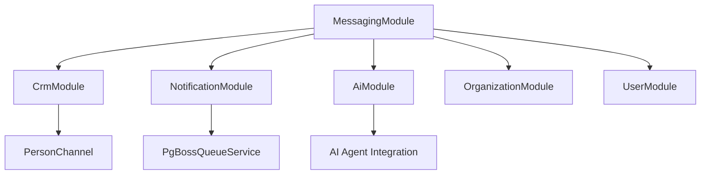

<Note>
**Last Updated:** 2026-06-01  
**Status:** Active
</Note>

## Overview

The Messaging module provides a unified, channel-agnostic messaging system for WhatsApp, Instagram, and Facebook Messenger. It replaces the separate per-channel modules with shared entities, a shared queue, and a single WebSocket namespace.

### Problem → Solution

| Problem | Solution |
|---------|----------|
| Duplicated logic across WhatsApp and Instagram modules | Single `MessagingModule` with channel providers |
| No webhook signature validation (security gap) | Shared `MetaWebhookGuard` validates `X-Hub-Signature-256` |
| Inconsistent WebSocket auth (Instagram gateway has no JWT) | Single `/messaging` gateway with JWT auth |
| No Facebook Messenger support | Third channel provider |
| Separate entity schemas per channel | Unified entities: `Conversation`, `Message`, `ChannelAccount` |
| No shared queue infrastructure | Shared `PgBossQueueService` for messaging + notifications |

### Key Design Decisions

<AccordionGroup>
<Accordion title="Queue Infrastructure">
**pg-boss over BullMQ** — Project already uses pg-boss for notifications. No new Redis dependency. Interface-based design (`IQueueService`) allows swapping later.
</Accordion>

<Accordion title="CRM Integration">
**Direct PersonChannel FK on Conversation** — Conversations link directly to the CRM's `PersonChannel` via FK. Simpler model, no bidirectional sync overhead.
</Accordion>

<Accordion title="Organization Lifecycle">
**Organization lifecycle integration** — MessagingOrganizationLifecycleListener handles organization deletion/restore by disconnecting WebSocket clients organization-wide and pausing/resuming Meta channel accounts non-destructively. The MessagingGateway provides `disconnectOrganization()` for cluster-wide client disconnection via the Postgres IO adapter.
</Accordion>

<Accordion title="Archive System">
**Archive as boolean, not status** — `Conversation.isArchived` is orthogonal to `status` (OPEN/CLOSED), following `ARCHIVE_SYSTEM_SPECIFICATION.md`. Standard inbox rail reads keep the default `active` filter enabled, so archived conversations are hidden from the live Inbox.
</Accordion>

<Accordion title="Assignment Model">
**ConversationAssignment entity** — Conversations use a dedicated `conversation_assignment` table instead of the CRM `entity_stakeholder` pattern for simplified messaging workflows.
</Accordion>

<Accordion title="Message Delivery">
**Transactional outbox** — Outbound messages use an outbox table written in the same DB transaction as the Message entity, guaranteeing at-least-once delivery.
</Accordion>
</AccordionGroup>

## Architecture & Module Structure

The unified messaging architecture consolidates all channel-specific logic into a single module with pluggable providers.

### Core Components

<CardGroup cols={2}>
<Card title="Channel Providers" icon="plug">
WhatsApp, Instagram, and Facebook Messenger providers implementing common interfaces
</Card>

<Card title="Unified Entities" icon="database">
Shared `Conversation`, `Message`, and `ChannelAccount` entities across all channels
</Card>

<Card title="Queue Infrastructure" icon="arrow-right-arrow-left">
pg-boss based queue service for reliable message processing and notifications
</Card>

<Card title="WebSocket Gateway" icon="wifi">
Single `/messaging` namespace with JWT authentication for real-time updates
</Card>
</CardGroup>

### Module Dependencies



## Multi-Tenancy Patterns

The messaging module implements multi-tenancy through organization-scoped entities and access controls.

### Organization Scoping

<Steps>
<Step title="Entity Level">
All messaging entities include `organization_id` for strict tenant isolation
</Step>

<Step title="Query Guards">
Repository methods automatically filter by organization context
</Step>

<Step title="WebSocket Rooms">
Socket rooms are scoped by organization to prevent cross-tenant data leakage
</Step>

<Step title="Queue Jobs">
All queue jobs include organization context for proper tenant routing
</Step>
</Steps>

## Entities

### Core Messaging Entities

<Tabs>
<Tab title="Conversation">
```typescript
export class Conversation {
  id: string;
  organizationId: string;
  channelAccountId: string;
  personChannelId: string;
  contactId?: string; // Opportunistic cached link
  status: ConversationStatus;
  isArchived: boolean;
  aiMode: AiMode;
  lastMessageAt: Date;
  createdAt: Date;
  updatedAt: Date;
  isDeleted: boolean;
}
```
</Tab>

<Tab title="Message">
```typescript
export class Message {
  id: string;
  organizationId: string;
  conversationId: string;
  direction: MessageDirection;
  content: MessageContent;
  status: MessageStatus;
  externalId?: string;
  sentAt: Date;
  deliveredAt?: Date;
  readAt?: Date;
  createdAt: Date;
  isDeleted: boolean;
}
```
</Tab>

<Tab title="ChannelAccount">
```typescript
export class ChannelAccount {
  id: string;
  organizationId: string;
  userId?: string; // For personal accounts
  channel: Channel;
  type: ChannelAccountType;
  externalAccountId: string;
  pageId?: string; // For Instagram/Messenger
  displayName: string;
  isActive: boolean;
  defaultAiMode: AiMode;
  createdAt: Date;
  updatedAt: Date;
  isDeleted: boolean;
}
```
</Tab>
</Tabs>

### Assignment System

<Info>
Conversations use a dedicated `ConversationAssignment` entity instead of the CRM `entity_stakeholder` pattern for simplified messaging workflows.
</Info>

```typescript
export class ConversationAssignment {
  id: string;
  organizationId: string;
  conversationId: string;
  userId?: string;
  teamId?: string;
  isOwner: boolean; // Protected personal account owner
  assignedAt: Date;
  assignedBy?: string;
  isDeleted: boolean;
}
```

## Enums

### Message and Conversation States

<CodeGroup>
```typescript MessageDirection
export enum MessageDirection {
  INBOUND = 'INBOUND',
  OUTBOUND = 'OUTBOUND'
}
```

```typescript MessageStatus
export enum MessageStatus {
  PENDING = 'PENDING',
  SENT = 'SENT',
  DELIVERED = 'DELIVERED',
  READ = 'READ',
  FAILED = 'FAILED'
}
```

```typescript ConversationStatus
export enum ConversationStatus {
  OPEN = 'OPEN',
  CLOSED = 'CLOSED'
}
```

```typescript AiMode
export enum AiMode {
  OFF = 'OFF',
  AUTO_REPLY = 'AUTO_REPLY',
  SUGGEST_ONLY = 'SUGGEST_ONLY',
  DRAFT = 'DRAFT'
}
```
</CodeGroup>

### Channel Types

```typescript
export enum Channel {
  WHATSAPP = 'WHATSAPP',
  INSTAGRAM = 'INSTAGRAM',
  MESSENGER = 'MESSENGER'
}

export enum ChannelAccountType {
  ORGANIZATION = 'ORGANIZATION',
  PERSONAL = 'PERSONAL'
}
```

## Message Flows

### Inbound Message Processing

<Steps>
<Step title="Webhook Reception">
Meta webhook delivers message to unified webhook endpoint with signature validation
</Step>

<Step title="Channel Provider Processing">
Appropriate channel provider parses webhook payload and extracts message data
</Step>

<Step title="Entity Resolution">
System resolves or creates `PersonChannel`, `Conversation`, and `Message` entities
</Step>

<Step title="AI Processing">
If AI mode is enabled, message is queued for AI agent processing with coalescing
</Step>

<Step title="WebSocket Broadcast">
Real-time updates sent to connected clients in appropriate rooms
</Step>

<Step title="Notifications">
Push notifications queued for relevant stakeholders
</Step>
</Steps>

### Outbound Message Flow

<Steps>
<Step title="Message Creation">
API endpoint creates `Message` entity and `MessageOutbox` record in same transaction
</Step>

<Step title="Queue Processing">
Background worker processes outbox records for delivery to Meta APIs
</Step>

<Step title="Delivery Confirmation">
Webhook callbacks update message status and delivery timestamps
</Step>

<Step title="Status Updates">
WebSocket broadcasts notify clients of status changes
</Step>
</Steps>

## Business Rules

### Conversation Lifecycle

<Warning>
Archived conversations remain accessible but hidden from default inbox views. Live inbound messages reuse archived conversations without unarchiving them.
</Warning>

<Tabs>
<Tab title="Archive Rules">
- `isArchived` is orthogonal to `status` (OPEN/CLOSED)
- Archived conversations hidden from live inbox with `active` filter
- Inbound webhooks reuse archived conversations without unarchiving
- Archive bucket accessible via explicit `isArchived=true` query
</Tab>

<Tab title="Deletion Rules">
- Soft-deleted conversations are terminal tombstones
- Account disconnect soft-deletes and archives all conversations
- Restore with `restoreConversations=true` flag available
- Replacement conversations created for same channel+person pairing
</Tab>

<Tab title="Assignment Rules">
- Multiple assignments per conversation supported
- `is_owner` marks protected personal account owner assignment
- Transfer history tracked via WebSocket and notification events
- Assignment deletion cascades with conversation soft-delete
</Tab>
</Tabs>

### AI Integration Rules

<Tip>
AI mode defaults cascade: `ChannelAccount.defaultAiMode` → Organization default → OFF
</Tip>

- **Inbound Coalescing**: Multiple rapid inbound messages are debounced and processed together
- **Budget Controls**: AI usage tracked against organizational and personal credit limits
- **Tool Execution**: AI agents can execute CRM actions and trigger workflows
- **Security**: SSRF protection and AES-GCM encryption for secure operations

## RBAC Permissions & Access Control

### Permission Matrix

| Action | Required Permission | Scope |
|--------|-------------------|--------|
| View conversations | `messaging:conversations:read` | Organization |
| Send messages | `messaging:messages:create` | Organization |
| Assign conversations | `messaging:conversations:assign` | Organization |
| Manage channel accounts | `messaging:accounts:manage` | Organization |
| Access personal accounts | `messaging:personal:access` | User |

### WebSocket Authentication

<Steps>
<Step title="JWT Validation">
All WebSocket connections require valid JWT token with messaging permissions
</Step>

<Step title="Organization Context">
Socket rooms scoped by organization ID from authenticated user context
</Step>

<Step title="Personal Account Access">
Additional checks for personal account visibility based on ownership
</Step>
</Steps>

## Notification Types

### Messaging Notifications

```typescript
export enum MessagingNotificationType {
  NEW_MESSAGE = 'NEW_MESSAGE',
  CONVERSATION_ASSIGNED = 'CONVERSATION_ASSIGNED', 
  CONVERSATION_TRANSFERRED = 'CONVERSATION_TRANSFERRED',
  MESSAGE_FAILED = 'MESSAGE_FAILED',
  AI_RESPONSE_GENERATED = 'AI_RESPONSE_GENERATED'
}
```

### Notification Targeting

<Info>
Notifications are sent to conversation stakeholders based on assignment records and organization settings.
</Info>

- **Assignment-based**: Notifications sent to assigned users and team members
- **Organization-wide**: Configurable fallback for unassigned conversations  
- **AI Integration**: Notifications for AI-generated responses and failures
- **Mobile Push**: Integration with mobile app push notification system

## API Endpoints

### Conversation Management

<CodeGroup>
```typescript GET /conversations
// List conversations with filtering
GET /api/v1/messaging/conversations?status=OPEN&isArchived=false&limit=20&offset=0

Response: {
  items: Conversation[],
  total: number,
  hasMore: boolean
}
```

```typescript POST /conversations/{id}/messages
// Send message in conversation
POST /api/v1/messaging/conversations/{id}/messages

Body: {
  content: MessageContent,
  templateId?: string,
  variables?: Record<string, string>
}

Response: Message
```

```typescript PUT /conversations/{id}/assign
// Assign conversation to user/team
PUT /api/v1/messaging/conversations/{id}/assign

Body: {
  userId?: string,
  teamId?: string,
  transferReason?: string
}

Response: ConversationAssignment
```
</CodeGroup>

### Channel Account Management

<CodeGroup>
```typescript GET /channel-accounts
// List channel accounts
GET /api/v1/messaging/channel-accounts?channel=WHATSAPP&type=ORGANIZATION

Response: ChannelAccount[]
```

```typescript POST /channel-accounts/connect
// Connect new channel account
POST /api/v1/messaging/channel-accounts/connect

Body: {
  channel: Channel,
  type: ChannelAccountType,
  authCode: string,
  state: string
}

Response: ChannelAccount
```

```typescript DELETE /channel-accounts/{id}
// Disconnect channel account
DELETE /api/v1/messaging/channel-accounts/{id}?restoreConversations=false

Response: { success: boolean }
```
</CodeGroup>

## WebSocket Events & Room Architecture

### Room Structure

<Tabs>
<Tab title="Organization Rooms">
```typescript
// All users in organization
`org:${organizationId}:messaging`

// Specific conversation participants  
`org:${organizationId}:conversation:${conversationId}`

// Channel account subscribers
`org:${organizationId}:channel:${channelAccountId}`
```
</Tab>

<Tab title="Personal Rooms">
```typescript
// Personal account owner
`user:${userId}:messaging`

// Personal conversation access
`user:${userId}:conversation:${conversationId}`
```
</Tab>
</Tabs>

### Event Types

<CodeGroup>
```typescript Message Events
// New message received/sent
{
  type: 'message-created',
  data: {
    message: Message,
    conversation: Conversation
  }
}

// Message status updated
{
  type: 'message-status-updated', 
  data: {
    messageId: string,
    status: MessageStatus,
    timestamp: Date
  }
}
```

```typescript Conversation Events
// Conversation updated
{
  type: 'conversation-updated',
  data: {
    conversation: Conversation,
    changes: string[]
  }
}

// Assignment changed
{
  type: 'conversation-assigned',
  data: {
    conversationId: string,
    assignment: ConversationAssignment,
    previousAssignment?: ConversationAssignment
  }
}
```

```typescript AI Events
// AI response generated
{
  type: 'ai-response-generated',
  data: {
    conversationId: string,
    response: string,
    confidence: number
  }
}

// AI mode changed
{
  type: 'ai-mode-changed',
  data: {
    conversationId: string,
    aiMode: AiMode,
    previousMode: AiMode
  }
}
```
</CodeGroup>

## Messaging-Specific Conventions

### Message Content Structure

```typescript
export interface MessageContent {
  type: 'text' | 'image' | 'audio' | 'video' | 'document' | 'location' | 'contact';
  text?: string;
  media?: {
    url: string;
    mimeType: string;
    caption?: string;
    filename?: string;
  };
  location?: {
    latitude: number;
    longitude: number;
    address?: string;
  };
  contact?: {
    name: string;
    phone?: string;
    email?: string;
  };
}
```

### Template System

<Info>
The messaging module supports three template types for different use cases.
</Info>

<Tabs>
<Tab title="META_APPROVED">
Platform-approved templates for marketing and notifications with strict Meta compliance requirements.
</Tab>

<Tab title="QUICK_REPLY">
Agent shortcuts with variable resolution for common responses and workflows.
</Tab>

<Tab title="AI_PROMPT">
System prompts for AI agent behavior and response generation.
</Tab>
</Tabs>

### OAuth Security

<Warning>
OAuth codes are single-use. Frontend must exchange each authorization code exactly once with the backend.
</Warning>

- **State Validation**: HMAC-signed state includes `level` field for defense-in-depth
- **Cross-level Protection**: Personal and organization OAuth flows validate state level matches
- **Token Encryption**: Temporary tokens encrypted with AES-GCM for secure storage

## Query Patterns

### Conversation Queries

<CodeGroup>
```typescript Active Inbox
// Default inbox view - excludes archived
const conversations = await this.conversationRepository.find({
  where: {
    organizationId,
    isArchived: false,
    isDeleted: false
  },
  order: { lastMessageAt: 'DESC' }
});
```

```typescript Archive Bucket  
// Explicit archived conversation view
const archivedConversations = await this.conversationRepository.find({
  where: {
    organizationId, 
    isArchived: true,
    isDeleted: false
  },
  order: { updatedAt: 'DESC' }
});
```

```typescript Conversation Detail
// Detail view - may include archived
const conversation = await this.conversationRepository.findOne({
  where: {
    id: conversationId,
    organizationId,
    isDeleted: false
    // Note: isArchived filter intentionally omitted
  },
  relations: ['messages', 'assignments', 'channelAccount', 'personChannel']
});
```
</CodeGroup>

### Message History

```typescript
// Paginated message history
const messages = await this.messageRepository.find({
  where: {
    conversationId,
    organizationId,
    isDeleted: false
  },
  order: { createdAt: 'DESC' },
  take: limit,
  skip: offset
});
```

## Error Handling & Retry Strategy

### Outbound Message Failures

<Steps>
<Step title="Immediate Retry">
First failure triggers immediate retry with exponential backoff
</Step>

<Step title="Queue Retry">
Subsequent failures use pg-boss retry mechanism with increasing delays
</Step>

<Step title="Dead Letter">
Messages failing after max retries moved to dead letter queue for manual review
</Step>

<Step title="Status Updates">
Message status updated to FAILED with error details stored
</Step>
</Steps>

### Webhook Processing Errors

<Warning>
Webhook processing failures can result in missed messages. Implement proper error handling and monitoring.
</Warning>

- **Signature Validation**: Invalid signatures rejected with 401 status
- **Payload Parsing**: Malformed payloads logged and rejected with 400 status  
- **Processing Failures**: Database errors logged and return 500 for Meta retry
- **Monitoring**: All webhook errors tracked for alerting and debugging

## Deployment Considerations

### Database Migrations

<Steps>
<Step title="Backfill Assignments">
Migrate legacy `assigned_agent_id`/`assigned_team_id` to `ConversationAssignment` records
</Step>

<Step title="Channel Account Migration">
Convert existing WhatsApp/Instagram accounts to unified `ChannelAccount` entities
</Step>

<Step title="Message History">
Preserve existing message history during entity schema changes
</Step>

<Step title="Index Creation">
Create performance indexes for conversation and message queries
</Step>
</Steps>

### Performance Optimization

<Tip>
Key performance considerations for production deployment.
</Tip>

- **Database Indexes**: Composite indexes on `(organization_id, is_deleted, is_archived)` for conversation queries
- **Connection Pooling**: Separate pools for WebSocket and HTTP traffic
- **Queue Scaling**: pg-boss worker scaling based on message volume
- **Media Storage**: CDN integration for message media assets

## Module Dependencies & Integration Points

### CRM Integration

```typescript
// PersonChannel relationship
conversation.personChannelId → PersonChannel.id → Person.id → Contact.id

// Lead creation from conversations
Lead.sourceConversation → Conversation.id
```

### AI Module Integration

<CardGroup cols={2}>
<Card title="Agent Templates" icon="robot">
10 pre-configured agent types including Receptionist, Sales, and Support
</Card>

<Card title="Knowledge Base" icon="book">
FAQ, SNIPPET, DOCUMENT, and PAGE types with RAG capabilities
</Card>

<Card title="Credit Management" icon="credit-card">
Usage tracking with organizational and personal budgets
</Card>

<Card title="Tool Registry" icon="wrench">
Extensible CRM tools for agent execution
</Card>
</CardGroup>

### Notification Integration

- **Queue Sharing**: Uses same pg-boss instance as notification module
- **Event Publishing**: Publishes messaging events to notification subscribers
- **Mobile Push**: Integration with mobile notification delivery system

## Testing Strategy

### Unit Testing

<Tabs>
<Tab title="Service Layer">
Mock external dependencies (Meta APIs, queue service) for isolated service testing
</Tab>

<Tab title="Entity Logic">
Test entity validation, relationships, and business rule enforcement
</Tab>

<Tab title="Queue Workers">
Test queue job processing with mock queue implementations
</Tab>
</Tabs>

### Integration Testing

<Steps>
<Step title="Webhook Processing">
End-to-end webhook processing with test Meta payloads
</Step>

<Step title="WebSocket Events">
Real-time event delivery testing across different client scenarios
</Step>

<Step title="Database Transactions">
Verify transactional consistency for message/outbox operations
</Step>
</Steps>

### E2E Testing

- **Channel Onboarding**: Full OAuth flow testing with Meta sandbox accounts
- **Message Flows**: Complete inbound/outbound message lifecycle testing
- **AI Integration**: Agent response generation and tool execution testing

## Legacy Module Removal

### Deprecation Timeline

<Warning>
Legacy WhatsApp and Instagram modules will be removed after successful migration.
</Warning>

<Steps>
<Step title="Feature Parity">
Verify unified module provides all legacy functionality
</Step>

<Step title="Data Migration">
Complete migration of existing conversations and channel accounts
</Step>

<Step title="Client Updates">
Update all frontend clients to use unified messaging APIs
</Step>

<Step title="Legacy Removal">
Remove deprecated modules and clean up unused database tables
</Step>
</Steps>

## Known Gaps & Technical Debt

### Current Limitations

<AccordionGroup>
<Accordion title="Media Processing">
Limited media processing capabilities - audio transcription and image analysis need enhancement
</Accordion>

<Accordion title="Bulk Operations">
No bulk message sending or conversation management operations currently supported
</Accordion>

<Accordion title="Analytics">
Messaging analytics and reporting capabilities need development
</Accordion>

<Accordion title="Multi-language">
Limited multi-language support for AI responses and templates
</Accordion>
</AccordionGroup>

### Technical Debt

- **Error Monitoring**: Need comprehensive error tracking and alerting system
- **Performance Metrics**: Detailed performance monitoring for message processing
- **Rate Limiting**: Better rate limiting for outbound message sending
- **Webhook Replay**: Mechanism for replaying failed webhook processing

## Key Files Reference

### Core Module Files

```
src/messaging/
├── messaging.module.ts                 # Main module definition
├── entities/
│   ├── conversation.entity.ts         # Conversation entity
│   ├── message.entity.ts             # Message entity  
│   ├── channel-account.entity.ts     # Channel account entity
│   └── conversation-assignment.entity.ts # Assignment entity
├── services/
│   ├── messaging.service.ts          # Core messaging service
│   ├── conversation.service.ts       # Conversation management
│   └── channel-providers/            # Channel-specific providers
├── gateways/
│   └── messaging.gateway.ts          # WebSocket gateway
└── controllers/
    ├── messaging.controller.ts       # HTTP endpoints
    └── webhook.controller.ts         # Meta webhook handler
```

### Integration Files

```
src/messaging/integrations/
├── meta/
│   ├── meta-webhook.guard.ts         # Webhook signature validation
│   ├── meta-oauth.service.ts         # OAuth token management  
│   └── providers/                     # Channel providers
├── ai/
│   └── messaging-ai.service.ts       # AI integration service
└── queue/
    ├── queue.service.ts              # pg-boss queue service
    └── workers/                       # Background workers
```

## Future Phases

### Planned Enhancements

<CardGroup cols={2}>
<Card title="Advanced Analytics" icon="chart-line">
Comprehensive messaging analytics dashboard with conversation metrics and AI performance tracking
</Card>

<Card title="Workflow Integration" icon="flow">
Deep integration with workflow engine for automated conversation routing and responses
</Card>

<Card title="Multi-language AI" icon="globe">
Enhanced AI capabilities with multi-language support and cultural context awareness
</Card>

<Card title="Advanced Templates" icon="template">
Rich template system with conditional logic, media support, and A/B testing capabilities
</Card>
</CardGroup>

### Research Areas

- **Voice Message Processing**: Enhanced audio transcription and voice response capabilities
- **Video Call Integration**: Native video calling within messaging interface
- **Blockchain Integration**: Message authenticity and audit trails via blockchain
- **Advanced ML**: Sentiment analysis, intent recognition, and conversation insights

## Related Documentation

<CardGroup cols={2}>
<Card title="AI Module Specification" href="/backend/ai/ai-module-specification">
Comprehensive AI agent and automation capabilities
</Card>

<Card title="CRM Integration Guide" href="/backend/crm/person-channel-integration">
Person and contact management for messaging
</Card>

<Card title="Archive System Specification" href="/backend/system/archive-system-specification">
Global archive pattern implementation
</Card>

<Card title="Queue Infrastructure" href="/backend/system/queue-infrastructure">
pg-boss queue service documentation
</Card>
</CardGroup>

<Note>
This specification represents the current state of the unified messaging module. For implementation details and code examples, refer to the source files in the `src/messaging/` directory.
</Note>