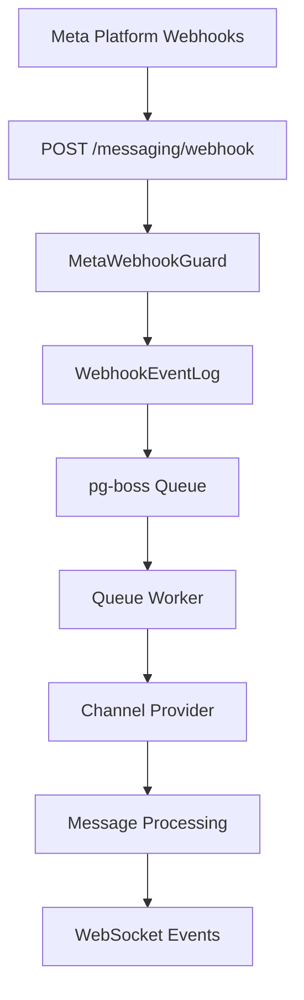

<Note>
**Last Updated:** 2026-04-15  
**Status:** Active
</Note>

## Overview

The Messaging module provides a unified, channel-agnostic messaging system for WhatsApp, Instagram, and Facebook Messenger. It replaces the separate per-channel modules with shared entities, a shared queue, and a single WebSocket namespace.

### Problem → Solution

| Problem | Solution |
| --- | --- |
| Duplicated logic across WhatsApp and Instagram modules | Single `MessagingModule` with channel providers |
| No webhook signature validation (security gap) | Shared `MetaWebhookGuard` validates `X-Hub-Signature-256` |
| Inconsistent WebSocket auth (Instagram gateway has no JWT) | Single `/messaging` gateway with JWT auth |
| No Facebook Messenger support | Third channel provider |
| Separate entity schemas per channel | Unified entities: `Conversation`, `Message`, `ChannelAccount` |
| No shared queue infrastructure | Shared `PgBossQueueService` for messaging + notifications |

### Key Design Decisions

<AccordionGroup>
<Accordion title="Queue Infrastructure">
**pg-boss over BullMQ** — Project already uses pg-boss for notifications. No new Redis dependency. Interface-based design (`IQueueService`) allows swapping later.
</Accordion>

<Accordion title="Conversation Architecture">
**Direct PersonChannel FK on Conversation** — Conversations link directly to the CRM's `PersonChannel` via FK. Simpler model, no bidirectional sync overhead. The lead FK was moved from Conversation to Lead (`Lead.sourceConversation`).
</Accordion>

<Accordion title="Archive System">
**Archive as boolean, not status** — `Conversation.isArchived` is orthogonal to `status` (OPEN/CLOSED), following `ARCHIVE_SYSTEM_SPECIFICATION.md`.
</Accordion>

<Accordion title="Assignment Model">
**`ConversationAssignment` entity** — Conversations use a dedicated `conversation_assignment` table instead of the CRM `entity_stakeholder` pattern. Each assignment is one row with nullable `user_id` and `team_id`.
</Accordion>

<Accordion title="Message Delivery">
**Transactional outbox** — Outbound messages use an outbox table written in the same DB transaction as the Message entity, guaranteeing at-least-once delivery.
</Accordion>

<Accordion title="AI Integration">
**Per-conversation AI mode with cascade** — Each conversation has an `aiMode` field (OFF, AUTO_REPLY, SUGGEST_ONLY, DRAFT). Default cascades: ChannelAccount.defaultAiMode → Organization default → OFF.
</Accordion>
</AccordionGroup>

## Architecture & Module Structure



### Module Structure

```
src/modules/meta-platform/    ← Top-level infra module, reused by Messaging + future Ads
  meta-platform.module.ts
  meta-graph-api.service.ts
  meta-api.error.ts
  meta-webhook.guard.ts
  meta-oauth.service.ts
  webhook-event-log.entity.ts

src/modules/queue/            ← Top-level infra module, reused by Messaging + Notifications + future Ads

src/modules/messaging/
  messaging.module.ts
  entities/               ← ChannelAccount, Conversation, Message, MessageTemplate, MessageOutbox, AutomationRule
  enums/                  ← Channel, MessageType, MessageStatus, MessageDirection, etc.
  services/               ← Core services + providers/
    providers/            ← WhatsApp, Instagram, Messenger providers
  controllers/            ← Webhook, Conversation, Message, Template, Inbox, ChannelAccount, AutomationRule, AiStatus
  gateways/               ← WebSocket gateway (/messaging namespace)
  queues/                 ← webhook-processor, message-sender, media-downloader
  dto/                    ← Request/response DTOs
  utils/                  ← permission.util.ts (personal account access control)
```

## Multi-Tenancy Patterns

The messaging module introduces unique multi-tenancy challenges because webhooks arrive without org context. See `Docs/MULTI_TENANCY.md` for the full RLS reference.

### Two-Step RLS Bypass (Webhook Processing)

<Warning>
The webhook controller receives events for ALL organizations from a single Meta App. Org context is unknown at arrival time.
</Warning>

```typescript
// Step 1: Find which org owns this account (bypass RLS)
const account = await this.tenantContext.executeReadOnlyWithBypass(async (em) => {
  return em.findOne(ChannelAccount, { externalAccountId: job.data.accountId });
});

// Step 2: Process within that org's context
await this.tenantContext.executeInOrg(
  account.organization.id,
  async (em) => {
    await this.processMessageInTransaction(em, job.data);
  },
  { userId: undefined },
); // system action, no user
```

### Composable `*InTransaction` Pattern

Services that participate in existing transactions expose `*InTransaction` methods. The webhook worker calls these within its `executeInOrg` callback:

```typescript
// Public API — wraps TenantContext
async matchOrCreate(channel, identifier, profileData, orgId): Promise<MatchResult>;

// Composable — accepts EntityManager from caller's transaction
async matchOrCreateInTransaction(em, channel, identifier, profileData, orgId): Promise<MatchResult>;
```

<Info>
The `em` parameter must always be the one provided by the TenantContext callback — never `this.em`.
</Info>

## Entities

### Core Entities

<Tabs>
<Tab title="ChannelAccount">
```typescript
@Entity('channel_account')
export class ChannelAccount {
  @PrimaryKey()
  id: number;

  @Enum(() => Channel)
  channel: Channel; // WHATSAPP, INSTAGRAM, MESSENGER

  @Property()
  externalAccountId: string; // Phone number or Page ID

  @Property({ nullable: true })
  pageId?: string; // Facebook Page ID for Instagram

  @Property()
  displayName: string;

  @Property({ nullable: true })
  profilePictureUrl?: string;

  @Property({ nullable: true })
  accessToken?: string; // Encrypted

  @Property({ nullable: true })
  accessTokenExpiresAt?: Date;

  @Enum(() => AiMode)
  defaultAiMode: AiMode;

  @Property({ type: 'boolean' })
  isPersonalAccount: boolean;

  @ManyToOne(() => User, { nullable: true })
  personalAccountOwner?: User;

  @ManyToOne(() => Organization)
  organization: Organization;
}
```
</Tab>

<Tab title="Conversation">
```typescript
@Entity('conversation')
export class Conversation {
  @PrimaryKey()
  id: number;

  @ManyToOne(() => ChannelAccount)
  channelAccount: ChannelAccount;

  @ManyToOne(() => PersonChannel)
  personChannel: PersonChannel;

  @Property({ nullable: true })
  contactId?: number; // Nullable FK to Contact

  @Enum(() => ConversationStatus)
  status: ConversationStatus; // OPEN, CLOSED

  @Property({ type: 'boolean', default: false })
  isArchived: boolean;

  @Enum(() => AiMode)
  aiMode: AiMode;

  @Property({ nullable: true })
  lastMessageAt?: Date;

  @Property({ nullable: true })
  lastAgentMessageAt?: Date;

  @OneToMany(() => Message, (m) => m.conversation)
  messages = new Collection<Message>(this);

  @OneToMany(() => ConversationAssignment, (a) => a.conversation)
  assignments = new Collection<ConversationAssignment>(this);
}
```
</Tab>

<Tab title="Message">
```typescript
@Entity('message')
export class Message {
  @PrimaryKey()
  id: number;

  @ManyToOne(() => Conversation)
  conversation: Conversation;

  @Property()
  externalMessageId: string; // Platform's message ID

  @Enum(() => MessageDirection)
  direction: MessageDirection; // INBOUND, OUTBOUND

  @Enum(() => MessageType)
  type: MessageType; // TEXT, MEDIA, TEMPLATE, etc.

  @Property({ nullable: true })
  text?: string;

  @Property({ type: 'json', nullable: true })
  mediaData?: MediaData;

  @Property({ type: 'json', nullable: true })
  templateData?: TemplateData;

  @Enum(() => MessageStatus)
  status: MessageStatus; // SENT, DELIVERED, READ, FAILED

  @Property({ nullable: true })
  errorMessage?: string;

  @ManyToOne(() => User, { nullable: true })
  sentByUser?: User; // Null for inbound messages

  @Property()
  createdAt: Date;

  @Property({ nullable: true })
  deliveredAt?: Date;

  @Property({ nullable: true })
  readAt?: Date;
}
```
</Tab>

<Tab title="ConversationAssignment">
```typescript
@Entity('conversation_assignment')
export class ConversationAssignment {
  @PrimaryKey()
  id: number;

  @ManyToOne(() => Conversation)
  conversation: Conversation;

  @ManyToOne(() => User, { nullable: true })
  user?: User; // Null for team pool assignments

  @ManyToOne(() => Team, { nullable: true })
  team?: Team; // Null for direct user assignments

  @Property({ type: 'boolean', default: true })
  canReply: boolean;

  @Property()
  assignedAt: Date;

  @ManyToOne(() => User)
  assignedBy: User;
}
```
</Tab>
</Tabs>

### Supporting Entities

<CardGroup cols={2}>
<Card title="MessageTemplate" icon="template">
Three types: `META_APPROVED`, `QUICK_REPLY`, `AI_PROMPT`
</Card>
<Card title="MessageOutbox" icon="paper-plane">
Transactional outbox for guaranteed delivery
</Card>
<Card title="AutomationRule" icon="robot">
Rule-based message automation
</Card>
<Card title="WebhookEventLog" icon="webhook">
Meta platform webhook event logging
</Card>
</CardGroup>

## Enums

### Core Enums

<CodeGroup>
```typescript Channel
export enum Channel {
  WHATSAPP = 'WHATSAPP',
  INSTAGRAM = 'INSTAGRAM',
  MESSENGER = 'MESSENGER',
}
```

```typescript MessageDirection
export enum MessageDirection {
  INBOUND = 'INBOUND',
  OUTBOUND = 'OUTBOUND',
}
```

```typescript MessageType
export enum MessageType {
  TEXT = 'TEXT',
  MEDIA = 'MEDIA',
  TEMPLATE = 'TEMPLATE',
  QUICK_REPLY = 'QUICK_REPLY',
  BUTTON_REPLY = 'BUTTON_REPLY',
  LIST_REPLY = 'LIST_REPLY',
  SYSTEM = 'SYSTEM',
}
```

```typescript MessageStatus
export enum MessageStatus {
  PENDING = 'PENDING',
  SENT = 'SENT',
  DELIVERED = 'DELIVERED',
  READ = 'READ',
  FAILED = 'FAILED',
}
```
</CodeGroup>

### Status and Mode Enums

<CodeGroup>
```typescript ConversationStatus
export enum ConversationStatus {
  OPEN = 'OPEN',
  CLOSED = 'CLOSED',
}
```

```typescript AiMode
export enum AiMode {
  OFF = 'OFF',
  AUTO_REPLY = 'AUTO_REPLY',
  SUGGEST_ONLY = 'SUGGEST_ONLY',
  DRAFT = 'DRAFT',
}
```

```typescript TemplateType
export enum TemplateType {
  META_APPROVED = 'META_APPROVED',
  QUICK_REPLY = 'QUICK_REPLY',
  AI_PROMPT = 'AI_PROMPT',
}
```
</CodeGroup>

## Message Flows

### Inbound Message Flow

<Steps>
<Step title="Webhook Reception">
Meta platform sends webhook to `POST /messaging/webhook`
- `MetaWebhookGuard` validates `X-Hub-Signature-256`
- Event persisted to `WebhookEventLog`
- Returns 200 immediately
- Enqueues to `webhook-processor` queue
</Step>

<Step title="Queue Processing">
Worker processes webhook event:
- Check idempotency using `externalEventId`
- Find organization via RLS bypass
- Execute processing within org context
</Step>

<Step title="Message Creation">
Within transaction:
- Route to appropriate channel provider
- Match/create `PersonChannel` and `Person`
- Find/create `Conversation`
- Create `Message` entity
- Update conversation metadata
</Step>

<Step title="Integrations">
- Create CRM Activity via bridge
- Update PersonChannel statistics
- Emit WebSocket events
- Trigger notification events
</Step>
</Steps>

### Outbound Message Flow

<Steps>
<Step title="API Request">
Agent sends message via `/conversations/{id}/messages` endpoint
</Step>

<Step title="Validation">
- Permission checks (can user reply to this conversation?)
- Message content validation
- Rate limiting checks
</Step>

<Step title="Transactional Write">
Within single transaction:
- Create `Message` entity
- Create `MessageOutbox` entry
- Update conversation `lastAgentMessageAt`
</Step>

<Step title="Async Processing">
- `message-sender` queue picks up outbox entry
- Channel provider sends to Meta platform
- Update message status based on response
- Clean up outbox entry on success
</Step>
</Steps>

## Business Rules

### Conversation Management

<Warning>
**Assignment Rules:**
- Multiple assignments per conversation are allowed
- `user + null` = direct assignment
- `user + team` = agent on behalf of team  
- `null + team` = team pool assignment
- Team members can only pick up from their team's pool
</Warning>

### AI Mode Cascading

The AI mode for new conversations follows this cascade:

```
Conversation.aiMode = ChannelAccount.defaultAiMode 
                   ?? Organization.defaultAiMode 
                   ?? AiMode.OFF
```

### Message Templates

<Info>
**Template Types:**
- **META_APPROVED**: Platform-approved message templates
- **QUICK_REPLY**: Agent shortcuts with variable resolution  
- **AI_PROMPT**: AI system prompts with optional SystemPrompt link
</Info>

### Personal Account Rules

<Check>
Personal account access is restricted to the account owner and users with `MESSAGING_MANAGE` permission.
</Check>

## RBAC Permissions & Access Control

### Core Permissions

| Permission | Scope | Description |
|------------|-------|-------------|
| `messaging.manage` | Organization | Full messaging access |
| `messaging.write` | Organization | View and reply to conversations |
| `messaging.read` | Organization | View-only access |
| `team_messaging.manage` | Team | Manage team messaging assignments |

### Resource-Level Permissions

Conversations return `ResourcePermissionsDto` with granular permissions:

<CodeGroup>
```typescript Permission Calculation
export class ConversationPermissionService {
  computePermissions(conversation: Conversation, user: User): ResourcePermissionsDto {
    // MESSAGING_MANAGE → full access
    if (user.hasPermission('messaging.manage')) {
      return this.fullAccess();
    }
    
    // Personal account owner
    if (conversation.channelAccount.isPersonalAccount && 
        conversation.channelAccount.personalAccountOwner?.id === user.id) {
      return { canView: true, canReply: true, canAssign: false };
    }
    
    // Check assignments and team permissions
    // ...
  }
}
```

```typescript Permission Flags
interface ResourcePermissionsDto {
  canView: boolean;
  canEdit: boolean;      // false for non-managers
  canReply: boolean;     // based on assignment
  canTransfer: boolean;  // requires MESSAGING_MANAGE
  canArchive: boolean;   // requires MESSAGING_MANAGE
  canAssign: boolean;    // team managers for their teams
}
```
</CodeGroup>

## API Endpoints

### Conversation Endpoints

<CodeGroup>
```http GET /conversations
GET /api/conversations?status=OPEN&assignedToMe=true&channel=WHATSAPP

Response:
{
  "data": [
    {
      "id": 123,
      "status": "OPEN",
      "isArchived": false,
      "channelAccount": { "channel": "WHATSAPP", "displayName": "+1234567890" },
      "personChannel": { "identifier": "+1987654321", "displayName": "John Doe" },
      "lastMessage": { "text": "Hello", "createdAt": "2024-01-15T10:30:00Z" },
      "unreadCount": 2,
      "permissions": { "canView": true, "canReply": true }
    }
  ],
  "pagination": { "page": 1, "limit": 20, "total": 45 }
}
```

```http GET /conversations/{id}
GET /api/conversations/123

Response:
{
  "id": 123,
  "status": "OPEN",
  "channelAccount": { "id": 1, "channel": "WHATSAPP" },
  "personChannel": { "id": 5, "identifier": "+1987654321" },
  "assignments": [
    { "user": { "id": 10, "name": "Agent Smith" }, "canReply": true }
  ],
  "permissions": { "canView": true, "canReply": true, "canAssign": false }
}
```

```http POST /conversations/{id}/messages
POST /api/conversations/123/messages
{
  "type": "TEXT",
  "text": "Hello, how can I help you today?"
}

Response:
{
  "id": 456,
  "type": "TEXT",
  "text": "Hello, how can I help you today?",
  "direction": "OUTBOUND",
  "status": "PENDING",
  "createdAt": "2024-01-15T10:35:00Z"
}
```
</CodeGroup>

### Channel Account Endpoints

<CodeGroup>
```http GET /channel-accounts
GET /api/channel-accounts?channel=WHATSAPP

Response:
{
  "data": [
    {
      "id": 1,
      "channel": "WHATSAPP",
      "displayName": "+1234567890",
      "isPersonalAccount": false,
      "defaultAiMode": "SUGGEST_ONLY",
      "isConnected": true
    }
  ]
}
```

```http POST /channel-accounts/connect-with-code
POST /api/channel-accounts/connect-with-code
{
  "code": "oauth_code_from_meta",
  "state": "encrypted_state_token"
}

Response:
{
  "account": {
    "id": 2,
    "channel": "INSTAGRAM", 
    "displayName": "@business_account",
    "isConnected": true
  }
}
```
</CodeGroup>

### Template Endpoints

<CodeGroup>
```http GET /message-templates
GET /api/message-templates?type=QUICK_REPLY

Response:
{
  "data": [
    {
      "id": 1,
      "name": "Welcome Message",
      "type": "QUICK_REPLY", 
      "content": "Hello {{customer.name}}, welcome to our service!",
      "variables": ["customer.name"]
    }
  ]
}
```

```http POST /message-templates
POST /api/message-templates
{
  "name": "Follow Up",
  "type": "QUICK_REPLY",
  "content": "Hi {{customer.name}}, just following up on your inquiry about {{product}}.",
  "variables": ["customer.name", "product"]
}
```
</CodeGroup>

## WebSocket Events & Room Architecture

### Room Structure

The messaging WebSocket gateway (`/messaging` namespace) uses a hierarchical room structure:

<CodeGroup>
```typescript Room Patterns
// Organization-wide messaging events
`org:${orgId}:messaging`

// Specific conversation events  
`org:${orgId}:conversation:${conversationId}`

// User-specific events (assignments, notifications)
`org:${orgId}:user:${userId}:messaging`

// Team-specific events
`org:${orgId}:team:${teamId}:messaging`
```

```typescript Client Connection
// Client joins appropriate rooms on connect
socket.join(`org:${user.organizationId}:messaging`);
socket.join(`org:${user.organizationId}:user:${user.id}:messaging`);

// Join team rooms
user.teams.forEach(team => {
  socket.join(`org:${user.organizationId}:team:${team.id}:messaging`);
});
```
</CodeGroup>

### Event Types

<Tabs>
<Tab title="Message Events">
```typescript
// New message received
{
  event: 'message-received',
  data: {
    conversationId: 123,
    message: MessageDto,
    conversation: ConversationSummaryDto
  }
}

// Message status updated
{
  event: 'message-status-updated', 
  data: {
    messageId: 456,
    status: 'DELIVERED',
    updatedAt: '2024-01-15T10:35:00Z'
  }
}
```
</Tab>

<Tab title="Conversation Events">
```typescript
// Conversation updated (status, assignment, etc.)
{
  event: 'conversation-updated',
  data: {
    conversationId: 123,
    changes: {
      status: 'CLOSED',
      assignments: [AssignmentDto]
    },
    conversation: ConversationDto
  }
}

// New conversation created
{
  event: 'conversation-created',
  data: {
    conversation: ConversationDto
  }
}
```
</Tab>

<Tab title="Assignment Events">
```typescript
// Conversation assigned
{
  event: 'conversation-assigned',
  data: {
    conversationId: 123,
    assignment: {
      user: UserDto,
      team: TeamDto,
      assignedBy: UserDto
    }
  }
}

// Assignment removed
{
  event: 'conversation-unassigned',
  data: {
    conversationId: 123,
    removedAssignment: AssignmentDto
  }
}
```
</Tab>
</Tabs>

### Event Broadcasting Rules

<Info>
**Broadcasting Logic:**
- Message events → conversation room + org room  
- Assignment events → assigned user/team rooms + conversation room
- Status changes → conversation room only
- New conversations → org room + relevant team rooms (based on routing rules)
</Info>

## Query Patterns

### Conversation Queries

<CodeGroup>
```typescript Inbox Query
// Main inbox with filters
const conversations = await em.find(Conversation, {
  channelAccount: { organization: user.organizationId },
  isArchived: false,
  ...(filters.assignedToMe && {
    assignments: { user: user.id }
  }),
  ...(filters.status && { status: filters.status }),
  ...(filters.channel && { 
    channelAccount: { channel: filters.channel }
  })
}, {
  populate: ['channelAccount', 'personChannel', 'assignments.user', 'assignments.team'],
  orderBy: { lastMessageAt: 'DESC' },
  limit: filters.limit,
  offset: filters.offset
});
```

```typescript Message History
// Messages for conversation with pagination
const messages = await em.find(Message, {
  conversation: conversationId
}, {
  populate: ['sentByUser'],
  orderBy: { createdAt: 'ASC' },
  limit: 50,
  offset: (page - 1) * 50
});
```

```typescript Assignment Lookup
// Check user's conversation assignments
const assignments = await em.find(ConversationAssignment, {
  conversation: conversationId,
  $or: [
    { user: userId },
    { team: { $in: userTeamIds } }
  ]
});
```
</CodeGroup>

### Performance Optimizations

<Warning>
**Index Requirements:**
- `conversation(channel_account_id, is_archived, last_message_at)`
- `message(conversation_id, created_at)`  
- `conversation_assignment(conversation_id, user_id)`
- `conversation_assignment(conversation_id, team_id)`
</Warning>

## Error Handling & Retry Strategy

### Webhook Processing

<Steps>
<Step title="Immediate Response">
Always return 200 to Meta platform, even on processing errors
</Step>

<Step title="Retry Logic">
pg-boss handles retries with exponential backoff:
- Max attempts: 5
- Backoff: 2^attempt seconds
- Dead letter queue after max attempts
</Step>

<Step title="Error Categories">
- **Retriable**: Network errors, temporary API failures
- **Non-retriable**: Invalid webhook signature, malformed payload
- **Business logic**: Logged but not retried (duplicate events, etc.)
</Step>
</Steps>

### Message Sending

<CodeGroup>
```typescript Retry Configuration
{
  name: 'message-sender',
  retryLimit: 3,
  retryDelay: 5,
  retryBackoff: true,
  expireInMinutes: 60
}
```

```typescript Error Handling
try {
  const response = await this.metaGraphApi.sendMessage(payload);
  await this.updateMessageStatus(messageId, 'SENT');
} catch (error) {
  if (error.isRetriable) {
    throw error; // Let pg-boss retry
  } else {
    await this.updateMessageStatus(messageId, 'FAILED', error.message);
  }
}
```
</CodeGroup>

## Testing Strategy

### Integration Tests

<Tabs>
<Tab title="Webhook Tests">
```typescript
describe('Webhook Processing', () => {
  it('should process WhatsApp text message', async () => {
    // Mock webhook payload
    const payload = createWhatsAppTextMessage();
    
    // Send to webhook endpoint
    await request(app)
      .post('/messaging/webhook')
      .set('X-Hub-Signature-256', generateSignature(payload))
      .send(payload)
      .expect(200);
    
    // Wait for queue processing
    await waitForQueue('webhook-processor');
    
    // Verify message created
    const message = await em.findOne(Message, { externalMessageId: payload.entry[0].changes[0].value.messages[0].id });
    expect(message).toBeDefined();
    expect(message.text).toBe(payload.entry[0].changes[0].value.messages[0].text.body);
  });
});
```
</Tab>

<Tab title="Permission Tests">
```typescript
describe('Conversation Permissions', () => {
  it('should allow assigned agent to reply', async () => {
    const conversation = await createConversation({
      assignments: [{ user: agent, canReply: true }]
    });
    
    const response = await request(app)
      .post(`/conversations/${conversation.id}/messages`)
      .auth(agent.token)
      .send({ type: 'TEXT', text: 'Hello' })
      .expect(201);
    
    expect(response.body.direction).toBe('OUTBOUND');
  });
  
  it('should deny non-assigned user', async () => {
    const conversation = await createConversation();
    
    await request(app)
      .post(`/conversations/${conversation.id}/messages`)
      .auth(otherAgent.token)
      .send({ type: 'TEXT', text: 'Hello' })
      .expect(403);
  });
});
```
</Tab>

<Tab title="WebSocket Tests">
```typescript
describe('WebSocket Events', () => {
  it('should broadcast message to conversation room', async () => {
    const client = await connectWebSocket(agent.token);
    
    // Join conversation room
    client.emit('join-conversation', { conversationId: 123 });
    
    // Send message via API
    await request(app)
      .post('/conversations/123/messages')
      .auth(agent.token)
      .send({ type: 'TEXT', text: 'Test' });
    
    // Verify WebSocket event received
    const event = await waitForEvent(client, 'message-received');
    expect(event.data.message.text).toBe('Test');
  });
});
```
</Tab>
</Tabs>

### Unit Tests

Focus on business logic isolation:
- Permission calculations
- Message routing logic  
- Template variable resolution
- AI mode cascading

## Deployment Considerations

### Database Migrations

<Warning>
**Migration Order:**
1. Create new messaging tables
2. Migrate existing WhatsApp/Instagram data
3. Update foreign key references
4. Drop old tables
5. Remove old modules
</Warning>

### Queue Management

<Info>
Monitor pg-boss queue health:
- Dead letter queue size
- Average processing time
- Failed job patterns
- Queue depth by job type
</Info>

### WebSocket Scaling

For horizontal scaling, consider:
- Redis adapter for socket.io clustering
- Sticky sessions or connection routing
- Room management across instances

## Known Gaps & Technical Debt

<CardGroup cols={2}>
<Card title="Media Handling" icon="image">
File uploads/downloads need optimization and CDN integration
</Card>
<Card title="Message Search" icon="magnifying-glass">
Full-text search across conversation history not implemented
</Card>
<Card title="Typing Indicators" icon="keyboard">
Real-time typing status not supported
</Card>
<Card title="Message Reactions" icon="heart">
Platform message reactions not captured
</Card>
</CardGroup>

## Future Phases

### Phase 2: Enhanced AI
- Conversation summarization
- Sentiment analysis
- Smart suggested replies
- Auto-categorization

### Phase 3: Advanced Features
- Message scheduling
- Bulk messaging campaigns  
- Advanced automation workflows
- Analytics dashboard

### Phase 4: Additional Channels
- SMS integration
- Telegram support
- Email messaging
- Custom channel SDK

---

<Check>
This specification provides the complete foundation for the unified messaging system. For implementation details, refer to the individual service and controller files in the codebase.
</Check>