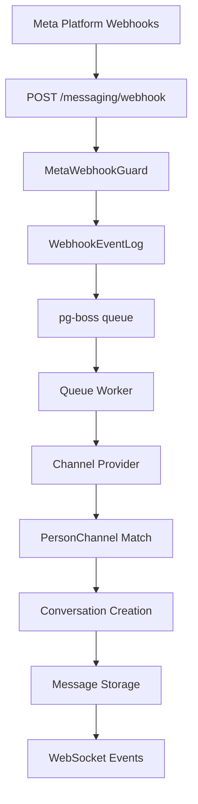

<Note>
**Last Updated:** 2026-04-15  
**Status:** Active
</Note>

## Overview

The Messaging module provides a unified, channel-agnostic messaging system for WhatsApp, Instagram, and Facebook Messenger. It replaces the separate per-channel modules with shared entities, a shared queue, and a single WebSocket namespace.

### Problem → Solution

<CardGroup cols={2}>
  <Card title="Duplicated Logic" icon="copy">
    **Before:** Separate WhatsApp and Instagram modules  
    **After:** Single `MessagingModule` with channel providers
  </Card>
  
  <Card title="Security Gap" icon="shield-check">
    **Before:** No webhook signature validation  
    **After:** Shared `MetaWebhookGuard` validates `X-Hub-Signature-256`
  </Card>
  
  <Card title="Inconsistent WebSocket Auth" icon="wifi">
    **Before:** Instagram gateway has no JWT  
    **After:** Single `/messaging` gateway with JWT auth
  </Card>
  
  <Card title="Missing Platform Support" icon="facebook">
    **Before:** No Facebook Messenger support  
    **After:** Third channel provider added
  </Card>
</CardGroup>

### Key Design Decisions

<AccordionGroup>
  <Accordion title="1. pg-boss over BullMQ">
    Project already uses pg-boss for notifications. No new Redis dependency. Interface-based design (`IQueueService`) allows swapping later.
  </Accordion>
  
  <Accordion title="2. Direct PersonChannel FK on Conversation">
    Conversations link directly to the CRM's `PersonChannel` via FK. Simpler model, no bidirectional sync overhead. The lead FK was moved from Conversation to Lead (`Lead.sourceConversation`).
  </Accordion>
  
  <Accordion title="3. Archive as boolean, not status">
    `Conversation.isArchived` is orthogonal to `status` (OPEN/CLOSED), following `ARCHIVE_SYSTEM_SPECIFICATION.md`.
  </Accordion>
  
  <Accordion title="4. ConversationAssignment entity">
    Conversations use a dedicated `conversation_assignment` table instead of the CRM `entity_stakeholder` pattern. Each assignment is one row with nullable `user_id` and `team_id`.
  </Accordion>
  
  <Accordion title="5. Transactional outbox">
    Outbound messages use an outbox table written in the same DB transaction as the Message entity, guaranteeing at-least-once delivery.
  </Accordion>
</AccordionGroup>

## Architecture & Module Structure



### Module Structure

```
src/modules/meta-platform/    ← Top-level infra module
  meta-platform.module.ts
  meta-graph-api.service.ts
  meta-webhook.guard.ts
  webhook-event-log.entity.ts

src/modules/messaging/
  messaging.module.ts
  entities/               ← Core entities
  enums/                  ← Channel, MessageType, etc.
  services/               ← Core services + providers/
    providers/            ← WhatsApp, Instagram, Messenger
  controllers/            ← API endpoints
  gateways/               ← WebSocket gateway
  queues/                 ← Workers
  dto/                    ← Request/response DTOs
```

## Multi-Tenancy Patterns

<Warning>
The messaging module introduces unique multi-tenancy challenges because webhooks arrive without org context.
</Warning>

### Two-Step RLS Bypass (Webhook Processing)

The webhook controller receives events for ALL organizations from a single Meta App. Org context is unknown at arrival time.

<CodeGroup>
```typescript Step 1: Find Organization
// Bypass RLS to find which org owns this account
const account = await this.tenantContext.executeReadOnlyWithBypass(async (em) => {
  return em.findOne(ChannelAccount, { externalAccountId: job.data.accountId });
});
```

```typescript Step 2: Process in Context
// Process within that org's context
await this.tenantContext.executeInOrg(
  account.organization.id,
  async (em) => {
    await this.processMessageInTransaction(em, job.data);
  },
  { userId: undefined }, // system action
);
```
</CodeGroup>

### Composable `*InTransaction` Pattern

Services that participate in existing transactions expose `*InTransaction` methods:

```typescript
// Public API — wraps TenantContext
async matchOrCreate(channel, identifier, profileData, orgId): Promise<MatchResult>;

// Composable — accepts EntityManager from caller's transaction
async matchOrCreateInTransaction(em, channel, identifier, profileData, orgId): Promise<MatchResult>;
```

<Note>
The `em` parameter must always be the one provided by the TenantContext callback — never `this.em`.
</Note>

## Entities

### Core Entities

<Tabs>
  <Tab title="ChannelAccount">
    ```typescript
    @Entity()
    export class ChannelAccount {
      @PrimaryKey()
      id: string;

      @Enum(() => Channel)
      channel: Channel;

      @Property()
      externalAccountId: string; // Phone number, IG ID, Page ID

      @Property({ nullable: true })
      pageId?: string; // Facebook Page ID for IG outbound

      @Property()
      accessToken: string; // Encrypted

      @Enum(() => AccountLevel)
      level: AccountLevel; // PERSONAL | ORGANIZATION

      @Enum(() => AiMode)
      defaultAiMode: AiMode;

      @ManyToOne(() => Organization)
      organization: Organization;

      @ManyToOne(() => User, { nullable: true })
      personalAccountOwner?: User; // For PERSONAL level only
    }
    ```
  </Tab>
  
  <Tab title="Conversation">
    ```typescript
    @Entity()
    export class Conversation {
      @PrimaryKey()
      id: string;

      @ManyToOne(() => ChannelAccount)
      channelAccount: ChannelAccount;

      @ManyToOne(() => PersonChannel)
      personChannel: PersonChannel;

      @Property({ nullable: true })
      contactId?: string; // CRM Contact ID

      @Enum(() => ConversationStatus)
      status: ConversationStatus; // OPEN | CLOSED

      @Property()
      isArchived: boolean = false;

      @Enum(() => AiMode)
      aiMode: AiMode;

      @Property({ nullable: true })
      lastMessageAt?: Date;

      @Property()
      unreadCount: number = 0;
    }
    ```
  </Tab>
  
  <Tab title="Message">
    ```typescript
    @Entity()
    export class Message {
      @PrimaryKey()
      id: string;

      @ManyToOne(() => Conversation)
      conversation: Conversation;

      @Enum(() => MessageDirection)
      direction: MessageDirection; // INBOUND | OUTBOUND

      @Enum(() => MessageType)
      type: MessageType; // TEXT | MEDIA | TEMPLATE | etc.

      @Property({ type: 'text' })
      content: string;

      @Property({ type: 'jsonb', nullable: true })
      metadata?: MessageMetadata;

      @Enum(() => MessageStatus)
      status: MessageStatus; // PENDING | SENT | DELIVERED | etc.

      @Property({ nullable: true })
      externalMessageId?: string; // Platform message ID

      @Property()
      createdAt: Date = new Date();
    }
    ```
  </Tab>
</Tabs>

## Message Flows

### Inbound Message Flow

<Steps>
  <Step title="Webhook Reception">
    Meta platform sends webhook to `/messaging/webhook` with `X-Hub-Signature-256` header
  </Step>
  
  <Step title="Signature Validation">
    `MetaWebhookGuard` validates signature using `META_APP_SECRET`
  </Step>
  
  <Step title="Event Logging">
    Create `WebhookEventLog` entry and enqueue to `webhook-processor`
  </Step>
  
  <Step title="Queue Processing">
    Worker finds organization, processes in tenant context:
    - Route to channel provider
    - Match/create PersonChannel and Person
    - Find/create Conversation
    - Create Message
    - Emit events
  </Step>
</Steps>

### Outbound Message Flow

<Steps>
  <Step title="Message Creation">
    API creates `Message` and `MessageOutbox` entries in same transaction
  </Step>
  
  <Step title="Queue Processing">
    `message-sender` worker processes outbox entry
  </Step>
  
  <Step title="Platform Delivery">
    Send via Meta Graph API using channel-specific provider
  </Step>
  
  <Step title="Status Update">
    Update message status, delete outbox entry on success
  </Step>
</Steps>

## Business Rules

### AI Mode Cascade

<Info>
AI mode cascades from most specific to least specific configuration:
</Info>

1. **Conversation.aiMode** (if explicitly set)
2. **ChannelAccount.defaultAiMode** 
3. **Organization default**
4. **System default** (OFF)

### Assignment Rules

<CardGroup cols={2}>
  <Card title="Direct Assignment" icon="user">
    `user_id` present, `team_id` null  
    Agent directly assigned to conversation
  </Card>
  
  <Card title="Team Pool" icon="users">
    `user_id` null, `team_id` present  
    Available to any team member
  </Card>
  
  <Card title="Team + Agent" icon="user-group">
    Both `user_id` and `team_id` present  
    Agent working on behalf of team
  </Card>
  
  <Card title="Multiple Assignments" icon="copy">
    Multiple rows allowed  
    e.g., Direct agent + Team pool
  </Card>
</CardGroup>

## RBAC Permissions & Access Control

### Permission Levels

<Tabs>
  <Tab title="MESSAGING_MANAGE">
    - Full conversation access (`fullAccess()`)
    - Can transfer, archive, edit
    - Can manage team assignments
  </Tab>
  
  <Tab title="MESSAGING_WRITE">
    - Can view and reply (`canView + canReply`)
    - Can change AI mode, close/reopen
    - Cannot transfer or archive
  </Tab>
  
  <Tab title="Personal Account Owner">
    - Can view and reply to own account conversations
    - Cannot manage team assignments
  </Tab>
  
  <Tab title="Assigned Agent">
    - Can view conversation
    - Can reply based on assignment `canReply` flag
  </Tab>
</Tabs>

### ResourcePermissionsDto

Conversations return per-resource permissions following the CRM pattern:

```typescript
interface ConversationPermissions {
  canView: boolean;
  canReply: boolean;
  canEdit: boolean;      // Requires MESSAGING_MANAGE
  canTransfer: boolean;  // Requires MESSAGING_MANAGE
  canArchive: boolean;   // Requires MESSAGING_MANAGE
  canAssign: boolean;    // Team managers with pool assignment
}
```

## API Endpoints

### Core Endpoints

<AccordionGroup>
  <Accordion title="Conversations">
    - `GET /conversations` - List conversations with filters
    - `GET /conversations/:id` - Get conversation details
    - `POST /conversations/:id/messages` - Send message
    - `PATCH /conversations/:id/archive` - Archive/unarchive
    - `POST /conversations/:id/assign` - Assign to user/team
  </Accordion>
  
  <Accordion title="Channel Accounts">
    - `GET /channel-accounts` - List accounts
    - `POST /channel-accounts/connect` - OAuth initiation
    - `POST /channel-accounts/connect/:tempToken` - Complete OAuth
    - `DELETE /channel-accounts/:id` - Disconnect account
  </Accordion>
  
  <Accordion title="Templates">
    - `GET /templates` - List message templates
    - `POST /templates` - Create template
    - `GET /templates/meta-approved` - Get platform templates
  </Accordion>
  
  <Accordion title="Webhooks">
    - `POST /webhook` - Meta platform webhook receiver
    - `GET /webhook` - Webhook verification
  </Accordion>
</AccordionGroup>

## WebSocket Events & Room Architecture

### Room Structure

<CodeGroup>
```typescript Organization Rooms
`org:${orgId}` // All org users
```

```typescript Conversation Rooms  
`conversation:${conversationId}` // Participants only
```

```typescript User Rooms
`user:${userId}` // Personal notifications
```
</CodeGroup>

### Event Types

<Tabs>
  <Tab title="conversation-created">
    ```typescript
    {
      type: 'conversation-created',
      conversationId: string,
      conversation: ConversationDetailDto
    }
    ```
  </Tab>
  
  <Tab title="message-received">
    ```typescript
    {
      type: 'message-received',
      conversationId: string,
      message: MessageDto
    }
    ```
  </Tab>
  
  <Tab title="conversation-updated">
    ```typescript
    {
      type: 'conversation-updated', 
      conversationId: string,
      updates: Partial<ConversationDto>
    }
    ```
  </Tab>
  
  <Tab title="typing-indicator">
    ```typescript
    {
      type: 'typing-indicator',
      conversationId: string,
      isTyping: boolean,
      userId?: string
    }
    ```
  </Tab>
</Tabs>

## Error Handling & Retry Strategy

### Webhook Processing

<Warning>
Failed webhook processing uses exponential backoff with circuit breaker pattern.
</Warning>

<Steps>
  <Step title="Initial Processing">
    Attempt immediate processing with 30s timeout
  </Step>
  
  <Step title="First Retry">
    5 minute delay for temporary failures
  </Step>
  
  <Step title="Subsequent Retries">
    Exponential backoff: 15min, 45min, 2hr, 6hr
  </Step>
  
  <Step title="Dead Letter">
    After 5 failures, move to dead letter queue for manual review
  </Step>
</Steps>

### Message Delivery

Outbound messages follow similar retry logic with platform-specific error handling:

<CodeGroup>
```typescript Rate Limiting
// WhatsApp: 1000 messages/second
// Instagram: 100 messages/second  
// Messenger: 200 messages/second
```

```typescript Error Categories
TEMPORARY: // Network, rate limit → retry
PERMANENT: // Invalid token → fail immediately  
UNKNOWN: // Treat as temporary initially
```
</CodeGroup>

## Deployment Considerations

### Database Migrations

<Tip>
The unified messaging schema requires careful migration from existing WhatsApp/Instagram modules.
</Tip>

Migration order:
1. Create new messaging entities
2. Migrate WhatsApp conversations → Conversation
3. Migrate Instagram conversations → Conversation  
4. Update PersonChannel relationships
5. Remove legacy tables

### Queue Scaling

<Info>
pg-boss queues can be scaled horizontally by running multiple worker processes.
</Info>

Recommended worker distribution:
- **webhook-processor**: 2-4 workers (I/O bound)
- **message-sender**: 1-2 workers per channel (rate limited)
- **media-downloader**: 2-3 workers (network bound)

### Monitoring

Key metrics to monitor:
- Webhook processing latency
- Message delivery success rate
- Queue depth and processing rate
- WebSocket connection count
- Failed authentication attempts

## Testing Strategy

### Unit Testing

<CodeGroup>
```typescript Entity Tests
// Test entity relationships and validation
describe('Conversation Entity', () => {
  it('should cascade AI mode from channel account');
  it('should validate assignment constraints');
});
```

```typescript Service Tests  
// Mock dependencies, test business logic
describe('ConversationService', () => {
  it('should match existing conversation by person channel');
  it('should create new conversation with defaults');
});
```
</CodeGroup>

### Integration Testing

<Tabs>
  <Tab title="Webhook Flow">
    Test complete webhook processing flow with real Meta payloads
  </Tab>
  
  <Tab title="Message Delivery">
    Test outbound message flow with mocked Graph API
  </Tab>
  
  <Tab title="WebSocket Events">
    Verify real-time event delivery to correct rooms
  </Tab>
  
  <Tab title="Multi-tenancy">
    Test RLS bypass and tenant context switching
  </Tab>
</Tabs>

## Known Gaps & Technical Debt

<Warning>
These items require attention in future iterations:
</Warning>

1. **Message search indexing** - No full-text search on message content
2. **Bulk message operations** - No broadcast or bulk reply capabilities  
3. **Message reactions** - Instagram/Messenger reactions not supported
4. **Rich media validation** - Limited file type and size validation
5. **Conversation merging** - No ability to merge duplicate conversations
6. **Analytics integration** - No message volume or response time metrics

## Module Dependencies

### Required Modules

<CardGroup cols={2}>
  <Card title="CRM Module" icon="address-book">
    - Person and PersonChannel entities
    - Lead creation and updates
    - Activity logging
  </Card>
  
  <Card title="Team Module" icon="users">
    - Team assignments
    - Permission inheritance
    - User team membership
  </Card>
  
  <Card title="Notification Module" icon="bell">
    - Event emission
    - Queue infrastructure (pg-boss)
    - User preferences
  </Card>
  
  <Card title="File Module" icon="file">
    - Media upload and storage
    - File type validation
    - URL generation
  </Card>
</CardGroup>

### Integration Points

The messaging module integrates with existing systems through well-defined interfaces:

- **CRM Bridge**: Creates activities and updates lead status
- **Queue Service**: Shared pg-boss infrastructure
- **File Service**: Media handling and storage
- **Audit Service**: Change tracking (excluding high-volume tables)

<Check>
All integration points use dependency injection and can be mocked for testing.
</Check>

This comprehensive specification serves as the definitive guide for implementing and maintaining the unified messaging module. For implementation details, refer to the individual service and entity files in the codebase.