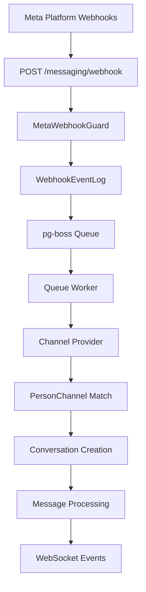

<Note>
  **Last Updated:** 2026-04-15  
  **Status:** Active
</Note>

The Messaging module provides a unified, channel-agnostic messaging system for WhatsApp, Instagram, and Facebook Messenger. It replaces the separate per-channel modules with shared entities, a shared queue, and a single WebSocket namespace.

## Overview

### Problem → Solution

| Problem | Solution |
|---------|----------|
| Duplicated logic across WhatsApp and Instagram modules | Single `MessagingModule` with channel providers |
| No webhook signature validation (security gap) | Shared `MetaWebhookGuard` validates `X-Hub-Signature-256` |
| Inconsistent WebSocket auth (Instagram gateway has no JWT) | Single `/messaging` gateway with JWT auth |
| No Facebook Messenger support | Third channel provider |
| Separate entity schemas per channel | Unified entities: `Conversation`, `Message`, `ChannelAccount` |
| No shared queue infrastructure | Shared `PgBossQueueService` for messaging + notifications |

### Key Design Decisions

<AccordionGroup>
  <Accordion title="pg-boss over BullMQ">
    Project already uses pg-boss for notifications. No new Redis dependency. Interface-based design (`IQueueService`) allows swapping later.
  </Accordion>
  
  <Accordion title="Direct PersonChannel FK on Conversation">
    Conversations link directly to the CRM's `PersonChannel` via FK. Simpler model, no bidirectional sync overhead. The lead FK was moved from Conversation to Lead (`Lead.sourceConversation`).
  </Accordion>
  
  <Accordion title="Archive as boolean, not status">
    `Conversation.isArchived` is orthogonal to `status` (OPEN/CLOSED), following `ARCHIVE_SYSTEM_SPECIFICATION.md`.
  </Accordion>
  
  <Accordion title="ConversationAssignment entity">
    Conversations use a dedicated `conversation_assignment` table instead of the CRM `entity_stakeholder` pattern. Each assignment is one row with nullable `user_id` and `team_id`.
  </Accordion>
  
  <Accordion title="Transactional outbox">
    Outbound messages use an outbox table written in the same DB transaction as the Message entity, guaranteeing at-least-once delivery.
  </Accordion>
</AccordionGroup>

## Architecture & Module Structure



### Module Structure

```
src/modules/meta-platform/    ← Top-level infra module
  meta-platform.module.ts
  meta-graph-api.service.ts
  meta-api.error.ts
  meta-webhook.guard.ts
  meta-oauth.service.ts
  webhook-event-log.entity.ts

src/modules/queue/            ← Top-level infra module

src/modules/messaging/
  messaging.module.ts
  entities/               ← ChannelAccount, Conversation, Message
  enums/                  ← Channel, MessageType, MessageStatus
  services/               ← Core services + providers/
    providers/            ← WhatsApp, Instagram, Messenger providers
  controllers/            ← Webhook, Conversation, Message controllers
  gateways/               ← WebSocket gateway (/messaging namespace)
  queues/                 ← webhook-processor, message-sender
  dto/                    ← Request/response DTOs
```

## Multi-Tenancy Patterns

<Warning>
The messaging module introduces unique multi-tenancy challenges because webhooks arrive without org context.
</Warning>

### Two-Step RLS Bypass (Webhook Processing)

The webhook controller receives events for ALL organizations from a single Meta App. Org context is unknown at arrival time.

<Steps>
  <Step title="Find Organization">
    ```typescript
    // Step 1: Find which org owns this account (bypass RLS)
    const account = await this.tenantContext.executeReadOnlyWithBypass(async (em) => {
      return em.findOne(ChannelAccount, { externalAccountId: job.data.accountId });
    });
    ```
  </Step>
  
  <Step title="Process Within Org Context">
    ```typescript
    // Step 2: Process within that org's context
    await this.tenantContext.executeInOrg(
      account.organization.id,
      async (em) => {
        await this.processMessageInTransaction(em, job.data);
      },
      { userId: undefined }, // system action, no user
    );
    ```
  </Step>
</Steps>

### Composable `*InTransaction` Pattern

Services that participate in existing transactions expose `*InTransaction` methods:

```typescript
// Public API — wraps TenantContext
async matchOrCreate(channel, identifier, profileData, orgId): Promise<MatchResult>;

// Composable — accepts EntityManager from caller's transaction
async matchOrCreateInTransaction(em, channel, identifier, profileData, orgId): Promise<MatchResult>;
```

<Note>
The `em` parameter must always be the one provided by the TenantContext callback — never `this.em`.
</Note>

## Entities

### Core Entities

<Tabs>
  <Tab title="ChannelAccount">
    ```typescript
    @Entity()
    export class ChannelAccount {
      @PrimaryKey()
      id: string;
      
      @ManyToOne(() => Organization)
      organization: Ref<Organization>;
      
      @Enum(() => Channel)
      channel: Channel;
      
      @Property()
      externalAccountId: string; // WA Business Account ID, IG Business Account ID, FB Page ID
      
      @Property({ nullable: true })
      pageId?: string; // Facebook Page ID for Instagram Send API
      
      @Property()
      displayName: string;
      
      @Property()
      isActive: boolean = true;
      
      @Enum(() => AiMode)
      defaultAiMode: AiMode = AiMode.OFF;
      
      @Property({ nullable: true })
      level?: AccountLevel; // personal | organization
    }
    ```
  </Tab>
  
  <Tab title="Conversation">
    ```typescript
    @Entity()
    export class Conversation {
      @PrimaryKey()
      id: string;
      
      @ManyToOne(() => ChannelAccount)
      channelAccount: Ref<ChannelAccount>;
      
      @ManyToOne(() => PersonChannel)
      personChannel: Ref<PersonChannel>;
      
      @Property({ nullable: true })
      contactId?: string; // FK to CRM Contact
      
      @Enum(() => ConversationStatus)
      status: ConversationStatus = ConversationStatus.OPEN;
      
      @Property()
      isArchived: boolean = false;
      
      @Enum(() => AiMode)
      aiMode: AiMode;
      
      @Property({ nullable: true })
      lastMessageAt?: Date;
      
      @OneToMany(() => ConversationAssignment)
      assignments = new Collection<ConversationAssignment>(this);
      
      @OneToMany(() => Message)
      messages = new Collection<Message>(this);
    }
    ```
  </Tab>
  
  <Tab title="Message">
    ```typescript
    @Entity()
    export class Message {
      @PrimaryKey()
      id: string;
      
      @ManyToOne(() => Conversation)
      conversation: Ref<Conversation>;
      
      @Property({ nullable: true })
      externalMessageId?: string;
      
      @Enum(() => MessageDirection)
      direction: MessageDirection;
      
      @Enum(() => MessageType)
      type: MessageType;
      
      @Property({ type: 'jsonb', nullable: true })
      content?: MessageContent;
      
      @Enum(() => MessageStatus)
      status: MessageStatus = MessageStatus.PENDING;
      
      @Property({ nullable: true })
      sentBy?: string; // User ID for outbound
      
      @Property()
      timestamp: Date = new Date();
    }
    ```
  </Tab>
</Tabs>

### Supporting Entities

<CardGroup cols={2}>
  <Card title="ConversationAssignment" icon="user-group">
    Dedicated assignment table with nullable `user_id` and `team_id` for flexible assignment patterns
  </Card>
  
  <Card title="MessageTemplate" icon="template">
    Three-tier template system: `META_APPROVED`, `QUICK_REPLY`, and `AI_PROMPT`
  </Card>
  
  <Card title="MessageOutbox" icon="paper-plane">
    Transactional outbox for guaranteed message delivery
  </Card>
  
  <Card title="AutomationRule" icon="robot">
    AI-powered automation rules with conditions and actions
  </Card>
</CardGroup>

## Enums

### Core Enums

```typescript
export enum Channel {
  WHATSAPP = 'WHATSAPP',
  INSTAGRAM = 'INSTAGRAM',
  MESSENGER = 'MESSENGER'
}

export enum MessageDirection {
  INBOUND = 'INBOUND',
  OUTBOUND = 'OUTBOUND'
}

export enum MessageType {
  TEXT = 'TEXT',
  IMAGE = 'IMAGE',
  AUDIO = 'AUDIO',
  VIDEO = 'VIDEO',
  DOCUMENT = 'DOCUMENT',
  LOCATION = 'LOCATION',
  CONTACT = 'CONTACT',
  STICKER = 'STICKER',
  REACTION = 'REACTION',
  STORY_MENTION = 'STORY_MENTION',
  STORY_REPLY = 'STORY_REPLY'
}

export enum ConversationStatus {
  OPEN = 'OPEN',
  CLOSED = 'CLOSED'
}

export enum AiMode {
  OFF = 'OFF',
  AUTO_REPLY = 'AUTO_REPLY',
  SUGGEST_ONLY = 'SUGGEST_ONLY',
  DRAFT = 'DRAFT'
}
```

## Message Flows

### Inbound Message Flow

<Steps>
  <Step title="Webhook Receives Message">
    Meta platform sends webhook to `POST /messaging/webhook`
  </Step>
  
  <Step title="Signature Validation">
    `MetaWebhookGuard` validates `X-Hub-Signature-256` header
  </Step>
  
  <Step title="Queue Processing">
    Webhook event is queued to `webhook-processor` job
  </Step>
  
  <Step title="Channel Provider Routing">
    Queue worker routes to appropriate channel provider (WhatsApp/Instagram/Messenger)
  </Step>
  
  <Step title="Entity Creation/Matching">
    - Match or create `PersonChannel`
    - Match or create `Person` and `Lead`
    - Find or create `Conversation`
    - Create `Message` entity
  </Step>
  
  <Step title="Side Effects">
    - Create CRM Activity
    - Update PersonChannel stats
    - Emit WebSocket events
    - Trigger notification events
  </Step>
</Steps>

### Outbound Message Flow

<Steps>
  <Step title="API Request">
    Agent sends message via `POST /messaging/conversations/:id/messages`
  </Step>
  
  <Step title="Authorization Check">
    Verify user has `MESSAGING_WRITE` permission or conversation assignment
  </Step>
  
  <Step title="Transactional Write">
    Single transaction creates both `Message` and `MessageOutbox` entries
  </Step>
  
  <Step title="Queue Processing">
    `message-sender` job processes outbox entry
  </Step>
  
  <Step title="Platform API Call">
    Channel provider sends message to Meta platform
  </Step>
  
  <Step title="Status Updates">
    Update message status based on API response
  </Step>
</Steps>

## Business Rules

### Conversation Management

<Info>
Conversations are automatically created when the first message arrives. They cannot be manually created.
</Info>

- **Status Transitions**: OPEN ↔ CLOSED (bidirectional)
- **Archive Independence**: `isArchived` is orthogonal to `status`
- **Assignment Rules**: Multiple assignments supported (direct + team pool)
- **AI Mode Cascade**: Conversation → ChannelAccount → Organization → OFF

### Message Rules

- **Immutability**: Messages cannot be edited after creation
- **24-Hour Window**: WhatsApp template messages required outside 24-hour window
- **Media Handling**: All media files downloaded and stored locally
- **Duplicate Prevention**: `externalMessageId` prevents webhook duplicates

### Permission Rules

<Tabs>
  <Tab title="Organization Accounts">
    - `MESSAGING_MANAGE`: Full access to all conversations
    - `MESSAGING_WRITE`: View and reply to accessible conversations
    - Team assignments grant access to team members
  </Tab>
  
  <Tab title="Personal Accounts">
    - Account owner: View and reply permissions
    - Organization admins: Full management permissions
    - Other users: No access unless explicitly assigned
  </Tab>
</Tabs>

## RBAC Permissions & Access Control

### Permission Hierarchy

```typescript
export enum MessagingPermission {
  MESSAGING_MANAGE = 'messaging.manage',
  MESSAGING_WRITE = 'messaging.write'
}

export enum TeamMessagingPermission {
  TEAM_MESSAGING_MANAGE = 'team_messaging.manage'
}
```

### Access Control Matrix

| User Type | View Conversations | Send Messages | Assign/Transfer | Archive | Manage Settings |
|-----------|-------------------|---------------|----------------|---------|-----------------|
| `MESSAGING_MANAGE` | ✅ All | ✅ All | ✅ | ✅ | ✅ |
| `MESSAGING_WRITE` | ✅ Accessible | ✅ Accessible | ❌ | ❌ | ❌ |
| Assigned Agent | ✅ Assigned | ✅ If `canReply` | ❌ | ❌ | ❌ |
| Team Member | ✅ Team Pool | ✅ If `canReply` | ⚠️ Team Only | ❌ | ❌ |
| Personal Owner | ✅ Own Account | ✅ Own Account | ❌ | ❌ | ❌ |

<Warning>
`canAssign` is true when the user has `team_messaging.manage` on a team that has a pool assignment on the conversation.
</Warning>

## API Endpoints

### Webhook Endpoints

<CodeGroup>
```typescript POST /messaging/webhook
@PublicEndpoint()
@UseGuards(MetaWebhookGuard)
async handleWebhook(@Body() body: any, @Headers() headers: any) {
  // Validates X-Hub-Signature-256
  // Returns 200 immediately
  // Enqueues to webhook-processor
}
```

```typescript GET /messaging/webhook
@PublicEndpoint()
async verifyWebhook(@Query() query: WebhookVerificationDto) {
  // Meta webhook verification challenge
  return query['hub.challenge'];
}
```
</CodeGroup>

### Conversation Endpoints

<CodeGroup>
```typescript GET /messaging/conversations
@RequirePermissions(MessagingPermission.MESSAGING_WRITE)
async getConversations(@Query() query: ConversationListDto) {
  // Paginated list with filters
  // Returns conversations with permissions
}
```

```typescript GET /messaging/conversations/:id
@RequirePermissions(MessagingPermission.MESSAGING_WRITE)
async getConversation(@Param('id') id: string) {
  // Detailed conversation with messages
  // Includes ResourcePermissionsDto
}
```

```typescript POST /messaging/conversations/:id/messages
@RequirePermissions(MessagingPermission.MESSAGING_WRITE)
async sendMessage(
  @Param('id') conversationId: string,
  @Body() dto: SendMessageDto
) {
  // Send outbound message
  // Creates Message + MessageOutbox in transaction
}
```
</CodeGroup>

### Channel Account Endpoints

<CodeGroup>
```typescript GET /messaging/channel-accounts
@RequirePermissions(MessagingPermission.MESSAGING_WRITE)
async getChannelAccounts() {
  // List organization and accessible personal accounts
}
```

```typescript POST /messaging/channel-accounts/:id/connect
@RequirePermissions(MessagingPermission.MESSAGING_MANAGE)
async connectAccount(@Param('id') id: string, @Body() dto: ConnectAccountDto) {
  // Connect Meta platform account
  // OAuth flow for personal accounts
}
```
</CodeGroup>

## WebSocket Events & Room Architecture

### Room Structure

```typescript
// Room naming convention
const rooms = {
  organization: `org:${orgId}`,
  conversation: `conversation:${conversationId}`,
  user: `user:${userId}`
};
```

### Event Types

<Tabs>
  <Tab title="Message Events">
    ```typescript
    // New inbound message
    socket.emit('message-received', {
      conversationId: string;
      message: MessageDto;
      conversation: ConversationSummaryDto;
    });
    
    // Outbound message status update
    socket.emit('message-status-updated', {
      messageId: string;
      status: MessageStatus;
      timestamp: Date;
    });
    ```
  </Tab>
  
  <Tab title="Conversation Events">
    ```typescript
    // Conversation updated (status, assignment, etc.)
    socket.emit('conversation-updated', {
      conversationId: string;
      changes: ConversationChangeDto;
      updatedBy: string;
    });
    
    // New conversation created
    socket.emit('conversation-created', {
      conversation: ConversationDto;
      message: MessageDto;
    });
    ```
  </Tab>
  
  <Tab title="Typing Events">
    ```typescript
    // Agent typing indicator
    socket.emit('agent-typing', {
      conversationId: string;
      agentId: string;
      agentName: string;
    });
    
    // Customer typing (from platform webhook)
    socket.emit('customer-typing', {
      conversationId: string;
    });
    ```
  </Tab>
</Tabs>

### Authentication

```typescript
@WebSocketGateway({
  namespace: '/messaging',
  cors: { origin: true, credentials: true }
})
export class MessagingGateway implements OnGatewayConnection {
  async handleConnection(socket: Socket) {
    // JWT validation required
    const token = socket.handshake.auth.token;
    const payload = await this.jwtService.verify(token);
    
    // Join organization room
    socket.join(`org:${payload.orgId}`);
  }
}
```

## Query Patterns

### Conversation List Query

```typescript
async findConversations(dto: ConversationListDto, user: UserContext) {
  const qb = this.em.createQueryBuilder(Conversation, 'c')
    .select(['c.*', 'ca.displayName', 'pc.externalIdentifier'])
    .leftJoin('c.channelAccount', 'ca')
    .leftJoin('c.personChannel', 'pc')
    .leftJoin('c.assignments', 'a');
    
  // Apply access control
  if (!user.hasPermission(MessagingPermission.MESSAGING_MANAGE)) {
    qb.andWhere(this.buildAccessibleWhere(user.id, user.teamIds));
  }
  
  // Apply filters
  if (dto.status) qb.andWhere('c.status = ?', [dto.status]);
  if (dto.channel) qb.andWhere('ca.channel = ?', [dto.channel]);
  if (dto.assignedTo) qb.andWhere('a.userId = ?', [dto.assignedTo]);
  
  return qb.getResult();
}
```

### Message History Query

```typescript
async getMessages(conversationId: string, pagination: PaginationDto) {
  return this.em.find(Message, 
    { conversation: conversationId },
    {
      orderBy: { timestamp: QueryOrder.DESC },
      limit: pagination.limit,
      offset: pagination.offset,
      populate: ['sentByUser']
    }
  );
}
```

## Error Handling & Retry Strategy

### Webhook Processing

<Steps>
  <Step title="Immediate Response">
    Always return 200 to prevent webhook retries, even for processing errors
  </Step>
  
  <Step title="Queue Retry Logic">
    ```typescript
    const retryConfig = {
      retryLimit: 3,
      retryDelay: 30, // seconds
      retryBackoff: true
    };
    ```
  </Step>
  
  <Step title="Error Classification">
    - **Transient**: Network errors, rate limits → Retry
    - **Permanent**: Invalid payload, missing account → Dead letter
    - **Duplicate**: Idempotency check fails → Skip silently
  </Step>
</Steps>

### Message Sending

<Tabs>
  <Tab title="Outbox Pattern">
    ```typescript
    // Transaction ensures atomicity
    await this.em.transactional(async (em) => {
      const message = em.create(Message, messageData);
      const outbox = em.create(MessageOutbox, {
        message: message.id,
        payload: platformPayload,
        retryCount: 0
      });
      
      await em.persistAndFlush([message, outbox]);
    });
    ```
  </Tab>
  
  <Tab title="Retry Logic">
    ```typescript
    const sendRetryConfig = {
      retryLimit: 5,
      retryDelay: 60,
      exponentialBackoff: true,
      maxDelay: 900 // 15 minutes
    };
    ```
  </Tab>
</Tabs>

## Testing Strategy

### Unit Tests

<Check>
**Service Layer**: Test business logic in isolation with mocked dependencies
</Check>

```typescript
describe('ConversationService', () => {
  let service: ConversationService;
  let mockEm: jest.Mocked<EntityManager>;
  
  beforeEach(async () => {
    const module = await Test.createTestingModule({
      providers: [
        ConversationService,
        { provide: EntityManager, useValue: createMockEm() }
      ]
    }).compile();
    
    service = module.get(ConversationService);
    mockEm = module.get(EntityManager);
  });
});
```

### Integration Tests

<Check>
**Queue Processing**: Test end-to-end webhook processing with test database
</Check>

```typescript
describe('Webhook Integration', () => {
  let app: INestApplication;
  let queueService: IQueueService;
  
  beforeAll(async () => {
    app = await createTestApp();
    queueService = app.get(IQueueService);
  });
  
  it('should process WhatsApp message webhook', async () => {
    const webhookPayload = createWhatsAppMessagePayload();
    
    await request(app.getHttpServer())
      .post('/messaging/webhook')
      .send(webhookPayload)
      .expect(200);
      
    // Wait for queue processing
    await queueService.waitForCompletion('webhook-processor');
    
    // Assert message was created
    const message = await em.findOne(Message, { externalMessageId: 'test-msg-id' });
    expect(message).toBeDefined();
  });
});
```

### E2E Tests

<Check>
**WebSocket Events**: Test real-time event emission with WebSocket client
</Check>

```typescript
describe('WebSocket Events', () => {
  let client: SocketIOClient.Socket;
  
  beforeEach(async () => {
    client = io('http://localhost:3000/messaging', {
      auth: { token: 'valid-jwt-token' }
    });
    await new Promise(resolve => client.on('connect', resolve));
  });
  
  it('should emit message-received event', async () => {
    const eventPromise = new Promise(resolve => {
      client.on('message-received', resolve);
    });
    
    // Trigger inbound message
    await triggerWebhook(createMessagePayload());
    
    const event = await eventPromise;
    expect(event.message.content.text).toBe('Test message');
  });
});
```

## Migration & Deployment

### Database Migrations

<Steps>
  <Step title="Create New Tables">
    ```sql
    -- Core messaging entities
    CREATE TABLE channel_account (...);
    CREATE TABLE conversation (...);
    CREATE TABLE message (...);
    CREATE TABLE conversation_assignment (...);
    ```
  </Step>
  
  <Step title="Migrate Legacy Data">
    ```typescript
    // Migration script to move data from old modules
    async migrateLegacyConversations() {
      const legacyChats = await this.em.find(WhatsAppChat, {});
      
      for (const chat of legacyChats) {
        const conversation = this.em.create(Conversation, {
          channelAccount: chat.account,
          personChannel: chat.personChannel,
          // ... map other fields
        });
        
        await this.em.persist(conversation);
      }
    }
    ```
  </Step>
  
  <Step title="Update Feature Flags">
    Enable new messaging module once data migration is complete
  </Step>
</Steps>

### Deployment Checklist

<CardGroup cols={2}>
  <Card title="Pre-Deployment" icon="list-check">
    - [ ] Run database migrations
    - [ ] Verify webhook endpoints
    - [ ] Test Meta platform connectivity
    - [ ] Validate queue configuration
  </Card>
  
  <Card title="Post-Deployment" icon="circle-check">
    - [ ] Monitor webhook processing
    - [ ] Check WebSocket connections
    - [ ] Verify message delivery
    - [ ] Test permission enforcement
  </Card>
</CardGroup>

## Module Dependencies

### External Dependencies

```typescript
// Meta Platform integration
@Module({
  imports: [
    MetaPlatformModule, // Shared Meta Graph API client
    QueueModule,        // pg-boss queue infrastructure
    CrmBridgeModule,    // Person/Lead integration
    NotificationModule, // Event emission
    AuditModule        // Change tracking
  ]
})
export class MessagingModule {}
```

### Integration Points

<Tabs>
  <Tab title="CRM Bridge">
    ```typescript
    interface CrmBridgeService {
      matchOrCreatePerson(profileData: ProfileData): Promise<Person>;
      createActivityFromMessage(message: Message): Promise<Activity>;
      updatePersonChannelStats(channel: PersonChannel): Promise<void>;
    }
    ```
  </Tab>
  
  <Tab title="Notification System">
    ```typescript
    // Emit structured events for notification processing
    this.eventEmitter.emit('conversation.message.received', {
      conversationId: string;
      messageId: string;
      personId: string;
      assignedUserIds: string[];
    });
    ```
  </Tab>
</Tabs>

## Future Phases

### Phase 2: Advanced Features

<CardGroup cols={2}>
  <Card title="Rich Media Support" icon="photo">
    Enhanced support for carousels, quick replies, and interactive elements
  </Card>
  
  <Card title="Automation Engine" icon="robot">
    Advanced chatbot flows with conditional logic and integrations
  </Card>
  
  <Card title="Analytics Dashboard" icon="chart-line">
    Conversation metrics, response times, and agent performance
  </Card>
  
  <Card title="Bulk Messaging" icon="bullhorn">
    Campaign management with template messages and recipient lists
  </Card>
</CardGroup>

### Phase 3: Platform Expansion

<Info>
Additional messaging platforms like Telegram, SMS, or Twitter DM could follow the same provider pattern established by this module.
</Info>

## Related Documentation

<CardGroup cols={2}>
  <Card title="Multi-Tenancy Guide" href="/backend/core/multi-tenancy">
    Complete RLS patterns and tenant context usage
  </Card>
  
  <Card title="Queue Infrastructure" href="/backend/core/queue-system">
    pg-boss configuration and job processing patterns
  </Card>
  
  <Card title="WebSocket Architecture" href="/backend/core/websocket-events">
    Real-time event system and room management
  </Card>
  
  <Card title="RBAC Permissions" href="/backend/core/permissions">
    Role-based access control implementation
  </Card>
</CardGroup>