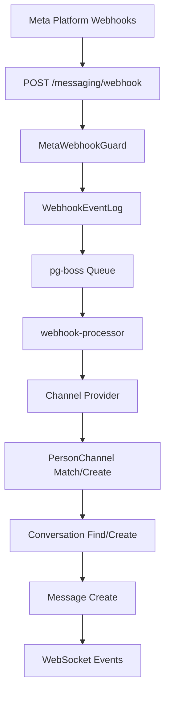

<Note>
**Last Updated:** 2026-04-15  
**Status:** Active
</Note>

The Messaging module provides a unified, channel-agnostic messaging system for WhatsApp, Instagram, and Facebook Messenger. It replaces the separate per-channel modules with shared entities, a shared queue, and a single WebSocket namespace.

## Overview

### Problem → Solution

| Problem | Solution |
|---------|----------|
| Duplicated logic across WhatsApp and Instagram modules | Single `MessagingModule` with channel providers |
| No webhook signature validation (security gap) | Shared `MetaWebhookGuard` validates `X-Hub-Signature-256` |
| Inconsistent WebSocket auth (Instagram gateway has no JWT) | Single `/messaging` gateway with JWT auth |
| No Facebook Messenger support | Third channel provider |
| Separate entity schemas per channel | Unified entities: `Conversation`, `Message`, `ChannelAccount` |
| No shared queue infrastructure | Shared `PgBossQueueService` for messaging + notifications |

### Key Design Decisions

<AccordionGroup>
  <Accordion title="Queue Technology Choice">
    **pg-boss over BullMQ** — Project already uses pg-boss for notifications. No new Redis dependency. Interface-based design (`IQueueService`) allows swapping later.
  </Accordion>

  <Accordion title="Conversation Model">
    **Direct PersonChannel FK on Conversation** — Conversations link directly to the CRM's `PersonChannel` via FK. Simpler model, no bidirectional sync overhead. The lead FK was moved from Conversation to Lead (`Lead.sourceConversation`).
  </Accordion>

  <Accordion title="Archive Strategy">
    **Archive as boolean, not status** — `Conversation.isArchived` is orthogonal to `status` (OPEN/CLOSED), following `ARCHIVE_SYSTEM_SPECIFICATION.md`.
  </Accordion>

  <Accordion title="Assignment Model">
    **`ConversationAssignment` entity** — Dedicated `conversation_assignment` table instead of the CRM `entity_stakeholder` pattern. Each assignment is one row with nullable `user_id` and `team_id`.
  </Accordion>

  <Accordion title="Message Delivery">
    **Transactional outbox** — Outbound messages use an outbox table written in the same DB transaction as the Message entity, guaranteeing at-least-once delivery.
  </Accordion>

  <Accordion title="AI Mode Configuration">
    **Per-conversation AI mode with cascade** — Each conversation has an `aiMode` field (OFF, AUTO_REPLY, SUGGEST_ONLY, DRAFT). Default cascades: ChannelAccount.defaultAiMode → Organization default → OFF.
  </Accordion>

  <Accordion title="Template System">
    **Three-tier template system** — `MessageTemplate` supports three types: `META_APPROVED` (platform-approved), `QUICK_REPLY` (agent shortcuts), and `AI_PROMPT` (AI system prompts).
  </Accordion>

  <Accordion title="OAuth Security">
    **OAuth state includes `level`** — The HMAC-signed OAuth state payload carries a `level` field (`personal` | `organization`) for defense-in-depth validation.
  </Accordion>

  <Accordion title="Permission Model">
    **`ResourcePermissionsDto` for conversations** — Conversations return per-resource permissions following the project-wide CRM pattern with in-memory computation.
  </Accordion>

  <Accordion title="Webhook Security">
    **`@PublicEndpoint()` + `MetaWebhookGuard`** — Meta webhooks arrive before org context is known, so normal tenant authentication cannot be used.
  </Accordion>
</AccordionGroup>

## Architecture & Module Structure



### Module Structure

```
src/modules/meta-platform/    <- Top-level infra module
  meta-platform.module.ts
  meta-graph-api.service.ts
  meta-api.error.ts
  meta-webhook.guard.ts
  meta-oauth.service.ts
  webhook-event-log.entity.ts

src/modules/queue/            <- Top-level infra module

src/modules/messaging/
  messaging.module.ts
  entities/               <- Core entities
  enums/                  <- Channel, MessageType, etc.
  services/               <- Core services + providers/
    providers/            <- WhatsApp, Instagram, Messenger
  controllers/            <- API controllers
  gateways/               <- WebSocket gateway
  queues/                 <- Queue workers
  dto/                    <- DTOs
  utils/                  <- Utilities
```

## Multi-Tenancy Patterns

<Warning>
The messaging module introduces unique multi-tenancy challenges because webhooks arrive without org context.
</Warning>

### Two-Step RLS Bypass (Webhook Processing)

The webhook controller receives events for ALL organizations from a single Meta App. Org context is unknown at arrival time.

<Steps>
  <Step title="Find Organization">
    Bypass RLS to find which org owns the account
    ```typescript
    const account = await this.tenantContext.executeReadOnlyWithBypass(async (em) => {
      return em.findOne(ChannelAccount, { externalAccountId: job.data.accountId });
    });
    ```
  </Step>

  <Step title="Process in Context">
    Process within that org's context
    ```typescript
    await this.tenantContext.executeInOrg(
      account.organization.id,
      async (em) => {
        await this.processMessageInTransaction(em, job.data);
      },
      { userId: undefined },
    );
    ```
  </Step>
</Steps>

### Composable `*InTransaction` Pattern

Services that participate in existing transactions expose `*InTransaction` methods:

<CodeGroup>
```typescript Public API
async matchOrCreate(channel, identifier, profileData, orgId): Promise<MatchResult>;
```

```typescript Composable
async matchOrCreateInTransaction(em, channel, identifier, profileData, orgId): Promise<MatchResult>;
```
</CodeGroup>

<Note>
The `em` parameter must always be the one provided by the TenantContext callback — never `this.em`.
</Note>

## Entities

### Core Entities

<Tabs>
  <Tab title="ChannelAccount">
    ```typescript
    @Entity()
    export class ChannelAccount extends BaseEntity {
      @Column({ type: 'enum', enum: Channel })
      channel: Channel;

      @Column()
      externalAccountId: string;

      @Column({ nullable: true })
      pageId?: string; // Instagram Page ID for Send API

      @Column()
      displayName: string;

      @Column({ type: 'jsonb', nullable: true })
      metadata?: Record<string, any>;

      @Column({ type: 'enum', enum: AiMode, default: AiMode.OFF })
      defaultAiMode: AiMode;

      @ManyToOne(() => Organization)
      organization: Organization;
    }
    ```
  </Tab>

  <Tab title="Conversation">
    ```typescript
    @Entity()
    export class Conversation extends BaseEntity {
      @ManyToOne(() => PersonChannel)
      personChannel: PersonChannel;

      @ManyToOne(() => ChannelAccount)
      channelAccount: ChannelAccount;

      @Column({ type: 'enum', enum: ConversationStatus, default: ConversationStatus.OPEN })
      status: ConversationStatus;

      @Column({ default: false })
      isArchived: boolean;

      @Column({ type: 'enum', enum: AiMode, nullable: true })
      aiMode?: AiMode;

      @Column({ nullable: true })
      lastMessageAt?: Date;

      @OneToMany(() => Message, message => message.conversation)
      messages: Message[];

      @OneToMany(() => ConversationAssignment, assignment => assignment.conversation)
      assignments: ConversationAssignment[];
    }
    ```
  </Tab>

  <Tab title="Message">
    ```typescript
    @Entity()
    export class Message extends BaseEntity {
      @ManyToOne(() => Conversation)
      conversation: Conversation;

      @Column()
      externalMessageId: string;

      @Column({ type: 'enum', enum: MessageDirection })
      direction: MessageDirection;

      @Column({ type: 'enum', enum: MessageType })
      type: MessageType;

      @Column({ type: 'text', nullable: true })
      content?: string;

      @Column({ type: 'jsonb', nullable: true })
      metadata?: Record<string, any>;

      @Column({ type: 'enum', enum: MessageStatus, default: MessageStatus.PENDING })
      status: MessageStatus;

      @ManyToOne(() => User, { nullable: true })
      sentBy?: User;
    }
    ```
  </Tab>
</Tabs>

## Enums

### Channel Types

```typescript
export enum Channel {
  WHATSAPP = 'whatsapp',
  INSTAGRAM = 'instagram', 
  MESSENGER = 'messenger',
}
```

### Message Types

```typescript
export enum MessageType {
  TEXT = 'text',
  IMAGE = 'image',
  DOCUMENT = 'document',
  AUDIO = 'audio',
  VIDEO = 'video',
  STICKER = 'sticker',
  REACTION = 'reaction',
  TEMPLATE = 'template',
  INTERACTIVE = 'interactive',
  SYSTEM = 'system',
}
```

### AI Mode

```typescript
export enum AiMode {
  OFF = 'off',
  AUTO_REPLY = 'auto_reply', 
  SUGGEST_ONLY = 'suggest_only',
  DRAFT = 'draft',
}
```

## Message Flows

### Inbound Message Flow

<Steps>
  <Step title="Webhook Reception">
    Meta webhook arrives at `POST /messaging/webhook`
    - `@PublicEndpoint()` bypasses normal auth
    - `MetaWebhookGuard` validates `X-Hub-Signature-256`
    - Returns 200 immediately
    - Persists to `WebhookEventLog`
  </Step>

  <Step title="Queue Processing">
    `webhook-processor` worker processes event:
    - Check idempotency via `externalEventId`
    - Find organization using RLS bypass
    - Switch to org context for processing
  </Step>

  <Step title="Message Processing">
    Within org context:
    - Route to appropriate channel provider
    - Match/create PersonChannel and Person
    - Find/create Conversation
    - Create Message entity
    - Update conversation metadata
  </Step>

  <Step title="Side Effects">
    - Create CRM Activity via bridge
    - Update PersonChannel stats
    - Emit WebSocket events
    - Trigger notifications if applicable
  </Step>
</Steps>

### Outbound Message Flow

<Steps>
  <Step title="Message Creation">
    API creates Message + MessageOutbox in same transaction
  </Step>

  <Step title="Queue Processing">
    `message-sender` worker processes outbox entry:
    - Call appropriate channel provider
    - Update message status based on response
    - Delete outbox entry on success
  </Step>

  <Step title="Status Updates">
    Delivery receipts arrive via webhook:
    - Update message status (SENT → DELIVERED → READ)
    - Emit WebSocket status updates
  </Step>
</Steps>

## Business Rules

### Assignment Rules

<Info>
**Assignment Types:**
- `user + null` = Direct assignment  
- `user + team` = Agent on behalf of team
- `null + team` = Team pool
</Info>

1. Multiple assignments per conversation are supported
2. Team managers can assign within their team scope
3. Assignment changes emit `conversation-updated` events
4. Transfer history tracked via WebSocket and notification events

### AI Mode Cascade

```
Conversation.aiMode → ChannelAccount.defaultAiMode → Organization default → OFF
```

### Message Validation

- WhatsApp: Text messages limited to 4096 characters
- Instagram: Media messages require valid MIME types
- Messenger: Interactive messages follow platform schema

## RBAC Permissions & Access Control

### Global Permissions

| Permission | Description |
|------------|-------------|
| `MESSAGING_MANAGE` | Full messaging access (view, reply, assign, transfer, archive) |
| `MESSAGING_WRITE` | View and reply to messages |

### Team Permissions

| Permission | Description |
|------------|-------------|
| `team_messaging.manage` | Manage team's messaging assignments |

### Resource-Level Permissions

<Tabs>
  <Tab title="Permission Computation">
    ```typescript
    export class ConversationPermissionService {
      computePermissions(
        conversation: Conversation,
        user: User,
        globalPerms: string[],
        teamPerms: TeamPermission[]
      ): ResourcePermissionsDto {
        // MESSAGING_MANAGE → full access
        if (globalPerms.includes('MESSAGING_MANAGE')) {
          return this.fullAccess();
        }

        // Personal account owner
        if (this.isPersonalAccountOwner(conversation, user)) {
          return { canView: true, canReply: true, canAssign: false };
        }

        // Assignment-based access
        const assignment = this.findUserAssignment(conversation, user);
        if (assignment) {
          return { 
            canView: true, 
            canReply: assignment.canReply,
            canAssign: this.canAssignInTeam(user, teamPerms, conversation)
          };
        }

        return this.noAccess();
      }
    }
    ```
  </Tab>

  <Tab title="Permission Flags">
    ```typescript
    interface ResourcePermissionsDto {
      canView: boolean;
      canReply: boolean;
      canEdit: boolean;      // Always false for non-managers
      canAssign: boolean;    // True if user can manage team with pool assignment
      canTransfer: boolean;  // Always false for non-managers
      canArchive: boolean;   // Always false for non-managers
    }
    ```
  </Tab>
</Tabs>

## Notification Types

### Conversation Events

- `CONVERSATION_ASSIGNED` - New assignment created
- `CONVERSATION_TRANSFERRED` - Assignment changed
- `CONVERSATION_MENTION` - User mentioned in message

### Message Events  

- `NEW_MESSAGE` - Inbound message received
- `MESSAGE_FAILED` - Outbound message failed to send

## API Endpoints

### Conversation Management

<CodeGroup>
```http GET List Conversations
GET /messaging/conversations?page=1&limit=20&status=open&assigned=me

Response:
{
  "data": [
    {
      "id": "uuid",
      "status": "open",
      "isArchived": false,
      "lastMessageAt": "2024-01-15T10:30:00Z",
      "personChannel": { ... },
      "channelAccount": { ... },
      "assignments": [ ... ],
      "permissions": {
        "canView": true,
        "canReply": true,
        "canAssign": false
      }
    }
  ],
  "meta": { ... }
}
```

```http GET Conversation Detail  
GET /messaging/conversations/{id}

Response:
{
  "id": "uuid", 
  "status": "open",
  "aiMode": "suggest_only",
  "messages": [ ... ],
  "permissions": { ... }
}
```

```http POST Send Message
POST /messaging/conversations/{id}/messages

Body:
{
  "type": "text",
  "content": "Hello world",
  "templateId": "uuid" // optional
}
```
</CodeGroup>

### Assignment Management

<CodeGroup>
```http POST Assign Conversation
POST /messaging/conversations/{id}/assign

Body:
{
  "userId": "uuid",     // optional
  "teamId": "uuid",     // optional  
  "canReply": true
}
```

```http DELETE Remove Assignment
DELETE /messaging/conversations/{id}/assign/{assignmentId}
```
</CodeGroup>

## WebSocket Events & Room Architecture

### Room Structure

<Tabs>
  <Tab title="Room Types">
    - `org:{orgId}` - Organization-wide events
    - `user:{userId}` - User-specific events  
    - `conversation:{conversationId}` - Conversation-specific events
    - `team:{teamId}` - Team-specific events
  </Tab>

  <Tab title="Auto-Join Logic">
    ```typescript
    @WebSocketGateway({ namespace: '/messaging' })
    export class MessagingGateway {
      async handleConnection(client: AuthenticatedSocket) {
        // Auto-join organization room
        client.join(`org:${client.user.organizationId}`);
        
        // Auto-join user room  
        client.join(`user:${client.user.id}`);
        
        // Auto-join team rooms
        for (const teamId of client.user.teamIds) {
          client.join(`team:${teamId}`);
        }
      }
    }
    ```
  </Tab>
</Tabs>

### Event Types

<AccordionGroup>
  <Accordion title="message-received">
    **Emitted to:** `conversation:{id}`, `org:{orgId}`, assigned users/teams
    
    ```typescript
    {
      type: 'message-received',
      data: {
        conversationId: string,
        message: MessageDto,
        conversation: ConversationDto
      }
    }
    ```
  </Accordion>

  <Accordion title="message-sent">
    **Emitted to:** `conversation:{id}`
    
    ```typescript
    {
      type: 'message-sent', 
      data: {
        conversationId: string,
        message: MessageDto
      }
    }
    ```
  </Accordion>

  <Accordion title="conversation-updated">
    **Emitted to:** `conversation:{id}`, `org:{orgId}`
    
    ```typescript
    {
      type: 'conversation-updated',
      data: {
        conversationId: string,
        changes: {
          status?: ConversationStatus,
          aiMode?: AiMode,
          assignments?: ConversationAssignmentDto[]
        }
      }
    }
    ```
  </Accordion>

  <Accordion title="typing-indicator">
    **Emitted to:** `conversation:{id}`
    
    ```typescript
    {
      type: 'typing-indicator',
      data: {
        conversationId: string,
        userId: string,
        isTyping: boolean
      }
    }
    ```
  </Accordion>
</AccordionGroup>

## Messaging-Specific Conventions

### Personal Account Access

<Tip>
Personal accounts have special access rules since they're owned by individual users rather than managed centrally.
</Tip>

```typescript
// utils/permission.util.ts
export function isPersonalAccountOwner(
  conversation: Conversation,
  user: User
): boolean {
  const account = conversation.channelAccount;
  return account.level === 'personal' && 
         account.ownerId === user.id;
}
```

### Template Variable Resolution

```typescript
// Quick reply templates support variables
const template = "Hello {{contact.firstName}}, your order {{order.id}} is ready!";

// Variables resolved from conversation context
const resolved = await this.templateService.resolveVariables(
  template, 
  conversation
);
```

### Media Handling

<Steps>
  <Step title="Inbound Media">
    - Meta webhooks include media URLs with temp tokens
    - `media-downloader` queue downloads and stores in permanent storage
    - Message metadata updated with permanent URLs
  </Step>

  <Step title="Outbound Media">
    - Upload media to permanent storage first
    - Include permanent URL in outbound message
    - Platform converts to platform-specific format
  </Step>
</Steps>

## Query Patterns

### Conversation Queries

<CodeGroup>
```typescript Assigned to User
// Find conversations assigned to specific user
const conversations = await this.conversationRepository
  .createQueryBuilder('conv')
  .leftJoinAndSelect('conv.assignments', 'assign')
  .where('assign.userId = :userId', { userId })
  .andWhere('assign.canReply = true')
  .getMany();
```

```typescript Team Pool
// Find team pool conversations
const conversations = await this.conversationRepository
  .createQueryBuilder('conv')
  .leftJoinAndSelect('conv.assignments', 'assign') 
  .where('assign.teamId = :teamId', { teamId })
  .andWhere('assign.userId IS NULL')
  .getMany();
```

```typescript Unassigned
// Find unassigned conversations  
const conversations = await this.conversationRepository
  .createQueryBuilder('conv')
  .leftJoin('conv.assignments', 'assign')
  .where('assign.id IS NULL')
  .getMany();
```
</CodeGroup>

### Message Queries

```typescript
// Get conversation messages with pagination
const messages = await this.messageRepository.find({
  where: { conversation: { id: conversationId } },
  order: { createdAt: 'DESC' },
  take: limit,
  skip: (page - 1) * limit,
  relations: ['sentBy']
});
```

## Error Handling & Retry Strategy

### Queue Retry Logic

<Tabs>
  <Tab title="Webhook Processing">
    ```typescript
    // Exponential backoff for webhook processing
    await this.queueService.add('webhook-processor', data, {
      attempts: 5,
      backoff: {
        type: 'exponential',
        delay: 2000,
      },
      removeOnComplete: 100,
      removeOnFail: 50
    });
    ```
  </Tab>

  <Tab title="Message Sending">
    ```typescript
    // Linear backoff for message sending
    await this.queueService.add('message-sender', data, {
      attempts: 3,
      backoff: {
        type: 'fixed', 
        delay: 5000,
      }
    });
    ```
  </Tab>
</Tabs>

### Error Classification

<Warning>
**Permanent Errors** (no retry):
- Invalid authentication tokens
- Message content policy violations  
- Rate limit exceeded (24h window)
</Warning>

<Info>
**Transient Errors** (retry with backoff):
- Network timeouts
- Platform API errors (5xx)
- Database connection issues
</Info>

## Deployment Considerations

### Database Migrations

<Steps>
  <Step title="Create Messaging Tables">
    Run migrations to create new messaging entities
  </Step>

  <Step title="Backfill Channel Accounts">
    Migrate existing WhatsApp/Instagram accounts to unified ChannelAccount table
  </Step>

  <Step title="Migrate Conversations">
    Convert existing conversation records to new schema
  </Step>

  <Step title="Clean Up Legacy Tables">
    Remove old per-channel tables after verification
  </Step>
</Steps>

### Environment Variables

```bash
# Meta Platform
META_APP_ID=your_app_id
META_APP_SECRET=your_app_secret
META_WEBHOOK_VERIFY_TOKEN=your_verify_token

# Queue Configuration  
PGBOSS_POLL_INTERVAL=5000
PGBOSS_RETENTION_DAYS=7

# WebSocket
WEBSOCKET_CORS_ORIGINS=http://localhost:3000,https://app.example.com
```

## Module Dependencies & Integration Points

### Internal Dependencies

- **CRM Module** - PersonChannel, Person, Lead entities
- **User Management** - User, Team, Organization entities  
- **Notification Module** - Shared queue service
- **Audit Module** - Activity creation for conversations

### External Dependencies

- **Meta Graph API** - Send messages, manage webhooks
- **File Storage** - Media upload/download
- **Queue System** - pg-boss for background processing

## Testing Strategy

<Tabs>
  <Tab title="Unit Tests">
    ```typescript
    describe('ConversationService', () => {
      it('should create conversation with correct PersonChannel', async () => {
        const result = await service.findOrCreateConversation(
          channelAccount,
          personChannel
        );
        
        expect(result.personChannel.id).toBe(personChannel.id);
        expect(result.channelAccount.id).toBe(channelAccount.id);
      });
    });
    ```
  </Tab>

  <Tab title="Integration Tests">
    ```typescript
    describe('Webhook Processing', () => {
      it('should process WhatsApp message webhook end-to-end', async () => {
        // Send webhook payload
        await request(app)
          .post('/messaging/webhook')
          .set('X-Hub-Signature-256', signature)
          .send(whatsappMessagePayload)
          .expect(200);
          
        // Verify message was created
        const message = await messageRepo.findOne({ 
          where: { externalMessageId: payload.messageId }
        });
        expect(message).toBeDefined();
      });
    });
    ```
  </Tab>

  <Tab title="E2E Tests">
    ```typescript
    describe('Messaging E2E', () => {
      it('should handle complete message conversation flow', async () => {
        // 1. Receive inbound message
        // 2. Assign conversation  
        // 3. Send outbound reply
        // 4. Verify WebSocket events
        // 5. Check notification delivery
      });
    });
    ```
  </Tab>
</Tabs>

## Legacy Module Removal

<Warning>
**Phase 1:** Deploy messaging module alongside existing modules  
**Phase 2:** Migrate data and switch traffic  
**Phase 3:** Remove legacy WhatsApp and Instagram modules
</Warning>

### Migration Checklist

- [ ] Backup existing data
- [ ] Run data migration scripts  
- [ ] Update frontend routes
- [ ] Switch webhook endpoints
- [ ] Monitor for errors
- [ ] Remove legacy code

## Known Gaps & Technical Debt

<AccordionGroup>
  <Accordion title="Message Threading">
    Currently no support for threaded conversations or message replies. All messages are flat in conversation timeline.
  </Accordion>

  <Accordion title="Message Reactions">
    Reaction events are received but not fully processed. Need UI for displaying reactions on messages.
  </Accordion>

  <Accordion title="Rich Media Templates">
    Limited support for platform-specific interactive templates (carousels, quick replies, etc).
  </Accordion>

  <Accordion title="Conversation Analytics">
    No built-in analytics for response times, resolution rates, customer satisfaction scores.
  </Accordion>

  <Accordion title="Message Search">
    No full-text search capability across message content within conversations.
  </Accordion>
</AccordionGroup>

## Key Files Reference

### Core Files

- `src/modules/messaging/messaging.module.ts` - Main module definition
- `src/modules/messaging/entities/conversation.entity.ts` - Conversation schema
- `src/modules/messaging/services/conversation.service.ts` - Core conversation logic
- `src/modules/messaging/controllers/webhook.controller.ts` - Webhook handling
- `src/modules/messaging/gateways/messaging.gateway.ts` - WebSocket events

### Queue Workers

- `src/modules/messaging/queues/webhook-processor.worker.ts` - Process inbound webhooks
- `src/modules/messaging/queues/message-sender.worker.ts` - Send outbound messages  
- `src/modules/messaging/queues/media-downloader.worker.ts` - Download media files

### Channel Providers

- `src/modules/messaging/services/providers/whatsapp.provider.ts` - WhatsApp integration
- `src/modules/messaging/services/providers/instagram.provider.ts` - Instagram integration
- `src/modules/messaging/services/providers/messenger.provider.ts` - Messenger integration

## Future Phases

### Phase 2: Advanced Features

- Message templates with rich content
- Conversation analytics and reporting
- Advanced automation rules
- Integration with external CRM systems

### Phase 3: AI Integration

- Automated response generation
- Sentiment analysis
- Intent recognition
- Smart conversation routing

### Phase 4: Additional Channels

- SMS/Text messaging
- Email integration  
- Voice message support
- Video calling capabilities

## Related Documentation

<CardGroup cols={2}>
  <Card title="Multi-Tenancy Guide" href="/backend/architecture/multi-tenancy">
    Understanding RLS patterns and tenant isolation
  </Card>
  
  <Card title="Archive System" href="/backend/features/archive-system">
    Archive behavior and implementation details
  </Card>
  
  <Card title="Queue System" href="/backend/infrastructure/queue-system">
    pg-boss configuration and queue patterns
  </Card>
  
  <Card title="WebSocket Architecture" href="/backend/realtime/websocket-architecture">
    Real-time event system and room management
  </Card>
</CardGroup>