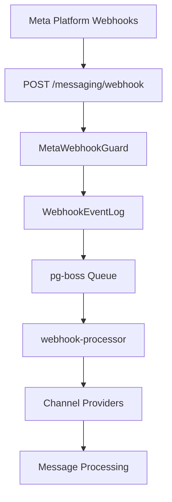

<Note>
**Last Updated:** 2026-04-15  
**Status:** Active
</Note>

## Overview

The Messaging module provides a unified, channel-agnostic messaging system for WhatsApp, Instagram, and Facebook Messenger. It replaces the separate per-channel modules with shared entities, a shared queue, and a single WebSocket namespace.

### Problem → Solution

| Problem | Solution |
|---------|----------|
| Duplicated logic across WhatsApp and Instagram modules | Single `MessagingModule` with channel providers |
| No webhook signature validation (security gap) | Shared `MetaWebhookGuard` validates `X-Hub-Signature-256` |
| Inconsistent WebSocket auth (Instagram gateway has no JWT) | Single `/messaging` gateway with JWT auth |
| No Facebook Messenger support | Third channel provider |
| Separate entity schemas per channel | Unified entities: `Conversation`, `Message`, `ChannelAccount` |
| No shared queue infrastructure | Shared `PgBossQueueService` for messaging + notifications |

### Key Design Decisions

<AccordionGroup>
<Accordion title="Queue Technology Choice">
**pg-boss over BullMQ** — Project already uses pg-boss for notifications. No new Redis dependency. Interface-based design (`IQueueService`) allows swapping later.
</Accordion>

<Accordion title="Conversation-CRM Integration">
**Direct PersonChannel FK on Conversation** — Conversations link directly to the CRM's `PersonChannel` via FK. Simpler model, no bidirectional sync overhead. The lead FK was moved from Conversation to Lead (`Lead.sourceConversation`).
</Accordion>

<Accordion title="Archive System">
**Archive as boolean, not status** — `Conversation.isArchived` is orthogonal to `status` (OPEN/CLOSED), following `ARCHIVE_SYSTEM_SPECIFICATION.md`.
</Accordion>

<Accordion title="Assignment Model">
**`ConversationAssignment` entity** — Uses dedicated `conversation_assignment` table instead of CRM `entity_stakeholder` pattern. Each assignment is one row with nullable `user_id` and `team_id`.
</Accordion>

<Accordion title="Message Delivery">
**Transactional outbox** — Outbound messages use an outbox table written in the same DB transaction as the Message entity, guaranteeing at-least-once delivery.
</Accordion>
</AccordionGroup>

## Architecture & Module Structure



<CodeGroup>
```typescript Webhook Flow
Meta Platform Webhooks
(WhatsApp, Instagram, Messenger)
        |
POST /messaging/webhook
@PublicEndpoint() + MetaWebhookGuard
Validates X-Hub-Signature-256
Returns 200 immediately
Persists to WebhookEventLog
Enqueues to pg-boss queue
        |
Queue Worker (webhook-processor)
1. Check idempotency (externalEventId)
2. executeReadOnlyWithBypass() -> find org
3. executeInOrg(orgId) -> process:
   a. Route to channel provider (WA/IG/Messenger)
   b. Match/create PersonChannel
   c. Match/create Person + Lead
   d. Find/create Conversation
   e. Create Message
   f. Create CRM Activity (via bridge)
   g. Update PersonChannel stats
   h. Emit WebSocket events
   i. Emit notification events
```
</CodeGroup>

### Module Structure

```
src/modules/meta-platform/    <- Top-level infra module
  meta-platform.module.ts
  meta-graph-api.service.ts
  meta-api.error.ts
  meta-webhook.guard.ts
  meta-oauth.service.ts
  webhook-event-log.entity.ts

src/modules/queue/            <- Top-level infra module

src/modules/messaging/
  messaging.module.ts
  entities/               <- Core entities
  enums/                  <- Channel, MessageType, etc.
  services/               <- Core services + providers/
    providers/            <- WhatsApp, Instagram, Messenger
  controllers/            <- API controllers
  gateways/               <- WebSocket gateway
  queues/                 <- Queue workers
  dto/                    <- Request/response DTOs
  utils/                  <- Utility functions
```

## Multi-Tenancy Patterns

<Warning>
The messaging module introduces unique multi-tenancy challenges because webhooks arrive without org context.
</Warning>

### Two-Step RLS Bypass (Webhook Processing)

The webhook controller receives events for ALL organizations from a single Meta App. Org context is unknown at arrival time.

<Steps>
<Step title="Find Organization">
```typescript
// Step 1: Find which org owns this account (bypass RLS)
const account = await this.tenantContext.executeReadOnlyWithBypass(async (em) => {
  return em.findOne(ChannelAccount, { externalAccountId: job.data.accountId });
});
```
</Step>

<Step title="Process in Org Context">
```typescript
// Step 2: Process within that org's context
await this.tenantContext.executeInOrg(
  account.organization.id,
  async (em) => {
    await this.processMessageInTransaction(em, job.data);
  },
  { userId: undefined }, // system action, no user
);
```
</Step>
</Steps>

### Composable `*InTransaction` Pattern

Services that participate in existing transactions expose `*InTransaction` methods:

```typescript
// Public API — wraps TenantContext
async matchOrCreate(channel, identifier, profileData, orgId): Promise<MatchResult>;

// Composable — accepts EntityManager from caller's transaction
async matchOrCreateInTransaction(em, channel, identifier, profileData, orgId): Promise<MatchResult>;
```

<Note>
The `em` parameter must always be the one provided by the TenantContext callback — never `this.em`.
</Note>

## Entities

### Core Entities

<Tabs>
<Tab title="ChannelAccount">
```typescript
@Entity('channel_account')
export class ChannelAccount {
  @PrimaryKey()
  id: string;

  @Property()
  organizationId: string;

  @Enum()
  channel: Channel; // WHATSAPP, INSTAGRAM, MESSENGER

  @Property()
  externalAccountId: string; // WhatsApp Phone Number ID, IG Business Account ID, etc.

  @Property()
  displayName: string;

  @Property({ nullable: true })
  profilePhotoUrl?: string;

  @Property()
  isActive: boolean = true;

  @Property({ nullable: true })
  pageId?: string; // For Instagram/Messenger

  @Enum({ nullable: true })
  defaultAiMode?: AiMode;

  @Property()
  createdAt: Date = new Date();

  @Property({ onUpdate: () => new Date() })
  updatedAt: Date = new Date();
}
```
</Tab>

<Tab title="Conversation">
```typescript
@Entity('conversation')
export class Conversation {
  @PrimaryKey()
  id: string;

  @Property()
  organizationId: string;

  @ManyToOne()
  channelAccount: ChannelAccount;

  @ManyToOne({ nullable: true })
  personChannel?: PersonChannel;

  @Property({ nullable: true })
  contactId?: string;

  @Enum()
  status: ConversationStatus = ConversationStatus.OPEN;

  @Property()
  isArchived: boolean = false;

  @Enum()
  aiMode: AiMode = AiMode.OFF;

  @Property({ nullable: true })
  lastMessageAt?: Date;

  @Property()
  createdAt: Date = new Date();

  @Property({ onUpdate: () => new Date() })
  updatedAt: Date = new Date();

  @OneToMany(() => Message, (m) => m.conversation)
  messages = new Collection<Message>(this);

  @OneToMany(() => ConversationAssignment, (a) => a.conversation)
  assignments = new Collection<ConversationAssignment>(this);
}
```
</Tab>

<Tab title="Message">
```typescript
@Entity('message')
export class Message {
  @PrimaryKey()
  id: string;

  @Property()
  organizationId: string;

  @ManyToOne()
  conversation: Conversation;

  @Property({ nullable: true })
  externalMessageId?: string;

  @Enum()
  direction: MessageDirection;

  @Enum()
  type: MessageType;

  @Property({ type: 'text', nullable: true })
  content?: string;

  @Property({ type: 'json', nullable: true })
  mediaAttachments?: MediaAttachment[];

  @Enum()
  status: MessageStatus = MessageStatus.PENDING;

  @Property({ nullable: true })
  sentAt?: Date;

  @Property({ nullable: true })
  deliveredAt?: Date;

  @Property({ nullable: true })
  readAt?: Date;

  @Property({ nullable: true })
  failedAt?: Date;

  @Property({ nullable: true })
  errorMessage?: string;

  @Property({ nullable: true })
  createdByUserId?: string;

  @Property()
  createdAt: Date = new Date();
}
```
</Tab>
</Tabs>

## Message Flows

### Inbound Message Flow

<Steps>
<Step title="Webhook Received">
Meta platform sends webhook to `/messaging/webhook` endpoint
</Step>

<Step title="Security Validation">
`MetaWebhookGuard` validates `X-Hub-Signature-256` header
</Step>

<Step title="Queue Processing">
Event is queued to `webhook-processor` queue for async processing
</Step>

<Step title="Organization Resolution">
Find organization by channel account ID using RLS bypass
</Step>

<Step title="Message Creation">
Create message entity within organization context
</Step>

<Step title="Notifications">
Emit WebSocket events and notifications to relevant users
</Step>
</Steps>

### Outbound Message Flow

<Steps>
<Step title="Message Creation">
Create `Message` and `MessageOutbox` entities in same transaction
</Step>

<Step title="Queue Processing">
`message-sender` queue picks up outbox entry
</Step>

<Step title="API Call">
Send message via appropriate channel provider (WhatsApp, Instagram, Messenger)
</Step>

<Step title="Status Update">
Update message status based on API response
</Step>

<Step title="Cleanup">
Delete outbox entry on successful delivery
</Step>
</Steps>

## Business Rules

### Assignment Rules

<Info>
Conversations support multiple assignment types through the `ConversationAssignment` entity:
</Info>

- **Direct Assignment**: `user_id` + `team_id = null`
- **Team Assignment**: `user_id = null` + `team_id`
- **Agent on Team**: `user_id` + `team_id` (agent representing team)

### AI Mode Cascade

AI mode defaults cascade in the following order:
1. `Conversation.aiMode` (if set)
2. `ChannelAccount.defaultAiMode` (if set)
3. Organization default AI mode
4. `AiMode.OFF`

### Archive System

<Check>
`Conversation.isArchived` is orthogonal to `status` (OPEN/CLOSED). Archived conversations can still be OPEN for new messages.
</Check>

## RBAC Permissions & Access Control

### Permission Levels

| Permission | Access Level |
|------------|--------------|
| `MESSAGING_MANAGE` | Full access to all messaging features |
| `MESSAGING_WRITE` | Can view and reply to messages |
| `MESSAGING_READ` | Read-only access to conversations |

### Personal Account Access

<Warning>
Personal channel accounts have special access rules separate from organization RBAC.
</Warning>

Personal account owners always have `canView` and `canReply` permissions for conversations on their accounts, regardless of organization permissions.

## API Endpoints

### Conversation Management

<CodeGroup>
```typescript GET /messaging/conversations
// List conversations with filtering and pagination
Query Parameters:
- status?: ConversationStatus
- isArchived?: boolean
- assignedToMe?: boolean
- channelAccountId?: string
- search?: string
- page?: number
- limit?: number
```

```typescript GET /messaging/conversations/{id}
// Get conversation details with permissions
Response includes:
- Conversation data
- Recent messages
- Assignment information
- ResourcePermissionsDto
```

```typescript POST /messaging/conversations/{id}/messages
// Send a new message
Body: {
  type: MessageType;
  content?: string;
  mediaAttachments?: MediaAttachment[];
  templateId?: string;
  templateVariables?: Record<string, string>;
}
```

```typescript PUT /messaging/conversations/{id}/assignment
// Assign conversation
Body: {
  userId?: string;
  teamId?: string;
  canReply?: boolean;
}
```
</CodeGroup>

### Channel Account Management

<CodeGroup>
```typescript GET /messaging/channel-accounts
// List organization's channel accounts
Response: ChannelAccount[]
```

```typescript POST /messaging/channel-accounts/{id}/connect
// Connect personal account
Body: {
  code: string; // OAuth authorization code
  state: string; // HMAC-signed state
}
```

```typescript DELETE /messaging/channel-accounts/{id}
// Disconnect channel account
Requires: MESSAGING_MANAGE permission
```
</CodeGroup>

## WebSocket Events & Room Architecture

### Room Structure

<Tabs>
<Tab title="Organization Room">
```typescript
// All messaging events for an organization
room: `messaging:org:${organizationId}`
```
</Tab>

<Tab title="Conversation Room">
```typescript
// Events specific to a conversation
room: `messaging:conversation:${conversationId}`
```
</Tab>

<Tab title="User Room">
```typescript
// Personal notifications and assignments
room: `messaging:user:${userId}`
```
</Tab>
</Tabs>

### Event Types

<AccordionGroup>
<Accordion title="conversation-created">
```typescript
{
  type: 'conversation-created';
  data: {
    conversation: ConversationDetailDto;
    message?: MessageDto; // triggering message
  };
}
```
</Accordion>

<Accordion title="conversation-updated">
```typescript
{
  type: 'conversation-updated';
  data: {
    conversationId: string;
    changes: Partial<Conversation>;
    updatedBy?: string;
  };
}
```
</Accordion>

<Accordion title="message-received">
```typescript
{
  type: 'message-received';
  data: {
    message: MessageDto;
    conversationId: string;
  };
}
```
</Accordion>

<Accordion title="message-status-updated">
```typescript
{
  type: 'message-status-updated';
  data: {
    messageId: string;
    status: MessageStatus;
    timestamp: Date;
  };
}
```
</Accordion>
</AccordionGroup>

## Error Handling & Retry Strategy

### Queue Retry Configuration

<CodeGroup>
```typescript Webhook Processing
{
  retryLimit: 5,
  retryDelay: 30, // seconds
  retryBackoff: true,
  expireInSeconds: 60 * 60 * 24 // 24 hours
}
```

```typescript Message Sending
{
  retryLimit: 3,
  retryDelay: 60, // seconds
  retryBackoff: true,
  expireInSeconds: 60 * 60 * 4 // 4 hours
}
```

```typescript Media Download
{
  retryLimit: 3,
  retryDelay: 30, // seconds
  retryBackoff: true,
  expireInSeconds: 60 * 60 * 2 // 2 hours
}
```
</CodeGroup>

### Error Categories

| Error Type | Retry Strategy | Action |
|------------|----------------|--------|
| Network timeout | Exponential backoff | Retry up to limit |
| Rate limiting | Fixed delay | Retry with longer delay |
| Invalid webhook signature | No retry | Log and discard |
| Message too large | No retry | Mark as failed |
| Account suspended | No retry | Disable account |

## Deployment Considerations

### Database Migrations

<Warning>
The messaging module requires careful migration from legacy WhatsApp and Instagram modules.
</Warning>

<Steps>
<Step title="Create New Tables">
Run migrations to create unified messaging entities
</Step>

<Step title="Migrate Data">
Transfer existing conversations and messages to new schema
</Step>

<Step title="Update Assignments">
Backfill `conversation_assignment` from legacy assignment columns
</Step>

<Step title="Switch Webhooks">
Update Meta webhook URLs to point to unified endpoint
</Step>

<Step title="Remove Legacy">
Drop old module tables after verification
</Step>
</Steps>

### Environment Variables

```bash
# Meta Platform Configuration
META_APP_ID=your_app_id
META_APP_SECRET=your_app_secret
META_WEBHOOK_VERIFY_TOKEN=your_verify_token

# Queue Configuration
PGBOSS_DATABASE_URL=postgresql://...
PGBOSS_SCHEMA=pgboss

# WebSocket Configuration
WEBSOCKET_CORS_ORIGIN=https://your-frontend.com
```

## Module Dependencies & Integration Points

### Internal Dependencies

<CardGroup cols={2}>
<Card title="CRM Module" icon="users">
Integrates with `PersonChannel`, `Person`, and `Lead` entities
</Card>

<Card title="Notification Module" icon="bell">
Sends conversation and message notifications
</Card>

<Card title="Team Module" icon="people-group">
Team-based assignment and permissions
</Card>

<Card title="Auth Module" icon="shield">
User authentication and RBAC permissions
</Card>
</CardGroup>

### External Dependencies

- **Meta Graph API**: WhatsApp, Instagram, Messenger messaging
- **PostgreSQL**: Primary database with pg-boss queues
- **Redis**: Session storage and WebSocket scaling
- **File Storage**: Media attachment handling

## Testing Strategy

### Unit Tests

<Tabs>
<Tab title="Service Tests">
```typescript
describe('ConversationService', () => {
  it('should create conversation with proper assignments');
  it('should cascade AI mode from channel account');
  it('should handle permission validation');
});
```
</Tab>

<Tab title="Provider Tests">
```typescript
describe('WhatsAppProvider', () => {
  it('should parse incoming webhook correctly');
  it('should format outbound message properly');
  it('should handle media attachments');
});
```
</Tab>

<Tab title="Queue Tests">
```typescript
describe('WebhookProcessor', () => {
  it('should process webhook with RLS bypass');
  it('should handle idempotency correctly');
  it('should emit proper WebSocket events');
});
```
</Tab>
</Tabs>

### Integration Tests

<Steps>
<Step title="Webhook Flow">
Test complete webhook processing from HTTP to database
</Step>

<Step title="Message Sending">
Test outbound message flow through outbox pattern
</Step>

<Step title="Permission System">
Verify RBAC and personal account access rules
</Step>

<Step title="WebSocket Events">
Test real-time event emission and room joining
</Step>
</Steps>

## Legacy Module Removal

<Warning>
The following legacy modules will be deprecated and removed:
</Warning>

- `WhatsAppModule` → Replaced by `MessagingModule` with WhatsApp provider
- `InstagramModule` → Replaced by `MessagingModule` with Instagram provider
- Individual webhook endpoints → Unified `/messaging/webhook`
- Separate WebSocket gateways → Single `/messaging` namespace

### Migration Timeline

1. **Phase 1**: Deploy messaging module alongside legacy modules
2. **Phase 2**: Switch webhook URLs to unified endpoint
3. **Phase 3**: Migrate frontend to new APIs
4. **Phase 4**: Remove legacy module code and tables

## Future Phases

<Info>
Planned enhancements for future releases:
</Info>

### Phase 2: Advanced Features
- Message templates with approval workflow
- Conversation routing rules
- Advanced AI mode configurations
- Bulk message operations

### Phase 3: Analytics & Reporting
- Conversation analytics dashboard
- Agent performance metrics
- Response time tracking
- Customer satisfaction surveys

### Phase 4: Integrations
- Third-party messaging platforms
- CRM workflow triggers
- Advanced automation rules
- API webhooks for external systems

## Related Documentation

<CardGroup cols={2}>
<Card title="Multi-Tenancy Guide" href="/backend/architecture/multi-tenancy">
Complete RLS patterns and tenant context usage
</Card>

<Card title="Archive System" href="/backend/architecture/archive-system">
Archive vs status patterns across modules
</Card>

<Card title="Queue Infrastructure" href="/backend/infrastructure/queue-service">
pg-boss configuration and queue patterns
</Card>

<Card title="WebSocket Architecture" href="/backend/infrastructure/websocket">
Real-time event system and room management
</Card>
</CardGroup>