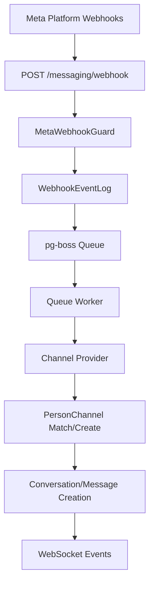

<Note>
**Last Updated:** 2026-04-15  
**Status:** Active
</Note>

## Overview

The Messaging module provides a unified, channel-agnostic messaging system for WhatsApp, Instagram, and Facebook Messenger. It replaces the separate per-channel modules with shared entities, a shared queue, and a single WebSocket namespace.

### Problem → Solution

| Problem | Solution |
|---------|----------|
| Duplicated logic across WhatsApp and Instagram modules | Single `MessagingModule` with channel providers |
| No webhook signature validation (security gap) | Shared `MetaWebhookGuard` validates `X-Hub-Signature-256` |
| Inconsistent WebSocket auth (Instagram gateway has no JWT) | Single `/messaging` gateway with JWT auth |
| No Facebook Messenger support | Third channel provider |
| Separate entity schemas per channel | Unified entities: `Conversation`, `Message`, `ChannelAccount` |
| No shared queue infrastructure | Shared `PgBossQueueService` for messaging + notifications |

### Key Design Decisions

<AccordionGroup>
  <Accordion title="Queue System: pg-boss over BullMQ">
    Project already uses pg-boss for notifications. No new Redis dependency. Interface-based design (`IQueueService`) allows swapping later.
  </Accordion>
  
  <Accordion title="Direct PersonChannel FK on Conversation">
    Conversations link directly to the CRM's `PersonChannel` via FK. Simpler model, no bidirectional sync overhead. The lead FK was moved from Conversation to Lead (`Lead.sourceConversation`).
  </Accordion>
  
  <Accordion title="Archive as boolean, not status">
    `Conversation.isArchived` is orthogonal to `status` (OPEN/CLOSED), following `ARCHIVE_SYSTEM_SPECIFICATION.md`.
  </Accordion>
  
  <Accordion title="ConversationAssignment entity">
    Conversations use a dedicated `conversation_assignment` table instead of the CRM `entity_stakeholder` pattern. Each assignment is one row with nullable `user_id` and `team_id`.
  </Accordion>
  
  <Accordion title="Personal accounts share org WABA token">
    WhatsApp personal accounts reuse the organization's WABA access token (same Business Account). Instagram and Messenger personal accounts use their own Page Access Token obtained via OAuth.
  </Accordion>
</AccordionGroup>

## Architecture & Module Structure



### Module Structure

```
src/modules/meta-platform/    # Top-level infra module
  meta-platform.module.ts
  meta-graph-api.service.ts
  meta-api.error.ts
  meta-webhook.guard.ts
  meta-oauth.service.ts
  webhook-event-log.entity.ts

src/modules/queue/            # Shared queue infrastructure

src/modules/messaging/
  messaging.module.ts
  entities/                   # Core entities
  enums/                     # Channel, MessageType, etc.
  services/                  # Core services + providers/
    providers/              # WhatsApp, Instagram, Messenger
  controllers/              # API controllers
  gateways/                # WebSocket gateway
  queues/                  # Queue workers
  dto/                     # DTOs
  utils/                   # Utilities
```

## Multi-Tenancy Patterns

<Warning>
The messaging module introduces unique multi-tenancy challenges because webhooks arrive without org context.
</Warning>

### Two-Step RLS Bypass (Webhook Processing)

The webhook controller receives events for ALL organizations from a single Meta App. Org context is unknown at arrival time.

<CodeGroup>
```typescript Step 1: Find Organization
// Bypass RLS to find which org owns this account
const account = await this.tenantContext.executeReadOnlyWithBypass(async (em) => {
  return em.findOne(ChannelAccount, { externalAccountId: job.data.accountId });
});
```

```typescript Step 2: Process in Org Context
// Process within that org's context
await this.tenantContext.executeInOrg(
  account.organization.id,
  async (em) => {
    await this.processMessageInTransaction(em, job.data);
  },
  { userId: undefined }, // system action
);
```
</CodeGroup>

### Composable Transaction Pattern

Services that participate in existing transactions expose `*InTransaction` methods:

```typescript
// Public API — wraps TenantContext
async matchOrCreate(channel, identifier, profileData, orgId): Promise<MatchResult>;

// Composable — accepts EntityManager from caller's transaction
async matchOrCreateInTransaction(em, channel, identifier, profileData, orgId): Promise<MatchResult>;
```

<Note>
The `em` parameter must always be the one provided by the TenantContext callback — never `this.em`.
</Note>

### Read-Only vs Mutation Methods

<Tabs>
  <Tab title="Read-Only Methods">
    Use `executeReadOnly()` for performance hints (READ COMMITTED + read-only transaction):
    ```typescript
    return this.tenantContext.executeReadOnly(organizationId, async (em) => {
      // findById, listConversations, etc.
    });
    ```
  </Tab>
  
  <Tab title="Mutation Methods">
    Use `executeInOrg()` with `{ userId }` to ensure audit triggers:
    ```typescript
    return this.tenantContext.executeInOrg(
      organizationId, 
      async (em) => {
        // updateConversation, archiveConversation, etc.
      }, 
      { userId }
    );
    ```
  </Tab>
</Tabs>

### Forbidden Patterns

<Warning>
- **Using `*Impl` method names**: Project convention uses `*InTransaction` suffix
- **Nesting TenantContext calls**: Causes deadlocks or incorrect org context
- **Manual RLS bypass**: Use provided TenantContext methods only
</Warning>

## Entities

### Core Entities

<AccordionGroup>
  <Accordion title="ChannelAccount">
    Represents a connected social media account (WhatsApp Business, Instagram Business, Facebook Page).
    
    **Key Fields:**
    - `channel`: WHATSAPP | INSTAGRAM | MESSENGER
    - `externalAccountId`: Platform-specific ID
    - `accessToken`: OAuth token for API calls
    - `defaultAiMode`: Default AI behavior for new conversations
    - `pageId`: Facebook Page ID (Instagram only)
  </Accordion>
  
  <Accordion title="Conversation">
    A messaging thread between a PersonChannel and a ChannelAccount.
    
    **Key Fields:**
    - `personChannelId`: FK to CRM PersonChannel
    - `channelAccountId`: FK to ChannelAccount
    - `status`: OPEN | CLOSED
    - `isArchived`: Boolean flag orthogonal to status
    - `aiMode`: Per-conversation AI settings
    - `lastMessageAt`: Timestamp for sorting
  </Accordion>
  
  <Accordion title="Message">
    Individual messages within a conversation.
    
    **Key Fields:**
    - `conversationId`: Parent conversation
    - `direction`: INBOUND | OUTBOUND
    - `type`: TEXT | IMAGE | AUDIO | etc.
    - `status`: PENDING | SENT | DELIVERED | READ | FAILED
    - `externalMessageId`: Platform message ID
    - `content`: JSON payload with type-specific data
  </Accordion>
  
  <Accordion title="ConversationAssignment">
    Assignment of conversations to users and teams.
    
    **Assignment Types:**
    - `user + null`: Direct assignment
    - `user + team`: Agent on behalf of team
    - `null + team`: Team pool
  </Accordion>
</AccordionGroup>

## Enums

<CardGroup cols={2}>
  <Card title="Channel" icon="message">
    - WHATSAPP
    - INSTAGRAM  
    - MESSENGER
  </Card>
  
  <Card title="MessageType" icon="file">
    - TEXT
    - IMAGE
    - AUDIO
    - VIDEO
    - DOCUMENT
    - LOCATION
    - CONTACT
    - TEMPLATE
    - REACTION
    - INTERACTIVE
  </Card>
  
  <Card title="MessageDirection" icon="arrow-right">
    - INBOUND
    - OUTBOUND
  </Card>
  
  <Card title="MessageStatus" icon="check">
    - PENDING
    - SENT
    - DELIVERED
    - READ
    - FAILED
  </Card>
</CardGroup>

## Message Flows

### Inbound Message Flow

<Steps>
  <Step title="Webhook Receipt">
    Meta platform sends webhook to `/messaging/webhook` with `X-Hub-Signature-256` validation
  </Step>
  
  <Step title="Event Logging">
    Webhook immediately persisted to `WebhookEventLog` and queued for processing
  </Step>
  
  <Step title="Queue Processing">
    Worker finds organization, processes in tenant context:
    - Route to channel provider
    - Match/create PersonChannel and Person
    - Find/create Conversation
    - Create Message entity
  </Step>
  
  <Step title="Side Effects">
    - Create CRM Activity
    - Update PersonChannel stats
    - Emit WebSocket events
    - Trigger notifications
  </Step>
</Steps>

### Outbound Message Flow

<Steps>
  <Step title="Message Creation">
    Agent sends message via API, creates Message entity with PENDING status
  </Step>
  
  <Step title="Transactional Outbox">
    `MessageOutbox` entry created in same transaction for guaranteed delivery
  </Step>
  
  <Step title="Queue Processing">
    Worker sends to Meta API, updates status based on response
  </Step>
  
  <Step title="Status Updates">
    Webhook events update message status (DELIVERED, READ) asynchronously
  </Step>
</Steps>

## Business Rules

<AccordionGroup>
  <Accordion title="Conversation Status Transitions">
    - OPEN ↔ CLOSED: Bidirectional transitions allowed
    - Archive is independent of status
    - Auto-close after 24h inactivity (WhatsApp only)
  </Accordion>
  
  <Accordion title="Assignment Rules">
    - Multiple assignments per conversation supported
    - Team pool assignments enable load balancing
    - Assignment history tracked via WebSocket events
  </Accordion>
  
  <Accordion title="AI Mode Cascade">
    Conversation AI mode inherits from:
    1. ChannelAccount.defaultAiMode
    2. Organization default
    3. OFF (fallback)
  </Accordion>
  
  <Accordion title="Message Template Types">
    - **META_APPROVED**: Platform-approved templates
    - **QUICK_REPLY**: Agent shortcuts with variables
    - **AI_PROMPT**: System prompts for AI
  </Accordion>
</AccordionGroup>

## RBAC Permissions & Access Control

### Permission Levels

<Tabs>
  <Tab title="MESSAGING_MANAGE">
    **Full Access:**
    - View all conversations
    - Reply to messages
    - Assign conversations
    - Archive/unarchive
    - Transfer between teams
    - Manage templates and automation
  </Tab>
  
  <Tab title="MESSAGING_WRITE">
    **Reply Access:**
    - View assigned conversations
    - Reply to messages
    - Basic conversation actions (close/reopen)
    - Change AI mode
  </Tab>
  
  <Tab title="Personal Account Owner">
    **Own Account Access:**
    - View conversations on owned accounts
    - Reply to messages
    - Limited to personal channel accounts
  </Tab>
</Tabs>

### ResourcePermissionsDto Pattern

Conversations return per-resource permissions following the CRM pattern:

```typescript
interface ConversationPermissions {
  canView: boolean;
  canReply: boolean;
  canAssign: boolean;
  canEdit: boolean;
  canTransfer: boolean;
  canArchive: boolean;
  fullAccess: boolean;
}
```

<Note>
`ConversationPermissionService` computes permissions in-memory with no extra DB queries.
</Note>

## API Endpoints

### Webhook Endpoints

<AccordionGroup>
  <Accordion title="POST /messaging/webhook">
    **Purpose:** Receive Meta platform webhooks  
    **Auth:** `@PublicEndpoint()` + `MetaWebhookGuard`  
    **Validation:** `X-Hub-Signature-256` header  
    **Response:** Always 200 OK for webhook reliability
  </Accordion>
  
  <Accordion title="GET /messaging/webhook">
    **Purpose:** Webhook verification challenge  
    **Auth:** Public  
    **Params:** `hub.mode`, `hub.challenge`, `hub.verify_token`
  </Accordion>
</AccordionGroup>

### Conversation Management

<CodeGroup>
```http List Conversations
GET /messaging/conversations?page=1&limit=20&status=OPEN&archived=false
Authorization: Bearer {jwt}
X-Organization-ID: {orgId}
```

```http Get Conversation
GET /messaging/conversations/{conversationId}
Authorization: Bearer {jwt}
X-Organization-ID: {orgId}
```

```http Update Conversation
PATCH /messaging/conversations/{conversationId}
Authorization: Bearer {jwt}
X-Organization-ID: {orgId}

{
  "status": "CLOSED",
  "aiMode": "AUTO_REPLY"
}
```
</CodeGroup>

### Message Operations

<CodeGroup>
```http Send Message
POST /messaging/conversations/{conversationId}/messages
Authorization: Bearer {jwt}
X-Organization-ID: {orgId}

{
  "type": "TEXT",
  "content": {
    "text": "Hello! How can I help you today?"
  }
}
```

```http List Messages
GET /messaging/conversations/{conversationId}/messages?page=1&limit=50
Authorization: Bearer {jwt}
X-Organization-ID: {orgId}
```
</CodeGroup>

## WebSocket Events & Room Architecture

### Room Structure

<Tabs>
  <Tab title="Organization Rooms">
    - `messaging:org:{orgId}`: All messaging events for organization
    - `messaging:user:{userId}`: User-specific events (assignments, mentions)
  </Tab>
  
  <Tab title="Conversation Rooms">
    - `messaging:conversation:{conversationId}`: Real-time message updates
    - Auto-join based on conversation access permissions
  </Tab>
</Tabs>

### Event Types

<AccordionGroup>
  <Accordion title="message-received">
    **Emitted:** When inbound message arrives  
    **Payload:** Full message object with conversation context  
    **Rooms:** `messaging:org:{orgId}`, `messaging:conversation:{conversationId}`
  </Accordion>
  
  <Accordion title="message-sent">
    **Emitted:** When outbound message is sent  
    **Payload:** Message object with updated status  
    **Rooms:** `messaging:conversation:{conversationId}`
  </Accordion>
  
  <Accordion title="conversation-updated">
    **Emitted:** When conversation metadata changes  
    **Payload:** Updated conversation object  
    **Rooms:** `messaging:org:{orgId}`, assigned users
  </Accordion>
  
  <Accordion title="typing-indicator">
    **Emitted:** When user is typing  
    **Payload:** User info and conversation ID  
    **Rooms:** `messaging:conversation:{conversationId}`
  </Accordion>
</AccordionGroup>

## Queue Architecture

### Queue Workers

<CardGroup cols={2}>
  <Card title="webhook-processor" icon="gear">
    **Purpose:** Process inbound webhooks  
    **Concurrency:** 10 workers  
    **Retry:** 3 attempts with exponential backoff  
    **Dead Letter:** Failed events logged for investigation
  </Card>
  
  <Card title="message-sender" icon="paper-plane">
    **Purpose:** Send outbound messages via Meta API  
    **Concurrency:** 5 workers  
    **Rate Limiting:** Respects platform limits  
    **Outbox:** Transactional guarantee with cleanup
  </Card>
  
  <Card title="media-downloader" icon="download">
    **Purpose:** Download and process media attachments  
    **Concurrency:** 3 workers  
    **Storage:** S3 with CDN integration  
    **Virus Scanning:** Integrated with security pipeline
  </Card>
</CardGroup>

### Queue Configuration

```typescript
interface QueueConfig {
  retryLimit: 3;
  retryDelay: 30; // seconds
  retryBackoff: true;
  expireInMinutes: 60;
  archiveCompletedAfterSeconds: 3600;
}
```

## Error Handling & Retry Strategy

### Webhook Processing Errors

<Steps>
  <Step title="Idempotency Check">
    Duplicate events filtered by `externalEventId`
  </Step>
  
  <Step title="Validation Errors">
    Invalid payloads logged and dead-lettered immediately
  </Step>
  
  <Step title="Rate Limit Handling">
    429 responses trigger exponential backoff retry
  </Step>
  
  <Step title="Dead Letter Queue">
    Failed events after 3 retries stored for manual investigation
  </Step>
</Steps>

### Message Sending Errors

<Tabs>
  <Tab title="Temporary Failures">
    - Network timeouts: Retry with backoff
    - Rate limits: Respect retry-after headers
    - Server errors (5xx): Retry up to 3 times
  </Tab>
  
  <Tab title="Permanent Failures">
    - Invalid token: Mark account disconnected
    - Policy violations: Log and notify admin
    - User blocked bot: Update conversation status
  </Tab>
</Tabs>

## Testing Strategy

### Unit Tests

<AccordionGroup>
  <Accordion title="Service Layer">
    - Mock EntityManager and external APIs
    - Test business logic in isolation
    - Verify permission calculations
    - Test error handling paths
  </Accordion>
  
  <Accordion title="Provider Layer">
    - Mock Meta Graph API responses
    - Test webhook payload parsing
    - Verify message formatting
    - Test rate limit handling
  </Accordion>
</AccordionGroup>

### Integration Tests

<AccordionGroup>
  <Accordion title="Webhook Flow">
    - End-to-end webhook processing
    - Database transaction verification
    - WebSocket event emission
    - Queue job creation
  </Accordion>
  
  <Accordion title="Message Flow">
    - Outbound message sending
    - Status update processing
    - Media attachment handling
    - Template message rendering
  </Accordion>
</AccordionGroup>

## Deployment Considerations

<Warning>
**Database Migration Requirements:**
- New entities require table creation
- Existing data migration from legacy modules
- Index creation for query performance
- RLS policy setup for multi-tenancy
</Warning>

### Migration Checklist

<Steps>
  <Step title="Schema Migration">
    Run database migrations for new entities and indexes
  </Step>
  
  <Step title="Data Migration">
    Migrate existing conversations and messages from legacy modules
  </Step>
  
  <Step title="Configuration">
    Set up Meta App credentials and webhook URLs
  </Step>
  
  <Step title="Queue Setup">
    Initialize pg-boss queues and workers
  </Step>
  
  <Step title="Monitoring">
    Configure alerts for queue depth and error rates
  </Step>
</Steps>

### Performance Considerations

<Tip>
**Optimization Strategies:**
- Index on conversation queries (personChannelId, lastMessageAt)
- Connection pooling for high webhook volume
- Media CDN for attachment delivery
- WebSocket connection limits and scaling
</Tip>

## Module Dependencies & Integration Points

### Internal Dependencies

- **CRM Module**: PersonChannel, Person, Lead entities
- **Auth Module**: JWT validation, RBAC permissions
- **Notification Module**: Event emission for alerts
- **Queue Module**: Shared pg-boss infrastructure

### External Dependencies

- **Meta Graph API**: WhatsApp, Instagram, Messenger APIs
- **Meta Webhooks**: Real-time event delivery
- **S3 Storage**: Media attachment storage
- **CDN**: Media delivery optimization

## Known Gaps & Technical Debt

<AccordionGroup>
  <Accordion title="Message Search">
    **Gap:** No full-text search capability  
    **Impact:** Users cannot search message history  
    **Workaround:** Database LIKE queries (limited)  
    **Solution:** Integrate Elasticsearch or PostgreSQL FTS
  </Accordion>
  
  <Accordion title="Message Reactions">
    **Gap:** Reaction events not fully processed  
    **Impact:** Missing reaction UI and notifications  
    **Workaround:** Basic reaction logging  
    **Solution:** Complete reaction handling pipeline
  </Accordion>
  
  <Accordion title="Bulk Operations">
    **Gap:** No bulk conversation operations  
    **Impact:** Manual one-by-one operations for large datasets  
    **Workaround:** Individual API calls  
    **Solution:** Implement bulk assignment/archive endpoints
  </Accordion>
</AccordionGroup>

## Future Enhancements

<CardGroup cols={2}>
  <Card title="Advanced AI Integration" icon="robot">
    - Sentiment analysis
    - Auto-categorization
    - Smart routing
    - Response suggestions
  </Card>
  
  <Card title="Analytics & Reporting" icon="chart-bar">
    - Response time metrics
    - Volume analytics
    - Agent performance
    - Customer satisfaction
  </Card>
  
  <Card title="Additional Channels" icon="plus">
    - Twitter DMs
    - LinkedIn messages
    - Apple Business Chat
    - Google Business Messages
  </Card>
  
  <Card title="Workflow Automation" icon="workflow">
    - Rule-based routing
    - Auto-responses
    - Escalation paths
    - SLA monitoring
  </Card>
</CardGroup>

## Related Documentation

- `MULTI_TENANCY.md` - RLS patterns and tenant context
- `ARCHIVE_SYSTEM_SPECIFICATION.md` - Archive system design
- `RBAC_SPECIFICATION.md` - Permission and role management
- `WEBHOOK_SECURITY.md` - Webhook validation patterns
- `QUEUE_ARCHITECTURE.md` - Shared queue infrastructure