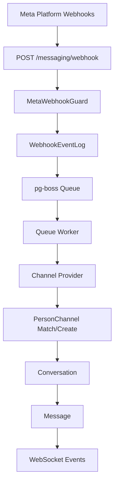

## Overview

The Messaging module provides a unified, channel-agnostic messaging system for WhatsApp, Instagram, and Facebook Messenger. It replaces the separate per-channel modules with shared entities, a shared queue, and a single WebSocket namespace.

<Note>
**Last Updated:** 2026-04-15  
**Status:** Active
</Note>

### Problem → Solution

| Problem | Solution |
| ------- | -------- |
| Duplicated logic across WhatsApp and Instagram modules | Single `MessagingModule` with channel providers |
| No webhook signature validation (security gap) | Shared `MetaWebhookGuard` validates `X-Hub-Signature-256` |
| Inconsistent WebSocket auth (Instagram gateway has no JWT) | Single `/messaging` gateway with JWT auth |
| No Facebook Messenger support | Third channel provider |
| Separate entity schemas per channel | Unified entities: `Conversation`, `Message`, `ChannelAccount` |
| No shared queue infrastructure | Shared `PgBossQueueService` for messaging + notifications |

### Key Design Decisions

<AccordionGroup>
  <Accordion title="Queue System (pg-boss over BullMQ)">
    Project already uses pg-boss for notifications. No new Redis dependency. Interface-based design (`IQueueService`) allows swapping later.
  </Accordion>

  <Accordion title="Direct PersonChannel FK on Conversation">
    Conversations link directly to the CRM's `PersonChannel` via FK. Simpler model, no bidirectional sync overhead. The lead FK was moved from Conversation to Lead (`Lead.sourceConversation`).
  </Accordion>

  <Accordion title="Archive as boolean, not status">
    `Conversation.isArchived` is orthogonal to `status` (OPEN/CLOSED), following `ARCHIVE_SYSTEM_SPECIFICATION.md`.
  </Accordion>

  <Accordion title="ConversationAssignment entity">
    Dedicated `conversation_assignment` table instead of CRM `entity_stakeholder` pattern. Each assignment is one row with nullable `user_id` and `team_id`.
  </Accordion>

  <Accordion title="Transactional outbox">
    Outbound messages use an outbox table written in the same DB transaction as the Message entity, guaranteeing at-least-once delivery.
  </Accordion>
</AccordionGroup>

## Architecture & Module Structure



### Module Structure

```
src/modules/meta-platform/    ← Top-level infra module
  meta-platform.module.ts
  meta-graph-api.service.ts
  meta-webhook.guard.ts
  webhook-event-log.entity.ts

src/modules/messaging/
  messaging.module.ts
  entities/               ← Core entities
  services/               ← Core services + providers/
    providers/            ← WhatsApp, Instagram, Messenger
  controllers/            ← API endpoints
  gateways/               ← WebSocket gateway
  queues/                 ← Queue workers
```

## Multi-Tenancy Patterns

<Warning>
The messaging module introduces unique multi-tenancy challenges because webhooks arrive without org context.
</Warning>

### Two-Step RLS Bypass

The webhook controller receives events for ALL organizations from a single Meta App:

<Steps>
  <Step title="Find organization (bypass RLS)">
    ```typescript
    const account = await this.tenantContext.executeReadOnlyWithBypass(async (em) => {
      return em.findOne(ChannelAccount, { externalAccountId: job.data.accountId });
    });
    ```
  </Step>
  
  <Step title="Process within org context">
    ```typescript
    await this.tenantContext.executeInOrg(
      account.organization.id,
      async (em) => {
        await this.processMessageInTransaction(em, job.data);
      },
      { userId: undefined },
    );
    ```
  </Step>
</Steps>

### Composable Transaction Pattern

Services expose `*InTransaction` methods for existing transactions:

```typescript
// Public API — wraps TenantContext
async matchOrCreate(channel, identifier, profileData, orgId): Promise<MatchResult>;

// Composable — accepts EntityManager from caller's transaction
async matchOrCreateInTransaction(em, channel, identifier, profileData, orgId): Promise<MatchResult>;
```

<Info>
The `em` parameter must always be the one provided by the TenantContext callback — never `this.em`.
</Info>

## Entities

### Core Entities

<CardGroup cols={2}>
  <Card title="ChannelAccount" href="#channel-account">
    Organization's connected social media accounts
  </Card>
  <Card title="Conversation" href="#conversation">
    Messaging threads between contacts and organization
  </Card>
  <Card title="Message" href="#message">
    Individual messages within conversations
  </Card>
  <Card title="MessageTemplate" href="#message-template">
    Reusable message templates and AI prompts
  </Card>
</CardGroup>

### ChannelAccount

```typescript
@Entity('channel_account')
export class ChannelAccount {
  @PrimaryGeneratedColumn('uuid')
  id: string;

  @ManyToOne(() => Organization)
  organization: Organization;

  @Column({ type: 'enum', enum: Channel })
  channel: Channel;

  @Column()
  externalAccountId: string; // WABA ID, IG Business Account ID, or FB Page ID

  @Column()
  displayName: string;

  @Column({ nullable: true })
  pageId?: string; // For Instagram: FB Page ID for Send API

  @Column({ type: 'enum', enum: AccountLevel })
  level: AccountLevel; // ORGANIZATION | PERSONAL

  @Column({ type: 'enum', enum: AiMode })
  defaultAiMode: AiMode;

  @Column({ type: 'jsonb', nullable: true })
  metadata?: Record<string, any>;
}
```

### Conversation

```typescript
@Entity('conversation')
export class Conversation {
  @PrimaryGeneratedColumn('uuid')
  id: string;

  @ManyToOne(() => ChannelAccount)
  channelAccount: ChannelAccount;

  @ManyToOne(() => PersonChannel)
  personChannel: PersonChannel;

  @Column({ nullable: true })
  contactId?: string; // For merged contacts

  @Column()
  externalThreadId: string;

  @Column({ type: 'enum', enum: ConversationStatus })
  status: ConversationStatus;

  @Column({ default: false })
  isArchived: boolean;

  @Column({ type: 'enum', enum: AiMode })
  aiMode: AiMode;

  @OneToMany(() => ConversationAssignment, assignment => assignment.conversation)
  assignments: ConversationAssignment[];
}
```

### Message

```typescript
@Entity('message')
export class Message {
  @PrimaryGeneratedColumn('uuid')
  id: string;

  @ManyToOne(() => Conversation)
  conversation: Conversation;

  @Column()
  externalMessageId: string;

  @Column({ type: 'enum', enum: MessageDirection })
  direction: MessageDirection; // INBOUND | OUTBOUND

  @Column({ type: 'enum', enum: MessageType })
  type: MessageType; // TEXT | MEDIA | TEMPLATE | etc.

  @Column({ type: 'jsonb' })
  content: MessageContent;

  @Column({ type: 'enum', enum: MessageStatus })
  status: MessageStatus;

  @Column({ nullable: true })
  senderId?: string; // User ID for outbound messages

  @CreateDateColumn()
  createdAt: Date;
}
```

## Enums

### Core Enums

```typescript
export enum Channel {
  WHATSAPP = 'whatsapp',
  INSTAGRAM = 'instagram', 
  MESSENGER = 'messenger',
}

export enum MessageDirection {
  INBOUND = 'inbound',
  OUTBOUND = 'outbound',
}

export enum MessageType {
  TEXT = 'text',
  MEDIA = 'media',
  TEMPLATE = 'template',
  INTERACTIVE = 'interactive',
  SYSTEM = 'system',
}

export enum ConversationStatus {
  OPEN = 'open',
  CLOSED = 'closed',
}

export enum AiMode {
  OFF = 'off',
  AUTO_REPLY = 'auto_reply',
  SUGGEST_ONLY = 'suggest_only', 
  DRAFT = 'draft',
}
```

## Message Flows

### Inbound Message Processing

<Steps>
  <Step title="Webhook Receipt">
    Meta sends webhook to `/messaging/webhook` with signature validation
  </Step>
  
  <Step title="Queue Processing">
    Worker processes webhook event:
    - Find organization by account ID
    - Execute in org context
    - Route to channel provider
  </Step>
  
  <Step title="Entity Resolution">
    - Match/create PersonChannel
    - Match/create Person + Lead
    - Find/create Conversation
  </Step>
  
  <Step title="Message Creation">
    - Create Message entity
    - Create CRM Activity
    - Update PersonChannel stats
  </Step>
  
  <Step title="Event Emission">
    - Emit WebSocket events
    - Emit notification events
  </Step>
</Steps>

### Outbound Message Flow

<Steps>
  <Step title="API Request">
    POST `/messaging/conversations/{id}/messages` with message content
  </Step>
  
  <Step title="Transactional Outbox">
    Single transaction creates:
    - Message entity
    - MessageOutbox entry
  </Step>
  
  <Step title="Queue Processing">
    Message sender worker:
    - Sends to Meta API
    - Updates message status
    - Deletes outbox entry
  </Step>
</Steps>

## Business Rules

### AI Mode Cascade

<Info>
AI mode follows a cascading default system:
</Info>

1. **Conversation.aiMode** (explicit setting)
2. **ChannelAccount.defaultAiMode** (account default)  
3. **Organization AI default** (org setting)
4. **OFF** (system default)

### Assignment Rules

<CardGroup cols={2}>
  <Card title="Direct Assignment">
    `user_id` + `team_id: null` = Agent directly assigned
  </Card>
  <Card title="Team Assignment">
    `user_id: null` + `team_id` = Team pool assignment
  </Card>
  <Card title="Agent on Behalf">
    `user_id` + `team_id` = Agent representing team
  </Card>
  <Card title="Multiple Assignments">
    Multiple rows supported per conversation
  </Card>
</CardGroup>

### Template Resolution

<Tabs>
  <Tab title="META_APPROVED">
    Platform-approved templates with variable substitution
  </Tab>
  <Tab title="QUICK_REPLY">
    Agent shortcuts with variable resolution from Person/Lead data
  </Tab>
  <Tab title="AI_PROMPT">
    System prompts for AI responses, optional SystemPrompt link
  </Tab>
</Tabs>

## RBAC Permissions & Access Control

### Permission Levels

```typescript
export const MESSAGING_PERMISSIONS = {
  MESSAGING_VIEW: 'messaging.view',
  MESSAGING_WRITE: 'messaging.write', 
  MESSAGING_MANAGE: 'messaging.manage',
} as const;
```

### Resource Permissions

The `ConversationPermissionService` computes per-conversation permissions:

<AccordionGroup>
  <Accordion title="MESSAGING_MANAGE">
    Full access: `canView`, `canReply`, `canEdit`, `canTransfer`, `canArchive`
  </Accordion>
  
  <Accordion title="MESSAGING_WRITE">
    Standard access: `canView`, `canReply` only
  </Accordion>
  
  <Accordion title="Personal Account Owner">
    Account owner gets `canView`, `canReply` for their accounts
  </Accordion>
  
  <Accordion title="Assigned Agent">
    Assigned user gets `canView` + assignment's `canReply` flag
  </Accordion>
  
  <Accordion title="Team Member">
    Team member gets `canView` + team assignment's `canReply` flag
  </Accordion>
</AccordionGroup>

## API Endpoints

### Conversation Management

<CodeGroup>
```typescript GET /messaging/conversations
// List conversations with filters
{
  "page": 1,
  "limit": 20,
  "status": "open",
  "channel": "whatsapp",
  "assignedTo": "user-id"
}
```

```typescript POST /messaging/conversations/{id}/messages
// Send message
{
  "type": "text",
  "content": {
    "text": "Hello, how can I help?"
  }
}
```

```typescript PATCH /messaging/conversations/{id}
// Update conversation
{
  "status": "closed",
  "aiMode": "auto_reply"
}
```
</CodeGroup>

### Channel Account Management

<CodeGroup>
```typescript GET /messaging/accounts
// List channel accounts
{
  "channel": "whatsapp",
  "level": "organization"
}
```

```typescript POST /messaging/accounts/connect
// Connect new account
{
  "channel": "instagram", 
  "level": "personal",
  "code": "oauth-code"
}
```
</CodeGroup>

## WebSocket Events & Room Architecture

### Room Structure

<CardGroup cols={2}>
  <Card title="User Rooms">
    `user:{userId}` - Personal notifications and updates
  </Card>
  <Card title="Conversation Rooms">
    `conversation:{conversationId}` - Real-time conversation updates
  </Card>
  <Card title="Inbox Rooms">
    `inbox:{userId}` - Inbox state changes and assignments
  </Card>
  <Card title="Team Rooms">
    `team:{teamId}` - Team-wide messaging notifications
  </Card>
</CardGroup>

### Event Types

```typescript
// Message events
'message-received'   // New inbound message
'message-sent'      // Outbound message status update
'message-failed'    // Message send failure

// Conversation events  
'conversation-created'    // New conversation
'conversation-updated'    // Status, assignment, or AI mode change
'conversation-archived'   // Archive state change

// Assignment events
'conversation-assigned'   // Assignment created/updated
'conversation-transferred' // Assignment changed

// Typing indicators
'user-typing'        // User started typing
'user-stopped-typing' // User stopped typing
```

## Queue Infrastructure

### Queue Jobs

<Tabs>
  <Tab title="webhook-processor">
    Processes incoming Meta webhooks, creates messages and conversations
  </Tab>
  <Tab title="message-sender">
    Sends outbound messages via Meta APIs, updates status
  </Tab>
  <Tab title="media-downloader">
    Downloads and processes media attachments
  </Tab>
  <Tab title="automation-processor">
    Executes automation rules and AI responses
  </Tab>
</Tabs>

### Retry Strategy

<Steps>
  <Step title="Immediate Retry">
    Failed jobs retry immediately up to 3 times
  </Step>
  
  <Step title="Exponential Backoff">
    Subsequent retries use exponential backoff: 1min, 5min, 15min
  </Step>
  
  <Step title="Dead Letter Queue">
    Jobs failing after 10 attempts move to dead letter queue
  </Step>
  
  <Step title="Manual Recovery">
    Dead letter jobs can be manually retried via admin interface
  </Step>
</Steps>

## Error Handling & Retry Strategy

### Webhook Processing Errors

<Warning>
Webhook processing must be idempotent due to Meta's retry behavior.
</Warning>

```typescript
// Idempotency check
const existingEvent = await em.findOne(WebhookEventLog, {
  externalEventId: webhook.entry[0].id,
  organizationId: account.organizationId,
});

if (existingEvent) {
  return { status: 'duplicate', eventId: existingEvent.id };
}
```

### API Rate Limiting

Meta APIs have rate limits that must be respected:

- **WhatsApp**: 1000 messages per 24h for trial accounts
- **Instagram**: 1000 API calls per hour per user  
- **Messenger**: Standard Graph API rate limits apply

### Circuit Breaker Pattern

```typescript
@Injectable()
export class MetaApiService {
  private circuitBreaker = new CircuitBreaker({
    timeout: 10000,
    errorThresholdPercentage: 50,
    resetTimeout: 30000,
  });
}
```

## Deployment Considerations

### Environment Variables

```bash
# Meta Platform
META_APP_ID=your-app-id
META_APP_SECRET=your-app-secret
META_WEBHOOK_VERIFY_TOKEN=your-verify-token

# WhatsApp Business API
WHATSAPP_BUSINESS_ACCOUNT_ID=your-waba-id
WHATSAPP_ACCESS_TOKEN=your-access-token

# Queue Configuration
PGBOSS_ARCHIVE_COMPLETED_AFTER_SECONDS=3600
PGBOSS_DELETE_AFTER_SECONDS=86400
```

### Database Migrations

<Check>
All messaging entities support incremental migration from legacy modules.
</Check>

Key migration considerations:

1. **Conversation Assignment Backfill**: Migrate from flat `assigned_agent_id`/`assigned_team_id` columns
2. **PersonChannel Linking**: Link existing conversations to PersonChannel entities  
3. **Message Content Migration**: Transform legacy message formats to unified schema
4. **Template Migration**: Consolidate templates from multiple modules

### Monitoring & Observability

<CardGroup cols={2}>
  <Card title="Queue Metrics">
    Monitor job processing rates, failures, and queue depth
  </Card>
  <Card title="API Metrics">
    Track Meta API response times, rate limits, and errors  
  </Card>
  <Card title="WebSocket Metrics">
    Monitor connection counts, message delivery, and room subscriptions
  </Card>
  <Card title="Business Metrics">
    Track message volumes, response times, and conversation resolution
  </Card>
</CardGroup>

## Testing Strategy

### Unit Tests

<Tabs>
  <Tab title="Channel Providers">
    Test webhook parsing, message formatting, API calls
  </Tab>
  <Tab title="Queue Workers">
    Test job processing, error handling, retry logic
  </Tab>
  <Tab title="Permission Service">
    Test access control logic for various user roles
  </Tab>
  <Tab title="Entity Services">
    Test CRUD operations, business rules, validation
  </Tab>
</Tabs>

### Integration Tests

```typescript
describe('Messaging Integration', () => {
  it('should process WhatsApp webhook end-to-end', async () => {
    // Send webhook
    const response = await request(app)
      .post('/messaging/webhook')
      .set('X-Hub-Signature-256', validSignature)
      .send(whatsappWebhook);

    // Wait for queue processing
    await waitForJobCompletion('webhook-processor');

    // Verify entities created
    const conversation = await findConversation();
    const message = await findMessage();
    
    expect(conversation).toBeDefined();
    expect(message).toBeDefined();
  });
});
```

### E2E Tests

<Steps>
  <Step title="Account Connection">
    Test OAuth flow for connecting Instagram/Messenger accounts
  </Step>
  
  <Step title="Message Flow">
    Test complete inbound → processing → WebSocket → UI flow
  </Step>
  
  <Step title="Assignment Flow">
    Test conversation assignment, transfer, and team workflows
  </Step>
  
  <Step title="AI Integration">
    Test AI mode changes and automated response generation
  </Step>
</Steps>

## Legacy Module Removal

### Migration Timeline

<Warning>
Legacy WhatsApp and Instagram modules will be removed after successful migration.
</Warning>

<Steps>
  <Step title="Phase 1: Parallel Operation">
    - New messaging module handles new conversations
    - Legacy modules handle existing conversations
    - Gradual migration of active conversations
  </Step>
  
  <Step title="Phase 2: Data Migration">
    - Migrate conversation history
    - Migrate message templates  
    - Migrate account configurations
  </Step>
  
  <Step title="Phase 3: Module Removal">
    - Remove legacy controllers and services
    - Remove legacy entities and migrations
    - Update frontend routing
  </Step>
</Steps>

### Breaking Changes

<CardGroup cols={2}>
  <Card title="API Endpoints">
    Legacy `/whatsapp/*` and `/instagram/*` endpoints deprecated
  </Card>
  <Card title="WebSocket Events">
    Legacy gateway events replaced with unified `/messaging` events
  </Card>
  <Card title="Entity References">
    Foreign keys updated to reference unified entities
  </Card>
  <Card title="Queue Jobs">
    Legacy queue jobs replaced with unified processors
  </Card>
</CardGroup>

## Known Gaps & Technical Debt

### Current Limitations

<AccordionGroup>
  <Accordion title="Meta Business Verification">
    Requires manual verification process for production WhatsApp access. Cannot be automated.
  </Accordion>
  
  <Accordion title="Message Templates">
    Meta-approved templates require separate approval process. Not handled in application.
  </Accordion>
  
  <Accordion title="Media Storage">
    Large media files may exceed database storage limits. Consider external storage.
  </Accordion>
  
  <Accordion title="Rate Limit Handling">
    Basic rate limiting implemented. Advanced queuing strategies needed for high volume.
  </Accordion>
</AccordionGroup>

### Future Improvements

<Tip>
Consider these enhancements for future iterations:
</Tip>

- **Redis Cache Layer**: Cache frequently accessed conversations and accounts
- **Message Search**: Full-text search across conversation history  
- **Analytics Dashboard**: Message volume, response time, and satisfaction metrics
- **Automation Builder**: Visual workflow builder for complex automation rules
- **Multi-language Support**: Template and AI response localization

## Related Documentation

<CardGroup cols={2}>
  <Card title="Multi-Tenancy Guide" href="/backend/multi-tenancy">
    RLS patterns and tenant isolation strategies
  </Card>
  <Card title="Queue System" href="/backend/queue">
    pg-boss configuration and job management
  </Card>
  <Card title="WebSocket Architecture" href="/backend/websockets">
    Real-time event system and room management
  </Card>
  <Card title="RBAC System" href="/backend/rbac">
    Role-based access control and permissions
  </Card>
</CardGroup>

---

<Note>
This specification is actively maintained and updated as the messaging system evolves. For the latest changes, refer to the git history and related pull requests.
</Note>