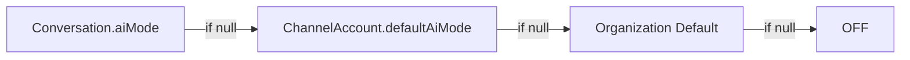

<Note>
**Last Updated:** 2026-06-01  
**Status:** Active
</Note>

## Overview

The Messaging module provides a unified, channel-agnostic messaging system for WhatsApp, Instagram, and Facebook Messenger. It replaces the separate per-channel modules with shared entities, a shared queue, and a single WebSocket namespace.

### Problem → Solution

<AccordionGroup>
  <Accordion title="Architecture Consolidation">
    | Problem | Solution |
    |---------|----------|
    | Duplicated logic across WhatsApp and Instagram modules | Single `MessagingModule` with channel providers |
    | No webhook signature validation (security gap) | Shared `MetaWebhookGuard` validates `X-Hub-Signature-256` |
    | Inconsistent WebSocket auth (Instagram gateway has no JWT) | Single `/messaging` gateway with JWT auth |
    | No Facebook Messenger support | Third channel provider |
    | Separate entity schemas per channel | Unified entities: `Conversation`, `Message`, `ChannelAccount` |
    | No shared queue infrastructure | Shared `PgBossQueueService` for messaging + notifications |
  </Accordion>
</AccordionGroup>

### Key Design Decisions

<CardGroup cols={2}>
  <Card title="Queue Infrastructure" icon="layer-group">
    **pg-boss over BullMQ** — Project already uses pg-boss for notifications. No new Redis dependency. Interface-based design (`IQueueService`) allows swapping later.
  </Card>
  
  <Card title="CRM Integration" icon="link">
    **Direct PersonChannel FK** — Conversations link directly to the CRM's `PersonChannel` via FK. Simpler model, no bidirectional sync overhead.
  </Card>
  
  <Card title="Archive System" icon="box-archive">
    **Archive as boolean** — `Conversation.isArchived` is orthogonal to `status` (OPEN/CLOSED), following `ARCHIVE_SYSTEM_SPECIFICATION.md`.
  </Card>
  
  <Card title="Assignment Model" icon="user-check">
    **Dedicated Assignment Entity** — `ConversationAssignment` table instead of CRM `entity_stakeholder` pattern.
  </Card>
</CardGroup>

<Info>
The messaging module uses a three-tier template system: `META_APPROVED` (platform-approved), `QUICK_REPLY` (agent shortcuts with variable resolution), and `AI_PROMPT` (AI system prompts).
</Info>

---

## Architecture & Module Structure

### Module Organization

The Messaging module follows a provider-based architecture with shared infrastructure:

```
src/messaging/
├── messaging.module.ts           # Root module registration
├── entities/                     # Shared entities across all channels
├── providers/
│   ├── whatsapp/                # WhatsApp-specific logic
│   ├── instagram/               # Instagram-specific logic
│   └── messenger/               # Messenger-specific logic
├── services/
│   ├── conversation.service.ts
│   ├── message.service.ts
│   └── channel-account.service.ts
├── gateways/
│   └── messaging.gateway.ts     # Unified WebSocket gateway
├── controllers/
│   ├── messaging.controller.ts
│   └── meta-webhook.controller.ts
├── guards/
│   └── meta-webhook.guard.ts
└── queue/
    └── pgboss-queue.service.ts
```

### Core Services

<AccordionGroup>
  <Accordion title="ConversationService">
    Manages conversation lifecycle, assignment, archival, and AI mode configuration.
    
    **Key Methods:**
    - `create()` - Creates new conversation with lead/contact resolution
    - `findByChannelAccountAndPerson()` - Retrieves or creates conversation
    - `assignToUser()` / `assignToTeam()` - Manages assignments
    - `archive()` / `unarchive()` - Controls archive state
    - `updateAiMode()` - Configures AI participation level
  </Accordion>
  
  <Accordion title="MessageService">
    Handles message creation, media processing, and outbound delivery.
    
    **Key Methods:**
    - `createInbound()` - Processes incoming webhook messages
    - `createOutbound()` - Queues outbound messages via transactional outbox
    - `processMediaUrl()` - Downloads and stores media attachments
    - `markAsRead()` - Updates read status and timestamps
  </Accordion>
  
  <Accordion title="ChannelAccountService">
    Manages Meta channel accounts (WhatsApp, Instagram, Messenger) with OAuth flows.
    
    **Key Methods:**
    - `connectOrganizationAccount()` - Links organization-level accounts
    - `connectPersonalAccount()` - Links user personal accounts
    - `disconnect()` - Safely removes account and soft-deletes conversations
    - `validateWebhookToken()` - Verifies webhook signatures
  </Accordion>
</AccordionGroup>

---

## Multi-Tenancy Patterns

### Organization Isolation

<Steps>
  <Step title="Organization-level Accounts">
    Organization accounts (WhatsApp Business API, Instagram Business, Facebook Pages) are shared across all organization members with appropriate RBAC permissions.
  </Step>
  
  <Step title="Personal Accounts">
    Personal accounts are user-owned and isolated. Only the owning user can send messages. Personal WhatsApp accounts reuse the organization's WABA token.
  </Step>
  
  <Step title="Cross-Tenant Guards">
    All queries and mutations enforce organization context through `organizationId` filters. WebSocket rooms are namespaced per organization.
  </Step>
</Steps>

<Warning>
Personal accounts on Instagram and Messenger use their own Page Access Token obtained via OAuth. WhatsApp personal accounts share the organization's WABA token but maintain separate channel account records.
</Warning>

### Organization Lifecycle Integration

The `MessagingOrganizationLifecycleListener` handles organization deletion/restore:

<Tabs>
  <Tab title="Deletion Flow">
    ```typescript
    async handleOrganizationDeleted(organizationId: string) {
      // 1. Disconnect all WebSocket clients organization-wide
      await this.messagingGateway.disconnectOrganization(organizationId);
      
      // 2. Pause all Meta channel accounts (non-destructive)
      await this.channelAccountService.pauseAccountsForOrganization(organizationId);
    }
    ```
  </Tab>
  
  <Tab title="Restore Flow">
    ```typescript
    async handleOrganizationRestored(organizationId: string) {
      // Resume all previously paused accounts
      await this.channelAccountService.resumeAccountsForOrganization(organizationId);
    }
    ```
  </Tab>
</Tabs>

---

## Entities

### Conversation

The central entity linking channel accounts, persons, and messaging threads.

<CodeGroup>
```typescript Entity Schema
@Entity('conversation')
export class Conversation extends BaseEntity {
  @Column({ type: 'uuid' })
  organizationId: string;

  @Column({ type: 'uuid' })
  channelAccountId: string;

  @Column({ type: 'uuid' })
  personChannelId: string;

  @Column({ type: 'uuid', nullable: true })
  contactId?: string; // Cached canonical contact

  @Column({ type: 'enum', enum: ConversationStatus })
  status: ConversationStatus; // OPEN | CLOSED

  @Column({ type: 'boolean', default: false })
  isArchived: boolean;

  @Column({ type: 'enum', enum: AiMode })
  aiMode: AiMode; // OFF | AUTO_REPLY | SUGGEST_ONLY | DRAFT

  @Column({ type: 'timestamp', nullable: true })
  lastMessageAt?: Date;

  @Column({ type: 'timestamp', nullable: true })
  lastInboundAt?: Date;

  @Column({ type: 'timestamp', nullable: true })
  lastOutboundAt?: Date;
}
```

```typescript Relations
@ManyToOne(() => ChannelAccount)
@JoinColumn({ name: 'channel_account_id' })
channelAccount: ChannelAccount;

@ManyToOne(() => PersonChannel)
@JoinColumn({ name: 'person_channel_id' })
personChannel: PersonChannel;

@ManyToOne(() => Contact, { nullable: true })
@JoinColumn({ name: 'contact_id' })
contact?: Contact;

@OneToMany(() => Message, message => message.conversation)
messages: Message[];

@OneToMany(() => ConversationAssignment, assignment => assignment.conversation)
assignments: ConversationAssignment[];
```
</CodeGroup>

<Note>
**Lead Relationship:** The lead FK was moved from Conversation to Lead (`Lead.sourceConversation`). Conversation detail loads the single active lead through that FK. Lead list/kanban/detail DTOs expose `person.channels` for routing into the Inbox.
</Note>

### Message

Represents individual messages with media attachments and delivery status.

```typescript
@Entity('message')
export class Message extends BaseEntity {
  @Column({ type: 'uuid' })
  conversationId: string;

  @Column({ type: 'enum', enum: MessageDirection })
  direction: MessageDirection; // INBOUND | OUTBOUND

  @Column({ type: 'enum', enum: MessageType })
  type: MessageType; // TEXT | IMAGE | VIDEO | AUDIO | DOCUMENT | LOCATION | CONTACTS | STICKER | REACTION | UNSUPPORTED

  @Column({ type: 'text', nullable: true })
  text?: string;

  @Column({ type: 'jsonb', nullable: true })
  media?: MessageMedia; // URL, mimeType, caption, size

  @Column({ type: 'enum', enum: MessageStatus })
  status: MessageStatus; // PENDING | SENT | DELIVERED | READ | FAILED

  @Column({ type: 'varchar', nullable: true })
  externalId?: string; // Platform message ID

  @Column({ type: 'uuid', nullable: true })
  sentByUserId?: string;

  @Column({ type: 'timestamp', nullable: true })
  sentAt?: Date;

  @Column({ type: 'timestamp', nullable: true })
  deliveredAt?: Date;

  @Column({ type: 'timestamp', nullable: true })
  readAt?: Date;
}
```

<Info>
Messages use a transactional outbox pattern. Outbound messages are written to the `Message` entity and `message_outbox` table in the same transaction, guaranteeing at-least-once delivery.
</Info>

### ChannelAccount

Represents connected Meta channel accounts (WhatsApp, Instagram, Messenger).

<CodeGroup>
```typescript Core Fields
@Entity('channel_account')
export class ChannelAccount extends BaseEntity {
  @Column({ type: 'uuid' })
  organizationId: string;

  @Column({ type: 'enum', enum: ChannelType })
  channel: ChannelType; // WHATSAPP | INSTAGRAM | MESSENGER

  @Column({ type: 'enum', enum: ChannelAccountLevel })
  level: ChannelAccountLevel; // ORGANIZATION | PERSONAL

  @Column({ type: 'uuid', nullable: true })
  ownerUserId?: string; // Required for PERSONAL level

  @Column({ type: 'varchar' })
  externalAccountId: string; // Meta WABA ID / Page ID

  @Column({ type: 'varchar', nullable: true })
  displayName?: string;

  @Column({ type: 'varchar', nullable: true })
  profilePictureUrl?: string;

  @Column({ type: 'enum', enum: ChannelAccountStatus })
  status: ChannelAccountStatus; // ACTIVE | DISCONNECTED | PAUSED

  @Column({ type: 'enum', enum: AiMode, nullable: true })
  defaultAiMode?: AiMode;

  @Column({ type: 'boolean', default: true })
  autoCreateLead: boolean; // Personal accounts default true
}
```

```typescript OAuth & Tokens
@Column({ type: 'text', nullable: true })
@Exclude() // Never serialize
encryptedAccessToken?: string;

@Column({ type: 'timestamp', nullable: true })
tokenExpiresAt?: Date;

@Column({ type: 'varchar', nullable: true })
webhookVerifyToken?: string;
```
</CodeGroup>

<Warning>
Personal WhatsApp accounts reuse the organization's WABA access token. Instagram and Messenger personal accounts use their own Page Access Token obtained via OAuth.
</Warning>

### ConversationAssignment

Dedicated assignment entity instead of using `entity_stakeholder`.

```typescript
@Entity('conversation_assignment')
export class ConversationAssignment extends BaseEntity {
  @Column({ type: 'uuid' })
  conversationId: string;

  @Column({ type: 'uuid', nullable: true })
  userId?: string; // Direct assignment or agent-on-behalf

  @Column({ type: 'uuid', nullable: true })
  teamId?: string; // Team pool or agent's team

  @Column({ type: 'boolean', default: false })
  isOwner: boolean; // Protected personal-account owner assignment

  @Column({ type: 'enum', enum: AssignmentSource })
  source: AssignmentSource; // AUTO | MANUAL | WORKFLOW | LEAD_STAKEHOLDER

  @ManyToOne(() => Conversation)
  @JoinColumn({ name: 'conversation_id' })
  conversation: Conversation;

  @ManyToOne(() => User, { nullable: true })
  @JoinColumn({ name: 'user_id' })
  user?: User;

  @ManyToOne(() => Team, { nullable: true })
  @JoinColumn({ name: 'team_id' })
  team?: Team;
}
```

<Accordion title="Assignment Types">
- **`user + null`**: Direct assignment (e.g., lead stakeholder, personal account owner)
- **`user + team`**: Agent on behalf of team
- **`null + team`**: Team pool assignment

The `isOwner` flag marks the single protected personal-account owner assignment row. Any active assignment whose `userId` matches the owner of a `PERSONAL` `ChannelAccount` is saved as `isOwner=true`.
</Accordion>

### MessageTemplate

Three-tier template system for different use cases.

```typescript
@Entity('message_template')
export class MessageTemplate extends BaseEntity {
  @Column({ type: 'uuid' })
  organizationId: string;

  @Column({ type: 'enum', enum: TemplateType })
  type: TemplateType; // META_APPROVED | QUICK_REPLY | AI_PROMPT

  @Column({ type: 'varchar' })
  name: string;

  @Column({ type: 'text' })
  content: string;

  @Column({ type: 'enum', enum: ChannelType })
  channel: ChannelType;

  @Column({ type: 'varchar', nullable: true })
  externalTemplateId?: string; // For META_APPROVED

  @Column({ type: 'jsonb', nullable: true })
  variables?: string[]; // Variable placeholders

  @Column({ type: 'enum', enum: TemplateStatus })
  status: TemplateStatus; // ACTIVE | PENDING_APPROVAL | REJECTED
}
```

---

## Enums

### ChannelType

```typescript
export enum ChannelType {
  WHATSAPP = 'WHATSAPP',
  INSTAGRAM = 'INSTAGRAM',
  MESSENGER = 'MESSENGER'
}
```

### ChannelAccountLevel

```typescript
export enum ChannelAccountLevel {
  ORGANIZATION = 'ORGANIZATION', // Shared across org
  PERSONAL = 'PERSONAL'          // User-owned
}
```

### ChannelAccountStatus

```typescript
export enum ChannelAccountStatus {
  ACTIVE = 'ACTIVE',           // Fully operational
  DISCONNECTED = 'DISCONNECTED', // OAuth revoked or manually removed
  PAUSED = 'PAUSED'            // Temporarily suspended (org lifecycle)
}
```

### ConversationStatus

```typescript
export enum ConversationStatus {
  OPEN = 'OPEN',     // Active conversation
  CLOSED = 'CLOSED'  // Resolved or inactive
}
```

<Note>
`isArchived` is orthogonal to `status`. Archived conversations can be OPEN or CLOSED. Standard inbox rail queries use `active` filter (archived hidden) by default.
</Note>

### MessageDirection

```typescript
export enum MessageDirection {
  INBOUND = 'INBOUND',   // From customer
  OUTBOUND = 'OUTBOUND'  // From agent/system
}
```

### MessageType

```typescript
export enum MessageType {
  TEXT = 'TEXT',
  IMAGE = 'IMAGE',
  VIDEO = 'VIDEO',
  AUDIO = 'AUDIO',
  DOCUMENT = 'DOCUMENT',
  LOCATION = 'LOCATION',
  CONTACTS = 'CONTACTS',
  STICKER = 'STICKER',
  REACTION = 'REACTION',
  UNSUPPORTED = 'UNSUPPORTED'
}
```

### MessageStatus

```typescript
export enum MessageStatus {
  PENDING = 'PENDING',     // Queued for delivery
  SENT = 'SENT',           // Accepted by Meta
  DELIVERED = 'DELIVERED', // Reached customer device
  READ = 'READ',           // Opened by customer
  FAILED = 'FAILED'        // Delivery failed
}
```

### AiMode

```typescript
export enum AiMode {
  OFF = 'OFF',               // No AI participation
  AUTO_REPLY = 'AUTO_REPLY', // AI responds automatically
  SUGGEST_ONLY = 'SUGGEST_ONLY', // AI suggests, agent sends
  DRAFT = 'DRAFT'            // AI drafts for review
}
```

<Info>
Default cascades: `ChannelAccount.defaultAiMode` → Organization default → `OFF`
</Info>

### TemplateType

```typescript
export enum TemplateType {
  META_APPROVED = 'META_APPROVED', // Platform-approved templates
  QUICK_REPLY = 'QUICK_REPLY',     // Agent shortcuts with variables
  AI_PROMPT = 'AI_PROMPT'          // AI system prompts
}
```

### AssignmentSource

```typescript
export enum AssignmentSource {
  AUTO = 'AUTO',               // Auto-routing (e.g., personal owner)
  MANUAL = 'MANUAL',           // Agent manual assignment
  WORKFLOW = 'WORKFLOW',       // Triggered by workflow
  LEAD_STAKEHOLDER = 'LEAD_STAKEHOLDER' // From lead stakeholder
}
```

---

## Message Flows

### Inbound Message Flow

<Steps>
  <Step title="Webhook Receipt">
    Meta sends webhook to `/webhooks/meta/:channel` with `X-Hub-Signature-256` header.
    
    ```typescript
    @Post('/webhooks/meta/:channel')
    @UseGuards(MetaWebhookGuard)
    async handleWebhook(@Body() payload: MetaWebhookPayload) {
      await this.metaWebhookService.processWebhook(payload);
    }
    ```
  </Step>
  
  <Step title="Signature Validation">
    `MetaWebhookGuard` validates HMAC signature using app secret.
    
    ```typescript
    const signature = request.headers['x-hub-signature-256'];
    const expectedSignature = crypto
      .createHmac('sha256', appSecret)
      .update(rawBody)
      .digest('hex');
    ```
  </Step>
  
  <Step title="Conversation Resolution">
    Find or create conversation for `channelAccountId + personChannelId`.
    
    - Reuses archived conversations without unarchiving
    - Handles deleted-predecessor detection for soft-deleted conversations
    - Creates replacement conversation with deleted-restart metadata
  </Step>
  
  <Step title="Message Creation">
    `MessageService.createInbound()` stores message and updates conversation timestamps.
    
    ```typescript
    const message = await this.messageService.createInbound({
      conversationId,
      type: this.mapMessageType(webhook.type),
      text: webhook.text?.body,
      media: await this.processMedia(webhook.media),
      externalId: webhook.id
    });
    ```
  </Step>
  
  <Step title="Lead & Contact Resolution">
    For new conversations:
    - Auto-create lead if `autoCreateLead=true`
    - Resolve canonical contact via `personChannel.person.contact`
    - Cache `contactId` on conversation
  </Step>
  
  <Step title="Assignment & Routing">
    MessageRouter (priority 0) handles assignment:
    - Personal account: Auto-assign owner as primary stakeholder
    - Organization account: Apply routing rules
    - Create `ConversationAssignment` rows
  </Step>
  
  <Step title="AI Processing">
    If `aiMode != OFF`, queue AI agent execution with inbound coalescing.
    
    ```typescript
    if (conversation.aiMode !== AiMode.OFF) {
      await this.queueService.send('ai-agent-execute', {
        conversationId,
        trigger: 'inbound_message'
      });
    }
    ```
  </Step>
  
  <Step title="WebSocket Broadcast">
    Emit `message-received` to relevant WebSocket rooms:
    - `conversation:{conversationId}`
    - `user:{assignedUserId}`
    - `team:{assignedTeamId}`
    
    ```typescript
    this.messagingGateway.broadcast({
      event: 'message-received',
      room: `conversation:${conversationId}`,
      payload: messageDto
    });
    ```
  </Step>
  
  <Step title="Notification Generation">
    Queue notification for assigned agents (unless archived).
    
    ```typescript
    await this.notificationService.create({
      type: NotificationType.NEW_MESSAGE,
      recipientId: assignment.userId,
      data: { conversationId, messageId }
    });
    ```
  </Step>
</Steps>

<Warning>
**Archive Suppression:** Live inbound webhooks reuse archived conversations for the same `channelAccount + personChannel` without unarchiving. New messages are stored, but notifications are suppressed and the live rail does not receive updates.
</Warning>

### Outbound Message Flow

<Steps>
  <Step title="API Request">
    Agent sends message via `/conversations/:id/messages` endpoint.
    
    ```typescript
    @Post('/conversations/:id/messages')
    @RequirePermissions(Permission.SEND_MESSAGE)
    async sendMessage(
      @Param('id') conversationId: string,
      @Body() dto: SendMessageDto,
      @AuthUser() user: User
    ) {
      return this.messageService.sendOutbound(conversationId, dto, user.id);
    }
    ```
  </Step>
  
  <Step title="Transactional Outbox">
    Write `Message` entity and `message_outbox` row in same transaction.
    
    ```typescript
    await this.dataSource.transaction(async manager => {
      const message = await manager.save(Message, {
        conversationId,
        direction: MessageDirection.OUTBOUND,
        type: dto.type,
        text: dto.text,
        status: MessageStatus.PENDING,
        sentByUserId: userId
      });
      
      await manager.save(MessageOutbox, {
        messageId: message.id,
        channelAccountId: conversation.channelAccountId,
        payload: this.buildPayload(message)
      });
    });
    ```
  </Step>
  
  <Step title="Queue Processing">
    pg-boss worker picks up outbox entries and sends to Meta Graph API.
    
    ```typescript
    @Queue('message-outbox-process')
    async processOutbox(job: { messageId: string }) {
      const outbox = await this.outboxRepo.findOne({ messageId });
      const result = await this.metaApiService.sendMessage(outbox.payload);
      
      await this.messageService.update(outbox.messageId, {
        status: MessageStatus.SENT,
        externalId: result.id,
        sentAt: new Date()
      });
      
      await this.outboxRepo.delete(outbox.id);
    }
    ```
  </Step>
  
  <Step title="Status Webhooks">
    Meta sends delivery/read status updates via webhook.
    
    ```typescript
    async handleStatusUpdate(webhook: MetaStatusWebhook) {
      await this.messageService.update(
        { externalId: webhook.id },
        {
          status: this.mapStatus(webhook.status),
          deliveredAt: webhook.status === 'delivered' ? new Date() : undefined,
          readAt: webhook.status === 'read' ? new Date() : undefined
        }
      );
    }
    ```
  </Step>
  
  <Step title="WebSocket Updates">
    Broadcast message status changes to connected clients.
    
    ```typescript
    this.messagingGateway.broadcast({
      event: 'message-status-updated',
      room: `conversation:${conversationId}`,
      payload: { messageId, status, timestamp }
    });
    ```
  </Step>
</Steps>

---

## Business Rules

### Conversation Creation & Lifecycle

<AccordionGroup>
  <Accordion title="New Conversation Rules">
    1. **Unique Constraint:** One active conversation per `channelAccountId + personChannelId`
    2. **Archive Reuse:** Inbound webhooks reuse archived conversations without unarchiving
    3. **Deleted Restart:** New messages to soft-deleted conversations create replacement with metadata
    4. **Lead Creation:** Auto-create lead if `ChannelAccount.autoCreateLead=true` (personal defaults true)
    5. **Contact Resolution:** Cache canonical `contactId` from `personChannel.person.contact`
  </Accordion>
  
  <Accordion title="Soft Deletion Rules">
    1. **Account Disconnect:** Soft-deletes and archives all conversations for `ChannelAccount`
    2. **Restore Option:** `restoreConversations=true` flips to `isDeleted=false, isArchived=false`
    3. **Replacement Conversations:** New inbound to deleted thread creates active replacement
    4. **No Lead Inheritance:** Replacement conversations don't create/link leads or auto-route
    5. **Contact Carry-Forward:** Only explicit `contactId` is preserved if contact is still active
  </Accordion>
  
  <Accordion title="Archive Rules">
    1. **Orthogonal to Status:** Archived conversations can be OPEN or CLOSED
    2. **Default Hidden:** Standard inbox rail uses `active` filter (archived hidden)
    3. **Explicit Query:** Archive bucket uses `isArchived=true` filter
    4. **No Unarchive on Inbound:** New messages to archived conversations don't unarchive
    5. **Detail Access:** Conversation detail can disable archive filter for review
  </Accordion>
</AccordionGroup>

### Assignment Rules

<Check>
**Lead Stakeholder Auto-Assignment:** For personal account owner's first assignment on `autoCreateLead` channels, auto-assign owner as primary stakeholder (100%, FULL) of the conversation's source lead. Skips if channel is not personal, has no owner, doesn't auto-create leads, conversation has no active source lead, or lead already has primary stakeholder.
</Check>

<Steps>
  <Step title="Personal Account Owner">
    Personal account owner is always assigned with `isOwner=true` flag. This assignment is protected and cannot be removed.
  </Step>
  
  <Step title="Multiple Assignments">
    Conversations support multiple assignments:
    - Direct agent (`user + null`)
    - Agent on behalf of team (`user + team`)
    - Team pool (`null + team`)
  </Step>
  
  <Step title="Transfer History">
    Assignment changes are tracked via:
    - WebSocket events (`conversation-updated`)
    - Notification events (`CONVERSATION_TRANSFERRED`)
  </Step>
  
  <Step title="Deletion Cascade">
    Soft-deleting a conversation soft-deletes all active assignment rows.
  </Step>
</Steps>

### AI Mode Cascade



<Info>
AI mode determines participation level:
- **OFF**: No AI involvement
- **AUTO_REPLY**: AI responds automatically
- **SUGGEST_ONLY**: AI suggests, agent sends
- **DRAFT**: AI drafts for agent review
</Info>

### Message Type Mapping

<Tabs>
  <Tab title="WhatsApp">
    | Meta Type | Internal Type | Notes |
    |-----------|---------------|-------|
    | `text` | `TEXT` | Plain text messages |
    | `image` | `IMAGE` | JPEG, PNG formats |
    | `video` | `VIDEO` | MP4, 3GP formats |
    | `audio` | `AUDIO` | AAC, AMR, MP3, OGG |
    | `document` | `DOCUMENT` | PDF, DOC, XLS, etc. |
    | `location` | `LOCATION` | Lat/long coordinates |
    | `contacts` | `CONTACTS` | vCard format |
    | `sticker` | `STICKER` | WhatsApp stickers |
    | `reaction` | `REACTION` | Emoji reactions |
  </Tab>
  
  <Tab title="Instagram">
    | Meta Type | Internal Type | Notes |
    |-----------|---------------|-------|
    | `text` | `TEXT` | Plain text messages |
    | `image` | `IMAGE` | Instagram photos |
    | `video` | `VIDEO` | Instagram videos |
    | `audio` | `AUDIO` | Voice messages |
    | `story_mention` | `TEXT` | Story mentions as text |
    | `story_reply` | `TEXT` | Story replies as text |
    | `reaction` | `REACTION` | Heart reactions |
  </Tab>
  
  <Tab title="Messenger">
    | Meta Type | Internal Type | Notes |
    |-----------|---------------|-------|
    | `text` | `TEXT` | Plain text messages |
    | `image` | `IMAGE` | Photo attachments |
    | `video` | `VIDEO` | Video attachments |
    | `audio` | `AUDIO` | Audio clips |
    | `file` | `DOCUMENT` | File attachments |
    | `location` | `LOCATION` | Shared locations |
  </Tab>
</Tabs>

### Contact Merge Handling

<Warning>
When duplicate Persons/Contacts are merged, conversations pointing at absorbed Contacts are re-pointed to the surviving Contact so messaging activity and AI mode history stay attached to the business record.
</Warning>

```typescript
async handleContactMerge(survivorId: string, absorbedIds: string[]) {
  await this.conversationRepo.update(
    { contactId: In(absorbedIds) },
    { contactId: survivorId }
  );
}
```

---

## RBAC Permissions & Access Control

### Core Permissions

<CodeGroup>
```typescript Conversation Permissions
export enum Permission {
  // Read permissions
  VIEW_CONVERSATIONS = 'messaging:conversations:view',
  VIEW_ALL_CONVERSATIONS = 'messaging:conversations:view:all',
  VIEW_TEAM_CONVERSATIONS = 'messaging:conversations:view:team',
  
  // Write permissions
  SEND_MESSAGE = 'messaging:messages:send',
  ASSIGN_CONVERSATION = 'messaging:conversations:assign',
  ARCHIVE_CONVERSATION = 'messaging:conversations:archive',
  CLOSE_CONVERSATION = 'messaging:conversations:close',
  
  // AI permissions
  CONFIGURE_AI_MODE = 'messaging:ai:configure',
  
  // Template permissions
  MANAGE_TEMPLATES = 'messaging:templates:manage',
  USE_QUICK_REPLIES = 'messaging:templates:quick-reply:use'
}
```

```typescript Channel Account Permissions
export enum Permission {
  // Account management
  CONNECT_ORG_CHANNEL = 'messaging:channels:connect:org',
  CONNECT_PERSONAL_CHANNEL = 'messaging:channels:connect:personal',
  DISCONNECT_CHANNEL = 'messaging:channels:disconnect',
  
  // Settings
  CONFIGURE_CHANNEL_SETTINGS = 'messaging:channels:settings',
  VIEW_WEBHOOK_LOGS = 'messaging:webhooks:view'
}
```
</CodeGroup>

### Access Control Rules

<Steps>
  <Step title="Conversation Visibility">
    Users can view conversations based on:
    - **Assigned to User:** Direct assignment matches `userId`
    - **Assigned to Team:** User is member of assigned team
    - **Personal Account Owner:** User owns the personal channel account
    - **VIEW_ALL_CONVERSATIONS:** Organization-wide access
  </Step>
  
  <Step title="Send Message">
    Users can send messages if:
    - They have `SEND_MESSAGE` permission
    - AND they can view the conversation (per visibility rules)
    - AND the channel account is ACTIVE
  </Step>
  
  <Step title="Assignment Control">
    Users with `ASSIGN_CONVERSATION` can:
    - Assign conversations to themselves
    - Assign to teams they are members of
    - Assign to other users (if they have `VIEW_ALL_CONVERSATIONS`)
    
    **Exception:** Cannot unassign protected `isOwner=true` assignments
  </Step>
  
  <Step title="Personal Account Access">
    Personal account owners have full control over their accounts:
    - Connect/disconnect their accounts
    - View all conversations for their accounts
    - Configure default AI mode
    - Access message history
  </Step>
</Steps>

<Check>
**Organization Admins** have all messaging permissions by default through the role hierarchy system.
</Check>

---

## Notification Types

### Message Notifications

<AccordionGroup>
  <Accordion title="NEW_MESSAGE">
    Triggered when inbound message arrives in assigned conversation.
    
    **Conditions:**
    - Conversation is not archived
    - User has active assignment
    - User is not the sender (for outbound echoes)
    
    **Data Payload:**
    ```typescript
    {
      conversationId: string;
      messageId: string;
      senderName: string;
      previewText: string;
      channelType: ChannelType;
    }
    ```
  </Accordion>
  
  <Accordion title="CONVERSATION_ASSIGNED">
    Triggered when conversation is assigned to user or their team.
    
    **Conditions:**
    - New assignment created
    - User is recipient of assignment
    
    **Data Payload:**
    ```typescript
    {
      conversationId: string;
      assignedBy: string;
      assignmentType: 'direct' | 'team';
      teamId?: string;
    }
    ```
  </Accordion>
  
  <Accordion title="CONVERSATION_TRANSFERRED">
    Triggered when conversation is reassigned from one user to another.
    
    **Conditions:**
    - Assignment changed
    - Previous assignee receives notification
    
    **Data Payload:**
    ```typescript
    {
      conversationId: string;
      transferredTo: string;
      transferredBy: string;
      reason?: string;
    }
    ```
  </Accordion>
  
  <Accordion title="AI_SUGGESTION_READY">
    Triggered when AI generates a suggested response.
    
    **Conditions:**
    - `aiMode = SUGGEST_ONLY`
    - AI successfully generates suggestion
    - Assigned agent receives notification
    
    **Data Payload:**
    ```typescript
    {
      conversationId: string;
      suggestionId: string;
      confidence: number;
    }
    ```
  </Accordion>
  
  <Accordion title="MESSAGE_FAILED">
    Triggered when outbound message fails to send.
    
    **Conditions:**
    - Message status = FAILED
    - Sending agent receives notification
    
    **Data Payload:**
    ```typescript
    {
      conversationId: string;
      messageId: string;
      errorCode: string;
      errorMessage: string;
    }
    ```
  </Accordion>
</AccordionGroup>

### Channel Account Notifications

<AccordionGroup>
  <Accordion title="CHANNEL_DISCONNECTED">
    Triggered when channel account is disconnected.
    
    **Recipients:**
    - Personal account: Owner only
    - Organization account: All organization admins
    
    **Data Payload:**
    ```typescript
    {
      channelAccountId: string;
      channelType: ChannelType;
      reason: 'manual' | 'token_expired' | 'oauth_revoked';
    }
    ```
  </Accordion>
  
  <Accordion title="WEBHOOK_VALIDATION_FAILED">
    Triggered when webhook signature validation fails repeatedly.
    
    **Recipients:** Organization admins
    
    **Data Payload:**
    ```typescript
    {
      channelAccountId: string;
      failureCount: number;
      lastAttempt: Date;
    }
    ```
  </Accordion>
</AccordionGroup>

---

## API Endpoints

### Conversation Endpoints

<AccordionGroup>
  <Accordion title="GET /conversations">
    List conversations with filtering and pagination.
    
    **Query Parameters:**
    ```typescript
    {
      status?: ConversationStatus;
      isArchived?: boolean;
      assignedToMe?: boolean;
      channelType?: ChannelType;
      search?: string;
      page?: number;
      limit?: number;
    }
    ```
    
    **Response:**
    ```typescript
    {
      data: ConversationDto[];
      meta: {
        total: number;
        page: number;
        limit: number;
      }
    }
    ```
    
    **Default Filters:**
    - `active` (not archived, not deleted)
    - Conversations visible to user per RBAC rules
  </Accordion>
  
  <Accordion title="GET /conversations/:id">
    Get conversation detail with messages.
    
    **Query Parameters:**
    ```typescript
    {
      includeArchived?: boolean; // Override default active filter
    }
    ```
    
    **Response:**
    ```typescript
    {
      id: string;
      status: ConversationStatus;
      isArchived: boolean;
      aiMode: AiMode;
      channelAccount: ChannelAccountDto;
      personChannel: PersonChannelDto;
      contact?: ContactDto;
      lead?: LeadDto; // Active source lead
      assignments: ConversationAssignmentDto[];
      recentMessages: MessageDto[];
      lastMessageAt: Date;
    }
    ```
  </Accordion>
  
  <Accordion title="POST /conversations/:id/messages">
    Send outbound message.
    
    **Request Body:**
    ```typescript
    {
      type: MessageType;
      text?: string;
      media?: {
        url?: string;
        file?: File; // Multipart upload
      };
      templateId?: string; // For quick replies
      variables?: Record<string, string>; // Template variables
    }
    ```
    
    **Response:**
    ```typescript
    {
      id: string;
      status: MessageStatus;
      sentAt: Date;
    }
    ```
  </Accordion>
  
  <Accordion title="PATCH /conversations/:id/assign">
    Assign conversation to user or team.
    
    **Request Body:**
    ```typescript
    {
      userId?: string;
      teamId?: string;
      source?: AssignmentSource;
    }
    ```
    
    **Business Rules:**
    - Cannot unassign `isOwner=true` assignments
    - User must have `ASSIGN_CONVERSATION` permission
    - Must have visibility to target user/team
  </Accordion>
  
  <Accordion title="PATCH /conversations/:id/archive">
    Archive or unarchive conversation.
    
    **Request Body:**
    ```typescript
    {
      isArchived: boolean;
    }
    ```
    
    **Effects:**
    - Updates `isArchived` flag
    - Broadcasts `conversation-updated` WebSocket event
    - Does not affect `status` (OPEN/CLOSED)
  </Accordion>
  
  <Accordion title="PATCH /conversations/:id/close">
    Close conversation.
    
    **Request Body:**
    ```typescript
    {
      reason?: string;
    }
    ```
    
    **Effects:**
    - Sets `status = CLOSED`
    - Does not archive automatically
    - Broadcasts `conversation-updated` WebSocket event
  </Accordion>
  
  <Accordion title="PATCH /conversations/:id/ai-mode">
    Update AI participation mode.
    
    **Request Body:**
    ```typescript
    {
      aiMode: AiMode;
    }
    ```
    
    **Permission:** `CONFIGURE_AI_MODE`
    
    **Effects:**
    - Updates conversation `aiMode`
    - If switching from OFF to active mode, queues initial AI execution
  </Accordion>
</AccordionGroup>

### Message Endpoints

<AccordionGroup>
  <Accordion title="GET /conversations/:id/messages">
    List messages for conversation with pagination.
    
    **Query Parameters:**
    ```typescript
    {
      before?: string; // Message ID cursor
      limit?: number; // Default 50
    }
    ```
    
    **Response:**
    ```typescript
    {
      data: MessageDto[];
      hasMore: boolean;
      nextCursor?: string;
    }
    ```
  </Accordion>
  
  <Accordion title="PATCH /messages/:id/read">
    Mark message as read.
    
    **Effects:**
    - Updates `readAt` timestamp
    - Broadcasts `message-status-updated` WebSocket event
    - May send read receipt to customer (channel-dependent)
  </Accordion>
</AccordionGroup>

### Channel Account Endpoints

<AccordionGroup>
  <Accordion title="GET /channel-accounts">
    List connected channel accounts.
    
    **Query Parameters:**
    ```typescript
    {
      channel?: ChannelType;
      level?: ChannelAccountLevel;
      status?: ChannelAccountStatus;
    }
    ```
    
    **Response:**
    ```typescript
    {
      data: ChannelAccountDto[];
    }
    ```
    
    **Visibility:**
    - Users see their personal accounts
    - Users with `VIEW_ALL_CONVERSATIONS` see organization accounts
  </Accordion>
  
  <Accordion title="POST /channel-accounts/connect/organization">
    Connect organization-level channel account via OAuth.
    
    **Request Body:**
    ```typescript
    {
      channel: ChannelType;
      code: string; // OAuth authorization code
      state: string; // HMAC-signed state with level=organization
    }
    ```
    
    **Permission:** `CONNECT_ORG_CHANNEL`
    
    **Flow:**
    1. Validate OAuth state signature and level
    2. Exchange code for access token
    3. Fetch account metadata from Meta Graph API
    4. Create `ChannelAccount` with encrypted token
    5. Subscribe to webhooks
  </Accordion>
  
  <Accordion title="POST /channel-accounts/connect/personal">
    Connect personal channel account via OAuth.
    
    **Request Body:**
    ```typescript
    {
      channel: ChannelType;
      code: string;
      state: string; // HMAC-signed state with level=personal
    }
    ```
    
    **Permission:** `CONNECT_PERSONAL_CHANNEL`
    
    **Notes:**
    - WhatsApp personal accounts reuse org WABA token
    - Instagram/Messenger use separate Page Access Token
    - Auto-enables `autoCreateLead=true` by default
  </Accordion>
  
  <Accordion title="DELETE /channel-accounts/:id">
    Disconnect channel account.
    
    **Effects:**
    1. Sets `status = DISCONNECTED`
    2. Soft-deletes and archives all conversations
    3. Soft-deletes all conversation assignments
    4. Disconnects WebSocket clients for affected conversations
    5. Revokes Meta webhook subscription (best effort)
    
    **Permission:**
    - Personal account: Owner only
    - Organization account: `DISCONNECT_CHANNEL`
  </Accordion>
  
  <Accordion title="POST /channel-accounts/:id/restore">
    Restore disconnected channel account.
    
    **Request Body:**
    ```typescript
    {
      restoreConversations?: boolean; // Default false
    }
    ```
    
    **Effects:**
    - Sets `status = ACTIVE`
    - If `restoreConversations=true`: Undeletes and unarchives conversations
    - If `restoreConversations=false`: New inbound creates replacement conversations
  </Accordion>
</AccordionGroup>

### Template Endpoints

<AccordionGroup>
  <Accordion title="GET /templates">
    List message templates.
    
    **Query Parameters:**
    ```typescript
    {
      type?: TemplateType;
      channel?: ChannelType;
      status?: TemplateStatus;
    }
    ```
    
    **Response:**
    ```typescript
    {
      data: MessageTemplateDto[];
    }
    ```
  </Accordion>
  
  <Accordion title="POST /templates">
    Create new template.
    
    **Request Body:**
    ```typescript
    {
      type: TemplateType;
      name: string;
      content: string;
      channel: ChannelType;
      variables?: string[];
    }
    ```
    
    **Permission:** `MANAGE_TEMPLATES`
    
    **Notes:**
    - `META_APPROVED` templates require platform approval (status=PENDING_APPROVAL)
    - `QUICK_REPLY` and `AI_PROMPT` are immediately ACTIVE
  </Accordion>
  
  <Accordion title="PATCH /templates/:id">
    Update template.
    
    **Request Body:**
    ```typescript
    {
      name?: string;
      content?: string;
      variables?: string[];
    }
    ```
    
    **Permission:** `MANAGE_TEMPLATES`
    
    **Notes:**
    - Cannot edit `META_APPROVED` templates (create new version instead)
  </Accordion>
  
  <Accordion title="DELETE /templates/:id">
    Delete template.
    
    **Permission:** `MANAGE_TEMPLATES`
    
    **Effects:**
    - Soft-deletes template
    - Does not affect historical messages using template
  </Accordion>
</AccordionGroup>

### Webhook Endpoints

<AccordionGroup>
  <Accordion title="GET /webhooks/meta/:channel">
    Webhook verification endpoint for Meta.
    
    **Query Parameters:**
    ```typescript
    {
      'hub.mode': 'subscribe';
      'hub.verify_token': string;
      'hub.challenge': string;
    }
    ```
    
    **Response:**
    Returns `hub.challenge` if `verify_token` matches.
  </Accordion>
  
  <Accordion title="POST /webhooks/meta/:channel">
    Webhook delivery endpoint for Meta.
    
    **Headers:**
    ```
    X-Hub-Signature-256: sha256=<signature>
    ```
    
    **Request Body:**
    ```typescript
    {
      object: 'whatsapp_business_account' | 'instagram' | 'page';
      entry: [{
        id: string;
        changes: [{
          field: string;
          value: WebhookValue;
        }]
      }]
    }
    ```
    
    **Processing:**
    1. Validate signature via `MetaWebhookGuard`
    2. Route to channel-specific processor
    3. Handle message, status, or account updates
    4. Return 200 OK immediately (process async)
  </Accordion>
</AccordionGroup>

---

## WebSocket Events & Room Architecture

### Gateway Configuration

<CodeGroup>
```typescript Gateway Setup
@WebSocketGateway({
  namespace: '/messaging',
  cors: {
    origin: process.env.FRONTEND_URL,
    credentials: true
  }
})
export class MessagingGateway {
  @UseGuards(JwtAuthGuard)
  handleConnection(client: Socket) {
    const user = client.data.user;
    
    // Join user's personal room
    client.join(`user:${user.id}`);
    
    // Join organization room
    client.join(`org:${user.organizationId}`);
    
    // Query and join conversation rooms
    this.joinUserConversations(client, user);
  }
}
```

```typescript Postgres IO Adapter
// Enables cluster-wide WebSocket communication
const io = new Server(server, {
  adapter: createAdapter(pgPool)
});

// Organization-wide disconnect
async disconnectOrganization(organizationId: string) {
  const sockets = await this.server
    .in(`org:${organizationId}`)
    .fetchSockets();
  
  sockets.forEach(socket => socket.disconnect(true));
}
```
</CodeGroup>

### Room Structure

<Tabs>
  <Tab title="User Rooms">
    Each connected user automatically joins:
    
    - **`user:{userId}`** — Direct messages for assigned conversations
    - **`org:{organizationId}`** — Organization-wide broadcasts
    - **`team:{teamId}`** — Team-based notifications (if team member)
  </Tab>
  
  <Tab title="Conversation Rooms">
    Users join conversation rooms for active assignments:
    
    - **`conversation:{conversationId}`** — Real-time message updates
    
    **Join Triggers:**
    - Initial connection (all assigned conversations)
    - New assignment (`conversation-assigned` event)
    - Manual join via `join-conversation` message
    
    **Leave Triggers:**
    - Conversation unassigned
    - Conversation archived (optional, configurable)
    - Manual leave via `leave-conversation` message
  </Tab>
  
  <Tab title="Channel Rooms">
    Optional rooms for channel-wide events:
    
    - **`channel:{channelAccountId}`** — Account-level events (disconnect, errors)
  </Tab>
</Tabs>

### Client Events (Client → Server)

<AccordionGroup>
  <Accordion title="join-conversation">
    Join a conversation room to receive real-time updates.
    
    **Payload:**
    ```typescript
    {
      conversationId: string;
    }
    ```
    
    **Validation:**
    - User has visibility to conversation (per RBAC rules)
    - Conversation is active (not soft-deleted)
    
    **Response:**
    ```typescript
    {
      success: boolean;
      room: string; // 'conversation:{conversationId}'
    }
    ```
  </Accordion>
  
  <Accordion title="leave-conversation">
    Leave a conversation room.
    
    **Payload:**
    ```typescript
    {
      conversationId: string;
    }
    ```
  </Accordion>
  
  <Accordion title="mark-typing">
    Indicate user is typing in conversation.
    
    **Payload:**
    ```typescript
    {
      conversationId: string;
      isTyping: boolean;
    }
    ```
    
    **Broadcast:** Emits `user-typing` to conversation room (except sender)
  </Accordion>
  
  <Accordion title="mark-read">
    Mark conversation messages as read.
    
    **Payload:**
    ```typescript
    {
      conversationId: string;
      messageId: string; // Latest read message
    }
    ```
    
    **Effects:**
    - Updates `Message.readAt` for unread messages
    - Broadcasts `messages-read` to conversation room
  </Accordion>
</AccordionGroup>

### Server Events (Server → Client)

<AccordionGroup>
  <Accordion title="message-received">
    New inbound message arrived.
    
    **Target Rooms:**
    - `conversation:{conversationId}`
    - `user:{assignedUserId}`
    - `team:{assignedTeamId}`
    
    **Payload:**
    ```typescript
    {
      conversationId: string;
      message: MessageDto;
      sender: PersonChannelDto;
    }
    ```
  </Accordion>
  
  <Accordion title="message-sent">
    Outbound message sent successfully.
    
    **Target Rooms:**
    - `conversation:{conversationId}`
    
    **Payload:**
    ```typescript
    {
      conversationId: string;
      message: MessageDto;
      sentBy: UserDto;
    }
    ```
  </Accordion>
  
  <Accordion title="message-status-updated">
    Message delivery/read status changed.
    
    **Target Rooms:**
    - `conversation:{conversationId}`
    
    **Payload:**
    ```typescript
    {
      conversationId: string;
      messageId: string;
      status: MessageStatus;
      timestamp: Date;
    }
    ```
  </Accordion>
  
  <Accordion title="conversation-updated">
    Conversation metadata changed (status, archive, AI mode, etc.).
    
    **Target Rooms:**
    - `conversation:{conversationId}`
    - `user:{assignedUserId}`
    
    **Payload:**
    ```typescript
    {
      conversationId: string;
      updates: Partial<ConversationDto>;
      updatedBy?: string;
    }
    ```
  </Accordion>
  
  <Accordion title="conversation-assigned">
    Conversation assigned to user or team.
    
    **Target Rooms:**
    - `user:{newAssigneeId}`
    - `team:{teamId}`
    
    **Payload:**
    ```typescript
    {
      conversationId: string;
      assignment: ConversationAssignmentDto;
      assignedBy: UserDto;
    }
    ```
  </Accordion>
  
  <Accordion title="conversation-transferred">
    Conversation reassigned from one user to another.
    
    **Target Rooms:**
    - `user:{previousAssigneeId}`
    - `user:{newAssigneeId}`
    
    **Payload:**
    ```typescript
    {
      conversationId: string;
      from: UserDto;
      to: UserDto;
      transferredBy: UserDto;
      reason?: string;
    }
    ```
  </Accordion>
  
  <Accordion title="user-typing">
    Another user is typing in conversation.
    
    **Target Rooms:**
    - `conversation:{conversationId}` (except sender)
    
    **Payload:**
    ```typescript
    {
      conversationId: string;
      user: UserDto;
      isTyping: boolean;
    }
    ```
  </Accordion>
  
  <Accordion title="messages-read">
    Messages marked as read by user.
    
    **Target Rooms:**
    - `conversation:{conversationId}`
    
    **Payload:**
    ```typescript
    {
      conversationId: string;
      readBy: UserDto;
      lastReadMessageId: string;
      timestamp: Date;
    }
    ```
  </Accordion>
  
  <Accordion title="ai-suggestion-ready">
    AI generated a suggested response.
    
    **Target Rooms:**
    - `conversation:{conversationId}`
    - `user:{assignedUserId}`
    
    **Payload:**
    ```typescript
    {
      conversationId: string;
      suggestion: {
        id: string;
        text: string;
        confidence: number;
        tools?: string[];
      }
    }
    ```
  </Accordion>
  
  <Accordion title="channel-disconnected">
    Channel account was disconnected.
    
    **Target Rooms:**
    - `org:{organizationId}` (for org accounts)
    - `user:{ownerId}` (for personal accounts)
    - `channel:{channelAccountId}`
    
    **Payload:**
    ```typescript
    {
      channelAccountId: string;
      channel: ChannelType;
      reason: 'manual' | 'token_expired' | 'oauth_revoked';
    }
    ```
  </Accordion>
</AccordionGroup>

---

## Messaging-Specific Conventions

### Media Handling

<Steps>
  <Step title="Inbound Media">
    1. Extract media URL from webhook payload
    2. Download media using Meta Graph API with channel access token
    3. Upload to S3/storage service
    4. Store permanent URL in `Message.media.url`
    5. Extract metadata (mimeType, size, dimensions)
  </Step>
  
  <Step title="Outbound Media">
    1. Accept file upload or URL in send message request
    2. Upload to S3 if local file
    3. Pass URL to Meta Graph API
    4. Store reference in `Message.media`
  </Step>
  
  <Step title="Media Types">
    Supported media types per channel:
    
    | Type | WhatsApp | Instagram | Messenger |
    |------|----------|-----------|-----------|
    | Image | ✅ JPEG, PNG | ✅ JPEG, PNG | ✅ JPEG, PNG, GIF |
    | Video | ✅ MP4, 3GP | ✅ MP4 | ✅ MP4 |
    | Audio | ✅ AAC, AMR, MP3, OGG | ✅ AAC, MP3 | ✅ MP3 |
    | Document | ✅ PDF, DOC, XLS | ❌ | ✅ PDF, DOC |
  </Step>
</Steps>

<Warning>
**Media Expiration:** Meta webhook media URLs expire after 5-15 minutes. Always download and store media immediately upon receipt.
</Warning>

### Variable Resolution (Quick Replies)

Quick reply templates support variable placeholders that are resolved at send time:

<CodeGroup>
```typescript Template Definition
{
  type: TemplateType.QUICK_REPLY,
  content: "Hi {{first_name}}, your appointment is scheduled for {{appointment_date}}.",
  variables: ['first_name', 'appointment_date']
}
```

```typescript Variable Resolution
async resolveVariables(
  template: MessageTemplate,
  context: {
    conversation: Conversation;
    lead?: Lead;
    contact?: Contact;
  }
): Promise<string> {
  let resolved = template.content;
  
  for (const variable of template.variables) {
    const value = await this.getVariableValue(variable, context);
    resolved = resolved.replace(
      new RegExp(`{{${variable}}}`, 'g'),
      value || ''
    );
  }
  
  return resolved;
}
```

```typescript Available Variables
// Person/Contact variables
{{first_name}}
{{last_name}}
{{full_name}}
{{email}}
{{phone}}

// Lead variables
{{lead_status}}
{{lead_value}}
{{lead_owner}}

// System variables
{{agent_name}}
{{today_date}}
{{time_now}}
```
</CodeGroup>

### Rate Limiting

<Tabs>
  <Tab title="WhatsApp">
    **Meta Tier Limits:**
    - Tier 1: 1,000 conversations/24h
    - Tier 2: 10,000 conversations/24h
    - Tier 3: 100,000 conversations/24h
    - Unlimited: No limit (approved businesses)
    
    **Implementation:**
    - Track conversation count via Redis counter
    - Reset daily at midnight UTC
    - Queue messages when approaching limit
    - Notify admins at 80% and 100% thresholds
  </Tab>
  
  <Tab title="Instagram">
    **Meta Limits:**
    - 200 API calls/hour per user token
    - 5,000 API calls/hour per app
    
    **Implementation:**
    - Rate limit via `@nestjs/throttler`
    - 180 requests/hour per channel account
    - Queue overflow messages
  </Tab>
  
  <Tab title="Messenger">
    **Meta Limits:**
    - 200 API calls/hour per page
    - 10,000 API calls/hour per app
    
    **Implementation:**
    - Rate limit via `@nestjs/throttler`
    - 180 requests/hour per channel account
    - Queue overflow messages
  </Tab>
</Tabs>

### Message Ordering

<Check>
Messages are ordered by `createdAt` timestamp with microsecond precision to maintain strict chronological order.
</Check>

```sql
-- Message query pattern
SELECT * FROM message
WHERE conversation_id = $1
  AND is_deleted = false
ORDER BY created_at ASC, id ASC
LIMIT 50;
```

<Info>
**Cursor Pagination:** Use `before` cursor (message ID) for efficient pagination of large message histories.
</Info>

---

## Query Patterns

### Inbox Rail Query

The main inbox query supports multiple filtering dimensions:

<CodeGroup>
```typescript Base Query
const baseQuery = this.conversationRepo
  .createQueryBuilder('conversation')
  .leftJoinAndSelect('conversation.channelAccount', 'channelAccount')
  .leftJoinAndSelect('conversation.personChannel', 'personChannel')
  .leftJoinAndSelect('personChannel.person', 'person')
  .leftJoinAndSelect('conversation.assignments', 'assignments')
  .where('conversation.organizationId = :organizationId', { organizationId })
  .andWhere('conversation.isDeleted = false');
```

```typescript Archive Filter
// Default: active (not archived)
if (filters.active !== false) {
  baseQuery.andWhere('conversation.isArchived = false');
}

// Explicit archived query
if (filters.isArchived === true) {
  baseQuery.andWhere('conversation.isArchived = true');
}
```

```typescript Assignment Filter
// Assigned to me (direct or via team)
if (filters.assignedToMe) {
  baseQuery.andWhere(
    new Brackets(qb => {
      qb.where('assignments.userId = :userId', { userId })
        .orWhere('assignments.teamId IN (:...teamIds)', {
          teamIds: user.teamMemberships.map(m => m.teamId)
        });
    })
  );
}
```

```typescript RBAC Visibility
// Enforce visibility rules
if (!user.hasPermission(Permission.VIEW_ALL_CONVERSATIONS)) {
  baseQuery.andWhere(
    new Brackets(qb => {
      // Assigned conversations
      qb.where('assignments.userId = :userId', { userId })
        // Or team conversations
        .orWhere('assignments.teamId IN (:...teamIds)', {
          teamIds: user.teamMemberships.map(m => m.teamId)
        })
        // Or personal account owner
        .orWhere(
          'channelAccount.level = :personal AND channelAccount.ownerUserId = :userId',
          { personal: ChannelAccountLevel.PERSONAL, userId }
        );
    })
  );
}
```
</CodeGroup>

### Conversation Detail Query

```typescript
async findConversationDetail(
  conversationId: string,
  options?: { includeArchived?: boolean }
): Promise<ConversationDetailDto> {
  const query = this.conversationRepo
    .createQueryBuilder('conversation')
    .leftJoinAndSelect('conversation.channelAccount', 'channelAccount')
    .leftJoinAndSelect('conversation.personChannel', 'personChannel')
    .leftJoinAndSelect('personChannel.person', 'person')
    .leftJoinAndSelect('person.contact', 'contact')
    .leftJoinAndSelect('conversation.contact', 'explicitContact')
    .leftJoinAndSelect('conversation.assignments', 'assignments')
    .leftJoinAndSelect('assignments.user', 'assignedUser')
    .leftJoinAndSelect('assignments.team', 'assignedTeam')
    .where('conversation.id = :conversationId', { conversationId });

  // Optionally override active filter for archived review
  if (!options?.includeArchived) {
    query.andWhere('conversation.isDeleted = false');
  }

  const conversation = await query.getOne();

  // Load active source lead
  const lead = await this.leadRepo.findOne({
    where: {
      sourceConversation: { id: conversationId },
      isDeleted: false
    }
  });

  // Resolve canonical contact
  const contact = conversation.explicitContact || conversation.personChannel?.person?.contact;

  // Load recent messages
  const messages = await this.messageRepo.find({
    where: { conversationId },
    order: { createdAt: 'DESC' },
    take: 50
  });

  return {
    ...conversation,
    lead,
    contact,
    recentMessages: messages.reverse()
  };
}
```

### Message History