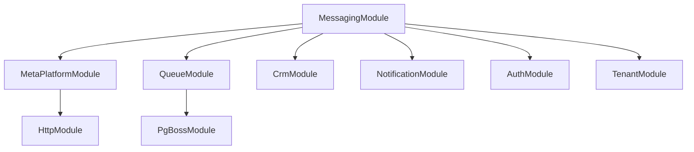

## Overview

The Messaging module provides a unified, channel-agnostic messaging system for WhatsApp, Instagram, and Facebook Messenger. It replaces the separate per-channel modules with shared entities, a shared queue, and a single WebSocket namespace.

<Note>
Last Updated: 2026-04-15  
Status: Active
</Note>

### Problem → Solution

| Problem | Solution |
| --- | --- |
| Duplicated logic across WhatsApp and Instagram modules | Single `MessagingModule` with channel providers |
| No webhook signature validation (security gap) | Shared `MetaWebhookGuard` validates `X-Hub-Signature-256` |
| Inconsistent WebSocket auth (Instagram gateway has no JWT) | Single `/messaging` gateway with JWT auth |
| No Facebook Messenger support | Third channel provider |
| Separate entity schemas per channel | Unified entities: `Conversation`, `Message`, `ChannelAccount` |
| No shared queue infrastructure | Shared `PgBossQueueService` for messaging + notifications |

### Key Design Decisions

<AccordionGroup>
<Accordion title="pg-boss over BullMQ">
Project already uses pg-boss for notifications. No new Redis dependency. Interface-based design (`IQueueService`) allows swapping later.
</Accordion>

<Accordion title="Direct PersonChannel FK on Conversation">
Conversations link directly to the CRM's `PersonChannel` via FK. Simpler model, no bidirectional sync overhead. The lead FK was moved from Conversation to Lead (`Lead.sourceConversation`) — conversations discover related leads via `personChannel → person → leads`.
</Accordion>

<Accordion title="Archive as boolean, not status">
`Conversation.isArchived` is orthogonal to `status` (OPEN/CLOSED), following `ARCHIVE_SYSTEM_SPECIFICATION.md`.
</Accordion>

<Accordion title="ConversationAssignment entity">
Conversations use a dedicated `conversation_assignment` table instead of the CRM `entity_stakeholder` pattern. Each assignment is one row with nullable `user_id` and `team_id`: `user + null` = direct assignment, `user + team` = agent on behalf of team, `null + team` = team pool.
</Accordion>

<Accordion title="Transactional outbox">
Outbound messages use an outbox table written in the same DB transaction as the Message entity, guaranteeing at-least-once delivery.
</Accordion>
</AccordionGroup>

## Architecture & Module Structure

```mermaid
graph TD
    A[Meta Platform Webhooks] --> B[POST /messaging/webhook]
    B --> C[@PublicEndpoint + MetaWebhookGuard]
    C --> D[Validates X-Hub-Signature-256]
    D --> E[Persists to WebhookEventLog]
    E --> F[Enqueues to pg-boss queue]
    F --> G[Queue Worker]
    G --> H[Channel Provider Processing]
```

<Warning>
Meta webhooks arrive before org context is known, so org-scoped `ApiKeyGuard` cannot work. The guard validates `X-Hub-Signature-256` using `META_APP_SECRET`.
</Warning>

### Module Structure

```
src/modules/meta-platform/    <- Top-level infra module
  meta-platform.module.ts
  meta-graph-api.service.ts
  meta-api.error.ts
  meta-webhook.guard.ts
  meta-oauth.service.ts
  webhook-event-log.entity.ts

src/modules/queue/            <- Top-level infra module

src/modules/messaging/
  messaging.module.ts
  entities/               <- Core entities
  enums/                  <- Channel, MessageType, etc.
  services/               <- Core services + providers/
    providers/            <- WhatsApp, Instagram, Messenger
  controllers/            <- API endpoints
  gateways/               <- WebSocket gateway
  queues/                 <- Queue processors
  dto/                    <- Request/response DTOs
  utils/                  <- Utility functions
```

## Multi-Tenancy Patterns

The messaging module introduces unique multi-tenancy challenges because webhooks arrive without org context.

### Two-Step RLS Bypass (Webhook Processing)

The webhook controller receives events for ALL organizations from a single Meta App. Org context is unknown at arrival time.

<CodeGroup>
```typescript Step 1: Find Organization
// Find which org owns this account (bypass RLS)
const account = await this.tenantContext.executeReadOnlyWithBypass(async (em) => {
  return em.findOne(ChannelAccount, { externalAccountId: job.data.accountId });
});
```

```typescript Step 2: Process in Context
// Process within that org's context
await this.tenantContext.executeInOrg(
  account.organization.id,
  async (em) => {
    await this.processMessageInTransaction(em, job.data);
  },
  { userId: undefined },
); // system action, no user
```
</CodeGroup>

### Composable `*InTransaction` Pattern

Services that participate in existing transactions expose `*InTransaction` methods:

```typescript
// Public API — wraps TenantContext
async matchOrCreate(channel, identifier, profileData, orgId): Promise<MatchResult>;

// Composable — accepts EntityManager from caller's transaction
async matchOrCreateInTransaction(em, channel, identifier, profileData, orgId): Promise<MatchResult>;
```

<Info>
The `em` parameter must always be the one provided by the TenantContext callback — never `this.em`.
</Info>

### Forbidden Patterns

| Pattern | Why It's Forbidden |
| --- | --- |
| Using `*Impl` method names | Project convention uses `*InTransaction` suffix |
| Nesting TenantContext calls | Causes deadlocks or incorrect org context |
| Direct `this.em` in transactions | Must use callback-provided EntityManager |

## Entities

### Core Entities

<Tabs>
<Tab title="ChannelAccount">
```typescript
@Entity()
export class ChannelAccount {
  @PrimaryGeneratedColumn('uuid')
  id: string;

  @Column({ type: 'enum', enum: Channel })
  channel: Channel;

  @Column()
  externalAccountId: string; // WA: phone_number_id, IG: ig_business_account_id, FB: page_id

  @Column({ nullable: true })
  pageId?: string; // For Instagram: Facebook Page ID for Send API

  @Column()
  displayName: string;

  @Column({ nullable: true })
  profileImageUrl?: string;

  @Column({ type: 'enum', enum: ChannelAccountLevel })
  level: ChannelAccountLevel; // ORGANIZATION | PERSONAL

  @Column({ type: 'enum', enum: AiMode })
  defaultAiMode: AiMode;

  @Column({ type: 'jsonb', nullable: true })
  metadata?: Record<string, any>;

  @ManyToOne(() => Organization)
  organization: Organization;

  @OneToMany(() => Conversation, conversation => conversation.channelAccount)
  conversations: Conversation[];
}
```
</Tab>

<Tab title="Conversation">
```typescript
@Entity()
export class Conversation {
  @PrimaryGeneratedColumn('uuid')
  id: string;

  @Column()
  externalConversationId: string;

  @Column({ type: 'enum', enum: ConversationStatus })
  status: ConversationStatus;

  @Column({ default: false })
  isArchived: boolean;

  @Column({ type: 'enum', enum: AiMode })
  aiMode: AiMode;

  @ManyToOne(() => ChannelAccount)
  channelAccount: ChannelAccount;

  @ManyToOne(() => PersonChannel)
  personChannel: PersonChannel;

  @OneToMany(() => Message, message => message.conversation)
  messages: Message[];

  @OneToMany(() => ConversationAssignment, assignment => assignment.conversation)
  assignments: ConversationAssignment[];
}
```
</Tab>

<Tab title="Message">
```typescript
@Entity()
export class Message {
  @PrimaryGeneratedColumn('uuid')
  id: string;

  @Column()
  externalMessageId: string;

  @Column({ type: 'enum', enum: MessageDirection })
  direction: MessageDirection; // INBOUND | OUTBOUND

  @Column({ type: 'enum', enum: MessageType })
  type: MessageType;

  @Column('text')
  content: string;

  @Column({ type: 'jsonb', nullable: true })
  metadata?: Record<string, any>;

  @Column({ type: 'enum', enum: MessageStatus })
  status: MessageStatus;

  @ManyToOne(() => Conversation)
  conversation: Conversation;

  @ManyToOne(() => User, { nullable: true })
  sender?: User; // null for inbound messages
}
```
</Tab>
</Tabs>

### Supporting Entities

<CardGroup cols={2}>
<Card title="ConversationAssignment" icon="user-group">
Dedicated assignment table with nullable `user_id` and `team_id` for flexible assignment patterns
</Card>
<Card title="MessageTemplate" icon="template">
Three-tier system: `META_APPROVED`, `QUICK_REPLY`, and `AI_PROMPT` templates
</Card>
<Card title="MessageOutbox" icon="paper-plane">
Transactional outbox for guaranteed message delivery
</Card>
<Card title="AutomationRule" icon="robot">
Rule-based message automation and AI response configuration
</Card>
</CardGroup>

## Enums

### Core Enums

```typescript
export enum Channel {
  WHATSAPP = 'whatsapp',
  INSTAGRAM = 'instagram',
  MESSENGER = 'messenger',
}

export enum MessageDirection {
  INBOUND = 'inbound',
  OUTBOUND = 'outbound',
}

export enum MessageType {
  TEXT = 'text',
  IMAGE = 'image',
  VIDEO = 'video',
  AUDIO = 'audio',
  DOCUMENT = 'document',
  LOCATION = 'location',
  CONTACT = 'contact',
  STICKER = 'sticker',
  TEMPLATE = 'template',
  REACTION = 'reaction',
  STORY_REPLY = 'story_reply',
  STORY_MENTION = 'story_mention',
  UNSUPPORTED = 'unsupported',
}

export enum ConversationStatus {
  OPEN = 'open',
  CLOSED = 'closed',
}

export enum AiMode {
  OFF = 'off',
  AUTO_REPLY = 'auto_reply',
  SUGGEST_ONLY = 'suggest_only',
  DRAFT = 'draft',
}
```

## Message Flows

### Inbound Message Processing

<Steps>
<Step title="Webhook Reception">
Meta platforms send webhooks to `POST /messaging/webhook` with signature validation
</Step>

<Step title="Queue Processing">
`webhook-processor` queue worker processes events in organization context
</Step>

<Step title="Channel Routing">
Route to appropriate provider (WhatsApp, Instagram, Messenger) based on webhook payload
</Step>

<Step title="Entity Resolution">
- Match/create PersonChannel
- Match/create Person + Lead
- Find/create Conversation
- Create Message record
</Step>

<Step title="Side Effects">
- Create CRM Activity
- Update PersonChannel stats
- Emit WebSocket events
- Trigger notifications
</Step>
</Steps>

### Outbound Message Flow

<Steps>
<Step title="Message Creation">
API endpoint creates Message and MessageOutbox records in same transaction
</Step>

<Step title="Queue Processing">
`message-sender` worker picks up outbox records and calls platform APIs
</Step>

<Step title="Status Updates">
Webhook confirmations update message status and clear outbox
</Step>
</Steps>

## Business Rules

### Assignment Rules

<Note>
Each assignment is one row with nullable `user_id` and `team_id`:
- `user + null` = direct assignment
- `user + team` = agent on behalf of team  
- `null + team` = team pool
</Note>

### AI Mode Cascade

AI mode defaults cascade in this order:
1. Conversation.aiMode (if set)
2. ChannelAccount.defaultAiMode
3. Organization default
4. OFF

### Personal Account Access

Personal accounts have special access rules:
- Owner has `canView + canReply` permissions
- Other users need explicit `MESSAGING_READ/WRITE` permissions
- WhatsApp personal accounts share org WABA token
- Instagram/Messenger personal accounts use own Page Access Token

## RBAC Permissions & Access Control

### Permission Levels

```typescript
// Global messaging permissions
MESSAGING_MANAGE    // Full access to all conversations
MESSAGING_WRITE     // Can view and reply to assigned conversations
MESSAGING_READ      // Can view assigned conversations only

// Team-specific permissions  
team_messaging.manage    // Can assign within team
team_messaging.write     // Can reply for team assignments
team_messaging.read      // Can view team assignments
```

### ResourcePermissionsDto

Conversations return per-resource permissions following CRM patterns:

```typescript
interface ResourcePermissionsDto {
  canView: boolean;
  canReply: boolean;
  canEdit: boolean;        // Always false for non-managers
  canAssign: boolean;      // True for team managers with pool assignment
  canTransfer: boolean;    // Requires MESSAGING_MANAGE
  canArchive: boolean;     // Requires MESSAGING_MANAGE
}
```

<Warning>
Operational actions (close, reopen, ai-mode) are available to `MESSAGING_WRITE` users but are not gated by `canEdit`.
</Warning>

## API Endpoints

### Conversation Management

<Tabs>
<Tab title="List Conversations">
```http
GET /messaging/conversations
Authorization: Bearer {jwt}
X-Organization-ID: {org_id}

Query Parameters:
- status?: ConversationStatus
- assigned_to?: string (user_id)
- assigned_team?: string (team_id) 
- channel?: Channel
- is_archived?: boolean
- page?: number
- limit?: number
```
</Tab>

<Tab title="Get Conversation">
```http
GET /messaging/conversations/{id}
Authorization: Bearer {jwt}
X-Organization-ID: {org_id}

Response includes:
- Conversation details
- Recent messages
- Assignment info
- ResourcePermissionsDto
```
</Tab>

<Tab title="Update Conversation">
```http
PATCH /messaging/conversations/{id}
Authorization: Bearer {jwt}
X-Organization-ID: {org_id}

Body:
{
  "status"?: ConversationStatus,
  "aiMode"?: AiMode,
  "isArchived"?: boolean
}
```
</Tab>
</Tabs>

### Message Management

<Tabs>
<Tab title="Send Message">
```http
POST /messaging/conversations/{id}/messages
Authorization: Bearer {jwt}
X-Organization-ID: {org_id}

Body:
{
  "type": MessageType,
  "content": string,
  "metadata"?: object,
  "templateId"?: string
}
```
</Tab>

<Tab title="List Messages">
```http
GET /messaging/conversations/{id}/messages
Authorization: Bearer {jwt}
X-Organization-ID: {org_id}

Query Parameters:
- before?: string (message_id for pagination)
- limit?: number
```
</Tab>
</Tabs>

## WebSocket Events & Room Architecture

### Room Structure

```typescript
// User joins their personal room
room: `user:${userId}`

// User joins conversations they can access
room: `conversation:${conversationId}`

// Team members join team rooms
room: `team:${teamId}`
```

### Event Types

<CodeGroup>
```typescript Conversation Events
// New conversation created
'conversation-created': {
  conversation: ConversationDto;
  message: MessageDto;
}

// Conversation updated (status, assignment, etc.)
'conversation-updated': {
  conversation: ConversationDto;
  changes: string[];
}

// Conversation archived/unarchived
'conversation-archived': {
  conversationId: string;
  isArchived: boolean;
}
```

```typescript Message Events
// New message in conversation
'message-created': {
  message: MessageDto;
  conversationId: string;
}

// Message status updated (sent, delivered, read, failed)
'message-status-updated': {
  messageId: string;
  status: MessageStatus;
  timestamp: Date;
}
```

```typescript Assignment Events
// Conversation assigned to user/team
'conversation-assigned': {
  conversationId: string;
  assignedTo?: UserDto;
  assignedTeam?: TeamDto;
}

// Assignment removed
'assignment-removed': {
  conversationId: string;
  removedUserId?: string;
  removedTeamId?: string;
}
```
</CodeGroup>

### Authentication

```typescript
@WebSocketGateway({
  namespace: '/messaging',
  cors: { origin: process.env.FRONTEND_URL },
})
export class MessagingGateway {
  @UseGuards(WsJwtAuthGuard)
  async handleConnection(client: AuthenticatedSocket) {
    // Auto-join user room
    await client.join(`user:${client.user.id}`);
    
    // Join accessible conversation rooms
    const conversations = await this.getAccessibleConversations(client.user);
    for (const conv of conversations) {
      await client.join(`conversation:${conv.id}`);
    }
  }
}
```

## Error Handling & Retry Strategy

### Queue Retry Logic

<CodeGroup>
```typescript Webhook Processing
// Exponential backoff with jitter
const retryOptions = {
  retryLimit: 5,
  retryDelay: 1000,
  retryBackoff: true,
  expireInSeconds: 300,
};
```

```typescript Message Sending
// Immediate retry for rate limits, exponential for others
const sendRetryOptions = {
  retryLimit: 3,
  retryDelay: (attemptNum) => {
    if (error.code === 'RATE_LIMITED') return 1000;
    return Math.min(1000 * Math.pow(2, attemptNum), 30000);
  },
};
```
</CodeGroup>

### Error Categories

<Tabs>
<Tab title="Webhook Errors">
- **Signature validation failure**: Return 401, don't retry
- **Account not found**: Log warning, return 200 (Meta expects success)
- **Processing error**: Return 500, retry with backoff
</Tab>

<Tab title="Send Errors">
- **Rate limiting**: Retry after delay from response headers
- **Invalid recipient**: Mark as failed, don't retry
- **Network errors**: Retry with exponential backoff
</Tab>

<Tab title="Platform Errors">
- **WhatsApp Business API errors**: Check error codes for retry strategy
- **Instagram Graph API errors**: Handle OAuth token expiration
- **Messenger Platform errors**: Parse error details for retry decision
</Tab>
</Tabs>

## Testing Strategy

### Unit Tests

<Steps>
<Step title="Service Layer">
Test business logic in isolation with mocked dependencies
</Step>

<Step title="Provider Layer">
Test channel-specific logic with mocked platform APIs
</Step>

<Step title="Queue Processing">
Test webhook processing and message sending workflows
</Step>
</Steps>

### Integration Tests

<Steps>
<Step title="Webhook Flow">
End-to-end webhook processing with test payloads
</Step>

<Step title="Multi-tenancy">
Verify RLS bypass and org context switching
</Step>

<Step title="WebSocket Events">
Test real-time event delivery to correct rooms
</Step>
</Steps>

### Test Data

```typescript
// Use factories for consistent test data
const conversation = ConversationFactory.create({
  channel: Channel.WHATSAPP,
  status: ConversationStatus.OPEN,
});

const message = MessageFactory.inbound({
  conversation,
  type: MessageType.TEXT,
  content: 'Test message',
});
```

## Deployment Considerations

### Database Changes

<Warning>
The messaging module includes significant schema changes. Run migrations in this order:
</Warning>

<Steps>
<Step title="Create New Tables">
Deploy messaging entities and indexes
</Step>

<Step title="Data Migration">
Migrate existing WhatsApp/Instagram data to unified schema
</Step>

<Step title="Update Permissions">
Grant new RBAC permissions to existing roles
</Step>

<Step title="Remove Legacy Tables">
Drop old channel-specific tables after verification
</Step>
</Steps>

### Feature Flags

Use feature flags for gradual rollout:

```typescript
// Enable new messaging module per org
MESSAGING_MODULE_ENABLED: boolean

// Enable specific channels
WHATSAPP_PROVIDER_ENABLED: boolean
INSTAGRAM_PROVIDER_ENABLED: boolean  
MESSENGER_PROVIDER_ENABLED: boolean

// Enable AI features
AI_AUTO_REPLY_ENABLED: boolean
AI_SUGGESTIONS_ENABLED: boolean
```

### Monitoring

<CardGroup cols={2}>
<Card title="Queue Metrics" icon="chart-line">
Monitor pg-boss queue depth, processing times, and failure rates
</Card>
<Card title="WebSocket Connections" icon="broadcast-tower">
Track connection counts, event delivery success, and room membership
</Card>
<Card title="Platform API Health" icon="heartbeat">
Monitor Meta API response times, rate limits, and error rates
</Card>
<Card title="Message Delivery" icon="paper-plane">
Track message send success rates and delivery confirmations
</Card>
</CardGroup>

## Module Dependencies

### Internal Dependencies



### External Dependencies

<Tabs>
<Tab title="Meta Platforms">
- WhatsApp Business API
- Instagram Graph API  
- Messenger Platform
- Facebook Graph API
</Tab>

<Tab title="Infrastructure">
- PostgreSQL (entities + pg-boss queues)
- Redis (WebSocket adapter)
- File storage (media downloads)
</Tab>

<Tab title="Services">
- CRM module (PersonChannel, Person, Lead)
- Notification module (events)
- Auth module (JWT, permissions)
</Tab>
</Tabs>

## Legacy Module Removal

### Migration Timeline

<Steps>
<Step title="Phase 1: Deploy Unified Module">
- Deploy messaging module alongside legacy modules
- Use feature flags to gradually enable new functionality
</Step>

<Step title="Phase 2: Data Migration">
- Migrate conversations and messages from legacy tables
- Verify data integrity and fix any issues
</Step>

<Step title="Phase 3: Switch Traffic">
- Route new webhooks to unified module
- Update frontend to use new APIs
</Step>

<Step title="Phase 4: Remove Legacy Code">
- Remove WhatsApp and Instagram modules
- Drop legacy database tables
- Clean up unused dependencies
</Step>
</Steps>

### Risk Mitigation

<Warning>
Maintain rollback capability until Phase 4 completion:
</Warning>

- Keep legacy modules deployed but disabled
- Preserve legacy database tables until data verification
- Monitor error rates and performance metrics closely
- Have automated rollback procedures ready

## Future Phases

### Phase 2: Advanced Features

<CardGroup cols={2}>
<Card title="Rich Media Support" icon="images">
Enhanced support for files, images, and interactive content
</Card>
<Card title="Message Threading" icon="comments">
Support for threaded conversations and message replies
</Card>
<Card title="Broadcast Messages" icon="bullhorn">
One-to-many messaging for announcements and campaigns
</Card>
<Card title="Chat Handoff" icon="hand-holding-hand">
Seamless transfer between AI and human agents
</Card>
</CardGroup>

### Phase 3: Platform Expansion

<Tip>
The unified architecture makes adding new messaging platforms straightforward:
</Tip>

- SMS/Text messaging
- Telegram
- Apple Business Chat
- Custom chat widgets

### Phase 4: Analytics & Intelligence

- Conversation analytics and insights
- AI-powered conversation routing
- Sentiment analysis
- Performance dashboards

## Related Documentation

<CardGroup cols={2}>
<Card title="Multi-Tenancy Guide" href="/backend/architecture/multi-tenancy">
Complete RLS and tenant context patterns
</Card>
<Card title="Queue System Spec" href="/backend/infrastructure/queue-system">
pg-boss configuration and queue management
</Card>
<Card title="WebSocket Architecture" href="/backend/realtime/websocket-architecture">
Real-time event system and room management  
</Card>
<Card title="RBAC Documentation" href="/backend/auth/rbac-system">
Role-based access control implementation
</Card>
</CardGroup>