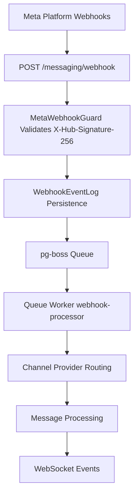

The Messaging module provides a unified, channel-agnostic messaging system for WhatsApp, Instagram, and Facebook Messenger. It replaces the separate per-channel modules with shared entities, a shared queue, and a single WebSocket namespace.

<Info>
**Last Updated:** 2026-04-15  
**Status:** Active
</Info>

## Overview

### Problem → Solution

| Problem | Solution |
| --- | --- |
| Duplicated logic across WhatsApp and Instagram modules | Single `MessagingModule` with channel providers |
| No webhook signature validation (security gap) | Shared `MetaWebhookGuard` validates `X-Hub-Signature-256` |
| Inconsistent WebSocket auth (Instagram gateway has no JWT) | Single `/messaging` gateway with JWT auth |
| No Facebook Messenger support | Third channel provider |
| Separate entity schemas per channel | Unified entities: `Conversation`, `Message`, `ChannelAccount` |
| No shared queue infrastructure | Shared `PgBossQueueService` for messaging + notifications |

### Key Design Decisions

<AccordionGroup>
  <Accordion title="pg-boss over BullMQ">
    Project already uses pg-boss for notifications. No new Redis dependency. Interface-based design (`IQueueService`) allows swapping later.
  </Accordion>

  <Accordion title="Direct PersonChannel FK on Conversation">
    Conversations link directly to the CRM's `PersonChannel` via FK. Simpler model, no bidirectional sync overhead. The lead FK was moved from Conversation to Lead (`Lead.sourceConversation`).
  </Accordion>

  <Accordion title="Archive as boolean, not status">
    `Conversation.isArchived` is orthogonal to `status` (OPEN/CLOSED), following `ARCHIVE_SYSTEM_SPECIFICATION.md`.
  </Accordion>

  <Accordion title="ConversationAssignment entity">
    Conversations use a dedicated `conversation_assignment` table instead of the CRM `entity_stakeholder` pattern. Each assignment supports user-only, team-only, or user+team configurations.
  </Accordion>

  <Accordion title="Transactional outbox">
    Outbound messages use an outbox table written in the same DB transaction as the Message entity, guaranteeing at-least-once delivery.
  </Accordion>

  <Accordion title="Per-conversation AI mode with cascade">
    Each conversation has an `aiMode` field (OFF, AUTO_REPLY, SUGGEST_ONLY, DRAFT). Default cascades: ChannelAccount.defaultAiMode → Organization default → OFF.
  </Accordion>

  <Accordion title="Three-tier template system">
    `MessageTemplate` supports three types: `META_APPROVED` (platform-approved), `QUICK_REPLY` (agent shortcuts), and `AI_PROMPT` (AI system prompts).
  </Accordion>

  <Accordion title="OAuth state includes level for defense-in-depth">
    The HMAC-signed OAuth state payload carries a `level` field (`personal` | `organization`) to prevent cross-level misuse.
  </Accordion>
</AccordionGroup>

## Architecture & Module Structure



### Module Structure

```
src/modules/meta-platform/    ← Top-level infra module
  meta-platform.module.ts
  meta-graph-api.service.ts
  meta-api.error.ts
  meta-webhook.guard.ts
  meta-oauth.service.ts
  webhook-event-log.entity.ts

src/modules/queue/            ← Top-level infra module

src/modules/messaging/
  messaging.module.ts
  entities/               ← Core entities
  enums/                  ← Channel, MessageType, etc.
  services/               ← Core services + providers/
    providers/            ← WhatsApp, Instagram, Messenger
  controllers/            ← API endpoints
  gateways/               ← WebSocket gateway
  queues/                 ← Queue processors
  dto/                    ← Request/response DTOs
  utils/                  ← Utility functions
```

## Multi-Tenancy Patterns

<Warning>
The messaging module introduces unique multi-tenancy challenges because webhooks arrive without org context.
</Warning>

### Two-Step RLS Bypass (Webhook Processing)

The webhook controller receives events for ALL organizations from a single Meta App. Org context is unknown at arrival time.

<CodeGroup>
```typescript Step 1: Find Organization
// Find which org owns this account (bypass RLS)
const account = await this.tenantContext.executeReadOnlyWithBypass(async (em) => {
  return em.findOne(ChannelAccount, { externalAccountId: job.data.accountId });
});
```

```typescript Step 2: Process in Context
// Process within that org's context
await this.tenantContext.executeInOrg(
  account.organization.id,
  async (em) => {
    await this.processMessageInTransaction(em, job.data);
  },
  { userId: undefined }, // system action
);
```
</CodeGroup>

### Composable `*InTransaction` Pattern

Services that participate in existing transactions expose `*InTransaction` methods:

```typescript
// Public API — wraps TenantContext
async matchOrCreate(channel, identifier, profileData, orgId): Promise<MatchResult>;

// Composable — accepts EntityManager from caller's transaction
async matchOrCreateInTransaction(em, channel, identifier, profileData, orgId): Promise<MatchResult>;
```

<Note>
The `em` parameter must always be the one provided by the TenantContext callback — never `this.em`.
</Note>

### Read-Only vs Mutation Methods

<Tabs>
  <Tab title="Read-Only">
    ```typescript
    // Read-only: queries, lookups, list endpoints
    return this.tenantContext.executeReadOnly(organizationId, async (em) => {
      // findById, listConversations, etc.
    });
    ```
  </Tab>
  <Tab title="Mutation">
    ```typescript
    // Mutation: updates, creates, deletes
    return this.tenantContext.executeInOrg(organizationId, async (em) => {
      // updateConversation, archiveConversation, etc.
    }, { userId });
    ```
  </Tab>
</Tabs>

## Entities

### Core Entities

<AccordionGroup>
  <Accordion title="ChannelAccount">
    Represents a connected social media account (WhatsApp Business Account, Instagram Business Account, Facebook Page).
    
    **Key Fields:**
    - `channel: Channel` - WHATSAPP, INSTAGRAM, MESSENGER
    - `accountType: ChannelAccountType` - ORGANIZATION, PERSONAL
    - `externalAccountId: string` - Platform's account identifier
    - `accessToken: string` - Encrypted access token
    - `isActive: boolean` - Account status
    - `defaultAiMode: AiMode` - Default AI behavior for new conversations
  </Accordion>

  <Accordion title="Conversation">
    A messaging thread between the organization and an external contact.
    
    **Key Fields:**
    - `personChannel: PersonChannel` - Link to CRM contact
    - `channelAccount: ChannelAccount` - Connected account
    - `status: ConversationStatus` - OPEN, CLOSED
    - `isArchived: boolean` - Archive state (orthogonal to status)
    - `aiMode: AiMode` - AI behavior for this conversation
    - `lastMessageAt: Date` - Last activity timestamp
  </Accordion>

  <Accordion title="Message">
    Individual messages within conversations.
    
    **Key Fields:**
    - `conversation: Conversation` - Parent conversation
    - `direction: MessageDirection` - INBOUND, OUTBOUND
    - `type: MessageType` - TEXT, MEDIA, INTERACTIVE, etc.
    - `externalMessageId: string` - Platform message ID
    - `content: object` - Platform-specific message content
    - `status: MessageStatus` - PENDING, SENT, DELIVERED, READ, FAILED
  </Accordion>

  <Accordion title="ConversationAssignment">
    Assignment of conversations to users/teams.
    
    **Key Fields:**
    - `conversation: Conversation` - Target conversation
    - `user?: User` - Assigned user (nullable)
    - `team?: Team` - Assigned team (nullable)
    - `canReply: boolean` - Permission to send messages
    - `assignedAt: Date` - Assignment timestamp
  </Accordion>
</AccordionGroup>

## Enums

### Channel Types

```typescript
enum Channel {
  WHATSAPP = 'WHATSAPP',
  INSTAGRAM = 'INSTAGRAM', 
  MESSENGER = 'MESSENGER'
}

enum ChannelAccountType {
  ORGANIZATION = 'ORGANIZATION',
  PERSONAL = 'PERSONAL'
}
```

### Message Enums

```typescript
enum MessageDirection {
  INBOUND = 'INBOUND',
  OUTBOUND = 'OUTBOUND'
}

enum MessageType {
  TEXT = 'TEXT',
  MEDIA = 'MEDIA',
  INTERACTIVE = 'INTERACTIVE',
  REACTION = 'REACTION',
  SYSTEM = 'SYSTEM'
}

enum MessageStatus {
  PENDING = 'PENDING',
  SENT = 'SENT', 
  DELIVERED = 'DELIVERED',
  READ = 'READ',
  FAILED = 'FAILED'
}
```

### AI Mode

```typescript
enum AiMode {
  OFF = 'OFF',
  AUTO_REPLY = 'AUTO_REPLY',
  SUGGEST_ONLY = 'SUGGEST_ONLY',
  DRAFT = 'DRAFT'
}
```

## Message Flows

### Inbound Message Flow

<Steps>
  <Step title="Webhook Received">
    Meta platform sends webhook to `POST /messaging/webhook`
  </Step>
  
  <Step title="Signature Validation">
    `MetaWebhookGuard` validates `X-Hub-Signature-256` header
  </Step>
  
  <Step title="Event Logging">
    Raw webhook payload stored in `WebhookEventLog`
  </Step>
  
  <Step title="Queue Processing">
    Event queued for asynchronous processing via pg-boss
  </Step>
  
  <Step title="Message Processing">
    Queue worker processes message:
    - Route to appropriate channel provider
    - Match or create PersonChannel
    - Find or create Conversation
    - Create Message record
    - Update conversation metadata
  </Step>
  
  <Step title="Event Emission">
    WebSocket and notification events emitted to connected clients
  </Step>
</Steps>

### Outbound Message Flow

<Steps>
  <Step title="Message Creation">
    API client creates outbound message via `POST /messaging/conversations/:id/messages`
  </Step>
  
  <Step title="Transactional Write">
    Message and MessageOutbox records created in same transaction
  </Step>
  
  <Step title="Queue Processing">
    Message sender queue processes outbox entry
  </Step>
  
  <Step title="Platform Delivery">
    Message sent to Meta platform via Graph API
  </Step>
  
  <Step title="Status Updates">
    Delivery status tracked via webhook confirmations
  </Step>
</Steps>

## Business Rules

### Conversation Management

<Note>
**Assignment Rules:**
- Each assignment supports user-only, team-only, or user+team configurations
- Multiple assignments per conversation are supported
- Team members can view conversations assigned to their teams
- Only assigned users can reply (when `canReply` is true)
</Note>

<Warning>
**Archive Behavior:**
- Archived conversations remain accessible but are filtered from default views
- Archive state is orthogonal to conversation status (OPEN/CLOSED)
- Only users with `MESSAGING_MANAGE` permission can archive conversations
</Warning>

### AI Mode Cascading

AI mode defaults cascade as follows:
1. Conversation-specific `aiMode` (if set)
2. ChannelAccount `defaultAiMode`
3. Organization default
4. OFF (fallback)

### Message Delivery

<Tip>
Messages use transactional outbox pattern to guarantee at-least-once delivery:
1. Message and MessageOutbox created in same transaction
2. Queue processor handles actual platform delivery
3. Failed sends are automatically retried with exponential backoff
</Tip>

## RBAC Permissions & Access Control

### Permission Levels

| Permission | Access Level | Capabilities |
| --- | --- | --- |
| `MESSAGING_MANAGE` | Full Access | All operations including assign, transfer, archive |
| `MESSAGING_WRITE` | Standard Agent | View, reply, basic operations |
| `MESSAGING_VIEW` | Read Only | View conversations and messages only |

### Personal Account Access

Personal accounts have additional access rules:
- Account owner has automatic view + reply access
- Organization permissions still apply for management operations
- Personal accounts cannot be transferred between organizations

### Resource Permissions

Conversations return `ResourcePermissionsDto` with computed permissions:

```typescript
interface ConversationPermissions {
  canView: boolean;      // Based on assignment or org permission
  canReply: boolean;     // Assignment.canReply or MESSAGING_WRITE+
  canAssign: boolean;    // Team manager with pool assignment
  canTransfer: boolean;  // MESSAGING_MANAGE required
  canArchive: boolean;   // MESSAGING_MANAGE required
  canEdit: boolean;      // MESSAGING_MANAGE required
}
```

## API Endpoints

### Conversation Management

<CardGroup cols={2}>
  <Card title="List Conversations" icon="list">
    `GET /messaging/conversations`
    
    Query conversations with filters, pagination, and sorting
  </Card>
  
  <Card title="Get Conversation" icon="message">
    `GET /messaging/conversations/:id`
    
    Retrieve conversation details with permissions
  </Card>
  
  <Card title="Update Conversation" icon="edit">
    `PATCH /messaging/conversations/:id`
    
    Update conversation metadata and settings
  </Card>
  
  <Card title="Archive Conversation" icon="archive">
    `POST /messaging/conversations/:id/archive`
    
    Archive/unarchive conversation
  </Card>
</CardGroup>

### Message Operations

<CardGroup cols={2}>
  <Card title="List Messages" icon="comments">
    `GET /messaging/conversations/:id/messages`
    
    Paginated message history with media handling
  </Card>
  
  <Card title="Send Message" icon="paper-plane">
    `POST /messaging/conversations/:id/messages`
    
    Send outbound message via platform APIs
  </Card>
  
  <Card title="Message Status" icon="check-circle">
    `GET /messaging/messages/:id/status`
    
    Check delivery and read status
  </Card>
  
  <Card title="React to Message" icon="heart">
    `POST /messaging/messages/:id/reactions`
    
    Add emoji reactions to messages
  </Card>
</CardGroup>

### Channel Account Management

<CardGroup cols={2}>
  <Card title="List Accounts" icon="users">
    `GET /messaging/channel-accounts`
    
    Organization and personal connected accounts
  </Card>
  
  <Card title="Connect Account" icon="link">
    `POST /messaging/channel-accounts/connect`
    
    OAuth flow for new account connections
  </Card>
  
  <Card title="Account Settings" icon="cog">
    `PATCH /messaging/channel-accounts/:id`
    
    Update account configuration and AI settings
  </Card>
  
  <Card title="Disconnect Account" icon="unlink">
    `DELETE /messaging/channel-accounts/:id`
    
    Remove account connection and cleanup
  </Card>
</CardGroup>

## WebSocket Events & Room Architecture

### Room Structure

The messaging WebSocket gateway uses organization-scoped rooms:

```typescript
// Room patterns
`org:${orgId}:messaging`              // All messaging events
`org:${orgId}:conversation:${convId}` // Conversation-specific events
`org:${orgId}:inbox:${userId}`        // Personal inbox updates
```

### Event Types

<AccordionGroup>
  <Accordion title="Conversation Events">
    - `conversation-created` - New conversation started
    - `conversation-updated` - Status, assignment, or metadata changed  
    - `conversation-archived` - Archive status changed
    - `conversation-assignment-changed` - User/team assignment modified
  </Accordion>

  <Accordion title="Message Events">
    - `message-received` - New inbound message
    - `message-sent` - Outbound message created
    - `message-status-updated` - Delivery/read status changed
    - `message-reaction-added` - Emoji reaction added
  </Accordion>

  <Accordion title="Presence Events">
    - `user-typing` - Typing indicator for conversations
    - `user-online` - Agent presence status
    - `conversation-viewed` - Message read receipts
  </Accordion>

  <Accordion title="AI Events">
    - `ai-suggestion-generated` - AI reply suggestion available
    - `ai-draft-created` - AI draft message created
    - `ai-mode-changed` - Conversation AI settings updated
  </Accordion>
</AccordionGroup>

### WebSocket Authentication

<Steps>
  <Step title="JWT Validation">
    All WebSocket connections require valid JWT token in connection handshake
  </Step>
  
  <Step title="Organization Context">
    User organization determines accessible rooms and events
  </Step>
  
  <Step title="Permission Filtering">
    Events filtered based on user's messaging permissions and assignments
  </Step>
</Steps>

## Messaging-Specific Conventions

### Naming Conventions

- **Entities:** PascalCase (`ChannelAccount`, `ConversationAssignment`)
- **Enums:** SCREAMING_SNAKE_CASE values (`WHATSAPP`, `AUTO_REPLY`)
- **WebSocket Events:** kebab-case (`conversation-updated`, `message-received`)
- **API Endpoints:** RESTful with kebab-case (`/channel-accounts`, `/ai-status`)

### Error Handling Patterns

<CodeGroup>
```typescript Platform Errors
// Wrap Meta API errors with context
try {
  await this.metaGraphApi.sendMessage(payload);
} catch (error) {
  if (error instanceof MetaApiError) {
    throw new MessageSendFailedException(
      `Failed to send ${messageType} message`,
      error.code,
      error.details
    );
  }
  throw error;
}
```

```typescript Validation Errors  
// Use class-validator with custom messages
export class SendMessageDto {
  @IsString()
  @IsNotEmpty({ message: 'Message content cannot be empty' })
  content: string;

  @IsEnum(MessageType)
  @ApiProperty({ enum: MessageType })
  type: MessageType;
}
```

```typescript Permission Errors
// Consistent permission error format
if (!permissions.canReply) {
  throw new ForbiddenException(
    'Insufficient permissions to reply to this conversation'
  );
}
```
</CodeGroup>

## Query Patterns

### Conversation Queries

<Tabs>
  <Tab title="Inbox Filtering">
    ```typescript
    // Personal inbox with assignment filtering
    const conversations = await this.conversationService.listInboxConversations(
      orgId,
      userId,
      {
        status: ConversationStatus.OPEN,
        isArchived: false,
        assignedToMe: true,
        channels: [Channel.WHATSAPP, Channel.INSTAGRAM],
        page: 1,
        limit: 20
      }
    );
    ```
  </Tab>

  <Tab title="Team Management">
    ```typescript
    // Team conversations for managers
    const teamConversations = await this.conversationService.listConversations(
      orgId,
      {
        assignedTeams: [teamId],
        includeUnassigned: true,
        sortBy: 'lastMessageAt',
        sortOrder: 'DESC'
      }
    );
    ```
  </Tab>

  <Tab title="Search & Filtering">
    ```typescript
    // Full-text search with metadata filters
    const results = await this.conversationService.searchConversations(
      orgId,
      {
        searchTerm: 'order status',
        channels: [Channel.WHATSAPP],
        dateRange: { start: '2024-01-01', end: '2024-01-31' },
        hasAiSuggestions: true
      }
    );
    ```
  </Tab>
</Tabs>

### Performance Optimizations

<Note>
**Query Optimizations:**
- Conversation lists use cursor-based pagination for large datasets
- Message queries include read optimization for recent messages
- Assignment lookups use composite indexes on `(conversation_id, user_id, team_id)`
- Full-text search uses PostgreSQL's built-in text search capabilities
</Note>

## Error Handling & Retry Strategy

### Queue Retry Configuration

```typescript
// pg-boss retry configuration
const queueOptions = {
  retryLimit: 5,
  retryDelay: 60, // seconds
  retryBackoff: true, // exponential backoff
  expireInHours: 24,
  onComplete: true // keep completed jobs for debugging
};
```

### Platform Error Mapping

| Meta API Error | Internal Error | Retry Strategy |
| --- | --- | --- |
| Rate Limited (429) | `RateLimitedException` | Exponential backoff |
| Invalid Token (401) | `InvalidCredentialsException` | No retry, require reconnection |
| Message Too Large (413) | `MessageTooLargeException` | No retry, user error |
| Recipient Unavailable (404) | `RecipientNotFoundException` | Limited retry, then mark failed |

### Webhook Idempotency

<Warning>
**Duplicate Prevention:**
Meta platforms may send duplicate webhooks. The system uses `externalEventId` for idempotency checks:
1. Check if event already processed before queue insertion
2. Secondary check during queue processing
3. Log duplicate attempts for monitoring
</Warning>

## Deployment Considerations

### Environment Configuration

<CodeGroup>
```yaml Production
# Meta Platform Configuration
META_APP_ID: ${META_APP_ID}
META_APP_SECRET: ${META_APP_SECRET}
META_WEBHOOK_VERIFY_TOKEN: ${META_WEBHOOK_VERIFY_TOKEN}

# Queue Configuration  
PGBOSS_MAX_POOL_SIZE: 20
PGBOSS_ARCHIVE_COMPLETED_AFTER_SECONDS: 86400

# WebSocket Configuration
WS_CORS_ORIGINS: "https://app.domain.com,https://admin.domain.com"
WS_MAX_CONNECTIONS_PER_ORG: 50
```

```yaml Development
# Local Development Overrides
META_WEBHOOK_URL: "https://ngrok-tunnel.ngrok.io/messaging/webhook"
PGBOSS_MAX_POOL_SIZE: 5
WS_CORS_ORIGINS: "http://localhost:3000"
LOG_LEVEL: "debug"
```
</CodeGroup>

### Database Migrations

<Steps>
  <Step title="Create Core Tables">
    Run migrations for entities: `ChannelAccount`, `Conversation`, `Message`, `ConversationAssignment`
  </Step>
  
  <Step title="Set up Indexes">
    Create performance indexes for common query patterns
  </Step>
  
  <Step title="Configure RLS">
    Apply row-level security policies for multi-tenant isolation
  </Step>
  
  <Step title="Migrate Legacy Data">
    Backfill existing WhatsApp/Instagram conversations if upgrading from separate modules
  </Step>
</Steps>

### Monitoring & Alerts

<Tip>
**Key Metrics to Monitor:**
- Webhook processing latency and error rates
- Queue depth and processing times
- Message delivery success rates by channel
- WebSocket connection counts and stability
- API endpoint response times and error rates
</Tip>

## Module Dependencies & Integration Points

### External Dependencies

- **Meta Platform Module:** Shared webhook validation and Graph API client
- **Queue Module:** pg-boss integration for async processing  
- **CRM Module:** PersonChannel, Person, and Lead entity integration
- **Notification Module:** Event emission for user notifications
- **Team Module:** Assignment and permission checking

### Integration Patterns

<AccordionGroup>
  <Accordion title="CRM Bridge Service">
    Handles bidirectional sync between messaging and CRM:
    - Creates CRM activities from messages
    - Links conversations to leads and opportunities
    - Syncs contact profile updates
  </Accordion>

  <Accordion title="Notification Events">
    Emits structured events for the notification system:
    - New message notifications
    - Assignment change alerts  
    - AI suggestion availability
    - Conversation status updates
  </Accordion>

  <Accordion title="File Storage Integration">
    Handles media message processing:
    - Downloads media from Meta platforms
    - Stores files in configured storage backend
    - Generates secure access URLs
    - Handles file type validation and virus scanning
  </Accordion>
</AccordionGroup>

## Testing Strategy

### Unit Testing

<CodeGroup>
```typescript Service Tests
describe('ConversationService', () => {
  it('should create conversation with correct assignments', async () => {
    const conversation = await service.createConversation(createDto);
    expect(conversation.assignments).toHaveLength(1);
    expect(conversation.assignments[0].canReply).toBe(true);
  });

  it('should cascade AI mode from channel account', async () => {
    const conversation = await service.createConversation({
      ...createDto,
      aiMode: undefined // Should inherit from channel account
    });
    expect(conversation.aiMode).toBe(channelAccount.defaultAiMode);
  });
});
```

```typescript Queue Tests  
describe('WebhookProcessor', () => {
  it('should handle duplicate webhook events', async () => {
    await processor.processWebhook(webhookData);
    await processor.processWebhook(webhookData); // Duplicate
    
    const messages = await messageRepo.find();
    expect(messages).toHaveLength(1); // Only one message created
  });
});
```
</CodeGroup>

### Integration Testing

<Steps>
  <Step title="Webhook End-to-End">
    Test complete webhook flow from Meta platform to database persistence
  </Step>
  
  <Step title="WebSocket Events">
    Verify event emission and real-time updates across client connections
  </Step>
  
  <Step title="Permission Scenarios">
    Test all permission combinations for different user roles and assignments
  </Step>
  
  <Step title="Multi-Tenant Isolation">
    Ensure proper data isolation between different organizations
  </Step>
</Steps>

### Load Testing

<Tip>
**Performance Targets:**
- Webhook processing: < 200ms p95
- Message sending: < 500ms p95  
- WebSocket event delivery: < 100ms p95
- API endpoints: < 300ms p95
- Support 1000+ concurrent WebSocket connections per organization
</Tip>

## Legacy Module Removal

<Warning>
This unified messaging module replaces the separate WhatsApp and Instagram modules. Migration planning is required for production deployments.
</Warning>

### Migration Steps

<Steps>
  <Step title="Parallel Deployment">
    Deploy new messaging module alongside existing modules
  </Step>
  
  <Step title="Data Migration">
    Migrate existing conversations, messages, and channel accounts to new schema
  </Step>
  
  <Step title="Webhook Cutover">
    Update Meta webhook URLs to point to new unified endpoint
  </Step>
  
  <Step title="Frontend Updates">
    Update client applications to use new WebSocket namespace and API endpoints
  </Step>
  
  <Step title="Legacy Cleanup">
    Remove old module code and database tables after successful migration
  </Step>
</Steps>

### Backward Compatibility

During migration period, maintain compatibility shims:
- Legacy WebSocket events forwarded to new namespace
- Old API endpoints proxy to new messaging endpoints
- Database views for legacy query patterns

## Known Gaps & Technical Debt

<AccordionGroup>
  <Accordion title="Message Templates">
    Template variable resolution and approval workflow needs implementation
  </Accordion>

  <Accordion title="Advanced AI Features">
    Conversation summarization, sentiment analysis, and advanced prompt engineering
  </Accordion>

  <Accordion title="Bulk Operations">
    Bulk conversation assignment, archiving, and message export functionality
  </Accordion>

  <Accordion title="Analytics & Reporting">
    Comprehensive messaging analytics, response time metrics, and performance dashboards
  </Accordion>

  <Accordion title="Advanced Media Handling">
    Image/video compression, thumbnail generation, and advanced media processing
  </Accordion>
</AccordionGroup>

## Key Files Reference

### Entity Files
- `src/modules/messaging/entities/channel-account.entity.ts`
- `src/modules/messaging/entities/conversation.entity.ts` 
- `src/modules/messaging/entities/message.entity.ts`
- `src/modules/messaging/entities/conversation-assignment.entity.ts`

### Service Files
- `src/modules/messaging/services/conversation.service.ts`
- `src/modules/messaging/services/message.service.ts`
- `src/modules/messaging/services/providers/whatsapp.provider.ts`
- `src/modules/messaging/services/providers/instagram.provider.ts`

### Controller Files
- `src/modules/messaging/controllers/webhook.controller.ts`
- `src/modules/messaging/controllers/conversation.controller.ts`
- `src/modules/messaging/controllers/message.controller.ts`

## Future Phases

### Phase 2: Advanced Features
- Rich message templates with approval workflows
- Advanced AI conversation management
- Bulk operations and conversation management tools
- Comprehensive analytics and reporting dashboard

### Phase 3: Platform Expansion
- Additional messaging platforms (Telegram, SMS, etc.)
- Advanced automation rules and triggers
- Integration with external CRM and helpdesk systems
- Advanced media processing and file management

### Phase 4: Enterprise Features
- Advanced compliance and audit logging
- Custom integration framework
- White-label messaging solutions
- Advanced AI and machine learning features

## Related Documentation

<CardGroup cols={2}>
  <Card title="Multi-Tenancy Guide" icon="building" href="/backend/core/multi-tenancy">
    Complete RLS and tenant context patterns
  </Card>
  
  <Card title="Queue System" icon="list-check" href="/backend/queue/queue-system">
    pg-boss configuration and usage patterns
  </Card>
  
  <Card title="WebSocket Architecture" icon="wifi" href="/backend/websockets/architecture">
    Real-time event system and room management
  </Card>
  
  <Card title="RBAC System" icon="shield" href="/backend/auth/rbac">
    Role-based access control implementation
  </Card>
</CardGroup>