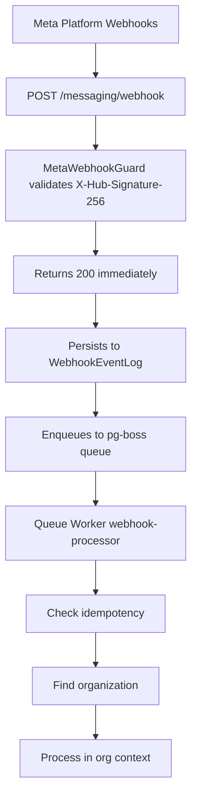

<Note>
**Last Updated:** 2026-04-15  
**Status:** Active
</Note>

The Messaging module provides a unified, channel-agnostic messaging system for WhatsApp, Instagram, and Facebook Messenger. It replaces the separate per-channel modules with shared entities, a shared queue, and a single WebSocket namespace.

## Overview

### Problem → Solution

| Problem | Solution |
| --- | --- |
| Duplicated logic across WhatsApp and Instagram modules | Single `MessagingModule` with channel providers |
| No webhook signature validation (security gap) | Shared `MetaWebhookGuard` validates `X-Hub-Signature-256` |
| Inconsistent WebSocket auth (Instagram gateway has no JWT) | Single `/messaging` gateway with JWT auth |
| No Facebook Messenger support | Third channel provider |
| Separate entity schemas per channel | Unified entities: `Conversation`, `Message`, `ChannelAccount` |
| No shared queue infrastructure | Shared `PgBossQueueService` for messaging + notifications |

### Key Design Decisions

<AccordionGroup>
<Accordion title="1. pg-boss over BullMQ">
Project already uses pg-boss for notifications. No new Redis dependency. Interface-based design (`IQueueService`) allows swapping later.
</Accordion>

<Accordion title="2. Direct PersonChannel FK on Conversation">
Conversations link directly to the CRM's `PersonChannel` via FK. Simpler model, no bidirectional sync overhead. The lead FK was moved from Conversation to Lead (`Lead.sourceConversation`) — conversations discover related leads via `personChannel → person → leads`.
</Accordion>

<Accordion title="3. Archive as boolean, not status">
`Conversation.isArchived` is orthogonal to `status` (OPEN/CLOSED), following `ARCHIVE_SYSTEM_SPECIFICATION.md`.
</Accordion>

<Accordion title="4. ConversationAssignment entity">
Conversations use a dedicated `conversation_assignment` table instead of the CRM `entity_stakeholder` pattern. Each assignment is one row with nullable `user_id` and `team_id`: `user + null` = direct assignment, `user + team` = agent on behalf of team, `null + team` = team pool.
</Accordion>

<Accordion title="5. Transactional outbox">
Outbound messages use an outbox table written in the same DB transaction as the Message entity, guaranteeing at-least-once delivery.
</Accordion>

<Accordion title="6. Per-conversation AI mode with cascade">
Each conversation has an `aiMode` field (OFF, AUTO_REPLY, SUGGEST_ONLY, DRAFT). Default cascades: ChannelAccount.defaultAiMode → Organization default → OFF.
</Accordion>

<Accordion title="7. Three-tier template system">
`MessageTemplate` supports three types: `META_APPROVED` (platform-approved), `QUICK_REPLY` (agent shortcuts with variable resolution), and `AI_PROMPT` (AI system prompts with optional SystemPrompt link).
</Accordion>

<Accordion title="8. Personal accounts share org WABA token">
WhatsApp personal accounts reuse the organization's WABA access token (same Business Account). Instagram and Messenger personal accounts use their own Page Access Token obtained via OAuth.
</Accordion>
</AccordionGroup>

## Architecture & Module Structure



### Module Structure

```
src/modules/meta-platform/    <- Top-level infra module, reused by Messaging + future Ads
  meta-platform.module.ts
  meta-graph-api.service.ts
  meta-api.error.ts
  meta-webhook.guard.ts
  meta-oauth.service.ts
  webhook-event-log.entity.ts

src/modules/queue/            <- Top-level infra module, reused by Messaging + Notifications + future Ads

src/modules/messaging/
  messaging.module.ts
  entities/               <- ChannelAccount, Conversation, Message, MessageTemplate, MessageOutbox, AutomationRule
  enums/                  <- Channel, MessageType, MessageStatus, MessageDirection, etc.
  services/               <- Core services + providers/
    providers/            <- WhatsApp, Instagram, Messenger providers
  controllers/            <- Webhook, Conversation, Message, Template, Inbox, ChannelAccount, AutomationRule, AiStatus
  gateways/               <- WebSocket gateway (/messaging namespace)
  queues/                 <- webhook-processor, message-sender, media-downloader
  dto/                    <- Request/response DTOs
  utils/                  <- permission.util.ts (personal account access control)
```

## Multi-Tenancy Patterns

<Warning>
The messaging module introduces unique multi-tenancy challenges because webhooks arrive without org context.
</Warning>

### Two-Step RLS Bypass (Webhook Processing)

The webhook controller receives events for ALL organizations from a single Meta App. Org context is unknown at arrival time.

<CodeGroup>
```typescript Step 1: Find Organization
// Step 1: Find which org owns this account (bypass RLS)
const account = await this.tenantContext.executeReadOnlyWithBypass(async (em) => {
  return em.findOne(ChannelAccount, { externalAccountId: job.data.accountId });
});
```

```typescript Step 2: Process in Context
// Step 2: Process within that org's context
await this.tenantContext.executeInOrg(
  account.organization.id,
  async (em) => {
    await this.processMessageInTransaction(em, job.data);
  },
  { userId: undefined },
); // system action, no user
```
</CodeGroup>

### Composable `*InTransaction` Pattern

Services that participate in existing transactions expose `*InTransaction` methods:

```typescript
// Public API — wraps TenantContext
async matchOrCreate(channel, identifier, profileData, orgId): Promise<MatchResult>;

// Composable — accepts EntityManager from caller's transaction
async matchOrCreateInTransaction(em, channel, identifier, profileData, orgId): Promise<MatchResult>;
```

<Note>
The `em` parameter must always be the one provided by the TenantContext callback — never `this.em`.
</Note>

### Read-Only vs Mutation Methods

<Tabs>
<Tab title="Read-Only Methods">
Read-only service methods use `executeReadOnly()` for performance hints:

```typescript
// findById, listConversations, listInboxConversations, getChannelCounts, etc.
return this.tenantContext.executeReadOnly(organizationId, async (em) => { ... });
```
</Tab>

<Tab title="Mutation Methods">
Mutation methods use `executeInOrg()` with `{ userId }` for audit attribution:

```typescript
// updateConversation, archiveConversation, softDeleteConversation, linkCrmEntity, etc.
return this.tenantContext.executeInOrg(organizationId, async (em) => { ... }, { userId });
```
</Tab>
</Tabs>

## Entities

### Core Entities

<AccordionGroup>
<Accordion title="Conversation">
```sql
CREATE TABLE conversation (
    id UUID PRIMARY KEY DEFAULT gen_random_uuid(),
    organization_id UUID NOT NULL REFERENCES organization(id),
    person_channel_id UUID NOT NULL REFERENCES person_channel(id),
    channel_account_id UUID NOT NULL REFERENCES channel_account(id),
    status conversation_status NOT NULL DEFAULT 'OPEN',
    ai_mode ai_mode_type NOT NULL DEFAULT 'OFF',
    is_archived BOOLEAN NOT NULL DEFAULT FALSE,
    last_message_at TIMESTAMPTZ,
    last_external_message_at TIMESTAMPTZ,
    created_at TIMESTAMPTZ NOT NULL DEFAULT now(),
    updated_at TIMESTAMPTZ NOT NULL DEFAULT now()
);
```

Key features:
- Direct FK to `PersonChannel` (CRM integration)
- Per-conversation AI mode with cascade defaults
- Archive as boolean, orthogonal to status
- Timestamps for sorting and activity tracking
</Accordion>

<Accordion title="Message">
```sql
CREATE TABLE message (
    id UUID PRIMARY KEY DEFAULT gen_random_uuid(),
    organization_id UUID NOT NULL REFERENCES organization(id),
    conversation_id UUID NOT NULL REFERENCES conversation(id),
    external_message_id TEXT,
    type message_type NOT NULL,
    direction message_direction NOT NULL,
    status message_status NOT NULL DEFAULT 'PENDING',
    content JSONB NOT NULL,
    metadata JSONB,
    created_at TIMESTAMPTZ NOT NULL DEFAULT now(),
    updated_at TIMESTAMPTZ NOT NULL DEFAULT now()
);
```

Key features:
- Immutable after creation (no audit triggers needed)
- JSONB content for flexible message types
- External ID for deduplication
- Status tracking for outbound delivery
</Accordion>

<Accordion title="ChannelAccount">
```sql
CREATE TABLE channel_account (
    id UUID PRIMARY KEY DEFAULT gen_random_uuid(),
    organization_id UUID NOT NULL REFERENCES organization(id),
    channel channel_type NOT NULL,
    level account_level NOT NULL,
    external_account_id TEXT NOT NULL,
    page_id TEXT,
    display_name TEXT NOT NULL,
    profile_picture_url TEXT,
    access_token_encrypted TEXT,
    webhook_verification_token TEXT,
    default_ai_mode ai_mode_type NOT NULL DEFAULT 'OFF',
    is_active BOOLEAN NOT NULL DEFAULT TRUE,
    created_at TIMESTAMPTZ NOT NULL DEFAULT now(),
    updated_at TIMESTAMPTZ NOT NULL DEFAULT now()
);
```

Key features:
- Multi-channel support (WhatsApp, Instagram, Messenger)
- Personal vs Organization level accounts
- Encrypted token storage
- Default AI mode cascade
</Accordion>

<Accordion title="ConversationAssignment">
```sql
CREATE TABLE conversation_assignment (
    id UUID PRIMARY KEY DEFAULT gen_random_uuid(),
    organization_id UUID NOT NULL REFERENCES organization(id),
    conversation_id UUID NOT NULL REFERENCES conversation(id),
    user_id UUID REFERENCES "user"(id),
    team_id UUID REFERENCES team(id),
    can_reply BOOLEAN NOT NULL DEFAULT TRUE,
    created_at TIMESTAMPTZ NOT NULL DEFAULT now(),
    updated_at TIMESTAMPTZ NOT NULL DEFAULT now()
);
```

Assignment patterns:
- `user + null` = direct assignment
- `user + team` = agent on behalf of team  
- `null + team` = team pool
- Multiple assignments per conversation supported
</Accordion>
</AccordionGroup>

## Enums

<CodeGroup>
```typescript Channel Types
export enum Channel {
  WHATSAPP = 'WHATSAPP',
  INSTAGRAM = 'INSTAGRAM',
  MESSENGER = 'MESSENGER',
}
```

```typescript Message Types
export enum MessageType {
  TEXT = 'TEXT',
  IMAGE = 'IMAGE',
  VIDEO = 'VIDEO',
  AUDIO = 'AUDIO',
  DOCUMENT = 'DOCUMENT',
  STICKER = 'STICKER',
  LOCATION = 'LOCATION',
  CONTACT = 'CONTACT',
  TEMPLATE = 'TEMPLATE',
  INTERACTIVE = 'INTERACTIVE',
  SYSTEM = 'SYSTEM',
}
```

```typescript AI Mode Types
export enum AiModeType {
  OFF = 'OFF',
  AUTO_REPLY = 'AUTO_REPLY',
  SUGGEST_ONLY = 'SUGGEST_ONLY',
  DRAFT = 'DRAFT',
}
```

```typescript Account Levels
export enum AccountLevel {
  ORGANIZATION = 'ORGANIZATION',
  PERSONAL = 'PERSONAL',
}
```
</CodeGroup>

## Message Flows

### Inbound Message Flow

<Steps>
<Step title="Webhook Receipt">
Meta webhook arrives at `POST /messaging/webhook` with `X-Hub-Signature-256` validation
</Step>

<Step title="Immediate Response">
Return 200 OK immediately, persist to `WebhookEventLog`, enqueue to pg-boss
</Step>

<Step title="Queue Processing">
Worker processes webhook with two-step RLS bypass:
1. Find organization by account ID
2. Execute in org context
</Step>

<Step title="Entity Creation">
- Match/create PersonChannel
- Match/create Person + Lead  
- Find/create Conversation
- Create Message
</Step>

<Step title="Integration & Events">
- Create CRM Activity
- Update PersonChannel stats
- Emit WebSocket events
- Emit notification events
</Step>
</Steps>

### Outbound Message Flow

<Steps>
<Step title="Message Creation">
Agent sends message via API, creating Message + MessageOutbox in same transaction
</Step>

<Step title="Queue Processing">
`message-sender` worker picks up outbox entry
</Step>

<Step title="Provider Delivery">
Route to appropriate channel provider (WhatsApp/Instagram/Messenger)
</Step>

<Step title="Status Updates">
Update message status based on delivery response, emit WebSocket events
</Step>
</Steps>

## Business Rules

<AccordionGroup>
<Accordion title="Conversation Lifecycle">
- **Auto-creation**: New inbound messages create conversations automatically
- **Status transitions**: OPEN ↔ CLOSED (agents can reopen)
- **Archive independence**: Archived conversations can be OPEN or CLOSED
- **Assignment inheritance**: New conversations inherit account's default assignment
</Accordion>

<Accordion title="AI Mode Cascade">
1. Conversation-specific `aiMode` (if set)
2. ChannelAccount `defaultAiMode`
3. Organization default AI mode
4. System default: `OFF`
</Accordion>

<Accordion title="Personal Account Access">
- Personal account owners can view/reply to their conversations
- Organization admins can view all personal account conversations
- Team assignments on personal accounts work normally
</Accordion>

<Accordion title="Template Resolution">
- `META_APPROVED`: Direct send to platform
- `QUICK_REPLY`: Variable resolution then send
- `AI_PROMPT`: Input to AI system, not direct send
</Accordion>
</AccordionGroup>

## RBAC Permissions & Access Control

### Permission Structure

| Permission | Scope | Description |
| --- | --- | --- |
| `MESSAGING_MANAGE` | Global | Full conversation management |
| `MESSAGING_WRITE` | Global | View + reply to assigned conversations |
| `team_messaging.manage` | Team | Manage team's messaging assignments |

### Resource Permissions (Conversations)

The `ConversationPermissionService` computes per-resource permissions:

<CodeGroup>
```typescript Permission Calculation
export class ConversationPermissionService {
  computePermissions(user: User, conversation: Conversation): ResourcePermissionsDto {
    // MESSAGING_MANAGE → full access
    if (user.hasPermission('MESSAGING_MANAGE')) {
      return this.fullAccess();
    }

    // Personal account owner
    if (this.isPersonalAccountOwner(user, conversation.channelAccount)) {
      return { canView: true, canReply: true, canAssign: false, ... };
    }

    // Assignment-based access
    const assignment = this.findUserAssignment(user, conversation.assignments);
    if (assignment) {
      return {
        canView: true,
        canReply: assignment.canReply,
        canAssign: this.canAssignToTeam(user, conversation),
        ...
      };
    }

    return this.noAccess();
  }
}
```

```typescript Frontend Usage
// Frontend reads permissions directly from API
const conversation = await api.getConversation(id);
const canReply = conversation.permissions.canReply;

// No client-side permission overrides
if (canReply) {
  showReplyButton();
}
```
</CodeGroup>

## Notification Types

The messaging module emits notifications for key events:

| Event Type | Trigger | Recipients |
| --- | --- | --- |
| `CONVERSATION_NEW_MESSAGE` | Inbound message received | Assigned agents, team members |
| `CONVERSATION_ASSIGNED` | Conversation assigned to agent/team | Assigned user, team members |
| `CONVERSATION_TRANSFERRED` | Assignment changed | Old + new assignees |
| `CONVERSATION_CLOSED` | Status changed to CLOSED | Assigned agents |
| `CONVERSATION_REOPENED` | Status changed to OPEN | Assigned agents |

<Note>
Notifications use the shared `PgBossQueueService` and follow the project-wide notification patterns.
</Note>

## API Endpoints

### Conversation Endpoints

<AccordionGroup>
<Accordion title="List Conversations">
```typescript
GET /messaging/conversations
```

Query parameters:
- `status`: Filter by conversation status
- `isArchived`: Filter archived state
- `assignedToMe`: Show only user's assignments
- `channelAccountId`: Filter by channel account
- `search`: Text search in participant names
- `page`, `limit`: Pagination

Response includes `ResourcePermissionsDto` per conversation.
</Accordion>

<Accordion title="Get Conversation">
```typescript
GET /messaging/conversations/:id
```

Returns full conversation details with:
- Participant information
- Recent messages (paginated)
- Assignment details
- AI mode settings
- Resource permissions
</Accordion>

<Accordion title="Update Conversation">
```typescript
PATCH /messaging/conversations/:id
```

Requires `MESSAGING_MANAGE` permission. Supports:
- Status changes (OPEN/CLOSED)
- Archive/unarchive
- AI mode updates
- Assignment changes
</Accordion>

<Accordion title="Archive Conversation">
```typescript
POST /messaging/conversations/:id/archive
DELETE /messaging/conversations/:id/archive
```

Requires `MESSAGING_MANAGE` permission. Archive is orthogonal to status.
</Accordion>
</AccordionGroup>

### Message Endpoints

<AccordionGroup>
<Accordion title="List Messages">
```typescript
GET /messaging/conversations/:conversationId/messages
```

Paginated list with cursor-based pagination for real-time sync.
</Accordion>

<Accordion title="Send Message">
```typescript
POST /messaging/conversations/:conversationId/messages
```

Creates message + outbox entry in transaction. Queue worker handles delivery.
</Accordion>

<Accordion title="Send Template">
```typescript
POST /messaging/conversations/:conversationId/send-template
```

Resolves template variables and sends via appropriate channel provider.
</Accordion>
</AccordionGroup>

## WebSocket Events & Room Architecture

### Room Structure

```typescript
/messaging namespace with JWT authentication

Rooms:
- `conversation:${conversationId}` - Message updates
- `user:${userId}` - Personal notifications  
- `team:${teamId}` - Team notifications
- `channel-account:${accountId}` - Account-specific events
```

### Event Types

<CodeGroup>
```typescript Conversation Events
{
  event: 'conversation-updated',
  data: {
    id: string,
    status: ConversationStatus,
    isArchived: boolean,
    aiMode: AiModeType,
    assignments: ConversationAssignmentDto[],
    permissions: ResourcePermissionsDto
  }
}
```

```typescript Message Events
{
  event: 'message-received',
  data: {
    id: string,
    conversationId: string,
    type: MessageType,
    direction: MessageDirection,
    content: any,
    createdAt: string
  }
}

{
  event: 'message-status-updated',
  data: {
    messageId: string,
    status: MessageStatus,
    timestamp: string
  }
}
```

```typescript Assignment Events
{
  event: 'conversation-assigned',
  data: {
    conversationId: string,
    assignments: ConversationAssignmentDto[],
    previousAssignments?: ConversationAssignmentDto[]
  }
}
```
</CodeGroup>

## Messaging-Specific Conventions

### File Naming

| Pattern | Example | Usage |
| --- | --- | --- |
| `*.service.ts` | `conversation.service.ts` | Core business logic |
| `*.provider.ts` | `whatsapp.provider.ts` | Channel-specific implementations |
| `*.queue.ts` | `webhook-processor.queue.ts` | Queue worker classes |
| `*.gateway.ts` | `messaging.gateway.ts` | WebSocket handlers |
| `*.guard.ts` | `meta-webhook.guard.ts` | Auth/validation guards |

### Method Naming

<Tabs>
<Tab title="Service Methods">
- `find*()` - Single entity queries
- `list*()` - Collection queries  
- `create*()` - Entity creation
- `update*()` - Entity updates
- `match*()` - Find or create patterns
- `*InTransaction()` - Composable transaction methods
</Tab>

<Tab title="Provider Methods">
- `sendMessage()` - Send outbound message
- `processWebhook()` - Handle inbound webhook
- `validateWebhook()` - Verify webhook signature
- `refreshToken()` - Token refresh logic
</Tab>

<Tab title="Queue Methods">
- `process()` - Main queue worker entry point
- `*Job()` - Specific job type handlers
- `retry*()` - Retry logic for failed jobs
</Tab>
</Tabs>

### Error Handling

```typescript
// Channel-specific errors
throw new MetaApiError('Failed to send message', {
  channel: Channel.WHATSAPP,
  externalAccountId: account.externalAccountId,
  originalError: error.response?.data
});

// Validation errors
throw new BadRequestException('Invalid message content for channel type');

// Permission errors  
throw new ForbiddenException('Insufficient permissions for conversation');

// Rate limiting
throw new TooManyRequestsException('Rate limit exceeded for channel');
```

## Query Patterns

### Conversation Queries

<CodeGroup>
```sql Inbox Query
-- List conversations with latest message
SELECT DISTINCT ON (c.id) 
  c.*,
  m.content as latest_message_content,
  m.created_at as latest_message_at,
  pc.identifier as participant_identifier,
  ca.display_name as account_display_name
FROM conversation c
LEFT JOIN LATERAL (
  SELECT content, created_at 
  FROM message 
  WHERE conversation_id = c.id 
  ORDER BY created_at DESC 
  LIMIT 1
) m ON true
LEFT JOIN person_channel pc ON c.person_channel_id = pc.id
LEFT JOIN channel_account ca ON c.channel_account_id = ca.id
WHERE c.organization_id = $1
  AND ($2::conversation_status IS NULL OR c.status = $2)
  AND ($3::boolean IS NULL OR c.is_archived = $3)
ORDER BY c.id, COALESCE(c.last_message_at, c.created_at) DESC;
```

```sql Assignment Query  
-- Find user's assigned conversations
SELECT c.*, ca.assignments
FROM conversation c
CROSS JOIN LATERAL (
  SELECT json_agg(
    json_build_object(
      'userId', user_id,
      'teamId', team_id, 
      'canReply', can_reply
    )
  ) as assignments
  FROM conversation_assignment
  WHERE conversation_id = c.id
) ca
WHERE c.organization_id = $1
  AND EXISTS (
    SELECT 1 FROM conversation_assignment
    WHERE conversation_id = c.id
      AND (user_id = $2 OR team_id = ANY($3))
  );
```
</CodeGroup>

### Message Queries

<CodeGroup>
```sql Conversation Messages
-- Paginated messages with cursor
SELECT *
FROM message
WHERE conversation_id = $1
  AND organization_id = $2
  AND ($3::timestamptz IS NULL OR created_at < $3)
ORDER BY created_at DESC
LIMIT $4;
```

```sql Unread Count
-- Count unread messages per conversation
SELECT conversation_id, COUNT(*) as unread_count
FROM message m
WHERE m.direction = 'INBOUND'
  AND m.created_at > COALESCE(
    (SELECT last_read_at 
     FROM conversation_participant 
     WHERE conversation_id = m.conversation_id 
       AND user_id = $1), 
    '1970-01-01'::timestamptz
  )
GROUP BY conversation_id;
```
</CodeGroup>

## Error Handling & Retry Strategy

### Queue Retry Policies

<Tabs>
<Tab title="webhook-processor">
```typescript
{
  retryLimit: 5,
  retryDelay: 30, // seconds
  retryBackoff: true, // exponential backoff
  expireIn: '1 hour'
}

// Retry conditions:
// - Temporary Meta API errors (rate limits, 5xx)
// - Database connection issues
// - Transient validation failures

// No retry conditions:  
// - Invalid webhook signatures
// - Permanent API errors (4xx except rate limits)
// - Malformed webhook payloads
```
</Tab>

<Tab title="message-sender">
```typescript
{
  retryLimit: 3,
  retryDelay: 60, // seconds  
  retryBackoff: true,
  expireIn: '6 hours'
}

// Retry conditions:
// - Rate limiting (429)
// - Temporary connectivity issues
// - Meta API 5xx errors

// No retry conditions:
// - Invalid access tokens (401)
// - Message content violations (400)
// - Account restrictions (403)
```
</Tab>

<Tab title="media-downloader">
```typescript
{
  retryLimit: 3,
  retryDelay: 30,
  retryBackoff: true,
  expireIn: '2 hours'  
}

// Handles temporary download failures
// Stores media in S3 with signed URLs
```
</Tab>
</Tabs>

### Dead Letter Handling

Failed jobs after all retries are moved to `failed` state with error details:

```typescript
{
  id: 'job-uuid',
  name: 'webhook-processor', 
  state: 'failed',
  output: {
    message: 'Failed to process webhook after 5 retries',
    originalError: { ... },
    attempts: [
      { attemptedAt: '...', error: '...' },
      // ...
    ]
  }
}
```

Failed jobs require manual intervention or replay via admin tools.

## Deployment Considerations

### Environment Variables

<CodeGroup>
```env Meta Platform Config
META_APP_ID=your_app_id
META_APP_SECRET=your_app_secret
META_WEBHOOK_VERIFY_TOKEN=your_verify_token
META_API_VERSION=v17.0
META_BASE_URL=https://graph.facebook.com
```

```env Queue Configuration  
PGBOSS_DATABASE_URL=postgresql://...
PGBOSS_SCHEMA=pgboss
PGBOSS_MAX_CONNECTIONS=10
```

```env WebSocket Configuration
WEBSOCKET_CORS_ORIGIN=https://yourapp.com
WEBSOCKET_JWT_SECRET=your_jwt_secret
```
</CodeGroup>

### Database Migrations

<Steps>
<Step title="Core Tables">
Run migrations for `conversation`, `message`, `channel_account`, `conversation_assignment`, `message_outbox` tables
</Step>

<Step title="Queue Schema">
Initialize pg-boss schema with `pgboss.start()` - creates required tables automatically
</Step>

<Step title="Indexes">
Apply performance indexes on frequently queried columns:
- `conversation.organization_id, last_message_at DESC`
- `message.conversation_id, created_at DESC`  
- `conversation_assignment.user_id, team_id`
</Step>

<Step title="RLS Policies">
Enable Row Level Security policies for multi-tenant data isolation
</Step>
</Steps>

### Scaling Considerations

<Warning>
**Queue Workers**: Start with 2-3 worker processes per queue type. Monitor job completion rates and scale horizontally.
</Warning>

<Tip>
**Database Connections**: Queue workers hold long-lived connections. Factor into connection pool sizing.
</Tip>

<Info>
**WebSocket Connections**: Plan for 1K+ concurrent connections per messaging agent. Use Redis adapter for multi-server deployments.
</Info>

## Module Dependencies & Integration Points

### Internal Dependencies

```typescript
@Module({
  imports: [
    DatabaseModule,
    TenantModule, 
    MetaPlatformModule, // Shared Meta API + webhook infrastructure
    QueueModule,        // Shared pg-boss queue service  
    NotificationModule, // Event emission
    CrmModule,         // PersonChannel, Person, Lead integration
    UserModule,        // User permissions and team access
    OrganizationModule // Org-level settings and defaults
  ],
  // ...
})
export class MessagingModule {}
```

### External Dependencies

| Service | Usage | Fallback |
| --- | --- | --- |
| Meta Graph API | Send/receive messages, webhook validation | Queue retry with exponential backoff |
| S3/CloudStorage | Media file storage | Local filesystem in development |
| Redis (optional) | WebSocket scaling, session storage | In-memory for single-server |

### CRM Integration Points

<AccordionGroup>
<Accordion title="PersonChannel Bridge">
```typescript
// Conversations link directly to PersonChannel
conversation.personChannel.person // Access CRM person
conversation.personChannel.person.leads // Access related leads

// Auto-create PersonChannel for new conversations
const personChannel = await this.crmBridgeService.matchOrCreatePersonChannel({
  channel: 'WHATSAPP',
  identifier: '+1234567890',
  profileData: { name: 'John Doe', profilePicture: '...' }
});
```
</Accordion>

<Accordion title="Activity Creation">
```typescript
// Create CRM activity for each message
const activity = await this.crmBridgeService.createActivity({
  type: 'MESSAGE_RECEIVED',
  entityType: 'PersonChannel', 
  entityId: conversation.personChannelId,
  metadata: {
    conversationId: conversation.id,
    messageId: message.id,
    channel: conversation.channelAccount.channel,
    direction: message.direction
  }
});
```
</Accordion>

<Accordion title="Lead Auto-Creation">
```typescript
// Create lead for first conversation
if (isFirstConversation) {
  const lead = await this.crmBridgeService.createLead({
    personId: conversation.personChannel.personId,
    sourceConversationId: conversation.id,
    source: 'MESSAGING',
    status: 'NEW'
  });
}
```
</Accordion>
</AccordionGroup>

## Testing Strategy

### Unit Tests

<CodeGroup>
```typescript Service Tests
describe('ConversationService', () => {
  it('should create conversation with auto-assignment', async () => {
    const account = createMockChannelAccount();
    const personChannel = createMockPersonChannel();
    
    const result = await service.createConversation({
      channelAccountId: account.id,
      personChannelId: personChannel.id
    });
    
    expect(result.assignments).toHaveLength(1);
    expect(result.assignments[0].teamId).toBe(account.defaultTeamId);
  });
});
```

```typescript Provider Tests  
describe('WhatsAppProvider', () => {
  it('should send text message successfully', async () => {
    const mockResponse = { messages: [{ id: 'msg_123' }] };
    jest.spyOn(metaApi, 'post').mockResolvedValue(mockResponse);
    
    const result = await provider.sendMessage(account, {
      type: 'TEXT',
      content: { text: 'Hello world' },
      to: '+1234567890'
    });
    
    expect(result.externalMessageId).toBe('msg_123');
    expect(metaApi.post).toHaveBeenCalledWith(
      `/v17.0/${account.externalAccountId}/messages`,
      expect.objectContaining({
        messaging_product: 'whatsapp',
        to: '+1234567890',
        type: 'text',
        text: { body: 'Hello world' }
      })
    );
  });
});
```
</CodeGroup>

### Integration Tests

<CodeGroup>
```typescript Webhook Tests
describe('Messaging Webhook', () => {
  it('should process inbound WhatsApp message', async () => {
    const webhook = createWhatsAppMessageWebhook();
    
    await request(app.getHttpServer())
      .post('/messaging/webhook')
      .set('X-Hub-Signature-256', generateSignature(webhook))
      .send(webhook)
      .expect(200);
    
    // Verify queue job created
    const jobs = await queueService.getJobs('webhook-processor');
    expect(jobs).toHaveLength(1);
    
    // Process queue job
    await queueWorker.process(jobs[0]);
    
    // Verify entities created
    const conversation = await em.findOne(Conversation, { 
      personChannel: { identifier: webhook.entry[0].changes[0].value.contacts[0].wa_id }
    });
    expect(conversation).toBeDefined();
    
    const message = await em.findOne(Message, { conversationId: conversation.id });
    expect(message.content.text).toBe(webhook.entry[0].changes[0].value.messages[0].text.body);
  });
});
```

```typescript Queue Tests
describe('Message Sender Queue', () => {
  it('should retry failed sends with exponential backoff', async () => {
    // Mock API failure
    jest.spyOn(whatsappProvider, 'sendMessage')
      .mockRejectedValueOnce(new Error('Rate limited'))
      .mockResolvedValueOnce({ externalMessageId: 'msg_123' });
    
    const job = await queueService.enqueue('message-sender', outboxEntry);
    await queueWorker.process(job);
    
    // Should retry and succeed
    const message = await em.findOne(Message, job.data.messageId);
    expect(message.status).toBe(MessageStatus.SENT);
  });
});
```
</CodeGroup>

### E2E Tests

<Steps>
<Step title="Full Message Flow">
Send message via API → verify queue processing → check webhook delivery → confirm WebSocket events
</Step>

<Step title="Multi-Tenant Isolation">
Create conversations in different orgs → verify RLS isolation → confirm no cross-tenant data leakage
</Step>

<Step title="Permission Enforcement">
Test various user roles → verify conversation access control → confirm assignment-based permissions
</Step>

<Step title="Channel Provider Integration">
Mock Meta API responses → test all message types → verify error handling and retries
</Step>
</Steps>

## Legacy Module Removal

<Warning>
**Migration Timeline**: The legacy WhatsApp and Instagram modules will be removed in phases after this unified module is stable.
</Warning>

### Migration Steps

<Steps>
<Step title="Data Migration">
Run migration scripts to move data from legacy tables to unified schema:
- `whatsapp_conversation` → `conversation`
- `instagram_conversation` → `conversation` 
- `whatsapp_message` → `message`
- `instagram_message` → `message`
</Step>

<Step title="API Compatibility">
Maintain legacy API endpoints as proxies to new unified endpoints during transition period
</Step>

<Step title="WebSocket Migration">
Update frontend to use new `/messaging` namespace instead of separate `/whatsapp` and `/instagram` namespaces
</Step>

<Step title="Queue Consolidation">
Migrate in-flight jobs from legacy queues to unified queues with job transformation
</Step>

<Step title="Legacy Cleanup">
Remove legacy modules, database tables, and API endpoints after successful migration verification
</Step>
</Steps>

### Breaking Changes

| Legacy Feature | New Equivalent | Migration Notes |
| --- | --- | --- |
| `/whatsapp/conversations` | `/messaging/conversations?channel=WHATSAPP` | Add channel filter |
| `WhatsAppConversation.leadId` | `Lead.sourceConversationId` | FK direction reversed |
| Separate WebSocket namespaces | Single `/messaging` namespace | Update frontend connections |
| Channel-specific assignment tables | Unified `conversation_assignment` | Migrate assignment data |

## Known Gaps & Technical Debt

<AccordionGroup>
<Accordion title="Message Search">
**Gap**: No full-text search across message content  
**Impact**: Users cannot search conversation history  
**Workaround**: Search by participant name/phone only  
**Future**: Add PostgreSQL full-text search or Elasticsearch integration
</Accordion>

<Accordion title="Message Threading">
**Gap**: No support for message threads or replies  
**Impact**: Cannot track conversation context for complex discussions  
**Workaround**: Linear message history only  
**Future**: Add `parent_message_id` and thread support
</Accordion>

<Accordion title="Bulk Operations">
**Gap**: No bulk archive/assign/transfer operations  
**Impact**: Agents must process conversations individually  
**Workaround**: Manual one-by-one processing  
**Future**: Add bulk operation endpoints and UI
</Accordion>

<Accordion title="Message Analytics">
**Gap**: No conversation metrics or response time tracking  
**Impact**: Cannot measure agent performance or SLA compliance  
**Workaround**: Manual time tracking  
**Future**: Add analytics tables and reporting endpoints
</Accordion>

<Accordion title="Rich Media Support">
**Gap**: Limited rich media types, no interactive message builder  
**Impact**: Cannot send polls, buttons, carousels easily  
**Workaround**: JSON content for interactive messages  
**Future**: Add visual message builder and rich components
</Accordion>
</AccordionGroup>

## Key Files Reference

<CardGroup cols={2}>
<Card title="Core Services" href="#core-services">
- `conversation.service.ts` - Main conversation operations
- `message.service.ts` - Message handling and delivery
- `channel-account.service.ts` - Account management
- `conversation-permission.service.ts` - Access control
</Card>

<Card title="Channel Providers" href="#channel-providers">
- `whatsapp.provider.ts` - WhatsApp Business API
- `instagram.provider.ts` - Instagram Messaging API  
- `messenger.provider.ts` - Messenger Platform API
</Card>

<Card title="Queue Workers" href="#queue-workers">
- `webhook-processor.queue.ts` - Inbound webhook processing
- `message-sender.queue.ts` - Outbound message delivery
- `media-downloader.queue.ts` - Media file processing
</Card>

<Card title="Infrastructure" href="#infrastructure">
- `meta-platform.module.ts` - Shared Meta API integration
- `messaging.gateway.ts` - WebSocket event handling
- `meta-webhook.guard.ts` - Webhook signature validation
</Card>
</CardGroup>

## Future Phases

### Phase 2: Advanced Features

<Tabs>
<Tab title="AI Integration">
- GPT-powered auto-replies
- Sentiment analysis
- Smart conversation routing
- Template suggestions
</Tab>

<Tab title="Analytics & Reporting">
- Response time metrics
- Agent performance dashboards  
- Conversation volume trends
- Channel-specific insights
</Tab>

<Tab title="Automation Rules">
- Trigger-based message routing
- Auto-assignment rules
- Scheduled messages
- Follow-up reminders
</Tab>
</Tabs>

### Phase 3: Enterprise Features

<Tabs>
<Tab title="Multi-Brand Support">
- Brand-specific channel accounts
- Branded message templates
- Brand-based routing rules
</Tab>

<Tab title="Advanced Permissions">
- Channel-specific permissions
- Time-based access controls
- Conversation-level permissions
- Audit trail enhancements
</Tab>

<Tab title="Integration Expansion">
- Additional messaging platforms (Telegram, Line, etc.)
- CRM system integrations
- Third-party AI providers
- Webhook-based integrations
</Tab>
</Tabs>

## Related Documentation

<CardGroup cols={2}>
<Card title="Multi-Tenancy Guide" href="/docs/multi-tenancy">
Complete RLS patterns and tenant isolation strategies
</Card>

<Card title="Archive System Specification" href="/docs/archive-system">
Archive boolean vs status patterns and implementation
</Card>

<Card title="Queue Infrastructure" href="/docs/queue-infrastructure">
pg-boss configuration and queue management patterns
</Card>

<Card title="WebSocket Architecture" href="/docs/websocket-architecture">
Real-time event handling and room management
</Card>

<Card title="CRM Integration Guide" href="/docs/crm-integration">
PersonChannel bridge and entity relationship patterns
</Card>

<Card title="Meta Platform APIs" href="/docs/meta-platform-apis">
WhatsApp, Instagram, and Messenger API integration details
</Card>
</CardGroup>