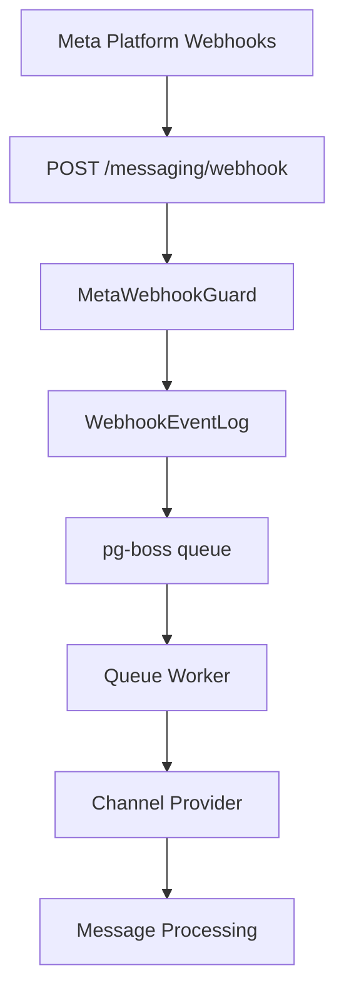

## Overview

The Messaging module provides a unified, channel-agnostic messaging system for WhatsApp, Instagram, and Facebook Messenger. It replaces the separate per-channel modules with shared entities, a shared queue, and a single WebSocket namespace.

<Info>
**Last Updated:** 2026-04-15  
**Status:** Active
</Info>

### Problem → Solution

| Problem | Solution |
|---------|----------|
| Duplicated logic across WhatsApp and Instagram modules | Single `MessagingModule` with channel providers |
| No webhook signature validation (security gap) | Shared `MetaWebhookGuard` validates `X-Hub-Signature-256` |
| Inconsistent WebSocket auth (Instagram gateway has no JWT) | Single `/messaging` gateway with JWT auth |
| No Facebook Messenger support | Third channel provider |
| Separate entity schemas per channel | Unified entities: `Conversation`, `Message`, `ChannelAccount` |
| No shared queue infrastructure | Shared `PgBossQueueService` for messaging + notifications |

### Key Design Decisions

<AccordionGroup>
<Accordion title="pg-boss over BullMQ">
Project already uses pg-boss for notifications. No new Redis dependency. Interface-based design (`IQueueService`) allows swapping later.
</Accordion>

<Accordion title="Direct PersonChannel FK on Conversation">
Conversations link directly to the CRM's `PersonChannel` via FK. Simpler model, no bidirectional sync overhead. The lead FK was moved from Conversation to Lead (`Lead.sourceConversation`) — conversations discover related leads via `personChannel → person → leads`.
</Accordion>

<Accordion title="Archive as boolean, not status">
`Conversation.isArchived` is orthogonal to `status` (OPEN/CLOSED), following `ARCHIVE_SYSTEM_SPECIFICATION.md`.
</Accordion>

<Accordion title="ConversationAssignment entity">
Conversations use a dedicated `conversation_assignment` table instead of the CRM `entity_stakeholder` pattern. Each assignment is one row with nullable `user_id` and `team_id`: `user + null` = direct assignment, `user + team` = agent on behalf of team, `null + team` = team pool. Multiple assignment rows per conversation are supported.
</Accordion>

<Accordion title="Transactional outbox">
Outbound messages use an outbox table written in the same DB transaction as the Message entity, guaranteeing at-least-once delivery.
</Accordion>

<Accordion title="Per-conversation AI mode with cascade">
Each conversation has an `aiMode` field (OFF, AUTO_REPLY, SUGGEST_ONLY, DRAFT). Default cascades: ChannelAccount.defaultAiMode → Organization default → OFF.
</Accordion>

<Accordion title="Three-tier template system">
`MessageTemplate` supports three types: `META_APPROVED` (platform-approved), `QUICK_REPLY` (agent shortcuts with variable resolution), and `AI_PROMPT` (AI system prompts with optional SystemPrompt link).
</Accordion>

<Accordion title="Personal accounts share org WABA token">
WhatsApp personal accounts reuse the organization's WABA access token (same Business Account). Instagram and Messenger personal accounts use their own Page Access Token obtained via OAuth.
</Accordion>
</AccordionGroup>

## Architecture & Module Structure

The system follows a webhook-to-queue-to-processing architecture:



### Module Structure

<CodeGroup>

```typescript Module Layout
src/modules/meta-platform/    // Top-level infra module
  meta-platform.module.ts
  meta-graph-api.service.ts
  meta-api.error.ts
  meta-webhook.guard.ts
  meta-oauth.service.ts
  webhook-event-log.entity.ts

src/modules/queue/            // Top-level infra module

src/modules/messaging/
  messaging.module.ts
  entities/               // Core entities
  enums/                  // Channel, MessageType, etc.
  services/               // Core services + providers/
    providers/            // WhatsApp, Instagram, Messenger
  controllers/            // API endpoints
  gateways/               // WebSocket gateway
  queues/                 // Queue workers
  dto/                    // Request/response DTOs
  utils/                  // Utilities
```

</CodeGroup>

## Multi-Tenancy Patterns

<Warning>
The messaging module introduces unique multi-tenancy challenges because webhooks arrive without org context.
</Warning>

### Two-Step RLS Bypass (Webhook Processing)

The webhook controller receives events for ALL organizations from a single Meta App. Org context is unknown at arrival time.

<Steps>
<Step title="Find Organization">
```typescript
// Step 1: Find which org owns this account (bypass RLS)
const account = await this.tenantContext.executeReadOnlyWithBypass(async (em) => {
  return em.findOne(ChannelAccount, { externalAccountId: job.data.accountId });
});
```
</Step>

<Step title="Process Within Context">
```typescript
// Step 2: Process within that org's context
await this.tenantContext.executeInOrg(
  account.organization.id,
  async (em) => {
    await this.processMessageInTransaction(em, job.data);
  },
  { userId: undefined },
); // system action, no user
```
</Step>
</Steps>

### Composable `*InTransaction` Pattern

Services that participate in existing transactions expose `*InTransaction` methods:

```typescript
// Public API — wraps TenantContext
async matchOrCreate(channel, identifier, profileData, orgId): Promise<MatchResult>;

// Composable — accepts EntityManager from caller's transaction
async matchOrCreateInTransaction(em, channel, identifier, profileData, orgId): Promise<MatchResult>;
```

<Note>
The `em` parameter must always be the one provided by the TenantContext callback — never `this.em`.
</Note>

### Read-Only vs Mutation Methods

<Tabs>
<Tab title="Read-Only">
```typescript
// Read-only: findById, listConversations, etc.
return this.tenantContext.executeReadOnly(organizationId, async (em) => { 
  // ... 
});
```
</Tab>
<Tab title="Mutation">
```typescript
// Mutation: updateConversation, archiveConversation, etc.
return this.tenantContext.executeInOrg(organizationId, async (em) => { 
  // ... 
}, { userId });
```
</Tab>
</Tabs>

## Entities

### Core Entities

<CardGroup cols={2}>
<Card title="ChannelAccount" icon="user">
Represents a connected social media account (WhatsApp Business, Instagram, Messenger Page)
</Card>
<Card title="Conversation" icon="comments">
Thread of messages between a customer and the organization on a specific channel
</Card>
<Card title="Message" icon="message">
Individual message within a conversation
</Card>
<Card title="MessageTemplate" icon="template">
Reusable message templates for quick replies and AI prompts
</Card>
</CardGroup>

### ChannelAccount Entity

```typescript
@Entity('channel_account')
export class ChannelAccount extends BaseEntity {
  @Column({ type: 'enum', enum: Channel })
  channel: Channel; // WHATSAPP | INSTAGRAM | MESSENGER

  @Column()
  externalAccountId: string; // WABA ID, IG Business Account ID, FB Page ID

  @Column({ nullable: true })
  pageId?: string; // Facebook Page ID (for Instagram outbound messaging)

  @Column()
  displayName: string;

  @Column({ type: 'jsonb', nullable: true })
  profileData?: any;

  @Column({ type: 'enum', enum: ChannelAccountType })
  type: ChannelAccountType; // BUSINESS | PERSONAL

  @Column({ type: 'enum', enum: ChannelAccountLevel })
  level: ChannelAccountLevel; // ORGANIZATION | PERSONAL

  @Column({ nullable: true, select: false })
  accessToken?: string; // Encrypted

  @Column({ type: 'enum', enum: AiMode })
  defaultAiMode: AiMode;

  @Column({ default: true })
  isActive: boolean;

  @ManyToOne(() => Organization, { onDelete: 'CASCADE' })
  organization: Organization;

  @ManyToOne(() => User, { nullable: true, onDelete: 'SET NULL' })
  personalOwner?: User;
}
```

### Conversation Entity

```typescript
@Entity('conversation')
export class Conversation extends BaseEntity {
  @Column()
  externalConversationId: string; // Platform-specific ID

  @Column({ type: 'enum', enum: ConversationStatus, default: 'OPEN' })
  status: ConversationStatus;

  @Column({ default: false })
  isArchived: boolean;

  @Column({ type: 'enum', enum: AiMode })
  aiMode: AiMode;

  @Column({ nullable: true })
  lastMessageAt?: Date;

  @Column({ type: 'jsonb', nullable: true })
  metadata?: any;

  @ManyToOne(() => ChannelAccount, { onDelete: 'CASCADE' })
  channelAccount: ChannelAccount;

  @ManyToOne(() => PersonChannel, { nullable: true, onDelete: 'SET NULL' })
  personChannel?: PersonChannel;

  @OneToMany(() => Message, message => message.conversation)
  messages: Message[];

  @OneToMany(() => ConversationAssignment, assignment => assignment.conversation)
  assignments: ConversationAssignment[];
}
```

### Message Entity

```typescript
@Entity('message')
export class Message extends BaseEntity {
  @Column()
  externalMessageId: string;

  @Column({ type: 'enum', enum: MessageDirection })
  direction: MessageDirection; // INBOUND | OUTBOUND

  @Column({ type: 'enum', enum: MessageType })
  type: MessageType; // TEXT | IMAGE | AUDIO | etc.

  @Column({ type: 'text', nullable: true })
  content?: string;

  @Column({ type: 'jsonb', nullable: true })
  metadata?: any;

  @Column({ type: 'enum', enum: MessageStatus, default: 'PENDING' })
  status: MessageStatus;

  @Column({ nullable: true })
  failureReason?: string;

  @Column()
  timestamp: Date;

  @ManyToOne(() => Conversation, { onDelete: 'CASCADE' })
  conversation: Conversation;

  @ManyToOne(() => User, { nullable: true })
  sentByUser?: User;
}
```

## Enums

### Channel Types

```typescript
export enum Channel {
  WHATSAPP = 'WHATSAPP',
  INSTAGRAM = 'INSTAGRAM',
  MESSENGER = 'MESSENGER',
}

export enum ChannelAccountType {
  BUSINESS = 'BUSINESS',
  PERSONAL = 'PERSONAL',
}

export enum ChannelAccountLevel {
  ORGANIZATION = 'ORGANIZATION',
  PERSONAL = 'PERSONAL',
}
```

### Message & Conversation States

```typescript
export enum MessageDirection {
  INBOUND = 'INBOUND',
  OUTBOUND = 'OUTBOUND',
}

export enum MessageStatus {
  PENDING = 'PENDING',
  SENT = 'SENT',
  DELIVERED = 'DELIVERED',
  READ = 'READ',
  FAILED = 'FAILED',
}

export enum ConversationStatus {
  OPEN = 'OPEN',
  CLOSED = 'CLOSED',
}

export enum AiMode {
  OFF = 'OFF',
  AUTO_REPLY = 'AUTO_REPLY',
  SUGGEST_ONLY = 'SUGGEST_ONLY',
  DRAFT = 'DRAFT',
}
```

## Message Flows

### Inbound Message Flow

<Steps>
<Step title="Webhook Received">
Meta platform sends webhook to `POST /messaging/webhook`
</Step>

<Step title="Validation & Queuing">
- `MetaWebhookGuard` validates `X-Hub-Signature-256`
- Event saved to `WebhookEventLog`
- Job enqueued to `webhook-processor` queue
</Step>

<Step title="Queue Processing">
- Find organization by account ID (RLS bypass)
- Process within org context
- Route to appropriate channel provider
</Step>

<Step title="Entity Creation">
- Match/create `PersonChannel`
- Find/create `Conversation`
- Create `Message` entity
- Update conversation stats
</Step>

<Step title="Notifications">
- Emit WebSocket events
- Create notification events
- Bridge to CRM activities
</Step>
</Steps>

### Outbound Message Flow

<Steps>
<Step title="Message Creation">
Agent creates message via API or WebSocket
</Step>

<Step title="Transactional Outbox">
- `Message` entity created
- `MessageOutbox` entry created in same transaction
</Step>

<Step title="Queue Processing">
- `message-sender` worker picks up outbox entry
- Calls appropriate channel provider
- Updates message status based on API response
</Step>

<Step title="Delivery Tracking">
- Webhook events update delivery status
- WebSocket events notify frontend of status changes
</Step>
</Steps>

## Business Rules

### Assignment Rules

<Note>
Each conversation can have multiple assignments (direct agent + team pool)
</Note>

| Assignment Type | user_id | team_id | Description |
|----------------|---------|---------|-------------|
| Direct Assignment | ✓ | null | Agent directly assigned |
| Team Assignment | null | ✓ | Team pool assignment |
| Agent on Team | ✓ | ✓ | Agent assigned on behalf of team |

### AI Mode Cascade

The AI mode for a conversation follows this cascade:

1. `Conversation.aiMode` (if explicitly set)
2. `ChannelAccount.defaultAiMode`
3. Organization default AI mode
4. `AiMode.OFF` (fallback)

### Archive vs Status

<Warning>
`isArchived` is independent of `status`. Archived conversations can still be OPEN or CLOSED.
</Warning>

- **Archive**: UI organization feature (hide from active view)
- **Status**: Business workflow state (conversation lifecycle)

## RBAC Permissions & Access Control

### Permission Levels

| Permission | Access Level |
|------------|-------------|
| `MESSAGING_MANAGE` | Full access to all messaging features |
| `MESSAGING_WRITE` | Can view and reply to conversations |
| `MESSAGING_READ` | Read-only access |

### Resource-Level Permissions

Each conversation returns a `ResourcePermissionsDto`:

```typescript
interface ConversationPermissions {
  canView: boolean;      // View conversation and messages
  canReply: boolean;     // Send messages
  canAssign: boolean;    // Assign to agents/teams
  canTransfer: boolean;  // Transfer between agents/teams
  canArchive: boolean;   // Archive/unarchive
  canEdit: boolean;      // Edit conversation properties
}
```

### Permission Calculation

<Tabs>
<Tab title="MESSAGING_MANAGE">
```typescript
// Full access to all conversations
return fullAccess();
```
</Tab>
<Tab title="MESSAGING_WRITE">
```typescript
// Can view and reply to all conversations
return {
  canView: true,
  canReply: true,
  canAssign: false,
  canTransfer: false,
  canArchive: false,
  canEdit: false,
};
```
</Tab>
<Tab title="Personal Account Owner">
```typescript
// Can view and reply to own personal account conversations
return {
  canView: true,
  canReply: true,
  canAssign: false,
  // ... other permissions false
};
```
</Tab>
</Tabs>

## API Endpoints

### Conversation Management

<CodeGroup>

```typescript GET /messaging/conversations
// List conversations with filters
interface ListConversationsQuery {
  status?: ConversationStatus;
  isArchived?: boolean;
  assignedToMe?: boolean;
  teamId?: string;
  channelAccountId?: string;
  page?: number;
  limit?: number;
}
```

```typescript GET /messaging/conversations/:id
// Get conversation details with messages
interface ConversationDetailResponse {
  conversation: ConversationDto;
  messages: MessageDto[];
  permissions: ResourcePermissionsDto;
}
```

```typescript POST /messaging/conversations/:id/messages
// Send a message
interface SendMessageRequest {
  type: MessageType;
  content?: string;
  templateId?: string;
  metadata?: any;
}
```

```typescript PATCH /messaging/conversations/:id
// Update conversation properties
interface UpdateConversationRequest {
  status?: ConversationStatus;
  aiMode?: AiMode;
  isArchived?: boolean;
}
```

</CodeGroup>

### Assignment Management

<CodeGroup>

```typescript POST /messaging/conversations/:id/assign
// Assign conversation
interface AssignConversationRequest {
  userId?: string;
  teamId?: string;
  canReply?: boolean;
}
```

```typescript DELETE /messaging/conversations/:id/assignments/:assignmentId
// Remove assignment
```

```typescript POST /messaging/conversations/:id/transfer
// Transfer conversation
interface TransferConversationRequest {
  fromUserId?: string;
  fromTeamId?: string;
  toUserId?: string;
  toTeamId?: string;
}
```

</CodeGroup>

### Template Management

<CodeGroup>

```typescript GET /messaging/templates
// List message templates
interface ListTemplatesQuery {
  type?: MessageTemplateType;
  channel?: Channel;
}
```

```typescript POST /messaging/templates
// Create template
interface CreateTemplateRequest {
  type: MessageTemplateType;
  name: string;
  content: string;
  channel?: Channel;
  metadata?: any;
}
```

</CodeGroup>

## WebSocket Events & Room Architecture

### Room Structure

The messaging WebSocket gateway uses a hierarchical room structure:

<CodeGroup>

```typescript Room Patterns
// Organization-wide messaging events
`org:${orgId}:messaging`

// Specific conversation updates
`org:${orgId}:conversation:${conversationId}`

// User-specific notifications
`org:${orgId}:user:${userId}:messaging`

// Team-specific notifications
`org:${orgId}:team:${teamId}:messaging`
```

</CodeGroup>

### Event Types

<AccordionGroup>
<Accordion title="conversation-created">
Emitted when a new conversation is created (typically from inbound messages)
```typescript
{
  event: 'conversation-created',
  data: {
    conversation: ConversationDto,
    message?: MessageDto
  }
}
```
</Accordion>

<Accordion title="conversation-updated">
Emitted when conversation properties change (status, assignment, archive, etc.)
```typescript
{
  event: 'conversation-updated',
  data: {
    conversation: ConversationDto,
    changes: string[]
  }
}
```
</Accordion>

<Accordion title="message-received">
Emitted when a new inbound message arrives
```typescript
{
  event: 'message-received',
  data: {
    conversationId: string,
    message: MessageDto
  }
}
```
</Accordion>

<Accordion title="message-sent">
Emitted when an outbound message is sent
```typescript
{
  event: 'message-sent',
  data: {
    conversationId: string,
    message: MessageDto
  }
}
```
</Accordion>

<Accordion title="message-status-updated">
Emitted when message delivery status changes
```typescript
{
  event: 'message-status-updated',
  data: {
    messageId: string,
    status: MessageStatus,
    timestamp: Date
  }
}
```
</Accordion>
</AccordionGroup>

## Query Patterns

### Optimized Conversation Queries

<Note>
The messaging module uses several query optimization patterns for high-performance inbox views
</Note>

<CodeGroup>

```sql Inbox Query with Assignments
-- Get conversations with assignment info
SELECT 
  c.*,
  ca_user.first_name as assigned_agent_name,
  ca_team.name as assigned_team_name,
  (
    SELECT COUNT(*) 
    FROM message m 
    WHERE m.conversation_id = c.id 
    AND m.direction = 'INBOUND' 
    AND m.created_at > COALESCE(c.last_read_at, '1970-01-01'::timestamp)
  ) as unread_count
FROM conversation c
LEFT JOIN conversation_assignment ca_agent ON (
  ca_agent.conversation_id = c.id 
  AND ca_agent.user_id IS NOT NULL 
  AND ca_agent.team_id IS NULL
)
LEFT JOIN conversation_assignment ca_team ON (
  ca_team.conversation_id = c.id 
  AND ca_team.team_id IS NOT NULL
)
LEFT JOIN "user" ca_user ON ca_user.id = ca_agent.user_id
LEFT JOIN team ca_team ON ca_team.id = ca_team.team_id
WHERE c.organization_id = $1
AND c.is_archived = false
ORDER BY c.last_message_at DESC NULLS LAST;
```

```sql Channel Account Stats
-- Get message counts per channel account
SELECT 
  ca.id,
  ca.display_name,
  COUNT(DISTINCT c.id) as conversation_count,
  COUNT(DISTINCT CASE WHEN c.status = 'OPEN' THEN c.id END) as open_conversations,
  SUM(
    CASE WHEN m.direction = 'INBOUND' 
    AND m.created_at > COALESCE(c.last_read_at, '1970-01-01'::timestamp)
    THEN 1 ELSE 0 END
  ) as total_unread
FROM channel_account ca
LEFT JOIN conversation c ON c.channel_account_id = ca.id
LEFT JOIN message m ON m.conversation_id = c.id
WHERE ca.organization_id = $1 
AND ca.is_active = true
GROUP BY ca.id, ca.display_name;
```

</CodeGroup>

### Index Strategy

<Tip>
Key indexes for messaging performance:
</Tip>

```sql
-- Conversation lookup by external ID
CREATE INDEX idx_conversation_external_id ON conversation (external_conversation_id);

-- Message ordering within conversations
CREATE INDEX idx_message_conversation_timestamp ON message (conversation_id, timestamp);

-- Unread message counting
CREATE INDEX idx_message_direction_created ON message (direction, created_at) WHERE direction = 'INBOUND';

-- Assignment lookups
CREATE INDEX idx_conversation_assignment_conversation ON conversation_assignment (conversation_id);
CREATE INDEX idx_conversation_assignment_user ON conversation_assignment (user_id) WHERE user_id IS NOT NULL;
CREATE INDEX idx_conversation_assignment_team ON conversation_assignment (team_id) WHERE team_id IS NOT NULL;
```

## Error Handling & Retry Strategy

### Queue Job Retries

<CodeGroup>

```typescript Webhook Processing
// webhook-processor queue configuration
{
  retryLimit: 5,
  retryDelay: 30, // seconds
  retryBackoff: true,
  expireInSeconds: 60 * 60 * 24, // 24 hours
}
```

```typescript Message Sending
// message-sender queue configuration  
{
  retryLimit: 3,
  retryDelay: 60, // seconds
  retryBackoff: true,
  expireInSeconds: 60 * 60 * 2, // 2 hours
}
```

</CodeGroup>

### Error Categories

<AccordionGroup>
<Accordion title="Transient Errors (Retry)">
- Network timeouts
- Rate limiting (429 responses)
- Temporary API unavailability (5xx responses)
- Database connection issues
</Accordion>

<Accordion title="Permanent Errors (No Retry)">
- Invalid webhook signatures
- Malformed message content
- Account permission issues (403 responses)
- Invalid recipient (400 responses)
</Accordion>

<Accordion title="Queue Exhaustion">
- After retry limit reached, message marked as FAILED
- Webhook events logged with error details
- Manual intervention may be required
</Accordion>
</AccordionGroup>

### Dead Letter Handling

```typescript
// Failed jobs are moved to dead letter queue
interface DeadLetterJob {
  originalJob: any;
  failureReason: string;
  attempts: number;
  lastError: Error;
  failedAt: Date;
}
```

## Deployment Considerations

### Database Migrations

<Steps>
<Step title="Schema Migration">
Run database migrations to create messaging tables and indexes
</Step>

<Step title="Data Migration">
Migrate existing conversations and messages from legacy modules
</Step>

<Step title="Assignment Backfill">
Convert legacy `assigned_agent_id`/`assigned_team_id` columns to `ConversationAssignment` entities
</Step>

<Step title="Cleanup">
Drop legacy tables and columns after successful migration
</Step>
</Steps>

### Environment Variables

<CodeGroup>

```bash Required Configuration
# Meta Platform Integration
META_APP_ID=your_app_id
META_APP_SECRET=your_app_secret
META_WEBHOOK_VERIFY_TOKEN=your_verify_token

# Queue Configuration  
PGBOSS_DATABASE_URL=postgresql://...
PGBOSS_SCHEMA=pgboss

# Encryption (for access tokens)
ENCRYPTION_KEY=your_encryption_key
```

</CodeGroup>

### Scaling Considerations

<Warning>
Monitor queue performance and scale workers based on message volume
</Warning>

- **Webhook processing**: CPU-bound, scale based on webhook volume
- **Message sending**: Network I/O bound, scale based on outbound message volume  
- **Media downloading**: Storage I/O bound, consider separate worker pools

## Module Dependencies

### Internal Dependencies

<CardGroup cols={2}>
<Card title="CRM Module" icon="address-book">
PersonChannel, Person, Lead entities and services
</Card>
<Card title="User Management" icon="users">
User, Team, Organization entities and RBAC
</Card>
<Card title="Notification Module" icon="bell">
Shared queue infrastructure and notification events
</Card>
<Card title="Audit Module" icon="clipboard-list">
Audit logging for conversation and message changes
</Card>
</CardGroup>

### External Dependencies

<CardGroup cols={2}>
<Card title="Meta Graph API" icon="globe">
WhatsApp Business API, Instagram Basic Display API, Messenger Platform
</Card>
<Card title="PostgreSQL" icon="database">
Primary data storage with RLS and audit triggers
</Card>
<Card title="pg-boss" icon="clock">
Queue processing and job scheduling
</Card>
<Card title="Socket.IO" icon="wifi">
Real-time WebSocket communication
</Card>
</CardGroup>

## Testing Strategy

### Unit Tests

<Tabs>
<Tab title="Services">
- Channel provider logic
- Message processing workflows
- Permission calculations
- Queue job handlers
</Tab>
<Tab title="Controllers">
- API endpoint validation
- Authentication/authorization
- Error handling
- Response formatting
</Tab>
<Tab title="Entities">
- Validation rules
- Relationship mapping
- Query methods
</Tab>
</Tabs>

### Integration Tests

<Steps>
<Step title="Webhook Processing">
Test end-to-end webhook → queue → processing flow
</Step>
<Step title="Message Sending">
Test outbox → queue → API call → status update flow
</Step>
<Step title="WebSocket Events">
Test real-time event emission and room management
</Step>
<Step title="Multi-tenancy">
Test RLS enforcement and tenant isolation
</Step>
</Steps>

### E2E Tests

<CodeGroup>

```typescript Conversation Flow
describe('Message Flow E2E', () => {
  it('should process inbound WhatsApp message', async () => {
    // 1. Send webhook event
    // 2. Verify queue job created
    // 3. Process queue job
    // 4. Verify conversation/message created
    // 5. Verify WebSocket event emitted
    // 6. Verify notification created
  });
});
```

```typescript Permission Tests  
describe('Conversation Permissions', () => {
  it('should enforce assignment-based access', async () => {
    // 1. Create conversation with assignment
    // 2. Test various user permission levels
    // 3. Verify API responses include correct permissions
    // 4. Test unauthorized access attempts
  });
});
```

</CodeGroup>

## Legacy Module Removal

### Migration Timeline

<Steps>
<Step title="Phase 1: Parallel Operation">
- Deploy unified messaging module
- Maintain existing WhatsApp/Instagram modules
- Gradually migrate conversations
</Step>

<Step title="Phase 2: Traffic Switch">
- Route new conversations to unified module
- Complete data migration
- Update frontend to use new APIs
</Step>

<Step title="Phase 3: Legacy Cleanup">
- Remove legacy module code
- Drop legacy database tables
- Update documentation and deployment scripts
</Step>
</Steps>

### Breaking Changes

<Warning>
The unified messaging module introduces several breaking changes from the legacy modules
</Warning>

| Legacy Pattern | New Pattern | Impact |
|----------------|-------------|---------|
| Separate conversation entities | Unified `Conversation` | Schema changes |
| Channel-specific WebSocket namespaces | Single `/messaging` namespace | Frontend updates |
| Direct assignment columns | `ConversationAssignment` entity | API changes |
| Per-module permissions | Unified `MESSAGING_*` permissions | RBAC updates |

## Known Gaps & Technical Debt

### Current Limitations

<AccordionGroup>
<Accordion title="Media Handling">
- Basic media download/upload support
- No advanced media processing (thumbnails, compression)
- Limited file type validation
</Accordion>

<Accordion title="Message Templates">
- No template preview functionality
- Limited variable substitution
- No template analytics/usage tracking
</Accordion>

<Accordion title="AI Integration">
- Basic AI mode support
- No conversation context for AI responses
- Limited AI prompt customization
</Accordion>

<Accordion title="Analytics">
- Basic message/conversation counting
- No advanced reporting or metrics
- No conversation analytics dashboard
</Accordion>
</AccordionGroup>

### Future Improvements

<Tip>
Planned enhancements for future releases:
</Tip>

- Advanced media processing pipeline
- Rich message template editor
- Conversation analytics and insights
- AI-powered response suggestions
- Message search and filtering
- Conversation sentiment analysis

## Key Files Reference

<CardGroup cols={2}>
<Card title="Core Entities" icon="database">
`src/modules/messaging/entities/`
- conversation.entity.ts
- message.entity.ts
- channel-account.entity.ts
- message-template.entity.ts
</Card>

<Card title="Channel Providers" icon="plug">
`src/modules/messaging/services/providers/`
- whatsapp.provider.ts
- instagram.provider.ts
- messenger.provider.ts
</Card>

<Card title="Queue Workers" icon="cogs">
`src/modules/messaging/queues/`
- webhook-processor.service.ts
- message-sender.service.ts
- media-downloader.service.ts
</Card>

<Card title="API Controllers" icon="server">
`src/modules/messaging/controllers/`
- conversation.controller.ts
- message.controller.ts
- webhook.controller.ts
</Card>
</CardGroup>

## Future Phases

### Phase 2: Advanced Features

- **Rich Media Support**: Enhanced media handling with thumbnails, compression, and validation
- **Template Builder**: Visual template editor with variable management and preview
- **Conversation Analytics**: Detailed metrics, response times, and performance insights
- **Advanced AI Integration**: Context-aware responses and sentiment analysis

### Phase 3: Enterprise Features

- **Message Search**: Full-text search across conversations and messages
- **Bulk Operations**: Mass assignment, archiving, and message operations
- **Advanced Automation**: Complex routing rules and auto-responses
- **API Rate Limiting**: Per-account and per-user rate limiting

### Phase 4: Platform Expansion

- **Additional Channels**: Telegram, SMS, email integration
- **Custom Integrations**: Webhook-based custom channel support
- **Advanced Workflows**: Visual workflow builder for message routing
- **Enterprise SSO**: Advanced authentication and authorization

## Related Documentation

<CardGroup cols={2}>
<Card title="Multi-Tenancy Guide" href="/backend/core/multi-tenancy">
RLS patterns and tenant isolation strategies
</Card>

<Card title="Queue System" href="/backend/infrastructure/queue-system">
pg-boss configuration and job processing patterns
</Card>

<Card title="WebSocket Architecture" href="/backend/realtime/websocket-architecture">
Real-time communication and room management
</Card>

<Card title="RBAC System" href="/backend/auth/rbac-system">
Permissions and access control implementation
</Card>
</CardGroup>