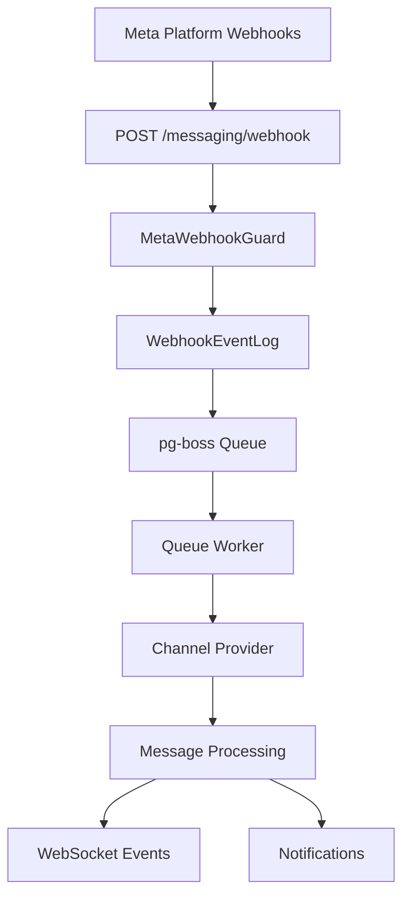

<Note>
**Last Updated:** 2026-04-15  
**Status:** Active
</Note>

## Overview

The Messaging module provides a unified, channel-agnostic messaging system for WhatsApp, Instagram, and Facebook Messenger. It replaces the separate per-channel modules with shared entities, a shared queue, and a single WebSocket namespace.

### Problem → Solution

| Problem | Solution |
| --- | --- |
| Duplicated logic across WhatsApp and Instagram modules | Single `MessagingModule` with channel providers |
| No webhook signature validation (security gap) | Shared `MetaWebhookGuard` validates `X-Hub-Signature-256` |
| Inconsistent WebSocket auth (Instagram gateway has no JWT) | Single `/messaging` gateway with JWT auth |
| No Facebook Messenger support | Third channel provider |
| Separate entity schemas per channel | Unified entities: `Conversation`, `Message`, `ChannelAccount` |
| No shared queue infrastructure | Shared `PgBossQueueService` for messaging + notifications |

### Key Design Decisions

<AccordionGroup>
<Accordion title="Queue Infrastructure">
**pg-boss over BullMQ** — Project already uses pg-boss for notifications. No new Redis dependency. Interface-based design (`IQueueService`) allows swapping later.
</Accordion>

<Accordion title="Conversation Model">
**Direct PersonChannel FK on Conversation** — Conversations link directly to the CRM's `PersonChannel` via FK. Simpler model, no bidirectional sync overhead. The lead FK was moved from Conversation to Lead (`Lead.sourceConversation`).
</Accordion>

<Accordion title="Archive System">
**Archive as boolean, not status** — `Conversation.isArchived` is orthogonal to `status` (OPEN/CLOSED), following `ARCHIVE_SYSTEM_SPECIFICATION.md`.
</Accordion>

<Accordion title="Assignment Model">
**`ConversationAssignment` entity** — Conversations use a dedicated `conversation_assignment` table instead of the CRM `entity_stakeholder` pattern. Each assignment is one row with nullable `user_id` and `team_id`.
</Accordion>

<Accordion title="Message Delivery">
**Transactional outbox** — Outbound messages use an outbox table written in the same DB transaction as the Message entity, guaranteeing at-least-once delivery.
</Accordion>

<Accordion title="AI Integration">
**Per-conversation AI mode with cascade** — Each conversation has an `aiMode` field (OFF, AUTO_REPLY, SUGGEST_ONLY, DRAFT). Default cascades: ChannelAccount.defaultAiMode → Organization default → OFF.
</Accordion>

<Accordion title="Template System">
**Three-tier template system** — `MessageTemplate` supports three types: `META_APPROVED` (platform-approved), `QUICK_REPLY` (agent shortcuts with variable resolution), and `AI_PROMPT` (AI system prompts with optional SystemPrompt link).
</Accordion>

<Accordion title="OAuth Security">
**OAuth state includes `level` for defense-in-depth** — The HMAC-signed OAuth state payload carries a `level` field (`personal` | `organization`). Both personal and org connect-with-code endpoints validate the state's level.
</Accordion>
</AccordionGroup>

## Architecture & Module Structure



<Steps>
<Step title="Webhook Reception">
Meta Platform sends webhooks to `POST /messaging/webhook` with `@PublicEndpoint()` + `MetaWebhookGuard` that validates `X-Hub-Signature-256`.
</Step>

<Step title="Event Logging">
Returns 200 immediately and persists to `WebhookEventLog` before enqueuing to pg-boss queue.
</Step>

<Step title="Queue Processing">
Worker processes with idempotency checking using `externalEventId`.
</Step>

<Step title="Organization Resolution">
Uses `executeReadOnlyWithBypass()` to find organization, then `executeInOrg(orgId)` to process.
</Step>

<Step title="Message Processing">
Routes to channel provider, matches/creates entities, emits events.
</Step>
</Steps>

### Module Structure

```
src/modules/meta-platform/    ← Top-level infra module
  meta-platform.module.ts
  meta-graph-api.service.ts
  meta-api.error.ts
  meta-webhook.guard.ts
  meta-oauth.service.ts
  webhook-event-log.entity.ts

src/modules/queue/            ← Top-level infra module

src/modules/messaging/
  messaging.module.ts
  entities/               ← Core entities
  enums/                  ← Channel, MessageType, MessageStatus
  services/               ← Core services + providers/
    providers/            ← WhatsApp, Instagram, Messenger
  controllers/            ← API endpoints
  gateways/               ← WebSocket gateway
  queues/                 ← Queue workers
  dto/                    ← Request/response DTOs
  utils/                  ← Utility functions
```

## Multi-Tenancy Patterns

<Warning>
The messaging module introduces unique multi-tenancy challenges because webhooks arrive without org context.
</Warning>

### Two-Step RLS Bypass (Webhook Processing)

The webhook controller receives events for ALL organizations from a single Meta App. Org context is unknown at arrival time.

<CodeGroup>
```typescript Step 1: Find Organization
// Step 1: Find which org owns this account (bypass RLS)
const account = await this.tenantContext.executeReadOnlyWithBypass(async (em) => {
  return em.findOne(ChannelAccount, { externalAccountId: job.data.accountId });
});
```

```typescript Step 2: Process in Context
// Step 2: Process within that org's context
await this.tenantContext.executeInOrg(
  account.organization.id,
  async (em) => {
    await this.processMessageInTransaction(em, job.data);
  },
  { userId: undefined }, // system action, no user
);
```
</CodeGroup>

### Composable Transaction Pattern

Services that participate in existing transactions expose `*InTransaction` methods:

```typescript
// Public API — wraps TenantContext
async matchOrCreate(channel, identifier, profileData, orgId): Promise<MatchResult>;

// Composable — accepts EntityManager from caller's transaction
async matchOrCreateInTransaction(em, channel, identifier, profileData, orgId): Promise<MatchResult>;
```

<Info>
The `em` parameter must always be the one provided by the TenantContext callback — never `this.em`.
</Info>

### Read-Only vs Mutation Methods

<Tabs>
<Tab title="Read-Only Methods">
Use `executeReadOnly()` for performance hints (READ COMMITTED + read-only transaction):

```typescript
// Examples: findById, listConversations, getChannelCounts
return this.tenantContext.executeReadOnly(organizationId, async (em) => {
  // Query operations only
});
```
</Tab>

<Tab title="Mutation Methods">
Use `executeInOrg()` with `{ userId }` to ensure audit triggers work correctly:

```typescript
// Examples: updateConversation, archiveConversation, softDeleteConversation
return this.tenantContext.executeInOrg(organizationId, async (em) => {
  // Mutation operations
}, { userId });
```
</Tab>
</Tabs>

### Forbidden Patterns

<Warning>
These patterns will cause issues in the multi-tenant environment:

- Using `*Impl` method names (use `*InTransaction` suffix)
- Nesting TenantContext calls (causes deadlocks)
- Using `this.em` inside transaction callbacks
- Bypassing RLS for mutation operations
</Warning>

## Entities

### Core Entities

<CardGroup cols={2}>
<Card title="ChannelAccount" icon="user">
Represents a connected social media account (WhatsApp, Instagram, Messenger)
</Card>

<Card title="Conversation" icon="comments">
Thread of messages between a customer and the business
</Card>

<Card title="Message" icon="message">
Individual message within a conversation
</Card>

<Card title="MessageTemplate" icon="template">
Reusable message templates (Meta-approved, quick replies, AI prompts)
</Card>
</CardGroup>

### Supporting Entities

- **ConversationAssignment** - Assignment of conversations to users/teams
- **MessageOutbox** - Transactional outbox for reliable message delivery
- **AutomationRule** - Rules for automated responses and routing
- **WebhookEventLog** - Audit log for incoming webhook events

## Message Flows

### Inbound Message Flow

<Steps>
<Step title="Webhook Reception">
Meta sends webhook to `/messaging/webhook` endpoint
</Step>

<Step title="Security Validation">
`MetaWebhookGuard` validates `X-Hub-Signature-256` header
</Step>

<Step title="Event Logging">
Persist to `WebhookEventLog` and enqueue to pg-boss
</Step>

<Step title="Queue Processing">
Worker finds organization and processes in tenant context
</Step>

<Step title="Entity Creation">
Create/update Person, PersonChannel, Conversation, Message
</Step>

<Step title="Event Emission">
Emit WebSocket events and notification events
</Step>
</Steps>

### Outbound Message Flow

<Steps>
<Step title="Message Creation">
API creates `Message` and `MessageOutbox` in transaction
</Step>

<Step title="Queue Processing">
`message-sender` worker picks up from outbox
</Step>

<Step title="Platform Delivery">
Send via Meta Graph API to appropriate channel
</Step>

<Step title="Status Updates">
Update message status based on delivery confirmation
</Step>
</Steps>

## Business Rules

<AccordionGroup>
<Accordion title="Conversation Lifecycle">
- Conversations start as OPEN when first message arrives
- Can be manually CLOSED by agents
- CLOSED conversations reopen when customer sends new message
- Archive status is independent of OPEN/CLOSED status
</Accordion>

<Accordion title="Assignment Rules">
- Multiple assignments per conversation supported
- `user + null` = direct assignment
- `user + team` = agent on behalf of team  
- `null + team` = team pool assignment
- Team members can pick up from team pool if they have permissions
</Accordion>

<Accordion title="AI Mode Cascade">
Default AI mode cascades in this order:
1. Conversation-specific setting
2. ChannelAccount.defaultAiMode
3. Organization default
4. OFF (fallback)
</Accordion>

<Accordion title="Personal Account Access">
- Personal account owners can view/reply to their conversations
- Organization admins can view all personal account conversations
- Personal accounts share org WABA token for WhatsApp
- Instagram/Messenger personal accounts use own Page Access Token
</Accordion>
</AccordionGroup>

## RBAC Permissions & Access Control

### Module Permissions

| Permission | Scope | Description |
|------------|-------|-------------|
| `MESSAGING_MANAGE` | Module | Full messaging management access |
| `MESSAGING_WRITE` | Module | Can view and reply to messages |
| `MESSAGING_READ` | Module | Read-only access to conversations |

### Team Permissions

| Permission | Scope | Description |
|------------|-------|-------------|
| `team_messaging.manage` | Team | Manage team messaging settings |
| `team_messaging.assign` | Team | Assign conversations within team |

### Resource Permissions

Conversations return `ResourcePermissionsDto` with these flags:

- `canView` - Can view conversation and messages
- `canReply` - Can send messages in conversation  
- `canAssign` - Can assign conversation to team members
- `canEdit` - Can edit conversation metadata
- `canTransfer` - Can transfer to other agents/teams
- `canArchive` - Can archive/unarchive conversation

<Note>
`ConversationPermissionService` computes permissions in-memory without extra DB queries.
</Note>

## API Endpoints

### Conversation Management

<CodeGroup>
```http GET /messaging/conversations
GET /messaging/conversations
Authorization: Bearer <token>

# Query Parameters
?status=OPEN&assignedToMe=true&page=1&limit=20
```

```http GET /messaging/conversations/:id
GET /messaging/conversations/conv_123
Authorization: Bearer <token>

# Returns conversation with messages and permissions
```

```http PUT /messaging/conversations/:id
PUT /messaging/conversations/conv_123
Authorization: Bearer <token>
Content-Type: application/json

{
  "status": "CLOSED",
  "aiMode": "AUTO_REPLY"
}
```
</CodeGroup>

### Message Operations

<CodeGroup>
```http POST /messaging/conversations/:id/messages
POST /messaging/conversations/conv_123/messages
Authorization: Bearer <token>
Content-Type: application/json

{
  "content": "Hello, how can I help you?",
  "type": "TEXT"
}
```

```http POST /messaging/conversations/:id/messages/media
POST /messaging/conversations/conv_123/messages/media
Authorization: Bearer <token>
Content-Type: multipart/form-data

file: <media_file>
caption: "Here's the document you requested"
```
</CodeGroup>

### Channel Account Management

<CodeGroup>
```http GET /messaging/channel-accounts
GET /messaging/channel-accounts
Authorization: Bearer <token>

# Returns all channel accounts for organization
```

```http POST /messaging/channel-accounts/:id/disconnect
POST /messaging/channel-accounts/acc_123/disconnect
Authorization: Bearer <token>

# Disconnects channel account
```
</CodeGroup>

## WebSocket Events & Room Architecture

### Room Structure

The `/messaging` namespace uses this room architecture:

- `org:{orgId}` - Organization-wide messaging events
- `conversation:{conversationId}` - Conversation-specific events
- `user:{userId}` - User-specific notifications

### Event Types

<Tabs>
<Tab title="Conversation Events">
```typescript
// New conversation created
{
  event: 'conversation-created',
  data: ConversationDetailDto
}

// Conversation updated (status, assignment, etc.)
{
  event: 'conversation-updated', 
  data: ConversationDetailDto
}

// Conversation archived/unarchived
{
  event: 'conversation-archived',
  data: { conversationId: string, isArchived: boolean }
}
```
</Tab>

<Tab title="Message Events">
```typescript
// New message in conversation
{
  event: 'message-created',
  data: MessageDto,
  conversationId: string
}

// Message status updated (sent, delivered, read)
{
  event: 'message-status-updated',
  data: { messageId: string, status: MessageStatus }
}

// Typing indicator
{
  event: 'typing-indicator',
  data: { conversationId: string, isTyping: boolean, userId?: string }
}
```
</Tab>

<Tab title="Presence Events">
```typescript
// Agent comes online/offline  
{
  event: 'agent-presence-changed',
  data: { userId: string, isOnline: boolean, lastSeen?: Date }
}

// Agent joins/leaves conversation
{
  event: 'agent-joined-conversation',
  data: { userId: string, conversationId: string }
}
```
</Tab>
</Tabs>

## Queue Architecture

The messaging module uses pg-boss queues for reliable processing:

### Queue Jobs

<CardGroup cols={2}>
<Card title="webhook-processor" icon="webhook">
Processes incoming Meta webhooks and creates messages
</Card>

<Card title="message-sender" icon="paper-plane">
Sends outbound messages via Meta Graph API
</Card>

<Card title="media-downloader" icon="download">
Downloads and stores media files from messages
</Card>

<Card title="automation-processor" icon="robot">
Processes automation rules and triggers
</Card>
</CardGroup>

### Error Handling & Retry Strategy

<Steps>
<Step title="Exponential Backoff">
Failed jobs retry with exponential backoff: 1s, 2s, 4s, 8s, 16s
</Step>

<Step title="Dead Letter Queue">
After 5 retries, jobs move to dead letter queue for manual review
</Step>

<Step title="Idempotency">
All webhook processing is idempotent using `externalEventId`
</Step>

<Step title="Circuit Breaker">
Meta API errors trigger circuit breaker to prevent cascade failures
</Step>
</Steps>

## Testing Strategy

### Unit Tests

- Service methods with mocked dependencies
- Entity validation and business rules
- Permission calculation logic
- Queue job processors

### Integration Tests

- Full webhook processing flow
- Database transactions and rollbacks
- WebSocket event emission
- Meta API integration

### E2E Tests

- Complete message flows (inbound/outbound)
- Multi-tenant isolation
- Authentication and authorization
- Error scenarios and recovery

<Tip>
Use the `TestTenantContext` utility for consistent multi-tenant test setup.
</Tip>

## Deployment Considerations

### Environment Variables

```bash
# Meta Platform Integration
META_APP_ID=your_app_id
META_APP_SECRET=your_app_secret
META_WEBHOOK_VERIFY_TOKEN=your_verify_token

# Queue Configuration  
PGBOSS_DATABASE_URL=postgresql://...
PGBOSS_POLL_INTERVAL=5000

# WebSocket Configuration
WEBSOCKET_CORS_ORIGIN=https://your-frontend.com
```

### Database Migrations

<Warning>
Run migrations in this order:
1. Create messaging schema and entities
2. Migrate existing conversation data
3. Set up queue tables
4. Create indexes for performance
</Warning>

### Scaling Considerations

- Queue workers can be scaled horizontally
- WebSocket connections require sticky sessions
- Database connection pooling for high concurrency
- CDN for media file delivery

## Module Dependencies & Integration Points

### Internal Dependencies

- **CRM Module** - Person, PersonChannel, Lead entities
- **Auth Module** - JWT authentication, RBAC permissions  
- **Notification Module** - Shared queue infrastructure
- **Team Module** - Team assignments and permissions
- **User Module** - Agent management and presence

### External Dependencies

- **Meta Graph API** - WhatsApp, Instagram, Messenger
- **PostgreSQL** - Primary database with pg-boss
- **File Storage** - Media file storage (S3/local)
- **WebSocket Server** - Real-time communication

<Info>
The module is designed to be independent of specific CRM implementations through well-defined interfaces.
</Info>

## Migration from Legacy Modules

### Whatsapp Module Removal

<Steps>
<Step title="Data Migration">
Migrate existing WhatsApp conversations and messages to unified schema
</Step>

<Step title="API Compatibility">
Maintain backward compatibility during transition period
</Step>

<Step title="WebSocket Migration">
Update frontend to use `/messaging` namespace instead of `/whatsapp`
</Step>

<Step title="Queue Migration">
Move existing WhatsApp queue jobs to unified messaging queues
</Step>

<Step title="Module Removal">
Remove old `WhatsappModule` after successful migration
</Step>
</Steps>

### Instagram Module Updates

The Instagram module will be simplified to only handle OAuth flows and account management, with all messaging functionality moved to the unified system.

## Future Enhancements

### Phase 2 Features

- **Advanced Automation** - Complex rule chains and conditions
- **AI-Powered Routing** - Intelligent conversation assignment
- **Analytics Dashboard** - Conversation metrics and insights
- **Multi-Language Support** - Template localization
- **Voice/Video Messages** - Rich media support

### Phase 3 Features

- **Custom Integrations** - Third-party messaging platforms
- **Workflow Builder** - Visual automation designer  
- **Advanced AI** - Custom model training
- **API Rate Limiting** - Per-tenant rate limits
- **Advanced Analytics** - Conversation sentiment analysis

## Related Documentation

<CardGroup cols={2}>
<Card title="Multi-Tenancy Patterns" href="/backend/core/multi-tenancy">
Complete RLS reference and tenant isolation patterns
</Card>

<Card title="Queue Infrastructure" href="/backend/core/queue-system">
pg-boss configuration and queue job patterns
</Card>

<Card title="WebSocket Architecture" href="/backend/core/websocket-system">
Real-time communication patterns and room management
</Card>

<Card title="Archive System" href="/backend/core/archive-system">
Entity archiving patterns and soft delete strategies
</Card>
</CardGroup>