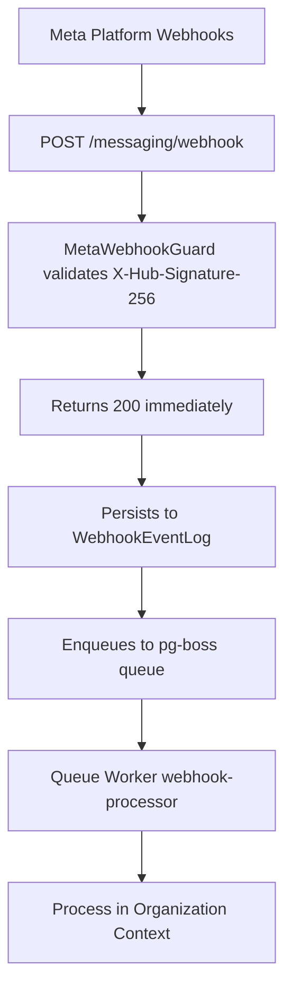

## Overview

The Messaging module provides a unified, channel-agnostic messaging system for WhatsApp, Instagram, and Facebook Messenger. It replaces the separate per-channel modules with shared entities, a shared queue, and a single WebSocket namespace.

<Note>
This specification was last updated on 2026-04-06 and is currently active.
</Note>

### Problem → Solution

| Problem | Solution |
|---------|----------|
| Duplicated logic across WhatsApp and Instagram modules | Single `MessagingModule` with channel providers |
| No webhook signature validation (security gap) | Shared `MetaWebhookGuard` validates `X-Hub-Signature-256` |
| Inconsistent WebSocket auth (Instagram gateway has no JWT) | Single `/messaging` gateway with JWT auth |
| No Facebook Messenger support | Third channel provider |
| Separate entity schemas per channel | Unified entities: `Conversation`, `Message`, `ChannelAccount` |
| No shared queue infrastructure | Shared `PgBossQueueService` for messaging + notifications |

### Key Design Decisions

<AccordionGroup>
<Accordion title="Queue Technology">
**pg-boss over BullMQ** — Project already uses pg-boss for notifications. No new Redis dependency. Interface-based design (`IQueueService`) allows swapping later.
</Accordion>

<Accordion title="CRM Integration">
**Direct PersonChannel FK on Conversation** — Conversations link directly to the CRM's `PersonChannel` via FK. Simpler model, no bidirectional sync overhead.
</Accordion>

<Accordion title="Archive Pattern">
**Archive as boolean, not status** — `Conversation.isArchived` is orthogonal to `status` (OPEN/CLOSED), following `ARCHIVE_SYSTEM_SPECIFICATION.md`.
</Accordion>

<Accordion title="Ownership Model">
**Simplified ownership (direct FKs, not `entity_stakeholder`)** — Conversations use direct `assignedAgentId`/`assignedTeamId` FKs instead of the CRM `entity_stakeholder` pattern.
</Accordion>

<Accordion title="Message Delivery">
**Transactional outbox** — Outbound messages use an outbox table written in the same DB transaction as the Message entity, guaranteeing at-least-once delivery.
</Accordion>
</AccordionGroup>

## Architecture & Module Structure



<Steps>
<Step title="Webhook Reception">
Meta platform webhooks (WhatsApp, Instagram, Messenger) arrive at the public endpoint with signature validation
</Step>

<Step title="Immediate Response">
System returns HTTP 200 immediately and persists the event to `WebhookEventLog`
</Step>

<Step title="Queue Processing">
Worker processes events asynchronously:
- Check idempotency via `externalEventId`
- Find organization context
- Route to appropriate channel provider
- Create/update entities and emit events
</Step>
</Steps>

### Module Structure

```
src/modules/meta-platform/    ← Top-level infra module
  meta-platform.module.ts
  meta-graph-api.service.ts
  meta-api.error.ts
  meta-webhook.guard.ts
  meta-oauth.service.ts
  webhook-event-log.entity.ts

src/modules/queue/            ← Top-level infra module

src/modules/messaging/
  messaging.module.ts
  entities/               ← Core entities
  enums/                  ← Channel, MessageType, etc.
  services/               ← Core services + providers/
    providers/            ← WhatsApp, Instagram, Messenger
  controllers/            ← API endpoints
  gateways/               ← WebSocket gateway
  queues/                 ← Background processors
  dto/                    ← Request/response DTOs
  utils/                  ← Utilities
  migration/              ← Legacy migration
```

## Multi-Tenancy Patterns

<Warning>
The messaging module introduces unique multi-tenancy challenges because webhooks arrive without org context.
</Warning>

### Two-Step RLS Bypass (Webhook Processing)

The webhook controller receives events for ALL organizations from a single Meta App. Organization context is unknown at arrival time.

<CodeGroup>
```typescript Step 1: Find Organization
// Step 1: Find which org owns this account (bypass RLS)
const account = await this.tenantContext.executeReadOnlyWithBypass(async (em) => {
  return em.findOne(ChannelAccount, { externalAccountId: job.data.accountId });
});
```

```typescript Step 2: Process in Context
// Step 2: Process within that org's context
await this.tenantContext.executeInOrg(
  account.organization.id,
  async (em) => {
    await this.processMessageInTransaction(em, job.data);
  },
  { userId: undefined }, // system action, no user
);
```
</CodeGroup>

### Composable Transaction Pattern

Services that participate in existing transactions expose `*InTransaction` methods:

```typescript
// Public API — wraps TenantContext
async matchOrCreate(channel, identifier, profileData, orgId): Promise<MatchResult>;

// Composable — accepts EntityManager from caller's transaction
async matchOrCreateInTransaction(em, channel, identifier, profileData, orgId): Promise<MatchResult>;
```

<Note>
The `em` parameter must always be the one provided by the TenantContext callback — never `this.em`.
</Note>

### Forbidden Patterns

<Warning>
These patterns will cause bugs or security issues:
</Warning>

| Pattern | Why It's Forbidden |
|---------|-------------------|
| Using `*Impl` method names | Project convention uses `*InTransaction` suffix |
| Nesting TenantContext calls | Causes deadlocks or incorrect org context |
| Using `this.em` inside TenantContext callbacks | Bypasses the transaction-scoped EntityManager |
| Using `executeWithBypass()` when you have an org context | Silently disables RLS, exposing cross-tenant data |

## Entities

### Entity Overview

| Entity | Purpose |
|--------|---------|
| `ChannelAccount` | Connected channel account (WA number, IG page, FB page) at org or personal level |
| `Conversation` | Unified conversation thread linked to PersonChannel and CRM entities |
| `Message` | Individual message record with status tracking |
| `MessageTemplate` | Message templates (Meta-approved, quick-reply, AI prompt) |
| `MessageOutbox` | Transactional outbox for reliable message delivery |
| `AutomationRule` | Rules for automated responses and actions |

### ChannelAccount Entity

```typescript
@Entity()
export class ChannelAccount extends BaseEntity {
  @Column({ type: 'enum', enum: Channel })
  channel: Channel;

  @Column()
  externalAccountId: string; // Phone number for WA, Page ID for others

  @Column({ nullable: true })
  pageId?: string; // Facebook Page ID for Instagram

  @Column()
  displayName: string;

  @Column({ nullable: true })
  profilePictureUrl?: string;

  @Column({ type: 'enum', enum: ChannelAccountLevel })
  level: ChannelAccountLevel; // ORGANIZATION | PERSONAL

  @Column({ type: 'enum', enum: ChannelAccountStatus })
  status: ChannelAccountStatus;

  @Column({ type: 'enum', enum: AiMode })
  defaultAiMode: AiMode;

  @ManyToOne(() => Organization)
  organization: Relation<Organization>;

  @ManyToOne(() => User, { nullable: true })
  personalUser?: Relation<User>; // Only for personal accounts
}
```

### Conversation Entity

```typescript
@Entity()
export class Conversation extends BaseEntity {
  @Column()
  externalConversationId: string; // Platform conversation ID

  @Column({ type: 'enum', enum: ConversationStatus })
  status: ConversationStatus;

  @Column({ default: false })
  isArchived: boolean;

  @Column({ type: 'enum', enum: AiMode })
  aiMode: AiMode;

  @ManyToOne(() => ChannelAccount)
  channelAccount: Relation<ChannelAccount>;

  @ManyToOne(() => PersonChannel)
  personChannel: Relation<PersonChannel>;

  @ManyToOne(() => User, { nullable: true })
  assignedAgent?: Relation<User>;

  @ManyToOne(() => Team, { nullable: true })
  assignedTeam?: Relation<Team>;

  @OneToMany(() => Message, (message) => message.conversation)
  messages: Relation<Message>[];
}
```

### Message Entity

```typescript
@Entity()
export class Message extends BaseEntity {
  @Column()
  externalMessageId: string;

  @Column({ type: 'enum', enum: MessageDirection })
  direction: MessageDirection;

  @Column({ type: 'enum', enum: MessageType })
  type: MessageType;

  @Column({ type: 'text', nullable: true })
  text?: string;

  @Column({ type: 'json', nullable: true })
  metadata?: Record<string, any>;

  @Column({ type: 'enum', enum: MessageStatus })
  status: MessageStatus;

  @ManyToOne(() => Conversation)
  conversation: Relation<Conversation>;

  @ManyToOne(() => User, { nullable: true })
  sender?: Relation<User>; // Agent who sent (for outbound)
}
```

## Enums

<AccordionGroup>
<Accordion title="Channel">
```typescript
export enum Channel {
  WHATSAPP = 'WHATSAPP',
  INSTAGRAM = 'INSTAGRAM',
  FACEBOOK_MESSENGER = 'FACEBOOK_MESSENGER',
}
```
</Accordion>

<Accordion title="Message Types">
```typescript
export enum MessageType {
  TEXT = 'TEXT',
  IMAGE = 'IMAGE',
  AUDIO = 'AUDIO',
  VIDEO = 'VIDEO',
  DOCUMENT = 'DOCUMENT',
  TEMPLATE = 'TEMPLATE',
  REACTION = 'REACTION',
  SYSTEM = 'SYSTEM',
}

export enum MessageDirection {
  INBOUND = 'INBOUND',
  OUTBOUND = 'OUTBOUND',
}

export enum MessageStatus {
  PENDING = 'PENDING',
  SENT = 'SENT',
  DELIVERED = 'DELIVERED',
  READ = 'READ',
  FAILED = 'FAILED',
}
```
</Accordion>

<Accordion title="Conversation">
```typescript
export enum ConversationStatus {
  OPEN = 'OPEN',
  CLOSED = 'CLOSED',
}

export enum AiMode {
  OFF = 'OFF',
  AUTO_REPLY = 'AUTO_REPLY',
  SUGGEST_ONLY = 'SUGGEST_ONLY',
  DRAFT = 'DRAFT',
}
```
</Accordion>
</AccordionGroup>

## Message Flows

### Inbound Message Flow

<Steps>
<Step title="Webhook Reception">
Meta platform sends webhook to `POST /messaging/webhook`
</Step>

<Step title="Validation & Queuing">
- Validate signature with `MetaWebhookGuard`
- Return HTTP 200 immediately
- Persist to `WebhookEventLog`
- Enqueue to `webhook-processor` queue
</Step>

<Step title="Async Processing">
- Check idempotency via `externalEventId`
- Find organization context
- Route to channel provider (WhatsApp/Instagram/Messenger)
- Match or create `PersonChannel`, `Person`, `Lead`
- Find or create `Conversation`
- Create `Message` record
</Step>

<Step title="Integration & Events">
- Create CRM Activity via bridge
- Update `PersonChannel` stats
- Emit WebSocket events (`message-created`, `conversation-updated`)
- Emit notification events
</Step>
</Steps>

### Outbound Message Flow

<Steps>
<Step title="API Request">
Agent sends message via `POST /messaging/conversations/{id}/messages`
</Step>

<Step title="Transactional Write">
- Create `Message` record
- Create `MessageOutbox` entry in same transaction
- Return success to agent immediately
</Step>

<Step title="Async Delivery">
- `message-sender` queue processes outbox
- Send via Meta Graph API
- Update message status
- Delete outbox entry on success
</Step>

<Step title="Status Updates">
- Webhook delivers status updates (sent/delivered/read)
- Update message status
- Emit WebSocket events
</Step>
</Steps>

## Business Rules

### Conversation Assignment

<Tabs>
<Tab title="Auto-Assignment">
New conversations are assigned based on:
1. Previous conversation with same PersonChannel
2. Team round-robin if PersonChannel has assigned team
3. Organization default agent/team
4. Unassigned if no defaults configured
</Tab>

<Tab title="Manual Assignment">
Agents with `MESSAGING_MANAGE` permission can:
- Assign conversations to themselves
- Transfer to other agents/teams
- Bulk assign multiple conversations
</Tab>
</Tabs>

### AI Mode Cascade

Each conversation has an `aiMode` field with the following cascade:

1. **Conversation-specific setting** (highest priority)
2. **ChannelAccount.defaultAiMode**
3. **Organization default AI mode**
4. **OFF** (fallback)

<Note>
AI mode can be changed per conversation by agents with appropriate permissions.
</Note>

### Archive vs Status

<Info>
`isArchived` is orthogonal to `status`. A conversation can be:
- Open + Not Archived (active)
- Open + Archived (archived but can receive new messages)
- Closed + Not Archived (closed but visible in inbox)
- Closed + Archived (fully archived)
</Info>

## RBAC Permissions & Access Control

### Permission Levels

| Permission | Scope | Description |
|------------|-------|-------------|
| `MESSAGING_VIEW` | Organization | View conversations and messages |
| `MESSAGING_SEND` | Organization | Send messages, close/reopen conversations |
| `MESSAGING_MANAGE` | Organization | Full management (assign, transfer, archive) |
| `MESSAGING_ADMIN` | Organization | Channel account management, templates |

### Personal Account Access

<Warning>
Personal channel accounts have special access control rules that bypass organization permissions.
</Warning>

```typescript
// Personal account access check
if (conversation.channelAccount.level === ChannelAccountLevel.PERSONAL) {
  const hasPersonalAccess = conversation.channelAccount.personalUser?.id === userId;
  if (!hasPersonalAccess) {
    throw new ForbiddenException('Access denied to personal account conversation');
  }
}
```

### Resource Permissions

Conversations return `ResourcePermissionsDto` following the project-wide CRM pattern:

```typescript
interface ConversationResourcePermissions {
  canView: boolean;        // Based on org permission + assignment + personal ownership
  canEdit: boolean;        // false for non-MESSAGING_MANAGE users
  canTransfer: boolean;    // MESSAGING_MANAGE only
  canAssign: boolean;      // MESSAGING_MANAGE only  
  canArchive: boolean;     // MESSAGING_MANAGE only
  canDelete: boolean;      // false (messages are immutable)
}
```

<Note>
Operational actions like close/reopen and AI mode changes are available to `MESSAGING_SEND` users and are not gated by `canEdit`.
</Note>

## API Endpoints

### Webhook Endpoints

<CodeGroup>
```http Webhook Reception
POST /messaging/webhook
# Public endpoint with signature validation
# Returns 200 immediately, processes async
```

```http Webhook Verification
GET /messaging/webhook?hub.mode=subscribe&hub.challenge=...
# Meta webhook verification
```
</CodeGroup>

### Conversation Management

<CodeGroup>
```http List Conversations
GET /messaging/conversations
Query Parameters:
- status?: ConversationStatus
- isArchived?: boolean
- assignedAgentId?: string
- assignedTeamId?: string
- channelAccountId?: string
- search?: string (person name, phone, message text)
```

```http Get Conversation
GET /messaging/conversations/{id}
# Includes messages, permissions, related CRM entities
```

```http Update Conversation
PATCH /messaging/conversations/{id}
Body:
- status?: ConversationStatus
- isArchived?: boolean
- aiMode?: AiMode
- assignedAgentId?: string | null
- assignedTeamId?: string | null
```
</CodeGroup>

### Message Operations

<CodeGroup>
```http Send Message
POST /messaging/conversations/{id}/messages
Body:
- type: MessageType
- text?: string
- templateId?: string
- templateVariables?: Record<string, string>
```

```http Get Messages
GET /messaging/conversations/{id}/messages
Query Parameters:
- limit?: number (default 50, max 100)
- before?: string (cursor for pagination)
- after?: string
```
</CodeGroup>

### Channel Account Management

<CodeGroup>
```http List Channel Accounts
GET /messaging/channel-accounts
# Organization and personal accounts for current user
```

```http Connect Account
POST /messaging/channel-accounts/connect
Body:
- channel: Channel
- level: ChannelAccountLevel
- code?: string (OAuth code)
- phoneNumberId?: string (WhatsApp only)
```

```http Disconnect Account
DELETE /messaging/channel-accounts/{id}
# Requires MESSAGING_ADMIN or personal account ownership
```
</CodeGroup>

## WebSocket Events & Room Architecture

### Room Structure

<Tabs>
<Tab title="Organization Rooms">
- `org:{orgId}` - All conversations in organization
- `agent:{userId}` - Conversations assigned to specific agent  
- `team:{teamId}` - Conversations assigned to specific team
</Tab>

<Tab title="Conversation Rooms">
- `conversation:{conversationId}` - Specific conversation updates
- `person:{personId}` - All conversations for a person across channels
</Tab>
</Tabs>

### Event Types

<AccordionGroup>
<Accordion title="Message Events">
```typescript
// New message created
'message-created': {
  message: MessageDto;
  conversation: ConversationDto;
}

// Message status updated
'message-status-updated': {
  messageId: string;
  status: MessageStatus;
  conversationId: string;
}
```
</Accordion>

<Accordion title="Conversation Events">
```typescript
// Conversation updated
'conversation-updated': {
  conversation: ConversationDto;
  changes: string[]; // Changed fields
}

// Conversation assigned
'conversation-assigned': {
  conversationId: string;
  assignedAgent?: UserDto;
  assignedTeam?: TeamDto;
  previousAgent?: UserDto;
  previousTeam?: TeamDto;
}
```
</Accordion>

<Accordion title="Typing Indicators">
```typescript
// Agent typing
'agent-typing': {
  conversationId: string;
  agent: UserDto;
}

// Customer typing (from webhook)
'customer-typing': {
  conversationId: string;
  personChannel: PersonChannelDto;
}
```
</Accordion>
</AccordionGroup>

### WebSocket Client Events

<CodeGroup>
```typescript Join Conversation
socket.emit('join-conversation', {
  conversationId: string;
});
```

```typescript Start Typing
socket.emit('start-typing', {
  conversationId: string;
});
```

```typescript Stop Typing
socket.emit('stop-typing', {
  conversationId: string;
});
```
</CodeGroup>

## Error Handling & Retry Strategy

### Webhook Processing

<Steps>
<Step title="Immediate Validation">
- Signature validation via `MetaWebhookGuard`
- Return 200 immediately to prevent Meta retries
- Log validation failures
</Step>

<Step title="Queue Processing">
- Idempotency check via `externalEventId`
- Exponential backoff for transient failures
- Dead letter queue after 5 attempts
- Error categorization (retryable vs permanent)
</Step>

<Step title="Outbound Messages">
- Transactional outbox pattern
- Retry with exponential backoff
- Rate limiting compliance
- Status update handling
</Step>
</Steps>

### Error Categories

<Tabs>
<Tab title="Retryable Errors">
- Network timeouts
- Rate limiting (429)
- Temporary API errors (5xx)
- Database connection issues
</Tab>

<Tab title="Permanent Errors">
- Invalid webhook signatures
- Malformed payloads
- Account not found
- Insufficient permissions
</Tab>
</Tabs>

## Deployment Considerations

### Database Migration

<Warning>
The messaging module requires careful migration from legacy WhatsApp and Instagram modules.
</Warning>

<Steps>
<Step title="Schema Creation">
- Deploy new messaging tables
- Keep legacy tables for data migration
- Set up indexes and constraints
</Step>

<Step title="Data Migration">
- Run migration scripts during maintenance window
- Migrate WhatsApp conversations and messages
- Migrate Instagram conversations and messages
- Verify data integrity
</Step>

<Step title="Module Switchover">
- Deploy new messaging module (disabled)
- Stop legacy webhook endpoints
- Enable messaging webhooks
- Monitor for issues
</Step>

<Step title="Cleanup">
- Drop legacy tables after verification period
- Remove legacy module code
- Update documentation
</Step>
</Steps>

### Queue Configuration

```typescript
// pg-boss queue configuration
const queueConfig = {
  'webhook-processor': {
    retryLimit: 5,
    retryDelay: 30, // seconds
    expireInHours: 24,
    priority: 100, // high priority
  },
  'message-sender': {
    retryLimit: 3,
    retryDelay: 60,
    expireInHours: 48,
    priority: 90,
  },
  'media-downloader': {
    retryLimit: 3,
    retryDelay: 120,
    expireInHours: 72,
    priority: 50,
  },
};
```

## Testing Strategy

### Unit Tests

<CardGroup cols={2}>
<Card title="Service Layer" icon="gear">
- Channel providers (WhatsApp, Instagram, Messenger)
- Message processing logic
- Permission calculations
- Queue job handlers
</Card>

<Card title="Entity Logic" icon="database">
- Entity validations
- Enum constraints
- Relationship mappings
- Migration scripts
</Card>
</CardGroup>

### Integration Tests

<Tabs>
<Tab title="Webhook Processing">
- End-to-end webhook flow
- Signature validation
- Idempotency handling
- Multi-tenant data isolation
</Tab>

<Tab title="API Endpoints">
- RBAC enforcement
- Personal account access
- WebSocket event emission
- Transaction rollback scenarios
</Tab>
</Tabs>

### Load Testing

<Check>
Key scenarios to test:
- High webhook volume (1000+ events/minute)
- Concurrent message sending
- WebSocket connection limits
- Queue processing backlog
</Check>

## Future Phases

### Phase 2: Advanced Features

<AccordionGroup>
<Accordion title="Rich Media Support">
- File upload/download
- Image/video processing
- Document preview
- Media encryption
</Accordion>

<Accordion title="Advanced Automation">
- Workflow builder
- Conditional logic
- External integrations
- A/B testing for templates
</Accordion>

<Accordion title="Analytics & Reporting">
- Conversation metrics
- Agent performance
- Channel comparison
- Customer satisfaction scores
</Accordion>
</AccordionGroup>

### Phase 3: Platform Expansion

- **Telegram** support
- **SMS** integration via Twilio
- **Email** conversations
- **Live chat** widget for websites

## Related Documentation

<CardGroup cols={2}>
<Card title="Multi-Tenancy Guide" href="/backend/multi-tenancy">
Complete RLS patterns and tenant isolation
</Card>

<Card title="Queue System" href="/backend/queue">
pg-boss configuration and job patterns
</Card>

<Card title="WebSocket Architecture" href="/backend/websockets">
Gateway setup and room management
</Card>

<Card title="RBAC Specification" href="/backend/rbac">
Permission system and access control
</Card>
</CardGroup>