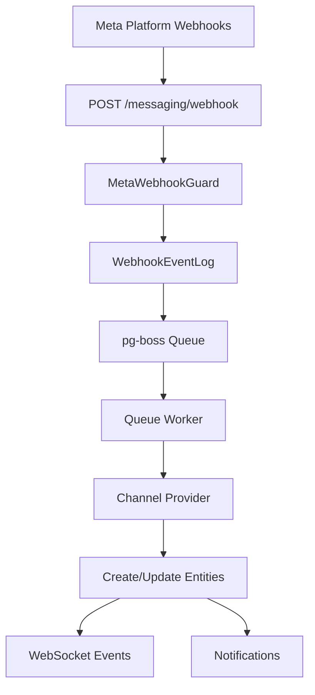
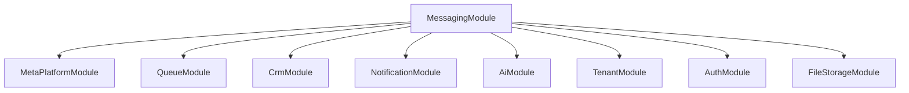

<Note>
**Last Updated:** 2026-04-06  
**Status:** Active
</Note>

The Messaging module provides a unified, channel-agnostic messaging system for WhatsApp, Instagram, and Facebook Messenger. It replaces the separate per-channel modules with shared entities, a shared queue, and a single WebSocket namespace.

## Overview

### Problem → Solution

| Problem | Solution |
|---------|----------|
| Duplicated logic across WhatsApp and Instagram modules | Single `MessagingModule` with channel providers |
| No webhook signature validation (security gap) | Shared `MetaWebhookGuard` validates `X-Hub-Signature-256` |
| Inconsistent WebSocket auth (Instagram gateway has no JWT) | Single `/messaging` gateway with JWT auth |
| No Facebook Messenger support | Third channel provider |
| Separate entity schemas per channel | Unified entities: `Conversation`, `Message`, `ChannelAccount` |
| No shared queue infrastructure | Shared `PgBossQueueService` for messaging + notifications |

### Key Design Decisions

<AccordionGroup>
<Accordion title="Queue Technology: pg-boss over BullMQ">
Project already uses pg-boss for notifications. No new Redis dependency. Interface-based design (`IQueueService`) allows swapping later.
</Accordion>

<Accordion title="Conversation Model: Direct PersonChannel FK">
Conversations link directly to the CRM's `PersonChannel` via FK. Simpler model, no bidirectional sync overhead.
</Accordion>

<Accordion title="Archive Pattern: Boolean, not status">
`Conversation.isArchived` is orthogonal to `status` (OPEN/CLOSED), following `ARCHIVE_SYSTEM_SPECIFICATION.md`.
</Accordion>

<Accordion title="Ownership Model: Direct FKs">
Conversations use direct `assignedAgentId`/`assignedTeamId` FKs instead of the CRM `entity_stakeholder` pattern. Rationale: conversations have single-owner semantics. Transfer history is tracked via WebSocket events and notifications.
</Accordion>

<Accordion title="Message Delivery: Transactional outbox">
Outbound messages use an outbox table written in the same DB transaction as the Message entity, guaranteeing at-least-once delivery.
</Accordion>

<Accordion title="AI Integration: Per-conversation mode with cascade">
Each conversation has an `aiMode` field (OFF, AUTO_REPLY, SUGGEST_ONLY, DRAFT). Default cascades: ChannelAccount.defaultAiMode → Organization default → OFF.
</Accordion>

<Accordion title="Template System: Three-tier approach">
`MessageTemplate` supports three types: `META_APPROVED` (platform-approved), `QUICK_REPLY` (agent shortcuts), and `AI_PROMPT` (AI system prompts).
</Accordion>

<Accordion title="Personal Accounts: Shared org WABA token">
WhatsApp personal accounts reuse the organization's WABA access token. Instagram and Messenger personal accounts use their own Page Access Token via OAuth.
</Accordion>
</AccordionGroup>

## Architecture & Module Structure



### Module Structure

```
src/modules/meta-platform/    ← Top-level infra module
  meta-platform.module.ts
  meta-graph-api.service.ts
  meta-api.error.ts
  meta-webhook.guard.ts
  meta-oauth.service.ts
  webhook-event-log.entity.ts

src/modules/queue/            ← Queue infrastructure

src/modules/messaging/
  messaging.module.ts
  entities/                   ← Core entities
  enums/                     ← Channel, MessageType, etc.
  services/
    providers/               ← WhatsApp, Instagram, Messenger
  controllers/               ← API endpoints
  gateways/                  ← WebSocket gateway
  queues/                    ← Workers
  dto/                       ← Request/response DTOs
  utils/                     ← Utilities
  migration/                 ← Legacy migration
```

## Multi-Tenancy Patterns

<Warning>
The messaging module introduces unique multi-tenancy challenges because webhooks arrive without org context.
</Warning>

### Two-Step RLS Bypass (Webhook Processing)

The webhook controller receives events for ALL organizations from a single Meta App. Org context is unknown at arrival time.

<CodeGroup>
```typescript Step 1: Find Organization
// Bypass RLS to find which org owns this account
const account = await this.tenantContext.executeReadOnlyWithBypass(async (em) => {
  return em.findOne(ChannelAccount, { externalAccountId: job.data.accountId });
});
```

```typescript Step 2: Process in Context
// Process within that org's context
await this.tenantContext.executeInOrg(
  account.organization.id,
  async (em) => {
    await this.processMessageInTransaction(em, job.data);
  },
  { userId: undefined }, // system action
);
```
</CodeGroup>

### Composable Transaction Pattern

Services that participate in existing transactions expose `*InTransaction` methods:

```typescript
// Public API — wraps TenantContext
async matchOrCreate(channel, identifier, profileData, orgId): Promise<MatchResult>;

// Composable — accepts EntityManager from caller's transaction
async matchOrCreateInTransaction(em, channel, identifier, profileData, orgId): Promise<MatchResult>;
```

<Note>
The `em` parameter must always be the one provided by the TenantContext callback — never `this.em`.
</Note>

### Forbidden Patterns

| Pattern | Why It's Forbidden |
|---------|-------------------|
| Using `*Impl` method names | Project convention uses `*InTransaction` suffix |
| Nesting TenantContext calls | Causes deadlocks or incorrect org context |
| Using `this.em` inside callbacks | Bypasses the transaction-scoped EntityManager |
| Using `executeWithBypass()` with org context | Silently disables RLS, exposing cross-tenant data |

### WebSocket Gateway Pattern

Every `@SubscribeMessage` handler must establish org context per message:

```typescript
@SubscribeMessage('join-conversation')
async handleJoinConversation(client: AuthenticatedSocket, data: { conversationId: string }) {
  return this.tenantContext.executeInOrg(client.organizationId, async (em) => {
    // Verify access, join room
  });
}
```

## Entities

### Summary

| Entity | Purpose |
|--------|---------|
| `ChannelAccount` | Connected channel account (WA number, IG page, FB page) at org or personal level |
| `Conversation` | Unified conversation thread linked to PersonChannel and CRM entities |
| `Message` | Individual message record with status tracking |
| `MessageTemplate` | Message templates (Meta-approved, quick-reply, AI prompt) |

### ChannelAccount

Represents a connected messaging channel account at organization or personal level.

<Tabs>
<Tab title="Schema">
```typescript
@Entity('channel_account')
export class ChannelAccount {
  @PrimaryGeneratedColumn('uuid')
  id: string;

  @Column({ type: 'enum', enum: Channel })
  channel: Channel; // WHATSAPP, INSTAGRAM, MESSENGER

  @Column()
  externalAccountId: string; // Phone number ID, IG Business Account ID, Page ID

  @Column({ nullable: true })
  pageId?: string; // Facebook Page ID (for Instagram Send API)

  @Column({ type: 'enum', enum: AccountLevel })
  level: AccountLevel; // ORGANIZATION, PERSONAL

  @Column()
  name: string;

  @Column({ nullable: true })
  profilePictureUrl?: string;

  @Column({ type: 'enum', enum: AccountStatus })
  status: AccountStatus; // CONNECTED, DISCONNECTED, ERROR

  @Column({ type: 'enum', enum: AiMode })
  defaultAiMode: AiMode; // OFF, AUTO_REPLY, SUGGEST_ONLY, DRAFT

  @ManyToOne(() => Organization)
  organization: Organization;

  @ManyToOne(() => User, { nullable: true })
  personalUser?: User; // Only for PERSONAL level accounts

  @CreateDateColumn()
  createdAt: Date;

  @UpdateDateColumn()
  updatedAt: Date;
}
```
</Tab>
<Tab title="Key Points">
- **Personal accounts**: Link to specific user via `personalUser`
- **WhatsApp personal**: Reuse org WABA token  
- **Instagram/Messenger personal**: Own Page Access Token
- **pageId field**: Required for Instagram Send API calls
- **defaultAiMode**: Cascades to new conversations
</Tab>
</Tabs>

### Conversation

Unified conversation thread linking messaging to CRM entities.

<Tabs>
<Tab title="Schema">
```typescript
@Entity('conversation')
export class Conversation {
  @PrimaryGeneratedColumn('uuid')
  id: string;

  @Column()
  externalConversationId: string; // Platform-specific conversation ID

  @ManyToOne(() => ChannelAccount)
  channelAccount: ChannelAccount;

  @ManyToOne(() => PersonChannel)
  personChannel: PersonChannel; // Direct FK to CRM

  @Column({ type: 'enum', enum: ConversationStatus })
  status: ConversationStatus; // OPEN, CLOSED

  @Column({ default: false })
  isArchived: boolean; // Orthogonal to status

  @Column({ type: 'enum', enum: AiMode })
  aiMode: AiMode; // Per-conversation override

  @ManyToOne(() => User, { nullable: true })
  assignedAgent?: User;

  @ManyToOne(() => Team, { nullable: true })
  assignedTeam?: Team;

  @Column({ nullable: true })
  lastMessageAt?: Date;

  @Column({ default: 0 })
  unreadCount: number;

  @CreateDateColumn()
  createdAt: Date;

  @UpdateDateColumn()
  updatedAt: Date;
}
```
</Tab>
<Tab title="Business Rules">
- **Direct CRM link**: Via `PersonChannel` FK
- **Archive vs Status**: Independent flags
- **AI Mode**: Overrides account default
- **Assignment**: Single agent OR team
- **Unread tracking**: Auto-managed
</Tab>
</Tabs>

### Message

Individual message record with status tracking and media support.

<Tabs>
<Tab title="Schema">
```typescript
@Entity('message')
export class Message {
  @PrimaryGeneratedColumn('uuid')
  id: string;

  @Column({ nullable: true })
  externalMessageId?: string; // Platform message ID

  @ManyToOne(() => Conversation)
  conversation: Conversation;

  @Column({ type: 'enum', enum: MessageDirection })
  direction: MessageDirection; // INBOUND, OUTBOUND

  @Column({ type: 'enum', enum: MessageType })
  type: MessageType; // TEXT, IMAGE, AUDIO, VIDEO, DOCUMENT, LOCATION, etc.

  @Column({ type: 'text', nullable: true })
  content?: string; // Text content

  @Column({ type: 'jsonb', nullable: true })
  metadata?: any; // Media URLs, location data, etc.

  @Column({ type: 'enum', enum: MessageStatus })
  status: MessageStatus; // PENDING, SENT, DELIVERED, READ, FAILED

  @Column({ nullable: true })
  errorMessage?: string;

  @ManyToOne(() => User, { nullable: true })
  sentBy?: User; // Agent who sent (for outbound)

  @Column({ nullable: true })
  templateId?: string; // Reference to MessageTemplate

  @CreateDateColumn()
  createdAt: Date;
}
```
</Tab>
<Tab title="Message Types">
- **TEXT**: Plain text messages
- **IMAGE**: Photo attachments
- **AUDIO**: Voice messages
- **VIDEO**: Video attachments  
- **DOCUMENT**: File attachments
- **LOCATION**: GPS coordinates
- **TEMPLATE**: Template messages
- **INTERACTIVE**: Buttons, lists
</Tab>
</Tabs>

### MessageTemplate

Three-tier template system for different use cases.

<Tabs>
<Tab title="Schema">
```typescript
@Entity('message_template')
export class MessageTemplate {
  @PrimaryGeneratedColumn('uuid')
  id: string;

  @Column()
  name: string;

  @Column({ type: 'enum', enum: TemplateType })
  type: TemplateType; // META_APPROVED, QUICK_REPLY, AI_PROMPT

  @Column({ type: 'enum', enum: Channel, nullable: true })
  channel?: Channel; // Null = cross-channel

  @Column({ type: 'text' })
  content: string; // Template body with variables

  @Column({ type: 'jsonb', nullable: true })
  variables?: string[]; // Available variables

  @Column({ type: 'jsonb', nullable: true })
  buttons?: any[]; // Interactive elements

  @Column({ nullable: true })
  externalTemplateId?: string; // Platform template ID

  @ManyToOne(() => Organization)
  organization: Organization;

  @CreateDateColumn()
  createdAt: Date;
}
```
</Tab>
<Tab title="Template Types">
- **META_APPROVED**: Platform-approved templates for notifications
- **QUICK_REPLY**: Agent shortcuts with variable resolution  
- **AI_PROMPT**: System prompts for AI assistance
</Tab>
</Tabs>

## Message Flows

### Inbound Message Flow

<Steps>
<Step title="Webhook Arrival">
Meta platform sends webhook to `POST /messaging/webhook`
- `@PublicEndpoint()` + `MetaWebhookGuard` validates signature
- Returns 200 immediately
- Persists to `WebhookEventLog`
- Enqueues to pg-boss queue
</Step>

<Step title="Queue Processing">
Worker processes webhook event:
- Check idempotency via `externalEventId`
- Find organization using RLS bypass
- Execute within org context
</Step>

<Step title="Message Processing">
Within transaction:
- Route to appropriate channel provider
- Match/create `PersonChannel` and `Person`
- Find/create `Conversation`
- Create `Message` record
- Update conversation metadata
- Create CRM Activity
</Step>

<Step title="Event Broadcasting">
- Emit WebSocket events to relevant rooms
- Trigger notification events
- Update dashboard metrics
</Step>
</Steps>

### Outbound Message Flow

<Steps>
<Step title="Message Creation">
Agent sends message via API:
- Validate permissions and conversation access
- Create `Message` record
- Create `MessageOutbox` entry (transactional)
</Step>

<Step title="Outbox Processing">
Message sender queue worker:
- Process outbox entries
- Call platform API via channel provider
- Update message status
- Handle delivery confirmations
</Step>

<Step title="Status Updates">
- Platform webhooks provide delivery status
- Update `Message.status` field
- Broadcast status changes via WebSocket
</Step>
</Steps>

## Business Rules

### Conversation Management

<Info>
Conversations follow specific lifecycle and assignment rules.
</Info>

#### Conversation Creation
- Auto-created on first inbound message
- Linked to existing or new `PersonChannel`
- Inherits AI mode from account default
- Status starts as `OPEN`

#### Assignment Rules
```typescript
// Assignment priority (first match wins)
1. Existing assignment (preserve current)
2. Personal account → account owner
3. Round-robin to available agents
4. Unassigned (manual assignment required)
```

#### AI Mode Cascade
```typescript
conversation.aiMode = conversation.aiMode 
  ?? channelAccount.defaultAiMode 
  ?? organization.defaultAiMode 
  ?? AiMode.OFF
```

### Message Validation

#### Content Limits
| Channel | Text Limit | Media Size |
|---------|------------|------------|
| WhatsApp | 4,096 chars | 100MB |
| Instagram | 1,000 chars | 25MB |
| Messenger | 2,000 chars | 25MB |

#### Template Restrictions
- `META_APPROVED` templates: Can only be sent if approved by platform
- `QUICK_REPLY` templates: Variable substitution required
- Template categories determine allowed usage windows

### Webhook Security

<Warning>
All webhooks must pass signature validation to prevent spoofing.
</Warning>

```typescript
// MetaWebhookGuard validation
const signature = request.headers['x-hub-signature-256'];
const expectedSignature = crypto
  .createHmac('sha256', META_APP_SECRET)
  .update(rawBody)
  .digest('hex');

if (signature !== `sha256=${expectedSignature}`) {
  throw new UnauthorizedException('Invalid webhook signature');
}
```

## RBAC Permissions & Access Control

### Permission Levels

| Permission | Scope | Capabilities |
|------------|-------|--------------|
| `MESSAGING_MANAGE` | Full access | All operations, assign conversations, manage templates |
| `MESSAGING_SEND` | Send messages | Send/receive messages, basic conversation ops |
| `MESSAGING_VIEW` | Read-only | View conversations and messages only |

### Resource-Level Permissions

Conversations return `ResourcePermissionsDto` following CRM patterns:

```typescript
interface ConversationPermissions {
  canView: boolean;      // Based on org permission + assignment
  canEdit: boolean;      // MESSAGING_MANAGE only
  canTransfer: boolean;  // MESSAGING_MANAGE only  
  canAssign: boolean;    // MESSAGING_MANAGE only
  canArchive: boolean;   // MESSAGING_MANAGE only
}
```

### Personal Account Access

Personal accounts have special access rules:

```typescript
// Personal account owners can always access their conversations
if (conversation.channelAccount.level === AccountLevel.PERSONAL 
    && conversation.channelAccount.personalUserId === user.id) {
  return { canView: true, canEdit: true, /* ... */ };
}
```

## WebSocket Events & Room Architecture

### Room Structure

<Tabs>
<Tab title="Room Types">
```typescript
// Organization-wide messaging room
org:{orgId}:messaging

// Per-conversation room  
org:{orgId}:conversation:{conversationId}

// Personal account room
org:{orgId}:personal:{userId}:messaging
```
</Tab>
<Tab title="Auto-Join Logic">
```typescript
// Users auto-join based on permissions
if (hasPermission('MESSAGING_VIEW')) {
  socket.join(`org:${orgId}:messaging`);
}

// Join personal room if has personal accounts
if (hasPersonalAccounts) {
  socket.join(`org:${orgId}:personal:${userId}:messaging`);
}
```
</Tab>
</Tabs>

### Event Types

<AccordionGroup>
<Accordion title="Conversation Events">
- `conversation-created`: New conversation started
- `conversation-updated`: Status, assignment, or metadata changed
- `conversation-archived`: Conversation archived/unarchived
- `message-received`: New inbound message
- `message-sent`: New outbound message  
- `message-status-updated`: Delivery status changed
- `typing-indicator`: Typing status from platform
</Accordion>

<Accordion title="Presence Events">
- `agent-joined`: Agent joined conversation view
- `agent-left`: Agent left conversation view
- `agents-viewing`: List of agents currently viewing
</Accordion>

<Accordion title="AI Events">
- `ai-suggestion`: AI-generated response suggestion
- `ai-status-changed`: AI mode changed for conversation
</Accordion>
</AccordionGroup>

### Event Broadcasting

```typescript
// Broadcast to conversation participants
this.messagingGateway.toRoom(
  `org:${orgId}:conversation:${conversationId}`,
  'message-received',
  messageDto
);

// Broadcast to organization messaging dashboard  
this.messagingGateway.toRoom(
  `org:${orgId}:messaging`, 
  'conversation-updated',
  conversationDto
);
```

## API Endpoints

### Conversation Management

<CodeGroup>
```http GET /conversations
GET /api/v1/conversations?status=OPEN&assignedAgent=me&limit=20

Query Parameters:
- status: OPEN | CLOSED
- assignedAgent: user_id | 'me' | 'unassigned'  
- assignedTeam: team_id
- channel: WHATSAPP | INSTAGRAM | MESSENGER
- isArchived: boolean
- search: string (searches contact name/phone)
- limit: number (default 20, max 100)
- offset: number
```

```http GET /conversations/:id
GET /api/v1/conversations/550e8400-e29b-41d4-a716-446655440000

Response includes:
- Conversation details with permissions
- PersonChannel and Person data  
- Recent messages (last 50)
- Assignment history
```

```http PATCH /conversations/:id
PATCH /api/v1/conversations/550e8400-e29b-41d4-a716-446655440000

{
  "status": "CLOSED",
  "assignedAgentId": "user-id", 
  "assignedTeamId": null,
  "aiMode": "SUGGEST_ONLY"
}
```
</CodeGroup>

### Message Operations

<CodeGroup>
```http POST /conversations/:id/messages
POST /api/v1/conversations/550e8400-e29b-41d4-a716-446655440000/messages

{
  "type": "TEXT",
  "content": "Hello, how can I help you?",
  "templateId": "quick-reply-greeting" // optional
}
```

```http GET /conversations/:id/messages
GET /api/v1/conversations/550e8400-e29b-41d4-a716-446655440000/messages?limit=50&before=2024-01-01T00:00:00Z

Query Parameters:
- limit: number (default 50, max 200)
- before: ISO date (pagination cursor)
- after: ISO date  
- type: MessageType filter
```

```http POST /conversations/:id/media
POST /api/v1/conversations/550e8400-e29b-41d4-a716-446655440000/media

Content-Type: multipart/form-data
- file: File upload
- type: IMAGE | AUDIO | VIDEO | DOCUMENT
- caption: string (optional)
```
</CodeGroup>

### Channel Account Management

<CodeGroup>
```http GET /channel-accounts
GET /api/v1/channel-accounts?level=ORGANIZATION&status=CONNECTED

Response includes account status, capabilities, and metrics.
```

```http POST /channel-accounts/:id/connect
POST /api/v1/channel-accounts/550e8400-e29b-41d4-a716-446655440000/connect

Initiates OAuth flow for personal accounts or validates org tokens.
```

```http DELETE /channel-accounts/:id
DELETE /api/v1/channel-accounts/550e8400-e29b-41d4-a716-446655440000

Disconnects account and archives associated conversations.
```
</CodeGroup>

## Error Handling & Retry Strategy

### Queue Retry Policy

<Tabs>
<Tab title="Webhook Processing">
```typescript
// webhook-processor queue
{
  retryLimit: 5,
  retryDelay: 60, // 1 minute base delay
  retryBackoff: true, // Exponential backoff
  expireInMinutes: 60 // Dead letter after 1 hour
}
```
</Tab>
<Tab title="Message Sending">
```typescript  
// message-sender queue
{
  retryLimit: 3,
  retryDelay: 30,
  retryBackoff: true,
  expireInMinutes: 30
}
```
</Tab>
<Tab title="Media Processing">
```typescript
// media-downloader queue  
{
  retryLimit: 3,
  retryDelay: 60,
  retryBackoff: false, // Fixed delay for media
  expireInMinutes: 120 // Longer timeout for large files
}
```
</Tab>
</Tabs>

### Error Categories

| Error Type | Action | Retry |
|------------|--------|-------|
| `RATE_LIMITED` | Respect rate limit headers | Yes, with delay |
| `INVALID_TOKEN` | Mark account as disconnected | No |
| `TEMPLATE_REJECTED` | Log error, notify user | No |
| `MEDIA_TOO_LARGE` | Reject with user error | No |
| `NETWORK_ERROR` | Standard retry | Yes |
| `INVALID_RECIPIENT` | Mark PersonChannel inactive | No |

### Dead Letter Queue Handling

```typescript
// Failed jobs after all retries
@OnQueueFailed('webhook-processor')
async handleFailedWebhook(job: Job<WebhookEventData>) {
  await this.alertingService.notifyAdmins({
    type: 'WEBHOOK_PROCESSING_FAILED',
    jobId: job.id,
    data: job.data,
    error: job.failedReason
  });
  
  // Mark WebhookEventLog as failed
  await this.updateWebhookEventStatus(job.data.eventId, 'FAILED');
}
```

## Testing Strategy

### Unit Tests

<Check>
**Required Coverage**
- Channel providers: Mock Meta Graph API calls
- Message validation: Test content limits and format rules  
- Permission service: Verify access control logic
- Template engine: Variable substitution and validation
</Check>

### Integration Tests

<Tabs>
<Tab title="Webhook Flow">
```typescript
describe('Webhook Integration', () => {
  it('should process WhatsApp text message', async () => {
    // Send webhook payload
    // Verify database changes
    // Check WebSocket emissions
    // Validate CRM activity creation
  });
});
```
</Tab>
<Tab title="Message Sending">
```typescript  
describe('Message Sending', () => {
  it('should send template message', async () => {
    // Create outbound message
    // Verify outbox processing
    // Mock platform API response
    // Check status updates
  });
});
```
</Tab>
<Tab title="Multi-tenancy">
```typescript
describe('Multi-tenant Isolation', () => {
  it('should isolate org data', async () => {
    // Create data in multiple orgs
    // Verify cross-tenant access blocked
    // Test webhook routing
  });
});
```
</Tab>
</Tabs>

### Load Testing

<Warning>
Critical paths to test under load:
</Warning>

- Webhook ingestion (burst of 1000+ webhooks)
- Queue processing throughput  
- WebSocket connection limits
- Database connection pooling
- Media upload/download performance

### Test Data Factories

```typescript
// Conversation test factory
export const ConversationFactory = {
  build: (overrides = {}) => ({
    id: faker.string.uuid(),
    externalConversationId: faker.phone.number(),
    status: ConversationStatus.OPEN,
    isArchived: false,
    aiMode: AiMode.OFF,
    unreadCount: 0,
    ...overrides
  })
};
```

## Deployment Considerations

### Database Migrations

<Steps>
<Step title="Phase 1: Create New Schema">
- Deploy messaging entities
- Create indices for performance
- Set up RLS policies
- No data migration yet
</Step>

<Step title="Phase 2: Dual Write">
- Write to both old and new schemas
- Background sync existing data
- Validate data consistency
- Monitor performance impact
</Step>

<Step title="Phase 3: Read Migration">
- Switch reads to new schema
- Keep dual write active
- Monitor for issues
- Rollback plan ready
</Step>

<Step title="Phase 4: Cleanup">
- Remove old schema writes
- Drop legacy tables
- Clean up old code
- Archive old data
</Step>
</Steps>

### Environment Configuration

<CodeGroup>
```yaml Production
META_APP_ID: "production-app-id"
META_APP_SECRET: "production-secret"  
META_WEBHOOK_VERIFY_TOKEN: "secure-verify-token"
MESSAGING_QUEUE_CONCURRENCY: 10
MESSAGING_WEBHOOK_TIMEOUT: 30000
MESSAGING_MEDIA_MAX_SIZE: 104857600 # 100MB
```

```yaml Development  
META_APP_ID: "dev-app-id"
META_APP_SECRET: "dev-secret"
META_WEBHOOK_VERIFY_TOKEN: "dev-verify-token"
MESSAGING_QUEUE_CONCURRENCY: 2
MESSAGING_WEBHOOK_TIMEOUT: 5000
MESSAGING_MEDIA_MAX_SIZE: 10485760 # 10MB
```

```yaml Testing
META_APP_ID: "test-app-id" 
META_APP_SECRET: "test-secret"
META_WEBHOOK_VERIFY_TOKEN: "test-verify-token"
MESSAGING_QUEUE_CONCURRENCY: 1
MESSAGING_WEBHOOK_TIMEOUT: 1000
MESSAGING_MEDIA_MAX_SIZE: 1048576 # 1MB
```
</CodeGroup>

### Monitoring & Observability

<Info>
Key metrics to track in production:
</Info>

#### Queue Metrics
- Webhook processing latency (p95 < 5s)
- Queue depth (< 1000 pending jobs)
- Failed job rate (< 1%)
- Dead letter queue size

#### API Metrics  
- Conversation list endpoint latency
- Message send success rate
- WebSocket connection count
- Media upload success rate

#### Business Metrics
- Messages per hour by channel
- Response time by agent/team
- Conversation resolution rate
- AI usage and accuracy

### Scaling Considerations

| Component | Bottleneck | Solution |
|-----------|------------|----------|
| Webhook ingestion | CPU-bound validation | Horizontal scaling, load balancer |
| Queue processing | Database connections | Connection pooling, read replicas |
| WebSocket gateway | Memory per connection | Sticky sessions, Redis adapter |
| Media processing | I/O bound operations | Separate worker pools |
| Database | Query performance | Proper indexing, query optimization |

## Module Dependencies & Integration Points

### Internal Dependencies



### CRM Integration

<Tabs>
<Tab title="PersonChannel Bridge">
```typescript
// Auto-create PersonChannel for new contacts
await this.crmBridgeService.matchOrCreatePersonChannel(
  em,
  channel,
  identifier,
  profileData,
  orgId
);
```
</Tab>
<Tab title="Activity Tracking">
```typescript
// Create CRM activity for each message
await this.crmBridgeService.createActivity(em, {
  type: 'MESSAGE_RECEIVED',
  personChannelId: conversation.personChannelId,
  metadata: { messageId: message.id, channel, content }
});
```
</Tab>
<Tab title="Lead Generation">
```typescript
// Auto-create lead for new conversations
if (!personChannel.person.leadId) {
  await this.crmBridgeService.createLead(em, {
    personId: personChannel.personId,
    source: `${channel}_MESSAGING`,
    assignedAgentId: conversation.assignedAgentId
  });
}
```
</Tab>
</Tabs>

### AI Integration Points

| Integration | Purpose | Implementation |
|-------------|---------|----------------|
| Response suggestions | AI-generated reply options | `AiService.generateSuggestions()` |
| Auto-reply | Automated responses | `AiService.generateAutoReply()` |
| Sentiment analysis | Message sentiment scoring | `AiService.analyzeSentiment()` |
| Intent recognition | Classify message intent | `AiService.classifyIntent()` |
| Language detection | Multi-language support | `AiService.detectLanguage()` |

### Notification Integration

```typescript
// Trigger notifications for messaging events
await this.notificationService.emit({
  type: 'NEW_MESSAGE_RECEIVED',
  organizationId: orgId,
  recipientIds: getNotificationRecipients(conversation),
  data: {
    conversationId: conversation.id,
    messageId: message.id,
    senderName: person.name,
    preview: truncateText(message.content, 50)
  }
});
```

## Legacy Module Removal

### Migration Timeline

<Steps>
<Step title="Assessment Phase">
**Duration:** 2 weeks
- Audit existing WhatsApp/Instagram modules
- Identify data to migrate
- Map feature parity gaps
- Create migration scripts
</Step>

<Step title="Data Migration">
**Duration:** 2 weeks  
- Migrate historical conversations
- Migrate message history
- Migrate template configurations
- Validate data integrity
</Step>

<Step title="Feature Migration">
**Duration:** 3 weeks
- Port automation rules
- Migrate webhook configurations  
- Update external integrations
- Test feature parity
</Step>

<Step title="Deprecation">
**Duration:** 1 week
- Mark old modules as deprecated
- Redirect old API endpoints
- Update documentation
- Communicate changes to users
</Step>

<Step title="Removal">
**Duration:** 1 week
- Remove old modules from codebase
- Drop legacy database tables  
- Clean up configuration
- Archive old documentation
</Step>
</Steps>

### Data Migration Strategy

<Warning>
Critical: Maintain message history integrity during migration.
</Warning>

<CodeGroup>
```typescript Conversation Migration
// Map legacy conversations to new schema
const legacyConversations = await em.find(WhatsAppConversation, {});
  
for (const legacy of legacyConversations) {
  const conversation = em.create(Conversation, {
    id: legacy.id, // Preserve UUIDs
    externalConversationId: legacy.externalId,
    channelAccountId: await mapToChannelAccount(legacy.phoneNumberId),
    personChannelId: legacy.personChannelId,
    status: mapStatus(legacy.status),
    isArchived: legacy.isArchived,
    aiMode: legacy.aiMode || AiMode.OFF,
    assignedAgentId: legacy.assignedToId,
    lastMessageAt: legacy.lastMessageAt,
    unreadCount: legacy.unreadCount
  });
  
  await em.persist(conversation);
}
```

```typescript Message Migration  
// Preserve message history with proper mapping
const legacyMessages = await em.find(WhatsAppMessage, {
  order: { createdAt: 'ASC' }
});

for (const legacy of legacyMessages) {
  const message = em.create(Message, {
    id: legacy.id,
    externalMessageId: legacy.externalId,
    conversationId: legacy.conversationId, // FK preserved
    direction: legacy.direction,
    type: mapMessageType(legacy.type),
    content: legacy.content,
    metadata: legacy.metadata,
    status: legacy.status,
    sentBy: legacy.sentBy,
    createdAt: legacy.createdAt // Preserve timestamps
  });
  
  await em.persist(message);
}
```
</CodeGroup>

### Legacy API Compatibility

Maintain backward compatibility during transition:

```typescript
// Legacy endpoint redirects
@Get('/whatsapp/conversations')  
@Deprecated('Use /conversations?channel=WHATSAPP')
async getLegacyWhatsAppConversations(@Query() query: any) {
  return this.conversationService.getConversations({
    ...query,
    channel: Channel.WHATSAPP
  });
}

@Post('/instagram/conversations/:id/messages')
@Deprecated('Use /conversations/:id/messages')  
async sendLegacyInstagramMessage(@Param('id') id: string, @Body() dto: any) {
  return this.messageService.sendMessage(id, dto);
}
```

## Known Gaps & Technical Debt

### Current Limitations

<AccordionGroup>
<Accordion title="Platform Feature Gaps">
- **WhatsApp Flows**: Interactive flow messages not yet supported
- **Instagram Stories**: Story replies require separate handling
- **Messenger Persistent Menu**: Static menu configuration missing
- **Rich Media**: Advanced carousel/gallery templates limited
</Accordion>

<Accordion title="Performance Optimizations">
- **Message Pagination**: Cursor-based pagination not implemented  
- **Search Indexing**: Full-text search on message content missing
- **Conversation Clustering**: No automatic conversation merging
- **Media CDN**: Direct Meta media URLs, no local caching
</Accordion>

<Accordion title="Monitoring & Observability">
- **Webhook Replay**: No automatic replay for failed webhooks
- **Rate Limit Tracking**: No proactive rate limit monitoring
- **Cost Analytics**: No platform API usage cost tracking
- **Performance Dashboards**: Limited real-time metrics
</Accordion>

<Accordion title="Security Enhancements">
- **Message Encryption**: No additional encryption at rest
- **PII Detection**: No automatic PII scrubbing in logs
- **Audit Trail**: Limited audit logging for sensitive operations
- **IP Allowlisting**: No webhook source IP validation
</Accordion>
</AccordionGroup>

### Technical Debt Items

| Item | Priority | Effort | Impact |
|------|----------|--------|--------|
| Replace direct DB queries with proper repositories | High | 2 weeks | Maintainability |
| Add comprehensive input validation | High | 1 week | Security |
| Implement proper caching strategy | Medium | 2 weeks | Performance |
| Add API rate limiting | High | 1 week | Stability |
| Improve error messages for developers | Low | 1 week | Developer experience |
| Add integration test coverage | High | 2 weeks | Quality |

### Future Enhancement Roadmap

<Tip>
Prioritized list of features for future releases:
</Tip>

1. **Advanced AI Features** (Q2 2024)
   - Context-aware responses
   - Multi-turn conversation understanding
   - Automated intent routing

2. **Analytics & Reporting** (Q3 2024)
   - Conversation analytics dashboard
   - Agent performance metrics  
   - Customer satisfaction tracking
   - Response time SLA monitoring

3. **Advanced Automation** (Q4 2024)
   - Complex workflow builder
   - Conditional message routing
   - Integration with external CRMs
   - Scheduled message campaigns

4. **Enterprise Features** (Q1 2025)
   - Message compliance & archival
   - Advanced security controls  
   - Multi-region deployment
   - Custom webhook integrations

## Key Files Reference

### Core Module Files

```
src/modules/messaging/
├── messaging.module.ts              # Main module definition
├── entities/
│   ├── channel-account.entity.ts    # Connected channel accounts
│   ├── conversation.entity.ts       # Unified conversations  
│   ├── message.entity.ts           # Individual messages
│   ├── message-template.entity.ts   # Message templates
│   └── message-outbox.entity.ts    # Outbound message queue
├── enums/
│   ├── channel.enum.ts              # WHATSAPP, INSTAGRAM, MESSENGER
│   ├── message-type.enum.ts         # TEXT, IMAGE, AUDIO, etc.
│   ├── message-status.enum.ts       # PENDING, SENT, DELIVERED, etc.
│   └── conversation-status.enum.ts  # OPEN, CLOSED
├── services/
│   ├── conversation.service.ts      # Core conversation logic
│   ├── message.service.ts          # Message handling
│   ├── template.service.ts         # Template management
│   └── providers/                   # Channel-specific providers
│       ├── whatsapp.provider.ts
│       ├── instagram.provider.ts
│       └── messenger.provider.ts
├── controllers/
│   ├── webhook.controller.ts        # Meta webhook receiver
│   ├── conversation.controller.ts   # Conversation CRUD API
│   ├── message.controller.ts       # Message operations API
│   └── template.controller.ts      # Template management API
├── gateways/
│   └── messaging.gateway.ts        # WebSocket events
└── queues/
    ├── webhook-processor.queue.ts   # Process incoming webhooks
    ├── message-sender.queue.ts     # Send outbound messages
    └── media-downloader.queue.ts   # Download and process media
```

### Configuration Files

```
config/
├── messaging.config.ts              # Module configuration
├── meta-platform.config.ts         # Meta API credentials
└── queue.config.ts                 # Queue settings

migrations/
├── 001-create-messaging-entities.ts
├── 002-migrate-legacy-data.ts
└── 003-create-indices.ts

docs/
├── API.md                          # API documentation
├── WEBHOOK_GUIDE.md               # Webhook setup guide
└── TROUBLESHOOTING.md             # Common issues
```

### Database Schema Files

```sql
-- Core messaging tables
messaging/schema/
├── channel_account.sql
├── conversation.sql  
├── message.sql
├── message_template.sql
├── message_outbox.sql
└── webhook_event_log.sql

-- Indices for performance
messaging/indices/
├── conversation_indices.sql
├── message_indices.sql
└── search_indices.sql
```

## Related Documentation

<CardGroup cols={2}>
<Card title="Multi-Tenancy Guide" href="/backend/core/multi-tenancy">
  Complete guide to RLS patterns and tenant context usage
</Card>
<Card title="Queue System" href="/backend/infrastructure/queue-system">
  pg-boss configuration and queue management patterns
</Card>
<Card title="WebSocket Architecture" href="/backend/infrastructure/websocket-architecture">
  Real-time communication patterns and gateway setup
</Card>
<Card title="CRM Integration" href="/backend/crm/integration-patterns">
  PersonChannel bridging and activity tracking
</Card>
<Card title="AI Module Integration" href="/backend/ai/integration-guide">
  AI-powered response generation and automation
</Card>
<Card title="Meta Platform Setup" href="/backend/integrations/meta-platform">
  Webhook configuration and OAuth flow setup
</Card>
</CardGroup>