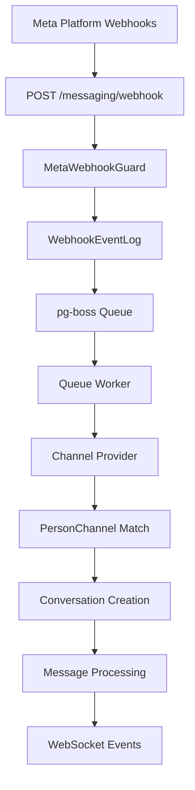

<Note>
**Last Updated:** 2026-04-15  
**Status:** Active
</Note>

## Overview

The Messaging module provides a unified, channel-agnostic messaging system for WhatsApp, Instagram, and Facebook Messenger. It replaces the separate per-channel modules with shared entities, a shared queue, and a single WebSocket namespace.

### Problem → Solution

| Problem | Solution |
| --- | --- |
| Duplicated logic across WhatsApp and Instagram modules | Single `MessagingModule` with channel providers |
| No webhook signature validation (security gap) | Shared `MetaWebhookGuard` validates `X-Hub-Signature-256` |
| Inconsistent WebSocket auth (Instagram gateway has no JWT) | Single `/messaging` gateway with JWT auth |
| No Facebook Messenger support | Third channel provider |
| Separate entity schemas per channel | Unified entities: `Conversation`, `Message`, `ChannelAccount` |
| No shared queue infrastructure | Shared `PgBossQueueService` for messaging + notifications |

### Key Design Decisions

<AccordionGroup>
<Accordion title="Queue System">
**pg-boss over BullMQ** — Project already uses pg-boss for notifications. No new Redis dependency. Interface-based design (`IQueueService`) allows swapping later.
</Accordion>

<Accordion title="Conversation Model">
**Direct PersonChannel FK on Conversation** — Conversations link directly to the CRM's `PersonChannel` via FK. Simpler model, no bidirectional sync overhead. The lead FK was moved from Conversation to Lead (`Lead.sourceConversation`) — conversations discover related leads via `personChannel → person → leads`.
</Accordion>

<Accordion title="Archive Pattern">
**Archive as boolean, not status** — `Conversation.isArchived` is orthogonal to `status` (OPEN/CLOSED), following `ARCHIVE_SYSTEM_SPECIFICATION.md`.
</Accordion>

<Accordion title="Assignment System">
**`ConversationAssignment` entity (not `entity_stakeholder`)** — Conversations use a dedicated `conversation_assignment` table instead of the CRM `entity_stakeholder` pattern. Each assignment is one row with nullable `user_id` and `team_id`: `user + null` = direct assignment, `user + team` = agent on behalf of team, `null + team` = team pool. Multiple assignment rows per conversation are supported.
</Accordion>

<Accordion title="Message Delivery">
**Transactional outbox** — Outbound messages use an outbox table written in the same DB transaction as the Message entity, guaranteeing at-least-once delivery.
</Accordion>

<Accordion title="AI Integration">
**Per-conversation AI mode with cascade** — Each conversation has an `aiMode` field (OFF, AUTO_REPLY, SUGGEST_ONLY, DRAFT). Default cascades: ChannelAccount.defaultAiMode → Organization default → OFF.
</Accordion>

<Accordion title="Template System">
**Three-tier template system** — `MessageTemplate` supports three types: `META_APPROVED` (platform-approved), `QUICK_REPLY` (agent shortcuts with variable resolution), and `AI_PROMPT` (AI system prompts with optional SystemPrompt link).
</Accordion>

<Accordion title="OAuth Security">
**OAuth state includes `level` for defense-in-depth** — The HMAC-signed OAuth state payload carries a `level` field (`personal` | `organization`). Both endpoints validate that the state's level matches the expected flow.
</Accordion>
</AccordionGroup>

## Architecture & Module Structure



### Module Structure

<CodeGroup>

```typescript src/modules/meta-platform/
meta-platform.module.ts
meta-graph-api.service.ts
meta-api.error.ts
meta-webhook.guard.ts
meta-oauth.service.ts
webhook-event-log.entity.ts
```

```typescript src/modules/queue/
// Top-level infra module
// Reused by Messaging + Notifications + future Ads
```

```typescript src/modules/messaging/
messaging.module.ts
entities/               // ChannelAccount, Conversation, Message, etc.
enums/                  // Channel, MessageType, MessageStatus, etc.
services/               // Core services + providers/
  providers/            // WhatsApp, Instagram, Messenger providers
controllers/            // Webhook, Conversation, Message, Template, etc.
gateways/               // WebSocket gateway (/messaging namespace)
queues/                 // webhook-processor, message-sender, etc.
dto/                    // Request/response DTOs
utils/                  // permission.util.ts
```

</CodeGroup>

## Multi-Tenancy Patterns

<Warning>
The messaging module introduces unique multi-tenancy challenges because webhooks arrive without org context.
</Warning>

### Two-Step RLS Bypass (Webhook Processing)

The webhook controller receives events for ALL organizations from a single Meta App. Org context is unknown at arrival time.

<Steps>
<Step title="Find Organization">
```typescript
// Step 1: Find which org owns this account (bypass RLS)
const account = await this.tenantContext.executeReadOnlyWithBypass(async (em) => {
  return em.findOne(ChannelAccount, { externalAccountId: job.data.accountId });
});
```
</Step>

<Step title="Process in Context">
```typescript
// Step 2: Process within that org's context
await this.tenantContext.executeInOrg(
  account.organization.id,
  async (em) => {
    await this.processMessageInTransaction(em, job.data);
  },
  { userId: undefined }, // system action, no user
);
```
</Step>
</Steps>

### Composable `*InTransaction` Pattern

Services that participate in existing transactions expose `*InTransaction` methods:

<CodeGroup>

```typescript Public API
// Public API — wraps TenantContext
async matchOrCreate(channel, identifier, profileData, orgId): Promise<MatchResult>;
```

```typescript Composable
// Composable — accepts EntityManager from caller's transaction
async matchOrCreateInTransaction(em, channel, identifier, profileData, orgId): Promise<MatchResult>;
```

</CodeGroup>

<Note>
The `em` parameter must always be the one provided by the TenantContext callback — never `this.em`.
</Note>

### Read-Only vs Mutation Methods

<Tabs>
<Tab title="Read-Only">
```typescript
// Read-only: findById, listConversations, getChannelCounts, etc.
return this.tenantContext.executeReadOnly(organizationId, async (em) => { 
  // queries, lookups, list endpoints
});
```
</Tab>

<Tab title="Mutation">
```typescript
// Mutation: updateConversation, archiveConversation, etc.
return this.tenantContext.executeInOrg(organizationId, async (em) => { 
  // create, update, delete operations
}, { userId });
```
</Tab>
</Tabs>

<Warning>
**Forbidden Patterns:**
- Using `*Impl` method names (use `*InTransaction` suffix)
- Nesting TenantContext calls (causes deadlocks)
- Mixing `this.em` with transaction `em` parameters
</Warning>

## Entities

### Core Entities

<AccordionGroup>
<Accordion title="ChannelAccount">
Represents a connected messaging channel (WhatsApp Business Account, Instagram Business Account, or Facebook Page for Messenger).

```typescript
@Entity('channel_account')
export class ChannelAccount extends BaseOrgEntity {
  @PrimaryGeneratedColumn('uuid')
  id: string;

  @Column({ type: 'enum', enum: Channel })
  channel: Channel;

  @Column()
  externalAccountId: string;

  @Column({ nullable: true })
  pageId?: string; // For Instagram outbound messaging

  @Column({ nullable: true })
  displayName?: string;

  @Column({ nullable: true })
  profilePictureUrl?: string;

  @Column({ type: 'enum', enum: AiMode, default: AiMode.OFF })
  defaultAiMode: AiMode;

  @Column({ type: 'enum', enum: ChannelAccountLevel })
  level: ChannelAccountLevel;

  @Column()
  accessToken: string;

  @OneToMany(() => Conversation, conversation => conversation.channelAccount)
  conversations: Collection<Conversation>;
}
```
</Accordion>

<Accordion title="Conversation">
Central entity representing a messaging thread between the organization and a person.

```typescript
@Entity('conversation')
export class Conversation extends BaseOrgEntity {
  @PrimaryGeneratedColumn('uuid')
  id: string;

  @ManyToOne(() => ChannelAccount)
  channelAccount: Ref<ChannelAccount>;

  @ManyToOne(() => PersonChannel)
  personChannel: Ref<PersonChannel>;

  @Column({ nullable: true })
  externalConversationId?: string;

  @Column({ type: 'enum', enum: ConversationStatus, default: ConversationStatus.OPEN })
  status: ConversationStatus;

  @Column({ default: false })
  isArchived: boolean;

  @Column({ type: 'enum', enum: AiMode, nullable: true })
  aiMode?: AiMode;

  @OneToMany(() => Message, message => message.conversation)
  messages: Collection<Message>;

  @OneToMany(() => ConversationAssignment, assignment => assignment.conversation)
  assignments: Collection<ConversationAssignment>;
}
```
</Accordion>

<Accordion title="Message">
Individual message within a conversation.

```typescript
@Entity('message')
export class Message extends BaseOrgEntity {
  @PrimaryGeneratedColumn('uuid')
  id: string;

  @ManyToOne(() => Conversation)
  conversation: Ref<Conversation>;

  @Column({ nullable: true })
  externalMessageId?: string;

  @Column({ type: 'enum', enum: MessageDirection })
  direction: MessageDirection;

  @Column({ type: 'enum', enum: MessageType })
  type: MessageType;

  @Column({ type: 'json' })
  content: MessageContent;

  @Column({ type: 'enum', enum: MessageStatus, nullable: true })
  status?: MessageStatus;

  @ManyToOne(() => User, { nullable: true })
  sentBy?: Ref<User>;
}
```
</Accordion>

<Accordion title="ConversationAssignment">
Tracks assignment of conversations to users and teams.

```typescript
@Entity('conversation_assignment')
export class ConversationAssignment extends BaseOrgEntity {
  @PrimaryGeneratedColumn('uuid')
  id: string;

  @ManyToOne(() => Conversation)
  conversation: Ref<Conversation>;

  @ManyToOne(() => User, { nullable: true })
  user?: Ref<User>;

  @ManyToOne(() => Team, { nullable: true })
  team?: Ref<Team>;

  @Column({ default: true })
  canReply: boolean;

  @Column({ type: 'enum', enum: AssignmentType })
  type: AssignmentType; // DIRECT, TEAM_POOL, TEAM_AGENT
}
```
</Accordion>
</AccordionGroup>

## Message Flows

### Inbound Message Flow

<Steps>
<Step title="Webhook Reception">
Meta platform sends webhook to `/messaging/webhook` endpoint
- Validates `X-Hub-Signature-256` with `MetaWebhookGuard`
- Returns 200 immediately
- Persists to `WebhookEventLog`
</Step>

<Step title="Queue Processing">
`webhook-processor` queue picks up the event
- Checks idempotency using `externalEventId`
- Finds organization via account lookup
- Processes within org context
</Step>

<Step title="Message Processing">
- Routes to appropriate channel provider (WhatsApp/Instagram/Messenger)
- Matches or creates `PersonChannel`
- Finds or creates `Conversation`
- Creates `Message` entity
- Updates channel statistics
</Step>

<Step title="Event Emission">
- Emits WebSocket events to relevant rooms
- Creates notification events for assigned agents
- Logs CRM activity via bridge
</Step>
</Steps>

### Outbound Message Flow

<Steps>
<Step title="Message Creation">
API creates `Message` and `MessageOutbox` in same transaction
</Step>

<Step title="Queue Processing">
`message-sender` queue processes outbox entry
- Calls Meta Graph API
- Updates message status based on response
- Hard deletes outbox entry on success
</Step>

<Step title="Status Updates">
Webhook events provide delivery/read status updates
- Updates existing message status
- Emits WebSocket events for real-time UI updates
</Step>
</Steps>

## Business Rules

### Conversation Management

<Check>
**Conversation Creation Rules:**
- One conversation per PersonChannel + ChannelAccount pair
- Conversations auto-reopen on new inbound messages
- Archive status is independent of open/closed status
</Check>

### Assignment Rules

<Info>
**Assignment Types:**
- `DIRECT`: User assigned directly (`user_id` set, `team_id` null)
- `TEAM_POOL`: Unassigned in team queue (`user_id` null, `team_id` set)  
- `TEAM_AGENT`: Agent assigned within team (`user_id` and `team_id` both set)
</Info>

### AI Mode Cascade

AI mode resolution follows this hierarchy:
1. Conversation-specific `aiMode` (if set)
2. ChannelAccount `defaultAiMode`
3. Organization default AI mode
4. System default: `OFF`

## RBAC Permissions & Access Control

### Permission Levels

<Tabs>
<Tab title="MESSAGING_MANAGE">
**Full Access:**
- View all conversations
- Reply to any conversation
- Transfer assignments
- Archive/unarchive
- Manage channel accounts
- Configure templates
</Tab>

<Tab title="MESSAGING_WRITE">
**Limited Access:**
- View assigned conversations
- Reply to assigned conversations
- Change conversation status (close/reopen)
- Adjust AI mode
</Tab>

<Tab title="Team Permissions">
**Team-Based Access:**
- `team_messaging.manage`: Assign within team
- `team_messaging.view`: View team conversations
- Team member: Reply to team-assigned conversations
</Tab>
</Tabs>

### ResourcePermissionsDto

Conversations return per-resource permissions following the CRM pattern:

```typescript
interface ResourcePermissionsDto {
  canView: boolean;
  canEdit: boolean;
  canReply: boolean;
  canAssign: boolean;
  canTransfer: boolean;
  canArchive: boolean;
}
```

<Note>
`ConversationPermissionService` computes permissions in-memory with no extra DB queries.
</Note>

## API Endpoints

### Conversation Management

<CodeGroup>

```http GET /conversations
GET /api/v1/conversations?status=OPEN&limit=50&offset=0

Response:
{
  "data": [
    {
      "id": "uuid",
      "channelAccount": {...},
      "personChannel": {...},
      "status": "OPEN",
      "isArchived": false,
      "permissions": {
        "canView": true,
        "canReply": true,
        "canAssign": false
      }
    }
  ],
  "pagination": {...}
}
```

```http POST /conversations/:id/messages
POST /api/v1/conversations/123/messages

{
  "type": "TEXT",
  "content": {
    "text": "Hello, how can I help you?"
  }
}
```

```http PUT /conversations/:id/assignment
PUT /api/v1/conversations/123/assignment

{
  "userId": "user-uuid",
  "teamId": "team-uuid",
  "canReply": true
}
```

</CodeGroup>

### Channel Account Management

<CodeGroup>

```http GET /channel-accounts
GET /api/v1/channel-accounts

Response:
{
  "data": [
    {
      "id": "uuid",
      "channel": "WHATSAPP",
      "displayName": "Business WhatsApp",
      "level": "ORGANIZATION",
      "defaultAiMode": "AUTO_REPLY"
    }
  ]
}
```

```http POST /channel-accounts/connect
POST /api/v1/channel-accounts/connect

{
  "channel": "INSTAGRAM",
  "level": "PERSONAL",
  "code": "oauth-code",
  "state": "signed-state-token"
}
```

</CodeGroup>

## WebSocket Events & Room Architecture

### Room Structure

<Tabs>
<Tab title="Organization Room">
```
org:{orgId}
```
All users in organization receive:
- New conversation notifications
- High-priority alerts
</Tab>

<Tab title="Conversation Room">
```
conversation:{conversationId}
```
Assigned agents and managers receive:
- New messages
- Status changes
- Assignment updates
</Tab>

<Tab title="User Room">
```
user:{userId}
```
Individual user receives:
- Personal notifications
- Assignment changes
- Direct mentions
</Tab>
</Tabs>

### Event Types

<AccordionGroup>
<Accordion title="message-received">
```typescript
{
  event: 'message-received',
  data: {
    conversationId: string,
    message: MessageDto,
    conversation: ConversationSummaryDto
  }
}
```
</Accordion>

<Accordion title="conversation-updated">
```typescript
{
  event: 'conversation-updated',
  data: {
    conversationId: string,
    changes: {
      status?: ConversationStatus,
      isArchived?: boolean,
      assignments?: ConversationAssignment[]
    }
  }
}
```
</Accordion>

<Accordion title="message-status-updated">
```typescript
{
  event: 'message-status-updated', 
  data: {
    messageId: string,
    status: MessageStatus,
    conversationId: string
  }
}
```
</Accordion>
</AccordionGroup>

## Error Handling & Retry Strategy

### Queue Retry Configuration

<CodeGroup>

```typescript Webhook Processing
{
  retryLimit: 5,
  retryDelay: 30, // seconds
  retryBackoff: true,
  expireInSeconds: 300 // 5 minutes
}
```

```typescript Message Sending
{
  retryLimit: 3,
  retryDelay: 60, // seconds  
  retryBackoff: true,
  expireInSeconds: 600 // 10 minutes
}
```

</CodeGroup>

### Error Categories

<Warning>
**Fatal Errors (No Retry):**
- Invalid webhook signature
- Malformed payload structure
- Authentication failures
- Rate limit exceeded (429)
</Warning>

<Info>
**Retryable Errors:**
- Network timeouts
- Temporary API failures (5xx)
- Database connection issues
- Queue processing errors
</Info>

## Testing Strategy

### Test Pyramid

<Steps>
<Step title="Unit Tests">
- Entity validation
- Service methods
- Permission calculations
- Message transformations
</Step>

<Step title="Integration Tests">
- Webhook processing flows
- Queue job processing
- Database transactions
- WebSocket event emission
</Step>

<Step title="E2E Tests">
- Complete message flows
- Multi-channel scenarios
- Permission enforcement
- Real-time updates
</Step>
</Steps>

### Test Data Setup

<CodeGroup>

```typescript Channel Account Factory
export const createChannelAccount = (overrides = {}) => ({
  channel: Channel.WHATSAPP,
  externalAccountId: 'test-account-123',
  displayName: 'Test Business',
  level: ChannelAccountLevel.ORGANIZATION,
  defaultAiMode: AiMode.OFF,
  accessToken: 'test-token',
  ...overrides
});
```

```typescript Conversation Factory
export const createConversation = (overrides = {}) => ({
  status: ConversationStatus.OPEN,
  isArchived: false,
  aiMode: null,
  channelAccount: createChannelAccount(),
  personChannel: createPersonChannel(),
  ...overrides
});
```

</CodeGroup>

## Module Dependencies & Integration Points

### External Dependencies

<CardGroup cols={2}>
<Card title="Meta Platform Module" icon="facebook">
Webhook validation, Graph API calls, OAuth flows
</Card>

<Card title="Queue Module" icon="clock">
pg-boss integration, job processing, retry logic
</Card>

<Card title="CRM Module" icon="users">
Person/PersonChannel entities, Lead creation
</Card>

<Card title="Notification Module" icon="bell">
Event emission, user notifications, team alerts
</Card>

<Card title="RBAC Module" icon="shield">
Permission validation, role checking, access control
</Card>

<Card title="AI Module" icon="robot">
Auto-reply generation, message suggestions, prompts
</Card>
</CardGroup>

### Integration Patterns

<Tabs>
<Tab title="CRM Bridge">
```typescript
// Create CRM activity for each message
await this.crmActivityService.createInTransaction(em, {
  type: 'MESSAGING_ACTIVITY',
  personId: personChannel.person.id,
  metadata: {
    messageId: message.id,
    channel: channelAccount.channel,
    direction: message.direction
  }
});
```
</Tab>

<Tab title="Notification Events">
```typescript
// Emit notification for new assignment
this.eventEmitter.emit('notification.create', {
  type: 'CONVERSATION_ASSIGNED',
  userId: assignment.user.id,
  metadata: {
    conversationId: conversation.id,
    channelName: channelAccount.displayName
  }
});
```
</Tab>
</Tabs>

## Future Phases

### Phase 2: Advanced Features

<AccordionGroup>
<Accordion title="Automation Rules">
- Auto-assignment based on keywords
- Escalation workflows
- SLA monitoring and alerts
- Custom trigger conditions
</Accordion>

<Accordion title="Analytics & Reporting">
- Response time metrics
- Agent performance tracking
- Channel-specific insights
- Conversation flow analysis
</Accordion>

<Accordion title="Multi-Agent Support">
- Internal agent collaboration
- Conversation handoffs
- Supervisor monitoring
- Training mode for new agents
</Accordion>
</AccordionGroup>

### Phase 3: Enterprise Features

<Check>
**Planned Enhancements:**
- Advanced AI capabilities
- Custom integrations
- Workflow automation
- Compliance features
</Check>

## Related Documentation

<CardGroup cols={2}>
<Card title="Multi-Tenancy Guide" href="/backend/multi-tenancy">
RLS patterns and tenant context
</Card>

<Card title="Archive System Spec" href="/backend/archive-system">
Archive patterns and conventions
</Card>

<Card title="RBAC Documentation" href="/backend/rbac">
Permission system and access control
</Card>

<Card title="Queue System Guide" href="/backend/queue">
pg-boss integration and job processing
</Card>
</CardGroup>