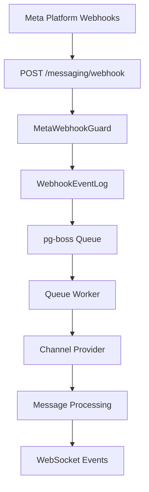

## Overview

The Messaging module provides a unified, channel-agnostic messaging system for WhatsApp, Instagram, and Facebook Messenger. It replaces the separate per-channel modules with shared entities, a shared queue, and a single WebSocket namespace.

<CardGroup cols={2}>
  <Card title="Problem Solved" icon="lightbulb">
    Eliminates duplicated logic across separate WhatsApp and Instagram modules
  </Card>
  <Card title="Security Enhanced" icon="shield">
    Adds webhook signature validation with `MetaWebhookGuard`
  </Card>
  <Card title="Unified Architecture" icon="sitemap">
    Single WebSocket gateway with JWT auth for all channels
  </Card>
  <Card title="Extended Support" icon="plus">
    Adds Facebook Messenger support as third channel provider
  </Card>
</CardGroup>

### Key Design Decisions

<AccordionGroup>
  <Accordion title="pg-boss over BullMQ">
    Project already uses pg-boss for notifications. No new Redis dependency. Interface-based design (`IQueueService`) allows swapping later.
  </Accordion>
  
  <Accordion title="Direct PersonChannel FK on Conversation">
    Conversations link directly to the CRM's `PersonChannel` via FK. Simpler model, no bidirectional sync overhead.
  </Accordion>
  
  <Accordion title="Archive as boolean, not status">
    `Conversation.isArchived` is orthogonal to `status` (OPEN/CLOSED), following `ARCHIVE_SYSTEM_SPECIFICATION.md`.
  </Accordion>
  
  <Accordion title="Simplified ownership">
    Conversations use direct `assignedAgentId`/`assignedTeamId` FKs instead of the CRM `entity_stakeholder` pattern. Rationale: conversations have single-owner semantics (one agent, one team at a time).
  </Accordion>
  
  <Accordion title="Transactional outbox">
    Outbound messages use an outbox table written in the same DB transaction as the Message entity, guaranteeing at-least-once delivery.
  </Accordion>
</AccordionGroup>

## Architecture & Module Structure



<Steps>
  <Step title="Webhook Reception">
    Meta platform webhooks arrive at `POST /messaging/webhook` with `@PublicEndpoint()` and `MetaWebhookGuard` validation
  </Step>
  
  <Step title="Signature Validation">
    `X-Hub-Signature-256` header is validated using `META_APP_SECRET`
  </Step>
  
  <Step title="Event Logging">
    Webhook payload is persisted to `WebhookEventLog` and queued for processing
  </Step>
  
  <Step title="Queue Processing">
    Worker processes events with idempotency checks and org context resolution
  </Step>
  
  <Step title="Message Handling">
    Channel providers route to appropriate handlers for WhatsApp, Instagram, or Messenger
  </Step>
</Steps>

### Module Structure

```
src/modules/meta-platform/    ← Top-level infra module
  meta-platform.module.ts
  meta-graph-api.service.ts
  meta-api.error.ts
  meta-webhook.guard.ts
  meta-oauth.service.ts
  webhook-event-log.entity.ts

src/modules/queue/            ← Top-level infra module

src/modules/messaging/
  messaging.module.ts
  entities/               ← Core entities
  enums/                  ← Channel, MessageType, etc.
  services/               ← Core services + providers/
    providers/            ← WhatsApp, Instagram, Messenger
  controllers/            ← API controllers
  gateways/               ← WebSocket gateway
  queues/                 ← Background job processors
  dto/                    ← Request/response DTOs
  utils/                  ← Utility functions
  migration/              ← Legacy data migration
```

## Multi-Tenancy Patterns

<Warning>
The messaging module introduces unique multi-tenancy challenges because webhooks arrive without org context.
</Warning>

### Two-Step RLS Bypass (Webhook Processing)

The webhook controller receives events for ALL organizations from a single Meta App. Org context is unknown at arrival time.

<CodeGroup>
```typescript Step 1: Find Organization
// Step 1: Find which org owns this account (bypass RLS)
const account = await this.tenantContext.executeReadOnlyWithBypass(async (em) => {
  return em.findOne(ChannelAccount, { externalAccountId: job.data.accountId });
});
```

```typescript Step 2: Process in Context
// Step 2: Process within that org's context
await this.tenantContext.executeInOrg(
  account.organization.id,
  async (em) => {
    await this.processMessageInTransaction(em, job.data);
  },
  { userId: undefined }, // system action, no user
);
```
</CodeGroup>

### Composable `*InTransaction` Pattern

Services that participate in existing transactions expose `*InTransaction` methods:

```typescript
// Public API — wraps TenantContext
async matchOrCreate(channel, identifier, profileData, orgId): Promise<MatchResult>;

// Composable — accepts EntityManager from caller's transaction
async matchOrCreateInTransaction(em, channel, identifier, profileData, orgId): Promise<MatchResult>;
```

<Note>
The `em` parameter must always be the one provided by the TenantContext callback — never `this.em`.
</Note>

### Forbidden Patterns

| Pattern | Why It's Forbidden |
|---------|-------------------|
| Using `*Impl` method names | Project convention uses `*InTransaction` suffix |
| Nesting TenantContext calls | Causes deadlocks or incorrect org context |
| Using `this.em` inside TenantContext callbacks | Bypasses the transaction-scoped EntityManager |
| Using `executeWithBypass()` when you have an org context | Silently disables RLS, exposing cross-tenant data |

## Entities

### Core Entities Summary

| Entity | Purpose |
|--------|---------|
| `ChannelAccount` | Connected channel account (WA number, IG page, FB page) at org or personal level |
| `Conversation` | Unified conversation thread linked to PersonChannel and CRM entities |
| `Message` | Individual message record with status tracking |
| `MessageTemplate` | Message templates (Meta-approved, quick-reply, AI prompt) |
| `MessageOutbox` | Transactional outbox for reliable message delivery |
| `AutomationRule` | Rules for automated responses and workflows |

### ChannelAccount Entity

<Tabs>
  <Tab title="Schema">
    ```sql
    CREATE TABLE channel_account (
      id UUID PRIMARY KEY DEFAULT gen_random_uuid(),
      organization_id UUID NOT NULL REFERENCES organization(id),
      channel channel_enum NOT NULL,
      external_account_id VARCHAR NOT NULL,
      display_name VARCHAR NOT NULL,
      avatar_url VARCHAR,
      access_token VARCHAR NOT NULL,
      page_id VARCHAR, -- For Instagram outbound messaging
      webhook_verified_at TIMESTAMPTZ,
      default_ai_mode ai_mode_enum DEFAULT 'OFF',
      is_personal BOOLEAN DEFAULT FALSE,
      personal_user_id UUID REFERENCES "user"(id),
      created_at TIMESTAMPTZ DEFAULT NOW(),
      updated_at TIMESTAMPTZ DEFAULT NOW()
    );
    ```
  </Tab>
  
  <Tab title="Business Rules">
    - Organization accounts: `is_personal = false`, `personal_user_id = null`
    - Personal accounts: `is_personal = true`, `personal_user_id` set
    - WhatsApp personal accounts reuse org WABA token
    - Instagram/Messenger personal accounts use own Page Access Token
    - `page_id` required for Instagram outbound messaging (Meta Send API requirement)
  </Tab>
</Tabs>

### Conversation Entity

<Tabs>
  <Tab title="Schema">
    ```sql
    CREATE TABLE conversation (
      id UUID PRIMARY KEY DEFAULT gen_random_uuid(),
      organization_id UUID NOT NULL REFERENCES organization(id),
      person_channel_id UUID NOT NULL REFERENCES person_channel(id),
      channel_account_id UUID NOT NULL REFERENCES channel_account(id),
      external_conversation_id VARCHAR NOT NULL,
      status conversation_status_enum DEFAULT 'OPEN',
      is_archived BOOLEAN DEFAULT FALSE,
      assigned_agent_id UUID REFERENCES "user"(id),
      assigned_team_id UUID REFERENCES team(id),
      ai_mode ai_mode_enum DEFAULT 'OFF',
      last_message_at TIMESTAMPTZ,
      created_at TIMESTAMPTZ DEFAULT NOW(),
      updated_at TIMESTAMPTZ DEFAULT NOW()
    );
    ```
  </Tab>
  
  <Tab title="Relationships">
    - **PersonChannel**: Direct FK to CRM's `person_channel` entity
    - **ChannelAccount**: Which account/number the conversation is on
    - **Assignment**: Direct FKs for agent and team (simplified ownership model)
    - **AI Mode**: Per-conversation setting with cascade defaults
  </Tab>
</Tabs>

### Message Entity

<Tabs>
  <Tab title="Schema">
    ```sql
    CREATE TABLE message (
      id UUID PRIMARY KEY DEFAULT gen_random_uuid(),
      organization_id UUID NOT NULL REFERENCES organization(id),
      conversation_id UUID NOT NULL REFERENCES conversation(id),
      external_message_id VARCHAR,
      direction message_direction_enum NOT NULL,
      type message_type_enum NOT NULL,
      content JSONB NOT NULL,
      status message_status_enum DEFAULT 'PENDING',
      sender_user_id UUID REFERENCES "user"(id),
      error_details JSONB,
      sent_at TIMESTAMPTZ,
      delivered_at TIMESTAMPTZ,
      read_at TIMESTAMPTZ,
      created_at TIMESTAMPTZ DEFAULT NOW()
    );
    ```
  </Tab>
  
  <Tab title="Message Types">
    - `TEXT`: Plain text messages
    - `IMAGE`: Image attachments
    - `VIDEO`: Video attachments  
    - `AUDIO`: Voice messages
    - `DOCUMENT`: File attachments
    - `TEMPLATE`: Template messages (WhatsApp)
    - `INTERACTIVE`: Buttons, quick replies
    - `SYSTEM`: System notifications
  </Tab>
</Tabs>

## Message Flows

### Inbound Message Flow

<Steps>
  <Step title="Webhook Reception">
    Meta sends webhook to `POST /messaging/webhook`
  </Step>
  
  <Step title="Validation & Queuing">
    - Validate `X-Hub-Signature-256` header
    - Return 200 OK immediately
    - Persist to `WebhookEventLog`
    - Enqueue for processing
  </Step>
  
  <Step title="Queue Processing">
    - Check idempotency (`externalEventId`)
    - Find organization via `executeReadOnlyWithBypass()`
    - Execute in org context with `executeInOrg()`
  </Step>
  
  <Step title="Message Processing">
    - Route to appropriate channel provider
    - Match/create `PersonChannel` and `Person`
    - Find/create `Conversation`
    - Create `Message` record
    - Update conversation metadata
  </Step>
  
  <Step title="Event Broadcasting">
    - Emit WebSocket events to relevant rooms
    - Create notification events
    - Bridge to CRM activity creation
  </Step>
</Steps>

### Outbound Message Flow

<Steps>
  <Step title="API Request">
    Agent sends message via `POST /conversations/{id}/messages`
  </Step>
  
  <Step title="Transactional Write">
    - Create `Message` record with `status: PENDING`
    - Create `MessageOutbox` record in same transaction
    - Ensures at-least-once delivery guarantee
  </Step>
  
  <Step title="Queue Processing">
    - `message-sender` worker picks up outbox record
    - Route to appropriate channel provider
    - Make API call to Meta platform
  </Step>
  
  <Step title="Status Updates">
    - Update message status based on API response
    - Delete outbox record on successful send
    - Retry on failure with exponential backoff
  </Step>
</Steps>

## Business Rules

### Conversation Management

<Tabs>
  <Tab title="Assignment Rules">
    - Only users with `MESSAGING_MANAGE` can assign/transfer conversations
    - Personal account conversations auto-assign to account owner
    - Organization conversations support team and individual assignment
    - Assignment history tracked via WebSocket events
  </Tab>
  
  <Tab title="Archive Rules">
    - `isArchived` is orthogonal to `status` (OPEN/CLOSED)
    - Archived conversations don't appear in inbox by default
    - New messages on archived conversations auto-unarchive
    - Only `MESSAGING_MANAGE` users can archive/unarchive
  </Tab>
  
  <Tab title="AI Mode Cascade">
    1. Conversation-specific `aiMode`
    2. ChannelAccount `defaultAiMode`  
    3. Organization default
    4. System default: `OFF`
  </Tab>
</Tabs>

### Access Control

<Info>
Conversations use the `ResourcePermissionsDto` pattern from the CRM module for consistent permission handling.
</Info>

| Permission Level | Access Rights |
|-----------------|---------------|
| `MESSAGING_MANAGE` | Full access: view, send, assign, transfer, archive |
| `MESSAGING_SEND` | View assigned conversations, send messages, change status/AI mode |
| Personal Account Owner | Full access to own account conversations |
| Organization Member | View access based on assignment |

## RBAC Permissions & Access Control

### Core Permissions

```typescript
enum MessagingPermission {
  MESSAGING_SEND = 'messaging:send',
  MESSAGING_MANAGE = 'messaging:manage',
  MESSAGING_TEMPLATE_MANAGE = 'messaging:template:manage',
  MESSAGING_AUTOMATION_MANAGE = 'messaging:automation:manage',
}
```

### Permission Matrix

| Action | Required Permission | Additional Rules |
|--------|-------------------|------------------|
| Send message | `MESSAGING_SEND` | Must be assigned to conversation |
| Assign conversation | `MESSAGING_MANAGE` | - |
| Transfer conversation | `MESSAGING_MANAGE` | - |
| Archive/unarchive | `MESSAGING_MANAGE` | - |
| Create template | `MESSAGING_TEMPLATE_MANAGE` | - |
| Manage automation | `MESSAGING_AUTOMATION_MANAGE` | - |
| View conversation | `MESSAGING_SEND` | Assignment or personal ownership |

### Personal Account Access

<Note>
Personal accounts have special access control rules implemented in `permission.util.ts`.
</Note>

```typescript
function canAccessPersonalConversation(
  user: User, 
  conversation: Conversation
): boolean {
  return conversation.channelAccount.isPersonal && 
         conversation.channelAccount.personalUserId === user.id;
}
```

## API Endpoints

### Conversation Endpoints

<AccordionGroup>
  <Accordion title="GET /conversations">
    **Purpose**: List conversations with filtering and pagination
    
    **Query Parameters**:
    - `status?: ConversationStatus[]`
    - `assignedTo?: 'me' | 'unassigned' | UUID`
    - `channel?: Channel[]`
    - `isArchived?: boolean`
    - `search?: string`
    
    **Response**: Paginated list with `ResourcePermissionsDto`
  </Accordion>
  
  <Accordion title="GET /conversations/{id}">
    **Purpose**: Get conversation details with messages
    
    **Guards**: `ConversationAccessGuard`
    
    **Response**: Conversation with recent messages and permissions
  </Accordion>
  
  <Accordion title="POST /conversations/{id}/messages">
    **Purpose**: Send outbound message
    
    **Guards**: `RequirePermissions(MESSAGING_SEND)`, `ConversationAccessGuard`
    
    **Body**: Message content with type and optional template
  </Accordion>
  
  <Accordion title="PATCH /conversations/{id}/assign">
    **Purpose**: Assign conversation to agent or team
    
    **Guards**: `RequirePermissions(MESSAGING_MANAGE)`
    
    **Body**: `{ agentId?: UUID, teamId?: UUID }`
  </Accordion>
</AccordionGroup>

### Channel Account Endpoints

<AccordionGroup>
  <Accordion title="GET /channel-accounts">
    **Purpose**: List connected accounts
    
    **Query Parameters**:
    - `channel?: Channel[]`
    - `isPersonal?: boolean`
    
    **Response**: Array of channel accounts with connection status
  </Accordion>
  
  <Accordion title="POST /channel-accounts/{channel}/connect">
    **Purpose**: Initiate OAuth connection flow
    
    **Guards**: `RequirePermissions(MESSAGING_MANAGE)`
    
    **Response**: OAuth URL and state token
  </Accordion>
  
  <Accordion title="POST /channel-accounts/connect-with-code">
    **Purpose**: Complete OAuth flow with authorization code
    
    **Body**: `{ code: string, state: string }`
    
    **Response**: Created channel account
  </Accordion>
</AccordionGroup>

## WebSocket Events & Room Architecture

### Room Structure

<Tabs>
  <Tab title="Room Types">
    ```typescript
    // Organization-wide inbox
    `org:${orgId}:messaging:inbox`
    
    // Specific conversation
    `org:${orgId}:conversation:${conversationId}`
    
    // Agent's assigned conversations
    `org:${orgId}:agent:${userId}:conversations`
    
    // Team's assigned conversations  
    `org:${orgId}:team:${teamId}:conversations`
    ```
  </Tab>
  
  <Tab title="Auto-Join Logic">
    ```typescript
    // Users auto-join based on permissions
    if (hasPermission('MESSAGING_MANAGE')) {
      // Join inbox for all conversations
      socket.join(`org:${orgId}:messaging:inbox`);
    }
    
    if (hasPermission('MESSAGING_SEND')) {
      // Join agent-specific room
      socket.join(`org:${orgId}:agent:${userId}:conversations`);
    }
    ```
  </Tab>
</Tabs>

### Event Types

| Event | Rooms | Purpose |
|-------|-------|---------|
| `message-received` | Conversation, Inbox, Agent/Team | New inbound message |
| `message-sent` | Conversation, Inbox, Agent/Team | Outbound message created |
| `message-status-updated` | Conversation | Delivery/read status change |
| `conversation-created` | Inbox, Agent/Team | New conversation started |
| `conversation-updated` | Conversation, Inbox, Agent/Team | Status, assignment, archive changes |
| `typing-indicator` | Conversation | Real-time typing status |

### Client Event Handlers

<CodeGroup>
```typescript Join Conversation
@SubscribeMessage('join-conversation')
async handleJoinConversation(
  client: AuthenticatedSocket, 
  data: { conversationId: string }
) {
  return this.tenantContext.executeInOrg(client.organizationId, async (em) => {
    // Verify access and join room
    const conversation = await this.conversationService.findOneInTransaction(
      em, 
      data.conversationId
    );
    
    if (await this.permissionService.canView(client.user, conversation)) {
      client.join(`org:${client.organizationId}:conversation:${data.conversationId}`);
      return { success: true };
    }
    
    throw new WsException('Access denied');
  });
}
```

```typescript Send Message
@SubscribeMessage('send-message')
async handleSendMessage(
  client: AuthenticatedSocket,
  data: SendMessageDto
) {
  return this.tenantContext.executeInOrg(client.organizationId, async (em) => {
    // Validate permissions and send
    return this.messageService.sendMessageInTransaction(
      em,
      data.conversationId,
      data.content,
      client.user
    );
  });
}
```
</CodeGroup>

## Query Patterns

### Conversation Queries

<Tabs>
  <Tab title="Inbox Query">
    ```sql
    -- Optimized inbox query with proper indexes
    SELECT c.*, ca.display_name as account_name, 
           pc.person_id, p.full_name as contact_name
    FROM conversation c
    JOIN channel_account ca ON c.channel_account_id = ca.id
    JOIN person_channel pc ON c.person_channel_id = pc.id  
    JOIN person p ON pc.person_id = p.id
    WHERE c.organization_id = $1
      AND c.is_archived = FALSE
      AND (c.assigned_agent_id = $2 OR $3) -- user ID or has MANAGE permission
    ORDER BY c.last_message_at DESC NULLS LAST
    LIMIT $4 OFFSET $5;
    ```
  </Tab>
  
  <Tab title="Message History">
    ```sql
    -- Message history with proper pagination
    SELECT m.*, u.full_name as sender_name
    FROM message m
    LEFT JOIN "user" u ON m.sender_user_id = u.id
    WHERE m.conversation_id = $1
      AND m.organization_id = $2
    ORDER BY m.created_at DESC
    LIMIT $3 OFFSET $4;
    ```
  </Tab>
  
  <Tab title="Unread Counts">
    ```sql
    -- Efficient unread count per conversation
    SELECT c.id, COUNT(m.id) as unread_count
    FROM conversation c
    LEFT JOIN message m ON c.id = m.conversation_id 
      AND m.direction = 'INBOUND'
      AND m.created_at > COALESCE(c.last_read_at, '1970-01-01')
    WHERE c.assigned_agent_id = $1
      AND c.is_archived = FALSE
    GROUP BY c.id;
    ```
  </Tab>
</Tabs>

### Performance Indexes

```sql
-- Critical indexes for messaging performance
CREATE INDEX idx_conversation_org_assigned_active 
ON conversation(organization_id, assigned_agent_id) 
WHERE is_archived = FALSE;

CREATE INDEX idx_conversation_last_message_at 
ON conversation(organization_id, last_message_at DESC NULLS LAST);

CREATE INDEX idx_message_conversation_created 
ON message(conversation_id, created_at DESC);

CREATE INDEX idx_message_external_id 
ON message(external_message_id) 
WHERE external_message_id IS NOT NULL;
```

## Error Handling & Retry Strategy

### Webhook Processing Errors

<Tabs>
  <Tab title="Idempotency">
    ```typescript
    // Prevent duplicate processing
    const existingEvent = await em.findOne(WebhookEventLog, {
      externalEventId: webhookData.entry[0].id,
    });
    
    if (existingEvent?.processedAt) {
      this.logger.log(`Event already processed: ${existingEvent.id}`);
      return; // Skip processing
    }
    ```
  </Tab>
  
  <Tab title="Retry Logic">
    ```typescript
    // Exponential backoff for failed webhooks
    const retryOptions = {
      retryLimit: 5,
      retryDelay: 30, // seconds
      retryBackoff: true, // exponential backoff
    };
    
    await this.queueService.add(
      'webhook-processor',
      webhookData,
      retryOptions
    );
    ```
  </Tab>
</Tabs>

### Message Send Errors

| Error Type | Handling Strategy |
|------------|-------------------|
| Rate limiting | Exponential backoff with jitter |
| Invalid recipient | Mark as failed, notify user |
| Template rejection | Log error, suggest alternatives |
| Network timeout | Retry up to 3 times |
| Auth failure | Refresh tokens, retry once |

### Error Categories

<Warning>
Different error types require different handling strategies based on whether they're retryable.
</Warning>

```typescript
enum ErrorCategory {
  RETRYABLE = 'retryable',     // Network issues, rate limits
  PERMANENT = 'permanent',     // Invalid recipient, blocked
  AUTH_FAILURE = 'auth_failure', // Token expired/invalid
  RATE_LIMITED = 'rate_limited', // Platform rate limiting
}
```

## Testing Strategy

### Unit Tests

<Steps>
  <Step title="Service Layer">
    Test business logic in isolation with mocked dependencies
  </Step>
  
  <Step title="Provider Layer">
    Test channel-specific logic with mocked Meta APIs
  </Step>
  
  <Step title="Permission Logic">
    Test access control rules with various user/conversation combinations
  </Step>
  
  <Step title="Queue Workers">
    Test message processing with mock webhook payloads
  </Step>
</Steps>

### Integration Tests

<Steps>
  <Step title="Webhook End-to-End">
    Send test webhooks through full processing pipeline
  </Step>
  
  <Step title="WebSocket Events">
    Verify real-time event broadcasting across rooms
  </Step>
  
  <Step title="Multi-Tenant Isolation">
    Ensure RLS correctly isolates org data
  </Step>
  
  <Step title="OAuth Flows">
    Test account connection for all three channels
  </Step>
</Steps>

### Test Data Patterns

<CodeGroup>
```typescript Webhook Test Data
const mockWhatsAppWebhook = {
  object: 'whatsapp_business_account',
  entry: [{
    id: 'test-waba-id',
    changes: [{
      field: 'messages',
      value: {
        messaging_product: 'whatsapp',
        contacts: [{ profile: { name: 'John Doe' }, wa_id: '1234567890' }],
        messages: [{
          id: 'msg-123',
          from: '1234567890',
          type: 'text',
          text: { body: 'Hello World' },
          timestamp: '1234567890'
        }]
      }
    }]
  }]
};
```

```typescript Conversation Factory
export const conversationFactory = {
  create: (overrides: Partial<Conversation> = {}) => ({
    id: uuid(),
    status: ConversationStatus.OPEN,
    isArchived: false,
    aiMode: AiMode.OFF,
    lastMessageAt: new Date(),
    ...overrides,
  }),
};
```
</CodeGroup>

## Module Dependencies & Integration Points

### Core Dependencies

<CardGroup cols={2}>
  <Card title="CRM Module" icon="users">
    Person, PersonChannel, Lead creation and management
  </Card>
  <Card title="User Management" icon="user">
    Authentication, permissions, team assignments
  </Card>
  <Card title="Meta Platform" icon="meta">
    Shared webhook validation and Graph API client
  </Card>
  <Card title="Queue Service" icon="clock">
    Shared pg-boss infrastructure for background jobs
  </Card>
</CardGroup>

### Integration Patterns

<Tabs>
  <Tab title="CRM Bridge">
    ```typescript
    // Bridge service for CRM integration
    @Injectable()
    export class MessageCrmBridgeService {
      async createActivityFromMessage(
        em: EntityManager,
        message: Message,
        conversation: Conversation
      ): Promise<void> {
        await this.activityService.createInTransaction(em, {
          type: ActivityType.MESSAGE,
          direction: message.direction,
          personId: conversation.personChannel.personId,
          leadId: conversation.personChannel.leadId, // if exists
          metadata: {
            messageId: message.id,
            channel: conversation.channelAccount.channel,
            content: message.content,
          },
        });
      }
    }
    ```
  </Tab>
  
  <Tab title="Notification Bridge">
    ```typescript
    // Emit notification events for message alerts
    await this.notificationEventService.emit({
      type: NotificationType.MESSAGE_RECEIVED,
      organizationId: conversation.organizationId,
      recipientId: conversation.assignedAgentId,
      payload: {
        conversationId: conversation.id,
        senderId: message.senderId,
        preview: truncateText(message.content.text, 100),
      },
    });
    ```
  </Tab>
</Tabs>

## Legacy Module Removal

<Note>
The messaging module replaces the separate `whatsapp` and `instagram` modules while adding Facebook Messenger support.
</Note>

### Migration Strategy

<Steps>
  <Step title="Data Migration">
    Run migration service to convert existing WhatsApp/Instagram data to unified schema
  </Step>
  
  <Step title="API Compatibility">
    Maintain legacy endpoints during transition period with deprecation warnings
  </Step>
  
  <Step title="WebSocket Migration">
    Update clients to use new `/messaging` namespace instead of channel-specific gateways
  </Step>
  
  <Step title="Cleanup">
    Remove legacy modules after successful migration and client updates
  </Step>
</Steps>

### Migration Checklist

<Check>Data migration completed without data loss</Check>
<Check>All clients updated to new WebSocket namespace</Check>
<Check>Legacy endpoints deprecated and usage monitored</Check>
<Check>Performance metrics stable or improved</Check>
<Check>No increase in error rates</Check>

## Future Phases

### Phase 2: Advanced Features

- **Smart Routing**: AI-powered conversation routing based on content analysis
- **Sentiment Analysis**: Real-time mood detection for priority handling  
- **Conversation Summary**: AI-generated conversation summaries for handoffs
- **Advanced Templates**: Dynamic templates with conditional logic

### Phase 3: Platform Expansion

- **Telegram Integration**: Add fourth channel provider for Telegram Business API
- **Email Integration**: Unified inbox including email conversations
- **Voice/Video**: Support for WhatsApp voice calls and video messages
- **Rich Media**: Enhanced support for carousels, forms, and interactive elements

### Phase 4: Enterprise Features

- **Multi-Agent Handoff**: Complex routing with skill-based assignment
- **Conversation Analytics**: Detailed performance metrics and insights
- **Compliance Tools**: Message archiving, audit trails, retention policies
- **Advanced Automation**: Workflow builder with visual editor

## Related Documentation

<CardGroup cols={2}>
  <Card title="Multi-Tenancy Guide" href="/docs/MULTI_TENANCY.md" icon="shield">
    Complete RLS patterns and tenant isolation
  </Card>
  <Card title="Archive System" href="/docs/ARCHIVE_SYSTEM_SPECIFICATION.md" icon="archive">
    Organization-wide archive functionality
  </Card>
  <Card title="Queue Service" href="/backend/queue/specification" icon="clock">
    Shared pg-boss queue infrastructure
  </Card>
  <Card title="Meta Platform" href="/backend/meta-platform/specification" icon="meta">
    Shared Meta integration utilities
  </Card>
</CardGroup>