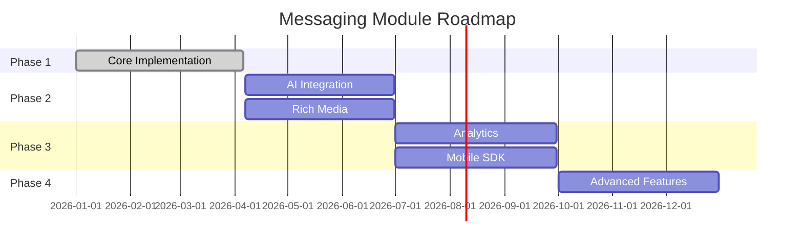

## Overview

The Messaging module provides a unified, channel-agnostic messaging system for WhatsApp, Instagram, and Facebook Messenger. It replaces the separate per-channel modules with shared entities, a shared queue, and a single WebSocket namespace.

### Problem → Solution

<CardGroup cols={2}>
  <Card title="Duplicated Logic" icon="copy">
    **Problem:** Duplicated logic across WhatsApp and Instagram modules
    **Solution:** Single `MessagingModule` with channel providers
  </Card>
  <Card title="Security Gap" icon="shield-check">
    **Problem:** No webhook signature validation 
    **Solution:** Shared `MetaWebhookGuard` validates `X-Hub-Signature-256`
  </Card>
  <Card title="Inconsistent Auth" icon="key">
    **Problem:** Inconsistent WebSocket auth (Instagram gateway has no JWT)
    **Solution:** Single `/messaging` gateway with JWT auth
  </Card>
  <Card title="Missing Platform" icon="facebook">
    **Problem:** No Facebook Messenger support
    **Solution:** Third channel provider
  </Card>
</CardGroup>

### Key Design Decisions

<AccordionGroup>
  <Accordion title="pg-boss over BullMQ">
    Project already uses pg-boss for notifications. No new Redis dependency. Interface-based design (`IQueueService`) allows swapping later.
  </Accordion>

  <Accordion title="Direct PersonChannel FK on Conversation">
    Conversations link directly to the CRM's `PersonChannel` via FK. Simpler model, no bidirectional sync overhead.
  </Accordion>

  <Accordion title="Archive as boolean, not status">
    `Conversation.isArchived` is orthogonal to `status` (OPEN/CLOSED), following `ARCHIVE_SYSTEM_SPECIFICATION.md`.
  </Accordion>

  <Accordion title="Simplified ownership">
    Conversations use direct `assignedAgentId`/`assignedTeamId` FKs instead of the CRM `entity_stakeholder` pattern. Rationale: conversations have single-owner semantics.
  </Accordion>

  <Accordion title="Transactional outbox">
    Outbound messages use an outbox table written in the same DB transaction as the Message entity, guaranteeing at-least-once delivery.
  </Accordion>

  <Accordion title="Per-conversation AI mode with cascade">
    Each conversation has an `aiMode` field (OFF, AUTO_REPLY, SUGGEST_ONLY, DRAFT). Default cascades: ChannelAccount.defaultAiMode → Organization default → OFF.
  </Accordion>
</AccordionGroup>

## Architecture & Module Structure

<Note>
The messaging module introduces unique multi-tenancy challenges because webhooks arrive without org context.
</Note>

```mermaid
graph TD
    A[Meta Platform Webhooks] --> B[POST /messaging/webhook]
    B --> C[@PublicEndpoint + MetaWebhookGuard]
    C --> D[Validates X-Hub-Signature-256]
    D --> E[Returns 200 immediately]
    E --> F[Persists to WebhookEventLog]
    F --> G[Enqueues to pg-boss queue]
    G --> H[Queue Worker webhook-processor]
    H --> I[Check idempotency]
    I --> J[Find organization]
    J --> K[Process in org context]
```

### Module Structure

```
src/modules/meta-platform/    ← Top-level infra module
  meta-platform.module.ts
  meta-graph-api.service.ts
  meta-api.error.ts
  meta-webhook.guard.ts
  meta-oauth.service.ts
  webhook-event-log.entity.ts

src/modules/queue/            ← Top-level infra module

src/modules/messaging/
  messaging.module.ts
  entities/               ← Core entities
  enums/                  ← Channel, MessageType, MessageStatus, etc.
  services/               ← Core services + providers/
    providers/            ← WhatsApp, Instagram, Messenger providers
  controllers/            ← API controllers
  gateways/               ← WebSocket gateway (/messaging namespace)
  queues/                 ← webhook-processor, message-sender, media-downloader
  dto/                    ← Request/response DTOs
  utils/                  ← permission.util.ts
  migration/              ← Legacy data migration service
```

## Multi-Tenancy Patterns

### Two-Step RLS Bypass (Webhook Processing)

The webhook controller receives events for ALL organizations from a single Meta App. Org context is unknown at arrival time.

<Steps>
  <Step title="Find organization">
    ```typescript
    // Step 1: Find which org owns this account (bypass RLS)
    const account = await this.tenantContext.executeReadOnlyWithBypass(async (em) => {
      return em.findOne(ChannelAccount, { externalAccountId: job.data.accountId });
    });
    ```
  </Step>

  <Step title="Process in org context">
    ```typescript
    // Step 2: Process within that org's context
    await this.tenantContext.executeInOrg(
      account.organization.id,
      async (em) => {
        await this.processMessageInTransaction(em, job.data);
      },
      { userId: undefined },
    ); // system action, no user
    ```
  </Step>
</Steps>

### Composable `*InTransaction` Pattern

Services that participate in existing transactions expose `*InTransaction` methods:

<CodeGroup>
```typescript Public API
// Public API — wraps TenantContext
async matchOrCreate(channel, identifier, profileData, orgId): Promise<MatchResult>;
```

```typescript Composable
// Composable — accepts EntityManager from caller's transaction
async matchOrCreateInTransaction(em, channel, identifier, profileData, orgId): Promise<MatchResult>;
```
</CodeGroup>

<Warning>
The `em` parameter must always be the one provided by the TenantContext callback — never `this.em`.
</Warning>

### Forbidden Patterns

| Pattern | Why It's Forbidden |
|---------|-------------------|
| Using `*Impl` method names | Project convention uses `*InTransaction` suffix |
| Nesting TenantContext calls | Causes deadlocks or incorrect org context |
| Using `this.em` inside TenantContext callbacks | Bypasses the transaction-scoped EntityManager |
| Using `executeWithBypass()` when you have an org context | Silently disables RLS, exposing cross-tenant data |

### WebSocket Gateway Pattern

Every `@SubscribeMessage` handler must establish org context per message:

```typescript
@SubscribeMessage('join-conversation')
async handleJoinConversation(client: AuthenticatedSocket, data: { conversationId: string }) {
  return this.tenantContext.executeInOrg(client.organizationId, async (em) => {
    // Verify access, join room
  });
}
```

## Entities

### Summary

<CardGroup cols={2}>
  <Card title="ChannelAccount" icon="users">
    Connected channel account (WA number, IG page, FB page) at org or personal level
  </Card>
  <Card title="Conversation" icon="comments">
    Unified conversation thread linked to PersonChannel and CRM entities
  </Card>
  <Card title="Message" icon="message">
    Individual message record with status tracking
  </Card>
  <Card title="MessageTemplate" icon="template">
    Message templates (Meta-approved, quick-reply, AI prompt)
  </Card>
</CardGroup>

### ChannelAccount Entity

```typescript
@Entity()
export class ChannelAccount extends BaseEntity {
  @Column({ type: 'enum', enum: Channel })
  channel: Channel;

  @Column()
  externalAccountId: string; // WA phone number ID, IG business account ID, FB page ID

  @Column({ nullable: true })
  pageId: string; // Facebook Page ID for Instagram Send API

  @Column({ type: 'enum', enum: AccountLevel })
  level: AccountLevel; // ORGANIZATION or PERSONAL

  @ManyToOne(() => Organization)
  organization: Organization;

  @ManyToOne(() => User, { nullable: true })
  connectedBy: User; // Personal account owner

  @Column({ type: 'enum', enum: AiMode, default: AiMode.OFF })
  defaultAiMode: AiMode;

  @Column({ type: 'json', nullable: true })
  profile: Record<string, any>; // Display name, avatar, etc.

  @Column({ type: 'json', nullable: true })
  capabilities: Record<string, any>; // Platform-specific features

  @Column({ default: true })
  isActive: boolean;

  @CreateDateColumn()
  connectedAt: Date;

  @UpdateDateColumn()
  lastSyncAt: Date;
}
```

### Conversation Entity

```typescript
@Entity()
export class Conversation extends BaseEntity {
  @ManyToOne(() => ChannelAccount)
  channelAccount: ChannelAccount;

  @ManyToOne(() => PersonChannel)
  personChannel: PersonChannel;

  @Column({ nullable: true })
  externalConversationId: string; // Platform thread ID

  @Column({ type: 'enum', enum: ConversationStatus, default: ConversationStatus.OPEN })
  status: ConversationStatus;

  @Column({ type: 'enum', enum: AiMode, default: AiMode.OFF })
  aiMode: AiMode;

  @Column({ default: false })
  isArchived: boolean;

  @ManyToOne(() => User, { nullable: true })
  assignedAgent: User;

  @ManyToOne(() => Team, { nullable: true })
  assignedTeam: Team;

  @OneToMany(() => Message, message => message.conversation)
  messages: Message[];

  @Column({ type: 'timestamptz', nullable: true })
  lastMessageAt: Date;

  @Column({ nullable: true })
  lastMessagePreview: string;

  @Column({ default: 0 })
  unreadCount: number;

  @CreateDateColumn()
  createdAt: Date;

  @UpdateDateColumn()
  updatedAt: Date;
}
```

### Message Entity

```typescript
@Entity()
export class Message extends BaseEntity {
  @ManyToOne(() => Conversation)
  conversation: Conversation;

  @Column({ nullable: true })
  externalMessageId: string; // Platform message ID

  @Column({ type: 'enum', enum: MessageDirection })
  direction: MessageDirection; // INBOUND or OUTBOUND

  @Column({ type: 'enum', enum: MessageType })
  type: MessageType; // TEXT, IMAGE, AUDIO, etc.

  @Column({ type: 'text', nullable: true })
  content: string; // Text content

  @Column({ type: 'json', nullable: true })
  metadata: Record<string, any>; // Media URLs, attachments, etc.

  @Column({ type: 'enum', enum: MessageStatus, default: MessageStatus.PENDING })
  status: MessageStatus;

  @ManyToOne(() => User, { nullable: true })
  sentBy: User; // Agent who sent (for outbound)

  @ManyToOne(() => MessageTemplate, { nullable: true })
  template: MessageTemplate; // If sent from template

  @Column({ type: 'timestamptz' })
  timestamp: Date; // Platform timestamp

  @Column({ type: 'text', nullable: true })
  failureReason: string;

  @CreateDateColumn()
  createdAt: Date;
}
```

### MessageTemplate Entity

```typescript
@Entity()
export class MessageTemplate extends BaseEntity {
  @Column()
  name: string;

  @Column({ type: 'enum', enum: TemplateType })
  type: TemplateType; // META_APPROVED, QUICK_REPLY, AI_PROMPT

  @Column({ type: 'enum', enum: Channel })
  channel: Channel;

  @Column({ type: 'text' })
  content: string; // Template content with variables

  @Column({ type: 'json', nullable: true })
  variables: string[]; // Available variables

  @Column({ type: 'json', nullable: true })
  metadata: Record<string, any>; // Platform-specific data

  @ManyToOne(() => Organization)
  organization: Organization;

  @ManyToOne(() => User)
  createdBy: User;

  @Column({ default: true })
  isActive: boolean;

  @CreateDateColumn()
  createdAt: Date;

  @UpdateDateColumn()
  updatedAt: Date;
}
```

## Enums

### Core Enums

<Tabs>
<Tab title="Channel">
```typescript
export enum Channel {
  WHATSAPP = 'whatsapp',
  INSTAGRAM = 'instagram',
  MESSENGER = 'messenger',
}
```
</Tab>

<Tab title="MessageDirection">
```typescript
export enum MessageDirection {
  INBOUND = 'inbound',
  OUTBOUND = 'outbound',
}
```
</Tab>

<Tab title="MessageStatus">
```typescript
export enum MessageStatus {
  PENDING = 'pending',
  SENT = 'sent',
  DELIVERED = 'delivered',
  READ = 'read',
  FAILED = 'failed',
}
```
</Tab>

<Tab title="ConversationStatus">
```typescript
export enum ConversationStatus {
  OPEN = 'open',
  CLOSED = 'closed',
}
```
</Tab>

<Tab title="AiMode">
```typescript
export enum AiMode {
  OFF = 'off',
  AUTO_REPLY = 'auto_reply',
  SUGGEST_ONLY = 'suggest_only',
  DRAFT = 'draft',
}
```
</Tab>
</Tabs>

### Message Types

```typescript
export enum MessageType {
  TEXT = 'text',
  IMAGE = 'image',
  AUDIO = 'audio',
  VIDEO = 'video',
  DOCUMENT = 'document',
  LOCATION = 'location',
  CONTACT = 'contact',
  STICKER = 'sticker',
  REACTION = 'reaction',
  SYSTEM = 'system',
}
```

## Message Flows

### Inbound Message Flow

<Steps>
  <Step title="Webhook received">
    Meta platform sends webhook to `/messaging/webhook`
  </Step>

  <Step title="Validation">
    `MetaWebhookGuard` validates `X-Hub-Signature-256`
  </Step>

  <Step title="Queue job">
    Event persisted to `WebhookEventLog` and enqueued
  </Step>

  <Step title="Processing">
    Queue worker processes in organization context:
    - Route to channel provider
    - Match/create PersonChannel
    - Find/create Conversation
    - Create Message
    - Update statistics
  </Step>

  <Step title="Notifications">
    WebSocket events and notifications emitted
  </Step>
</Steps>

### Outbound Message Flow

<Steps>
  <Step title="Message creation">
    Agent creates message via API or WebSocket
  </Step>

  <Step title="Outbox entry">
    Message and outbox entry created in same transaction
  </Step>

  <Step title="Queue processing">
    Message sender queue processes outbox entries
  </Step>

  <Step title="Platform API">
    Send via appropriate channel provider API
  </Step>

  <Step title="Status update">
    Message status updated based on platform response
  </Step>
</Steps>

## Business Rules

### Conversation Assignment Rules

<Note>
Conversations follow single-owner semantics with direct FK relationships.
</Note>

- **Auto-assignment**: New conversations auto-assign to personal account owner or team round-robin
- **Transfer**: Only `MESSAGING_MANAGE` users can transfer conversations
- **Ownership**: Personal account conversations are owned by the connecting user
- **Team assignment**: Conversations can be assigned to teams for shared access

### AI Mode Cascade Rules

AI mode cascades through multiple levels:

1. **Conversation level**: Explicit `aiMode` setting
2. **Channel account level**: `defaultAiMode` from connected account
3. **Organization level**: Organization default AI setting
4. **System default**: `AiMode.OFF`

### Archive System Rules

<Info>
Archive status is independent of conversation status (open/closed).
</Info>

- Archived conversations are hidden from default inbox views
- Archiving doesn't affect conversation status or assignment
- New messages to archived conversations automatically unarchive them
- Only `MESSAGING_MANAGE` users can archive/unarchive conversations

## RBAC Permissions & Access Control

### Permission Levels

| Permission | Access Level |
|------------|--------------|
| `MESSAGING_VIEW` | Read conversations and messages |
| `MESSAGING_SEND` | Send messages, close/reopen conversations |
| `MESSAGING_MANAGE` | Full access including transfer, assignment, archive |

### Resource Permissions

Conversations return `ResourcePermissionsDto` following the CRM pattern:

```typescript
interface ConversationPermissionsDto {
  canView: boolean;      // All users with MESSAGING_VIEW
  canEdit: boolean;      // MESSAGING_MANAGE only
  canTransfer: boolean;  // MESSAGING_MANAGE only
  canAssign: boolean;    // MESSAGING_MANAGE only
  canArchive: boolean;   // MESSAGING_MANAGE only
}
```

### Personal Account Access Control

<Warning>
Personal account access is computed in-memory without additional DB queries.
</Warning>

```typescript
// Personal account ownership check
function hasPersonalAccountAccess(user: User, channelAccount: ChannelAccount): boolean {
  return channelAccount.level === AccountLevel.PERSONAL && 
         channelAccount.connectedBy?.id === user.id;
}
```

## Notification Types

### Conversation Notifications

<Tabs>
<Tab title="New Message">
```typescript
CONVERSATION_NEW_MESSAGE = 'conversation.new_message'
// Triggered: Inbound message received
// Recipients: Assigned agent, team members
```
</Tab>

<Tab title="Assignment">
```typescript
CONVERSATION_ASSIGNED = 'conversation.assigned'
// Triggered: Conversation assigned to agent/team
// Recipients: Assigned agent, team members
```
</Tab>

<Tab title="Transfer">
```typescript
CONVERSATION_TRANSFERRED = 'conversation.transferred'
// Triggered: Conversation transferred between agents/teams
// Recipients: Previous and new assignees
```
</Tab>

<Tab title="Status Change">
```typescript
CONVERSATION_STATUS_CHANGED = 'conversation.status_changed'
// Triggered: Conversation opened/closed
// Recipients: Assigned agent, team members
```
</Tab>
</Tabs>

### Channel Account Notifications

```typescript
CHANNEL_ACCOUNT_CONNECTED = 'channel_account.connected'
// Triggered: New channel account connected
// Recipients: Organization admins

CHANNEL_ACCOUNT_DISCONNECTED = 'channel_account.disconnected'
// Triggered: Account becomes inactive
// Recipients: Organization admins, account owner
```

## API Endpoints

### Conversation Endpoints

<CodeGroup>
```typescript GET /conversations
// List conversations with filters
// Permissions: MESSAGING_VIEW
// Supports: pagination, filtering, search

interface ConversationListQuery {
  status?: ConversationStatus;
  channel?: Channel;
  assignedAgent?: string;
  assignedTeam?: string;
  isArchived?: boolean;
  search?: string;
}
```

```typescript GET /conversations/:id
// Get conversation details
// Permissions: MESSAGING_VIEW + access control
// Returns: Conversation with permissions

interface ConversationResponse {
  conversation: ConversationDto;
  permissions: ResourcePermissionsDto;
}
```

```typescript PATCH /conversations/:id
// Update conversation
// Permissions: MESSAGING_MANAGE (for assignment/archive)
//             MESSAGING_SEND (for status/AI mode)

interface UpdateConversationDto {
  assignedAgentId?: string;
  assignedTeamId?: string;
  status?: ConversationStatus;
  aiMode?: AiMode;
  isArchived?: boolean;
}
```
</CodeGroup>

### Message Endpoints

<CodeGroup>
```typescript GET /conversations/:id/messages
// List conversation messages
// Permissions: MESSAGING_VIEW + conversation access
// Supports: pagination, real-time updates via WebSocket

interface MessageListQuery {
  limit?: number;
  before?: string; // Cursor-based pagination
  after?: string;
}
```

```typescript POST /conversations/:id/messages
// Send message
// Permissions: MESSAGING_SEND + conversation access

interface SendMessageDto {
  type: MessageType;
  content?: string;
  templateId?: string;
  variables?: Record<string, string>;
  metadata?: Record<string, any>;
}
```
</CodeGroup>

### Channel Account Endpoints

<CodeGroup>
```typescript GET /channel-accounts
// List connected accounts
// Permissions: MESSAGING_VIEW
// Returns: Organization + personal accounts

interface ChannelAccountListQuery {
  channel?: Channel;
  level?: AccountLevel;
  isActive?: boolean;
}
```

```typescript POST /channel-accounts/connect
// Connect organization account
// Permissions: MESSAGING_MANAGE

interface ConnectAccountDto {
  channel: Channel;
  authCode: string;
  state: string; // HMAC-signed OAuth state
}
```

```typescript POST /channel-accounts/connect/personal
// Connect personal account
// Permissions: Any authenticated user

interface ConnectPersonalAccountDto {
  channel: Channel;
  authCode: string;
  state: string; // HMAC-signed OAuth state
}
```
</CodeGroup>

## WebSocket Events & Room Architecture

### Room Structure

<Info>
WebSocket rooms follow a hierarchical organization pattern.
</Info>

| Room Pattern | Purpose |
|--------------|---------|
| `org:{orgId}` | Organization-wide messaging events |
| `conversation:{conversationId}` | Per-conversation real-time updates |
| `user:{userId}` | Personal account notifications |

### Event Types

<Tabs>
<Tab title="Conversation Events">
```typescript
// New conversation created
'conversation-created'
{
  conversation: ConversationDto;
  permissions: ResourcePermissionsDto;
}

// Conversation updated
'conversation-updated' 
{
  conversationId: string;
  changes: Partial<ConversationDto>;
  permissions: ResourcePermissionsDto;
}

// New message in conversation
'message-created'
{
  conversationId: string;
  message: MessageDto;
}

// Message status updated
'message-updated'
{
  conversationId: string;
  messageId: string;
  status: MessageStatus;
}
```
</Tab>

<Tab title="Typing Events">
```typescript
// User started typing
'user-typing-start'
{
  conversationId: string;
  userId: string;
  userName: string;
}

// User stopped typing
'user-typing-stop'
{
  conversationId: string;
  userId: string;
}
```
</Tab>

<Tab title="Presence Events">
```typescript
// Agent came online
'agent-online'
{
  agentId: string;
  agentName: string;
}

// Agent went offline
'agent-offline'
{
  agentId: string;
}
```
</Tab>
</Tabs>

### Client-to-Server Events

```typescript
// Join conversation room
@SubscribeMessage('join-conversation')
interface JoinConversationDto {
  conversationId: string;
}

// Leave conversation room  
@SubscribeMessage('leave-conversation')
interface LeaveConversationDto {
  conversationId: string;
}

// Send typing indicator
@SubscribeMessage('typing-start')
interface TypingStartDto {
  conversationId: string;
}

@SubscribeMessage('typing-stop')
interface TypingStopDto {
  conversationId: string;
}
```

## Query Patterns

### Conversation Queries

<CodeGroup>
```typescript Inbox Query
// Main inbox with unread count
SELECT c.*, 
       COUNT(m.id) FILTER (WHERE m.direction = 'inbound' AND m.status != 'read') as unread_count
FROM conversation c
LEFT JOIN message m ON c.id = m.conversation_id
WHERE c.organization_id = $orgId 
  AND c.is_archived = false
  AND c.status = 'open'
GROUP BY c.id
ORDER BY c.last_message_at DESC NULLS LAST;
```

```typescript Personal Account Filter
// Filter conversations by personal account access
SELECT c.* 
FROM conversation c
JOIN channel_account ca ON c.channel_account_id = ca.id
WHERE c.organization_id = $orgId
  AND (
    ca.level = 'ORGANIZATION' OR 
    (ca.level = 'PERSONAL' AND ca.connected_by_id = $userId)
  );
```

```typescript Assignment Query
// Conversations assigned to user or their teams
SELECT c.*
FROM conversation c
LEFT JOIN team_membership tm ON c.assigned_team_id = tm.team_id
WHERE c.organization_id = $orgId
  AND (
    c.assigned_agent_id = $userId OR
    tm.user_id = $userId
  );
```
</CodeGroup>

### Message Queries

```typescript
// Paginated message history
SELECT m.*
FROM message m
WHERE m.conversation_id = $conversationId
  AND m.timestamp < $beforeCursor  -- Cursor pagination
ORDER BY m.timestamp DESC
LIMIT $limit;

// Unread message count
SELECT COUNT(*)
FROM message
WHERE conversation_id = $conversationId
  AND direction = 'inbound'
  AND status != 'read';
```

## Error Handling & Retry Strategy

### Queue Error Handling

<Tabs>
<Tab title="Webhook Processing">
```typescript
// Webhook processor with exponential backoff
{
  retryLimit: 5,
  retryDelay: 1000,      // 1s initial delay
  retryBackoff: true,    // Exponential backoff
  onComplete: true,      // Remove on success
  onFail: false,         // Keep failed jobs for analysis
}
```
</Tab>

<Tab title="Message Sending">
```typescript
// Message sender with platform-specific handling
{
  retryLimit: 3,
  retryDelay: 5000,      // 5s initial delay
  retryBackoff: true,
  onComplete: true,
  onFail: async (job) => {
    // Update message status to FAILED
    // Notify assigned agent
  }
}
```
</Tab>

<Tab title="Media Download">
```typescript
// Media downloader for attachments
{
  retryLimit: 3,
  retryDelay: 2000,      // 2s initial delay
  retryBackoff: true,
  onComplete: true,
  onFail: async (job) => {
    // Mark media as unavailable
    // Use placeholder content
  }
}
```
</Tab>
</Tabs>

### Platform-Specific Errors

<Warning>
Different platforms have different rate limits and error codes.
</Warning>

| Platform | Rate Limit | Common Errors |
|----------|------------|---------------|
| WhatsApp | 1000/5min per number | Invalid recipient, template not approved |
| Instagram | 200/hour per page | Account not linked, message outside 24h window |
| Messenger | 600/min per page | User blocked bot, invalid attachment type |

### Idempotency Handling

```typescript
// Webhook idempotency check
const existingEvent = await em.findOne(WebhookEventLog, {
  externalEventId: webhookData.id,
  organizationId: orgId,
});

if (existingEvent) {
  this.logger.log(`Duplicate webhook event ${webhookData.id}, skipping`);
  return; // Skip processing
}
```

## Deployment Considerations

### Database Migrations

<Steps>
  <Step title="Schema creation">
    Create messaging module tables and indexes
  </Step>

  <Step title="Legacy data migration">
    Migrate existing WhatsApp/Instagram data using `MigrationService`
  </Step>

  <Step title="Cleanup">
    Drop legacy module tables after validation
  </Step>
</Steps>

### Environment Variables

```bash
# Meta Platform Configuration
META_APP_ID=your_app_id
META_APP_SECRET=your_app_secret
META_WEBHOOK_VERIFY_TOKEN=your_webhook_token

# Queue Configuration
MESSAGING_QUEUE_CONCURRENCY=5
MESSAGING_QUEUE_RETENTION_DAYS=7

# WebSocket Configuration
MESSAGING_WS_HEARTBEAT_INTERVAL=30000
MESSAGING_WS_TIMEOUT=60000
```

### Monitoring & Observability

<CardGroup cols={2}>
  <Card title="Queue Metrics" icon="chart-line">
    - Active jobs per queue
    - Processing time percentiles
    - Failure rates by queue type
    - Retry attempt distribution
  </Card>
  <Card title="WebSocket Metrics" icon="wifi">
    - Connected clients count
    - Message throughput
    - Room subscription counts
    - Connection duration
  </Card>
  <Card title="Platform Metrics" icon="globe">
    - API response times per platform
    - Webhook processing latency
    - Message delivery rates
    - Error rates by platform
  </Card>
  <Card title="Business Metrics" icon="chart-bar">
    - Active conversations count
    - Response time SLAs
    - Agent utilization
    - Customer satisfaction scores
  </Card>
</CardGroup>

## Module Dependencies & Integration Points

### Core Dependencies

```typescript
// Internal modules
@nestjs/common
@nestjs/typeorm
@nestjs/websockets
@nestjs/platform-socket.io

// External services
pg-boss              // Queue system
socket.io            // WebSocket gateway
@mikro-orm/core     // Database ORM
crypto              // Webhook signature validation
```

### Integration Points

<Tabs>
<Tab title="CRM Module">
```typescript
// PersonChannel matching
interface PersonChannelMatch {
  personChannel: PersonChannel;
  person: Person;
  isNewPerson: boolean;
  isNewChannel: boolean;
}
```
</Tab>

<Tab title="Notification Module">
```typescript
// Notification events
await this.notificationService.emit({
  type: NotificationType.CONVERSATION_NEW_MESSAGE,
  organizationId: conversation.organization.id,
  data: { conversationId: conversation.id, messageId: message.id },
  recipients: await this.getConversationParticipants(conversation),
});
```
</Tab>

<Tab title="File Storage">
```typescript
// Media file handling
interface MediaUpload {
  url: string;
  mimeType: string;
  filename: string;
  size: number;
}
```
</Tab>
</Tabs>

## Testing Strategy

### Unit Tests

<CodeGroup>
```typescript Service Tests
// Channel provider unit tests
describe('WhatsAppProvider', () => {
  it('should send text message', async () => {
    // Mock Meta Graph API
    // Test message formatting
    // Verify API call parameters
  });

  it('should handle rate limit errors', async () => {
    // Mock rate limit response
    // Verify retry behavior
  });
});
```

```typescript Queue Tests
// Queue processor unit tests
describe('WebhookProcessor', () => {
  it('should process inbound message', async () => {
    // Mock webhook payload
    // Verify conversation creation
    // Check message persistence
  });

  it('should handle duplicate webhooks', async () => {
    // Test idempotency logic
  });
});
```
</CodeGroup>

### Integration Tests

<CodeGroup>
```typescript API Tests
// End-to-end API tests
describe('Messaging API', () => {
  it('should send message via API', async () => {
    // Create test conversation
    // Send message via endpoint
    // Verify database state
    // Check WebSocket events
  });
});
```

```typescript WebSocket Tests
// WebSocket integration tests
describe('Messaging Gateway', () => {
  it('should join conversation room', async () => {
    // Connect WebSocket client
    // Join conversation room
    // Verify room membership
  });
});
```
</CodeGroup>

### Load Tests

```typescript
// Queue load testing
describe('Queue Performance', () => {
  it('should handle high webhook volume', async () => {
    // Send 1000 concurrent webhooks
    // Verify processing time < 5s
    // Check memory usage
  });
});
```

## Legacy Module Removal

### Migration Strategy

<Steps>
  <Step title="Data audit">
    Compare legacy vs. unified data structures
  </Step>

  <Step title="Migration execution">
    Run `MigrationService` to transfer data
  </Step>

  <Step title="Parallel testing">
    Test unified module with migrated data
  </Step>

  <Step title="Cutover">
    Switch to unified module in production
  </Step>

  <Step title="Cleanup">
    Remove legacy module code and tables
  </Step>
</Steps>

### Legacy Endpoints

These endpoints will be deprecated:

```typescript
// WhatsApp Legacy
GET /whatsapp/conversations
POST /whatsapp/messages
WS /whatsapp

// Instagram Legacy  
GET /instagram/conversations
POST /instagram/messages
WS /instagram

// Replaced by unified endpoints
GET /conversations
POST /conversations/:id/messages
WS /messaging
```

## Known Gaps & Technical Debt

<Warning>
These items require future attention and should be prioritized in upcoming sprints.
</Warning>

### Current Limitations

<AccordionGroup>
  <Accordion title="Media handling incomplete">
    - Download queue implemented but not integrated
    - No file size limits or validation
    - No CDN integration for media serving
  </Accordion>

  <Accordion title="AI integration missing">
    - AI mode fields exist but no AI service integration
    - No auto-reply or suggestion generation
    - No conversation context for AI prompts
  </Accordion>

  <Accordion title="Template system basic">
    - No template preview or testing
    - Variable validation is basic
    - No template analytics or usage tracking
  </Accordion>

  <Accordion title="Limited analytics">
    - No conversation metrics dashboard
    - No agent performance tracking
    - No customer satisfaction measurement
  </Accordion>

  <Accordion title="No conversation routing">
    - Manual assignment only
    - No skill-based routing
    - No load balancing across agents
  </Accordion>
</AccordionGroup>

### Future Enhancements

1. **Rich media support** - Document, video, location sharing
2. **Conversation tagging** - Custom labels and categories  
3. **Quick actions** - Canned responses, escalation workflows
4. **Integration APIs** - Third-party chatbot platforms
5. **Advanced analytics** - Sentiment analysis, conversation insights
6. **Mobile SDK** - React Native messaging components

## Key Files Reference

### Core Files

<CardGroup cols={2}>
  <Card title="Module Definition">
    `src/modules/messaging/messaging.module.ts`
  </Card>
  <Card title="Webhook Controller">
    `src/modules/messaging/controllers/webhook.controller.ts`
  </Card>
  <Card title="WebSocket Gateway">
    `src/modules/messaging/gateways/messaging.gateway.ts`
  </Card>
  <Card title="Queue Processors">
    `src/modules/messaging/queues/webhook.processor.ts`
  </Card>
</CardGroup>

### Entity Files

```
src/modules/messaging/entities/
├── channel-account.entity.ts
├── conversation.entity.ts
├── message.entity.ts
├── message-template.entity.ts
├── message-outbox.entity.ts
└── automation-rule.entity.ts
```

### Service Files

```
src/modules/messaging/services/
├── conversation.service.ts
├── message.service.ts
├── channel-account.service.ts
├── template.service.ts
├── providers/
│   ├── whatsapp.provider.ts
│   ├── instagram.provider.ts
│   └── messenger.provider.ts
└── migration.service.ts
```

## Future Phases

### Phase 2: Advanced Features

<Tabs>
<Tab title="Q2 2026">
- AI integration and auto-replies
- Rich media support (documents, video)
- Advanced conversation routing
- Template management UI
</Tab>

<Tab title="Q3 2026">
- Analytics dashboard
- Conversation tagging system
- Mobile SDK for React Native
- Third-party chatbot integrations
</Tab>

<Tab title="Q4 2026">
- Sentiment analysis
- Advanced automation rules
- Multi-language support
- Voice message transcription
</Tab>
</Tabs>

### Integration Roadmap



<Tip>
This specification provides a comprehensive foundation for the unified messaging module. Regular updates should be made as new requirements emerge and implementation details are refined.
</Tip>

## Related Documentation

- [Multi-Tenancy Specification](../architecture/multi-tenancy.md)
- [Archive System Specification](../systems/archive-system.md)
- [Queue System Documentation](../infrastructure/queue-system.md)
- [WebSocket Architecture](../architecture/websocket.md)
- [RBAC Permission System](../security/rbac.md)