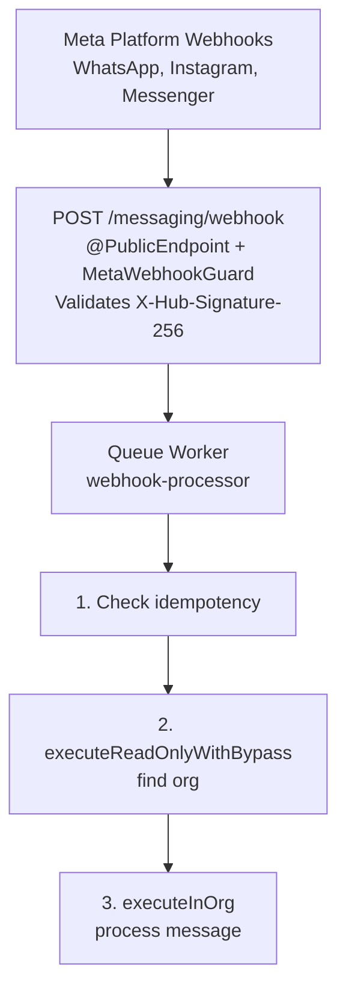
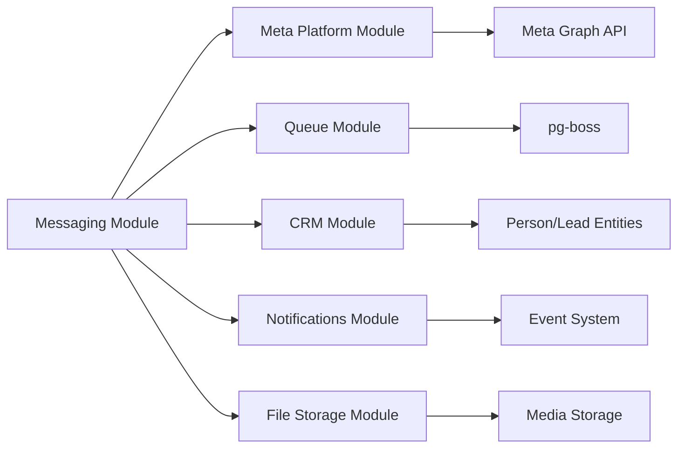

<Note>
**Last Updated:** 2026-04-06  
**Status:** Active
</Note>

## Overview

The Messaging module provides a unified, channel-agnostic messaging system for WhatsApp, Instagram, and Facebook Messenger. It replaces the separate per-channel modules with shared entities, a shared queue, and a single WebSocket namespace.

### Problem → Solution

| Problem | Solution |
|---------|----------|
| Duplicated logic across WhatsApp and Instagram modules | Single `MessagingModule` with channel providers |
| No webhook signature validation (security gap) | Shared `MetaWebhookGuard` validates `X-Hub-Signature-256` |
| Inconsistent WebSocket auth (Instagram gateway has no JWT) | Single `/messaging` gateway with JWT auth |
| No Facebook Messenger support | Third channel provider |
| Separate entity schemas per channel | Unified entities: `Conversation`, `Message`, `ChannelAccount` |
| No shared queue infrastructure | Shared `PgBossQueueService` for messaging + notifications |

### Key Design Decisions

<AccordionGroup>
  <Accordion title="pg-boss over BullMQ">
    Project already uses pg-boss for notifications. No new Redis dependency. Interface-based design (`IQueueService`) allows swapping later.
  </Accordion>

  <Accordion title="Direct PersonChannel FK on Conversation">
    Conversations link directly to the CRM's `PersonChannel` via FK. Simpler model, no bidirectional sync overhead.
  </Accordion>

  <Accordion title="Archive as boolean, not status">
    `Conversation.isArchived` is orthogonal to `status` (OPEN/CLOSED), following `ARCHIVE_SYSTEM_SPECIFICATION.md`.
  </Accordion>

  <Accordion title="Simplified ownership (direct FKs)">
    Conversations use direct `assignedAgentId`/`assignedTeamId` FKs instead of the CRM `entity_stakeholder` pattern. Rationale: conversations have single-owner semantics. Transfer history is tracked via WebSocket events (`conversation-updated`) and notification events (`CONVERSATION_TRANSFERRED`).
  </Accordion>

  <Accordion title="Transactional outbox">
    Outbound messages use an outbox table written in the same DB transaction as the Message entity, guaranteeing at-least-once delivery.
  </Accordion>

  <Accordion title="Per-conversation AI mode with cascade">
    Each conversation has an `aiMode` field (OFF, AUTO_REPLY, SUGGEST_ONLY, DRAFT). Default cascades: ChannelAccount.defaultAiMode → Organization default → OFF.
  </Accordion>

  <Accordion title="Three-tier template system">
    `MessageTemplate` supports three types: `META_APPROVED` (platform-approved), `QUICK_REPLY` (agent shortcuts with variable resolution), and `AI_PROMPT` (AI system prompts with optional SystemPrompt link).
  </Accordion>

  <Accordion title="Personal accounts share org WABA token">
    WhatsApp personal accounts reuse the organization's WABA access token (same Business Account). Instagram and Messenger personal accounts use their own Page Access Token obtained via OAuth.
  </Accordion>
</AccordionGroup>

## Architecture & Module Structure



<Steps>
  <Step title="Webhook Reception">
    Meta webhooks arrive at `POST /messaging/webhook` with signature validation via `MetaWebhookGuard`
  </Step>
  
  <Step title="Queue Processing">
    Events are persisted to `WebhookEventLog` and enqueued to pg-boss for async processing
  </Step>
  
  <Step title="Message Processing">
    Queue worker routes to channel providers (WA/IG/Messenger) and creates unified entities
  </Step>
  
  <Step title="Event Distribution">
    WebSocket events and notifications are emitted to connected clients
  </Step>
</Steps>

### Module Structure

```
src/modules/meta-platform/    ← Top-level infra module, reused by Messaging + future Ads
  meta-platform.module.ts
  meta-graph-api.service.ts
  meta-api.error.ts
  meta-webhook.guard.ts
  meta-oauth.service.ts
  webhook-event-log.entity.ts

src/modules/queue/            ← Top-level infra module, reused by Messaging + Notifications

src/modules/messaging/
  messaging.module.ts
  entities/               ← ChannelAccount, Conversation, Message, MessageTemplate, MessageOutbox
  enums/                  ← Channel, MessageType, MessageStatus, MessageDirection, etc.
  services/               ← Core services + providers/
    providers/            ← WhatsApp, Instagram, Messenger providers
  controllers/            ← Webhook, Conversation, Message, Template, Inbox, ChannelAccount
  gateways/               ← WebSocket gateway (/messaging namespace)
  queues/                 ← webhook-processor, message-sender, media-downloader
  dto/                    ← Request/response DTOs
  utils/                  ← permission.util.ts (personal account access control)
```

## Multi-Tenancy Patterns

<Warning>
The messaging module introduces unique multi-tenancy challenges because webhooks arrive without org context.
</Warning>

### Two-Step RLS Bypass (Webhook Processing)

The webhook controller receives events for ALL organizations from a single Meta App. Org context is unknown at arrival time.

<CodeGroup>

```typescript Step 1: Find Organization
// Step 1: Find which org owns this account (bypass RLS)
const account = await this.tenantContext.executeReadOnlyWithBypass(async (em) => {
  return em.findOne(ChannelAccount, { externalAccountId: job.data.accountId });
});
```

```typescript Step 2: Process in Context
// Step 2: Process within that org's context
await this.tenantContext.executeInOrg(
  account.organization.id,
  async (em) => {
    await this.processMessageInTransaction(em, job.data);
  },
  { userId: undefined }, // system action, no user
);
```

</CodeGroup>

### Composable `*InTransaction` Pattern

Services that participate in existing transactions expose `*InTransaction` methods:

```typescript
// Public API — wraps TenantContext
async matchOrCreate(channel, identifier, profileData, orgId): Promise<MatchResult>;

// Composable — accepts EntityManager from caller's transaction
async matchOrCreateInTransaction(em, channel, identifier, profileData, orgId): Promise<MatchResult>;
```

<Info>
The `em` parameter must always be the one provided by the TenantContext callback — never `this.em`.
</Info>

### Forbidden Patterns

| Pattern | Why It's Forbidden |
|---------|-------------------|
| Using `*Impl` method names | Project convention uses `*InTransaction` suffix |
| Nesting TenantContext calls | Causes deadlocks or incorrect org context |
| Using `this.em` inside TenantContext callbacks | Bypasses the transaction-scoped EntityManager |
| Using `executeWithBypass()` when you have an org context | Silently disables RLS, exposing cross-tenant data |

### WebSocket Gateway Pattern

Every `@SubscribeMessage` handler must establish org context per message:

```typescript
@SubscribeMessage('join-conversation')
async handleJoinConversation(client: AuthenticatedSocket, data: { conversationId: string }) {
  return this.tenantContext.executeInOrg(client.organizationId, async (em) => {
    // Verify access, join room
  });
}
```

## Entities

### Summary

| Entity | Purpose |
|--------|---------|
| `ChannelAccount` | Connected channel account (WA number, IG page, FB page) at org or personal level |
| `Conversation` | Unified conversation thread linked to PersonChannel and CRM entities |
| `Message` | Individual message record with status tracking |
| `MessageTemplate` | Message templates (Meta-approved, quick-reply, AI prompt) |
| `MessageOutbox` | Transactional outbox for reliable message delivery |
| `AutomationRule` | Rules for automated responses and actions |

### ChannelAccount Entity

<Tabs>
  <Tab title="Schema">
    ```sql
    CREATE TABLE channel_account (
      id UUID PRIMARY KEY DEFAULT gen_random_uuid(),
      organization_id UUID NOT NULL REFERENCES organization(id),
      channel channel_type NOT NULL,
      external_account_id VARCHAR NOT NULL,
      page_id VARCHAR, -- Instagram only: Facebook Page ID for Send API
      display_name VARCHAR NOT NULL,
      profile_picture_url VARCHAR,
      access_token VARCHAR, -- Encrypted
      level account_level NOT NULL DEFAULT 'organization',
      webhook_verified BOOLEAN DEFAULT false,
      connected_by UUID REFERENCES "user"(id),
      connected_at TIMESTAMP DEFAULT NOW(),
      default_ai_mode ai_mode DEFAULT 'OFF',
      message_count INTEGER DEFAULT 0,
      last_message_at TIMESTAMP,
      business_verification_status verification_status,
      created_at TIMESTAMP DEFAULT NOW(),
      updated_at TIMESTAMP DEFAULT NOW()
    );
    ```
  </Tab>
  
  <Tab title="Constraints">
    ```sql
    -- Unique account per organization per channel
    UNIQUE (organization_id, channel, external_account_id)
    
    -- Personal accounts must have connected_by
    CHECK (level = 'personal' AND connected_by IS NOT NULL 
           OR level = 'organization')
    ```
  </Tab>
</Tabs>

### Conversation Entity

<Tabs>
  <Tab title="Schema">
    ```sql
    CREATE TABLE conversation (
      id UUID PRIMARY KEY DEFAULT gen_random_uuid(),
      organization_id UUID NOT NULL REFERENCES organization(id),
      external_conversation_id VARCHAR NOT NULL,
      channel_account_id UUID NOT NULL REFERENCES channel_account(id),
      person_channel_id UUID REFERENCES person_channel(id),
      person_id UUID REFERENCES person(id),
      lead_id UUID REFERENCES lead(id),
      deal_id UUID REFERENCES deal(id),
      status conversation_status DEFAULT 'OPEN',
      is_archived BOOLEAN DEFAULT false,
      last_message_at TIMESTAMP DEFAULT NOW(),
      message_count INTEGER DEFAULT 0,
      unread_count INTEGER DEFAULT 0,
      assigned_agent_id UUID REFERENCES "user"(id),
      assigned_team_id UUID REFERENCES team(id),
      assigned_at TIMESTAMP,
      ai_mode ai_mode DEFAULT 'OFF',
      created_at TIMESTAMP DEFAULT NOW(),
      updated_at TIMESTAMP DEFAULT NOW()
    );
    ```
  </Tab>
  
  <Tab title="Indexes">
    ```sql
    -- Fast conversation lookups
    CREATE UNIQUE INDEX idx_conversation_external 
    ON conversation (channel_account_id, external_conversation_id);
    
    -- Inbox queries
    CREATE INDEX idx_conversation_inbox 
    ON conversation (organization_id, status, is_archived, last_message_at DESC);
    
    -- Assignment queries
    CREATE INDEX idx_conversation_assigned_agent 
    ON conversation (assigned_agent_id, status, is_archived);
    ```
  </Tab>
</Tabs>

### Message Entity

```sql
CREATE TABLE message (
  id UUID PRIMARY KEY DEFAULT gen_random_uuid(),
  organization_id UUID NOT NULL REFERENCES organization(id),
  conversation_id UUID NOT NULL REFERENCES conversation(id),
  external_message_id VARCHAR NOT NULL,
  direction message_direction NOT NULL,
  type message_type NOT NULL DEFAULT 'TEXT',
  status message_status DEFAULT 'PENDING',
  sender_id UUID REFERENCES "user"(id), -- For outbound messages
  content JSONB NOT NULL,
  metadata JSONB DEFAULT '{}',
  sent_at TIMESTAMP,
  delivered_at TIMESTAMP,
  read_at TIMESTAMP,
  failed_at TIMESTAMP,
  error_message TEXT,
  created_at TIMESTAMP DEFAULT NOW()
);
```

<Note>
Messages are immutable after creation. Status updates modify existing records but content never changes.
</Note>

## Enums

### Core Channel Enums

<CodeGroup>

```typescript Channel Types
export enum Channel {
  WHATSAPP = 'whatsapp',
  INSTAGRAM = 'instagram', 
  MESSENGER = 'messenger',
}
```

```typescript Message Direction
export enum MessageDirection {
  INBOUND = 'inbound',
  OUTBOUND = 'outbound',
}
```

```typescript Message Status
export enum MessageStatus {
  PENDING = 'pending',
  SENT = 'sent',
  DELIVERED = 'delivered',
  READ = 'read',
  FAILED = 'failed',
}
```

```typescript AI Mode
export enum AiMode {
  OFF = 'off',
  AUTO_REPLY = 'auto_reply',
  SUGGEST_ONLY = 'suggest_only', 
  DRAFT = 'draft',
}
```

</CodeGroup>

### Message Types

```typescript
export enum MessageType {
  TEXT = 'text',
  IMAGE = 'image',
  VIDEO = 'video',
  AUDIO = 'audio',
  DOCUMENT = 'document',
  STICKER = 'sticker',
  LOCATION = 'location',
  CONTACT = 'contact',
  TEMPLATE = 'template', // WhatsApp templates
  INTERACTIVE = 'interactive', // Buttons, lists
  REACTION = 'reaction',
  SYSTEM = 'system', // Status updates
}
```

## Message Flows

### Inbound Message Flow

<Steps>
  <Step title="Webhook Reception">
    Meta webhook arrives at `/messaging/webhook` with signature validation
  </Step>
  
  <Step title="Event Logging">
    Event persisted to `WebhookEventLog` and queued for processing
  </Step>
  
  <Step title="Organization Resolution">
    Queue worker finds organization using `executeReadOnlyWithBypass`
  </Step>
  
  <Step title="Message Processing">
    Within org context, process message and update entities
  </Step>
  
  <Step title="CRM Integration">
    Create Activity record and update PersonChannel statistics
  </Step>
  
  <Step title="Event Distribution">
    Emit WebSocket events and notifications to relevant users
  </Step>
</Steps>

### Outbound Message Flow

<Steps>
  <Step title="Message Creation">
    Agent creates message via API endpoint
  </Step>
  
  <Step title="Transactional Outbox">
    Message and MessageOutbox records created in same transaction
  </Step>
  
  <Step title="Queue Processing">
    Message sender worker processes outbox entries
  </Step>
  
  <Step title="Platform Delivery">
    Send via appropriate channel provider (WhatsApp/Instagram/Messenger)
  </Step>
  
  <Step title="Status Updates">
    Update message status based on platform response
  </Step>
</Steps>

## Business Rules

### Conversation Management

<CardGroup cols={2}>
  <Card title="Assignment Rules" icon="user-tie">
    - Conversations can be assigned to individual agents or teams
    - Assignment changes trigger `CONVERSATION_TRANSFERRED` notifications
    - Unassigned conversations appear in organization inbox
  </Card>
  
  <Card title="Archive vs Status" icon="archive">
    - Archive is independent of conversation status
    - Archived conversations are hidden from default inbox views
    - Status controls operational state (OPEN/CLOSED/ON_HOLD)
  </Card>
  
  <Card title="AI Mode Cascade" icon="robot">
    - Conversation AI mode defaults to ChannelAccount setting
    - Falls back to organization default if not set
    - Can be overridden per conversation
  </Card>
  
  <Card title="Personal Account Access" icon="lock">
    - Personal account conversations only visible to connecting user
    - Organization users with MESSAGING_MANAGE can view all
    - Transfers between personal/org accounts not permitted
  </Card>
</CardGroup>

### Message Delivery

<Warning>
All outbound messages must go through the transactional outbox pattern to ensure reliable delivery.
</Warning>

#### Delivery Guarantees

- **At-least-once delivery** via transactional outbox
- **Idempotency** via external message ID tracking  
- **Retry logic** with exponential backoff for failed sends
- **Dead letter queue** for permanently failed messages

#### Rate Limiting

| Channel | Rate Limit | Burst Allowance |
|---------|------------|-----------------|
| WhatsApp | 1000/sec | 2000 messages |
| Instagram | 200/sec | 600 messages |
| Messenger | 200/sec | 600 messages |

## RBAC Permissions & Access Control

### Core Permissions

| Permission | Scope | Description |
|------------|-------|-------------|
| `MESSAGING_VIEW` | Organization | View conversations and messages |
| `MESSAGING_SEND` | Organization | Send messages and basic conversation actions |
| `MESSAGING_MANAGE` | Organization | Full conversation management, settings, transfers |

### Resource-Level Permissions

The `ResourcePermissionsDto` pattern is applied to conversations:

```typescript
interface ConversationPermissionsDto {
  canView: boolean;      // Always true if conversation is accessible
  canEdit: boolean;      // MESSAGING_MANAGE only
  canTransfer: boolean;  // MESSAGING_MANAGE only  
  canAssign: boolean;    // MESSAGING_MANAGE only
  canArchive: boolean;   // MESSAGING_MANAGE only
}
```

<Info>
Operational actions (close, reopen, AI mode changes) are available to `MESSAGING_SEND` users and are not gated by `canEdit`.
</Info>

### Personal Account Access

Personal channel accounts introduce additional access control rules:

```typescript
// Only the connecting user can access their personal accounts
if (account.level === 'personal' && account.connectedBy?.id !== user.id) {
  // Unless user has MESSAGING_MANAGE permission
  if (!user.hasPermission('MESSAGING_MANAGE')) {
    throw new ForbiddenException('Cannot access personal account');
  }
}
```

## API Endpoints

### Webhook Endpoint

<CodeGroup>

```http POST /messaging/webhook
POST /messaging/webhook
Content-Type: application/json
X-Hub-Signature-256: sha256={signature}

{
  "object": "whatsapp_business_account",
  "entry": [...webhookData]
}
```

```typescript Response
HTTP/1.1 200 OK
Content-Type: text/plain

OK
```

</CodeGroup>

<Note>
This endpoint uses `@PublicEndpoint()` and `MetaWebhookGuard` for signature validation since organization context is unknown at arrival time.
</Note>

### Conversation Endpoints

<AccordionGroup>
  <Accordion title="List Conversations">
    ```http
    GET /messaging/conversations
    Authorization: Bearer {token}
    
    Query Parameters:
    - status: open | closed | on_hold
    - isArchived: boolean
    - assignedToMe: boolean  
    - channelAccountId: uuid
    - page: number
    - limit: number (max 100)
    ```
  </Accordion>

  <Accordion title="Get Conversation">
    ```http
    GET /messaging/conversations/{id}
    Authorization: Bearer {token}
    
    Returns conversation with resource permissions
    ```
  </Accordion>

  <Accordion title="Update Conversation">
    ```http
    PATCH /messaging/conversations/{id}
    Authorization: Bearer {token}
    Content-Type: application/json
    
    {
      "status": "closed",
      "assignedAgentId": "uuid", 
      "assignedTeamId": "uuid",
      "aiMode": "auto_reply"
    }
    ```
  </Accordion>

  <Accordion title="Archive Conversation">
    ```http
    POST /messaging/conversations/{id}/archive
    Authorization: Bearer {token}
    
    Requires MESSAGING_MANAGE permission
    ```
  </Accordion>
</AccordionGroup>

### Message Endpoints

<AccordionGroup>
  <Accordion title="List Messages">
    ```http
    GET /messaging/conversations/{conversationId}/messages
    Authorization: Bearer {token}
    
    Query Parameters:
    - beforeId: uuid (pagination cursor)
    - limit: number (max 100, default 50)
    ```
  </Accordion>

  <Accordion title="Send Message">
    ```http
    POST /messaging/conversations/{conversationId}/messages
    Authorization: Bearer {token}
    Content-Type: application/json
    
    {
      "type": "text",
      "content": {
        "text": "Hello customer!"
      },
      "templateId": "optional-uuid"
    }
    ```
  </Accordion>

  <Accordion title="Mark as Read">
    ```http
    POST /messaging/conversations/{conversationId}/mark-read
    Authorization: Bearer {token}
    
    {
      "messageId": "uuid" // optional, marks all if omitted
    }
    ```
  </Accordion>
</AccordionGroup>

## WebSocket Events & Room Architecture

### Gateway Configuration

The messaging WebSocket gateway uses the `/messaging` namespace with JWT authentication:

```typescript
@WebSocketGateway({
  namespace: 'messaging',
  cors: { origin: true, credentials: true }
})
export class MessagingGateway {
  // JWT auth middleware validates tokens
  // Each client joins rooms based on permissions
}
```

### Room Architecture

<Tabs>
  <Tab title="Room Types">
    | Room Name | Purpose | Access |
    |-----------|---------|--------|
    | `org:{orgId}` | Organization-wide events | All org users |
    | `user:{userId}` | Personal account events | Individual user |
    | `conversation:{id}` | Conversation-specific events | Assigned users + managers |
    | `agent:{userId}` | Agent-specific notifications | Individual agent |
  </Tab>
  
  <Tab title="Auto-Join Logic">
    ```typescript
    @SubscribeMessage('join-rooms')
    async handleJoinRooms(client: AuthenticatedSocket) {
      const { organizationId, userId, permissions } = client;
      
      // Join organization room
      client.join(`org:${organizationId}`);
      
      // Join personal room  
      client.join(`user:${userId}`);
      
      // Join agent room if has messaging permissions
      if (permissions.includes('MESSAGING_VIEW')) {
        client.join(`agent:${userId}`);
      }
    }
    ```
  </Tab>
</Tabs>

### WebSocket Events

<AccordionGroup>
  <Accordion title="Conversation Events">
    ```typescript
    // New conversation created
    'conversation-created' -> ConversationDto
    
    // Conversation updated (status, assignment, etc.)
    'conversation-updated' -> ConversationDto
    
    // Conversation archived/unarchived  
    'conversation-archived' -> { conversationId, isArchived }
    ```
  </Accordion>

  <Accordion title="Message Events">
    ```typescript
    // New message received/sent
    'message-created' -> MessageDto
    
    // Message status updated
    'message-status-updated' -> { messageId, status, timestamp }
    
    // Typing indicators
    'typing-start' -> { conversationId, userId }
    'typing-stop' -> { conversationId, userId }
    ```
  </Accordion>

  <Accordion title="Presence Events">
    ```typescript
    // Agent presence updates
    'agent-online' -> { userId, timestamp }
    'agent-offline' -> { userId, timestamp }
    
    // Conversation join/leave
    'agent-joined-conversation' -> { conversationId, userId }
    'agent-left-conversation' -> { conversationId, userId }
    ```
  </Accordion>
</AccordionGroup>

### Client Event Handlers

<CodeGroup>

```typescript Join Conversation
socket.emit('join-conversation', { 
  conversationId: 'uuid' 
});

// Server validates access and adds client to room
// conversation:{conversationId}
```

```typescript Send Typing Indicator  
socket.emit('typing-start', {
  conversationId: 'uuid'
});

// Broadcasts to other users in conversation room
```

```typescript Leave Conversation
socket.emit('leave-conversation', {
  conversationId: 'uuid' 
});

// Removes client from conversation room
```

</CodeGroup>

## Messaging-Specific Conventions

### Template Variable Resolution

Message templates support variable substitution with CRM data:

```typescript
// Template content
"Hello {{person.firstName}}, your order {{deal.reference}} is ready!"

// Resolved message  
"Hello John, your order ORD-12345 is ready!"

// Available variables
{{person.firstName}} {{person.lastName}} {{person.email}}
{{organization.name}} {{lead.title}} {{deal.reference}}
{{agent.firstName}} {{conversation.id}}
```

### Media Handling

<Steps>
  <Step title="Inbound Media">
    Media URLs from webhooks are queued for download and storage
  </Step>
  
  <Step title="Media Download">
    Worker downloads media using platform access tokens
  </Step>
  
  <Step title="File Storage">
    Media stored in configured file storage (S3/MinIO/local)
  </Step>
  
  <Step title="URL Generation">
    Signed URLs generated for client access with expiration
  </Step>
</Steps>

### Message Content Schema

Different message types have specific content schemas:

<Tabs>
  <Tab title="Text Message">
    ```json
    {
      "text": "Hello world!",
      "mentions": [
        {
          "userId": "uuid",
          "start": 0,
          "length": 5
        }
      ]
    }
    ```
  </Tab>
  
  <Tab title="Media Message">
    ```json
    {
      "mediaUrl": "https://storage.example.com/file.jpg",
      "mimeType": "image/jpeg",
      "caption": "Optional caption",
      "filename": "image.jpg",
      "fileSize": 1024000
    }
    ```
  </Tab>
  
  <Tab title="Template Message">
    ```json
    {
      "templateName": "order_confirmation",
      "templateLanguage": "en",
      "parameters": [
        {
          "type": "text",
          "value": "John Doe"
        }
      ]
    }
    ```
  </Tab>
</Tabs>

## Query Patterns

### Conversation List Queries

<CodeGroup>

```sql Inbox Query
-- Optimized inbox query with proper indexing
SELECT c.*, ca.display_name, ca.channel, p.first_name, p.last_name
FROM conversation c
JOIN channel_account ca ON c.channel_account_id = ca.id  
LEFT JOIN person p ON c.person_id = p.id
WHERE c.organization_id = $1
  AND c.is_archived = false
  AND c.status = ANY($2) -- ['open', 'on_hold']
ORDER BY c.last_message_at DESC
LIMIT $3 OFFSET $4;
```

```sql Personal Account Filter
-- Filter for personal account access
SELECT c.*
FROM conversation c  
JOIN channel_account ca ON c.channel_account_id = ca.id
WHERE c.organization_id = $1
  AND (
    ca.level = 'organization' 
    OR (ca.level = 'personal' AND ca.connected_by = $2)
    OR $3 = true -- user has MESSAGING_MANAGE
  );
```

```sql Assignment Query
-- Find conversations assigned to user/team
SELECT c.*
FROM conversation c
WHERE c.organization_id = $1
  AND c.is_archived = false
  AND (
    c.assigned_agent_id = $2 
    OR c.assigned_team_id = ANY(
      SELECT team_id FROM team_member WHERE user_id = $2
    )
  );
```

</CodeGroup>

### Message List Queries

```sql
-- Paginated message list with cursor
SELECT m.*
FROM message m
WHERE m.conversation_id = $1
  AND ($2::uuid IS NULL OR m.id < $2) -- beforeId cursor
ORDER BY m.created_at DESC, m.id DESC
LIMIT $3;
```

### Statistics Queries

```sql
-- Channel account message stats
UPDATE channel_account 
SET 
  message_count = message_count + 1,
  last_message_at = NOW()
WHERE id = $1;

-- Conversation unread count
UPDATE conversation
SET unread_count = unread_count + 1
WHERE id = $1 AND $2 = 'inbound';
```

## Error Handling & Retry Strategy

### Webhook Processing Errors

<Warning>
Webhook processing failures are handled gracefully to avoid losing messages.
</Warning>

<Steps>
  <Step title="Immediate Response">
    Always return 200 OK to Meta webhooks to prevent retries
  </Step>
  
  <Step title="Error Logging">
    Log processing errors with full context for debugging
  </Step>
  
  <Step title="Retry Logic">
    Failed jobs are retried with exponential backoff (5 attempts)
  </Step>
  
  <Step title="Dead Letter Queue">
    Permanently failed jobs moved to DLQ for manual investigation
  </Step>
</Steps>

### Message Sending Errors

```typescript
// Retry configuration for message sending
const retryConfig = {
  attempts: 5,
  backoffDelays: [1000, 5000, 15000, 45000, 120000], // ms
  retryableErrors: [
    'RATE_LIMITED',
    'NETWORK_ERROR', 
    'TEMPORARY_PLATFORM_ERROR'
  ],
  nonRetryableErrors: [
    'INVALID_TOKEN',
    'ACCOUNT_RESTRICTED',
    'MESSAGE_TOO_LONG'
  ]
};
```

### Platform-Specific Error Handling

<Tabs>
  <Tab title="WhatsApp Errors">
    ```typescript
    // WhatsApp-specific error codes
    const whatsappErrorCodes = {
      131056: 'Message failed to send', // Retry
      131051: 'Unsupported message type', // Don't retry
      131053: 'Rate limit exceeded', // Retry with backoff
      370: 'User cannot be reached', // Don't retry
    };
    ```
  </Tab>
  
  <Tab title="Instagram Errors">
    ```typescript
    // Instagram-specific error codes  
    const instagramErrorCodes = {
      100: 'Invalid parameter', // Don't retry
      190: 'Invalid access token', // Don't retry
      613: 'Rate limit exceeded', // Retry with backoff
    };
    ```
  </Tab>
  
  <Tab title="Messenger Errors">
    ```typescript
    // Messenger-specific error codes
    const messengerErrorCodes = {
      10: 'Permission denied', // Don't retry
      613: 'Rate limit exceeded', // Retry with backoff
      2018108: 'User not found', // Don't retry
    };
    ```
  </Tab>
</Tabs>

## Deployment Considerations

### Environment Variables

<AccordionGroup>
  <Accordion title="Meta Platform Configuration">
    ```bash
    META_APP_ID=your_app_id
    META_APP_SECRET=your_app_secret
    META_VERIFY_TOKEN=your_webhook_verify_token
    META_API_VERSION=v19.0
    META_BASE_URL=https://graph.facebook.com
    ```
  </Accordion>

  <Accordion title="Queue Configuration">
    ```bash
    QUEUE_CONCURRENCY=10
    QUEUE_MAX_ATTEMPTS=5
    QUEUE_RETENTION_DAYS=30
    WEBHOOK_PROCESSOR_CONCURRENCY=5
    MESSAGE_SENDER_CONCURRENCY=3
    ```
  </Accordion>

  <Accordion title="WebSocket Configuration">
    ```bash
    WEBSOCKET_CORS_ORIGIN=https://app.example.com
    WEBSOCKET_MAX_CONNECTIONS=1000
    WEBSOCKET_PING_TIMEOUT=30000
    WEBSOCKET_PING_INTERVAL=25000
    ```
  </Accordion>
</AccordionGroup>

### Scaling Considerations

<CardGroup cols={2}>
  <Card title="Horizontal Scaling" icon="arrows-split-up-and-left">
    - Multiple worker instances can process queues concurrently
    - WebSocket gateway supports Redis adapter for multi-instance
    - Stateless design enables easy horizontal scaling
  </Card>
  
  <Card title="Database Performance" icon="database">
    - Proper indexing on conversation and message queries
    - Partitioning considerations for high-volume message tables
    - Connection pooling for database access
  </Card>
  
  <Card title="Queue Performance" icon="list-timeline">
    - pg-boss provides built-in job scheduling and retry logic
    - Monitor queue depth and processing times
    - Consider separate databases for queue vs application data
  </Card>
  
  <Card title="WebSocket Performance" icon="bolt">
    - Monitor connection counts and message throughput
    - Use Redis adapter for clustering WebSocket instances
    - Implement rate limiting on WebSocket events
  </Card>
</CardGroup>

### Health Checks

```typescript
// Health check endpoints
GET /health/messaging
{
  "status": "healthy",
  "checks": {
    "database": "healthy",
    "queue": "healthy", 
    "webhook_processing": "healthy",
    "message_sending": "degraded"
  }
}
```

## Module Dependencies & Integration Points

### Core Dependencies



### CRM Integration Points

<Tabs>
  <Tab title="PersonChannel Bridge">
    ```typescript
    // Automatic PersonChannel creation/matching
    interface PersonChannelBridge {
      matchOrCreate(
        channel: Channel,
        identifier: string, 
        profileData: ProfileData,
        orgId: string
      ): Promise<PersonChannel>;
    }
    ```
  </Tab>
  
  <Tab title="Activity Creation">
    ```typescript
    // CRM Activity records for message events
    interface ActivityBridge {
      createMessageActivity(
        message: Message,
        conversation: Conversation
      ): Promise<Activity>;
    }
    ```
  </Tab>
  
  <Tab title="Lead/Deal Linking">
    ```typescript
    // Link conversations to CRM entities
    interface CrmLinkingBridge {
      linkToLead(conversationId: string, leadId: string): Promise<void>;
      linkToDeal(conversationId: string, dealId: string): Promise<void>;
    }
    ```
  </Tab>
</Tabs>

### External Service Integration

<AccordionGroup>
  <Accordion title="Meta Graph API">
    - WhatsApp Business API for message sending
    - Instagram Messaging API for Instagram Direct
    - Messenger Platform API for Facebook Messenger
    - Webhook subscription management
  </Accordion>

  <Accordion title="File Storage">
    - Media download from Meta CDN
    - Local file storage (S3/MinIO/filesystem)
    - Signed URL generation for client access
    - Cleanup of temporary files
  </Accordion>

  <Accordion title="Notification System">
    - Real-time notifications via WebSocket
    - Push notifications for mobile apps
    - Email notifications for offline agents
    - Slack/Teams integration hooks
  </Accordion>
</AccordionGroup>

## Testing Strategy

### Unit Testing

<CodeGroup>

```typescript Service Testing
// Example service unit test
describe('ConversationService', () => {
  it('should create conversation with proper defaults', async () => {
    const conversation = await service.create({
      externalConversationId: 'ext-123',
      channelAccountId: 'account-uuid',
      personChannelId: 'person-channel-uuid'
    });
    
    expect(conversation.status).toBe(ConversationStatus.OPEN);
    expect(conversation.isArchived).toBe(false);
    expect(conversation.aiMode).toBe(AiMode.OFF);
  });
});
```

```typescript Provider Testing
// Channel provider unit test
describe('WhatsAppProvider', () => {
  it('should send text message successfully', async () => {
    mockAxios.post.mockResolvedValue({
      data: { messages: [{ id: 'msg-123' }] }
    });
    
    const result = await provider.sendMessage(account, {
      to: '+1234567890',
      type: 'text',
      text: { body: 'Hello' }
    });
    
    expect(result.externalMessageId).toBe('msg-123');
  });
});
```

</CodeGroup>

### Integration Testing

<Tabs>
  <Tab title="Webhook Processing">
    ```typescript
    describe('Webhook Integration', () => {
      it('should process WhatsApp message webhook end-to-end', async () => {
        // Send webhook payload
        const response = await request(app)
          .post('/messaging/webhook')
          .set('X-Hub-Signature-256', validSignature)
          .send(whatsappWebhookPayload)
          .expect(200);
        
        // Verify queue job created
        const jobs = await queueService.getJobs('webhook-processor');
        expect(jobs).toHaveLength(1);
        
        // Process job
        await queueService.processNextJob('webhook-processor');
        
        // Verify entities created
        const conversation = await conversationRepo.findOne({
          externalConversationId: 'webhook-conversation-id'
        });
        expect(conversation).toBeDefined();
      });
    });
    ```
  </Tab>
  
  <Tab title="WebSocket Events">
    ```typescript
    describe('WebSocket Integration', () => {
      it('should emit conversation events to correct rooms', async () => {
        const client = await connectAuthenticatedClient();
        const eventSpy = jest.fn();
        client.on('conversation-created', eventSpy);
        
        // Create conversation via API
        await request(app)
          .post('/messaging/conversations')
          .set('Authorization', `Bearer ${token}`)
          .send(conversationData);
        
        // Verify event received
        await waitFor(() => {
          expect(eventSpy).toHaveBeenCalledWith(
            expect.objectContaining({
              id: expect.any(String),
              status: 'OPEN'
            })
          );
        });
      });
    });
    ```
  </Tab>
</Tabs>

### Load Testing

<Warning>
Load testing should focus on high-volume webhook processing and concurrent WebSocket connections.
</Warning>

```typescript
// Performance test configuration
const loadTestConfig = {
  webhookLoad: {
    requestsPerSecond: 1000,
    duration: '10m',
    payloadTypes: ['message', 'status', 'read_receipt']
  },
  websocketLoad: {
    concurrentConnections: 5000,
    messagesPerSecond: 10000,
    roomDistribution: 'random'
  },
  databaseLoad: {
    maxConnections: 100,
    queryTimeout: '30s',
    slowQueryThreshold: '1s'
  }
};
```

## Legacy Module Removal

### Migration Strategy

<Steps>
  <Step title="Data Migration">
    Migrate existing WhatsApp and Instagram data to unified schema
  </Step>
  
  <Step title="API Compatibility">
    Maintain legacy API endpoints with deprecation warnings
  </Step>
  
  <Step title="Gradual Rollout">
    Feature flag new messaging module for controlled rollout  
  </Step>
  
  <Step title="Legacy Removal">
    Remove legacy modules after successful migration validation
  </Step>
</Steps>

### Data Migration Service

```typescript
@Injectable()
export class MessagingMigrationService {
  async migrateLegacyData() {
    // Migrate WhatsApp conversations
    await this.migrateWhatsAppConversations();
    
    // Migrate Instagram conversations  
    await this.migrateInstagramConversations();
    
    // Migrate message templates
    await this.migrateMessageTemplates();
    
    // Update PersonChannel references
    await this.updatePersonChannelReferences();
  }
}
```

<Tip>
Run migrations in read-only mode first to validate data consistency before actual migration.
</Tip>

## Known Gaps & Technical Debt

### Current Limitations

<AccordionGroup>
  <Accordion title="AI Integration">
    - AI mode implementation is placeholder
    - No actual AI service integration yet
    - Suggestion generation not implemented
  </Accordion>

  <Accordion title="Advanced Features">
    - No message scheduling capability
    - Limited automation rule engine
    - No advanced analytics/reporting
    - Missing bulk message operations
  </Accordion>

  <Accordion title="Platform Features">
    - WhatsApp catalog/product messages not supported
    - Instagram story replies not handled
    - Messenger persistent menu not configurable
  </Accordion>

  <Accordion title="Performance Optimizations">
    - No message content search indexing
    - Limited conversation list pagination
    - No message content compression
  </Accordion>
</AccordionGroup>

### Technical Debt Items

| Item | Priority | Effort | Notes |
|------|----------|--------|-------|
| Implement full AI service integration | High | Large | Core feature requirement |
| Add message search capabilities | Medium | Medium | ElasticSearch integration |
| Optimize WebSocket event batching | Medium | Small | Performance improvement |
| Add comprehensive monitoring | High | Medium | Production readiness |
| Implement message content encryption | Low | Large | Compliance requirement |

## Related Documentation

<CardGroup cols={2}>
  <Card title="Multi-Tenancy Guide" icon="users" href="/backend/architecture/multi-tenancy">
    Complete RLS patterns and tenant context usage
  </Card>
  
  <Card title="Queue System" icon="list-timeline" href="/backend/queue/specification">
    pg-boss queue infrastructure and job processing
  </Card>
  
  <Card title="WebSocket Architecture" icon="wifi" href="/backend/websockets/specification">
    Real-time event system and gateway patterns
  </Card>
  
  <Card title="CRM Integration" icon="address-book" href="/backend/crm/specification">
    Person, Lead, and Activity entity relationships
  </Card>
</CardGroup>

---

<Info>
This specification is a living document that will be updated as the messaging module evolves and new requirements emerge.
</Info>