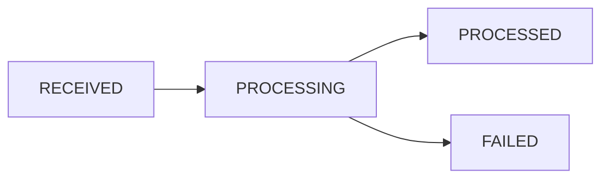

## Overview

The Meta Platform module provides integration capabilities with Meta's Graph API ecosystem, including Facebook and Instagram messaging, advertising, and webhook handling. This module serves as a foundational layer for interacting with Meta's various APIs while handling authentication, error management, and webhook verification.

<Info>
**Last Updated:** 2026-06-01  
**Status:** Active
</Info>

The module abstracts common Meta API operations, implements OAuth flows, and provides secure webhook validation to ensure reliable communication with Meta's services.

## Architecture

The module follows a service-oriented architecture with clear separation of concerns:

<CardGroup cols={2}>
  <Card title="MetaGraphApiService" icon="code">
    Core HTTP client for Graph API interactions
  </Card>
  <Card title="MetaOAuthService" icon="key">
    Handles OAuth token management and exchange
  </Card>
  <Card title="MetaWebhookGuard" icon="shield">
    Validates incoming webhook requests from Meta
  </Card>
  <Card title="MetaApiError" icon="triangle-exclamation">
    Specialized error class for Meta API responses
  </Card>
</CardGroup>

<Note>
The module is designed to be stateless and relies on dependency injection for configuration management.
</Note>

## Services

### MetaGraphApiService

Core service for making authenticated requests to Meta's Graph API.

#### Key Features

- Automatic retry logic with exponential backoff
- Comprehensive error handling with Meta-specific error codes
- Type-safe request/response handling
- Configurable base URL with a fixed 3-total-attempt retry cap
- Per-account circuit breaker isolation

#### Methods

| Method | Signature | Description |
|--------|-----------|-------------|
| `get<T>` | `(path, params, token, version?, circuitKey?, baseUrl?, timeoutMs?)` | GET request with query parameters |
| `post<T>` | `(path, body, token, version?, circuitKey?, baseUrl?)` | POST request with JSON body |
| `postFormData<T>` | `(path, formData, token, version?, circuitKey?, baseUrl?)` | POST request with multipart form data |
| `uploadResumableAsset` | `({ fileName, fileType, fileBuffer, token, version?, circuitKey? })` | Creates a Meta Resumable Upload session under the configured app id and uploads raw bytes, returning the asset handle (`h`) used for WhatsApp template media header examples |
| `delete<T>` | `(path, token, version?, circuitKey?, baseUrl?)` | DELETE request (no body or query params — append query params to `path` if needed). Used by messaging account cleanup for webhook unsubscription and app-permission revocation. |

<Tip>
All methods accept an optional `version` (defaults to `app.meta.whatsappApiVersion`), `circuitKey` for per-account circuit breaker isolation, and `baseUrl` to override the default `graph.facebook.com` (e.g. `graph.instagram.com` for Instagram Login API calls).
</Tip>

#### Configuration Dependencies

```typescript
app: {
  meta: {
    graphApiBaseUrl: string;        // Base URL for Graph API (defaults to https://graph.facebook.com)
    whatsappApiVersion: string;     // Default API version for WhatsApp operations (default v25.0)
    instagramApiVersion: string;    // Default API version for Instagram operations (default v25.0)
    messengerApiVersion: string;    // Default API version for Messenger operations (default v25.0)
    oauthApiVersion: string;        // API version for OAuth flows (default v25.0)
  }
}
```

### MetaOAuthService

Handles OAuth token operations for Meta platform authentication.

#### Configuration Dependencies

```typescript
app: {
  meta: {
    graphApiBaseUrl: string;   // Base URL for OAuth endpoints
    appId: string;             // Meta application ID
    appSecret: string;         // Meta application secret
    oauthApiVersion: string;   // API version for OAuth dialog and token exchange (default v25.0)
  }
}
```

#### Methods

<AccordionGroup>
  <Accordion title="getAuthorizationUrl(scopes, redirectUri, state)">
    Builds the Facebook OAuth dialog URL with the configured `oauthApiVersion`.
    
    **Parameters:**
    - `scopes`: Array of OAuth permission scopes
    - `redirectUri`: OAuth callback URL
    - `state`: CSRF protection state parameter
    
    **Returns:** Complete authorization URL string
  </Accordion>

  <Accordion title="exchangeCodeForToken(code, redirectUri)">
    Exchanges an authorization code for a short-lived access token.
    
    **Parameters:**
    - `code`: Authorization code from OAuth callback
    - `redirectUri`: Same redirect URI used in authorization request
    
    **Returns:** `TokenResponse` with access token and expiration
  </Accordion>

  <Accordion title="exchangeEmbeddedSignupCode(code)">
    Exchanges a WhatsApp Embedded Signup code for a non-expiring BISUAT.
    
    <Warning>
    Uses `axios` directly (no retries) because the code is single-use with a 30s TTL — retries would fail with Meta error 36007.
    </Warning>
    
    **Parameters:**
    - `code`: Single-use embedded signup code
    
    **Returns:** `TokenResponse` with business integration system user access token
  </Accordion>

  <Accordion title="exchangeForLongLivedToken(shortLivedToken)">
    Exchanges a short-lived user token for a long-lived token (~60 days).
    
    **Parameters:**
    - `shortLivedToken`: Short-lived access token
    
    **Returns:** `TokenResponse` with long-lived token
  </Accordion>

  <Accordion title="refreshToken(token)">
    Refreshes a token (delegates to `exchangeForLongLivedToken`).
    
    **Parameters:**
    - `token`: Token to refresh
    
    **Returns:** `TokenResponse` with refreshed token
  </Accordion>
</AccordionGroup>

#### Token Response Interface

```typescript
interface TokenResponse {
  access_token: string;
  token_type: string;
  expires_in?: number;
}
```

### MetaWebhookGuard

NestJS guard that validates webhook requests from Meta using HMAC-SHA256 signature verification.

#### Security Features

<Check>HMAC-SHA256 signature validation</Check>
<Check>Timing-safe comparison to prevent timing attacks</Check>
<Check>Automatic request rejection for invalid signatures</Check>

<Note>
Route-level throttling remains enabled on webhook endpoints to protect CPU, database writes, and pg-boss queue capacity. Signature validation proves authenticity, but it does not prevent signed flood/retry storms.
</Note>

#### Configuration Dependencies

```typescript
app: {
  meta: {
    webhookVerifyToken: string;  // Secret token for webhook verification
  }
}
```

<Info>
Single `webhookVerifyToken` value is correct for one-Meta-App architecture. See MESSAGING_MODULE_SPECIFICATION.md § "Webhook Verify Token" for rationale.
</Info>

## Error Handling

### MetaApiError

Specialized error class for Meta API operations with enhanced context.

```typescript
class MetaApiError extends Error {
  constructor(
    message: string,
    statusCode: number,
    metaErrorCode?: number,
    metaErrorSubcode?: number,
    isRetryable: boolean = false,
  );
}
```

#### Properties

| Property | Type | Description |
|----------|------|-------------|
| `statusCode` | number | HTTP status code from the API response |
| `metaErrorCode` | number | Meta-specific error code (if available) |
| `metaErrorSubcode` | number | Meta-specific error subcode (if available) |
| `isRetryable` | boolean | Indicates if the operation can be safely retried |

<Warning>
Both `MetaApiError` and `CircuitOpenError` call `Object.setPrototypeOf(this, <Class>.prototype)` in their constructors to ensure `instanceof` checks work correctly with TypeScript class inheritance from `Error`.
</Warning>

### WhatsApp Billing Errors

Meta WhatsApp send/status failures that indicate WABA billing setup problems are handled in the Messaging module, not by changing Propwise subscription billing.

<Info>
The canonical billing/payment error code is `131042` ("Business eligibility payment issue").
</Info>

Messaging classifies this and related payment-method/billing/credit-line text as `MessageFailureCategory.META_BILLING`, preserves the raw `failedReason`, and includes the category on message DTOs and `message-status-updated` socket events so the frontend can guide the user to Meta Business Suite billing settings.

## Configuration

The module requires the following configuration parameters in the application config:

```typescript
{
  // Top-level shared encryption key
  encryptionKey: string;  // AES-256-GCM key for at-rest encryption

  meta: {
    // API Endpoints
    graphApiBaseUrl: string;              // Meta Graph API base URL
    instagramGraphApiBaseUrl: string;     // Instagram Login Graph API base URL
    
    // Application Credentials
    appId: string;                        // Meta application ID
    appSecret: string;                    // Meta application secret
    webhookVerifyToken: string;           // Webhook verification token
    
    // API Versions
    whatsappApiVersion: string;           // WhatsApp Cloud API version (e.g. 'v22.0')
    instagramApiVersion: string;          // Instagram Messaging API version (e.g. 'v23.0')
    messengerApiVersion: string;          // Messenger Platform API version (e.g. 'v23.0')
    oauthApiVersion: string;              // OAuth dialog/token exchange version (e.g. 'v22.0')
    
    // Timing Configuration
    metaSyncPageDelayMs: number;          // Delay between historical sync pagination calls
    mediaShareEnrichmentTimeoutMs: number; // Timeout for best-effort shared reel/post preview lookup
  }
}
```

### Configurable API Versions

Meta deprecates Graph API versions on a rolling basis. Each channel's API version is configurable via environment variables so upgrades require only a config change, not code changes.

| Environment Variable | Config Key | Default | Used By |
|---------------------|------------|---------|---------|
| `META_WHATSAPP_API_VERSION` | `app.meta.whatsappApiVersion` | `v22.0` | WhatsAppProviderService, TemplateService, ChannelAccountService |
| `META_INSTAGRAM_API_VERSION` | `app.meta.instagramApiVersion` | `v23.0` | InstagramProviderService, ChannelAccountService, InstagramMediaService |
| `META_MESSENGER_API_VERSION` | `app.meta.messengerApiVersion` | `v23.0` | MessengerProviderService, ChannelAccountService |
| `META_OAUTH_API_VERSION` | `app.meta.oauthApiVersion` | `v22.0` | MetaOAuthService |

#### Upgrade Procedure

<Steps>
  <Step title="Update Environment Variable">
    Change the desired API version environment variable in your deployment configuration.
  </Step>
  
  <Step title="Deploy Application">
    Deploy the updated configuration to your environment.
  </Step>
  
  <Step title="Test Integration">
    Verify that all Meta API interactions work correctly with the new version.
  </Step>
</Steps>

<Tip>
No code changes are needed for API version upgrades — only configuration updates.
</Tip>

## Entities

### WebhookEventLog

Raw webhook payload storage used for idempotency and debugging. Persisted before async processing so duplicate webhooks from Meta are detected and skipped.

| Field | Type | Description |
|-------|------|-------------|
| `id` | UUID | Primary key |
| `platform` | WebhookPlatform | `META` or `GOOGLE` |
| `eventType` | WebhookEventType | `MESSAGING`, `STATUS_UPDATE`, or `LEAD_FORM` |
| `externalEventId` | string | Deterministic ID for idempotency (unique constraint) |
| `payload` | JSONB | Raw webhook payload |
| `status` | WebhookEventStatus | `RECEIVED` → `PROCESSING` → `PROCESSED` / `FAILED` |
| `receivedAt` | timestamp | When webhook was received |
| `processedAt` | timestamp | When processing completed |
| `error` | string | Error message if processing failed |

#### Status Flow



<Note>
The `externalEventId` unique constraint prevents duplicate processing of the same webhook event from Meta.
</Note>

## Integration Examples

### Making a Graph API Request

```typescript
import { MetaGraphApiService } from '@modules/meta-platform';

// Inject service
constructor(private metaGraphApi: MetaGraphApiService) {}

// Make a GET request
async getPageInfo(pageId: string, token: string) {
  return this.metaGraphApi.get<PageInfo>(
    `/${pageId}`,
    { fields: 'name,about,category' },
    token,
    'v21.0',
    `page:${pageId}`,  // Circuit breaker key
  );
}

// Make a POST request
async sendMessage(recipientId: string, message: string, token: string) {
  return this.metaGraphApi.post(
    '/me/messages',
    {
      recipient: { id: recipientId },
      message: { text: message },
    },
    token,
  );
}
```

### Implementing OAuth Flow

```typescript
import { MetaOAuthService } from '@modules/meta-platform';

constructor(private metaOAuth: MetaOAuthService) {}

// Step 1: Redirect user to authorization
async initiateLogin(res: Response) {
  const url = this.metaOAuth.getAuthorizationUrl(
    ['pages_messaging', 'pages_read_engagement'],
    'https://app.example.com/auth/callback',
    'random-state-value',
  );
  res.redirect(url);
}

// Step 2: Handle callback and exchange code
async handleCallback(code: string, redirectUri: string) {
  const tokenResponse = await this.metaOAuth.exchangeCodeForToken(
    code,
    redirectUri,
  );
  
  // Exchange for long-lived token
  return this.metaOAuth.exchangeForLongLivedToken(
    tokenResponse.access_token,
  );
}
```

### Validating Webhooks

```typescript
import { MetaWebhookGuard } from '@modules/meta-platform';

@Controller('webhooks/meta')
export class MetaWebhookController {
  @Post()
  @UseGuards(MetaWebhookGuard)  // Validates signature
  async handleWebhook(@Body() payload: any) {
    // Signature already validated by guard
    // Process webhook payload
    return { success: true };
  }
}
```

### Handling Errors

```typescript
import { MetaApiError } from '@modules/meta-platform';

try {
  await this.metaGraphApi.post('/me/messages', payload, token);
} catch (error) {
  if (error instanceof MetaApiError) {
    if (error.metaErrorCode === 131042) {
      // Handle billing error
      throw new BadRequestException('WABA billing issue');
    }
    
    if (error.isRetryable) {
      // Queue for retry
      await this.queueRetry(payload);
    }
  }
  throw error;
}
```

## Related Modules

<CardGroup cols={2}>
  <Card title="Messaging Module" icon="comments" href="/backend/messaging/messaging-module-specification-v30">
    Uses Meta Platform for WhatsApp, Messenger, and Instagram messaging
  </Card>
  <Card title="Channel Account Module" icon="plug" href="/backend/channel-account/channel-account-module-specification-v30">
    Manages Meta OAuth flows and account connections
  </Card>
</CardGroup>