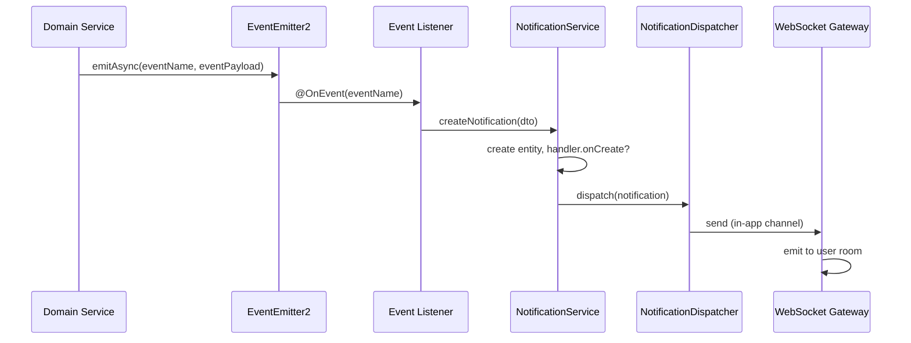

This guide explains how to add new notification types to the PropWise notification system. Use it when implementing notifications triggered by CRM, Real Estate, Team, or System events.

## Architecture overview

The notification system is **event-driven and decoupled** from domain modules:

- **Domain modules** (CRM, Real Estate, etc.) emit events after business logic succeeds
- **Notification listeners** (in the notification module) subscribe to those events and call `NotificationService.createNotification()`
- **NotificationService** creates the entity, optionally runs an action handler's `onCreate()`, persists, and dispatches to channels (in-app WebSocket, email)
- **Action handlers** (when the user clicks a button) are co-located with their domain module, decorated with `@NotificationActionHandler({ name })`, and auto-discovered at bootstrap by `NotificationHandlerExplorer`. They inject domain services directly and call them to perform business logic.



## Decision tree

Before implementing, decide:

| Question                                                                            | Answer                                    | Action                                                                                                                                                                           |
| ----------------------------------------------------------------------------------- | ----------------------------------------- | -------------------------------------------------------------------------------------------------------------------------------------------------------------------------------- |
| Does the notification need **buttons** (Approve, Reject, View)?                     | Yes                                       | Create an action handler in the domain module with `@NotificationActionHandler({ name })` decorator; set `handlerName` in registry. No changes to `NotificationModule` required. |
|                                                                                     | No                                        | Omit `handlerName` and `actions` (or use navigate-only actions).                                                                                                                 |
| Is there an **existing category** (CRM, REAL_ESTATE, TEAM, TASK, DOCUMENT, SYSTEM)? | Yes                                       | Use it in `NotificationTypeConfig.category`.                                                                                                                                     |
|                                                                                     | No                                        | Add value to `NotificationCategory` enum, then use it.                                                                                                                           |
| Should users be able to **mute** this type?                                         | Yes                                       | Add the type to `MUTABLE_NOTIFICATION_TYPES`.                                                                                                                                    |
|                                                                                     | No (critical system notification)         | Do not add to `MUTABLE_NOTIFICATION_TYPES`.                                                                                                                                      |
|                                                                                     | No (tenantless delivery)                  | Do **not** add to `MUTABLE_NOTIFICATION_TYPES`. Tenantless notifications bypass `getExcludedNotificationTypes` entirely, so the mute toggle would be non-functional.             |
| Which **listener** handles this domain?                                             | CRM                                       | Use or create `listeners/crm-event.listener.ts`.                                                                                                                                 |
|                                                                                     | Real Estate                               | Use `listeners/real-estate-event.listener.ts`.                                                                                                                                   |
|                                                                                     | RBAC (Team, Invitation, Role, Permission) | Use `listeners/rbac-event.listener.ts`.                                                                                                                                          |
|                                                                                     | System                                    | Use or create `listeners/system-event.listener.ts`.                                                                                                                              |

## Key files reference

| File                                                                                                                     | Purpose                                                        |
| ------------------------------------------------------------------------------------------------------------------------ | -------------------------------------------------------------- |
| `src/modules/notification/types/notification-type.enum.ts`                                                               | Add new `NotificationType` value                               |
| `src/modules/notification/types/notification-category.enum.ts`                                                           | Add category if needed                                         |
| `src/modules/notification/notification-type.registry.ts`                                                                 | Register config + optional mutable type                        |
| `src/modules/notification/events/*.events.ts`                                                                            | Event classes per domain                                       |
| `src/modules/notification/events/index.ts`                                                                               | Event name constants barrel                                    |
| `src/modules/notification/listeners/*-event.listener.ts`                                                                 | `@OnEvent` handlers                                            |
| `src/modules/notification/listeners/index.ts`                                                                            | Listener barrel export                                         |
| `src/modules/notification/action-handlers/base-notification.handler.ts`                                                  | Abstract base class for all handlers                           |
| `src/modules/notification/decorators/notification-action-handler.decorator.ts`                                           | `@NotificationActionHandler` discovery decorator               |
| `src/modules/notification/notification-handler.explorer.ts`                                                              | Auto-discovers handlers at bootstrap                          |
| Domain module handler (e.g. `src/modules/real-estate/shared-marketplace/unit-access/unit-access-notification.handler.ts`) | Concrete action handler (co-located with business logic)      |
| `src/modules/notification/notification.module.ts`                                                                        | Register listeners only; handlers are discovered automatically |
| `src/modules/notification/dto/notification.dto.ts`                                                                       | `CreateNotificationDto` (reference only)                      |

## Step-by-step implementation

<Steps>
  <Step title="Add value to NotificationType enum">
    **File:** `src/modules/notification/types/notification-type.enum.ts`

    Add a new enum value (use `snake_case`):

    ```typescript
    export enum NotificationType {
      // ... existing values ...
      MY_NEW_TYPE = 'my_new_type',
    }
    ```
  </Step>

  <Step title="Register config in NotificationTypeRegistry">
    **File:** `src/modules/notification/notification-type.registry.ts`

    Inside `registerAllTypes()`, call `this.register()` with a `NotificationTypeConfig`:

    ```typescript
    this.register({
      type: NotificationType.MY_NEW_TYPE,
      category: NotificationCategory.CRM, // or REAL_ESTATE, TEAM, TASK, DOCUMENT, SYSTEM
      defaultPriority: NotificationPriority.MEDIUM, // LOW | MEDIUM | HIGH | URGENT
      expiresInHours: 72, // optional; omit for no expiry
      channels: [Channel.IN_APP], // and/or Channel.EMAIL
      titleTemplate: 'Title with {{placeholder}}',
      messageTemplate: 'Message with {{placeholder}}',
      handlerName: 'MyNewNotificationHandler', // optional; only if actionable
      actions: [
        // optional; can be []
        {
          id: 'approve',
          label: 'Approve',
          style: 'primary',
          action: 'approve',
          changesNotificationStatus: true,
          navigateToEntity: true,
          entityType: '{{entityType}}',
        },
      ],
    });
    ```

    ### NotificationTypeConfig fields

    | Field | Required | Description |
    |-------|----------|-------------|
    | `type` | Yes | The `NotificationType` enum value |
    | `category` | Yes | Drives preference grouping; use existing or add to enum |
    | `defaultPriority` | Yes | LOW, MEDIUM, HIGH, URGENT |
    | `expiresInHours` | No | After this many hours, notification expires and `onExpire()` runs if handler set |
    | `channels` | Yes | At least one of `Channel.IN_APP`, `Channel.EMAIL` |
    | `actions` | Yes | Array (can be empty). See ActionDefinition below |
    | `titleTemplate` | Yes | Supports `{{variable}}` interpolation from payload |
    | `messageTemplate` | Yes | Supports `{{variable}}` interpolation |
    | `handlerName` | No | Must match `handlerName` of a registered handler if notification has actions that do more than navigate |

    ### ActionDefinition fields

    | Field | Required | Description |
    |-------|----------|-------------|
    | `id` | Yes | Unique action id (e.g. `approve`, `reject`, `view`) |
    | `label` | Yes | Button label; can use `{{variable}}` |
    | `style` | Yes | `primary`, `secondary`, `danger`, or `success` |
    | `action` | Yes | Action name passed to handler |
    | `changesNotificationStatus` | No | If `true`, marks notification as read after action |
    | `navigateToEntity` | No | If `true`, navigates to entity after action |
    | `entityType` | No | Entity type for navigation; can use `{{variable}}` |
  </Step>

  <Step title="Add to mutable types (optional)">
    If users should be able to mute this notification type, add it to `MUTABLE_NOTIFICATION_TYPES`:

    ```typescript
    export const MUTABLE_NOTIFICATION_TYPES = [
      // ... existing types ...
      NotificationType.MY_NEW_TYPE,
    ];
    ```

    <Warning>
      Do not add tenantless notifications to `MUTABLE_NOTIFICATION_TYPES` as they bypass the mute system entirely.
    </Warning>
  </Step>

  <Step title="Create or update event class">
    **File:** `src/modules/notification/events/[domain]-events.ts`

    Define the event payload structure:

    ```typescript
    export class MyNewEvent {
      constructor(
        public readonly userId: string,
        public readonly tenantId: string,
        public readonly entityId: string,
        public readonly entityType: string,
        // ... other payload fields
      ) {}
    }
    ```

    **File:** `src/modules/notification/events/index.ts`

    Add event name constant:

    ```typescript
    export const MY_NEW_EVENT = 'my.new.event';
    ```
  </Step>

  <Step title="Create or update event listener">
    **File:** `src/modules/notification/listeners/[domain]-event.listener.ts`

    Add a method with `@OnEvent()` decorator:

    ```typescript
    @OnEvent(MY_NEW_EVENT)
    async handleMyNewEvent(event: MyNewEvent) {
      await this.notificationService.createNotification({
        type: NotificationType.MY_NEW_TYPE,
        recipientId: event.userId,
        tenantId: event.tenantId,
        payload: {
          entityId: event.entityId,
          entityType: event.entityType,
          // ... other template variables
        },
        entityId: event.entityId,
        entityType: event.entityType,
        priority: NotificationPriority.MEDIUM, // optional override
      });
    }
    ```

    <Note>
      The `payload` object provides variables for template interpolation in `titleTemplate` and `messageTemplate`.
    </Note>
  </Step>

  <Step title="Register listener in NotificationModule">
    **File:** `src/modules/notification/notification.module.ts`

    Add your listener to the providers array:

    ```typescript
    @Module({
      // ...
      providers: [
        // ... existing providers ...
        MyDomainEventListener,
      ],
    })
    ```
  </Step>

  <Step title="Create action handler (if needed)">
    If your notification has interactive actions, create a handler in the domain module:

    **File:** `src/modules/[domain]/[feature]/[feature]-notification.handler.ts`

    ```typescript
    import { Injectable } from '@nestjs/common';
    import { NotificationActionHandler } from '@modules/notification/decorators/notification-action-handler.decorator';
    import { BaseNotificationHandler } from '@modules/notification/action-handlers/base-notification.handler';
    import { NotificationActionContext } from '@modules/notification/types/notification-action-context.type';

    @Injectable()
    @NotificationActionHandler({ name: 'MyNewNotificationHandler' })
    export class MyNewNotificationHandler extends BaseNotificationHandler {
      constructor(
        private readonly myDomainService: MyDomainService,
      ) {
        super();
      }

      async approve(context: NotificationActionContext): Promise<void> {
        const { entityId, userId, tenantId, payload } = context;
        
        await this.myDomainService.approveEntity(entityId, userId, tenantId);
        
        // Optionally emit follow-up events
        this.eventEmitter.emitAsync(ENTITY_APPROVED_EVENT, new EntityApprovedEvent(
          entityId,
          userId,
          tenantId,
        ));
      }

      async reject(context: NotificationActionContext): Promise<void> {
        // Handle reject action
      }

      // Optional lifecycle hooks
      async onCreate(context: NotificationActionContext): Promise<void> {
        // Called when notification is created
      }

      async onExpire(context: NotificationActionContext): Promise<void> {
        // Called when notification expires
      }
    }
    ```

    <Tip>
      Action handlers are automatically discovered by `NotificationHandlerExplorer` at bootstrap. No manual registration required.
    </Tip>
  </Step>

  <Step title="Emit events from domain services">
    In your domain service, emit the event after successful business logic:

    ```typescript
    @Injectable()
    export class MyDomainService {
      constructor(
        private readonly eventEmitter: EventEmitter2,
      ) {}

      async performBusinessLogic(entityId: string, userId: string, tenantId: string) {
        // Perform business logic first
        const result = await this.repository.update(entityId, updateData);

        // Then emit event for notifications
        await this.eventEmitter.emitAsync(MY_NEW_EVENT, new MyNewEvent(
          userId,
          tenantId,
          entityId,
          'MyEntity',
        ));

        return result;
      }
    }
    ```

    <Check>
      Always emit events **after** successful business logic to ensure data consistency.
    </Check>
  </Step>
</Steps>

## Testing your implementation

<Tabs>
  <Tab title="Unit tests">
    Test the event listener:

    ```typescript
    describe('MyDomainEventListener', () => {
      it('should create notification when event is emitted', async () => {
        const event = new MyNewEvent('user-id', 'tenant-id', 'entity-id', 'MyEntity');
        
        await listener.handleMyNewEvent(event);
        
        expect(notificationService.createNotification).toHaveBeenCalledWith({
          type: NotificationType.MY_NEW_TYPE,
          recipientId: 'user-id',
          tenantId: 'tenant-id',
          payload: expect.objectContaining({
            entityId: 'entity-id',
            entityType: 'MyEntity',
          }),
        });
      });
    });
    ```
  </Tab>

  <Tab title="Integration tests">
    Test the full flow from domain service to notification creation:

    ```typescript
    describe('Notification Integration', () => {
      it('should create and dispatch notification', async () => {
        await domainService.performBusinessLogic('entity-id', 'user-id', 'tenant-id');
        
        // Wait for async event processing
        await new Promise(resolve => setTimeout(resolve, 100));
        
        const notifications = await notificationRepository.find({
          where: { recipientId: 'user-id', type: NotificationType.MY_NEW_TYPE }
        });
        
        expect(notifications).toHaveLength(1);
        expect(notifications[0].title).toContain('expected title content');
      });
    });
    ```
  </Tab>
</Tabs>

## Common patterns

<CardGroup cols={2}>
  <Card title="Simple info notification" icon="info">
    No actions, just informational. Omit `handlerName` and `actions` in registry.
  </Card>
  
  <Card title="Approval workflow" icon="check">
    Include approve/reject actions with `changesNotificationStatus: true`.
  </Card>
  
  <Card title="Navigation notification" icon="arrow-right">
    Use `navigateToEntity: true` with appropriate `entityType` for view-only actions.
  </Card>
  
  <Card title="System alerts" icon="exclamation-triangle">
    High priority, non-mutable, system-wide notifications for critical events.
  </Card>
</CardGroup>

## Troubleshooting

<AccordionGroup>
  <Accordion title="Handler not found error">
    Ensure the `handlerName` in your registry exactly matches the `name` in your `@NotificationActionHandler` decorator.
  </Accordion>
  
  <Accordion title="Template variables not interpolating">
    Check that variable names in `{{variable}}` match keys in the `payload` object passed to `createNotification()`.
  </Accordion>
  
  <Accordion title="Actions not working">
    Verify your handler class extends `BaseNotificationHandler` and implements methods matching the action names in your registry.
  </Accordion>
  
  <Accordion title="Notifications not appearing">
    Check that:
    - The event is being emitted correctly
    - The listener method has the `@OnEvent()` decorator
    - The listener is registered in `NotificationModule`
    - The recipient user exists and has proper permissions
  </Accordion>
</AccordionGroup>