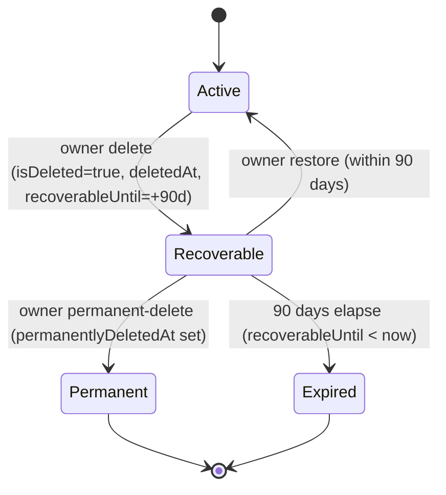

## Overview

Organizations are the tenancy boundary for Propwise CRM. This specification defines how an **organization owner** deletes their workspace, what happens to billing, sessions, real-time connections, and background processing, and how the workspace can be **restored by the owner within a 90-day window** or **permanently removed** earlier.

<Info>
**Status:** Fully implemented (data model, service pipeline, HTTP endpoints, AuthGuard hard-stop, free-org cap, org picker, Danger Zone, cross-module WebSocket disconnect, Meta pause/resume, lifecycle event system)

**Module paths:** `src/modules/organization/`, `src/modules/subscription/`, `src/modules/auth/services/session.service.ts`, `src/modules/messaging/`, `src/modules/notification/`, `src/modules/crm/escalation/`, `src/modules/crm/distribution/`
</Info>

### Key capabilities

Deletion is a **reversible soft delete**. The organization row stays in the database with `isDeleted = true` and all CRM data intact. There is **no automated hard purge** in this phase.

<CardGroup cols={2}>
  <Card title="Access revocation" icon="ban">
    All org-scoped sessions revoked immediately; no API call succeeds for that org after delete
  </Card>
  <Card title="90-day recovery" icon="clock-rotate-left">
    Owner can restore via self-service within 90 days or permanently delete immediately
  </Card>
  <Card title="Member removal" icon="user-slash">
    Non-owner members lose access entirely and receive removal notifications
  </Card>
  <Card title="Billing automation" icon="credit-card">
    Paid subscriptions stop auto-renewal at period end; free orgs skip Stripe
  </Card>
</CardGroup>

The lifecycle is driven by a single boolean (`isDeleted`) plus four lifecycle timestamps. There is **no separate `status` enum** — this matches the existing `isDeleted: false` queries across the codebase and avoids syncing two fields.

## Product decisions

<Note>
These product decisions are **locked** and drive all implementation details below.
</Note>

<AccordionGroup>
  <Accordion title="Who can delete">
    **Organization owner only** — `organization.owner_id` must match the authenticated user. Endpoint also requires RBAC **`system.owner`** (`OrgPermissionKey.SYSTEM_OWNER`) for defense in depth. **Not** system admin via product settings, **not** org Admin (`system.admin` alone is insufficient).
  </Accordion>

  <Accordion title="Recovery (owner)">
    **Self-service** — the owner can **Restore** within **90 days** or **Permanently delete** immediately, both from the org picker. Beyond 90 days (Expired) or after Permanent-delete, owner self-service restore is disabled.
  </Accordion>

  <Accordion title="Recovery (system admin)">
    The **system admin dashboard** lists deleted organizations and can **Restore** them with **no 90-day limit** (Recoverable, Expired, or Permanent — the row is always retained), and can **Delete** any organization using the same full pipeline as the owner flow. This replaces the manual SQL runbook as the primary recovery mechanism.
  </Accordion>

  <Accordion title="Billing on delete">
    **Cancel at period end** — `cancelSubscription(organizationId, userId, immediate = false)`. Paid orgs stop auto-renewal at the current period end. **Free orgs** (no `stripeSubscriptionId`): skip Stripe; no error. On restore, resume auto-renewal **only if** the Stripe subscription is still alive.
  </Accordion>

  <Accordion title="Data after delete">
    **Soft delete only** — `isDeleted = true` plus lifecycle timestamps (`deletedAt`, `deletedBy`, `recoverableUntil`, `permanentlyDeletedAt`). **No** hard purge, **no** `status` column. Permanent-delete keeps the row (`isDeleted` stays `true`) and only sets `permanentlyDeletedAt`.
  </Accordion>

  <Accordion title="Session handling">
    Revoke **all org-scoped sessions** immediately after the delete transaction commits, with reason `ORG_ACCESS_REVOKED`. Restore does **not** un-revoke sessions; the owner re-selects the org to get fresh sessions.
  </Accordion>

  <Accordion title="Real-time and background">
    **Balanced immediate teardown** — disconnect live WebSocket clients in the org rooms cluster-wide, pause + unsubscribe Meta/WhatsApp webhooks (keeping tokens), and exclude the org from all cron/queue dispatchers. Queued jobs are **not** purged; a shared "is org active" guard makes in-flight/queued jobs no-op. Restore re-includes the org and re-subscribes Meta.
  </Accordion>

  <Accordion title="Owner visibility">
    The owner **still sees** the deleted org in the picker for 90 days (non-enterable), with Restore + Permanent-delete actions. All other members and all APIs treat it as gone.
  </Accordion>

  <Accordion title="Free-org slot">
    A **Recoverable** org **still occupies** the owner's free slot. **Permanent** or **Expired** frees the slot.
  </Accordion>

  <Accordion title="Member UX">
    Notify non-owner members via the existing **`REMOVED_FROM_ORGANIZATION`** notification type (same pattern as `UserService.removeFromOrganization`).
  </Accordion>
</AccordionGroup>

## Lifecycle states

The four named states (Active / Recoverable / Permanent / Expired) are **computed at query time** from `isDeleted`, `permanentlyDeletedAt`, and `recoverableUntil` — there is **no cron** that mutates state on the 90-day boundary.

### State machine



### State definitions

| State | Condition | Owner picker | Members / APIs | Free slot | Self-service restore | Background jobs |
|-------|-----------|--------------|----------------|-----------|---------------------|-----------------|
| **Active** | `isDeleted = false` | Visible + enterable | Visible per RBAC | Occupied | n/a | Eligible |
| **Recoverable** | `isDeleted = true` AND `permanentlyDeletedAt IS NULL` AND `recoverableUntil >= now` | Visible, **not enterable**, shows Restore + Permanent-delete | Hidden everywhere | **Occupied** | **Allowed** | Excluded |
| **Permanent** | `isDeleted = true` AND `permanentlyDeletedAt IS NOT NULL` | Hidden | Hidden | **Freed** | Disabled (support SQL only) | Excluded |
| **Expired** | `isDeleted = true` AND `permanentlyDeletedAt IS NULL` AND `recoverableUntil < now` | Hidden | Hidden | **Freed** | Disabled (support SQL only) | Excluded |

<Warning>
**Invariants:**

- When `isDeleted = false`: `deletedAt`, `deletedBy`, `recoverableUntil`, `permanentlyDeletedAt` MUST all be `NULL`.
- When `isDeleted = true`: `deletedAt` and `recoverableUntil` SHOULD be set. `permanentlyDeletedAt` is set only on permanent-delete.
- The 90-day boundary is evaluated **at read time** (`recoverableUntil >= now`). No cron flips Recoverable → Expired.
</Warning>

## Data model

### Organization entity fields

```typescript
@Entity('organizations')
export class Organization {
  // Existing fields...
  
  @Column({ name: 'is_deleted', type: 'boolean', default: false })
  isDeleted: boolean;

  @Column({ name: 'deleted_at', type: 'timestamp with time zone', nullable: true })
  deletedAt: Date | null;

  @Column({ name: 'deleted_by', type: 'uuid', nullable: true })
  deletedBy: string | null;

  @Column({ name: 'recoverable_until', type: 'timestamp with time zone', nullable: true })
  recoverableUntil: Date | null;

  @Column({ name: 'permanently_deleted_at', type: 'timestamp with time zone', nullable: true })
  permanentlyDeletedAt: Date | null;

  @ManyToOne(() => User)
  @JoinColumn({ name: 'deleted_by' })
  deletedByUser?: User;
}
```

### Migration

<CodeGroup>
```sql PostgreSQL
ALTER TABLE organizations
  ADD COLUMN is_deleted BOOLEAN NOT NULL DEFAULT FALSE,
  ADD COLUMN deleted_at TIMESTAMP WITH TIME ZONE,
  ADD COLUMN deleted_by UUID REFERENCES users(id) ON DELETE SET NULL,
  ADD COLUMN recoverable_until TIMESTAMP WITH TIME ZONE,
  ADD COLUMN permanently_deleted_at TIMESTAMP WITH TIME ZONE;

CREATE INDEX idx_organizations_is_deleted ON organizations(is_deleted);
CREATE INDEX idx_organizations_deleted_at ON organizations(deleted_at);
CREATE INDEX idx_organizations_recoverable_until ON organizations(recoverable_until);
```
</CodeGroup>

### DTOs

<Tabs>
  <Tab title="OrganizationResponseDto">
```typescript
export class OrganizationResponseDto {
  // Existing fields...
  
  @ApiProperty({ description: 'Whether the organization is deleted', example: false })
  isDeleted: boolean;

  @ApiProperty({ 
    description: 'When the organization was deleted', 
    type: 'string', 
    format: 'date-time', 
    nullable: true 
  })
  deletedAt: string | null;

  @ApiProperty({ 
    description: 'Computed lifecycle state', 
    enum: ['active', 'pending_deletion', 'permanently_deleted', 'expired'] 
  })
  lifecycleState: 'active' | 'pending_deletion' | 'permanently_deleted' | 'expired';

  @ApiProperty({ 
    description: 'Date until which the organization can be restored', 
    type: 'string', 
    format: 'date-time', 
    nullable: true 
  })
  recoverableUntil: string | null;
}
```
  </Tab>
  
  <Tab title="AdminOrganizationDto">
```typescript
export class AdminOrganizationDto {
  // Existing fields...
  
  @ApiProperty({ 
    description: 'Computed lifecycle state', 
    enum: ['active', 'recoverable', 'expired', 'permanently_deleted'] 
  })
  lifecycleState: 'active' | 'recoverable' | 'expired' | 'permanently_deleted';

  @ApiProperty({ type: 'string', format: 'date-time', nullable: true })
  deletedAt: string | null;

  @ApiProperty({ type: 'string', format: 'date-time', nullable: true })
  recoverableUntil: string | null;

  @ApiProperty({ type: 'string', format: 'date-time', nullable: true })
  permanentlyDeletedAt: string | null;

  @ApiProperty({ 
    type: 'object', 
    nullable: true,
    properties: {
      id: { type: 'string', format: 'uuid' },
      name: { type: 'string' }
    }
  })
  deletedBy: { id: string; name: string } | null;
}
```
  </Tab>
</Tabs>

## Owner-initiated deletion flow

<Steps>
  <Step title="Pre-flight validation">
    - Verify authenticated user is the organization owner (`organization.owner_id`)
    - Check RBAC permission `system.owner` (OrgPermissionKey.SYSTEM_OWNER)
    - Verify organization is not already deleted (`isDeleted = false`)
  </Step>

  <Step title="Database transaction">
    ```typescript
    await queryRunner.manager.update(Organization, organizationId, {
      isDeleted: true,
      deletedAt: new Date(),
      deletedBy: userId,
      recoverableUntil: add(new Date(), { days: 90 }),
      permanentlyDeletedAt: null, // Only set on explicit permanent-delete
    });
    ```
  </Step>

  <Step title="Billing cancellation">
    - If `stripeSubscriptionId` exists: call `cancelSubscription(organizationId, userId, immediate: false)`
    - Free orgs: skip Stripe entirely
    - Non-blocking: log error if Stripe fails but continue deletion
  </Step>

  <Step title="Session revocation">
    ```typescript
    await sessionService.revokeAllOrgSessions(
      organizationId,
      SessionRevocationReason.ORG_ACCESS_REVOKED
    );
    ```
    - Revokes all sessions where `session.organization_id = organizationId`
    - Sets `revoked_at`, `revoked_reason`, `revoked_by`
    - Clears from Redis cache (`sess:${sessionId}`)
  </Step>

  <Step title="Clear selected organization">
    ```typescript
    await userService.clearSelectedOrganization(organizationId);
    ```
    - Sets `user.selected_organization_id = NULL` for all users with this org selected
  </Step>

  <Step title="Emit lifecycle event">
    ```typescript
    this.eventEmitter.emit(
      ORGANIZATION_EVENTS.DELETED,
      new OrganizationDeletedEvent(organizationId, userId, notificationReason)
    );
    ```
  </Step>

  <Step title="Real-time teardown (async listeners)">
    - **WebSocket disconnect**: Cross-instance cluster-wide disconnect for all clients in org rooms
    - **Meta/WhatsApp pause**: Pause all channel accounts, unsubscribe webhooks (keep tokens)
    - **Notification dispatch**: Send `REMOVED_FROM_ORGANIZATION` to all non-owner members
  </Step>
</Steps>

<Check>
After deletion commits, the org is in **Recoverable** state for 90 days. The owner sees it in the picker (non-enterable) with **Restore** and **Permanently delete** actions.
</Check>

## Restore flow

### Owner self-service restore

<Note>
Available **only** while the org is in **Recoverable** state (`recoverableUntil >= now` and `permanentlyDeletedAt IS NULL`).
</Note>

<Steps>
  <Step title="Pre-flight validation">
    - Verify authenticated user is the organization owner
    - Verify org is in Recoverable state (not Expired or Permanent)
    - Check window: `organization.recoverableUntil >= now`
  </Step>

  <Step title="Database transaction">
    ```typescript
    await queryRunner.manager.update(Organization, organizationId, {
      isDeleted: false,
      deletedAt: null,
      deletedBy: null,
      recoverableUntil: null,
      permanentlyDeletedAt: null,
    });
    ```
  </Step>

  <Step title="Billing resumption">
    - If Stripe subscription still exists and is `canceled`: call `resumeSubscription(subscriptionId)`
    - If subscription deleted or expired: no-op (user must re-subscribe manually)
    - Free orgs: skip Stripe
  </Step>

  <Step title="Emit lifecycle event">
    ```typescript
    this.eventEmitter.emit(
      ORGANIZATION_EVENTS.RESTORED,
      new OrganizationRestoredEvent(organizationId, userId)
    );
    ```
  </Step>

  <Step title="Real-time reactivation (async listeners)">
    - **Meta/WhatsApp resume**: Re-subscribe all channel accounts to webhooks
    - **Background jobs**: Org becomes eligible for cron/queue dispatchers
    - **WebSockets**: No automatic reconnection; users must refresh/re-enter org
  </Step>
</Steps>

<Warning>
Restore does **not** un-revoke sessions. The owner must re-select the organization to get fresh sessions. All members must re-authenticate or refresh their org selection.
</Warning>

### System admin restore

<Info>
System admins can restore organizations with **no 90-day limit** via the admin dashboard. This works for Recoverable, Expired, and Permanent states.
</Info>

The restore flow is identical to owner self-service, but called via:

```http
POST /v1/system-admin/organizations/:id/restore
Authorization: Bearer {systemAdminToken}
```

The service method uses `enforceWindow: false`:

```typescript
await organizationService.restoreOrganizationInternal(
  organizationId,
  userId,
  { enforceWindow: false }
);
```

## Permanent-delete flow

<Warning>
Permanent-delete is **irreversible** via self-service. The organization row is retained with `permanentlyDeletedAt` set. Only system admin dashboard or manual SQL can restore after this point.
</Warning>

<Steps>
  <Step title="Pre-flight validation">
    - Verify authenticated user is the organization owner
    - Verify org is currently deleted (`isDeleted = true`)
    - No window check required (can be called on Recoverable or Expired orgs)
  </Step>

  <Step title="Database update">
    ```typescript
    await this.organizationRepository.update(organizationId, {
      permanentlyDeletedAt: new Date(),
      // isDeleted stays true
      // Other lifecycle fields unchanged
    });
    ```
  </Step>

  <Step title="Free-org slot release">
    The org now counts as **Permanent** and no longer occupies the owner's free-org slot. The owner can immediately create a new free organization.
  </Step>
</Steps>

<Info>
After permanent-delete:
- Org is hidden from owner's picker
- Self-service restore is disabled
- System admin dashboard can still restore (sets `permanentlyDeletedAt = NULL`)
- No data is hard-deleted
</Info>

## Billing behavior

### On deletion

<Tabs>
  <Tab title="Paid organizations">
    <Steps>
      <Step title="Cancel at period end">
        ```typescript
        await subscriptionService.cancelSubscription(
          organizationId,
          userId,
          immediate: false
        );
        ```
        - Stripe subscription set to cancel at `current_period_end`
        - Auto-renewal stops
        - Organization retains paid features until period end
      </Step>

      <Step title="Database update">
        ```typescript
        await this.subscriptionRepository.update(subscriptionId, {
          canceledAt: new Date(),
          canceledBy: userId,
        });
        ```
      </Step>
    </Steps>
  </Tab>

  <Tab title="Free organizations">
    - **Skip Stripe entirely** (no `stripeSubscriptionId`)
    - No billing API calls
    - No error thrown
  </Tab>
</Tabs>

### On restore

<Steps>
  <Step title="Check subscription status">
    ```typescript
    if (organization.stripeSubscriptionId) {
      const subscription = await stripe.subscriptions.retrieve(
        organization.stripeSubscriptionId
      );
      
      if (subscription.status === 'canceled' && subscription.cancel_at_period_end) {
        // Subscription still alive, just scheduled to cancel
        await subscriptionService.resumeSubscription(subscription.id);
      }
    }
    ```
  </Step>

  <Step title="Resume auto-renewal">
    - If subscription is `canceled` but not yet deleted: call Stripe `resume`
    - If subscription already deleted or expired: no-op (user must manually re-subscribe)
  </Step>
</Steps>

<Note>
Billing resumption is **non-blocking**. If Stripe fails, log the error but complete the restore. The user can manually fix billing afterward.
</Note>

## Sessions and access

### Session revocation on delete

<Steps>
  <Step title="Identify org-scoped sessions">
    ```sql
    SELECT id FROM sessions 
    WHERE organization_id = :organizationId 
    AND revoked_at IS NULL;
    ```
  </Step>

  <Step title="Revoke in database">
    ```typescript
    await sessionRepository.update(
      { organization_id: organizationId, revoked_at: IsNull() },
      {
        revoked_at: new Date(),
        revoked_reason: SessionRevocationReason.ORG_ACCESS_REVOKED,
        revoked_by: userId,
      }
    );
    ```
  </Step>

  <Step title="Clear Redis cache">
    ```typescript
    for (const sessionId of sessionIds) {
      await redis.del(`sess:${sessionId}`);
    }
    ```
  </Step>
</Steps>

### AuthGuard hard-stop

<Warning>
The `OrganizationContextGuard` explicitly rejects deleted organizations on every request.
</Warning>

```typescript
// OrganizationContextGuard.canActivate()
if (organization.isDeleted) {
  throw new ForbiddenException('Organization is deleted');
}
```

This check occurs:
1. **On cache miss** (liveness validation forces database read)
2. **For legacy tokens** without `orgSessionId` (immediate bypass query)

<Check>
After deletion, **no** org-scoped API call can succeed for that organization, even if:
- The session token is still valid (but revoked)
- The user has cached data
- Background jobs are in-flight
</Check>

## Member notifications

Non-owner members receive removal notifications via the existing `REMOVED_FROM_ORGANIZATION` notification type.

<Steps>
  <Step title="Identify non-owner members">
    ```typescript
    const members = await userOrganizationRepository.find({
      where: { 
        organizationId,
        userId: Not(organization.ownerId)
      },
      relations: ['user']
    });
    ```
  </Step>

  <Step title="Create notifications">
    ```typescript
    for (const member of members) {
      await notificationService.create({
        userId: member.userId,
        type: NotificationType.REMOVED_FROM_ORGANIZATION,
        data: {
          organizationId,
          organizationName: organization.name,
          reason: notificationReason, // 'deleted' or 'removed'
        },
      });
    }
    ```
  </Step>

  <Step title="Clear selected organization">
    ```typescript
    await userRepository.update(
      { 
        id: In(memberIds),
        selectedOrganizationId: organizationId 
      },
      { selectedOrganizationId: null }
    );
    ```
  </Step>
</Steps>

<Info>
**Notification copy:**

Subject: "You've been removed from {organizationName}"

Body: "You no longer have access to {organizationName}. If you think this is a mistake, please contact the organization owner."
</Info>

## Background jobs and cron

### Exclusion strategy

All background job dispatchers and cron schedulers must filter out deleted organizations.

<Tabs>
  <Tab title="Escalation cron">
```typescript
// src/modules/crm/escalation/escalation.service.ts
async dispatchEscalationChecks() {
  const orgs = await this.organizationRepository.find({
    where: { 
      isDeleted: false,
      // Additional active filters...
    }
  });
  
  for (const org of orgs) {
    await this.queue.add('check-escalations', { organizationId: org.id });
  }
}
```
  </Tab>

  <Tab title="Distribution round-robin">
```typescript
// src/modules/crm/distribution/distribution.service.ts
async distributeLeads() {
  const orgs = await this.organizationRepository.find({
    where: { 
      isDeleted: false,
      hasDistributionEnabled: true
    }
  });
  
  for (const org of orgs) {
    await this.distributionQueue.add('round-robin', { organizationId: org.id });
  }
}
```
  </Tab>

  <Tab title="Job processor guard">
```typescript
// Shared guard for in-flight jobs
async processJob(job: Job<{ organizationId: string }>) {
  const org = await this.organizationRepository.findOne({
    where: { id: job.data.organizationId }
  });
  
  if (!org || org.isDeleted) {
    this.logger.warn(
      `Skipping job ${job.id} for deleted org ${job.data.organizationId}`
    );
    return; // No-op
  }
  
  // Process job normally...
}
```
  </Tab>
</Tabs>

<Warning>
**Do not purge queued jobs** on deletion. Use the no-op guard pattern instead. This prevents race conditions where a job is queued, org deleted, and job fails loudly.
</Warning>

### Jobs affected

<AccordionGroup>
  <Accordion title="Escalation checks">
    - **Module:** `src/modules/crm/escalation/`
    - **Cron:** Every 5 minutes
    - **Fix:** Filter `isDeleted: false` in `dispatchEscalationChecks()`
  </Accordion>

  <Accordion title="Distribution round-robin">
    - **Module:** `src/modules/crm/distribution/`
    - **Cron:** Every 1 minute
    - **Fix:** Filter `isDeleted: false` in `distributeLeads()`
  </Accordion>

  <Accordion title="Account health scoring">
    - **Module:** `src/modules/crm/account/`
    - **Cron:** Daily
    - **Fix:** Filter `isDeleted: false` in `scoreAccounts()`
  </Accordion>

  <Accordion title="Window expiry notifications">
    - **Module:** `src/modules/notification/`
    - **Cron:** Hourly
    - **Fix:** Filter `isDeleted: false` in `checkWindowExpiries()`
  </Accordion>

  <Accordion title="Portal data syndication">
    - **Module:** `src/modules/portal/`
    - **Queue:** On-demand
    - **Fix:** Add org liveness guard in `syncPortalData()` processor
  </Accordion>

  <Accordion title="Reminder orphan recovery">
    - **Module:** `src/modules/reminder/`
    - **Cron:** Daily
    - **Fix:** Filter `isDeleted: false` in `recoverOrphanReminders()`
  </Accordion>
</AccordionGroup>

## Real-time teardown

### WebSocket disconnect

<Steps>
  <Step title="Event listener registration">
    ```typescript
    // src/modules/messaging/messaging.gateway.ts
    @OnEvent(ORGANIZATION_EVENTS.DELETED)
    async handleOrganizationDeleted(event: OrganizationDeletedEvent) {
      await this.disconnectOrgClients(event.organizationId);
    }
    ```
  </Step>

  <Step title="Cluster-wide disconnect">
    ```typescript
    async disconnectOrgClients(organizationId: string) {
      // Get all rooms for this org
      const orgRooms = [
        `org:${organizationId}`,
        `org:${organizationId}:leads`,
        `org:${organizationId}:contacts`,
        // ... other room patterns
      ];
      
      // PostgresIoAdapter handles cross-instance coordination
      for (const room of orgRooms) {
        const sockets = await this.server.in(room).fetchSockets();
        for (const socket of sockets) {
          socket.disconnect(true);
        }
      }
    }
    ```
  </Step>

  <Step title="Client-side handling">
    Frontend receives disconnect event and:
    - Shows toast: "Organization has been deleted"
    - Clears org-scoped state
    - Redirects to org selection page
  </Step>
</Steps>

<Check>
The `PostgresIoAdapter` (enabled in `main.ts`) ensures disconnects propagate across all server instances in the cluster.
</Check>

### Meta/WhatsApp webhook teardown

<Steps>
  <Step title="Event listener registration">
    ```typescript
    // src/modules/messaging/services/meta-webhook.service.ts
    @OnEvent(ORGANIZATION_EVENTS.DELETED)
    async handleOrganizationDeleted(event: OrganizationDeletedEvent) {
      await this.pauseOrgChannels(event.organizationId);
    }
    ```
  </Step>

  <Step title="Pause and unsubscribe">
    ```typescript
    async pauseOrgChannels(organizationId: string) {
      const channels = await this.channelAccountRepository.find({
        where: { 
          organizationId,
          provider: 'meta',
          status: 'active'
        }
      });
      
      for (const channel of channels) {
        // Unsubscribe from Meta webhooks
        await this.metaApi.unsubscribeWebhooks(channel.phoneNumberId);
        
        // Mark paused in database
        await this.channelAccountRepository.update(channel.id, {
          status: 'paused',
          pausedAt: new Date(),
          pauseReason: 'org_deleted'
        });
      }
    }
    ```
  </Step>

  <Step title="Token retention">
    <Info>
    **Do not delete** Meta access tokens or phone number IDs. Keep them for restore flow.
    </Info>
  </Step>
</Steps>

### Restore reactivation

<Steps>
  <Step title="Event listener registration">
    ```typescript
    @OnEvent(ORGANIZATION_EVENTS.RESTORED)
    async handleOrganizationRestored(event: OrganizationRestoredEvent) {
      await this.resumeOrgChannels(event.organizationId);
    }
    ```
  </Step>

  <Step title="Resume and re-subscribe">
    ```typescript
    async resumeOrgChannels(organizationId: string) {
      const channels = await this.channelAccountRepository.find({
        where: { 
          organizationId,
          status: 'paused',
          pauseReason: 'org_deleted'
        }
      });
      
      for (const channel of channels) {
        // Re-subscribe to Meta webhooks
        await this.metaApi.subscribeWebhooks(channel.phoneNumberId);
        
        // Mark active in database
        await this.channelAccountRepository.update(channel.id, {
          status: 'active',
          pausedAt: null,
          pauseReason: null
        });
      }
    }
    ```
  </Step>
</Steps>

## Stripe webhooks

Stripe webhooks for deleted organizations are handled gracefully:

<Tabs>
  <Tab title="Subscription updated">
```typescript
// src/modules/subscription/webhooks/subscription-updated.handler.ts
async handle(event: Stripe.Event) {
  const subscription = event.data.object as Stripe.Subscription;
  const org = await this.organizationRepository.findOne({
    where: { stripeSubscriptionId: subscription.id },
    withDeleted: true, // Include deleted orgs
  });
  
  if (!org) {
    this.logger.warn(`Subscription ${subscription.id} has no org`);
    return;
  }
  
  if (org.isDeleted) {
    this.logger.info(
      `Ignoring webhook for deleted org ${org.id}, subscription ${subscription.id}`
    );
    return; // No-op
  }
  
  // Process webhook normally...
}
```
  </Tab>

  <Tab title="Invoice payment failed">
```typescript
async handle(event: Stripe.Event) {
  const invoice = event.data.object as Stripe.Invoice;
  const org = await this.findOrgByStripeCustomerId(invoice.customer);
  
  if (!org || org.isDeleted) {
    this.logger.info(`Ignoring invoice webhook for deleted org`);
    return;
  }
  
  // Process webhook normally...
}
```
  </Tab>
</Tabs>

<Note>
All Stripe webhook handlers must:
1. Use `withDeleted: true` to find the organization
2. Check `org.isDeleted` and no-op if true
3. Log at `info` level (not `warn` or `error`) to avoid false alarms
</Note>

## Free organization ownership cap

Owners are limited to owning **one free organization** at a time. The cap is enforced at creation time.

### Counting logic

```typescript
// src/modules/organization/organization.service.ts
async countOwnedFreeOrganizations(userId: string): Promise<number> {
  const count = await this.organizationRepository.count({
    where: {
      ownerId: userId,
      plan: 'free',
      // Include both Active and Recoverable orgs
      // (isDeleted: false OR (isDeleted: true AND permanentlyDeletedAt IS NULL))
    },
    filters: false, // Disable global isDeleted filter
  });
  
  // Manual predicate to include Recoverable orgs
  const orgs = await this.organizationRepository.find({
    where: { ownerId: userId, plan: 'free' },
    filters: false,
  });
  
  return orgs.filter(org => 
    !org.isDeleted || 
    (org.isDeleted && !org.permanentlyDeletedAt)
  ).length;
}
```

<Warning>
**Critical:** A **Recoverable** org (deleted but within 90 days) **still occupies** the owner's free slot. Only **Permanent** or **Expired** orgs free the slot.
</Warning>

### Enforcement

<Steps>
  <Step title="On organization creation">
    ```typescript
    if (plan === 'free') {
      const ownedFreeCount = await this.countOwnedFreeOrganizations(userId);
      if (ownedFreeCount >= FREE_ORG_CAP) {
        throw new ForbiddenException(
          'You can only own one free organization. Please upgrade an existing org or permanently delete it.'
        );
      }
    }
    ```
  </Step>

  <Step title="Error message">
    <Info>
    **User-facing copy:**
    
    "You can only own one free organization at a time. To create a new one, either upgrade your current organization to a paid plan or permanently delete it from the organization picker."
    </Info>
  </Step>
</Steps>

## API contract

### Delete organization

```http
DELETE /v1/organizations/:id
Authorization: Bearer {orgScopedToken}
```

<Tabs>
  <Tab title="Request">
    **Path parameters:**
    - `id` (string, uuid): Organization ID
    
    **Headers:**
    - `Authorization`: Org-scoped JWT token
    
    **Requirements:**
    - Authenticated user must be the organization owner
    - User must have `system.owner` permission
    - Organization must not already be deleted
  </Tab>

  <Tab title="Response 200">
```json
{
  "id": "550e8400-e29b-41d4-a716-446655440000",
  "name": "Acme Real Estate",
  "isDeleted": true,
  "deletedAt": "2024-01-15T10:30:00Z",
  "recoverableUntil": "2024-04-15T10:30:00Z",
  "lifecycleState": "pending_deletion"
}
```
  </Tab>

  <Tab title="Errors">
```json
// 403 Forbidden - Not owner
{
  "statusCode": 403,
  "message": "Only the organization owner can delete the organization"
}

// 403 Forbidden - Already deleted
{
  "statusCode": 403,
  "message": "Organization is already deleted"
}

// 403 Forbidden - Missing permission
{
  "statusCode": 403,
  "message": "Insufficient permissions"
}
```
  </Tab>
</Tabs>

### Restore organization

```http
POST /v1/organizations/:id/restore
Authorization: Bearer {identityToken}
```

<Warning>
This endpoint requires an **identity-scoped token** (not org-scoped) because the org is deleted and has no valid org sessions.
</Warning>

<Tabs>
  <Tab title="Request">
    **Path parameters:**
    - `id` (string, uuid): Organization ID
    
    **Headers:**
    - `Authorization`: Identity JWT token (uses `@IdentityTokenOnly()` decorator)
    
    **Requirements:**
    - Authenticated user must be the organization owner
    - Organization must be in **Recoverable** state
    - `recoverableUntil >= now`
  </Tab>

  <Tab title="Response 200">
```json
{
  "id": "550e8400-e29b-41d4-a716-446655440000",
  "name": "Acme Real Estate",
  "isDeleted": false,
  "deletedAt": null,
  "recoverableUntil": null,
  "lifecycleState": "active"
}
```
  </Tab>

  <Tab title="Errors">
```json
// 403 Forbidden - Not owner
{
  "statusCode": 403,
  "message": "Only the organization owner can restore the organization"
}

// 403 Forbidden - Recovery window expired
{
  "statusCode": 403,
  "message": "Organization recovery window has expired"
}

// 403 Forbidden - Permanently deleted
{
  "statusCode": 403,
  "message": "Organization has been permanently deleted and cannot be restored"
}
```
  </Tab>
</Tabs>

### Permanently delete organization

```http
POST /v1/organizations/:id/permanent-delete
Authorization: Bearer {identityToken}
```

<Tabs>
  <Tab title="Request">
    **Path parameters:**
    - `id` (string, uuid): Organization ID
    
    **Headers:**
    - `Authorization`: Identity JWT token
    
    **Requirements:**
    - Authenticated user must be the organization owner
    - Organization must be deleted (`isDeleted = true`)
  </Tab>

  <Tab title="Response 200">
```json
{
  "id": "550e8400-e29b-41d4-a716-446655440000",
  "name": "Acme Real Estate",
  "isDeleted": true,
  "deletedAt": "2024-01-15T10:30:00Z",
  "permanentlyDeletedAt": "2024-01-20T14:45:00Z",
  "lifecycleState": "permanently_deleted"
}
```
  </Tab>

  <Tab title="Errors">
```json
// 403 Forbidden - Not owner
{
  "statusCode": 403,
  "message": "Only the organization owner can permanently delete the organization"
}

// 400 Bad Request - Not deleted
{
  "statusCode": 400,
  "message": "Organization must be deleted before it can be permanently deleted"
}
```
  </Tab>
</Tabs>

### System admin endpoints

<Accordion title="List organizations (with deleted)">
```http
GET /v1/system-admin/organizations?includeDeleted=true
Authorization: Bearer {systemAdminToken}
```

**Response:**
```json
{
  "data": [
    {
      "id": "550e8400-e29b-41d4-a716-446655440000",
      "name": "Acme Real Estate",
      "lifecycleState": "recoverable",
      "deletedAt": "2024-01-15T10:30:00Z",
      "recoverableUntil": "2024-04-15T10:30:00Z",
      "permanentlyDeletedAt": null,
      "deletedBy": {
        "id": "user-uuid",
        "name": "John Doe"
      }
    }
  ]
}
```
</Accordion>

<Accordion title="Restore organization (admin)">
```http
POST /v1/system-admin/organizations/:id/restore
Authorization: Bearer {systemAdminToken}
```

**Notes:**
- No 90-day window enforcement
- Works for Recoverable, Expired, and Permanent states
- Uses `enforceWindow: false` internally
</Accordion>

<Accordion title="Delete organization (admin)">
```http
DELETE /v1/system-admin/organizations/:id?markPermanent=true
Authorization: Bearer {systemAdminToken}
```

**Query parameters:**
- `markPermanent` (boolean): If true, sets `permanentlyDeletedAt` immediately

**Notes:**
- Uses the same soft-delete pipeline as owner flow
- If `markPermanent=true`, org goes directly to Permanent state
</Accordion>

## Frontend UX

### Organization picker

<Tabs>
  <Tab title="Active organizations">
    - Show all Active orgs the user is a member of
    - Clicking an org navigates to the workspace
  </Tab>

  <Tab title="Recoverable organizations (owner only)">
    - Show orgs in **Recoverable** state with:
      - Org name + "Pending deletion" badge
      - Days remaining until expiry
      - **Cannot click to enter**
    - Hover/click shows actions:
      - **Restore** button (primary)
      - **Permanently delete** button (danger)
  </Tab>

  <Tab title="Permanent/Expired (owner)">
    - Hidden from picker entirely
    - Owner must contact support or use admin dashboard
  </Tab>
</Tabs>

### Settings Danger Zone

<Steps>
  <Step title="Navigate to settings">
    Organization Settings → Security → Danger Zone
  </Step>

  <Step title="Delete button">
    - Red button: "Delete organization"
    - Only visible to organization owner
    - Opens confirmation modal
  </Step>

  <Step title="Confirmation modal">
    <Warning>
    **Title:** Delete organization
    
    **Body:** This will immediately revoke access for all members and cancel your subscription. You can restore the organization within 90 days, or permanently delete it immediately.
    
    **Input:** Type the organization name to confirm
    
    **Buttons:**
    - Cancel (secondary)
    - Delete (danger, disabled until name matches)
    </Warning>
  </Step>

  <Step title="Success state">
    - Toast: "Organization deleted. You can restore it within 90 days from the organization picker."
    - Redirect to organization selection page
    - Org shows in picker with "Pending deletion" badge
  </Step>
</Steps>

### Restore UX

<Steps>
  <Step title="Org picker hover">
    Hover over recoverable org shows:
    - **Restore** button (primary)
    - "X days remaining" counter
  </Step>

  <Step title="Confirmation modal">
    <Info>
    **Title:** Restore organization
    
    **Body:** This will reactivate the organization and restore access for all members. If you had a paid subscription, billing will resume.
    
    **Buttons:**
    - Cancel
    - Restore (primary)
    </Info>
  </Step>

  <Step title="Success state">
    - Toast: "Organization restored successfully"
    - Org becomes clickable in picker
    - User can enter workspace
  </Step>
</Steps>

### Permanent-delete UX

<Steps>
  <Step title="Org picker context menu">
    Right-click or kebab menu on recoverable org shows:
    - Restore (primary)
    - **Permanently delete** (danger)
  </Step>

  <Step title="Confirmation modal">
    <Warning>
    **Title:** Permanently delete organization
    
    **Body:** This action cannot be undone via self-service. The organization will be hidden and will not count against your free organization limit. System administrators may still be able to restore it.
    
    **Input:** Type "PERMANENTLY DELETE" to confirm
    
    **Buttons:**
    - Cancel
    - Permanently delete (danger, disabled until phrase matches)
    </Warning>
  </Step>

  <Step title="Success state">
    - Toast: "Organization permanently deleted"
    - Org removed from picker
    - Free-org slot freed (if applicable)
  </Step>
</Steps>

## Recovery beyond the window

<Note>
For organizations in **Expired** or **Permanent** state, recovery requires system administrator intervention via the admin dashboard.
</Note>

### System admin dashboard flow

<Steps>
  <Step title="Navigate to admin dashboard">
    System Admin → Organizations → Filter: "Show deleted"
  </Step>

  <Step title="Locate organization">
    - Search by organization name or ID
    - Deleted orgs show lifecycle state badge (Recoverable / Expired / Permanent)
  </Step>

  <Step title="Restore action">
    - Click organization row
    - Click "Restore organization" button
    - Confirmation modal (no 90-day check)
  </Step>

  <Step title="Backend restoration">
    ```typescript
    await organizationService.restoreOrganizationInternal(
      organizationId,
      adminUserId,
      { enforceWindow: false }
    );
    ```
    - Clears all lifecycle fields
    - Sets `isDeleted = false`
    - Re-subscribes Meta webhooks
  </Step>
</Steps>

### Manual SQL recovery (deprecated)

<Warning>
The SQL runbook below is **deprecated** in favor of the system admin dashboard. Use only if the dashboard is unavailable.
</Warning>

<Accordion title="SQL runbook (emergency only)">
```sql
-- 1. Verify organization state
SELECT 
  id, 
  name, 
  is_deleted, 
  deleted_at, 
  recoverable_until, 
  permanently_deleted_at,
  CASE
    WHEN NOT is_deleted THEN 'active'
    WHEN permanently_deleted_at IS NOT NULL THEN 'permanently_deleted'
    WHEN recoverable_until >= NOW() THEN 'recoverable'
    ELSE 'expired'
  END as lifecycle_state
FROM organizations
WHERE id = 'org-uuid';

-- 2. Restore organization
UPDATE organizations
SET 
  is_deleted = FALSE,
  deleted_at = NULL,
  deleted_by = NULL,
  recoverable_until = NULL,
  permanently_deleted_at = NULL
WHERE id = 'org-uuid';

-- 3. Verify restoration
SELECT * FROM organizations WHERE id = 'org-uuid';
```

**Post-SQL steps:**
1. Notify backend engineers to manually trigger Meta webhook re-subscription
2. Ask owner to log out and log back in
3. Verify billing status in Stripe dashboard
</Accordion>

## System admin dashboard

The system admin dashboard provides full lifecycle management for all organizations, including those beyond the 90-day recovery window.

### List organizations

<CodeGroup>
```typescript Query
GET /v1/system-admin/organizations?includeDeleted=true&lifecycleState=recoverable
```

```typescript Response
{
  "data": [
    {
      "id": "550e8400-e29b-41d4-a716-446655440000",
      "name": "Acme Real Estate",
      "ownerId": "user-uuid",
      "ownerName": "John Doe",
      "plan": "professional",
      "lifecycleState": "recoverable",
      "deletedAt": "2024-01-15T10:30:00Z",
      "recoverableUntil": "2024-04-15T10:30:00Z",
      "permanentlyDeletedAt": null,
      "deletedBy": {
        "id": "user-uuid",
        "name": "John Doe"
      }
    }
  ],
  "pagination": {
    "page": 1,
    "limit": 20,
    "total": 1
  }
}
```
</CodeGroup>

### Filter options

<CardGroup cols={2}>
  <Card title="Lifecycle state" icon="filter">
    - `active`
    - `recoverable`
    - `expired`
    - `permanently_deleted`
  </Card>
  <Card title="Plan type" icon="layer-group">
    - `free`
    - `professional`
    - `enterprise`
  </Card>
  <Card title="Date ranges" icon="calendar">
    - `deletedAfter`
    - `deletedBefore`
    - `expiringBefore`
  </Card>
  <Card title="Text search" icon="magnifying-glass">
    - Organization name
    - Owner name
    - Organization ID
  </Card>
</CardGroup>

### Organization detail view

<Steps>
  <Step title="Open organization">
    Click any organization row to open detail modal
  </Step>

  <Step title="View lifecycle timeline">
    Shows chronological history:
    - Created at
    - Deleted at (if deleted)
    - Recoverable until (if recoverable)
    - Permanently deleted at (if permanent)
  </Step>

  <Step title="Available actions">
    Based on lifecycle state:
    - **Active:** Delete (with `markPermanent` option)
    - **Recoverable/Expired/Permanent:** Restore
    - **Any state:** View full organization settings
  </Step>
</Steps>

### Restore action (admin)

<Info>
System admins can restore organizations with **no time limit** and **no state restrictions**.
</Info>

```typescript
// Backend service method
async restoreOrganizationInternal(
  organizationId: string,
  userId: string,
  options: { enforceWindow: boolean }
) {
  const org = await this.organizationRepository.findOne({
    where: { id: organizationId },
    filters: false, // Include deleted orgs
  });

  if (!org || !org.isDeleted) {
    throw new BadRequestException('Organization is not deleted');
  }

  // Skip window check if enforceWindow = false (admin path)
  if (options.enforceWindow && org.recoverableUntil < new Date()) {
    throw new ForbiddenException('Recovery window has expired');
  }

  // Restore logic (same for owner and admin)...
}
```

### Delete action (admin)

<Warning>
System admin deletion uses the **same pipeline** as owner deletion, ensuring consistency in billing, sessions, and real-time teardown.
</Warning>

```http
DELETE /v1/system-admin/organizations/:id?markPermanent=true
```

If `markPermanent=true`:
- Sets `permanentlyDeletedAt` immediately
- Org goes directly to **Permanent** state
- Frees owner's free-org slot
- Still visible in admin dashboard

## Explicit non-goals

<Check>
The following are **intentionally not** part of this specification:
</Check>

<AccordionGroup>
  <Accordion title="Automated hard purge">
    - No cron job deletes rows after 90 days
    - Organization rows are **retained forever**
    - Database storage cost is acceptable
  </Accordion>

  <Accordion title="Member-initiated deletion">
    - Only the **organization owner** can delete via product UI
    - Admins (`system.admin`) cannot delete without also being owner
    - System admins use separate admin dashboard
  </Accordion>

  <Accordion title="Granular data retention">
    - No per-module data deletion (e.g., "delete leads but keep contacts")
    - Soft delete is all-or-nothing at the organization level
  </Accordion>

  <Accordion title="Cascading hard deletes">
    - No `ON DELETE CASCADE` for child tables
    - All org-scoped data remains intact (leads, contacts, conversations, etc.)
  </Accordion>

  <Accordion title="Billing proration on restore">
    - No automatic proration if restored mid-billing-cycle
    - User billed for full month if subscription resumes
    - Manual adjustment via Stripe if needed
  </Accordion>

  <Accordion title="Session un-revocation">
    - Restore does **not** un-revoke sessions
    - Users must re-select org to get fresh sessions
  </Accordion>

  <Accordion title="Separate status column">
    - No `status` enum column
    - Lifecycle state is **computed** from `isDeleted` + timestamps
    - Avoids field sync issues
  </Accordion>

  <Accordion title="Queue job purging">
    - Queued jobs are **not** deleted on org deletion
    - In-flight jobs use no-op guard pattern
    - Prevents race conditions and loud failures
  </Accordion>
</AccordionGroup>

## Constants

```typescript
// src/modules/organization/organization.constants.ts

export const ORGANIZATION_LIFECYCLE = {
  // Recovery window duration
  RECOVERY_WINDOW_DAYS: 90,
  
  // Free organization limits
  FREE_ORG_CAP: 1,
  
  // Session revocation reason
  REVOCATION_REASON: 'ORG_ACCESS_REVOKED',
  
  // Notification types
  NOTIFICATION_REASON: {
    DELETED: 'deleted',
    REMOVED: 'removed',
  },
  
  // Lifecycle states (computed, not stored)
  LIFECYCLE_STATE: {
    ACTIVE: 'active',
    RECOVERABLE: 'recoverable',
    PERMANENT: 'permanently_deleted',
    EXPIRED: 'expired',
  },
  
  // WebSocket disconnect grace period (ms)
  DISCONNECT_GRACE_PERIOD: 5000,
  
  // Meta webhook timeout (ms)
  META_WEBHOOK_TIMEOUT: 10000,
} as const;
```

## Testing requirements

### Unit tests

<Tabs>
  <Tab title="OrganizationService">
```typescript
describe('OrganizationService.delete', () => {
  it('should soft delete organization and set lifecycle fields', async () => {
    const result = await service.delete(orgId, ownerId);
    expect(result.isDeleted).toBe(true);
    expect(result.deletedAt).toBeDefined();
    expect(result.recoverableUntil).toBeDefined();
    expect(result.permanentlyDeletedAt).toBeNull();
  });

  it('should reject deletion by non-owner', async () => {
    await expect(
      service.delete(orgId, nonOwnerId)
    ).rejects.toThrow('Only the organization owner');
  });

  it('should skip Stripe for free organizations', async () => {
    const spy = jest.spyOn(subscriptionService, 'cancelSubscription');
    await service.delete(freeOrgId, ownerId);
    expect(spy).not.toHaveBeenCalled();
  });
});
```
  </Tab>

  <Tab title="OrganizationService.restore">
```typescript
describe('OrganizationService.restore', () => {
  it('should restore organization within window', async () => {
    const result = await service.restore(orgId, ownerId);
    expect(result.isDeleted).toBe(false);
    expect(result.deletedAt).toBeNull();
  });

  it('should reject restore beyond window', async () => {
    await expect(
      service.restore(expiredOrgId, ownerId)
    ).rejects.toThrow('Recovery window has expired');
  });

  it('should allow admin restore beyond window', async () => {
    const result = await service.restoreOrganizationInternal(
      expiredOrgId,
      adminId,
      { enforceWindow: false }
    );
    expect(result.isDeleted).toBe(false);
  });
});
```
  </Tab>

  <Tab title="Free-org cap">
```typescript
describe('Free organization cap', () => {
  it('should count recoverable orgs toward cap', async () => {
    await service.delete(freeOrgId, ownerId);
    const count = await service.countOwnedFreeOrganizations(ownerId);
    expect(count).toBe(1);
  });

  it('should not count permanent orgs toward cap', async () => {
    await service.permanentDelete(freeOrgId, ownerId);
    const count = await service.countOwnedFreeOrganizations(ownerId);
    expect(count).toBe(0);
  });

  it('should reject free org creation at cap', async () => {
    await expect(
      service.create({ ...dto, plan: 'free' }, ownerId)
    ).rejects.toThrow('You can only own one free organization');
  });
});
```
  </Tab>
</Tabs>

### Integration tests

<Steps>
  <Step title="End-to-end deletion flow">
```typescript
it('should complete full deletion flow', async () => {
  // 1. Delete organization
  const deleted = await request(app.getHttpServer())
    .delete(`/v1/organizations/${orgId}`)
    .set('Authorization', `Bearer ${ownerToken}`)
    .expect(200);

  // 2. Verify sessions revoked
  await expect(
    request(app.getHttpServer())
      .get('/v1/me')
      .set('Authorization', `Bearer ${orgToken}`)
  ).rejects.toThrow();

  // 3. Verify member notifications
  const notifications = await notificationRepo.find({
    where: { userId: memberId, type: 'REMOVED_FROM_ORGANIZATION' }
  });
  expect(notifications).toHaveLength(1);

  // 4. Verify billing canceled
  const subscription = await stripe.subscriptions.retrieve(subId);
  expect(subscription.cancel_at_period_end).toBe(true);
});
```
  </Step>

  <Step title="WebSocket disconnect">
```typescript
it('should disconnect WebSocket clients on org delete', async () => {
  // Connect socket
  const socket = io(`ws://localhost:3000`, {
    auth: { token: orgToken }
  });
  await waitForEvent(socket, 'connect');

  // Delete org
  await service.delete(orgId, ownerId);

  // Verify disconnect
  await waitForEvent(socket, 'disconnect');
  expect(socket.connected).toBe(false);
});
```
  </Step>

  <Step title="Meta webhook pause">
```typescript
it('should pause Meta webhooks on org delete', async () => {
  const unsubscribeSpy = jest.spyOn(metaApi, 'unsubscribeWebhooks');
  
  await service.delete(orgId, ownerId);
  
  expect(unsubscribeSpy).toHaveBeenCalledWith(phoneNumberId);
  
  const channel = await channelRepo.findOne({ id: channelId });
  expect(channel.status).toBe('paused');
});
```
  </Step>
</Steps>

### E2E tests

<CardGroup cols={2}>
  <Card title="Org picker" icon="list">
    - Active orgs show normally
    - Recoverable org shows with badge
    - Cannot click to enter recoverable org
    - Restore button works
    - Permanent-delete button works
  </Card>
  <Card title="Settings Danger Zone" icon="triangle-exclamation">
    - Delete button visible to owner only
    - Confirmation modal requires name match
    - Success toast + redirect
    - Org appears in picker with badge
  </Card>
  <Card title="Admin dashboard" icon="shield-halved">
    - List shows deleted orgs
    - Filter by lifecycle state works
    - Restore action works (no window check)
    - Delete action works (markPermanent option)
  </Card>
  <Card title="Access revocation" icon="lock">
    - Org-scoped API calls fail immediately
    - WebSocket clients disconnect
    - Member loses org from picker
    - Owner sees org as non-enterable
  </Card>
</CardGroup>

## Implementation checklist

<Steps>
  <Step title="Phase 1: Data model (✅ Complete)">
    - [x] Migration for lifecycle fields
    - [x] Entity fields + validation
    - [x] DTOs (OrganizationResponseDto, AdminOrganizationDto)
    - [x] Computed `lifecycleState` property
  </Step>

  <Step title="Phase 2: Core deletion (✅ Complete)">
    - [x] `softDeleteOrganizationInternal` service method
    - [x] Owner validation + permission check
    - [x] Billing cancel-at-period-end (skip free orgs)
    - [x] Session revocation (`revokeAllOrgSessions`)
    - [x] Clear selected organization
    - [x] `OrganizationDeletedEvent` emission
    - [x] Member notifications (`REMOVED_FROM_ORGANIZATION`)
    - [x] `DELETE /v1/organizations/:id` endpoint
  </Step>

  <Step title="Phase 3: Owner self-service (✅ Complete)">
    - [x] `POST /v1/organizations/:id/restore` endpoint
    - [x] `POST /v1/organizations/:id/permanent-delete` endpoint
    - [x] `@IdentityTokenOnly()` decorator + guard
    - [x] Window enforcement in restore
    - [x] Org picker: show recoverable orgs to owner only
    - [x] Free-org cap: count recoverable orgs
    - [x] AuthGuard: hard-stop on `isDeleted`
  </Step>

  <Step title="Phase 4: Background job exclusion (⚠️ Partial)">
    - [ ] Escalation cron: filter `isDeleted: false`
    - [ ] Distribution cron: filter `isDeleted: false`
    - [ ] Account health cron: filter `isDeleted: false`
    - [ ] Window expiry cron: filter `isDeleted: false`
    - [ ] Portal syndication queue: add liveness guard
    - [ ] Reminder orphan recovery: filter `isDeleted: false`
  </Step>

  <Step title="Phase 5: Real-time teardown (✅ Complete)">
    - [x] WebSocket disconnect on `OrganizationDeletedEvent`
    - [x] Cluster-wide disconnect via `PostgresIoAdapter`
    - [x] Meta webhook pause + unsubscribe
    - [x] Token retention (no deletion)
    - [x] Meta webhook resume on restore
  </Step>

  <Step title="Phase 6: Stripe webhook handling (⚠️ Needs audit)">
    - [ ] Audit all Stripe webhook handlers
    - [ ] Add `withDeleted: true` to org lookups
    - [ ] Add `isDeleted` check + no-op
    - [ ] Test with deleted org
  </Step>

  <Step title="Phase 7: System admin dashboard (✅ Complete)">
    - [x] List deleted orgs (`includeDeleted` query param)
    - [x] Filter by lifecycle state
    - [x] `POST /system-admin/organizations/:id/restore` (no window enforcement)
    - [x] `DELETE /system-admin/organizations/:id?markPermanent=true`
    - [x] Org detail view (read deleted orgs)
    - [x] Lifecycle timeline display
  </Step>

  <Step title="Phase 8: Frontend UX (⚠️ Partial)">
    - [x] Org picker: show recoverable orgs
    - [x] Settings Danger Zone: delete button + modal
    - [x] Restore button in picker
    - [x] Permanent-delete button in picker
    - [ ] Admin dashboard UI
    - [ ] E2E tests
  </Step>

  <Step title="Phase 9: Testing & docs">
    - [ ] Unit tests (95%+ coverage)
    - [ ] Integration tests (deletion + restore flows)
    - [ ] E2E tests (picker, settings, admin dashboard)
    - [ ] Update API docs
    - [ ] Update admin runbook
  </Step>
</Steps>

## Related documentation updates

<CardGroup cols={2}>
  <Card title="API documentation" icon="book">
    - Add lifecycle endpoints to OpenAPI spec
    - Document identity token requirement
    - Add lifecycle state enum docs
  </Card>
  <Card title="Admin runbook" icon="screwdriver-wrench">
    - Deprecate SQL runbook
    - Document admin dashboard recovery flow
    - Add troubleshooting section
  </Card>
  <Card title="Billing documentation" icon="credit-card">
    - Document cancel-at-period-end behavior
    - Explain restore billing resumption
    - Free org slot accounting
  </Card>
  <Card title="WebSocket documentation" icon="tower-broadcast">
    - Document disconnect behavior
    - Explain cluster-wide coordination
    - Client-side reconnection pattern
  </Card>
</CardGroup>

## User-facing copy

###