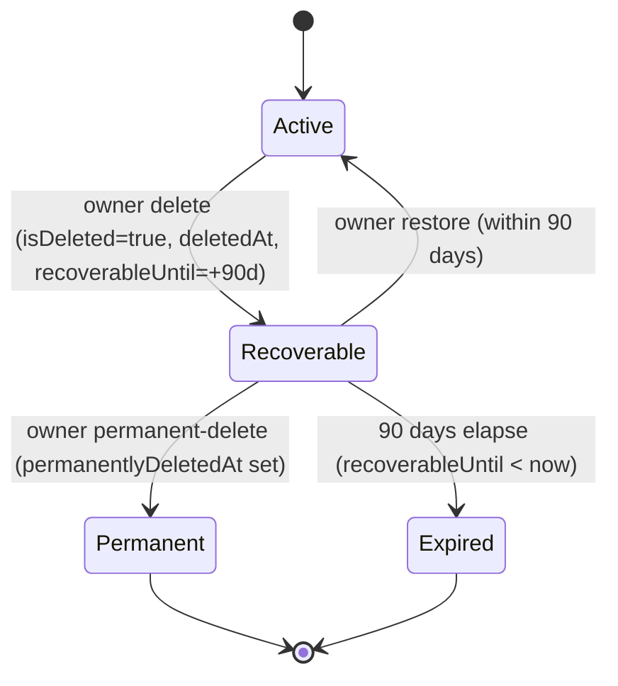

<Info>
**Status:** Fully implemented (data model, service pipeline, HTTP endpoints, AuthGuard hard-stop, free-org cap, org picker, Danger Zone, cross-module WebSocket disconnect, Meta pause/resume, lifecycle event system)

**Module paths:** `src/modules/organization/`, `src/modules/subscription/`, `src/modules/auth/services/session.service.ts`, `src/modules/messaging/`, `src/modules/notification/`, `src/modules/crm/escalation/`, `src/modules/crm/distribution/`

**Related frontend:** `src/components/pages/settings/organization-security-extras.tsx`, `src/components/pages/organization-selection/`, `src/services/api/organization.api.ts`
</Info>

## Overview

Organizations are the tenancy boundary for Propwise CRM. This specification defines how an **organization owner** deletes their workspace, what happens to billing, sessions, real-time connections, and background processing, and how the workspace can be **restored by the owner within a 90-day window** or **permanently removed** earlier.

Deletion is a **reversible soft delete**. The organization row stays in the database with `isDeleted = true` and all CRM data intact. There is **no automated hard purge** in this phase.

The lifecycle is driven by a single boolean (`isDeleted`) plus four lifecycle timestamps. There is **no separate `status` enum** — this matches the existing `isDeleted: false` queries across the codebase and avoids syncing two fields. The four named states (Active / Recoverable / Permanent / Expired) are **computed at query time** from `isDeleted`, `permanentlyDeletedAt`, and `recoverableUntil` — there is **no cron** that mutates state on the 90-day boundary.

<Check>
**What the feature must deliver:**

1. **Immediate access revocation** — all org-scoped sessions revoked; no API call succeeds for that org after delete
2. **Members lose the org entirely** — removed members can log in but never see the deleted org again  
3. **Owner-only 90-day recovery** — only the owner sees the deleted org in picker with Restore and Permanently delete buttons
4. **Slot accounting** — recoverable orgs still occupy the owner's free-organization slot
5. **Immediate teardown + reactivation** — all background services stopped and reactivated on restore
6. **Billing cancel-at-period-end** — paid subscriptions stop auto-renewal at current period end
</Check>

## Product Decisions (Locked)

<AccordionGroup>
<Accordion title="Who can delete">
**Organization owner only** — `organization.owner_id` must match the authenticated user. Endpoint also requires RBAC **`system.owner`** (`OrgPermissionKey.SYSTEM_OWNER`) for defense in depth. **Not** system admin via product settings, **not** org Admin.
</Accordion>

<Accordion title="Recovery options">
**Self-service** — the owner can **Restore** within **90 days** or **Permanently delete** immediately, both from the org picker. Beyond 90 days (Expired) or after Permanent-delete, owner self-service restore is disabled.

The **system admin dashboard** can **Restore** with **no 90-day limit** and **Delete** any organization using the same pipeline as the owner flow.
</Accordion>

<Accordion title="Billing behavior">
**Cancel at period end** — `cancelSubscription(organizationId, userId, immediate = false)`. Paid orgs stop auto-renewal at the current period end. **Free orgs** (no `stripeSubscriptionId`): skip Stripe; no error. On restore, resume auto-renewal **only if** the Stripe subscription is still alive.
</Accordion>

<Accordion title="Data handling">
**Soft delete only** — `isDeleted = true` plus lifecycle timestamps (`deletedAt`, `deletedBy`, `recoverableUntil`, `permanentlyDeletedAt`). **No** hard purge, **no** `status` column. Permanent-delete keeps the row and only sets `permanentlyDeletedAt`.
</Accordion>

<Accordion title="Session management">
Revoke **all org-scoped sessions** immediately after the delete transaction commits, with reason `ORG_ACCESS_REVOKED`. Restore does **not** un-revoke sessions; the owner re-selects the org to get fresh sessions.
</Accordion>

<Accordion title="Real-time teardown">
**Balanced immediate teardown** — disconnect live WebSocket clients in org rooms cluster-wide, pause + unsubscribe Meta/WhatsApp webhooks (keeping tokens), and exclude the org from all cron/queue dispatchers. Queued jobs are **not** purged; a shared "is org active" guard makes in-flight/queued jobs no-op.
</Accordion>
</AccordionGroup>

## Lifecycle States and Soft-Delete Model

### State Machine



### State Reference Table

| State | Condition (computed) | Owner Picker | Members / APIs | Free Slot | Self-service Restore | Background Jobs |
|-------|---------------------|--------------|----------------|-----------|---------------------|-----------------|
| **Active** | `isDeleted = false` | Visible + enterable | Visible per RBAC | Occupied | n/a | Eligible |
| **Recoverable** | `isDeleted = true` AND `permanentlyDeletedAt IS NULL` AND `recoverableUntil >= now` | Visible, **not enterable**, shows Restore + Permanent-delete | Hidden everywhere | **Occupied** | **Allowed** | Excluded |
| **Permanent** | `isDeleted = true` AND `permanentlyDeletedAt IS NOT NULL` | Hidden | Hidden | **Freed** | Disabled (support SQL only) | Excluded |
| **Expired** | `isDeleted = true` AND `permanentlyDeletedAt IS NULL` AND `recoverableUntil < now` | Hidden | Hidden | **Freed** | Disabled (support SQL only) | Excluded |

<Warning>
**Invariants:**
- When `isDeleted = false`: `deletedAt`, `deletedBy`, `recoverableUntil`, `permanentlyDeletedAt` MUST all be `NULL`
- When `isDeleted = true`: `deletedAt` and `recoverableUntil` SHOULD be set
- The 90-day boundary is evaluated **at read time** (`recoverableUntil >= now`). No cron flips Recoverable → Expired
</Warning>

## Data Model

### Organization Entity Fields

```typescript
@Entity('organizations')
export class Organization {
  // Existing fields...
  
  @Column({ name: 'is_deleted', type: 'boolean', default: false })
  isDeleted: boolean;

  @Column({ name: 'deleted_at', type: 'timestamptz', nullable: true })
  deletedAt: Date | null;

  @Column({ name: 'deleted_by', type: 'uuid', nullable: true })
  deletedBy: string | null;

  @Column({ name: 'recoverable_until', type: 'timestamptz', nullable: true })
  recoverableUntil: Date | null;

  @Column({ name: 'permanently_deleted_at', type: 'timestamptz', nullable: true })
  permanentlyDeletedAt: Date | null;
}
```

### Computed Lifecycle State

<CodeGroup>
```typescript Service Method
computeLifecycleState(org: Organization): OrganizationLifecycleState {
  if (!org.isDeleted) {
    return OrganizationLifecycleState.ACTIVE;
  }
  
  if (org.permanentlyDeletedAt) {
    return OrganizationLifecycleState.PERMANENT;
  }
  
  if (org.recoverableUntil && new Date() <= org.recoverableUntil) {
    return OrganizationLifecycleState.RECOVERABLE;
  }
  
  return OrganizationLifecycleState.EXPIRED;
}
```

```typescript Enum Definition
export enum OrganizationLifecycleState {
  ACTIVE = 'active',
  RECOVERABLE = 'recoverable', 
  PERMANENT = 'permanently_deleted',
  EXPIRED = 'expired'
}
```
</CodeGroup>

## Owner-Initiated Deletion Flow

<Steps>
<Step title="Validate permissions">
Verify the user is the organization owner and has `SYSTEM_OWNER` RBAC permission.

```typescript
if (organization.ownerId !== userId) {
  throw new ForbiddenException('Only organization owner can delete');
}
// Additional RBAC check via @CheckAccess(SYSTEM_OWNER)
```
</Step>

<Step title="Update organization state">
Set deletion fields in a database transaction:

```typescript
await this.organizationRepository.update(organizationId, {
  isDeleted: true,
  deletedAt: new Date(),
  deletedBy: userId,
  recoverableUntil: new Date(Date.now() + 90 * 24 * 60 * 60 * 1000) // +90 days
});
```
</Step>

<Step title="Handle billing">
Cancel Stripe subscription at period end (if paid org):

```typescript
if (organization.stripeSubscriptionId) {
  await this.subscriptionService.cancelSubscription(
    organizationId, 
    userId, 
    false // immediate = false
  );
}
```
</Step>

<Step title="Revoke sessions">
Immediately revoke all org-scoped sessions:

```typescript
await this.sessionService.revokeOrgSessions(
  organizationId, 
  SessionRevocationReason.ORG_ACCESS_REVOKED
);
```
</Step>

<Step title="Notify members">
Send removal notifications to all non-owner members:

```typescript
await this.notificationService.notifyRemovedFromOrganization(
  organizationId,
  members.filter(m => m.userId !== userId)
);
```
</Step>

<Step title="Emit lifecycle event">
Trigger the organization deleted event for real-time teardown:

```typescript
this.eventEmitter.emit(ORGANIZATION_EVENTS.DELETED, {
  organizationId,
  deletedBy: userId,
  deletedAt: new Date()
});
```
</Step>
</Steps>

## Restore Flow (Self-Service)

<Steps>
<Step title="Validate restore window">
Check if the organization is in recoverable state:

```typescript
const lifecycleState = this.computeLifecycleState(organization);
if (lifecycleState !== OrganizationLifecycleState.RECOVERABLE) {
  throw new BadRequestException('Organization cannot be restored');
}
```
</Step>

<Step title="Clear deletion fields">
Reset all lifecycle timestamps:

```typescript
await this.organizationRepository.update(organizationId, {
  isDeleted: false,
  deletedAt: null,
  deletedBy: null, 
  recoverableUntil: null,
  permanentlyDeletedAt: null
});
```
</Step>

<Step title="Resume billing">
Reactivate Stripe subscription if still valid:

```typescript
if (organization.stripeSubscriptionId) {
  await this.subscriptionService.resumeSubscription(organizationId);
}
```
</Step>

<Step title="Emit restored event">
Trigger reactivation of background services:

```typescript
this.eventEmitter.emit(ORGANIZATION_EVENTS.RESTORED, {
  organizationId,
  restoredBy: userId,
  restoredAt: new Date()
});
```
</Step>
</Steps>

<Note>
Sessions are **not** automatically restored. The owner must re-select the organization to get fresh sessions.
</Note>

## Permanent Delete Flow

The permanent delete operation sets `permanentlyDeletedAt` without changing `isDeleted` or other fields:

```typescript
async permanentlyDeleteOrganization(organizationId: string, userId: string) {
  const organization = await this.findDeletedByOwner(organizationId, userId);
  
  await this.organizationRepository.update(organizationId, {
    permanentlyDeletedAt: new Date()
  });
  
  // Same event as regular delete - listeners check permanentlyDeletedAt
  this.eventEmitter.emit(ORGANIZATION_EVENTS.DELETED, {
    organizationId,
    deletedBy: userId, 
    deletedAt: organization.deletedAt, // Original deletion time
    permanentlyDeletedAt: new Date()
  });
}
```

<Warning>
Permanent delete **frees the owner's free-organization slot** immediately and hides the org from the picker. Recovery requires system admin intervention.
</Warning>

## Billing Behavior

### Subscription Cancellation

<Tabs>
<Tab title="Paid Organizations">
```typescript
// Cancel at period end (immediate = false)
await this.subscriptionService.cancelSubscription(
  organizationId,
  userId, 
  false
);

// Subscription stays active until period end
// Auto-renewal is disabled
// Customer retains access until period expires
```
</Tab>

<Tab title="Free Organizations">
```typescript
// Skip Stripe entirely for free orgs
if (!organization.stripeSubscriptionId) {
  // No billing operations needed
  return;
}
```
</Tab>
</Tabs>

### Restoration Billing

When an organization is restored:

1. **Check subscription status** in Stripe
2. **Resume auto-renewal** if subscription is still active
3. **Require new subscription** if expired during deletion period

```typescript
async resumeSubscriptionOnRestore(organizationId: string) {
  const subscription = await this.stripe.subscriptions.retrieve(
    organization.stripeSubscriptionId
  );
  
  if (subscription.status === 'active' && subscription.cancel_at_period_end) {
    // Re-enable auto-renewal
    await this.stripe.subscriptions.update(subscription.id, {
      cancel_at_period_end: false
    });
  }
}
```

## Sessions and Access Control

### Session Revocation

All organization-scoped sessions are revoked immediately upon deletion:

```typescript
async revokeOrgSessions(
  organizationId: string, 
  reason: SessionRevocationReason
) {
  await this.sessionRepository.update(
    { organizationId, isRevoked: false },
    { 
      isRevoked: true,
      revokedAt: new Date(),
      revocationReason: reason 
    }
  );
}
```

### Access Guard Protection

The auth guard performs explicit checks for deleted organizations:

```typescript
@Injectable()
export class OrganizationAccessGuard {
  async canActivate(context: ExecutionContext): Promise<boolean> {
    // ... existing session validation
    
    // Explicit deleted org check
    if (organization.isDeleted) {
      throw new UnauthorizedException('Organization access revoked');
    }
    
    return true;
  }
}
```

<Tip>
Legacy sessions without `orgSessionId` are checked against live organization state on every request.
</Tip>

## Member Notifications

Non-owner members receive `REMOVED_FROM_ORGANIZATION` notifications when the org is deleted:

```typescript
async notifyMembersOfDeletion(organizationId: string, excludeUserId: string) {
  const members = await this.organizationMemberRepository.find({
    where: { organizationId, userId: Not(excludeUserId) }
  });
  
  for (const member of members) {
    await this.notificationService.create({
      userId: member.userId,
      type: NotificationType.REMOVED_FROM_ORGANIZATION,
      data: { organizationId, organizationName: organization.name }
    });
  }
}
```

## Real-Time Teardown

### WebSocket Disconnection

All active WebSocket connections in organization rooms are disconnected cluster-wide:

```typescript
@EventPattern(ORGANIZATION_EVENTS.DELETED)
async handleOrganizationDeleted(payload: OrganizationDeletedEvent) {
  // Disconnect all sockets in org-specific rooms
  await this.socketGateway.disconnectOrganization(payload.organizationId);
}

// In WebSocket gateway
async disconnectOrganization(organizationId: string) {
  const rooms = [`org:${organizationId}`, `org:${organizationId}:*`];
  
  for (const room of rooms) {
    const sockets = await this.server.in(room).fetchSockets();
    sockets.forEach(socket => {
      socket.emit('organization_deleted', { organizationId });
      socket.disconnect(true);
    });
  }
}
```

### Meta/WhatsApp Webhook Pause

<CodeGroup>
```typescript Pause on Delete
@EventPattern(ORGANIZATION_EVENTS.DELETED) 
async pauseMetaWebhooks(payload: OrganizationDeletedEvent) {
  const accounts = await this.metaAccountRepository.find({
    where: { organizationId: payload.organizationId }
  });
  
  for (const account of accounts) {
    // Pause webhook subscription (keep tokens)
    await this.metaService.pauseWebhookSubscription(account.id);
    
    await this.metaAccountRepository.update(account.id, {
      webhookStatus: 'paused',
      pausedAt: new Date(),
      pauseReason: 'org_deleted'
    });
  }
}
```

```typescript Resume on Restore
@EventPattern(ORGANIZATION_EVENTS.RESTORED)
async resumeMetaWebhooks(payload: OrganizationRestoredEvent) {
  const accounts = await this.metaAccountRepository.find({
    where: { 
      organizationId: payload.organizationId,
      webhookStatus: 'paused',
      pauseReason: 'org_deleted'
    }
  });
  
  for (const account of accounts) {
    await this.metaService.resumeWebhookSubscription(account.id);
    
    await this.metaAccountRepository.update(account.id, {
      webhookStatus: 'active',
      pausedAt: null,
      pauseReason: null
    });
  }
}
```
</CodeGroup>

## Background Jobs and Crons

### Job Filtering

All background job dispatchers exclude deleted organizations:

```typescript
async dispatchEscalationJobs() {
  const organizations = await this.organizationRepository.find({
    where: { isDeleted: false }, // Exclude deleted orgs
    select: ['id', 'name']
  });
  
  for (const org of organizations) {
    await this.escalationQueue.add('process-escalations', {
      organizationId: org.id
    });
  }
}
```

### In-Flight Job Protection

Jobs already queued use a shared guard to no-op for deleted orgs:

```typescript
@Process('process-escalations')
async processEscalations(job: Job<{ organizationId: string }>) {
  const isActive = await this.organizationService.isOrganizationActive(
    job.data.organizationId
  );
  
  if (!isActive) {
    this.logger.log(`Skipping job for inactive org ${job.data.organizationId}`);
    return;
  }
  
  // Proceed with normal processing...
}
```

<Note>
Queued jobs are **not** purged on deletion to avoid complex queue management. The guard pattern ensures they safely no-op.
</Note>

## Free Organization Ownership Cap

### Slot Counting Logic

Free organization slots are counted including **Recoverable** organizations:

```typescript
async countOwnerOrganizations(userId: string): Promise<number> {
  return this.organizationRepository.count({
    where: {
      ownerId: userId,
      // Include both Active and Recoverable (exclude Permanent/Expired)  
      OR: [
        { isDeleted: false }, // Active
        { 
          isDeleted: true,
          permanentlyDeletedAt: IsNull(), // Not permanent
          recoverableUntil: MoreThanOrEqual(new Date()) // Not expired
        }
      ]
    }
  });
}
```

### Slot Liberation

Slots are freed when an organization becomes **Permanent** or **Expired**:

<CardGroup cols={2}>
<Card title="Permanent Delete">
Owner explicitly permanent-deletes from picker
→ `permanentlyDeletedAt` set
→ Slot freed immediately
</Card>
<Card title="90-Day Expiry">
Recoverable window expires naturally  
→ `recoverableUntil < now`
→ Slot freed at next count
</Card>
</CardGroup>

## API Contract

### Organization Endpoints

<AccordionGroup>
<Accordion title="DELETE /v1/organizations/:id">
**Owner-initiated deletion**

```typescript
@Delete(':id')
@CheckAccess(SYSTEM_OWNER)
async deleteOrganization(
  @Param('id') id: string,
  @CurrentUser() user: AuthenticatedUser
) {
  await this.organizationService.deleteOrganization(id, user.id);
  return { message: 'Organization deleted successfully' };
}
```

**Response:** `204 No Content` or error
</Accordion>

<Accordion title="POST /v1/organizations/:id/restore">
**Owner-initiated restore (within 90 days)**

```typescript
@Post(':id/restore')
@IdentityTokenOnly() 
async restoreOrganization(
  @Param('id') id: string,
  @CurrentUser() user: AuthenticatedUser  
) {
  await this.organizationService.restoreOrganization(id, user.id);
  return { message: 'Organization restored successfully' };
}
```

**Response:** Success message or validation error
</Accordion>

<Accordion title="POST /v1/organizations/:id/permanent-delete">
**Owner-initiated permanent delete**

```typescript
@Post(':id/permanent-delete')
@IdentityTokenOnly()
async permanentlyDeleteOrganization(
  @Param('id') id: string,
  @CurrentUser() user: AuthenticatedUser
) {
  await this.organizationService.permanentlyDeleteOrganization(id, user.id);
  return { message: 'Organization permanently deleted' };
}
```

**Response:** Success message or validation error
</Accordion>
</AccordionGroup>

### System Admin Endpoints

<AccordionGroup>
<Accordion title="GET /system-admin/organizations">
**List with deleted organizations**

```typescript
@Get()
async listOrganizations(@Query('includeDeleted') includeDeleted?: boolean) {
  return this.systemAdminService.listOrganizations({ includeDeleted });
}
```

**Response:** Array of `AdminOrganizationDto` with `lifecycleState` field
</Accordion>

<Accordion title="POST /system-admin/organizations/:id/restore">
**Admin restore (no time limit)**  

```typescript
@Post(':id/restore')
async restoreOrganization(@Param('id') id: string) {
  await this.systemAdminService.restoreOrganization(id);
  return { message: 'Organization restored by admin' };
}
```

**Response:** Success message
</Accordion>
</AccordionGroup>

## Frontend Integration

### Organization Picker

The picker shows different states based on user role and org lifecycle:

<Tabs>
<Tab title="Owner View">
```typescript
// Owner sees Active + Recoverable orgs
const organizations = await organizationApi.findByUser(userId);

organizations.forEach(org => {
  if (org.lifecycleState === 'pending_deletion') {
    // Show with warning styling + Restore/Permanent-delete actions
    renderRecoverableOrg(org);
  } else {
    // Show normally + enterable  
    renderActiveOrg(org);
  }
});
```
</Tab>

<Tab title="Member View">
```typescript
// Members see only Active orgs
const organizations = await organizationApi.findByUser(userId);

// Deleted orgs are filtered server-side
// No special handling needed
organizations.forEach(renderActiveOrg);
```
</Tab>
</Tabs>

### Danger Zone Component

```tsx
export function OrganizationDangerZone({ organization }: Props) {
  const [showDeleteConfirm, setShowDeleteConfirm] = useState(false);
  
  const handleDelete = async () => {
    try {
      await organizationApi.deleteOrganization(organization.id);
      toast.success('Organization deleted. You have 90 days to restore it.');
      // Redirect to org picker
      router.push('/select-organization');
    } catch (error) {
      toast.error('Failed to delete organization');
    }
  };

  return (
    <div className="danger-zone">
      <h3>Delete Organization</h3>
      <p>This will remove access for all members immediately...</p>
      
      <Button 
        variant="destructive" 
        onClick={() => setShowDeleteConfirm(true)}
      >
        Delete Organization
      </Button>
      
      {showDeleteConfirm && (
        <ConfirmDialog
          title="Delete Organization?"
          message="This action can be undone within 90 days..."
          onConfirm={handleDelete}
          onCancel={() => setShowDeleteConfirm(false)}
        />
      )}
    </div>
  );
}
```

## Recovery Beyond the Window

### Support Runbook

For organizations in **Expired** or **Permanent** state, system admin intervention is required:

<Steps>
<Step title="Locate the organization">
Use the system admin dashboard to find deleted organizations:
```sql
-- Emergency SQL if dashboard unavailable
SELECT id, name, owner_id, lifecycle_state, deleted_at, recoverable_until
FROM organizations 
WHERE is_deleted = true AND name ILIKE '%customer-name%';
```
</Step>

<Step title="Verify ownership">
Confirm the requesting user is the original owner and has legitimate business need.
</Step>

<Step title="Restore via admin dashboard">
Use `POST /system-admin/organizations/:id/restore` which bypasses the 90-day window.
</Step>

<Step title="Document the recovery">
Log the exceptional recovery in support ticketing system with business justification.
</Step>
</Steps>

<Warning>
Recoveries beyond the 90-day window should be rare and require strong business justification to maintain the integrity of the deletion policy.
</Warning>

## System Admin Dashboard

### Organization Management

The admin dashboard provides full CRUD operations on deleted organizations:

<CardGroup cols={3}>
<Card title="List View">
- Filter by lifecycle state
- Search deleted organizations  
- Show deletion details
- Bulk operations
</Card>
<Card title="Detail View">
- Full organization details
- Lifecycle timeline
- Member information
- Billing status
</Card>
<Card title="Actions">
- Restore (any state)
- Permanent delete
- Edit details
- View audit log
</Card>
</CardGroup>

### Admin DTO Structure

```typescript
export class AdminOrganizationDto {
  id: string;
  name: string;
  ownerId: string;
  ownerName: string;
  
  // Lifecycle fields
  lifecycleState: 'active' | 'recoverable' | 'permanently_deleted' | 'expired';
  isDeleted: boolean;
  deletedAt?: Date;
  deletedBy?: string;
  deletedByName?: string;
  recoverableUntil?: Date;
  permanentlyDeletedAt?: Date;
  
  // Standard fields...
  createdAt: Date;
  memberCount: number;
  subscriptionStatus?: string;
}
```

## Testing Requirements

### Unit Tests

<AccordionGroup>
<Accordion title="Service Layer Tests">
- `OrganizationService.deleteOrganization` - all permissions and state changes
- `OrganizationService.restoreOrganization` - window validation and state reset  
- `OrganizationService.permanentlyDeleteOrganization` - permanent marking
- Lifecycle state computation edge cases
- Free organization slot counting logic
</Accordion>

<Accordion title="Integration Tests">
- Complete delete → restore → permanent delete flow
- Billing integration (Stripe webhook handling)
- Session revocation and auth guard blocking
- WebSocket disconnection across cluster
- Background job filtering and in-flight protection
</Accordion>

<Accordion title="E2E Tests">
- Owner deletion from Danger Zone
- Member notification and access loss
- Org picker state changes for owner vs members
- System admin dashboard operations
- 90-day boundary behavior (time-mocked)
</Accordion>
</AccordionGroup>

### Test Data Scenarios

```typescript
describe('Organization Lifecycle', () => {
  let activeOrg: Organization;
  let recoverableOrg: Organization; 
  let permanentOrg: Organization;
  let expiredOrg: Organization;
  
  beforeEach(async () => {
    // Set up orgs in different lifecycle states
    activeOrg = await createActiveOrg();
    recoverableOrg = await createRecoverableOrg(); // Within 90 days
    permanentOrg = await createPermanentOrg();
    expiredOrg = await createExpiredOrg(); // Beyond 90 days
  });
  
  // Test cases covering all state transitions...
});
```

## Constants

```typescript
export const ORGANIZATION_LIFECYCLE_CONSTANTS = {
  // Recovery window 
  RECOVERY_WINDOW_DAYS: 90,
  RECOVERY_WINDOW_MS: 90 * 24 * 60 * 60 * 1000,
  
  // Free organization limits
  FREE_ORG_LIMIT: 1,
  
  // Session revocation reasons
  SESSION_REVOCATION_REASON: 'ORG_ACCESS_REVOKED' as const,
  
  // Notification types
  MEMBER_NOTIFICATION_TYPE: 'REMOVED_FROM_ORGANIZATION' as const,
  
  // Webhook pause reasons
  META_PAUSE_REASON: 'org_deleted' as const,
  
  // Event names
  EVENTS: {
    DELETED: 'organization.deleted',
    RESTORED: 'organization.restored'  
  } as const
};
```

## Implementation Checklist

<Steps>
<Step title="Phase 1: Data Model ✅">
- Database migration for lifecycle fields
- Entity updates and validation
- DTO mappings for API responses
</Step>

<Step title="Phase 2: Core Service Pipeline ✅">
- `softDeleteOrganizationInternal` shared method
- Event emission system
- Billing integration (cancel at period end)
- Session revocation pipeline  
- Member notification system
</Step>

<Step title="Phase 3: Owner Self-Service ✅">
- Identity-token-only restore/permanent-delete endpoints
- Organization picker filtering and UI states
- Auth guard hard-stop for deleted orgs
- Free organization cap enforcement
</Step>

<Step title="Phase 4: Background Job Filtering">
- Cron job dispatcher filters
- Queue job dispatcher filters  
- In-flight job protection guards
- Escalation/distribution exclusion
</Step>

<Step title="Phase 5: Real-Time Teardown ✅">
- WebSocket disconnection (cluster-wide)
- Meta webhook pause/resume
- Real-time event propagation
</Step>

<Step title="Phase 6: Frontend Integration ✅">
- Danger Zone component
- Organization picker states
- Restore/permanent-delete actions
- Error handling and messaging
</Step>

<Step title="Phase 7: System Admin Dashboard ✅">
- List view with lifecycle states
- Admin restore (no time limit)
- Admin delete using owner pipeline  
- Audit logging
</Step>
</Steps>

<Check>
**Current Status:** Phases 1-3, 5-7 are fully implemented. Phase 4 (background job filtering) is the remaining work item.
</Check>