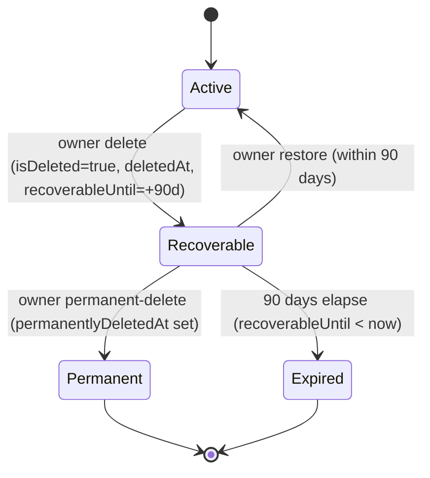

## Overview

Organizations are the tenancy boundary for Propwise CRM. This specification defines how an **organization owner** deletes their workspace, what happens to billing, sessions, real-time connections, and background processing, and how the workspace can be **restored by the owner within a 90-day window** or **permanently removed** earlier.

<Info>
**Status:** Fully implemented (data model, service pipeline, HTTP endpoints, AuthGuard hard-stop, free-org cap, org picker, Danger Zone, cross-module WebSocket disconnect, Meta pause/resume, lifecycle event system)

**Module paths:** `src/modules/organization/`, `src/modules/subscription/`, `src/modules/auth/services/session.service.ts`, `src/modules/messaging/`, `src/modules/notification/`, `src/modules/crm/escalation/`, `src/modules/crm/distribution/`
</Info>

### Key features

Deletion is a **reversible soft delete**. The organization row stays in the database with `isDeleted = true` and all CRM data intact. There is **no automated hard purge** in this phase.

<CardGroup cols={2}>
  <Card title="Immediate Access Revocation" icon="ban">
    All org-scoped sessions revoked; no API call succeeds for that org after delete
  </Card>
  <Card title="90-Day Recovery" icon="clock-rotate-left">
    Owner can restore the organization within 90 days or permanently delete immediately
  </Card>
  <Card title="Real-Time Teardown" icon="plug">
    WebSockets disconnected, Meta webhooks paused, background jobs excluded
  </Card>
  <Card title="Billing Cancellation" icon="credit-card">
    Paid subscriptions stop auto-renewal at current period end
  </Card>
</CardGroup>

The lifecycle is driven by a single boolean (`isDeleted`) plus four lifecycle timestamps. There is **no separate `status` enum** — this matches the existing `isDeleted: false` queries across the codebase and avoids syncing two fields.

---

## Product decisions

<Note>
These decisions are **locked** and represent the final product behavior.
</Note>

| Topic | Decision |
|-------|----------|
| **Who can delete** | **Organization owner only** — `organization.owner_id` must match the authenticated user. Endpoint also requires RBAC `system.owner` (`OrgPermissionKey.SYSTEM_OWNER`) for defense in depth. |
| **Recovery (owner)** | **Self-service** — the owner can **Restore** within **90 days** or **Permanently delete** immediately, both from the org picker. Beyond 90 days or after permanent-delete, owner self-service restore is disabled. |
| **Recovery (system admin)** | The **system admin dashboard** lists deleted organizations and can **Restore** them with **no 90-day limit**, and can **Delete** any organization using the same full pipeline as the owner flow. |
| **Billing on delete** | **Cancel at period end** — paid orgs stop auto-renewal at the current period end. **Free orgs** (no `stripeSubscriptionId`): skip Stripe; no error. On restore, resume auto-renewal **only if** the Stripe subscription is still alive. |
| **Data after delete** | **Soft delete only** — `isDeleted = true` plus lifecycle timestamps. **No** hard purge, **no** `status` column. Permanent-delete keeps the row and only sets `permanentlyDeletedAt`. |
| **Session handling** | Revoke **all org-scoped sessions** immediately after the delete transaction commits, with reason `ORG_ACCESS_REVOKED`. Restore does **not** un-revoke sessions; the owner re-selects the org to get fresh sessions. |
| **Real-time / background** | **Balanced immediate teardown** — disconnect live WebSocket clients in the org rooms cluster-wide, pause + unsubscribe Meta/WhatsApp webhooks (keeping tokens), and exclude the org from all cron/queue dispatchers. |
| **Owner visibility** | The owner **still sees** the deleted org in the picker for 90 days (non-enterable), with Restore + Permanent-delete actions. All other members and all APIs treat it as gone. |
| **Free-org slot** | A **Recoverable** org **still occupies** the owner's free slot. **Permanent** or **Expired** frees the slot. |
| **Member UX** | Notify non-owner members via the existing `REMOVED_FROM_ORGANIZATION` notification type. |

---

## Lifecycle states

### State machine

The four named states (Active / Recoverable / Permanent / Expired) are **computed at query time** from `isDeleted`, `permanentlyDeletedAt`, and `recoverableUntil` — there is **no cron** that mutates state on the 90-day boundary.



### State definitions

| State | Condition (computed) | Owner picker | Members / APIs | Free slot | Self-service restore | Background jobs |
|-------|---------------------|--------------|----------------|-----------|---------------------|-----------------|
| **Active** | `isDeleted = false` | Visible + enterable | Visible per RBAC | Occupied | n/a | Eligible |
| **Recoverable** | `isDeleted = true` AND `permanentlyDeletedAt IS NULL` AND `recoverableUntil >= now` | Visible, **not enterable**, shows Restore + Permanent-delete | Hidden everywhere | **Occupied** | **Allowed** | Excluded |
| **Permanent** | `isDeleted = true` AND `permanentlyDeletedAt IS NOT NULL` | Hidden | Hidden | **Freed** | Disabled (support SQL only) | Excluded |
| **Expired** | `isDeleted = true` AND `permanentlyDeletedAt IS NULL` AND `recoverableUntil < now` | Hidden | Hidden | **Freed** | Disabled (support SQL only) | Excluded |

<Warning>
**Invariants:**
- When `isDeleted = false`: `deletedAt`, `deletedBy`, `recoverableUntil`, `permanentlyDeletedAt` MUST all be `NULL`
- When `isDeleted = true`: `deletedAt` and `recoverableUntil` SHOULD be set
- The 90-day boundary is evaluated **at read time** (`recoverableUntil >= now`)
</Warning>

---

## Data model

### Organization entity fields

```typescript
@Entity('organizations')
export class Organization {
  // Existing fields...
  
  @Column({ name: 'is_deleted', type: 'boolean', default: false })
  isDeleted: boolean;
  
  @Column({ name: 'deleted_at', type: 'timestamptz', nullable: true })
  deletedAt: Date | null;
  
  @Column({ name: 'deleted_by', type: 'uuid', nullable: true })
  deletedBy: string | null;
  
  @Column({ name: 'recoverable_until', type: 'timestamptz', nullable: true })
  recoverableUntil: Date | null;
  
  @Column({ name: 'permanently_deleted_at', type: 'timestamptz', nullable: true })
  permanentlyDeletedAt: Date | null;
  
  @ManyToOne(() => User, { nullable: true })
  @JoinColumn({ name: 'deleted_by' })
  deletedByUser?: User;
}
```

### Migration

```sql
ALTER TABLE organizations
  ADD COLUMN deleted_at TIMESTAMPTZ NULL,
  ADD COLUMN deleted_by UUID NULL,
  ADD COLUMN recoverable_until TIMESTAMPTZ NULL,
  ADD COLUMN permanently_deleted_at TIMESTAMPTZ NULL;

CREATE INDEX idx_organizations_lifecycle 
  ON organizations(is_deleted, recoverable_until, permanently_deleted_at)
  WHERE is_deleted = true;

ALTER TABLE organizations
  ADD CONSTRAINT fk_deleted_by
  FOREIGN KEY (deleted_by) REFERENCES users(id) ON DELETE SET NULL;
```

### DTOs

<AccordionGroup>
  <Accordion title="OrganizationDto (existing + lifecycle fields)">
```typescript
export class OrganizationDto {
  id: string;
  name: string;
  // ... existing fields
  
  @ApiProperty({ required: false })
  isDeleted?: boolean;
  
  @ApiProperty({ required: false })
  deletedAt?: Date;
  
  @ApiProperty({ required: false })
  deletedBy?: string;
  
  @ApiProperty({ required: false })
  recoverableUntil?: Date;
  
  @ApiProperty({ required: false })
  permanentlyDeletedAt?: Date;
  
  @ApiProperty({ 
    enum: ['active', 'recoverable', 'expired', 'permanently_deleted'],
    required: false 
  })
  lifecycleState?: string;
}
```
  </Accordion>

  <Accordion title="AdminOrganizationDto (system admin view)">
```typescript
export class AdminOrganizationDto extends OrganizationDto {
  @ApiProperty({ required: false })
  deletedByUser?: {
    id: string;
    name: string;
    email: string;
  };
  
  @ApiProperty({ 
    enum: ['active', 'recoverable', 'expired', 'permanently_deleted'] 
  })
  lifecycleState: string;
}
```
  </Accordion>
</AccordionGroup>

---

## Owner-initiated deletion flow

<Steps>
  <Step title="Verify permissions">
    - Endpoint requires `@CheckAccess(SYSTEM_OWNER)` RBAC
    - Service verifies `organization.ownerId === userId`
    - Returns `403 Forbidden` if user is not the owner
  </Step>

  <Step title="Set lifecycle fields in transaction">
```typescript
const now = new Date();
const recoverableUntil = new Date(now.getTime() + 90 * 24 * 60 * 60 * 1000);

await organizationRepo.update(organizationId, {
  isDeleted: true,
  deletedAt: now,
  deletedBy: userId,
  recoverableUntil,
  permanentlyDeletedAt: null
});
```
  </Step>

  <Step title="Cancel billing subscription">
    - Call `cancelSubscription(organizationId, userId, immediate = false)`
    - Sets `cancel_at_period_end = true` in Stripe
    - Free orgs (no `stripeSubscriptionId`): skip Stripe, no error
  </Step>

  <Step title="Revoke all org-scoped sessions">
```typescript
await sessionService.revokeAllOrganizationSessions(
  organizationId,
  SessionRevocationReason.ORG_ACCESS_REVOKED
);
```
    All current sessions for this org become invalid immediately
  </Step>

  <Step title="Emit OrganizationDeletedEvent">
```typescript
eventEmitter.emit(ORGANIZATION_EVENTS.DELETED, {
  organizationId,
  deletedBy: userId,
  deletedAt: now,
  isSystemAdmin: false,
  markPermanent: false
});
```
  </Step>

  <Step title="Clear selected organization">
    Update all users with `selectedOrganization = organizationId` to `null`
  </Step>

  <Step title="Notify members">
    Send `REMOVED_FROM_ORGANIZATION` notification to all non-owner members
  </Step>
</Steps>

### Event listeners (real-time teardown)

<Tabs>
  <Tab title="WebSocket disconnect">
```typescript
@OnEvent(ORGANIZATION_EVENTS.DELETED)
async handleOrganizationDeleted(event: OrganizationDeletedEvent) {
  await this.postgresIoAdapter.disconnectOrganizationSockets(
    event.organizationId,
    'Organization deleted'
  );
}
```
  </Tab>

  <Tab title="Meta webhook pause">
```typescript
@OnEvent(ORGANIZATION_EVENTS.DELETED)
async handleOrganizationDeleted(event: OrganizationDeletedEvent) {
  const accounts = await this.channelAccountRepo.find({
    where: {
      organizationId: event.organizationId,
      type: ChannelType.WHATSAPP,
      status: ChannelAccountStatus.ACTIVE
    }
  });
  
  for (const account of accounts) {
    await this.metaService.pauseWebhook(account.id);
    // Keeps tokens; unsubscribes from webhook delivery
  }
}
```
  </Tab>

  <Tab title="Background job exclusion">
```typescript
// Escalation cron (example)
const activeOrgs = await organizationRepo.find({
  where: { isDeleted: false },
  select: ['id']
});

for (const org of activeOrgs) {
  await this.escalationQueue.add('check-escalation', {
    organizationId: org.id
  });
}
```
    
All cron dispatchers filter `isDeleted = false`. In-flight/queued jobs use a shared guard:

```typescript
async function isOrgActive(orgId: string): Promise<boolean> {
  const org = await organizationRepo.findOne({
    where: { id: orgId },
    select: ['isDeleted']
  });
  return org && !org.isDeleted;
}
```
  </Tab>
</Tabs>

---

## Restore flow (self-service)

<Warning>
Owner can only restore within the 90-day window. After expiry, only system admin can restore.
</Warning>

<Steps>
  <Step title="Verify eligibility">
    - Check `organization.ownerId === userId`
    - Check `isDeleted = true`
    - Check `permanentlyDeletedAt IS NULL`
    - Check `recoverableUntil >= now`
    - Return `403 Forbidden` if any condition fails
  </Step>

  <Step title="Clear lifecycle fields in transaction">
```typescript
await organizationRepo.update(organizationId, {
  isDeleted: false,
  deletedAt: null,
  deletedBy: null,
  recoverableUntil: null,
  permanentlyDeletedAt: null
});
```
  </Step>

  <Step title="Resume billing subscription">
```typescript
if (organization.stripeSubscriptionId) {
  await stripe.subscriptions.update(
    organization.stripeSubscriptionId,
    { cancel_at_period_end: false }
  );
}
```
    Only if the Stripe subscription still exists and is active
  </Step>

  <Step title="Emit OrganizationRestoredEvent">
```typescript
eventEmitter.emit(ORGANIZATION_EVENTS.RESTORED, {
  organizationId,
  restoredBy: userId,
  restoredAt: new Date(),
  isSystemAdmin: false
});
```
  </Step>
</Steps>

### Event listeners (reactivation)

<Tabs>
  <Tab title="Meta webhook resume">
```typescript
@OnEvent(ORGANIZATION_EVENTS.RESTORED)
async handleOrganizationRestored(event: OrganizationRestoredEvent) {
  const accounts = await this.channelAccountRepo.find({
    where: {
      organizationId: event.organizationId,
      type: ChannelType.WHATSAPP,
      status: ChannelAccountStatus.ACTIVE
    }
  });
  
  for (const account of accounts) {
    await this.metaService.resumeWebhook(account.id);
    // Re-subscribes to webhook delivery
  }
}
```
  </Tab>

  <Tab title="Background job re-inclusion">
No explicit listener needed. Next cron cycle will include the org because `isDeleted = false`.
  </Tab>
</Tabs>

<Note>
**Sessions are NOT un-revoked.** The owner must re-select the organization to get fresh sessions.
</Note>

---

## Permanent-delete flow

Owner can trigger immediate permanent deletion during the 90-day window. This **does not** hard-purge data — it only marks the org as permanently deleted.

<Steps>
  <Step title="Verify permissions">
    Same as initial delete: owner check + `SYSTEM_OWNER` RBAC
  </Step>

  <Step title="Set permanentlyDeletedAt">
```typescript
await organizationRepo.update(organizationId, {
  permanentlyDeletedAt: new Date()
  // isDeleted stays true, recoverableUntil unchanged
});
```
  </Step>

  <Step title="Emit lifecycle event">
```typescript
eventEmitter.emit(ORGANIZATION_EVENTS.PERMANENTLY_DELETED, {
  organizationId,
  permanentlyDeletedBy: userId,
  permanentlyDeletedAt: new Date()
});
```
  </Step>
</Steps>

<Warning>
After permanent-delete:
- Owner can no longer see the org in the picker
- Self-service restore is disabled
- Free-org slot is **freed**
- Only system admin can restore via SQL or admin dashboard
</Warning>

---

## Billing behavior

### Subscription cancellation on delete

<Tabs>
  <Tab title="Paid organizations">
```typescript
// Cancel at period end (immediate = false)
await stripe.subscriptions.update(stripeSubscriptionId, {
  cancel_at_period_end: true
});
```

- Subscription remains active until current period ends
- No immediate prorated refund
- Auto-renewal stops
- Access continues until period end (though org is deleted)
  </Tab>

  <Tab title="Free organizations">
```typescript
if (!organization.stripeSubscriptionId) {
  // Skip Stripe; no error
  return;
}
```

No Stripe interaction needed for free orgs.
  </Tab>
</Tabs>

### Subscription resumption on restore

```typescript
if (!organization.stripeSubscriptionId) {
  return; // Free org; skip
}

try {
  const subscription = await stripe.subscriptions.retrieve(
    organization.stripeSubscriptionId
  );
  
  if (subscription.status === 'active') {
    await stripe.subscriptions.update(subscription.id, {
      cancel_at_period_end: false
    });
  }
} catch (error) {
  // Subscription deleted or expired; log but don't fail restore
  logger.warn('Cannot resume subscription', { error });
}
```

<Info>
Restore **only resumes** if the Stripe subscription still exists and is `active`. If the subscription expired or was deleted, restore succeeds but billing must be re-setup manually.
</Info>

---

## Sessions and access

### Session revocation

All org-scoped sessions are revoked immediately after delete:

```typescript
async revokeAllOrganizationSessions(
  organizationId: string,
  reason: SessionRevocationReason
): Promise<void> {
  await this.sessionRepo.update(
    { organizationId, isRevoked: false },
    {
      isRevoked: true,
      revokedAt: new Date(),
      revocationReason: reason
    }
  );
}
```

### AuthGuard enforcement

<Steps>
  <Step title="Session validation">
    `JwtOrganizationAuthGuard` validates session liveness via cache/database
  </Step>

  <Step title="Organization deletion check">
```typescript
// On cache miss (or legacy token bypass)
const organization = await organizationRepo.findOne({
  where: { id: orgSessionId.organizationId },
  select: ['id', 'isDeleted']
});

if (!organization) {
  throw new NotFoundException('Organization not found');
}

if (organization.isDeleted) {
  throw new ForbiddenException('Organization access revoked');
}
```
  </Step>

  <Step title="Session context">
    Attach validated org to `req.organization` for downstream guards/decorators
  </Step>
</Steps>

<Warning>
**Hard stop:** Any API request to a deleted org returns `403 Forbidden`, even if the session was valid before deletion.
</Warning>

### Owner access to deleted org

The owner **cannot enter** a deleted org via normal API flows. The org picker shows it as non-enterable with special UI for Restore/Permanent-delete actions.

---

## Member notifications

### Notification flow

When an organization is deleted, all non-owner members receive a notification:

```typescript
const members = await userOrganizationRepo.find({
  where: {
    organizationId,
    userId: Not(ownerId)
  },
  relations: ['user']
});

for (const member of members) {
  await notificationService.create({
    userId: member.userId,
    type: NotificationType.REMOVED_FROM_ORGANIZATION,
    metadata: {
      organizationId,
      organizationName: organization.name,
      reason: 'deleted'
    }
  });
}
```

<Note>
This reuses the existing `REMOVED_FROM_ORGANIZATION` notification type, identical to the notification sent when a member is explicitly removed.
</Note>

### Member experience

<Steps>
  <Step title="Receive notification">
    Member sees "You have been removed from {organization name}" notification
  </Step>

  <Step title="Org picker update">
    Deleted org no longer appears in member's org picker (hidden immediately)
  </Step>

  <Step title="Session behavior">
    If member had an active session in the deleted org, next API call returns `403 Forbidden`
  </Step>

  <Step title="No restoration access">
    Members cannot restore the org; only the owner can (within 90 days)
  </Step>
</Steps>

---

## Background jobs and crons

### Dispatcher filtering

All cron jobs that dispatch work per-organization filter out deleted orgs:

```typescript
// Example: Escalation check cron
@Cron(CronExpression.EVERY_5_MINUTES)
async checkEscalations() {
  const activeOrgs = await this.organizationRepo.find({
    where: { isDeleted: false },
    select: ['id']
  });
  
  for (const org of activeOrgs) {
    await this.escalationQueue.add('process-escalation', {
      organizationId: org.id
    });
  }
}
```

### In-flight job guard

Queued jobs that were dispatched before deletion use a shared guard:

```typescript
// In processor
async processJob(job: Job) {
  const { organizationId } = job.data;
  
  const isActive = await this.isOrgActive(organizationId);
  if (!isActive) {
    this.logger.warn(`Skipping job for deleted org ${organizationId}`);
    return; // No-op
  }
  
  // Process normally...
}

private async isOrgActive(orgId: string): Promise<boolean> {
  const org = await this.organizationRepo.findOne({
    where: { id: orgId },
    select: ['isDeleted']
  });
  return org && !org.isDeleted;
}
```

<Info>
Queued jobs are **not purged** on delete. They remain in the queue but no-op when processed.
</Info>

### Affected systems

<AccordionGroup>
  <Accordion title="Escalation rules">
- **Cron:** `EscalationCronService` filters `isDeleted = false`
- **Queue:** `EscalationProcessor` checks `isOrgActive` at job start
  </Accordion>

  <Accordion title="Distribution rules">
- **Cron:** `DistributionCronService` filters `isDeleted = false`
- **Queue:** `DistributionProcessor` checks `isOrgActive` at job start
  </Accordion>

  <Accordion title="Account health checks">
- **Cron:** `AccountHealthCronService` filters `isDeleted = false`
- Paused Meta accounts skip health checks automatically
  </Accordion>

  <Accordion title="Window expiry checks">
- **Cron:** `WindowExpiryCronService` loads conversations with org relation, filters `org.isDeleted = false`
  </Accordion>

  <Accordion title="Portal syndication">
- **Cron:** `PortalSyndicationCronService` filters `isDeleted = false`
  </Accordion>

  <Accordion title="Reminder orphan recovery">
- **Cron:** `ReminderOrphanRecoveryCronService` joins to conversations/organizations, filters `org.isDeleted = false`
  </Accordion>
</AccordionGroup>

---

## Real-time teardown

### WebSocket disconnection

<Steps>
  <Step title="Event listener setup">
```typescript
@OnEvent(ORGANIZATION_EVENTS.DELETED)
async handleOrganizationDeleted(event: OrganizationDeletedEvent) {
  await this.postgresIoAdapter.disconnectOrganizationSockets(
    event.organizationId,
    'Organization deleted'
  );
}
```
  </Step>

  <Step title="Cross-instance coordination">
```typescript
// PostgresIoAdapter
async disconnectOrganizationSockets(
  organizationId: string,
  reason: string
): Promise<void> {
  // Publish message to all Socket.io instances
  await this.pubClient.publish('socket:disconnect-org', {
    organizationId,
    reason
  });
}
```
  </Step>

  <Step title="Local socket disconnect">
```typescript
// On each Socket.io instance
this.subClient.on('message', (channel, message) => {
  if (channel === 'socket:disconnect-org') {
    const { organizationId, reason } = JSON.parse(message);
    
    // Find all sockets in org rooms
    const orgRoom = `org:${organizationId}`;
    const sockets = this.io.of('/').in(orgRoom).sockets;
    
    for (const [_, socket] of sockets) {
      socket.disconnect(true);
    }
  }
});
```
  </Step>
</Steps>

<Warning>
Sockets are authenticated once at connection. Without this teardown, a deleted org's WebSocket clients would stay connected until manual disconnect.
</Warning>

### Meta webhook pause/resume

<Tabs>
  <Tab title="Pause on delete">
```typescript
async pauseWebhook(channelAccountId: string): Promise<void> {
  const account = await this.channelAccountRepo.findOne({
    where: { id: channelAccountId },
    relations: ['credentials']
  });
  
  // Unsubscribe from webhook delivery
  await this.metaGraphApi.post(
    `/${account.credentials.wabaId}/subscribed_apps`,
    {
      subscribed_fields: [] // Empty = unsubscribe
    }
  );
  
  // Keep tokens and credentials intact
  await this.channelAccountRepo.update(channelAccountId, {
    webhookStatus: 'paused'
  });
}
```
  </Tab>

  <Tab title="Resume on restore">
```typescript
async resumeWebhook(channelAccountId: string): Promise<void> {
  const account = await this.channelAccountRepo.findOne({
    where: { id: channelAccountId },
    relations: ['credentials']
  });
  
  // Re-subscribe to webhook fields
  await this.metaGraphApi.post(
    `/${account.credentials.wabaId}/subscribed_apps`,
    {
      subscribed_fields: [
        'messages',
        'message_status_update',
        'message_template_status_update'
      ]
    }
  );
  
  await this.channelAccountRepo.update(channelAccountId, {
    webhookStatus: 'active'
  });
}
```
  </Tab>
</Tabs>

<Info>
**Non-destructive pause:** Tokens and WABA credentials are preserved. Only webhook delivery is paused/resumed.
</Info>

### Inbound webhook gating

All inbound webhooks (Meta, other channels) check org deletion at the entry point:

```typescript
@Post('webhooks/meta')
async handleMetaWebhook(@Body() payload: MetaWebhookPayload) {
  const account = await this.findAccountByWebhookPayload(payload);
  
  const org = await this.organizationRepo.findOne({
    where: { id: account.organizationId },
    select: ['id', 'isDeleted']
  });
  
  if (!org || org.isDeleted) {
    this.logger.warn('Ignoring webhook for deleted org', {
      organizationId: account.organizationId
    });
    return { status: 'ignored' };
  }
  
  // Process webhook...
}
```

---

## Stripe webhooks and soft-deleted orgs

### Webhook handling for deleted orgs

Stripe webhooks continue to arrive after org deletion (until subscription expires). Handler must gracefully handle deleted orgs:

```typescript
async handleStripeWebhook(event: Stripe.Event): Promise<void> {
  const subscription = event.data.object as Stripe.Subscription;
  
  const org = await this.organizationRepo.findOne({
    where: { stripeSubscriptionId: subscription.id }
    // No isDeleted filter; load deleted orgs
  });
  
  if (!org) {
    this.logger.warn('Subscription org not found', {
      subscriptionId: subscription.id
    });
    return;
  }
  
  if (org.isDeleted) {
    this.logger.info('Ignoring webhook for deleted org', {
      organizationId: org.id,
      eventType: event.type
    });
    return; // No-op; don't update deleted org
  }
  
  // Process webhook for active org...
}
```

<Tip>
Always load organizations **without** `isDeleted` filter in webhook handlers, then explicitly check and ignore deleted orgs.
</Tip>

---

## Free organization ownership cap

### Counting logic

The free-org cap counts **Active** and **Recoverable** orgs, but **not** Permanent or Expired:

```typescript
async checkFreeOrgLimit(ownerId: string): Promise<void> {
  const ownedOrgs = await this.organizationRepo.find({
    where: { ownerId },
    // No filters; load all including deleted
  });
  
  const countedOrgs = ownedOrgs.filter(org => {
    if (!org.isDeleted) return true; // Active
    
    // Recoverable: deleted but not permanent and within window
    if (!org.permanentlyDeletedAt && org.recoverableUntil >= new Date()) {
      return true;
    }
    
    return false; // Permanent or Expired
  });
  
  if (countedOrgs.length >= FREE_ORG_CAP) {
    throw new ForbiddenException(
      'Free organization limit reached. Delete or permanently remove an existing organization to create a new one.'
    );
  }
}
```

<Warning>
A deleted org in the 90-day window **still occupies** the owner's free-org slot. Permanent-delete or expiry frees the slot.
</Warning>

### User experience

<Steps>
  <Step title="Owner tries to create new org">
    Calls `POST /v1/organizations` with org details
  </Step>

  <Step title="Limit check">
    Backend counts Active + Recoverable orgs owned by user
  </Step>

  <Step title="Rejection if at limit">
    Returns `403 Forbidden` with message:
    > "Free organization limit reached. Delete or permanently remove an existing organization to create a new one."
  </Step>

  <Step title="Owner permanent-deletes old org">
    Calls `POST /v1/organizations/:id/permanent-delete` on a Recoverable org
  </Step>

  <Step title="Slot freed">
    Owner can now create a new org
  </Step>
</Steps>

---

## API contract

### Delete organization

<CodeGroup>
```typescript DELETE /v1/organizations/:id
/**
 * Delete organization (soft delete with 90-day recovery)
 * 
 * @requires Organization owner
 * @requires SYSTEM_OWNER permission
 */
@Delete(':id')
@UseGuards(JwtOrganizationAuthGuard)
@CheckAccess(OrgPermissionKey.SYSTEM_OWNER)
async delete(
  @Param('id') id: string,
  @CurrentUser() user: User
): Promise<void> {
  await this.organizationService.delete(id, user.id);
}
```

```json Response (204 No Content)
// Empty body
```

```json Error (403 Forbidden)
{
  "statusCode": 403,
  "message": "Only the organization owner can delete the organization",
  "error": "Forbidden"
}
```
</CodeGroup>

### Restore organization

<CodeGroup>
```typescript POST /v1/organizations/:id/restore
/**
 * Restore soft-deleted organization (owner self-service within 90 days)
 * 
 * @requires Organization owner
 * @requires Identity token (no org-scoped token)
 */
@Post(':id/restore')
@UseGuards(JwtAuthGuard)
@IdentityTokenOnly()
async restore(
  @Param('id') id: string,
  @CurrentUser() user: User
): Promise<OrganizationDto> {
  return this.organizationService.restore(id, user.id);
}
```

```json Response (200 OK)
{
  "id": "org_123",
  "name": "Acme Real Estate",
  "isDeleted": false,
  "deletedAt": null,
  "deletedBy": null,
  "recoverableUntil": null,
  "permanentlyDeletedAt": null,
  "lifecycleState": "active"
}
```

```json Error (403 Forbidden - expired)
{
  "statusCode": 403,
  "message": "Recovery window expired. Contact support.",
  "error": "Forbidden"
}
```
</CodeGroup>

### Permanent delete

<CodeGroup>
```typescript POST /v1/organizations/:id/permanent-delete
/**
 * Permanently delete organization (marks as permanent; no hard purge)
 * 
 * @requires Organization owner
 * @requires Identity token (no org-scoped token)
 */
@Post(':id/permanent-delete')
@UseGuards(JwtAuthGuard)
@IdentityTokenOnly()
async permanentDelete(
  @Param('id') id: string,
  @CurrentUser() user: User
): Promise<void> {
  await this.organizationService.permanentDelete(id, user.id);
}
```

```json Response (204 No Content)
// Empty body
```
</CodeGroup>

### Organization picker (owner view)

<CodeGroup>
```typescript GET /v1/organizations/me
/**
 * List organizations for current user
 * 
 * Includes:
 * - Active orgs (all members)
 * - Recoverable orgs (owner only)
 */
@Get('me')
@UseGuards(JwtAuthGuard)
async findByUser(@CurrentUser() user: User): Promise<OrganizationDto[]> {
  return this.organizationService.findByUser(user.id);
}
```

```json Response (200 OK)
[
  {
    "id": "org_active",
    "name": "Active Org",
    "isDeleted": false,
    "lifecycleState": "active"
  },
  {
    "id": "org_deleted",
    "name": "Deleted Org",
    "isDeleted": true,
    "deletedAt": "2024-01-15T10:30:00Z",
    "recoverableUntil": "2024-04-15T10:30:00Z",
    "lifecycleState": "recoverable",
    "canRestore": true,
    "canPermanentlyDelete": true
  }
]
```
</CodeGroup>

---

## Frontend UX

### Organization settings Danger Zone

<Steps>
  <Step title="Navigate to settings">
    Organization owner navigates to Settings → General → Danger Zone
  </Step>

  <Step title="Delete button">
    Red "Delete Organization" button with warning text:
    > "This will remove all data and cancel any active subscription. You can restore within 90 days."
  </Step>

  <Step title="Confirmation modal">
    - Title: "Delete {organization name}?"
    - Requires typing organization name to confirm
    - Warning about data, billing, and recovery window
    - "Delete Organization" button (red)
  </Step>

  <Step title="Post-delete redirect">
    Redirect to org picker with toast:
    > "Organization deleted. You can restore it within 90 days."
  </Step>
</Steps>

### Organization picker (deleted org view)

The owner sees deleted orgs in a special section:

<Tabs>
  <Tab title="Active organizations">
```tsx
<OrganizationCard
  name="Active Org"
  onClick={() => selectOrg(org.id)}
  status="active"
/>
```
  </Tab>

  <Tab title="Recoverable organizations">
```tsx
<OrganizationCard
  name="Deleted Org"
  status="pending_deletion"
  deletedAt={org.deletedAt}
  recoverableUntil={org.recoverableUntil}
  actions={
    <>
      <Button onClick={() => restoreOrg(org.id)}>
        Restore
      </Button>
      <Button variant="danger" onClick={() => permanentDelete(org.id)}>
        Permanently Delete
      </Button>
    </>
  }
  disabled // Not enterable
/>
```
  </Tab>
</Tabs>

<Warning>
Recoverable orgs are **not clickable/enterable**. Only Restore and Permanent Delete buttons are available.
</Warning>

### Restore confirmation

<Steps>
  <Step title="Click Restore button">
    Opens confirmation modal
  </Step>

  <Step title="Confirmation modal">
    - Title: "Restore {organization name}?"
    - Text: "All data will be reactivated and billing will resume if you have an active subscription."
    - "Restore Organization" button (primary)
  </Step>

  <Step title="API call">
    `POST /v1/organizations/:id/restore`
  </Step>

  <Step title="Success">
    Org picker refreshes; restored org moves to Active section
    Toast: "Organization restored successfully."
  </Step>
</Steps>

### Permanent delete confirmation

<Steps>
  <Step title="Click Permanently Delete button">
    Opens high-friction confirmation modal
  </Step>

  <Step title="Confirmation modal">
    - Title: "Permanently Delete {organization name}?"
    - Warning: "This action cannot be undone. All recovery options will be removed."
    - Requires typing "PERMANENTLY DELETE" to confirm
    - "Permanently Delete" button (red)
  </Step>

  <Step title="API call">
    `POST /v1/organizations/:id/permanent-delete`
  </Step>

  <Step title="Success">
    Org removed from picker entirely
    Toast: "Organization permanently deleted."
  </Step>
</Steps>

---

## System admin dashboard

### Admin organization list

<CodeGroup>
```typescript GET /system-admin/organizations
/**
 * List all organizations (including deleted)
 * 
 * @requires System admin role
 */
@Get()
@UseGuards(JwtAuthGuard, SystemAdminGuard)
async listOrganizations(
  @Query('includeDeleted') includeDeleted?: boolean
): Promise<AdminOrganizationDto[]> {
  return this.systemAdminService.listOrganizations(includeDeleted);
}
```

```json Response (200 OK)
[
  {
    "id": "org_123",
    "name": "Active Org",
    "lifecycleState": "active",
    "isDeleted": false
  },
  {
    "id": "org_456",
    "name": "Recoverable Org",
    "lifecycleState": "recoverable",
    "isDeleted": true,
    "deletedAt": "2024-01-15T10:30:00Z",
    "deletedBy": "user_789",
    "deletedByUser": {
      "id": "user_789",
      "name": "John Smith",
      "email": "john@example.com"
    },
    "recoverableUntil": "2024-04-15T10:30:00Z"
  },
  {
    "id": "org_789",
    "name": "Expired Org",
    "lifecycleState": "expired",
    "isDeleted": true,
    "deletedAt": "2023-10-01T10:30:00Z",
    "recoverableUntil": "2023-12-30T10:30:00Z"
  }
]
```
</CodeGroup>

### Admin restore (no time limit)

<CodeGroup>
```typescript POST /system-admin/organizations/:id/restore
/**
 * Restore any deleted organization (no 90-day limit)
 * 
 * @requires System admin role
 */
@Post(':id/restore')
@UseGuards(JwtAuthGuard, SystemAdminGuard)
async restoreOrganization(
  @Param('id') id: string,
  @CurrentUser() admin: User
): Promise<AdminOrganizationDto> {
  return this.systemAdminService.restoreOrganization(id, admin.id);
}
```

```json Response (200 OK)
{
  "id": "org_456",
  "name": "Restored Org",
  "lifecycleState": "active",
  "isDeleted": false,
  "deletedAt": null,
  "deletedBy": null,
  "recoverableUntil": null
}
```
</CodeGroup>

<Info>
System admin restore works on **Recoverable**, **Expired**, and **Permanent** orgs with no time limit. The service uses `enforceWindow: false` flag.
</Info>

### Admin delete organization

System admin can delete any org using the same pipeline as owner delete, but with `markPermanent: true` option:

```typescript
async deleteOrganization(
  organizationId: string,
  adminId: string
): Promise<void> {
  await this.organizationService.softDeleteOrganizationInternal(
    organizationId,
    adminId,
    SessionRevocationReason.ORG_DELETED,
    { markPermanent: true } // Sets permanentlyDeletedAt immediately
  );
}
```

---

## Recovery beyond the window

### Support runbook (manual SQL)

<Warning>
This is the fallback for recovery beyond 90 days when system admin dashboard is not available. **Always prefer the admin dashboard method.**
</Warning>

<Steps>
  <Step title="Verify organization state">
```sql
SELECT 
  id,
  name,
  is_deleted,
  deleted_at,
  recoverable_until,
  permanently_deleted_at,
  CASE
    WHEN NOT is_deleted THEN 'active'
    WHEN permanently_deleted_at IS NOT NULL THEN 'permanently_deleted'
    WHEN recoverable_until >= NOW() THEN 'recoverable'
    ELSE 'expired'
  END as lifecycle_state
FROM organizations
WHERE id = 'org_uuid';
```
  </Step>

  <Step title="Clear lifecycle fields">
```sql
BEGIN;

UPDATE organizations
SET
  is_deleted = false,
  deleted_at = NULL,
  deleted_by = NULL,
  recoverable_until = NULL,
  permanently_deleted_at = NULL
WHERE id = 'org_uuid';

COMMIT;
```
  </Step>

  <Step title="Resume billing (if applicable)">
```sql
-- Get Stripe subscription ID
SELECT stripe_subscription_id FROM organizations WHERE id = 'org_uuid';

-- Then manually in Stripe dashboard or via CLI:
-- stripe subscriptions update sub_xxx --cancel_at_period_end=false
```
  </Step>

  <Step title="Resume Meta webhooks">
Manually call Meta Graph API or use admin script:
```bash
npm run admin:resume-webhooks -- --org=org_uuid
```
  </Step>

  <Step title="Notify stakeholders">
Log the manual recovery in internal docs and notify the org owner
  </Step>
</Steps>

<Tip>
Document all manual recoveries in a recovery log with date, admin performing recovery, org ID, and reason.
</Tip>

---

## Constants

```typescript
// src/modules/organization/organization.constants.ts

export const ORGANIZATION_CONSTANTS = {
  /**
   * Default recovery window for deleted organizations
   * Owner can restore within this period
   */
  DEFAULT_RECOVERY_DAYS: 90,
  
  /**
   * Maximum number of free organizations a user can own
   * Counts Active + Recoverable orgs
   */
  FREE_ORG_CAP: 3,
  
  /**
   * Session revocation reason for deleted orgs
   */
  SESSION_REVOCATION_REASON: 'ORG_ACCESS_REVOKED',
  
  /**
   * Member notification type on org deletion
   */
  MEMBER_NOTIFICATION_TYPE: 'REMOVED_FROM_ORGANIZATION',
};

/**
 * Lifecycle events
 */
export const ORGANIZATION_EVENTS = {
  DELETED: 'organization.deleted',
  RESTORED: 'organization.restored',
  PERMANENTLY_DELETED: 'organization.permanently_deleted',
} as const;

/**
 * Computed lifecycle states
 */
export enum OrganizationLifecycleState {
  ACTIVE = 'active',
  RECOVERABLE = 'recoverable',
  EXPIRED = 'expired',
  PERMANENTLY_DELETED = 'permanently_deleted',
}
```

---

## Testing requirements

### Unit tests

<AccordionGroup>
  <Accordion title="OrganizationService.delete">
- Owner can delete own org
- Non-owner throws `403 Forbidden`
- Sets all lifecycle fields correctly
- Calculates `recoverableUntil` = `deletedAt + 90 days`
- Emits `ORGANIZATION_EVENTS.DELETED`
- Does not set `permanentlyDeletedAt`
  </Accordion>

  <Accordion title="OrganizationService.restore">
- Owner can restore within 90 days
- Non-owner throws `403 Forbidden`
- Expired org throws `403 Forbidden` for owner
- Permanent org throws `403 Forbidden` for owner
- Clears all lifecycle fields
- Emits `ORGANIZATION_EVENTS.RESTORED`
  </Accordion>

  <Accordion title="OrganizationService.permanentDelete">
- Sets `permanentlyDeletedAt`
- Keeps `isDeleted = true`
- Emits `ORGANIZATION_EVENTS.PERMANENTLY_DELETED`
- Cannot restore via owner self-service after
  </Accordion>

  <Accordion title="SubscriptionService.cancelSubscription">
- Paid org: sets `cancel_at_period_end = true`
- Free org: skips Stripe, no error
- Restore resumes if subscription still active
- Restore handles deleted subscription gracefully
  </Accordion>

  <Accordion title="SessionService.revokeAllOrganizationSessions">
- Revokes all org-scoped sessions
- Sets `revocationReason = ORG_ACCESS_REVOKED`
- Leaves other orgs' sessions intact
  </Accordion>

  <Accordion title="Free-org cap logic">
- Counts Active orgs
- Counts Recoverable orgs
- Does not count Permanent orgs
- Does not count Expired orgs
- Throws at limit (3)
  </Accordion>
</AccordionGroup>

### Integration tests

<AccordionGroup>
  <Accordion title="Delete → Restore flow">
```typescript
it('should delete and restore organization', async () => {
  // Create org
  const org = await createTestOrg(owner);
  
  // Delete
  await request(app)
    .delete(`/v1/organizations/${org.id}`)
    .set('Authorization', `Bearer ${ownerToken}`)
    .expect(204);
  
  // Verify deleted
  const deleted = await organizationRepo.findOne({
    where: { id: org.id }
  });
  expect(deleted.isDeleted).toBe(true);
  expect(deleted.recoverableUntil).toBeDefined();
  
  // Restore
  await request(app)
    .post(`/v1/organizations/${org.id}/restore`)
    .set('Authorization', `Bearer ${identityToken}`)
    .expect(200);
  
  // Verify restored
  const restored = await organizationRepo.findOne({
    where: { id: org.id }
  });
  expect(restored.isDeleted).toBe(false);
  expect(restored.deletedAt).toBeNull();
});
```
  </Accordion>

  <Accordion title="Session revocation on delete">
```typescript
it('should revoke sessions on org delete', async () => {
  const org = await createTestOrg(owner);
  const session = await createOrgSession(owner, org);
  
  // Delete org
  await organizationService.delete(org.id, owner.id);
  
  // Verify session revoked
  const revokedSession = await sessionRepo.findOne({
    where: { id: session.id }
  });
  expect(revokedSession.isRevoked).toBe(true);
  expect(revokedSession.revocationReason).toBe('ORG_ACCESS_REVOKED');
  
  // Verify API access denied
  await request(app)
    .get('/v1/conversations')
    .set('Authorization', `Bearer ${session.token}`)
    .expect(403);
});
```
  </Accordion>

  <Accordion title="WebSocket disconnection on delete">
```typescript
it('should disconnect WebSockets on org delete', async () => {
  const org = await createTestOrg(owner);
  const socket = await connectTestSocket(owner, org);
  
  // Delete org
  await organizationService.delete(org.id, owner.id);
  
  // Wait for disconnect event
  await waitForSocketDisconnect(socket);
  
  expect(socket.connected).toBe(false);
});
```
  </Accordion>

  <Accordion title="Background job exclusion">
```typescript
it('should exclude deleted org from cron dispatch', async () => {
  const org = await createTestOrg(owner);
  
  // Delete org
  await organizationService.delete(org.id, owner.id);
  
  // Run cron
  await escalationCron.checkEscalations();
  
  // Verify no jobs queued for deleted org
  const jobs = await escalationQueue.getJobs(['waiting']);
  const orgJobs = jobs.filter(j => j.data.organizationId === org.id);
  expect(orgJobs).toHaveLength(0);
});
```
  </Accordion>
</AccordionGroup>

### E2E tests

<Steps>
  <Step title="Owner delete → member notification flow">
    1. Owner deletes org
    2. All members receive `REMOVED_FROM_ORGANIZATION` notification
    3. Members no longer see org in picker
    4. Member API calls to org return `403`
  </Step>

  <Step title="Owner delete → billing cancellation flow">
    1. Create paid org with active subscription
    2. Owner deletes org
    3. Verify Stripe subscription `cancel_at_period_end = true`
    4. Restore org
    5. Verify Stripe subscription `cancel_at_period_end = false`
  </Step>

  <Step title="Free-org cap enforcement">
    1. Owner creates 3 free orgs (at limit)
    2. Owner deletes one org (still at limit, Recoverable)
    3. Owner tries to create new org → `403 Forbidden`
    4. Owner permanently deletes recoverable org
    5. Owner creates new org → success
  </Step>

  <Step title="Expired org recovery (admin only)">
    1. Create org, delete, manually set `recoverableUntil` in past
    2. Owner tries to restore → `403 Forbidden`
    3. Admin restores via dashboard → success
    4. Org is Active again
  </Step>
</Steps>

---

## Implementation checklist

<Steps>
  <Step title="Phase 1: Data model (✅ Complete)">
    <Check>Migration: lifecycle columns</Check>
    <Check>Entity: lifecycle fields</Check>
    <Check>DTOs: lifecycle fields + `lifecycleState`</Check>
    <Check>Constants: recovery days, free-org cap, events</Check>
  </Step>

  <Step title="Phase 2: Core service pipeline (✅ Complete)">
    <Check>Shared `softDeleteOrganizationInternal` method</Check>
    <Check>Lifecycle timestamp calculation</Check>
    <Check>Billing cancellation integration</Check>
    <Check>Session revocation</Check>
    <Check>`selectedOrganization` clear</Check>
    <Check>Member notification dispatch</Check>
    <Check>Event emission (`DELETED` / `RESTORED`)</Check>
    <Check>Owner-initiated `DELETE /v1/organizations/:id`</Check>
  </Step>

  <Step title="Phase 3: Owner self-service (✅ Complete)">
    <Check>`POST /v1/organizations/:id/restore`</Check>
    <Check>`POST /v1/organizations/:id/permanent-delete`</Check>
    <Check>`IdentityTokenGuard` + `@IdentityTokenOnly()`</Check>
    <Check>Org picker: owner sees Recoverable orgs</Check>
    <Check>Auth guard: explicit `isDeleted` rejection</Check>
    <Check>Free-org cap: counts Active + Recoverable</Check>
  </Step>

  <Step title="Phase 4: Background job filtering (⚠️ Partial)">
    <Check>Escalation cron/queue</Check>
    <Check>Distribution cron/queue</Check>
    <Check>Account health cron</Check>
    <Check>Window expiry cron</Check>
    <Check>Portal syndication cron</Check>
    <Check>Reminder orphan recovery cron</Check>
    <Check>Shared `isOrgActive` guard for in-flight jobs</Check>
  </Step>

  <Step title="Phase 5: Real-time teardown (✅ Complete)">
    <Check>`PostgresIoAdapter.disconnectOrganizationSockets`</Check>
    <Check>Event listener: WebSocket disconnect on delete</Check>
    <Check>Meta webhook pause on delete</Check>
    <Check>Meta webhook resume on restore</Check>
    <Check>Inbound webhook gating</Check>
  </Step>

  <Step title="Phase 6: Stripe webhook hardening (✅ Complete)">
    <Check>Load orgs without `isDeleted` filter</Check>
    <Check>Explicit check + ignore for deleted orgs</Check>
  </Step>

  <Step title="Phase 7: System admin dashboard (✅ Complete)">
    <Check>`GET /system-admin/organizations?includeDeleted=true`</Check>
    <Check>`AdminOrganizationDto` with lifecycle fields</Check>
    <Check>`POST /system-admin/organizations/:id/restore` (no limit)</Check>
    <Check>`DELETE /system-admin/organizations/:id` (permanent)</Check>
    <Check>`GET /system-admin/organizations/:id` (bypass filters)</Check>
    <Check>`PATCH /system-admin/organizations/:id` (bypass filters)</Check>
  </Step>

  <Step title="Phase 8: Frontend implementation (✅ Complete)">
    <Check>Settings → Danger Zone → Delete Organization</Check>
    <Check>Org picker: recoverable org section</Check>
    <Check>Restore confirmation modal</Check>
    <Check>Permanent delete confirmation modal</Check>
    <Check>Admin dashboard: org list with lifecycle states</Check>
    <Check>Admin dashboard: restore/delete actions</Check>
  </Step>

  <Step title="Phase 9: Testing (🔄 In progress)">
    <Check>Unit tests: service methods</Check>
    <Check>Integration tests: delete/restore flows</Check>
    <Check>E2E tests: user journeys</Check>
  </Step>
</Steps>

---

## Related documentation

<CardGroup cols={2}>
  <Card title="Organization Management" icon="building" href="/backend/organization/overview">
    Core organization concepts and RBAC
  </Card>
  <Card title="Session Management" icon="key" href="/backend/auth/sessions">
    Session lifecycle and revocation
  </Card>
  <Card title="Billing Integration" icon="credit-card" href="/backend/billing/stripe-integration">
    Stripe subscription management
  </Card>
  <Card title="WebSocket Architecture" icon="tower-broadcast" href="/backend/realtime/websockets">
    Real-time connection handling
  </Card>
</CardGroup>

---

## User-facing copy

### Delete confirmation modal

<Tip>
**Title:** Delete {organization name}?

**Body:**
This action will:
- Remove access for all members immediately
- Cancel any active subscription at the end of the current billing period
- Preserve all data for 90 days in case you need to restore

To confirm, type the organization name below: **{organization name}**

**Button:** Delete Organization (red)
</Tip>

### Restore confirmation modal

<Tip>
**Title:** Restore {organization name}?

**Body:**
This will:
- Reactivate the organization and all data
- Resume billing if you have an active subscription
- Restore access for all members

**Button:** Restore Organization (primary)
</Tip>

### Permanent delete confirmation modal

<Warning>
**Title:** Permanently Delete {organization name}?

**Body:**
⚠️ **This action cannot be undone.**

Permanent deletion will:
- Remove all recovery options
- Free your organization slot
- Keep you from accidentally restoring old data

You will **not** be able to restore this organization, even with support help.

To confirm, type **PERMANENTLY DELETE** below:

**Button:** Permanently Delete (red)
</Warning>

### Org picker (recoverable state)

```
🔒 {organization name}
Deleted {X} days ago • Recoverable for {Y} days

[Restore] [Permanently Delete]
```

### Notifications

| Event | Notification type | Message |
|-------|------------------|---------|
| Org deleted | `REMOVED_FROM_ORGANIZATION` | "You have been removed from {organization name}" |
| Restore success | Toast | "Organization restored successfully." |
| Delete success | Toast | "Organization deleted. You can restore it within 90 days." |
| Permanent delete success | Toast | "Organization permanently deleted." |
| Restore failed (expired) | Error modal | "This organization can no longer be restored. The 90-day recovery window has expired. Contact support if you need help." |
| Free-org cap | Error toast | "Free organization limit reached. Delete or permanently remove an existing organization to create a new one." |
