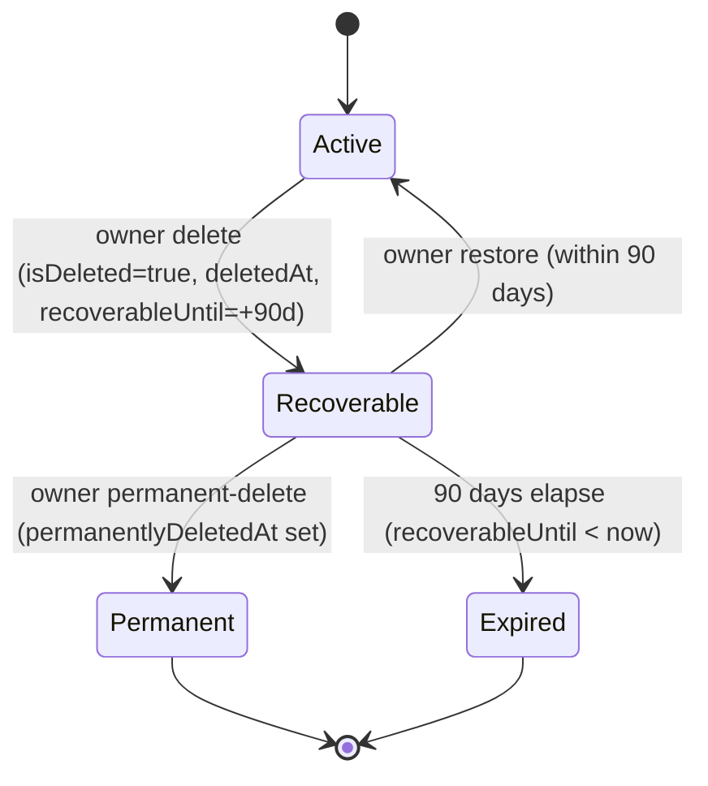

## Overview

Organizations are the tenancy boundary for Propwise CRM. This specification defines how an **organization owner** deletes their workspace, what happens to billing, sessions, real-time connections, and background processing, and how the workspace can be **restored by the owner within a 90-day window** or **permanently removed** earlier.

<Note>
Deletion is a **reversible soft delete**. The organization row stays in the database with `isDeleted = true` and all CRM data intact. There is **no automated hard purge** in this phase.
</Note>

The lifecycle is driven by a single boolean (`isDeleted`) plus four lifecycle timestamps. There is **no separate `status` enum** — this matches the existing `isDeleted: false` queries across the codebase and avoids syncing two fields.

### Key Features

<CardGroup cols={2}>
  <Card title="Immediate Access Revocation" icon="ban">
    All org-scoped sessions revoked; no API call succeeds for that org after delete
  </Card>
  <Card title="Owner Recovery Window" icon="clock">
    90-day self-service recovery period with restore and permanent delete options
  </Card>
  <Card title="Real-time Teardown" icon="disconnect">
    Immediate disconnection of WebSockets, crons, queues, and Meta webhooks
  </Card>
  <Card title="Billing Integration" icon="credit-card">
    Cancel-at-period-end for paid subscriptions with restore capability
  </Card>
</CardGroup>

## Product Decisions

<Warning>
These product decisions are locked and fully implemented.
</Warning>

| Topic | Decision |
| --- | --- |
| **Who can delete** | **Organization owner only** — `organization.owner_id` must match the authenticated user. Requires RBAC **`system.owner`** permission. |
| **Recovery window** | **Self-service** — owner can **Restore** within **90 days** or **Permanently delete** immediately from org picker. |
| **System admin access** | Admin dashboard can **Restore** with **no 90-day limit** and **Delete** any organization. |
| **Billing behavior** | **Cancel at period end** — paid orgs stop auto-renewal; free orgs skip Stripe. |
| **Data retention** | **Soft delete only** — `isDeleted = true` with lifecycle timestamps. No hard purge or status column. |
| **Session handling** | Revoke **all org-scoped sessions** immediately. Restore requires fresh session creation. |
| **Free-org slot** | **Recoverable** org **still occupies** owner's free slot. **Permanent** or **Expired** frees the slot. |

## Lifecycle States and Soft-Delete Model

### State Machine



### State Reference

<AccordionGroup>
  <Accordion title="Active State">
    **Condition:** `isDeleted = false`
    
    - **Owner picker:** Visible + enterable
    - **Members/APIs:** Visible per RBAC
    - **Free slot:** Occupied
    - **Background jobs:** Eligible
  </Accordion>
  
  <Accordion title="Recoverable State">
    **Condition:** `isDeleted = true` AND `permanentlyDeletedAt IS NULL` AND `recoverableUntil >= now`
    
    - **Owner picker:** Visible, **not enterable**, shows Restore + Permanent-delete
    - **Members/APIs:** Hidden everywhere
    - **Free slot:** **Occupied**
    - **Self-service restore:** **Allowed**
    - **Background jobs:** Excluded
  </Accordion>
  
  <Accordion title="Permanent State">
    **Condition:** `isDeleted = true` AND `permanentlyDeletedAt IS NOT NULL`
    
    - **Owner picker:** Hidden
    - **Members/APIs:** Hidden
    - **Free slot:** **Freed**
    - **Self-service restore:** Disabled (support SQL only)
    - **Background jobs:** Excluded
  </Accordion>
  
  <Accordion title="Expired State">
    **Condition:** `isDeleted = true` AND `permanentlyDeletedAt IS NULL` AND `recoverableUntil < now`
    
    - **Owner picker:** Hidden
    - **Members/APIs:** Hidden
    - **Free slot:** **Freed**
    - **Self-service restore:** Disabled (support SQL only)
    - **Background jobs:** Excluded
  </Accordion>
</AccordionGroup>

<Info>
The 90-day boundary is evaluated **at read time** (`recoverableUntil >= now`). No cron flips Recoverable → Expired.
</Info>

## Data Model

### Organization Entity Fields

```typescript
@Entity('organizations')
export class Organization {
  // ... existing fields
  
  @Column('boolean', { default: false })
  isDeleted: boolean;
  
  @Column('timestamp', { nullable: true })
  deletedAt?: Date;
  
  @Column('uuid', { nullable: true })
  deletedBy?: string;
  
  @Column('timestamp', { nullable: true })
  recoverableUntil?: Date;
  
  @Column('timestamp', { nullable: true })
  permanentlyDeletedAt?: Date;
}
```

### Data Invariants

<Check>
**When `isDeleted = false`:** All lifecycle timestamps (`deletedAt`, `deletedBy`, `recoverableUntil`, `permanentlyDeletedAt`) MUST be `NULL`.
</Check>

<Check>
**When `isDeleted = true`:** `deletedAt` and `recoverableUntil` SHOULD be set. `permanentlyDeletedAt` is set only on permanent-delete.
</Check>

## Owner-Initiated Deletion Flow

<Steps>
  <Step title="Authentication & Authorization">
    - Validate `organization.owner_id` matches authenticated user
    - Check RBAC permission `OrgPermissionKey.SYSTEM_OWNER`
    - Verify organization exists and is not already deleted
  </Step>
  
  <Step title="Billing Cancellation">
    - Call `cancelSubscription(organizationId, userId, immediate = false)`
    - Paid subscriptions: stop auto-renewal at period end
    - Free orgs: skip Stripe operations
  </Step>
  
  <Step title="Database Update">
    ```sql
    UPDATE organizations SET
      isDeleted = true,
      deletedAt = NOW(),
      deletedBy = $userId,
      recoverableUntil = NOW() + INTERVAL '90 days'
    WHERE id = $organizationId
    ```
  </Step>
  
  <Step title="Session Revocation">
    - Revoke all org-scoped sessions with reason `ORG_ACCESS_REVOKED`
    - Clear `selectedOrganization` from user sessions
  </Step>
  
  <Step title="Real-time Teardown">
    - Disconnect WebSocket clients in org rooms cluster-wide
    - Pause Meta/WhatsApp webhooks (preserve tokens)
    - Exclude org from cron/queue dispatchers
  </Step>
  
  <Step title="Member Notifications">
    - Send `REMOVED_FROM_ORGANIZATION` notifications to non-owner members
    - Members lose access to organization entirely
  </Step>
  
  <Step title="Event Broadcasting">
    - Emit `OrganizationDeletedEvent` for system-wide handling
  </Step>
</Steps>

## Restore Flow (Self-Service)

<Steps>
  <Step title="Validate Restore Window">
    - Check `isDeleted = true` AND `permanentlyDeletedAt IS NULL`
    - Verify `recoverableUntil >= NOW()` (within 90 days)
    - Confirm user is organization owner
  </Step>
  
  <Step title="Database Restoration">
    ```sql
    UPDATE organizations SET
      isDeleted = false,
      deletedAt = NULL,
      deletedBy = NULL,
      recoverableUntil = NULL,
      permanentlyDeletedAt = NULL
    WHERE id = $organizationId
    ```
  </Step>
  
  <Step title="Billing Reactivation">
    - Resume Stripe subscription if still active
    - Re-enable auto-renewal for paid plans
    - No action needed for free organizations
  </Step>
  
  <Step title="Real-time Reactivation">
    - Re-include org in cron/queue dispatchers
    - Re-subscribe Meta/WhatsApp webhooks
    - Background jobs become eligible again
  </Step>
  
  <Step title="Event Broadcasting">
    - Emit `OrganizationRestoredEvent`
    - Sessions remain revoked (owner must re-select org)
  </Step>
</Steps>

## Permanent Delete Flow

<Warning>
Permanent delete is irreversible via self-service. Only system admin can restore permanently deleted organizations.
</Warning>

<Steps>
  <Step title="Validate Permanent Delete">
    - Organization must be in Recoverable state
    - User must be organization owner
    - No additional checks beyond standard authorization
  </Step>
  
  <Step title="Mark as Permanent">
    ```sql
    UPDATE organizations SET
      permanentlyDeletedAt = NOW()
    WHERE id = $organizationId
    ```
  </Step>
  
  <Step title="Free Organization Slot">
    - Organization no longer counts toward owner's free-org limit
    - Slot becomes available immediately for new organization creation
  </Step>
  
  <Step title="Hide from Owner">
    - Organization disappears from owner's org picker
    - All restore UI elements are removed
  </Step>
</Steps>

## Billing Behavior

### Paid Subscriptions

<Tabs>
  <Tab title="On Delete">
    ```typescript
    await this.subscriptionService.cancelSubscription(
      organizationId, 
      userId, 
      immediate: false // Cancel at period end
    );
    ```
  </Tab>
  
  <Tab title="On Restore">
    ```typescript
    // Resume auto-renewal if Stripe subscription still exists
    if (subscription.status === 'active') {
      await this.subscriptionService.resumeSubscription(organizationId);
    }
    ```
  </Tab>
</Tabs>

### Free Organizations

<Info>
Free organizations skip all Stripe operations during delete and restore flows.
</Info>

- **Delete:** No Stripe API calls
- **Restore:** No billing reactivation needed
- **Slot accounting:** Still applies (Recoverable orgs occupy slot)

## Sessions and Access Control

### Session Revocation

When an organization is deleted, all org-scoped sessions are immediately revoked:

```typescript
await this.sessionService.revokeOrgSessions(
  organizationId, 
  SessionRevocationReason.ORG_ACCESS_REVOKED
);
```

### Auth Guard Behavior

<CodeGroup>
```typescript AuthGuard Hard Stop
// Explicit isDeleted check bypasses cache
if (organization.isDeleted) {
  throw new ForbiddenException('Organization access revoked');
}
```

```typescript Legacy Token Handling
// Immediate check for tokens without orgSessionId
if (!orgSessionId && organization.isDeleted) {
  throw new ForbiddenException('Organization no longer accessible');
}
```
</CodeGroup>

### Restore Session Behavior

<Note>
Restore does **not** un-revoke sessions. The owner must re-select the organization to create fresh sessions.
</Note>

## Member Notifications

Non-owner members receive notifications when an organization is deleted:

```typescript
await this.notificationService.create({
  type: NotificationType.REMOVED_FROM_ORGANIZATION,
  userId: member.id,
  data: {
    organizationName: organization.name,
    removedBy: owner.name,
    reason: 'Organization deleted'
  }
});
```

## Background Jobs and Real-time Systems

### Immediate Teardown

<CardGroup cols={2}>
  <Card title="WebSocket Disconnection" icon="plug">
    Cluster-wide disconnect of all clients in organization rooms
  </Card>
  <Card title="Meta Webhook Pause" icon="pause">
    Pause webhooks while preserving authentication tokens
  </Card>
  <Card title="Cron Exclusion" icon="clock">
    Remove org from all scheduled job dispatchers
  </Card>
  <Card title="Queue Protection" icon="shield">
    Guard in-flight jobs with "is org active" checks
  </Card>
</CardGroup>

### System Integration Points

- **Escalation service:** Excluded from assignment distribution
- **Account health:** Skip health checks and notifications  
- **Portal syndication:** Pause data synchronization
- **Reminder system:** Skip orphan recovery processes

## Free Organization Ownership Cap

The free organization limit considers lifecycle state:

```typescript
// Count Active OR Recoverable owned orgs
const ownedOrgsQuery = this.organizationRepository
  .createQueryBuilder('org')
  .where('org.owner_id = :userId', { userId })
  .andWhere('(org.isDeleted = false OR (org.isDeleted = true AND org.permanentlyDeletedAt IS NULL AND org.recoverableUntil >= NOW()))');

const ownedCount = await ownedOrgsQuery.getCount();
```

<Tip>
**Permanent** or **Expired** organizations free the slot immediately, allowing creation of new organizations.
</Tip>

## API Contract

### Delete Organization

```typescript
DELETE /v1/organizations/:id

// Headers
Authorization: Bearer <identity-token>

// Response (204 No Content)
```

### Restore Organization  

```typescript
POST /v1/organizations/:id/restore

// Headers  
Authorization: Bearer <identity-token>

// Response (200 OK)
{
  "id": "org-uuid",
  "lifecycleState": "active",
  "restoredAt": "2024-01-15T10:30:00Z"
}
```

### Permanent Delete

```typescript
POST /v1/organizations/:id/permanent-delete

// Headers
Authorization: Bearer <identity-token>  

// Response (204 No Content)
```

## System Admin Dashboard

System administrators have extended capabilities beyond the 90-day owner window:

### List Deleted Organizations

```typescript
GET /system-admin/organizations?includeDeleted=true

// Response
{
  "organizations": [
    {
      "id": "org-uuid",
      "name": "Deleted Org",
      "lifecycleState": "recoverable", // or "expired", "permanently_deleted"
      "deletedAt": "2024-01-01T10:00:00Z",
      "deletedBy": {
        "id": "user-uuid", 
        "name": "John Doe"
      },
      "recoverableUntil": "2024-04-01T10:00:00Z",
      "permanentlyDeletedAt": null
    }
  ]
}
```

### Admin Restore (No Time Limit)

<Warning>
System admin restore works on **Recoverable**, **Expired**, or **Permanent** organizations with no restrictions.
</Warning>

```typescript
POST /system-admin/organizations/:id/restore

// Works for any deleted organization regardless of state
```

## Testing Requirements

### Unit Tests

<AccordionGroup>
  <Accordion title="Organization Service Tests">
    - Delete flow with owner verification
    - Billing integration (paid vs free)  
    - Session revocation
    - Restore within window
    - Permanent delete behavior
    - State computation logic
  </Accordion>
  
  <Accordion title="Auth Guard Tests">
    - Deleted org access rejection
    - Legacy token handling
    - Cache bypass scenarios
  </Accordion>
  
  <Accordion title="Free Org Cap Tests">
    - Slot counting with different lifecycle states
    - Permanent delete slot release
    - Mixed state scenarios
  </Accordion>
</AccordionGroup>

### Integration Tests

<Steps>
  <Step title="End-to-End Delete Flow">
    - Owner deletes organization
    - Verify member notifications sent
    - Confirm billing cancellation
    - Test session revocation
  </Step>
  
  <Step title="Restore Scenarios">
    - Self-service restore within window
    - System admin restore beyond window
    - Permanent delete prevention of self-service restore
  </Step>
  
  <Step title="Real-time System Integration">
    - WebSocket disconnection verification
    - Meta webhook pause/resume
    - Background job exclusion
  </Step>
</Steps>

## Implementation Status

<Check>
**Phase 1-7: Complete** - All core functionality implemented including data model, service pipeline, HTTP endpoints, AuthGuard integration, org picker updates, and system admin capabilities.
</Check>

### Module Locations

- **Core logic:** `src/modules/organization/`
- **Billing integration:** `src/modules/subscription/`
- **Session handling:** `src/modules/auth/services/session.service.ts`
- **Real-time systems:** `src/modules/messaging/`, `src/modules/notification/`
- **Background jobs:** `src/modules/crm/escalation/`, `src/modules/crm/distribution/`

### Frontend Components

- **Settings UI:** `src/components/pages/settings/organization-security-extras.tsx`
- **Org picker:** `src/components/pages/organization-selection/`
- **API client:** `src/services/api/organization.api.ts`

## Constants

```typescript
// Lifecycle constants
export const ORGANIZATION_RECOVERY_WINDOW_DAYS = 90;
export const FREE_ORGANIZATION_LIMIT = 1;

// Session revocation reasons
export enum SessionRevocationReason {
  ORG_ACCESS_REVOKED = 'ORG_ACCESS_REVOKED'
}

// Notification types  
export enum NotificationType {
  REMOVED_FROM_ORGANIZATION = 'REMOVED_FROM_ORGANIZATION'
}
```