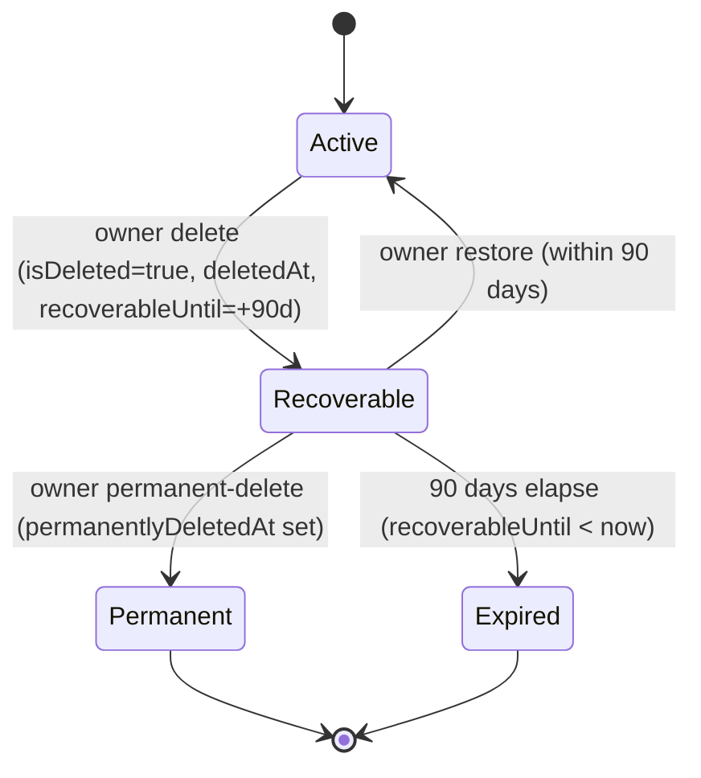

## Overview

Organizations are the tenancy boundary for Propwise CRM. This specification defines how an **organization owner** deletes their workspace, what happens to billing, sessions, real-time connections, and background processing, and how the workspace can be **restored by the owner within a 90-day window** or **permanently removed** earlier.

<Note>
Deletion is a **reversible soft delete**. The organization row stays in the database with `isDeleted = true` and all CRM data intact. There is **no automated hard purge** in this phase.
</Note>

The lifecycle is driven by a single boolean (`isDeleted`) plus four lifecycle timestamps. There is **no separate `status` enum** — this matches the existing `isDeleted: false` queries across the codebase and avoids syncing two fields.

### Key features

1. **Immediate access revocation** — all org-scoped sessions revoked; no API call succeeds for that org after delete
2. **Members lose the org entirely** — removed members can log in but never see the deleted org again
3. **Owner-only 90-day recovery** — only the owner sees the deleted org in the org picker with restore options
4. **Slot accounting** — recoverable orgs still occupy the owner's free-organization slot
5. **Immediate teardown + reactivation** — background services are immediately stopped and reactivated on restore
6. **Billing cancel-at-period-end** — paid subscriptions stop auto-renewal at current period end

## Product decisions

<AccordionGroup>
  <Accordion title="Access control">
    **Organization owner only** — `organization.owner_id` must match the authenticated user. Endpoint also requires RBAC **`system.owner`** (`OrgPermissionKey.SYSTEM_OWNER`) for defense in depth. **Not** system admin via product settings, **not** org Admin (`system.admin` alone is insufficient).
  </Accordion>

  <Accordion title="Recovery mechanisms">
    - **Self-service** — the owner can **Restore** within **90 days** or **Permanently delete** immediately from the org picker
    - **System admin** — can **Restore** with **no 90-day limit** and **Delete** any organization via admin dashboard
    - Beyond 90 days or after permanent-delete, owner self-service restore is disabled
  </Accordion>

  <Accordion title="Billing behavior">
    **Cancel at period end** — `cancelSubscription(organizationId, userId, immediate = false)`. Paid orgs stop auto-renewal at current period end. **Free orgs** (no `stripeSubscriptionId`) skip Stripe with no error. On restore, resume auto-renewal **only if** the Stripe subscription is still alive.
  </Accordion>

  <Accordion title="Data retention">
    **Soft delete only** — `isDeleted = true` plus lifecycle timestamps (`deletedAt`, `deletedBy`, `recoverableUntil`, `permanentlyDeletedAt`). **No** hard purge, **no** `status` column. Permanent-delete keeps the row and only sets `permanentlyDeletedAt`.
  </Accordion>
</AccordionGroup>

## Lifecycle states and soft-delete model

### State machine



### State definitions

| State | Condition (computed) | Owner picker | Members / APIs | Free slot | Self-service restore | Background jobs |
| --- | --- | --- | --- | --- | --- | --- |
| **Active** | `isDeleted = false` | Visible + enterable | Visible per RBAC | Occupied | n/a | Eligible |
| **Recoverable** | `isDeleted = true` AND `permanentlyDeletedAt IS NULL` AND `recoverableUntil >= now` | Visible, **not enterable**, shows Restore + Permanent-delete | Hidden everywhere | **Occupied** | **Allowed** | Excluded |
| **Permanent** | `isDeleted = true` AND `permanentlyDeletedAt IS NOT NULL` | Hidden | Hidden | **Freed** | Disabled (support SQL only) | Excluded |
| **Expired** | `isDeleted = true` AND `permanentlyDeletedAt IS NULL` AND `recoverableUntil < now` | Hidden | Hidden | **Freed** | Disabled (support SQL only) | Excluded |

<Warning>
**Invariants:**
- When `isDeleted = false`: `deletedAt`, `deletedBy`, `recoverableUntil`, `permanentlyDeletedAt` MUST all be `NULL`
- When `isDeleted = true`: `deletedAt` and `recoverableUntil` SHOULD be set
- The 90-day boundary is evaluated **at read time** (`recoverableUntil >= now`). No cron flips Recoverable → Expired
</Warning>

## Data model

The lifecycle is tracked using these fields on the `organization` entity:

```typescript
export class Organization {
  // ... existing fields

  @Column({ name: 'is_deleted', default: false })
  isDeleted: boolean;

  @Column({ name: 'deleted_at', type: 'timestamp', nullable: true })
  deletedAt: Date | null;

  @Column({ name: 'deleted_by', nullable: true })
  deletedBy: string | null;

  @Column({ name: 'recoverable_until', type: 'timestamp', nullable: true })
  recoverableUntil: Date | null;

  @Column({ name: 'permanently_deleted_at', type: 'timestamp', nullable: true })
  permanentlyDeletedAt: Date | null;
}
```

### Computed lifecycle state

The system computes lifecycle state at query time rather than storing it:

```typescript
export function computeLifecycleState(org: Organization): LifecycleState {
  if (!org.isDeleted) return 'active';
  if (org.permanentlyDeletedAt) return 'permanently_deleted';
  if (org.recoverableUntil && new Date() <= org.recoverableUntil) return 'recoverable';
  return 'expired';
}
```

## Owner-initiated deletion flow

<Steps>
  <Step title="Authentication & authorization">
    Verify the authenticated user is the organization owner and has `SYSTEM_OWNER` permission.
  </Step>

  <Step title="Soft delete organization">
    ```typescript
    const deletedAt = new Date();
    const recoverableUntil = new Date(deletedAt.getTime() + 90 * 24 * 60 * 60 * 1000);
    
    await this.organizationRepository.update(organizationId, {
      isDeleted: true,
      deletedAt,
      deletedBy: userId,
      recoverableUntil,
    });
    ```
  </Step>

  <Step title="Cancel billing">
    For paid organizations: `cancelSubscription(organizationId, userId, immediate = false)`
    Free organizations skip Stripe operations.
  </Step>

  <Step title="Revoke sessions">
    Immediately revoke all org-scoped sessions with reason `ORG_ACCESS_REVOKED`.
  </Step>

  <Step title="Real-time teardown">
    - Disconnect all WebSocket clients in organization rooms cluster-wide
    - Pause Meta/WhatsApp webhook subscriptions (non-destructive)
    - Exclude organization from background job dispatchers
  </Step>

  <Step title="Notify members">
    Send `REMOVED_FROM_ORGANIZATION` notifications to all non-owner members.
  </Step>

  <Step title="Clear selected organization">
    Remove the organization from users' `selectedOrganization` field.
  </Step>
</Steps>

## Restore flow (self-service)

<Steps>
  <Step title="Validate restore eligibility">
    - Organization must be in `Recoverable` state
    - User must be the organization owner
    - Within 90-day recovery window
  </Step>

  <Step title="Restore organization">
    ```typescript
    await this.organizationRepository.update(organizationId, {
      isDeleted: false,
      deletedAt: null,
      deletedBy: null,
      recoverableUntil: null,
      permanentlyDeletedAt: null,
    });
    ```
  </Step>

  <Step title="Resume billing">
    Resume Stripe subscription auto-renewal if subscription is still active.
  </Step>

  <Step title="Re-enable background services">
    - Re-include organization in background job dispatchers
    - Re-subscribe Meta/WhatsApp webhooks
    - Background jobs will naturally resume on next dispatch
  </Step>
</Steps>

<Note>
Restore does **not** un-revoke sessions. The owner must re-select the organization to get fresh sessions.
</Note>

## Permanent-delete flow

<Steps>
  <Step title="Validate permanent delete">
    - Organization must be in `Recoverable` state
    - User must be the organization owner
  </Step>

  <Step title="Mark as permanently deleted">
    ```typescript
    await this.organizationRepository.update(organizationId, {
      permanentlyDeletedAt: new Date(),
    });
    ```
    
    Note: `isDeleted` remains `true`, other fields unchanged.
  </Step>

  <Step title="Free organization slot">
    The permanent deletion frees the owner's free-organization slot immediately.
  </Step>
</Steps>

<Warning>
Permanent deletion cannot be undone via self-service. Only system administrators can restore permanently deleted organizations.
</Warning>

## Billing behavior

### Paid organizations

<Tabs>
  <Tab title="On deletion">
    - Call `cancelSubscription(organizationId, userId, immediate = false)`
    - Subscription continues until current period end
    - Auto-renewal is disabled
    - Organization remains accessible until period end
  </Tab>
  
  <Tab title="On restore">
    - Resume auto-renewal if Stripe subscription is still active
    - If subscription expired during deletion period, manual resubscription required
  </Tab>
</Tabs>

### Free organizations

Free organizations skip all Stripe operations during deletion and restore flows.

## Sessions and access

### Access revocation

When an organization is deleted:

1. **All org-scoped sessions** are immediately revoked with reason `ORG_ACCESS_REVOKED`
2. **AuthGuard hard-stop** — all API endpoints check `organization.isDeleted` and reject access
3. **Members lose access** — non-owner members cannot see the organization in any context

### Session handling on restore

<Check>
Sessions are **not** automatically restored. Users must:
1. Re-select the organization from the org picker
2. Generate fresh org-scoped sessions
3. Continue normal operations
</Check>

## Member notifications

Non-owner members receive notifications using the existing `REMOVED_FROM_ORGANIZATION` notification type when an organization is deleted. This provides consistency with the manual member removal flow.

## Background jobs, crons, and queues

### Exclusion mechanism

Background services use a shared "is org active" guard:

```typescript
const activeOrgs = await this.organizationRepository.find({
  where: { isDeleted: false },
  select: ['id']
});
```

### Affected services

- Escalation processing
- Distribution routing  
- Account health checks
- Window expiry notifications
- Portal syndication
- Reminder orphan recovery

<Info>
Queued jobs are **not** purged on deletion. In-flight jobs become no-ops through the shared guard. This prevents data loss and simplifies the implementation.
</Info>

## Real-time teardown: WebSockets and Meta webhooks

### WebSocket handling

<Steps>
  <Step title="Cluster-wide disconnect">
    Use `PostgresIoAdapter` to disconnect all WebSocket clients in organization rooms across all instances.
  </Step>
  
  <Step title="Room cleanup">
    Clear organization-specific rooms and subscriptions.
  </Step>
  
  <Step title="Restore behavior">
    Clients must reconnect and re-authenticate when organization is restored.
  </Step>
</Steps>

### Meta webhook management

<Tabs>
  <Tab title="On deletion">
    - Pause webhook subscriptions (non-destructive)
    - Keep authentication tokens intact
    - Stop processing inbound webhooks for the organization
  </Tab>
  
  <Tab title="On restore">
    - Resume webhook subscriptions
    - Re-enable webhook processing
    - No re-authentication required
  </Tab>
</Tabs>

## Free organization ownership cap

The free organization cap logic accounts for organization lifecycle state:

```typescript
const ownedOrganizations = await this.organizationRepository.find({
  where: { 
    ownerId: userId,
    // Count both Active and Recoverable orgs
    isDeleted: false // Active orgs
  }
});

// Also count Recoverable orgs
const recoverableOrgs = await this.organizationRepository.find({
  where: {
    ownerId: userId,
    isDeleted: true,
    permanentlyDeletedAt: IsNull(),
    recoverableUntil: MoreThanOrEqual(new Date())
  }
});

const totalOwnedOrgs = ownedOrganizations.length + recoverableOrgs.length;
```

<Warning>
A **Recoverable** organization **still occupies** the owner's free slot. Only **Permanent** or **Expired** states free the slot.
</Warning>

## API contract

### Deletion endpoint

```http
DELETE /v1/organizations/:id
Authorization: Bearer <token>
```

**Requirements:**
- User must be organization owner
- User must have `SYSTEM_OWNER` permission
- Organization must be in `Active` state

### Restore endpoint

```http
POST /v1/organizations/:id/restore
Authorization: Bearer <identity-token>
```

**Requirements:**
- Identity token only (no org-scoped token)
- User must be organization owner  
- Organization must be in `Recoverable` state

### Permanent delete endpoint

```http
POST /v1/organizations/:id/permanent-delete
Authorization: Bearer <identity-token>
```

**Requirements:**
- Identity token only (no org-scoped token)
- User must be organization owner
- Organization must be in `Recoverable` state

## System admin dashboard

System administrators have expanded capabilities through the admin dashboard:

### List organizations

```http
GET /system-admin/organizations?includeDeleted=true
```

Returns organizations in all lifecycle states with computed `lifecycleState` field.

### Restore any organization

```http
POST /system-admin/organizations/:id/restore
```

<Check>
System admin restore has **no 90-day limit** and works for Recoverable, Expired, or Permanent states.
</Check>

### Delete any organization

System admin deletion immediately marks organizations as permanent:

```typescript
await this.softDeleteOrganizationInternal(
  organizationId, 
  adminUserId, 
  'ORG_DELETED', 
  { markPermanent: true }
);
```

## Recovery beyond the window

For organizations in `Expired` or `Permanent` state, only system administrators can restore them through direct database operations or the admin dashboard.

<Note>
The system admin dashboard provides a UI for these operations, replacing manual SQL runbooks as the primary recovery mechanism.
</Note>

## Constants

```typescript
export const ORGANIZATION_LIFECYCLE = {
  RECOVERY_WINDOW_DAYS: 90,
  RECOVERY_WINDOW_MS: 90 * 24 * 60 * 60 * 1000,
} as const;

export const SESSION_REVOCATION_REASONS = {
  ORG_ACCESS_REVOKED: 'ORG_ACCESS_REVOKED',
} as const;
```

## Testing requirements

<AccordionGroup>
  <Accordion title="Unit tests">
    - Lifecycle state computation logic
    - Service methods for delete/restore/permanent-delete
    - Access control validation
    - Billing integration
  </Accordion>

  <Accordion title="Integration tests">
    - End-to-end deletion flow
    - Session revocation
    - WebSocket disconnection
    - Meta webhook pause/resume
    - Background job exclusion
  </Accordion>

  <Accordion title="E2E tests">
    - Owner deletion via UI
    - Restore from org picker
    - Member notification delivery
    - Free organization slot accounting
  </Accordion>
</AccordionGroup>

## Implementation status

<Check>
**Fully implemented** across data model, service pipeline, HTTP endpoints, AuthGuard hard-stop, free-org cap, org picker, Danger Zone UI, cross-module WebSocket disconnect, Meta pause/resume, and lifecycle event system.
</Check>

**Module paths:**
- `src/modules/organization/`
- `src/modules/subscription/`
- `src/modules/auth/services/session.service.ts`
- `src/modules/messaging/`
- `src/modules/notification/`
- `src/modules/crm/escalation/`
- `src/modules/crm/distribution/`

**Related frontend:**
- `src/components/pages/settings/organization-security-extras.tsx`
- `src/components/pages/organization-selection/`
- `src/services/api/organization.api.ts`