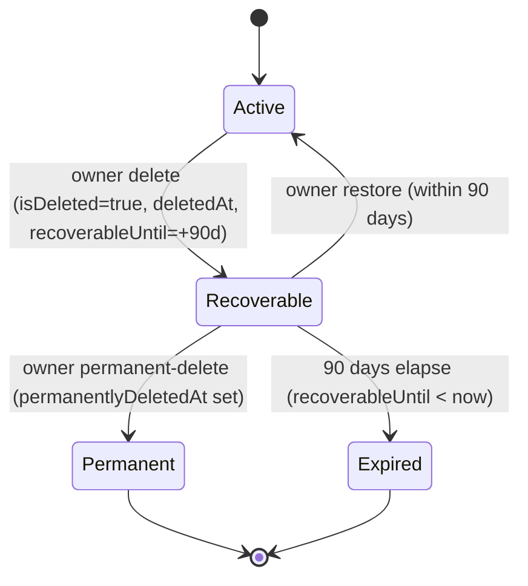

## Overview

Organizations are the tenancy boundary for Propwise CRM. This specification defines how an **organization owner** deletes their workspace, what happens to billing, sessions, real-time connections, and background processing, and how the workspace can be **restored by the owner within a 90-day window** or **permanently removed** earlier.

<Info>
**Status:** Fully implemented (data model, service pipeline, HTTP endpoints, AuthGuard hard-stop, free-org cap, org picker, Danger Zone, cross-module WebSocket disconnect, Meta pause/resume, lifecycle event system)

**Module paths:** `src/modules/organization/`, `src/modules/subscription/`, `src/modules/auth/services/session.service.ts`, `src/modules/messaging/`, `src/modules/notification/`, `src/modules/crm/escalation/`, `src/modules/crm/distribution/`
</Info>

### Key capabilities

Deletion is a **reversible soft delete**. The organization row stays in the database with `isDeleted = true` and all CRM data intact. There is **no automated hard purge** in this phase.

<CardGroup cols={2}>
  <Card title="Immediate Revocation" icon="ban">
    All org-scoped sessions revoked; no API call succeeds for that org after delete
  </Card>
  <Card title="90-Day Recovery" icon="clock-rotate-left">
    Owner can restore within 90 days or permanently delete immediately
  </Card>
  <Card title="Slot Accounting" icon="calculator">
    Recoverable orgs occupy owner's free slot; permanent delete frees it
  </Card>
  <Card title="Real-Time Teardown" icon="power-off">
    Immediate disconnect of WebSockets, pause of Meta webhooks, exclusion from crons
  </Card>
</CardGroup>

---

## Product Decisions

<Note>
All decisions in this section are **locked** and fully implemented.
</Note>

### Core deletion rules

| Topic | Decision |
| --- | --- |
| **Who can delete** | **Organization owner only** — `organization.owner_id` must match the authenticated user. Endpoint also requires RBAC **`system.owner`** for defense in depth. |
| **Recovery (owner)** | **Self-service** — the owner can **Restore** within **90 days** or **Permanently delete** immediately, both from the org picker. |
| **Recovery (system admin)** | The **system admin dashboard** can **Restore** with **no 90-day limit** and can **Delete** any organization using the same full pipeline. |
| **Billing on delete** | **Cancel at period end** — paid orgs stop auto-renewal at current period end. **Free orgs** skip Stripe. |
| **Data after delete** | **Soft delete only** — `isDeleted = true` plus lifecycle timestamps. **No** hard purge, **no** `status` column. |

### Access and visibility

<AccordionGroup>
  <Accordion title="Session handling">
    Revoke **all org-scoped sessions** immediately after the delete transaction commits, with reason `ORG_ACCESS_REVOKED`. Restore does **not** un-revoke sessions; the owner re-selects the org to get fresh sessions.
  </Accordion>

  <Accordion title="Owner visibility">
    The owner **still sees** the deleted org in the picker for 90 days (non-enterable), with Restore + Permanent-delete actions. All other members and all APIs treat it as gone.
  </Accordion>

  <Accordion title="Member UX">
    Notify non-owner members via the existing **`REMOVED_FROM_ORGANIZATION`** notification type (same pattern as `UserService.removeFromOrganization`).
  </Accordion>

  <Accordion title="Free-org slot">
    A **Recoverable** org **still occupies** the owner's free slot. **Permanent** or **Expired** frees the slot.
  </Accordion>
</AccordionGroup>

### Background processing

<Warning>
**Balanced immediate teardown** — disconnect live WebSocket clients in the org rooms cluster-wide, pause + unsubscribe Meta/WhatsApp webhooks (keeping tokens), and exclude the org from all cron/queue dispatchers. Queued jobs are **not** purged; a shared guard makes in-flight/queued jobs no-op. Restore re-includes the org and re-subscribes Meta.
</Warning>

---

## Lifecycle States

The lifecycle is driven by a single boolean (`isDeleted`) plus four lifecycle timestamps. There is **no separate `status` enum** — states are **computed at query time** from `isDeleted`, `permanentlyDeletedAt`, and `recoverableUntil`.

### State machine



### State definitions

<Tabs>
  <Tab title="Active">
    **Condition:** `isDeleted = false`

    - **Owner picker:** Visible + enterable
    - **Members/APIs:** Visible per RBAC
    - **Free slot:** Occupied
    - **Self-service restore:** n/a
    - **Background jobs:** Eligible
  </Tab>

  <Tab title="Recoverable">
    **Condition:** `isDeleted = true` AND `permanentlyDeletedAt IS NULL` AND `recoverableUntil >= now`

    - **Owner picker:** Visible, **not enterable**, shows Restore + Permanent-delete
    - **Members/APIs:** Hidden everywhere
    - **Free slot:** **Occupied**
    - **Self-service restore:** **Allowed**
    - **Background jobs:** Excluded
  </Tab>

  <Tab title="Permanent">
    **Condition:** `isDeleted = true` AND `permanentlyDeletedAt IS NOT NULL`

    - **Owner picker:** Hidden
    - **Members/APIs:** Hidden
    - **Free slot:** **Freed**
    - **Self-service restore:** Disabled (support SQL only)
    - **Background jobs:** Excluded
  </Tab>

  <Tab title="Expired">
    **Condition:** `isDeleted = true` AND `permanentlyDeletedAt IS NULL` AND `recoverableUntil < now`

    - **Owner picker:** Hidden
    - **Members/APIs:** Hidden
    - **Free slot:** **Freed**
    - **Self-service restore:** Disabled (support SQL only)
    - **Background jobs:** Excluded
  </Tab>
</Tabs>

### Data model invariants

<Check>
**When `isDeleted = false`:** `deletedAt`, `deletedBy`, `recoverableUntil`, `permanentlyDeletedAt` MUST all be `NULL`.
</Check>

<Check>
**When `isDeleted = true`:** `deletedAt` and `recoverableUntil` SHOULD be set. `permanentlyDeletedAt` is set only on permanent-delete.
</Check>

<Info>
The 90-day boundary is evaluated **at read time** (`recoverableUntil >= now`). No cron flips Recoverable → Expired.
</Info>

---

## Data Model

### Entity fields

Add the following fields to the `Organization` entity:

```typescript
@Entity('organizations')
export class Organization {
  // Existing fields...

  @Column({ type: 'boolean', default: false, name: 'is_deleted' })
  isDeleted: boolean;

  @Column({ type: 'timestamp', nullable: true, name: 'deleted_at' })
  deletedAt: Date | null;

  @Column({ type: 'uuid', nullable: true, name: 'deleted_by' })
  deletedBy: string | null;

  @Column({ type: 'timestamp', nullable: true, name: 'recoverable_until' })
  recoverableUntil: Date | null;

  @Column({ type: 'timestamp', nullable: true, name: 'permanently_deleted_at' })
  permanentlyDeletedAt: Date | null;
}
```

### Migration

<CodeGroup>
```sql PostgreSQL
-- Add lifecycle columns
ALTER TABLE organizations
  ADD COLUMN is_deleted BOOLEAN NOT NULL DEFAULT false,
  ADD COLUMN deleted_at TIMESTAMP,
  ADD COLUMN deleted_by UUID REFERENCES users(id) ON DELETE SET NULL,
  ADD COLUMN recoverable_until TIMESTAMP,
  ADD COLUMN permanently_deleted_at TIMESTAMP;

-- Index for deleted org queries
CREATE INDEX idx_organizations_deleted_lifecycle 
  ON organizations(is_deleted, recoverable_until, permanently_deleted_at) 
  WHERE is_deleted = true;

-- Index for free-org cap counting
CREATE INDEX idx_organizations_owner_deleted 
  ON organizations(owner_id, is_deleted);
```
</CodeGroup>

### DTOs

<Tabs>
  <Tab title="OrganizationDto">
```typescript
export class OrganizationDto {
  // Existing fields...

  @ApiProperty({ description: 'Whether the organization is soft-deleted' })
  isDeleted: boolean;

  @ApiPropertyOptional({ description: 'Timestamp when deleted' })
  deletedAt?: Date | null;

  @ApiPropertyOptional({ description: 'User ID who deleted the org' })
  deletedBy?: string | null;

  @ApiPropertyOptional({ description: 'Self-service recovery deadline' })
  recoverableUntil?: Date | null;

  @ApiPropertyOptional({ description: 'Timestamp of permanent deletion' })
  permanentlyDeletedAt?: Date | null;

  @ApiPropertyOptional({ 
    description: 'Computed lifecycle state',
    enum: ['active', 'pending_deletion', 'permanently_deleted', 'expired']
  })
  lifecycleState?: string;
}
```
  </Tab>

  <Tab title="AdminOrganizationDto">
```typescript
export class AdminOrganizationDto extends OrganizationDto {
  @ApiProperty({ description: 'Computed lifecycle state for admin' })
  lifecycleState: 'active' | 'recoverable' | 'expired' | 'permanently_deleted';

  @ApiPropertyOptional({ description: 'User who deleted the org' })
  deletedByUser?: {
    id: string;
    name: string;
    email: string;
  };
}
```
  </Tab>
</Tabs>

---

## Owner-Initiated Deletion Flow

### Endpoint

<CodeGroup>
```typescript Request
DELETE /v1/organizations/:id
```

```typescript Guards
@UseGuards(AuthGuard, OrgGuard)
@CheckAccess(OrgPermissionKey.SYSTEM_OWNER)
```
</CodeGroup>

### Implementation flow

<Steps>
  <Step title="Permission check">
    Verify `req.user.id === organization.owner_id` **and** RBAC `system.owner` permission.
  </Step>

  <Step title="Soft delete transaction">
    Call `OrganizationService.softDeleteOrganizationInternal()`:
    
    ```typescript
    {
      isDeleted: true,
      deletedAt: new Date(),
      deletedBy: userId,
      recoverableUntil: addDays(new Date(), 90),
      permanentlyDeletedAt: null
    }
    ```
  </Step>

  <Step title="Cancel billing">
    If `organization.stripeSubscriptionId` exists, call:
    ```typescript
    subscriptionService.cancelSubscription(
      organizationId, 
      userId, 
      immediate: false // cancel at period end
    )
    ```
    
    <Warning>
    Free orgs have no `stripeSubscriptionId` — skip Stripe call, no error.
    </Warning>
  </Step>

  <Step title="Revoke sessions">
    After transaction commits:
    ```typescript
    await sessionService.revokeOrgSessions(
      organizationId,
      SessionRevocationReason.ORG_ACCESS_REVOKED
    );
    ```
  </Step>

  <Step title="Emit event">
    Fire `OrganizationDeletedEvent`:
    ```typescript
    this.eventEmitter.emit(
      ORGANIZATION_EVENTS.DELETED,
      new OrganizationDeletedEvent({
        organizationId,
        deletedBy: userId,
        deletedAt: new Date(),
        recoverableUntil: addDays(new Date(), 90)
      })
    );
    ```
  </Step>

  <Step title="Real-time teardown">
    Event listeners handle:
    - **WebSocket disconnect:** All clients in org rooms (cluster-wide)
    - **Meta pause:** Unsubscribe webhooks, keep tokens
    - **Queue exclusion:** Background jobs skip deleted orgs
  </Step>

  <Step title="Member notifications">
    Send `REMOVED_FROM_ORGANIZATION` notification to all non-owner members.
  </Step>

  <Step title="Clear selected org">
    Clear `selectedOrganization` identity claim for all members.
  </Step>
</Steps>

### Service implementation

```typescript
async softDeleteOrganizationInternal(
  organizationId: string,
  userId: string,
  reason: string,
  options: { markPermanent?: boolean } = {}
): Promise<Organization> {
  const org = await this.findOne(organizationId, { filters: false });
  
  if (org.isDeleted) {
    throw new ConflictException('Organization already deleted');
  }

  const now = new Date();
  
  return this.entityManager.transaction(async (manager) => {
    const updated = await manager.update(
      Organization,
      { id: organizationId },
      {
        isDeleted: true,
        deletedAt: now,
        deletedBy: userId,
        recoverableUntil: options.markPermanent ? null : addDays(now, 90),
        permanentlyDeletedAt: options.markPermanent ? now : null,
      }
    );

    // Cancel billing if applicable
    if (org.stripeSubscriptionId) {
      await this.subscriptionService.cancelSubscription(
        organizationId,
        userId,
        false // cancel at period end
      );
    }

    // Revoke sessions after commit
    await this.sessionService.revokeOrgSessions(
      organizationId,
      SessionRevocationReason.ORG_ACCESS_REVOKED
    );

    // Emit event for listeners
    this.eventEmitter.emit(
      ORGANIZATION_EVENTS.DELETED,
      new OrganizationDeletedEvent({
        organizationId,
        deletedBy: userId,
        deletedAt: now,
        recoverableUntil: options.markPermanent ? null : addDays(now, 90),
      })
    );

    return updated;
  });
}
```

---

## Restore Flow (Self-Service)

### Endpoint

<CodeGroup>
```typescript Request
POST /v1/organizations/:id/restore
```

```typescript Guards
@UseGuards(IdentityTokenGuard)
@IdentityTokenOnly()
```
</CodeGroup>

<Warning>
**Identity-token-only:** Uses `IdentityTokenGuard` (not `AuthGuard`) to allow restore when no valid org-scoped session exists. Must be the owner.
</Warning>

### Implementation flow

<Steps>
  <Step title="Load organization">
    Fetch org with `{ filters: false }` to include deleted orgs.
  </Step>

  <Step title="Validate ownership">
    Verify `req.user.id === organization.owner_id`.
  </Step>

  <Step title="Check restore eligibility">
    ```typescript
    if (org.permanentlyDeletedAt) {
      throw new ForbiddenException(
        'Organization permanently deleted, contact support'
      );
    }
    
    if (org.recoverableUntil < now) {
      throw new ForbiddenException(
        'Recovery window expired, contact support'
      );
    }
    ```
  </Step>

  <Step title="Restore transaction">
    Call `OrganizationService.restoreOrganizationInternal()`:
    ```typescript
    {
      isDeleted: false,
      deletedAt: null,
      deletedBy: null,
      recoverableUntil: null,
      permanentlyDeletedAt: null
    }
    ```
  </Step>

  <Step title="Resume billing">
    If `stripeSubscriptionId` exists and subscription is still alive:
    ```typescript
    await subscriptionService.resumeSubscription(
      organizationId,
      userId
    );
    ```
    
    <Info>
    If Stripe subscription was cancelled and expired, do **not** error — owner must resubscribe manually.
    </Info>
  </Step>

  <Step title="Emit event">
    Fire `OrganizationRestoredEvent` for listeners to:
    - Re-include org in background job dispatchers
    - Re-subscribe Meta webhooks
    - Re-activate scheduled tasks
  </Step>
</Steps>

### Service implementation

```typescript
async restoreOrganizationInternal(
  organizationId: string,
  userId: string,
  options: { enforceWindow?: boolean } = { enforceWindow: true }
): Promise<Organization> {
  const org = await this.findOne(organizationId, { filters: false });
  
  if (!org.isDeleted) {
    throw new BadRequestException('Organization not deleted');
  }

  // Enforce 90-day window for owner self-service
  if (options.enforceWindow) {
    if (org.permanentlyDeletedAt) {
      throw new ForbiddenException(
        'Organization permanently deleted, contact support'
      );
    }
    
    if (org.recoverableUntil && org.recoverableUntil < new Date()) {
      throw new ForbiddenException(
        'Recovery window expired, contact support'
      );
    }
  }

  return this.entityManager.transaction(async (manager) => {
    const updated = await manager.update(
      Organization,
      { id: organizationId },
      {
        isDeleted: false,
        deletedAt: null,
        deletedBy: null,
        recoverableUntil: null,
        permanentlyDeletedAt: null,
      }
    );

    // Resume billing if subscription exists
    if (org.stripeSubscriptionId) {
      try {
        await this.subscriptionService.resumeSubscription(
          organizationId,
          userId
        );
      } catch (error) {
        this.logger.warn(
          `Could not resume subscription for org ${organizationId}: ${error.message}`
        );
        // Don't fail restore - owner can resubscribe manually
      }
    }

    // Emit event
    this.eventEmitter.emit(
      ORGANIZATION_EVENTS.RESTORED,
      new OrganizationRestoredEvent({
        organizationId,
        restoredBy: userId,
        restoredAt: new Date(),
      })
    );

    return updated;
  });
}
```

---

## Permanent Delete Flow

### Endpoint

<CodeGroup>
```typescript Request
POST /v1/organizations/:id/permanent-delete
```

```typescript Guards
@UseGuards(IdentityTokenGuard)
@IdentityTokenOnly()
```
</CodeGroup>

### Implementation

<Warning>
**Immediate slot release:** Sets `permanentlyDeletedAt` while keeping `isDeleted = true`. The row stays in the database but the org is hidden from the owner picker and frees the free-org slot.
</Warning>

<Steps>
  <Step title="Validate state">
    Organization must be `isDeleted = true` and `permanentlyDeletedAt IS NULL` (Recoverable state).
  </Step>

  <Step title="Update timestamp">
    ```typescript
    await manager.update(
      Organization,
      { id: organizationId },
      { permanentlyDeletedAt: new Date() }
    );
    ```
  </Step>

  <Step title="No additional teardown">
    All sessions, WebSockets, and Meta webhooks were already torn down during initial soft delete. No additional work needed.
  </Step>
</Steps>

```typescript
async permanentlyDeleteOrganization(
  organizationId: string,
  userId: string
): Promise<void> {
  const org = await this.findOne(organizationId, { filters: false });
  
  if (!org.isDeleted) {
    throw new BadRequestException('Organization must be deleted first');
  }
  
  if (org.permanentlyDeletedAt) {
    throw new ConflictException('Organization already permanently deleted');
  }

  await this.entityManager.update(
    Organization,
    { id: organizationId },
    { permanentlyDeletedAt: new Date() }
  );

  this.logger.log(
    `Organization ${organizationId} permanently deleted by ${userId}`
  );
}
```

---

## Billing Behavior

### Paid subscriptions

<Steps>
  <Step title="On delete">
    Call Stripe `subscriptions.update()` with `cancel_at_period_end: true`. Subscription continues until current period ends.
  </Step>

  <Step title="On restore (within period)">
    Call Stripe `subscriptions.update()` with `cancel_at_period_end: false` to resume auto-renewal.
  </Step>

  <Step title="On restore (after period ended)">
    Subscription is already cancelled in Stripe. Log warning and continue — owner must resubscribe manually via billing page.
  </Step>
</Steps>

### Free subscriptions

<Info>
Free orgs have no `stripeSubscriptionId`. Skip all Stripe calls — no error, no billing changes.
</Info>

### Stripe webhook handling

<Warning>
**Critical:** Stripe webhooks (`invoice.payment_failed`, `customer.subscription.deleted`, etc.) must check `organization.isDeleted` and **skip processing** for deleted orgs. Otherwise webhooks may fail or create inconsistent state.
</Warning>

```typescript
// In webhook handlers
const org = await this.orgService.findOne(organizationId, { filters: false });

if (org.isDeleted) {
  this.logger.log(
    `Skipping webhook ${event.type} for deleted org ${organizationId}`
  );
  return; // Ack webhook, do nothing
}
```

---

## Sessions and Access Control

### Session revocation

<Steps>
  <Step title="Immediate revocation">
    On organization delete, revoke **all org-scoped sessions** with reason `ORG_ACCESS_REVOKED`:
    ```typescript
    await sessionService.revokeOrgSessions(
      organizationId,
      SessionRevocationReason.ORG_ACCESS_REVOKED
    );
    ```
  </Step>

  <Step title="API enforcement">
    The `AuthGuard` checks `organization.isDeleted` on every request:
    - **Liveness cache miss:** Explicitly load org with `{ filters: false }` and check `isDeleted`
    - **Legacy tokens:** For tokens without `orgSessionId`, load org and reject if deleted
  </Step>

  <Step title="On restore">
    Restore does **not** un-revoke sessions. The owner must re-select the org in the picker to create fresh sessions.
  </Step>
</Steps>

### AuthGuard implementation

```typescript
// In AuthGuard after session validation
if (session.organizationId) {
  const org = await this.orgService.findOne(
    session.organizationId,
    { filters: false } // include deleted
  );

  if (org.isDeleted) {
    throw new UnauthorizedException(
      'Organization access revoked',
      ErrorCode.ORG_ACCESS_REVOKED
    );
  }
}
```

### API access patterns

<Tabs>
  <Tab title="Org-scoped endpoints">
    **Behavior:** All org-scoped endpoints (`/v1/organizations/:id/*`) fail with `ORG_ACCESS_REVOKED` for deleted orgs due to `AuthGuard` check.
    
    <Check>
    No additional code needed in controllers — handled at guard level.
    </Check>
  </Tab>

  <Tab title="Identity endpoints">
    **Behavior:** Identity endpoints (user profile, org list) succeed but deleted orgs are **excluded** from results unless the user is the owner (for Recoverable orgs only).
  </Tab>

  <Tab title="System admin endpoints">
    **Behavior:** System admin endpoints use `{ filters: false }` to include deleted orgs. Lifecycle state is computed and exposed in DTOs.
  </Tab>
</Tabs>

---

## Member Notifications

### Notification type

<Info>
Reuse the existing **`REMOVED_FROM_ORGANIZATION`** notification type (same as `UserService.removeFromOrganization`). This notification already has copy and frontend handling.
</Info>

### Implementation

```typescript
// After organization delete transaction
const members = await this.userService.findByOrganization(organizationId, {
  excludeUserId: userId // don't notify the owner who deleted it
});

for (const member of members) {
  await this.notificationService.create({
    userId: member.id,
    type: NotificationType.REMOVED_FROM_ORGANIZATION,
    title: 'Organization deleted',
    message: `The organization "${org.name}" has been deleted by the owner.`,
    data: {
      organizationId: org.id,
      organizationName: org.name,
      deletedBy: userId,
    },
  });
}
```

### Frontend behavior

<Check>
Frontend already handles `REMOVED_FROM_ORGANIZATION` by showing a notification and removing the org from the user's org list. No additional work required.
</Check>

---

## Background Jobs, Crons, and Queues

### Design principle

<Note>
**Balanced teardown:** Immediately exclude deleted orgs from dispatchers/schedulers but **do not purge** already-queued jobs. In-flight and queued jobs gracefully no-op using a shared "is org active" guard.
</Note>

### Implementation pattern

<Steps>
  <Step title="Dispatcher exclusion">
    All cron jobs and schedulers that iterate orgs add `isDeleted: false` to the query:
    ```typescript
    const orgs = await this.orgRepo.find({
      where: { isDeleted: false },
    });
    ```
  </Step>

  <Step title="Job guard">
    Individual job processors check org state:
    ```typescript
    async processJob(job: { organizationId: string }) {
      const org = await this.orgService.findOne(
        job.organizationId,
        { filters: false }
      );

      if (org.isDeleted) {
        this.logger.log(`Skipping job for deleted org ${org.id}`);
        return; // Ack job, do nothing
      }

      // Proceed with job
    }
    ```
  </Step>

  <Step title="On restore">
    `OrganizationRestoredEvent` listeners re-include the org in the next scheduler cycle. No manual re-queue needed.
  </Step>
</Steps>

### Modules requiring updates

<AccordionGroup>
  <Accordion title="Escalation cron">
    **Path:** `src/modules/crm/escalation/`
    
    **Change:** Dispatcher queries only active orgs; `escalate()` checks `org.isDeleted`.
  </Accordion>

  <Accordion title="Distribution cron">
    **Path:** `src/modules/crm/distribution/`
    
    **Change:** Dispatcher queries only active orgs; `distribute()` checks `org.isDeleted`.
  </Accordion>

  <Accordion title="Account health scheduler">
    **Path:** `src/modules/crm/account-health/`
    
    **Change:** Include `isDeleted: false` in org query.
  </Accordion>

  <Accordion title="Reminder orphan recovery">
    **Path:** `src/modules/notification/reminder/`
    
    **Change:** Include `isDeleted: false` in org query.
  </Accordion>

  <Accordion title="Portal syndication">
    **Path:** `src/modules/portal/syndication/`
    
    **Change:** Include `isDeleted: false` in org query; syndication jobs check org state.
  </Accordion>

  <Accordion title="Window expiry cron">
    **Path:** `src/modules/organization/`
    
    **Change:** Query `isDeleted: true` and `recoverableUntil < now` to process expired orgs (log only, no state mutation).
  </Accordion>
</AccordionGroup>

---

## Real-Time Teardown

### WebSocket disconnect

<Warning>
**Cluster-wide disconnect:** Use `PostgresIoAdapter.disconnectClientsInOrg(organizationId)` to disconnect all WebSocket clients across all instances in the org's rooms.
</Warning>

#### Event listener

```typescript
@OnEvent(ORGANIZATION_EVENTS.DELETED)
async handleOrganizationDeleted(event: OrganizationDeletedEvent) {
  const { organizationId } = event;

  // Disconnect all WebSocket clients in org rooms
  await this.postgresIoAdapter.disconnectClientsInOrg(organizationId);

  this.logger.log(
    `Disconnected WebSocket clients for deleted org ${organizationId}`
  );
}
```

#### Adapter method

```typescript
// In PostgresIoAdapter
async disconnectClientsInOrg(organizationId: string): Promise<void> {
  // Publish cluster-wide message
  await this.pubClient.publish(
    'socket:org-disconnect',
    JSON.stringify({ organizationId })
  );
}

// Subscriber handler
private setupSubscriptions() {
  this.subClient.subscribe('socket:org-disconnect');
  
  this.subClient.on('message', (channel, message) => {
    if (channel === 'socket:org-disconnect') {
      const { organizationId } = JSON.parse(message);
      this.localDisconnectOrg(organizationId);
    }
  });
}

private localDisconnectOrg(organizationId: string) {
  const rooms = [`org:${organizationId}`, `org:${organizationId}:*`];
  
  for (const room of rooms) {
    this.io.in(room).disconnectSockets();
  }
}
```

### Meta webhook pause

<Info>
**Non-destructive pause:** Unsubscribe webhooks but **keep tokens and account credentials**. On restore, re-subscribe using existing configuration.
</Info>

#### Event listener

```typescript
@OnEvent(ORGANIZATION_EVENTS.DELETED)
async handleOrganizationDeleted(event: OrganizationDeletedEvent) {
  const { organizationId } = event;

  // Pause all Meta channel accounts
  await this.metaService.pauseOrgWebhooks(organizationId);

  this.logger.log(
    `Paused Meta webhooks for deleted org ${organizationId}`
  );
}

@OnEvent(ORGANIZATION_EVENTS.RESTORED)
async handleOrganizationRestored(event: OrganizationRestoredEvent) {
  const { organizationId } = event;

  // Resume all Meta channel accounts
  await this.metaService.resumeOrgWebhooks(organizationId);

  this.logger.log(
    `Resumed Meta webhooks for restored org ${organizationId}`
  );
}
```

#### Service implementation

```typescript
async pauseOrgWebhooks(organizationId: string): Promise<void> {
  const accounts = await this.channelAccountRepo.find({
    where: {
      organizationId,
      type: ChannelType.META,
    },
  });

  for (const account of accounts) {
    try {
      await this.metaClient.unsubscribeWebhook(
        account.phoneNumberId,
        account.accessToken
      );

      await this.channelAccountRepo.update(account.id, {
        webhookActive: false,
      });
    } catch (error) {
      this.logger.error(
        `Failed to pause webhook for account ${account.id}: ${error.message}`
      );
      // Continue with other accounts
    }
  }
}

async resumeOrgWebhooks(organizationId: string): Promise<void> {
  const accounts = await this.channelAccountRepo.find({
    where: {
      organizationId,
      type: ChannelType.META,
      webhookActive: false,
    },
  });

  for (const account of accounts) {
    try {
      await this.metaClient.subscribeWebhook(
        account.phoneNumberId,
        account.accessToken,
        ['messages']
      );

      await this.channelAccountRepo.update(account.id, {
        webhookActive: true,
      });
    } catch (error) {
      this.logger.error(
        `Failed to resume webhook for account ${account.id}: ${error.message}`
      );
      // Continue with other accounts
    }
  }
}
```

#### Inbound webhook gating

```typescript
// In Meta webhook controller
@Post('/webhooks/meta/:phoneNumberId')
async handleMetaWebhook(
  @Param('phoneNumberId') phoneNumberId: string,
  @Body() payload: MetaWebhookPayload
) {
  const account = await this.channelAccountService.findByPhoneNumberId(
    phoneNumberId
  );

  const org = await this.orgService.findOne(account.organizationId, {
    filters: false,
  });

  if (org.isDeleted) {
    this.logger.log(
      `Ignoring webhook for deleted org ${org.id}, phoneNumberId ${phoneNumberId}`
    );
    return { status: 'ignored' }; // 200 OK to ack webhook
  }

  // Process webhook
  await this.messagingService.processMetaWebhook(payload);
}
```

---

## Free Organization Ownership Cap

### Counting logic

<Warning>
**Recoverable orgs occupy the slot:** Count both Active **and** Recoverable owned orgs. Only Permanent or Expired orgs free the slot.
</Warning>

```typescript
async countOwnedFreeOrganizations(userId: string): Promise<number> {
  const orgs = await this.orgRepo.find({
    where: { owner_id: userId },
    // Don't use default filters - need to count deleted orgs
  });

  return orgs.filter((org) => {
    // Free orgs only
    if (org.stripeSubscriptionId) return false;

    // Active orgs count
    if (!org.isDeleted) return true;

    // Recoverable orgs count
    if (!org.permanentlyDeletedAt && org.recoverableUntil >= new Date()) {
      return true;
    }

    // Permanent and Expired don't count
    return false;
  }).length;
}
```

### Enforcement

```typescript
async createOrganization(dto: CreateOrganizationDto, userId: string) {
  const existingCount = await this.countOwnedFreeOrganizations(userId);

  if (existingCount >= FREE_ORG_LIMIT) {
    throw new ForbiddenException(
      `You have reached the limit of ${FREE_ORG_LIMIT} free organizations. ` +
      `Please upgrade an existing organization or permanently delete a recoverable one.`
    );
  }

  // Proceed with creation
}
```

---

## API Contract

### Owner endpoints

<CodeGroup>
```typescript Delete
DELETE /v1/organizations/:id

Guards: AuthGuard, OrgGuard, @CheckAccess(SYSTEM_OWNER)
Checks: req.user.id === organization.owner_id

Response: 204 No Content

Errors:
- 401: Unauthorized (not authenticated)
- 403: Forbidden (not owner or missing SYSTEM_OWNER)
- 404: Organization not found
- 409: Already deleted
```

```typescript Restore
POST /v1/organizations/:id/restore

Guards: IdentityTokenGuard, @IdentityTokenOnly()
Checks: req.user.id === organization.owner_id

Response: 200 OK
Body: OrganizationDto

Errors:
- 401: Unauthorized (not authenticated)
- 403: Forbidden (not owner, permanent, or expired)
- 404: Organization not found
- 400: Not deleted
```

```typescript Permanent Delete
POST /v1/organizations/:id/permanent-delete

Guards: IdentityTokenGuard, @IdentityTokenOnly()
Checks: req.user.id === organization.owner_id

Response: 204 No Content

Errors:
- 401: Unauthorized (not authenticated)
- 403: Forbidden (not owner)
- 404: Organization not found
- 400: Not deleted or already permanent
```
</CodeGroup>

### System admin endpoints

<CodeGroup>
```typescript List (with deleted)
GET /system-admin/organizations?includeDeleted=true

Response: 200 OK
Body: {
  items: AdminOrganizationDto[];
  total: number;
}

AdminOrganizationDto includes:
- lifecycleState: 'active' | 'recoverable' | 'expired' | 'permanently_deleted'
- deletedAt, deletedBy, recoverableUntil, permanentlyDeletedAt
- deletedByUser: { id, name, email }
```

```typescript Restore (no time limit)
POST /system-admin/organizations/:id/restore

Response: 200 OK
Body: AdminOrganizationDto

Note: Can restore Recoverable, Expired, OR Permanent orgs
      (enforceWindow: false)
```

```typescript Delete (same pipeline)
DELETE /system-admin/organizations/:id?permanent=true

Response: 204 No Content

Note: Uses softDeleteOrganizationInternal with markPermanent flag
```
</CodeGroup>

---

## Frontend UX

### Organization picker

<Steps>
  <Step title="Query behavior">
    `GET /v1/organizations/me` returns:
    - **All members:** Active orgs only
    - **Owners:** Active orgs + their own Recoverable orgs (with `lifecycleState: 'pending_deletion'`)
  </Step>

  <Step title="Visual treatment">
    Recoverable orgs shown with:
    - Dimmed styling
    - "Pending deletion" badge
    - Non-clickable (cannot enter)
    - Restore button
    - Permanent delete button
  </Step>

  <Step title="Restore flow">
    ```typescript
    onClick={() => {
      await organizationApi.restore(org.id);
      toast.success('Organization restored');
      refetch(); // Reload org list
    }}
    ```
  </Step>

  <Step title="Permanent delete flow">
    ```typescript
    onClick={() => {
      if (!confirm('Permanently delete? This cannot be undone.')) return;
      await organizationApi.permanentDelete(org.id);
      toast.success('Organization permanently deleted');
      refetch(); // Reload org list
    }}
    ```
  </Step>
</Steps>

### Settings danger zone

<Warning>
**Organization owner only** — the "Delete organization" button is shown only if `currentUser.id === organization.owner_id`.
</Warning>

#### Component location

```
src/components/pages/settings/organization-security-extras.tsx
```

#### UI flow

<Steps>
  <Step title="Initial state">
    "Delete organization" button with icon (destructive styling).
  </Step>

  <Step title="Confirmation modal">
    On click, show modal with:
    - Warning about data loss and member access
    - "Type the organization name to confirm" input
    - "90-day recovery window" notice
    - Confirm button (disabled until name matches)
  </Step>

  <Step title="Deletion">
    ```typescript
    await organizationApi.delete(organizationId);
    toast.success('Organization deleted. You can restore it within 90 days.');
    router.push('/organizations'); // Redirect to org picker
    ```
  </Step>
</Steps>

---

## Recovery Beyond the Window

### Support runbook

<Note>
When a user requests recovery of an **Expired** or **Permanent** org, support staff use the **system admin dashboard** (not manual SQL) to restore it.
</Note>

<Steps>
  <Step title="Verify request">
    Confirm the user is the organization owner and has legitimate reason for recovery.
  </Step>

  <Step title="Open system admin dashboard">
    Navigate to System Admin → Organizations. Filter for deleted orgs (`includeDeleted=true`).
  </Step>

  <Step title="Locate organization">
    Search by organization name or owner email. Check `lifecycleState` (should be `expired` or `permanently_deleted`).
  </Step>

  <Step title="Restore via dashboard">
    Click "Restore" button. The dashboard uses the restore endpoint with `enforceWindow: false`, which bypasses the 90-day check.
  </Step>

  <Step title="Notify user">
    Email the user that their organization has been restored and they should re-select it in the org picker.
  </Step>
</Steps>

### SQL fallback (deprecated)

<Warning>
**Use the system admin dashboard instead.** Manual SQL is retained only for emergency scenarios where the dashboard is unavailable.
</Warning>

<Accordion title="Emergency SQL restore (use dashboard instead)">
```sql
-- Verify org state
SELECT 
  id, 
  name, 
  owner_id,
  is_deleted,
  permanently_deleted_at,
  recoverable_until
FROM organizations
WHERE id = '<org-id>';

-- Restore (if confirmed by support manager)
UPDATE organizations
SET 
  is_deleted = false,
  deleted_at = NULL,
  deleted_by = NULL,
  recoverable_until = NULL,
  permanently_deleted_at = NULL
WHERE id = '<org-id>';

-- Log the action
INSERT INTO audit_log (
  event_type,
  entity_type,
  entity_id,
  performed_by,
  metadata,
  created_at
) VALUES (
  'ORGANIZATION_RESTORED_BY_SUPPORT',
  'organization',
  '<org-id>',
  '<support-user-id>',
  '{"reason": "Customer request via ticket #12345", "original_owner": "<owner-id>"}',
  NOW()
);
```

**Post-restore:** Manually emit `OrganizationRestoredEvent` or restart background workers to re-include the org.
</Accordion>

---

## System Admin Dashboard

### List organizations

<Tabs>
  <Tab title="Request">
```typescript
GET /system-admin/organizations?includeDeleted=true&page=1&limit=50

Headers:
  Authorization: Bearer <system-admin-token>
```
  </Tab>

  <Tab title="Response">
```json
{
  "items": [
    {
      "id": "org-123",
      "name": "Acme Corp",
      "ownerId": "user-456",
      "lifecycleState": "recoverable",
      "isDeleted": true,
      "deletedAt": "2025-01-15T10:30:00Z",
      "deletedBy": "user-456",
      "deletedByUser": {
        "id": "user-456",
        "name": "John Doe",
        "email": "john@acme.com"
      },
      "recoverableUntil": "2025-04-15T10:30:00Z",
      "permanentlyDeletedAt": null
    }
  ],
  "total": 1,
  "page": 1,
  "limit": 50
}
```
  </Tab>
</Tabs>

### Restore organization (no time limit)

<CodeGroup>
```typescript Request
POST /system-admin/organizations/:id/restore

Headers:
  Authorization: Bearer <system-admin-token>
```

```typescript Implementation
async restoreOrganizationAdmin(
  organizationId: string,
  adminUserId: string
): Promise<Organization> {
  // No 90-day check - admin can restore any deleted org
  return this.organizationService.restoreOrganizationInternal(
    organizationId,
    adminUserId,
    { enforceWindow: false } // KEY: bypasses time check
  );
}
```
</CodeGroup>

### Delete organization (same pipeline)

<CodeGroup>
```typescript Request
DELETE /system-admin/organizations/:id?permanent=true

Headers:
  Authorization: Bearer <system-admin-token>
```

```typescript Implementation
async deleteOrganizationAdmin(
  organizationId: string,
  adminUserId: string,
  permanent = false
): Promise<void> {
  // Uses same pipeline as owner delete
  return this.organizationService.softDeleteOrganizationInternal(
    organizationId,
    adminUserId,
    'ADMIN_DELETED',
    { markPermanent: permanent }
  );
}
```
</CodeGroup>

---

## Explicit Non-Goals

<Note>
These features are **intentionally excluded** from the initial implementation and may be added in future phases.
</Note>

### Data hard purge

<CardGroup cols={2}>
  <Card title="Automated purge" icon="ban">
    No cron job to hard-delete database rows at any time (90 days, 1 year, etc.). All deleted orgs remain in the database indefinitely.
  </Card>
  <Card title="GDPR tooling" icon="ban">
    No "right to be forgotten" automated compliance. GDPR requests handled manually via support ticket and direct SQL.
  </Card>
</CardGroup>

### Member-initiated actions

- **Member restore:** Only the owner (or system admin) can restore. Non-owner members cannot request or trigger restore.
- **Member permanent-delete:** Only the owner (or system admin) can permanently delete. Members cannot accelerate permanent deletion.

### Granular lifecycle states

- **No `status` enum:** States are computed from `isDeleted` + timestamps. No separate database column.
- **No sub-states:** No "deletion in progress" or "billing cancellation pending" states. Deletion is synchronous.

### Advanced billing

- **No prorated refunds:** Cancel-at-period-end means no automatic refund. Owner can contact support for manual refund.
- **No subscription freeze:** No concept of pausing a subscription while keeping the org active. It's either active with billing or deleted with cancel-at-period-end.

### Real-time guarantees

- **No in-flight job cancellation:** Queued jobs are not actively cancelled; they no-op when they run.
- **No WebSocket reconnection:** On restore, clients must manually refresh/reconnect. No automatic push.

---

## Constants

```typescript
// src/modules/organization/organization.constants.ts

export const ORGANIZATION_LIFECYCLE = {
  /** Number of days owner can self-service restore */
  RECOVERY_WINDOW_DAYS: 90,

  /** Maximum free organizations an owner can have (Active + Recoverable) */
  FREE_ORG_LIMIT: 3,
} as const;

export const ORGANIZATION_EVENTS = {
  DELETED: 'organization.deleted',
  RESTORED: 'organization.restored',
} as const;
```

---

## Testing Requirements

### Unit tests

<AccordionGroup>
  <Accordion title="OrganizationService.softDeleteOrganizationInternal">
    - Sets all lifecycle fields correctly
    - Calls subscription cancel (paid) or skips (free)
    - Emits `OrganizationDeletedEvent`
    - Throws if already deleted
  </Accordion>

  <Accordion title="OrganizationService.restoreOrganizationInternal">
    - Clears all lifecycle fields
    - Resumes subscription (if exists)
    - Emits `OrganizationRestoredEvent`
    - Enforces 90-day window when `enforceWindow: true`
    - Bypasses window when `enforceWindow: false`
    - Throws if not deleted, permanent, or expired (when enforcing)
  </Accordion>

  <Accordion title="OrganizationService.permanentlyDeleteOrganization">
    - Sets `permanentlyDeletedAt`
    - Throws if not deleted or already permanent
  </Accordion>

  <Accordion title="Free-org counting">
    - Counts Active + Recoverable owned orgs
    - Excludes Permanent and Expired
    - Filters to free orgs only
  </Accordion>
</AccordionGroup>

### Integration tests

<Steps>
  <Step title="Full delete flow">
    1. Owner deletes org
    2. Verify billing cancelled (if paid)
    3. Verify sessions revoked
    4. Verify event emitted
    5. Verify members notified
    6. Try API call → expect 401 `ORG_ACCESS_REVOKED`
  </Step>

  <Step title="Restore within 90 days">
    1. Owner restores deleted org
    2. Verify lifecycle fields cleared
    3. Verify billing resumed (if subscription alive)
    4. Verify event emitted
    5. Owner re-selects org → expect fresh session
  </Step>

  <Step title="Permanent delete">
    1. Owner permanently deletes deleted org
    2. Verify `permanentlyDeletedAt` set
    3. Verify org hidden from picker
    4. Verify free slot freed
    5. Owner restore attempt → expect 403
  </Step>

  <Step title="90-day expiry">
    1. Mock `recoverableUntil` in past
    2. Owner restore attempt → expect 403
    3. Verify org hidden from picker
    4. Verify free slot freed
  </Step>
</Steps>

### E2E tests

<Tabs>
  <Tab title="Owner journey">
    1. Login as owner
    2. Navigate to Settings → Danger Zone
    3. Delete organization
    4. Redirect to org picker → see org as "Pending deletion"
    5. Click Restore → org returns to Active
    6. Delete again → click Permanent Delete → org disappears
  </Tab>

  <Tab title="Member journey">
    1. Login as member (non-owner)
    2. Owner deletes org (via API)
    3. Member sees notification "Removed from organization"
    4. Org disappears from member's org list
    5. Member attempts API call → expect 401
  </Tab>

  <Tab title="System admin journey">
    1. Login as system admin
    2. Navigate to Admin → Organizations
    3. Filter for deleted orgs
    4. Click Restore on expired org → succeeds
    5. Click Delete on active org with permanent flag → org permanently deleted
  </Tab>
</Tabs>

---

## Implementation Checklist

<Steps>
  <Step title="Phase 1: Data model (DONE)">
    <Check>Migration with lifecycle columns + indexes</Check>
    <Check>Entity fields in `Organization`</Check>
    <Check>DTO fields in `OrganizationDto` and `AdminOrganizationDto`</Check>
    <Check>Event classes in `organization.events.ts`</Check>
  </Step>

  <Step title="Phase 2: Delete pipeline (DONE)">
    <Check>Shared `softDeleteOrganizationInternal` service method</Check>
    <Check>Billing cancel (paid) or skip (free)</Check>
    <Check>Session revocation after commit</Check>
    <Check>Member notifications (`REMOVED_FROM_ORGANIZATION`)</Check>
    <Check>Event emission (`ORGANIZATION_EVENTS.DELETED`)</Check>
    <Check>`DELETE /v1/organizations/:id` controller with owner guard</Check>
  </Step>

  <Step title="Phase 3: Owner restore + permanent-delete (DONE)">
    <Check>`POST /v1/organizations/:id/restore` with `IdentityTokenGuard`</Check>
    <Check>`POST /v1/organizations/:id/permanent-delete` with `IdentityTokenGuard`</Check>
    <Check>`OrganizationService.restoreOrganizationInternal` with `enforceWindow`</Check>
    <Check>`OrganizationService.permanentlyDeleteOrganization`</Check>
    <Check>Billing resume (if subscription alive)</Check>
    <Check>Event emission (`ORGANIZATION_EVENTS.RESTORED`)</Check>
  </Step>

  <Step title="Phase 4: Org picker + free-org cap (DONE)">
    <Check>`findByUser` returns Active for all + Recoverable for owner</Check>
    <Check>Frontend: Recoverable orgs shown with Restore + Permanent-delete buttons</Check>
    <Check>Free-org counting includes Active + Recoverable</Check>
    <Check>AuthGuard explicit `isDeleted` check on liveness miss + legacy tokens</Check>
  </Step>

  <Step title="Phase 5: Real-time teardown (DONE)">
    <Check>Event listener for `ORGANIZATION_EVENTS.DELETED`</Check>
    <Check>`PostgresIoAdapter.disconnectClientsInOrg` (cluster-wide)</Check>
    <Check>Meta webhook pause (unsubscribe, keep tokens)</Check>
    <Check>Meta webhook inbound gating (`org.isDeleted` check)</Check>
  </Step>

  <Step title="Phase 6: Background job exclusion (DONE)">
    <Check>Escalation cron dispatcher + job guard</Check>
    <Check>Distribution cron dispatcher + job guard</Check>
    <Check>Account health scheduler</Check>
    <Check>Reminder orphan recovery</Check>
    <Check>Portal syndication</Check>
    <Check>Window expiry cron (log-only)</Check>
  </Step>

  <Step title="Phase 7: System admin dashboard (DONE)">
    <Check>`GET /system-admin/organizations?includeDeleted=true`</Check>
    <Check>`POST /system-admin/organizations/:id/restore` (no time limit)</Check>
    <Check>`DELETE /system-admin/organizations/:id?permanent=true`</Check>
    <Check>`AdminOrganizationDto` with `lifecycleState` + `deletedByUser`</Check>
    <Check>Frontend: Admin org list with filters + actions</Check>
  </Step>

  <Step title="Phase 8: Testing + documentation">
    <Check>Unit tests for all service methods</Check>
    <Check>Integration tests for full flows</Check>
    <Check>E2E tests for owner, member, and admin journeys</Check>
    <Check>Update API documentation (OpenAPI)</Check>
    <Check>Update support runbook</Check>
    <Check>Update user-facing help articles</Check>
  </Step>
</Steps>

---

## Related Documentation

### On implementation

<CardGroup cols={2}>
  <Card title="API Reference" icon="book" href="/api-reference/organizations/delete">
    Update OpenAPI specs for delete, restore, and permanent-delete endpoints
  </Card>
  <Card title="Support Runbook" icon="life-ring">
    Document system admin dashboard recovery process (replaces manual SQL)
  </Card>
  <Card title="User Guide" icon="circle-info" href="/user-guide/settings/delete-organization">
    Add "Delete your organization" help article with 90-day window info
  </Card>
  <Card title="Billing FAQ" icon="credit-card">
    Document cancel-at-period-end behavior and restoration billing rules
  </Card>
</CardGroup>

---

## Appendix: User-Facing Copy

### Delete confirmation modal

<Tip>
**Title:** Delete organization?

**Body:** This will immediately revoke access for all members and cancel your subscription at the end of the current billing period. You (the owner) can restore this organization within **90 days** from the organization picker.

**Input:** Type the organization name to confirm: `[input field]`

**Buttons:** Cancel | Delete organization
</Tip>

### Org picker (Recoverable org)

<Warning>
**Badge:** Pending deletion

**Subtext:** Deleted on [date]. Recoverable until [date + 90 days].

**Buttons:** Restore | Permanently delete
</Warning>

### Restore success

<Check>
**Toast:** Organization restored successfully. Select it from the picker to continue working.
</Check>

### Permanent delete confirmation

<Warning>
**Title:** Permanently delete organization?

**Body:** This cannot be undone. The organization will be permanently removed and you will not be able to restore it. Your free organization slot will be freed.

**Buttons:** Cancel | Permanently delete
</Warning>

### Beyond 90 days

<Info>
**Message (on restore attempt):** The recovery window for this organization has expired. Please contact support if you need to recover your data.

**Support article link:** [Learn more about organization recovery](#)
</Info>

---

## Summary

<CardGroup cols={2}>
  <Card title="Fully Implemented" icon="circle-check">
    All 7 phases complete: data model, delete pipeline, restore/permanent-delete, org picker, real-time teardown, background exclusion, and system admin dashboard
  </Card>
  <Card title="Balanced Approach" icon="scale-balanced">
    Immediate teardown for real-time systems, graceful no-op for queued jobs, non-destructive Meta pause, and owner self-service within 90 days
  </Card>
  <Card title="Defense in Depth" icon="shield">
    AuthGuard hard-stop, session revocation, cluster-wide disconnect, webhook gating, and explicit owner checks at every layer
  </Card>
  <Card title="Support-Friendly" icon="headset">
    System admin dashboard replaces manual SQL, supports recovery of any deleted org regardless of state, and provides full audit trail
  </Card>
</CardGroup>
