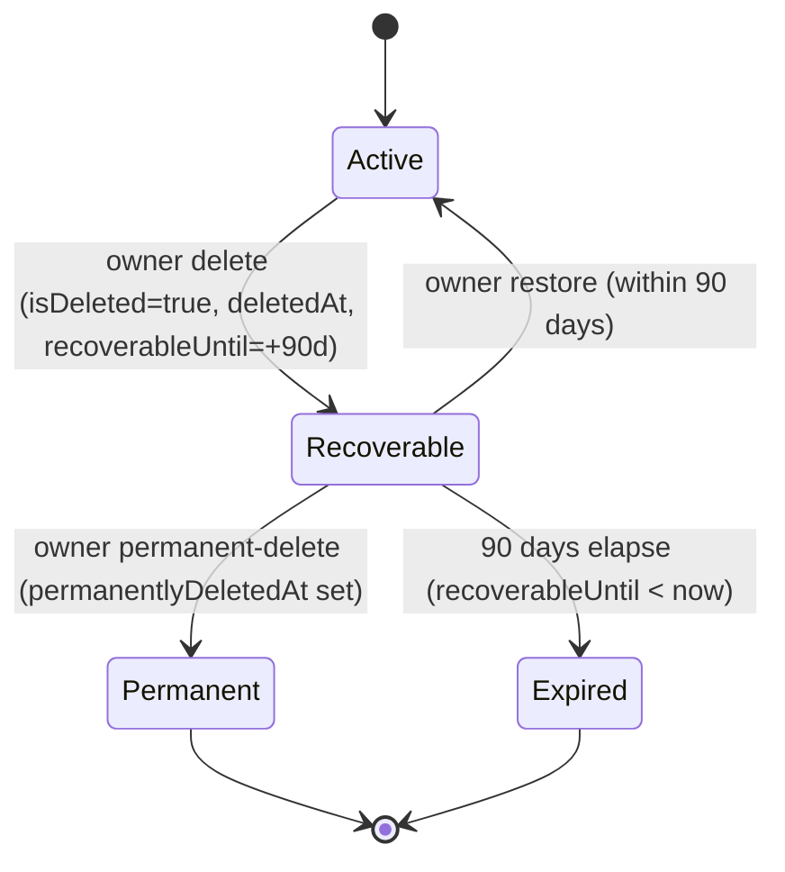

Organizations are the tenancy boundary for Propwise CRM. This specification defines how an **organization owner** deletes their workspace, what happens to billing, sessions, real-time connections, and background processing, and how the workspace can be **restored by the owner within a 90-day window** or **permanently removed** earlier.

<Note>
Deletion is a **reversible soft delete**. The organization row stays in the database with `isDeleted = true` and all CRM data intact. There is **no automated hard purge** in this phase.
</Note>

## Overview

The lifecycle is driven by a single boolean (`isDeleted`) plus four lifecycle timestamps. There is **no separate `status` enum** — this matches the existing `isDeleted: false` queries across the codebase and avoids syncing two fields.

What the feature must deliver:

1. **Immediate access revocation** — all org-scoped sessions revoked; no API call succeeds for that org after delete
2. **Members lose the org entirely** — removed members can still log in but never see the deleted org again
3. **Owner-only 90-day recovery** — only the owner sees the deleted org in the org picker with restore options
4. **Slot accounting** — recoverable orgs still occupy the owner's free-organization slot
5. **Immediate teardown + reactivation** — all background processes stopped and reactivated on restore
6. **Billing cancel-at-period-end** — paid subscriptions stop auto-renewal at current period end

## Product Decisions

<AccordionGroup>
  <Accordion title="Access Control">
    **Organization owner only** — `organization.owner_id` must match the authenticated user. Endpoint also requires RBAC **`system.owner`** (`OrgPermissionKey.SYSTEM_OWNER`) for defense in depth.
  </Accordion>
  
  <Accordion title="Recovery Windows">
    - **Self-service**: Owner can restore within **90 days** or permanently delete immediately
    - **System admin**: Can restore with **no 90-day limit** and delete any organization
    - **Beyond 90 days**: Owner self-service restore is disabled
  </Accordion>
  
  <Accordion title="Billing Behavior">
    **Cancel at period end** — `cancelSubscription(organizationId, userId, immediate = false)`. Paid orgs stop auto-renewal at the current period end. **Free orgs** skip Stripe entirely.
  </Accordion>
  
  <Accordion title="Data Retention">
    **Soft delete only** — `isDeleted = true` plus lifecycle timestamps. **No** hard purge, **no** `status` column. Permanent-delete keeps the row and only sets `permanentlyDeletedAt`.
  </Accordion>
</AccordionGroup>

## Lifecycle States

The four named states are **computed at query time** from `isDeleted`, `permanentlyDeletedAt`, and `recoverableUntil`:

### State Machine



### State Definitions

| State | Condition | Owner Picker | Members/APIs | Free Slot | Self-Service Restore | Background Jobs |
|-------|-----------|--------------|--------------|-----------|---------------------|-----------------|
| **Active** | `isDeleted = false` | Visible + enterable | Visible per RBAC | Occupied | n/a | Eligible |
| **Recoverable** | `isDeleted = true` AND `permanentlyDeletedAt IS NULL` AND `recoverableUntil >= now` | Visible, **not enterable** | Hidden everywhere | **Occupied** | **Allowed** | Excluded |
| **Permanent** | `isDeleted = true` AND `permanentlyDeletedAt IS NOT NULL` | Hidden | Hidden | **Freed** | Disabled | Excluded |
| **Expired** | `isDeleted = true` AND `recoverableUntil < now` | Hidden | Hidden | **Freed** | Disabled | Excluded |

<Warning>
**Invariants:**
- When `isDeleted = false`: `deletedAt`, `deletedBy`, `recoverableUntil`, `permanentlyDeletedAt` MUST all be `NULL`
- When `isDeleted = true`: `deletedAt` and `recoverableUntil` SHOULD be set
- The 90-day boundary is evaluated **at read time** — no cron flips states
</Warning>

## Data Model

### Core Entity Fields

```typescript
// Organization entity lifecycle fields
@Column({ type: 'boolean', default: false })
isDeleted: boolean;

@Column({ type: 'timestamptz', nullable: true })
deletedAt?: Date;

@Column({ type: 'uuid', nullable: true })
deletedBy?: string;

@Column({ type: 'timestamptz', nullable: true })
recoverableUntil?: Date;

@Column({ type: 'timestamptz', nullable: true })
permanentlyDeletedAt?: Date;
```

### Computed State Helper

```typescript
export function getOrganizationLifecycleState(org: Organization): OrganizationLifecycleState {
  if (!org.isDeleted) return 'active';
  
  if (org.permanentlyDeletedAt) return 'permanently_deleted';
  
  if (org.recoverableUntil && org.recoverableUntil >= new Date()) {
    return 'recoverable';
  }
  
  return 'expired';
}
```

## Owner-Initiated Deletion Flow

<Steps>
  <Step title="Authentication & Authorization">
    - Verify user is organization owner (`organization.owner_id`)
    - Check RBAC permission `OrgPermissionKey.SYSTEM_OWNER`
    - Validate organization exists and is not already deleted
  </Step>
  
  <Step title="Billing Cancellation">
    ```typescript
    // Cancel subscription at period end
    await this.subscriptionService.cancelSubscription(
      organizationId, 
      userId, 
      immediate: false
    );
    ```
    
    <Note>Free orgs (no `stripeSubscriptionId`) skip Stripe operations</Note>
  </Step>
  
  <Step title="Database Transaction">
    ```typescript
    const deletedOrg = await this.organizationRepository.update(organizationId, {
      isDeleted: true,
      deletedAt: new Date(),
      deletedBy: userId,
      recoverableUntil: add(new Date(), { days: 90 }),
      permanentlyDeletedAt: null
    });
    ```
  </Step>
  
  <Step title="Session Revocation">
    Revoke all org-scoped sessions immediately with reason `ORG_ACCESS_REVOKED`
  </Step>
  
  <Step title="Real-Time Teardown">
    - Disconnect WebSocket clients in org rooms cluster-wide
    - Pause Meta/WhatsApp webhooks (keeping tokens)
    - Exclude org from cron/queue dispatchers
  </Step>
  
  <Step title="Member Notifications">
    Send `REMOVED_FROM_ORGANIZATION` notifications to all non-owner members
  </Step>
</Steps>

## Restore Flow (Self-Service)

<Steps>
  <Step title="Validate Restore Window">
    ```typescript
    const state = getOrganizationLifecycleState(organization);
    if (state !== 'recoverable') {
      throw new BadRequestException('Organization cannot be restored');
    }
    ```
  </Step>
  
  <Step title="Database Restoration">
    ```typescript
    await this.organizationRepository.update(organizationId, {
      isDeleted: false,
      deletedAt: null,
      deletedBy: null,
      recoverableUntil: null,
      permanentlyDeletedAt: null
    });
    ```
  </Step>
  
  <Step title="Billing Reactivation">
    Resume auto-renewal **only if** the Stripe subscription is still alive
  </Step>
  
  <Step title="Real-Time Reactivation">
    - Re-include org in background job dispatchers
    - Re-subscribe Meta webhooks
    - WebSocket clients must reconnect (sessions not un-revoked)
  </Step>
</Steps>

## Permanent Delete Flow

<Steps>
  <Step title="Set Permanent Flag">
    ```typescript
    await this.organizationRepository.update(organizationId, {
      permanentlyDeletedAt: new Date()
    });
    ```
    
    <Note>`isDeleted` remains `true`; row is never hard-deleted</Note>
  </Step>
  
  <Step title="Free Organization Slot">
    The permanently deleted org no longer counts toward the owner's free-org cap
  </Step>
  
  <Step title="Hide from Owner">
    Organization disappears from owner's organization picker
  </Step>
</Steps>

## Session Management

### Access Control

The `AuthGuard` performs explicit `organization.isDeleted` checks:

```typescript
// Immediate rejection for deleted orgs
if (organization.isDeleted) {
  throw new UnauthorizedException('Organization access revoked');
}
```

<Warning>
**Critical**: All org-scoped sessions are revoked immediately after deletion. Restore does **not** un-revoke sessions — the owner must re-select the org to get fresh sessions.
</Warning>

### Session Revocation Process

1. **Immediate revocation** of all org-scoped sessions
2. **Reason code**: `ORG_ACCESS_REVOKED`
3. **Cluster-wide effect** via `PostgresIoAdapter`
4. **No automatic restoration** on org restore

## Real-Time Teardown

### WebSocket Disconnection

```typescript
// Disconnect all clients in organization rooms
await this.socketService.disconnectOrganizationClients(organizationId, {
  reason: 'ORGANIZATION_DELETED',
  clusterWide: true
});
```

### Meta Webhook Management

<Tabs>
  <Tab title="Pause on Delete">
    ```typescript
    // Pause webhooks but keep tokens
    await this.metaService.pauseOrganizationWebhooks(organizationId, {
      keepTokens: true,
      reason: 'ORG_DELETED'
    });
    ```
  </Tab>
  
  <Tab title="Resume on Restore">
    ```typescript
    // Re-subscribe webhooks using existing tokens
    await this.metaService.resumeOrganizationWebhooks(organizationId);
    ```
  </Tab>
</Tabs>

### Background Job Exclusion

All background job dispatchers exclude deleted organizations:

```typescript
const activeOrgs = await this.organizationRepository.find({
  where: { isDeleted: false },
  // ... other filters
});
```

<Tip>
Queued jobs are **not** purged. A shared "is org active" guard makes in-flight/queued jobs no-op.
</Tip>

## Free Organization Cap

### Slot Calculation

```typescript
export function countOccupiedSlots(ownedOrgs: Organization[]): number {
  return ownedOrgs.filter(org => {
    const state = getOrganizationLifecycleState(org);
    // Active or Recoverable orgs occupy slots
    return state === 'active' || state === 'recoverable';
  }).length;
}
```

### State Impact on Slots

- **Active**: Occupies slot ✓
- **Recoverable**: Occupies slot ✓ (prevents creating new orgs)
- **Permanent**: Frees slot ✗
- **Expired**: Frees slot ✗

<Info>
This prevents users from gaming the system by deleting and immediately recreating organizations to bypass the free-org limit.
</Info>

## API Endpoints

### Organization Owner Endpoints

<CodeGroup>
```typescript DELETE /v1/organizations/:id
@Delete(':id')
@CheckAccess(OrgPermissionKey.SYSTEM_OWNER)
async deleteOrganization(
  @Param('id', ParseUUIDPipe) organizationId: string,
  @CurrentUser() user: User
): Promise<void> {
  await this.organizationService.deleteOrganization(organizationId, user.id);
}
```

```typescript POST /v1/organizations/:id/restore
@Post(':id/restore')
@IdentityTokenOnly()
async restoreOrganization(
  @Param('id', ParseUUIDPipe) organizationId: string,
  @CurrentUser() user: User
): Promise<OrganizationDto> {
  return this.organizationService.restoreOrganization(organizationId, user.id);
}
```

```typescript POST /v1/organizations/:id/permanent-delete
@Post(':id/permanent-delete')
@IdentityTokenOnly()
async permanentlyDeleteOrganization(
  @Param('id', ParseUUIDPipe) organizationId: string,
  @CurrentUser() user: User
): Promise<void> {
  await this.organizationService.permanentlyDeleteOrganization(organizationId, user.id);
}
```
</CodeGroup>

### System Admin Endpoints

<CodeGroup>
```typescript GET /system-admin/organizations
@Get('organizations')
async listOrganizations(
  @Query('includeDeleted') includeDeleted?: boolean
): Promise<AdminOrganizationDto[]> {
  return this.systemAdminService.listOrganizations({ includeDeleted });
}
```

```typescript POST /system-admin/organizations/:id/restore
@Post('organizations/:id/restore')
async restoreOrganization(
  @Param('id', ParseUUIDPipe) organizationId: string
): Promise<AdminOrganizationDto> {
  return this.systemAdminService.restoreOrganization(organizationId);
}
```

```typescript DELETE /system-admin/organizations/:id
@Delete('organizations/:id')
async deleteOrganization(
  @Param('id', ParseUUIDPipe) organizationId: string,
  @CurrentUser() admin: User
): Promise<void> {
  await this.systemAdminService.deleteOrganization(organizationId, admin.id);
}
```
</CodeGroup>

## Frontend Integration

### Organization Picker

The organization picker shows different states based on user role and org lifecycle state:

<CardGroup cols={2}>
  <Card title="Owner View" icon="crown">
    - **Active**: Normal entry + management
    - **Recoverable**: Visible but non-enterable, shows restore/permanent-delete options
    - **Permanent/Expired**: Hidden completely
  </Card>
  
  <Card title="Member View" icon="users">
    - **Active**: Normal entry per RBAC permissions
    - **Recoverable/Permanent/Expired**: Hidden completely
  </Card>
</CardGroup>

### Danger Zone UI

Located in organization security settings, only visible to owners:

```typescript
// React component structure
<DangerZone>
  <DeleteOrganizationButton 
    organizationId={org.id}
    onSuccess={() => router.push('/organizations')}
  />
</DangerZone>
```

## System Admin Dashboard

### Organization List View

```typescript
interface AdminOrganizationDto {
  id: string;
  name: string;
  lifecycleState: 'active' | 'recoverable' | 'expired' | 'permanently_deleted';
  deletedAt?: Date;
  deletedBy?: {
    id: string;
    name: string;
  };
  recoverableUntil?: Date;
  permanentlyDeletedAt?: Date;
  // ... other org fields
}
```

### Available Actions

<Tabs>
  <Tab title="For Recoverable Orgs">
    - **View/Edit**: Full organization details and settings
    - **Restore**: Immediate restoration (no 90-day limit)
    - **Delete**: Permanent deletion via same pipeline as owner
  </Tab>
  
  <Tab title="For Expired/Permanent Orgs">
    - **View/Edit**: Full organization details and settings  
    - **Restore**: System admin can restore even expired/permanent orgs
    - **Delete**: Additional permanent deletion (no-op for already permanent)
  </Tab>
</Tabs>

## Recovery Beyond Window

### Support Runbook

<Steps>
  <Step title="Verify Organization State">
    ```sql
    SELECT id, name, is_deleted, lifecycle_state, 
           deleted_at, recoverable_until, permanently_deleted_at
    FROM organizations 
    WHERE id = 'org-uuid';
    ```
  </Step>
  
  <Step title="Use System Admin Dashboard">
    Navigate to System Admin → Organizations → Find deleted org → Restore
    
    <Note>This is the preferred method over direct SQL manipulation</Note>
  </Step>
  
  <Step title="Alternative: Direct SQL (Emergency Only)">
    ```sql
    -- Only if system admin dashboard is unavailable
    UPDATE organizations 
    SET is_deleted = false,
        deleted_at = NULL,
        deleted_by = NULL, 
        recoverable_until = NULL,
        permanently_deleted_at = NULL
    WHERE id = 'org-uuid';
    ```
    
    <Warning>Manual SQL bypasses the restoration pipeline. Use system admin dashboard instead.</Warning>
  </Step>
</Steps>

## Testing Requirements

### Unit Tests

<Check>Core lifecycle state computation logic</Check>
<Check>Service methods for delete/restore/permanent-delete</Check>
<Check>Free organization slot counting with mixed states</Check>
<Check>Session revocation on organization deletion</Check>

### Integration Tests

<Check>Full delete → restore → permanent-delete flow</Check>
<Check>Billing cancellation and restoration behavior</Check>
<Check>WebSocket disconnection on organization deletion</Check>
<Check>Background job exclusion for deleted organizations</Check>

### E2E Tests

<Check>Organization picker visibility by user role and org state</Check>
<Check>API endpoint access control for deleted organizations</Check>
<Check>System admin dashboard functionality</Check>
<Check>Member notification delivery on organization deletion</Check>

## Implementation Status

### Completed Phases

<AccordionGroup>
  <Accordion title="Phase 1: Data Model ✅">
    - Entity lifecycle fields added
    - Database migration completed
    - DTO fields exposed
  </Accordion>
  
  <Accordion title="Phase 2: Core Pipeline ✅">
    - `softDeleteOrganizationInternal` service method
    - Billing integration with cancel-at-period-end
    - Session revocation system
    - Event system (`ORGANIZATION_DELETED`/`RESTORED`)
    - Member notification pipeline
  </Accordion>
  
  <Accordion title="Phase 3: Owner Self-Service ✅">
    - Owner restore and permanent-delete endpoints
    - Organization picker state-aware filtering
    - Auth guard hard-stop for deleted orgs
    - Free organization cap accounting
  </Accordion>
  
  <Accordion title="Phase 5: Real-Time Teardown ✅">
    - WebSocket cluster-wide disconnect system
    - Meta webhook pause/resume (non-destructive)
    - Background job dispatcher filtering
  </Accordion>
  
  <Accordion title="Phase 7: System Admin Tools ✅">
    - Admin dashboard list with `includeDeleted`
    - Admin restore (no 90-day limit)  
    - Admin delete using same pipeline
    - Admin get/update for deleted orgs
  </Accordion>
</AccordionGroup>

### Implementation Checklist

- [x] **Data model**: Entity fields, migration, DTOs
- [x] **Core service**: Delete/restore/permanent-delete pipeline  
- [x] **Billing**: Cancel-at-period-end, restoration logic
- [x] **Sessions**: Immediate revocation, auth guard hard-stop
- [x] **Real-time**: WebSocket disconnect, Meta webhook management
- [x] **Background jobs**: Dispatcher filtering, in-flight job guards
- [x] **Owner UX**: Org picker, restore/permanent-delete actions
- [x] **Free-org cap**: State-aware slot counting
- [x] **System admin**: Dashboard list, restore, delete capabilities
- [x] **Member notifications**: `REMOVED_FROM_ORGANIZATION` pipeline
- [ ] **Documentation**: API docs, runbook updates, user guides

## Constants

```typescript
// Organization lifecycle constants
export const ORGANIZATION_RECOVERY_WINDOW_DAYS = 90;

export const ORGANIZATION_LIFECYCLE_STATES = {
  ACTIVE: 'active',
  RECOVERABLE: 'recoverable', 
  EXPIRED: 'expired',
  PERMANENTLY_DELETED: 'permanently_deleted'
} as const;

export const SESSION_REVOCATION_REASONS = {
  ORG_ACCESS_REVOKED: 'ORG_ACCESS_REVOKED'
} as const;
```

## Related Documentation

When implementation completes, update:

- **API Documentation**: Endpoint specifications and response schemas
- **User Guide**: Organization management and deletion flows  
- **Admin Guide**: System admin dashboard usage
- **Support Runbook**: Recovery procedures and troubleshooting
- **Billing Guide**: Subscription lifecycle and restoration behavior