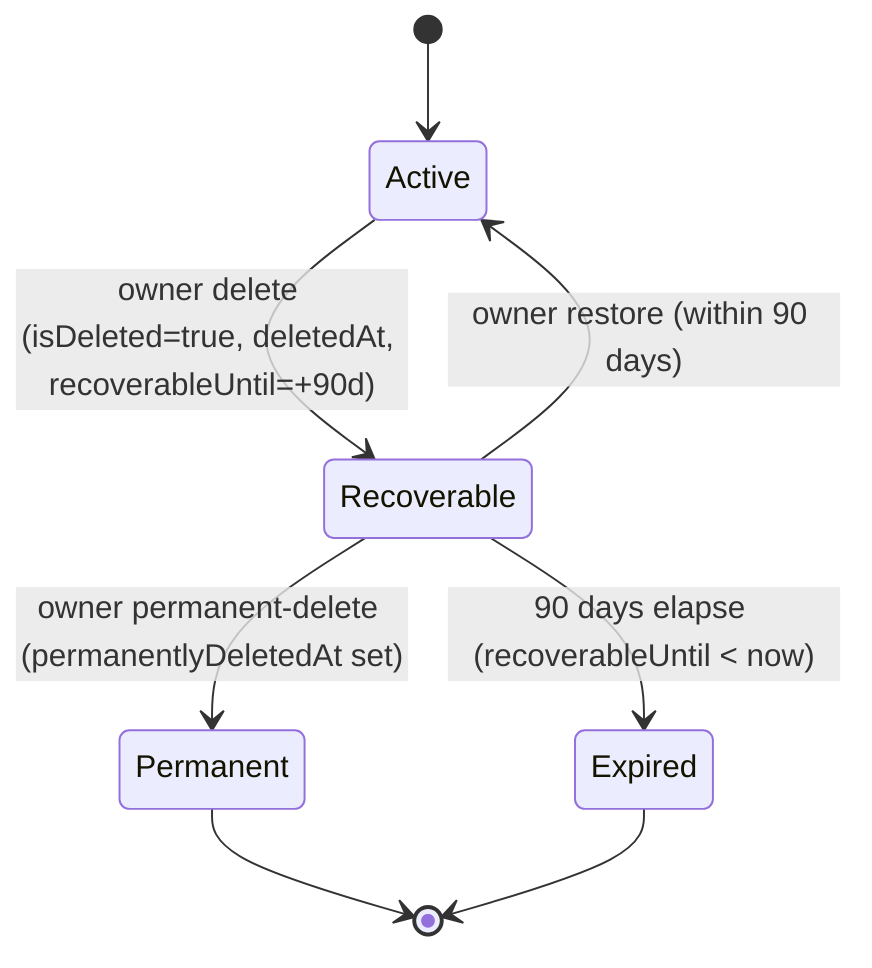

## Overview

Organizations are the tenancy boundary for Propwise CRM. This specification defines how an **organization owner** deletes their workspace, what happens to billing, sessions, real-time connections, and background processing, and how the workspace can be **restored by the owner within a 90-day window** or **permanently removed** earlier.

<Note>
Deletion is a **reversible soft delete**. The organization row stays in the database with `isDeleted = true` and all CRM data intact. There is **no automated hard purge** in this phase.
</Note>

The lifecycle is driven by a single boolean (`isDeleted`) plus four lifecycle timestamps. There is **no separate `status` enum** — this matches the existing `isDeleted: false` queries across the codebase and avoids syncing two fields.

### Key Features

1. **Immediate access revocation** — all org-scoped sessions revoked; no API call succeeds for that org after delete
2. **Members lose the org entirely** — removed members can still log in but never see the deleted org again
3. **Owner-only 90-day recovery** — only the owner sees the deleted org in the org picker with Restore/Permanently delete options
4. **Slot accounting** — recoverable orgs still occupy the owner's free-organization slot
5. **Immediate teardown + reactivation** — crons, schedulers, queues, WebSockets, and Meta webhooks are stopped and reactivated on restore
6. **Billing cancel-at-period-end** — paid subscriptions stop auto-renewal at current period end

## Product Decisions

<AccordionGroup>
<Accordion title="Access Control">
**Organization owner only** — `organization.owner_id` must match the authenticated user. Endpoint also requires RBAC **`system.owner`** (`OrgPermissionKey.SYSTEM_OWNER`) for defense in depth. **Not** system admin via product settings, **not** org Admin alone.
</Accordion>

<Accordion title="Recovery Options">
- **Self-service** — owner can **Restore** within **90 days** or **Permanently delete** immediately from org picker
- **System admin** — can **Restore** deleted organizations with **no 90-day limit** and **Delete** any organization
</Accordion>

<Accordion title="Billing Behavior">
**Cancel at period end** — `cancelSubscription(organizationId, userId, immediate = false)`. Paid orgs stop auto-renewal at current period end. **Free orgs** skip Stripe with no error. On restore, resume auto-renewal only if Stripe subscription is still alive.
</Accordion>

<Accordion title="Data Retention">
**Soft delete only** — `isDeleted = true` plus lifecycle timestamps. **No** hard purge, **no** `status` column. Permanent-delete keeps the row and only sets `permanentlyDeletedAt`.
</Accordion>
</AccordionGroup>

## Lifecycle States

### State Machine

The organization lifecycle follows a simple state machine with four computed states:



### State Reference

| State | Condition | Owner Picker | Members/APIs | Free Slot | Self-Service Restore | Background Jobs |
| --- | --- | --- | --- | --- | --- | --- |
| **Active** | `isDeleted = false` | Visible + enterable | Visible per RBAC | Occupied | n/a | Eligible |
| **Recoverable** | `isDeleted = true` AND `permanentlyDeletedAt IS NULL` AND `recoverableUntil >= now` | Visible, not enterable, shows actions | Hidden | **Occupied** | **Allowed** | Excluded |
| **Permanent** | `isDeleted = true` AND `permanentlyDeletedAt IS NOT NULL` | Hidden | Hidden | **Freed** | Support only | Excluded |
| **Expired** | `isDeleted = true` AND `permanentlyDeletedAt IS NULL` AND `recoverableUntil < now` | Hidden | Hidden | **Freed** | Support only | Excluded |

<Warning>
**Invariants:**
- When `isDeleted = false`: `deletedAt`, `deletedBy`, `recoverableUntil`, `permanentlyDeletedAt` MUST all be `NULL`
- When `isDeleted = true`: `deletedAt` and `recoverableUntil` SHOULD be set
- The 90-day boundary is evaluated **at read time** — no cron flips states
</Warning>

## Data Model

### Organization Entity Fields

```typescript
@Entity('organizations')
export class Organization {
  // Existing fields...
  
  @Column({ name: 'is_deleted', type: 'boolean', default: false })
  isDeleted: boolean;

  @Column({ name: 'deleted_at', type: 'timestamptz', nullable: true })
  deletedAt: Date | null;

  @Column({ name: 'deleted_by', type: 'uuid', nullable: true })
  deletedBy: string | null;

  @Column({ name: 'recoverable_until', type: 'timestamptz', nullable: true })
  recoverableUntil: Date | null;

  @Column({ name: 'permanently_deleted_at', type: 'timestamptz', nullable: true })
  permanentlyDeletedAt: Date | null;
}
```

### Lifecycle State Computation

```typescript
export enum OrganizationLifecycleState {
  ACTIVE = 'active',
  RECOVERABLE = 'recoverable', 
  PERMANENT = 'permanently_deleted',
  EXPIRED = 'expired'
}

export function computeLifecycleState(org: Organization): OrganizationLifecycleState {
  if (!org.isDeleted) return OrganizationLifecycleState.ACTIVE;
  
  if (org.permanentlyDeletedAt) return OrganizationLifecycleState.PERMANENT;
  
  if (org.recoverableUntil && new Date() <= org.recoverableUntil) {
    return OrganizationLifecycleState.RECOVERABLE;
  }
  
  return OrganizationLifecycleState.EXPIRED;
}
```

## Owner-Initiated Deletion Flow

<Steps>
<Step title="Validate Access">
- Verify user is organization owner (`organization.owner_id` matches authenticated user)
- Check RBAC permission `OrgPermissionKey.SYSTEM_OWNER`
</Step>

<Step title="Set Lifecycle Timestamps">
```typescript
const now = new Date();
organization.isDeleted = true;
organization.deletedAt = now;
organization.deletedBy = userId;
organization.recoverableUntil = new Date(now.getTime() + 90 * 24 * 60 * 60 * 1000); // 90 days
```
</Step>

<Step title="Handle Billing">
- **Paid organizations**: Call `cancelSubscription(organizationId, userId, immediate = false)`
- **Free organizations**: Skip Stripe operations
</Step>

<Step title="Revoke Sessions">
Revoke all org-scoped sessions immediately with reason `ORG_ACCESS_REVOKED`
</Step>

<Step title="Notify Members">
Send `REMOVED_FROM_ORGANIZATION` notifications to all non-owner members
</Step>

<Step title="Emit Events">
Emit `ORGANIZATION_EVENTS.DELETED` event for cross-module coordination
</Step>

<Step title="Real-Time Teardown">
- Disconnect WebSocket clients in org rooms cluster-wide
- Pause and unsubscribe Meta/WhatsApp webhooks (keep tokens)
- Exclude org from cron/queue dispatchers
</Step>
</Steps>

## Restore Flow (Self-Service)

<Note>
Only available to organization owners within the 90-day recoverable window.
</Note>

<Steps>
<Step title="Validate Restore Eligibility">
- Verify user is organization owner
- Check organization is in `Recoverable` state
- Ensure within 90-day window
</Step>

<Step title="Clear Deletion Fields">
```typescript
organization.isDeleted = false;
organization.deletedAt = null;
organization.deletedBy = null;
organization.recoverableUntil = null;
// permanentlyDeletedAt remains null
```
</Step>

<Step title="Resume Billing">
Resume auto-renewal **only if** Stripe subscription is still alive
</Step>

<Step title="Emit Events">
Emit `ORGANIZATION_EVENTS.RESTORED` event
</Step>

<Step title="Reactivate Services">
- Re-include org in cron/queue dispatchers
- Re-subscribe Meta webhooks
- Background jobs become eligible again
</Step>
</Steps>

<Info>
Restore does **not** un-revoke sessions. The owner must re-select the organization to get fresh sessions.
</Info>

## Permanent Delete Flow

<Steps>
<Step title="Validate Access">
Same validation as standard deletion
</Step>

<Step title="Set Permanent Timestamp">
```typescript
organization.permanentlyDeletedAt = new Date();
// isDeleted remains true
// Other fields unchanged
```
</Step>

<Step title="Free Organization Slot">
Organization no longer counts toward owner's free-org cap
</Step>

<Step title="Hide from Owner">
Organization disappears from owner's org picker
</Step>
</Steps>

<Warning>
Permanent deletion is irreversible via self-service. Only system administrators can restore permanently deleted organizations.
</Warning>

## Billing Behavior

### On Deletion

<Tabs>
<Tab title="Paid Organizations">
- Call `cancelSubscription(organizationId, userId, immediate = false)`
- Subscription continues until current period end
- Auto-renewal is disabled
- Access remains available until period end
</Tab>

<Tab title="Free Organizations">
- Skip all Stripe operations
- No billing changes required
- Immediate access revocation
</Tab>
</Tabs>

### On Restore

- **If Stripe subscription is still active**: Resume auto-renewal
- **If Stripe subscription expired**: Owner must manually resubscribe
- Free organizations have no billing restoration steps

## Sessions and Access Control

### Session Revocation

When an organization is deleted:

1. **Immediate revocation** of all org-scoped sessions
2. **Reason code**: `ORG_ACCESS_REVOKED`
3. **Cluster-wide enforcement** via session invalidation
4. **API protection**: AuthGuard checks `organization.isDeleted` on every request

### Access Patterns

<CodeGroup>
```typescript AuthGuard Check
// Explicit isDeleted check bypasses cache
if (organization.isDeleted) {
  throw new ForbiddenException('Organization access revoked');
}
```

```typescript Org Finder (Members)
// Regular members see only active orgs
const organizations = await this.organizationRepository.find({
  where: { 
    isDeleted: false,
    // ... other filters
  }
});
```

```typescript Org Finder (Owner)
// Owners see active + recoverable orgs
const organizations = await this.organizationRepository.find({
  where: [
    { isDeleted: false }, // Active orgs
    { 
      isDeleted: true,
      ownerId: userId,
      permanentlyDeletedAt: IsNull(),
      recoverableUntil: MoreThanOrEqual(new Date())
    } // Recoverable orgs for owner
  ]
});
```
</CodeGroup>

## Member Notifications

When an organization is deleted, all non-owner members receive a `REMOVED_FROM_ORGANIZATION` notification using the existing notification system.

<Info>
This reuses the same notification type as `UserService.removeFromOrganization` for consistency.
</Info>

## Background Jobs and Real-Time Services

### Immediate Teardown

<Tabs>
<Tab title="WebSockets">
- Disconnect all clients in organization rooms
- Cluster-wide disconnect via `PostgresIoAdapter`
- Clients must reconnect and will be rejected
</Tab>

<Tab title="Meta Webhooks">
- Pause webhook processing
- Unsubscribe from webhook endpoints
- **Preserve tokens** for potential restore
</Tab>

<Tab title="Cron Jobs">
- Exclude organization from dispatcher queries
- In-flight jobs become no-ops via "is org active" guards
- Queued jobs are not purged
</Tab>
</Tabs>

### Service Restoration

On organization restore, all services are reactivated:

- Cron jobs include the organization again
- Meta webhooks are re-subscribed
- WebSocket clients can reconnect successfully

## Free Organization Ownership Cap

<Note>
Organizations in `Recoverable` state **still occupy** the owner's free organization slot.
</Note>

### Slot Accounting

- **Active organizations**: Count toward cap
- **Recoverable organizations**: Count toward cap ⚠️
- **Permanent organizations**: Do not count
- **Expired organizations**: Do not count

### Implementation

```typescript
async countOwnedOrganizations(userId: string): Promise<number> {
  return this.organizationRepository.count({
    where: {
      ownerId: userId,
      // Count active OR recoverable (not permanent/expired)
      [Op.OR]: [
        { isDeleted: false },
        {
          isDeleted: true,
          permanentlyDeletedAt: null,
          recoverableUntil: MoreThanOrEqual(new Date())
        }
      ]
    }
  });
}
```

## API Contract

### Delete Organization

<CodeGroup>
```http Request
DELETE /v1/organizations/:id
Authorization: Bearer <token>
```

```json Response (Success)
{
  "message": "Organization deleted successfully",
  "recoverableUntil": "2024-04-15T10:30:00Z"
}
```

```json Response (Error)
{
  "error": "Forbidden",
  "message": "Only organization owners can delete organizations"
}
```
</CodeGroup>

### Restore Organization

<CodeGroup>
```http Request
POST /v1/organizations/:id/restore
Authorization: Bearer <identity-token>
```

```json Response (Success)
{
  "message": "Organization restored successfully"
}
```

```json Response (Error)
{
  "error": "BadRequest", 
  "message": "Organization is not in recoverable state"
}
```
</CodeGroup>

### Permanent Delete

<CodeGroup>
```http Request
POST /v1/organizations/:id/permanent-delete
Authorization: Bearer <identity-token>
```

```json Response (Success)
{
  "message": "Organization permanently deleted"
}
```
</CodeGroup>

<Warning>
Restore and permanent delete endpoints require `@IdentityTokenOnly()` decorator and use `IdentityTokenGuard` for authentication.
</Warning>

## Frontend UX

### Organization Picker

The organization picker shows different states for deleted organizations:

<Tabs>
<Tab title="Owner View (Recoverable)">
- Organization appears with "⚠️ Pending Deletion" status
- **Cannot enter** the organization
- Shows "Restore" and "Permanently Delete" buttons
- Displays days remaining in recovery window
</Tab>

<Tab title="Member View">
- Deleted organizations are completely hidden
- No indication the organization ever existed
- Clean slate experience
</Tab>

<Tab title="Owner View (Permanent/Expired)">
- Organization is completely hidden
- Same experience as regular members
- No restore options available
</Tab>
</Tabs>

### Settings Danger Zone

Located in organization security settings:

```tsx
// src/components/pages/settings/organization-security-extras.tsx
<DangerZone>
  <DeleteOrganizationCard 
    organization={organization}
    onDelete={handleDelete}
  />
</DangerZone>
```

## System Admin Dashboard

<Note>
System administrators have enhanced capabilities for organization lifecycle management.
</Note>

### Admin Organization List

<CodeGroup>
```http Request
GET /system-admin/organizations?includeDeleted=true
Authorization: Bearer <admin-token>
```

```json Response
{
  "organizations": [
    {
      "id": "org-123",
      "name": "Acme Corp",
      "lifecycleState": "recoverable",
      "deletedAt": "2024-01-15T10:30:00Z",
      "deletedBy": {
        "id": "user-456",
        "name": "John Doe"
      },
      "recoverableUntil": "2024-04-15T10:30:00Z",
      "permanentlyDeletedAt": null
    }
  ]
}
```
</CodeGroup>

### Admin Restore (No Time Limit)

System administrators can restore organizations in any state:

<CodeGroup>
```http Request
POST /system-admin/organizations/:id/restore
Authorization: Bearer <admin-token>
```

```json Response
{
  "message": "Organization restored by system administrator"
}
```
</CodeGroup>

<Info>
Admin restore works on `Recoverable`, `Expired`, and `Permanent` organizations with no 90-day restriction.
</Info>

## Recovery Beyond 90 Days

For organizations in `Expired` or `Permanent` state, recovery requires system administrator intervention:

<Steps>
<Step title="Contact Support">
Organization owner contacts support with recovery request
</Step>

<Step title="Admin Verification">
System administrator verifies the request and owner identity
</Step>

<Step title="Admin Restore">
Administrator uses system admin dashboard to restore the organization
</Step>

<Step title="Owner Notification">
Owner is notified that the organization has been restored
</Step>
</Steps>

## Testing Requirements

### Unit Tests

- [ ] Lifecycle state computation logic
- [ ] Session revocation on delete
- [ ] Billing cancellation flows
- [ ] Free organization slot counting
- [ ] Access control validation

### Integration Tests

- [ ] End-to-end delete → restore flow
- [ ] WebSocket disconnection on delete
- [ ] Meta webhook pause/resume
- [ ] Cross-module event handling
- [ ] System admin operations

### Load Tests

- [ ] Mass organization deletion
- [ ] Session revocation at scale
- [ ] WebSocket disconnection performance

## Implementation Status

<Check>**Phase 1**: Data model and migrations</Check>
<Check>**Phase 2**: Core deletion pipeline with billing and notifications</Check>
<Check>**Phase 3**: Owner restore/permanent-delete endpoints and org picker</Check>
<Check>**Phase 5**: WebSocket disconnect and Meta webhook management</Check>
<Check>**Phase 7**: System admin dashboard integration</Check>

### Remaining Work

- [ ] Background job filtering for deleted organizations
- [ ] Enhanced WebSocket session re-validation
- [ ] Complete cross-module event listener coverage

## Constants

```typescript
export const ORGANIZATION_LIFECYCLE_CONSTANTS = {
  RECOVERY_WINDOW_DAYS: 90,
  SESSION_REVOCATION_REASON: 'ORG_ACCESS_REVOKED',
  NOTIFICATION_TYPE: 'REMOVED_FROM_ORGANIZATION'
} as const;
```

## Related Documentation

- [Organization Management](/backend/organization/management)
- [Billing Integration](/backend/billing/lifecycle)
- [Session Management](/backend/auth/sessions)
- [WebSocket Architecture](/backend/real-time/websockets)
- [System Admin Dashboard](/backend/admin/organizations)