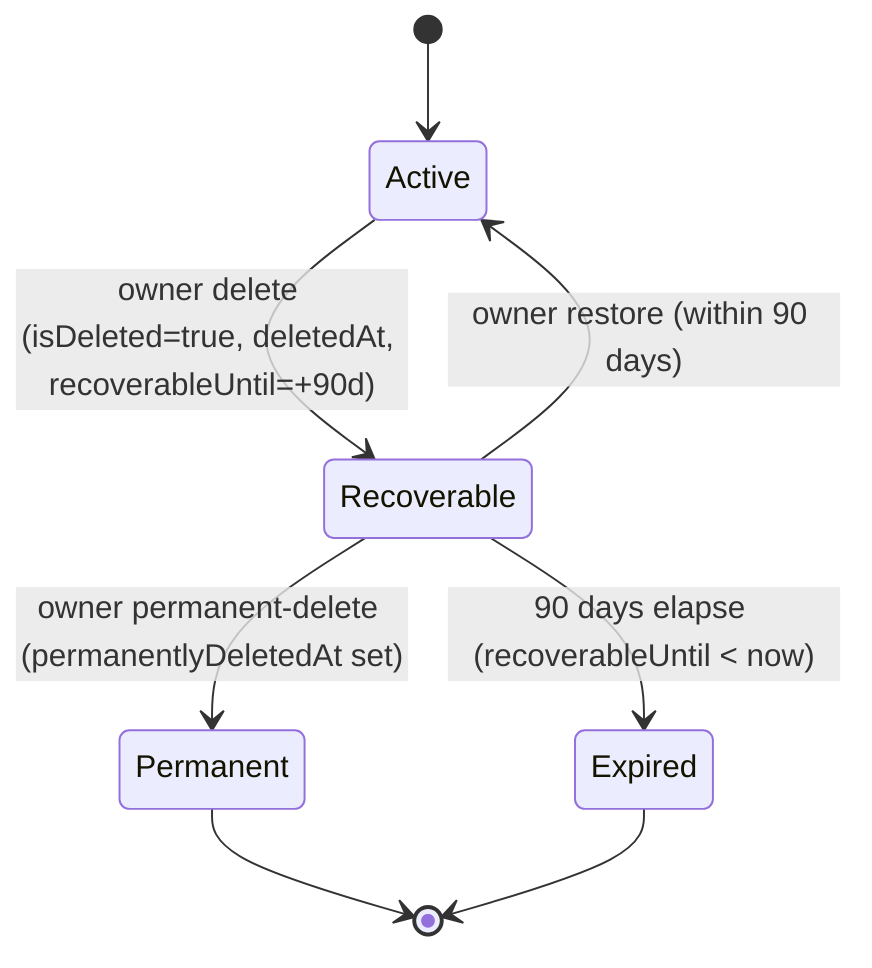

Organizations are the tenancy boundary for Propwise CRM. This specification defines how an **organization owner** deletes their workspace, what happens to billing, sessions, real-time connections, and background processing, and how the workspace can be **restored by the owner within a 90-day window** or **permanently removed** earlier.

<Note>
Deletion is a **reversible soft delete**. The organization row stays in the database with `isDeleted = true` and all CRM data intact. There is **no automated hard purge** in this phase.
</Note>

## Overview

The lifecycle is driven by a single boolean (`isDeleted`) plus four lifecycle timestamps. There is **no separate `status` enum** — this matches the existing `isDeleted: false` queries across the codebase and avoids syncing two fields.

### What the feature delivers

<Steps>
<Step title="Immediate access revocation">
All org-scoped sessions revoked; no API call (org-scoped or not) succeeds for that org after delete.
</Step>

<Step title="Members lose the org entirely">
A removed member can still log in but never sees the deleted org again.
</Step>

<Step title="Owner-only 90-day recovery">
Only the owner still sees the deleted org in the org picker (cannot enter it), with a **Restore** button (90 days) and a **Permanently delete** button.
</Step>

<Step title="Slot accounting">
While the org is in the 90-day recoverable window (and not permanently deleted) it **still occupies** the owner's free-organization slot; permanent-delete (or 90-day expiry) frees the slot.
</Step>

<Step title="Immediate teardown + reactivation">
Crons, schedulers, queues, WebSockets, and Meta webhooks are immediately stopped / disconnected / unsubscribed for the org, and reactivated if the org is restored.
</Step>

<Step title="Billing cancel-at-period-end">
Paid subscriptions stop auto-renewal at the current period end; free orgs skip Stripe.
</Step>
</Steps>

## Product Decisions

<AccordionGroup>
<Accordion title="Who can delete (product UI)">
**Organization owner only** — `organization.owner_id` must match the authenticated user. Endpoint also requires RBAC **`system.owner`** (`OrgPermissionKey.SYSTEM_OWNER`) for defense in depth. **Not** system admin via product settings, **not** org Admin (`system.admin` alone is insufficient).
</Accordion>

<Accordion title="Recovery (owner)">
**Self-service** — the owner can **Restore** within **90 days** or **Permanently delete** immediately, both from the org picker. Beyond 90 days (Expired) or after Permanent-delete, owner self-service restore is disabled.
</Accordion>

<Accordion title="Recovery (system admin)">
The **system admin dashboard** lists deleted organizations and can **Restore** them with **no 90-day limit** (Recoverable, Expired, or Permanent — the row is always retained), and can **Delete** any organization using the same full pipeline as the owner flow.
</Accordion>

<Accordion title="Billing on delete">
**Cancel at period end** — `cancelSubscription(organizationId, userId, immediate = false)`. Paid orgs stop auto-renewal at the current period end. **Free orgs** (no `stripeSubscriptionId`): skip Stripe; no error. On restore, resume auto-renewal **only if** the Stripe subscription is still alive.
</Accordion>

<Accordion title="Data after delete">
**Soft delete only** — `isDeleted = true` plus lifecycle timestamps (`deletedAt`, `deletedBy`, `recoverableUntil`, `permanentlyDeletedAt`). **No** hard purge, **no** `status` column. Permanent-delete keeps the row (`isDeleted` stays `true`) and only sets `permanentlyDeletedAt`.
</Accordion>
</AccordionGroup>

## Lifecycle States and Soft-Delete Model

### State Machine

The organization lifecycle follows this state machine:



### State Table

| State | Condition (computed) | Owner picker | Members / APIs | Free slot | Self-service restore | Background jobs |
| --- | --- | --- | --- | --- | --- | --- |
| **Active** | `isDeleted = false` | Visible + enterable | Visible per RBAC | Occupied | n/a | Eligible |
| **Recoverable** | `isDeleted = true` AND `permanentlyDeletedAt IS NULL` AND `recoverableUntil >= now` | Visible, **not enterable**, shows Restore + Permanent-delete | Hidden everywhere | **Occupied** | **Allowed** | Excluded |
| **Permanent** | `isDeleted = true` AND `permanentlyDeletedAt IS NOT NULL` | Hidden | Hidden | **Freed** | Disabled (support SQL only) | Excluded |
| **Expired** | `isDeleted = true` AND `permanentlyDeletedAt IS NULL` AND `recoverableUntil < now` | Hidden | Hidden | **Freed** | Disabled (support SQL only) | Excluded |

### Invariants

<Warning>
When implementing, ensure these invariants are maintained:
- When `isDeleted = false`: `deletedAt`, `deletedBy`, `recoverableUntil`, `permanentlyDeletedAt` MUST all be `NULL`
- When `isDeleted = true`: `deletedAt` and `recoverableUntil` SHOULD be set
- The 90-day boundary is evaluated **at read time** (`recoverableUntil >= now`). No cron flips Recoverable → Expired
</Warning>

## Data Model

### Database Schema

The organization table includes these lifecycle fields:

```typescript
@Entity('organizations')
export class Organization {
  // ... existing fields ...
  
  @Column({ name: 'is_deleted', default: false })
  isDeleted: boolean;

  @Column({ name: 'deleted_at', type: 'timestamp', nullable: true })
  deletedAt?: Date;

  @Column({ name: 'deleted_by', nullable: true })
  deletedBy?: string;

  @Column({ name: 'recoverable_until', type: 'timestamp', nullable: true })
  recoverableUntil?: Date;

  @Column({ name: 'permanently_deleted_at', type: 'timestamp', nullable: true })
  permanentlyDeletedAt?: Date;
}
```

### Computed State

The lifecycle state is computed at query time:

```typescript
export function getOrganizationLifecycleState(org: Organization): LifecycleState {
  if (!org.isDeleted) return 'active';
  
  if (org.permanentlyDeletedAt) return 'permanently_deleted';
  
  if (org.recoverableUntil && org.recoverableUntil >= new Date()) {
    return 'recoverable';
  }
  
  return 'expired';
}
```

## Owner-Initiated Deletion Flow

### API Endpoint

```http
DELETE /v1/organizations/:id
```

<Steps>
<Step title="Authorization">
- Require `@CheckAccess(SYSTEM_OWNER)` 
- Verify `organization.owner_id` matches authenticated user
</Step>

<Step title="Soft delete transaction">
- Set `isDeleted = true`
- Set `deletedAt = now()`
- Set `deletedBy = userId`
- Set `recoverableUntil = now() + 90 days`
- Keep `permanentlyDeletedAt = null`
</Step>

<Step title="Billing cancellation">
- Call `cancelSubscription(organizationId, userId, immediate = false)`
- Cancel at period end for paid subscriptions
- Skip Stripe for free organizations
</Step>

<Step title="Session revocation">
- Revoke all org-scoped sessions with reason `ORG_ACCESS_REVOKED`
- Clear `selectedOrganization` for affected users
</Step>

<Step title="Real-time teardown">
- Disconnect WebSocket clients in org rooms cluster-wide
- Pause Meta/WhatsApp webhooks (keep tokens)
- Exclude org from cron/queue dispatchers
</Step>

<Step title="Member notifications">
- Send `REMOVED_FROM_ORGANIZATION` notifications to non-owner members
</Step>
</Steps>

## Restore Flow (Self-Service)

### API Endpoint

```http
POST /v1/organizations/:id/restore
```

<Steps>
<Step title="Validation">
- Verify organization is in `Recoverable` state
- Ensure authenticated user is the organization owner
- Check 90-day recovery window hasn't expired
</Step>

<Step title="Restore transaction">
- Set `isDeleted = false`
- Clear lifecycle timestamps: `deletedAt`, `deletedBy`, `recoverableUntil`
- Keep `permanentlyDeletedAt = null`
</Step>

<Step title="Billing reactivation">
- Resume Stripe subscription auto-renewal if subscription still exists
- Handle subscription reactivation errors gracefully
</Step>

<Step title="Real-time reactivation">
- Re-include organization in cron/queue dispatchers
- Re-subscribe Meta/WhatsApp webhooks
- Background jobs will naturally resume on next dispatch
</Step>
</Steps>

<Note>
Sessions are **not** automatically restored. The owner must re-select the organization to get fresh sessions.
</Note>

## Permanent Delete Flow

### API Endpoint

```http
POST /v1/organizations/:id/permanent-delete
```

<Steps>
<Step title="Authorization">
- Require organization owner authentication
- Verify organization is in `Recoverable` state
</Step>

<Step title="Mark permanent">
- Set `permanentlyDeletedAt = now()`
- Keep `isDeleted = true`
- Keep other lifecycle timestamps intact
</Step>

<Step title="Free organization slot">
- Organization no longer counts against owner's free organization limit
- Owner can immediately create new organizations (if under limit)
</Step>
</Steps>

<Warning>
Permanent deletion cannot be undone through self-service. Only system administrators can restore permanently deleted organizations.
</Warning>

## Billing Behavior

### Subscription Cancellation

<Tabs>
<Tab title="Paid Organizations">
- Cancel subscription with `immediate = false`
- Subscription continues until current period end
- No prorated refunds
- Access remains until billing period expires
</Tab>

<Tab title="Free Organizations">
- Skip Stripe API calls entirely
- No subscription to cancel
- Immediate access revocation
</Tab>
</Tabs>

### Restoration Billing

When restoring an organization:

<Steps>
<Step title="Check subscription status">
Verify if Stripe subscription still exists and is active
</Step>

<Step title="Resume if valid">
Re-enable auto-renewal for valid subscriptions
</Step>

<Step title="Handle expired subscriptions">
If subscription expired during deletion period, organization returns to free tier
</Step>
</Steps>

## Sessions and Access Control

### Session Revocation on Delete

```typescript
// All org-scoped sessions are immediately revoked
await this.sessionService.revokeSessionsByOrganization(
  organizationId,
  SessionRevocationReason.ORG_ACCESS_REVOKED
);
```

### AuthGuard Integration

The authentication guard includes explicit checks for deleted organizations:

```typescript
if (organization.isDeleted) {
  throw new UnauthorizedException('Organization access revoked');
}
```

<Info>
This check occurs on every request to ensure immediate access revocation even for cached sessions.
</Info>

## Real-Time Teardown

### WebSocket Disconnection

<Steps>
<Step title="Identify connected clients">
Find all WebSocket connections in organization-scoped rooms
</Step>

<Step title="Cluster-wide disconnect">
Use `PostgresIoAdapter` to disconnect clients across all instances
</Step>

<Step title="Room cleanup">
Clean up organization-specific Socket.IO rooms
</Step>
</Steps>

### Meta Webhooks Management

<Tabs>
<Tab title="On Delete">
- Pause webhook subscriptions (non-destructive)
- Keep authentication tokens intact
- Stop processing inbound webhooks for the organization
</Tab>

<Tab title="On Restore">
- Resume webhook subscriptions
- Re-enable inbound webhook processing
- Maintain existing token configuration
</Tab>
</Tabs>

## Background Jobs and Queues

### Job Exclusion Pattern

Background jobs use a shared "is org active" guard:

```typescript
export function isOrganizationActive(organization: Organization): boolean {
  return !organization.isDeleted;
}

// Usage in job processors
if (!isOrganizationActive(organization)) {
  this.logger.debug(`Skipping job for deleted organization ${orgId}`);
  return;
}
```

### Affected Systems

- Escalation crons
- Distribution queues  
- Account health checks
- Window expiry processing
- Portal syndication
- Reminder orphan recovery

<Note>
Queued jobs are **not** purged on deletion. In-flight and queued jobs become no-ops through the active organization guard.
</Note>

## Free Organization Ownership Cap

### Slot Accounting Logic

```typescript
// Count Active OR Recoverable owned organizations
const ownedCount = await this.organizationRepository.count({
  where: {
    owner_id: userId,
    // No isDeleted filter - count both active and recoverable
  }
});

// Apply lifecycle state filter manually
const activeOrRecoverableCount = ownedOrgs.filter(org => {
  const state = getOrganizationLifecycleState(org);
  return state === 'active' || state === 'recoverable';
}).length;
```

### State Impact on Slots

| Lifecycle State | Occupies Free Slot | Can Create New |
| --- | --- | --- |
| Active | ✅ Yes | No (if at limit) |
| Recoverable | ✅ Yes | No (if at limit) |
| Permanent | ❌ No | Yes |
| Expired | ❌ No | Yes |

## API Contract

### Organization Deletion

<CodeGroup>
```http DELETE /v1/organizations/:id
DELETE /v1/organizations/123
Authorization: Bearer <token>
```

```json Response (200)
{
  "success": true,
  "message": "Organization deleted successfully",
  "data": {
    "id": "123",
    "isDeleted": true,
    "deletedAt": "2024-01-15T10:30:00Z",
    "recoverableUntil": "2024-04-15T10:30:00Z"
  }
}
```
</CodeGroup>

### Organization Restoration  

<CodeGroup>
```http POST /v1/organizations/:id/restore
POST /v1/organizations/123/restore
Authorization: Bearer <token>
```

```json Response (200)
{
  "success": true,
  "message": "Organization restored successfully", 
  "data": {
    "id": "123",
    "isDeleted": false,
    "deletedAt": null,
    "recoverableUntil": null
  }
}
```
</CodeGroup>

### Permanent Deletion

<CodeGroup>
```http POST /v1/organizations/:id/permanent-delete  
POST /v1/organizations/123/permanent-delete
Authorization: Bearer <token>
```

```json Response (200)
{
  "success": true,
  "message": "Organization permanently deleted",
  "data": {
    "id": "123", 
    "isDeleted": true,
    "permanentlyDeletedAt": "2024-01-15T10:35:00Z"
  }
}
```
</CodeGroup>

## System Admin Dashboard

### List Organizations

System administrators can view all organizations including deleted ones:

```http
GET /system-admin/organizations?includeDeleted=true
```

The response includes computed `lifecycleState` and lifecycle timestamps for deleted organizations.

### Admin Restore (No Time Limit)

<Steps>
<Step title="Access deleted organization">
System admins can restore organizations in any lifecycle state (Recoverable, Expired, or Permanent)
</Step>

<Step title="Restore via dashboard">
```http
POST /system-admin/organizations/:id/restore
```
</Step>

<Step title="No 90-day restriction">
Unlike owner self-service, admin restore has no time window restrictions
</Step>
</Steps>

### Admin Delete

System administrators can delete organizations using the same pipeline as owners, with option to mark as permanent immediately:

```http
DELETE /system-admin/organizations/:id?markPermanent=true
```

## Testing Requirements

### Unit Tests

<AccordionGroup>
<Accordion title="Service Layer Tests">
- Test soft delete transaction with correct timestamp setting
- Test restore validation and state transitions  
- Test permanent delete marking
- Test lifecycle state computation logic
- Test free organization slot counting
</Accordion>

<Accordion title="Integration Tests">
- Test session revocation on organization delete
- Test billing cancellation for paid vs free organizations
- Test WebSocket disconnection across instances
- Test Meta webhook pause/resume
- Test background job exclusion
</Accordion>

<Accordion title="API Tests">
- Test authorization (owner-only access)
- Test 90-day recovery window enforcement
- Test organization picker visibility rules
- Test system admin bypass capabilities
</Accordion>
</AccordionGroup>

### End-to-End Tests

<Steps>
<Step title="Complete deletion flow">
Owner deletes organization → sessions revoked → members notified → billing canceled
</Step>

<Step title="Recovery scenarios">
Owner restores within 90 days → billing resumed → background jobs reactivated
</Step>

<Step title="Permanent deletion">
Owner permanently deletes → slot freed → organization hidden from picker
</Step>

<Step title="System admin scenarios">
Admin restores expired organization → full functionality restored
</Step>
</Steps>

## Implementation Status

<Check>
**Completed Phases:**
- Phase 1: Data model and migrations
- Phase 2: Core deletion pipeline with billing integration  
- Phase 3: Owner self-service restore and permanent delete
- Phase 5: Real-time teardown (WebSockets and Meta webhooks)
- Phase 7: System admin dashboard integration
</Check>

<Warning>
**Remaining Work:**
- Background job filtering for all cron/queue systems
- Comprehensive end-to-end testing
- Documentation updates for related systems
</Warning>

## Related Documentation

When implementation is complete, update these documentation areas:

- Organization management user guide
- System administrator runbook  
- Billing integration documentation
- WebSocket connection management
- Background job troubleshooting guides