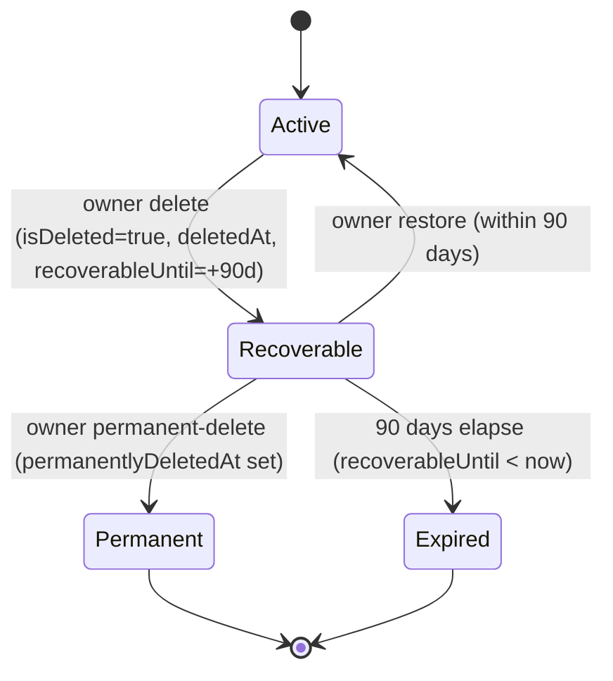

## Overview

Organizations are the tenancy boundary for Propwise CRM. This specification defines how an **organization owner** deletes their workspace, what happens to billing, sessions, real-time connections, and background processing, and how the workspace can be **restored by the owner within a 90-day window** or **permanently removed** earlier.

<Info>
**Status:** Fully implemented (data model, service pipeline, HTTP endpoints, AuthGuard hard-stop, free-org cap, org picker, Danger Zone, cross-module WebSocket disconnect, Meta pause/resume, lifecycle event system)
</Info>

### Key Concepts

Deletion is a **reversible soft delete**. The organization row stays in the database with `isDeleted = true` and all CRM data intact. There is **no automated hard purge** in this phase.

The lifecycle is driven by a single boolean (`isDeleted`) plus four lifecycle timestamps. There is **no separate `status` enum** — this matches the existing `isDeleted: false` queries across the codebase and avoids syncing two fields.

### What This Feature Delivers

<CardGroup cols={2}>
  <Card title="Immediate Access Revocation" icon="ban">
    All org-scoped sessions revoked; no API call succeeds for that org after delete
  </Card>
  <Card title="Member Removal" icon="user-minus">
    Removed members can log in but never see the deleted org again
  </Card>
  <Card title="Owner Recovery Window" icon="clock-rotate-left">
    90-day self-service recovery with restore and permanent-delete options
  </Card>
  <Card title="Slot Accounting" icon="calculator">
    Recoverable orgs still occupy owner's free-organization slot
  </Card>
  <Card title="Real-time Teardown" icon="power-off">
    Immediate stop of crons, WebSockets, and Meta webhooks with reactivation on restore
  </Card>
  <Card title="Billing Management" icon="credit-card">
    Paid subscriptions stop auto-renewal at current period end
  </Card>
</CardGroup>

---

## Product Decisions

<Note>
These decisions are **locked** and form the foundation of the organization lifecycle system.
</Note>

| Topic | Decision |
|-------|----------|
| **Who can delete** | **Organization owner only** — `organization.owner_id` must match authenticated user. Endpoint requires RBAC `system.owner` (`OrgPermissionKey.SYSTEM_OWNER`). Not system admin via product settings, not org Admin. |
| **Recovery (owner)** | **Self-service** — owner can **Restore** within **90 days** or **Permanently delete** immediately, both from org picker. Beyond 90 days or after permanent-delete, owner self-service is disabled. |
| **Recovery (system admin)** | System admin dashboard lists deleted organizations and can **Restore** with **no 90-day limit** (Recoverable, Expired, or Permanent). Can also **Delete** any organization using same pipeline as owner flow. |
| **Billing on delete** | **Cancel at period end** — `cancelSubscription(organizationId, userId, immediate = false)`. Paid orgs stop auto-renewal at current period end. Free orgs (no `stripeSubscriptionId`) skip Stripe. |
| **Data after delete** | **Soft delete only** — `isDeleted = true` plus lifecycle timestamps. No hard purge, no `status` column. Permanent-delete keeps the row and only sets `permanentlyDeletedAt`. |
| **Session handling** | Revoke all org-scoped sessions immediately with reason `ORG_ACCESS_REVOKED`. Restore does not un-revoke sessions; owner re-selects org for fresh sessions. |
| **Real-time/background** | Disconnect WebSocket clients cluster-wide, pause + unsubscribe Meta/WhatsApp webhooks, exclude from cron/queue dispatchers. Restore re-includes org and re-subscribes Meta. |
| **Owner visibility** | Owner sees deleted org in picker for 90 days (non-enterable) with Restore + Permanent-delete actions. Other members and APIs treat it as gone. |
| **Free-org slot** | **Recoverable** org still occupies owner's free slot. **Permanent** or **Expired** frees the slot. |
| **Member UX** | Notify non-owner members via existing `REMOVED_FROM_ORGANIZATION` notification type. |

<Warning>
**Note on prior spec:** Earlier revisions declared self-service restore a non-goal and said deleted orgs immediately free slots. Those decisions are **superseded** by the locked decisions above.
</Warning>

---

## Lifecycle States

### State Machine



### State Definitions

<Tabs>
  <Tab title="Active">
    **Condition:** `isDeleted = false`
    
    - **Owner picker:** Visible + enterable
    - **Members/APIs:** Visible per RBAC
    - **Free slot:** Occupied
    - **Self-service restore:** n/a
    - **Background jobs:** Eligible
  </Tab>
  
  <Tab title="Recoverable">
    **Condition:** `isDeleted = true` AND `permanentlyDeletedAt IS NULL` AND `recoverableUntil >= now`
    
    - **Owner picker:** Visible, **not enterable**, shows Restore + Permanent-delete
    - **Members/APIs:** Hidden everywhere
    - **Free slot:** **Occupied**
    - **Self-service restore:** **Allowed**
    - **Background jobs:** Excluded
  </Tab>
  
  <Tab title="Permanent">
    **Condition:** `isDeleted = true` AND `permanentlyDeletedAt IS NOT NULL`
    
    - **Owner picker:** Hidden
    - **Members/APIs:** Hidden
    - **Free slot:** **Freed**
    - **Self-service restore:** Disabled (support SQL only)
    - **Background jobs:** Excluded
  </Tab>
  
  <Tab title="Expired">
    **Condition:** `isDeleted = true` AND `permanentlyDeletedAt IS NULL` AND `recoverableUntil < now`
    
    - **Owner picker:** Hidden
    - **Members/APIs:** Hidden
    - **Free slot:** **Freed**
    - **Self-service restore:** Disabled (support SQL only)
    - **Background jobs:** Excluded
  </Tab>
</Tabs>

### State Invariants

<Check>
**When `isDeleted = false`:** All lifecycle timestamps (`deletedAt`, `deletedBy`, `recoverableUntil`, `permanentlyDeletedAt`) MUST be `NULL`.
</Check>

<Check>
**When `isDeleted = true`:** `deletedAt` and `recoverableUntil` SHOULD be set. `permanentlyDeletedAt` is set only on permanent-delete.
</Check>

<Info>
The 90-day boundary is evaluated **at read time** (`recoverableUntil >= now`). No cron flips Recoverable → Expired.
</Info>

---

## Data Model

### Database Schema

<CodeGroup>
```sql Migration
-- Add lifecycle columns to organization table
ALTER TABLE organization
  ADD COLUMN deleted_at TIMESTAMP WITH TIME ZONE,
  ADD COLUMN deleted_by_id UUID REFERENCES "user"(id) ON DELETE SET NULL,
  ADD COLUMN recoverable_until TIMESTAMP WITH TIME ZONE,
  ADD COLUMN permanently_deleted_at TIMESTAMP WITH TIME ZONE;

-- Index for lifecycle queries
CREATE INDEX idx_organization_lifecycle 
  ON organization(is_deleted, recoverable_until, permanently_deleted_at)
  WHERE is_deleted = true;

-- Index for owner-owned deleted orgs (org picker)
CREATE INDEX idx_organization_owner_deleted 
  ON organization(owner_id, is_deleted)
  WHERE is_deleted = true;
```

```typescript Entity
@Entity('organization')
export class Organization {
  @Column({ type: 'boolean', default: false, name: 'is_deleted' })
  isDeleted: boolean;

  @Column({ 
    type: 'timestamp with time zone', 
    nullable: true, 
    name: 'deleted_at' 
  })
  deletedAt?: Date;

  @ManyToOne(() => User, { nullable: true })
  @JoinColumn({ name: 'deleted_by_id' })
  deletedBy?: User;

  @Column({ 
    type: 'timestamp with time zone', 
    nullable: true, 
    name: 'recoverable_until' 
  })
  recoverableUntil?: Date;

  @Column({ 
    type: 'timestamp with time zone', 
    nullable: true, 
    name: 'permanently_deleted_at' 
  })
  permanentlyDeletedAt?: Date;

  @ManyToOne(() => User)
  @JoinColumn({ name: 'owner_id' })
  owner: User;

  @Column({ name: 'owner_id' })
  ownerId: string;
}
```
</CodeGroup>

### DTOs

<CodeGroup>
```typescript OrganizationDto
export class OrganizationDto {
  id: string;
  name: string;
  ownerId: string;
  isDeleted: boolean;
  deletedAt?: Date;
  deletedById?: string;
  recoverableUntil?: Date;
  permanentlyDeletedAt?: Date;
  
  // Computed lifecycle state
  lifecycleState?: 'active' | 'pending_deletion' | 'permanently_deleted' | 'expired';
}
```

```typescript AdminOrganizationDto
export class AdminOrganizationDto extends OrganizationDto {
  deletedBy?: {
    id: string;
    name: string;
  };
  
  // Additional admin-only fields
  memberCount?: number;
  createdAt: Date;
  updatedAt: Date;
}
```
</CodeGroup>

---

## Owner-Initiated Deletion Flow

<Steps>
  <Step title="API Request">
    Owner sends `DELETE /v1/organizations/:id` with valid session
    
    ```typescript
    @Delete(':id')
    @CheckAccess(OrgPermissionKey.SYSTEM_OWNER)
    @UseGuards(AuthGuard, OrgPermissionGuard)
    async deleteOrganization(
      @Param('id') organizationId: string,
      @CurrentUser() user: User,
    ): Promise<void> {
      await this.organizationService.delete(organizationId, user.id);
    }
    ```
  </Step>

  <Step title="Authorization Check">
    Verify caller is organization owner
    
    ```typescript
    const organization = await this.organizationRepository.findOne({
      where: { id: organizationId },
      relations: ['owner'],
    });
    
    if (organization.ownerId !== userId) {
      throw new ForbiddenException('Only owner can delete organization');
    }
    ```
  </Step>

  <Step title="Billing Cancellation">
    Cancel subscription at period end (paid orgs only)
    
    ```typescript
    if (organization.stripeSubscriptionId) {
      await this.subscriptionService.cancelSubscription(
        organizationId,
        userId,
        false, // immediate = false → cancel at period end
      );
    }
    ```
  </Step>

  <Step title="Soft Delete Transaction">
    Set lifecycle fields and save
    
    ```typescript
    const now = new Date();
    const recoverableUntil = new Date(now.getTime() + 90 * 24 * 60 * 60 * 1000);
    
    organization.isDeleted = true;
    organization.deletedAt = now;
    organization.deletedBy = { id: userId } as User;
    organization.recoverableUntil = recoverableUntil;
    organization.permanentlyDeletedAt = null;
    
    await this.organizationRepository.save(organization);
    ```
  </Step>

  <Step title="Session Revocation">
    Revoke all org-scoped sessions immediately
    
    ```typescript
    await this.sessionService.revokeAllOrgSessionsForOrganization(
      organizationId,
      SessionRevocationReason.ORG_ACCESS_REVOKED,
    );
    ```
  </Step>

  <Step title="Event Emission">
    Emit `OrganizationDeletedEvent` for async cleanup
    
    ```typescript
    this.eventEmitter.emit(
      ORGANIZATION_EVENTS.DELETED,
      new OrganizationDeletedEvent({
        organizationId,
        deletedBy: userId,
        deletedAt: now,
        recoverableUntil,
      }),
    );
    ```
  </Step>

  <Step title="Member Notifications">
    Notify all non-owner members they've been removed
    
    ```typescript
    const members = await this.getOrganizationMembers(organizationId);
    const nonOwnerMembers = members.filter(m => m.id !== userId);
    
    await Promise.all(
      nonOwnerMembers.map(member =>
        this.notificationService.create({
          userId: member.id,
          type: NotificationType.REMOVED_FROM_ORGANIZATION,
          data: { organizationName: organization.name },
        }),
      ),
    );
    ```
  </Step>

  <Step title="Real-time Teardown">
    Disconnect WebSockets and pause Meta webhooks (async via event listeners)
    
    ```typescript
    // WebSocket listener
    @OnEvent(ORGANIZATION_EVENTS.DELETED)
    async handleOrganizationDeleted(event: OrganizationDeletedEvent) {
      await this.websocketService.disconnectOrganization(
        event.organizationId,
        'Organization deleted',
      );
    }
    
    // Meta listener
    @OnEvent(ORGANIZATION_EVENTS.DELETED)
    async pauseMetaWebhooks(event: OrganizationDeletedEvent) {
      const accounts = await this.metaService.findAccountsByOrganization(
        event.organizationId,
      );
      
      await Promise.all(
        accounts.map(account =>
          this.metaService.pauseWebhookSubscription(account.id),
        ),
      );
    }
    ```
  </Step>
</Steps>

<Warning>
**Session revocation is synchronous.** After step 5, no API call with that org's session will succeed. WebSocket disconnection and Meta pause are async but complete within seconds.
</Warning>

---

## Restore Flow (Self-Service)

<Steps>
  <Step title="API Request">
    Owner sends `POST /v1/organizations/:id/restore` with identity token
    
    ```typescript
    @Post(':id/restore')
    @IdentityTokenOnly()
    @UseGuards(IdentityTokenGuard)
    async restoreOrganization(
      @Param('id') organizationId: string,
      @CurrentUser() user: User,
    ): Promise<OrganizationDto> {
      return this.organizationService.restore(organizationId, user.id);
    }
    ```
    
    <Info>
    Uses `@IdentityTokenOnly()` because org-scoped sessions are revoked. Owner must use identity token from org picker.
    </Info>
  </Step>

  <Step title="Authorization & Window Check">
    Verify caller is owner and within 90-day window
    
    ```typescript
    const organization = await this.organizationRepository.findOne({
      where: { id: organizationId, isDeleted: true },
      relations: ['owner'],
    });
    
    if (organization.ownerId !== userId) {
      throw new ForbiddenException('Only owner can restore organization');
    }
    
    if (organization.permanentlyDeletedAt) {
      throw new ConflictException('Organization is permanently deleted');
    }
    
    if (new Date() > organization.recoverableUntil) {
      throw new ConflictException('Recovery window has expired');
    }
    ```
  </Step>

  <Step title="Clear Lifecycle Fields">
    Reset soft-delete state
    
    ```typescript
    organization.isDeleted = false;
    organization.deletedAt = null;
    organization.deletedBy = null;
    organization.recoverableUntil = null;
    organization.permanentlyDeletedAt = null;
    
    await this.organizationRepository.save(organization);
    ```
  </Step>

  <Step title="Resume Billing">
    Resume subscription auto-renewal if still active
    
    ```typescript
    if (organization.stripeSubscriptionId) {
      try {
        await this.subscriptionService.resumeSubscription(organizationId);
      } catch (error) {
        // Subscription may have ended; log but don't block restore
        this.logger.warn(`Could not resume subscription: ${error.message}`);
      }
    }
    ```
  </Step>

  <Step title="Event Emission">
    Emit `OrganizationRestoredEvent` for reactivation
    
    ```typescript
    this.eventEmitter.emit(
      ORGANIZATION_EVENTS.RESTORED,
      new OrganizationRestoredEvent({
        organizationId,
        restoredBy: userId,
        restoredAt: new Date(),
      }),
    );
    ```
  </Step>

  <Step title="Real-time Reactivation">
    Re-include org in background jobs and resume Meta webhooks
    
    ```typescript
    // Meta listener
    @OnEvent(ORGANIZATION_EVENTS.RESTORED)
    async resumeMetaWebhooks(event: OrganizationRestoredEvent) {
      const accounts = await this.metaService.findAccountsByOrganization(
        event.organizationId,
      );
      
      await Promise.all(
        accounts.map(account =>
          this.metaService.resumeWebhookSubscription(account.id),
        ),
      );
    }
    ```
    
    <Info>
    WebSocket reconnection is not automatic. Owner must re-select the org to establish new sessions and WebSocket connections.
    </Info>
  </Step>
</Steps>

<Check>
After restore, the organization is immediately **Active** and all members can access it normally (after re-authentication).
</Check>

---

## Permanent-Delete Flow

<Steps>
  <Step title="API Request">
    Owner sends `POST /v1/organizations/:id/permanent-delete` with identity token
    
    ```typescript
    @Post(':id/permanent-delete')
    @IdentityTokenOnly()
    @UseGuards(IdentityTokenGuard)
    async permanentlyDeleteOrganization(
      @Param('id') organizationId: string,
      @CurrentUser() user: User,
    ): Promise<void> {
      await this.organizationService.permanentDelete(organizationId, user.id);
    }
    ```
  </Step>

  <Step title="Authorization Check">
    Verify caller is owner and org is in Recoverable state
    
    ```typescript
    const organization = await this.organizationRepository.findOne({
      where: { id: organizationId, isDeleted: true },
      relations: ['owner'],
    });
    
    if (organization.ownerId !== userId) {
      throw new ForbiddenException('Only owner can permanently delete');
    }
    
    if (organization.permanentlyDeletedAt) {
      throw new ConflictException('Already permanently deleted');
    }
    ```
  </Step>

  <Step title="Mark Permanent">
    Set `permanentlyDeletedAt` timestamp
    
    ```typescript
    organization.permanentlyDeletedAt = new Date();
    await this.organizationRepository.save(organization);
    ```
    
    <Warning>
    This does **not** hard-delete the row or change `isDeleted`. The org stays soft-deleted but moves from Recoverable to Permanent state.
    </Warning>
  </Step>

  <Step title="Free Owner Slot">
    Organization no longer counts toward owner's free-org cap
    
    ```typescript
    // Free-org cap query now excludes this org
    const ownedOrgsCount = await this.organizationRepository.count({
      where: {
        ownerId: userId,
        isDeleted: false, // Active orgs only
      },
    });
    
    // Recoverable orgs with permanentlyDeletedAt are also excluded
    const recoverableOrgsCount = await this.organizationRepository.count({
      where: {
        ownerId: userId,
        isDeleted: true,
        permanentlyDeletedAt: IsNull(),
        recoverableUntil: MoreThanOrEqual(new Date()),
      },
    });
    
    const totalOccupiedSlots = ownedOrgsCount + recoverableOrgsCount;
    ```
  </Step>

  <Step title="Hide from Owner Picker">
    Organization disappears from org picker immediately
    
    ```typescript
    // findByUser query excludes Permanent orgs
    const organizations = await this.organizationRepository.find({
      where: [
        { isDeleted: false }, // Active orgs
        {
          // Recoverable orgs for owner only
          isDeleted: true,
          ownerId: userId,
          permanentlyDeletedAt: IsNull(),
          recoverableUntil: MoreThanOrEqual(new Date()),
        },
      ],
    });
    ```
  </Step>
</Steps>

<Info>
**System admin can still restore** a Permanent org via the admin dashboard. The row is never hard-deleted in this phase.
</Info>

---

## Billing Behavior

### Subscription Cancellation

<Tabs>
  <Tab title="Paid Subscriptions">
    **On delete:**
    
    ```typescript
    await this.subscriptionService.cancelSubscription(
      organizationId,
      userId,
      false, // immediate = false → cancel at period end
    );
    ```
    
    - Stripe subscription set to `cancel_at_period_end = true`
    - Organization retains paid features until current billing period ends
    - No refund issued for remaining time
    - Auto-renewal stopped
    
    **On restore (within period):**
    
    ```typescript
    await this.subscriptionService.resumeSubscription(organizationId);
    ```
    
    - If Stripe subscription still active: remove `cancel_at_period_end`
    - Auto-renewal resumes
    - If subscription already ended: owner must re-subscribe manually
  </Tab>
  
  <Tab title="Free Organizations">
    **On delete:**
    
    ```typescript
    if (!organization.stripeSubscriptionId) {
      // Skip Stripe operations, no error
      this.logger.log(`Free org ${organizationId} deleted, no billing changes`);
    }
    ```
    
    - No Stripe API calls
    - No billing changes
    - Org immediately moves to Recoverable state
    
    **On restore:**
    
    - No billing operations needed
    - Org returns to free tier
  </Tab>
</Tabs>

### Webhook Handling

<Warning>
**Deleted orgs can still receive Stripe webhooks** during the recovery window if the subscription hasn't ended yet.
</Warning>

```typescript
// Stripe webhook handler
@Post('webhooks/stripe')
async handleStripeWebhook(@Body() event: Stripe.Event) {
  const organization = await this.organizationRepository.findOne({
    where: { stripeCustomerId: event.data.object.customer },
    withDeleted: true, // Include soft-deleted orgs
  });
  
  if (organization?.isDeleted) {
    // Process subscription.updated, invoice.paid, etc.
    // Even for deleted orgs to maintain billing accuracy
    this.logger.log(`Processing webhook for deleted org ${organization.id}`);
  }
  
  // Process webhook normally
  await this.webhookService.processEvent(event);
}
```

<Info>
This ensures billing records stay accurate if an org is restored before the subscription ends.
</Info>

---

## Sessions and Access

### Session Revocation

<Steps>
  <Step title="Trigger">
    After soft-delete transaction commits
    
    ```typescript
    await this.sessionService.revokeAllOrgSessionsForOrganization(
      organizationId,
      SessionRevocationReason.ORG_ACCESS_REVOKED,
    );
    ```
  </Step>

  <Step title="Mark Sessions Invalid">
    Update all org-scoped sessions
    
    ```typescript
    await this.orgSessionRepository.update(
      { organizationId },
      {
        revokedAt: new Date(),
        revocationReason: SessionRevocationReason.ORG_ACCESS_REVOKED,
      },
    );
    ```
  </Step>

  <Step title="Clear Liveness Cache">
    Remove from Redis session cache
    
    ```typescript
    const sessions = await this.orgSessionRepository.find({
      where: { organizationId },
    });
    
    await Promise.all(
      sessions.map(session =>
        this.redis.del(`session:org:${session.id}:liveness`),
      ),
    );
    ```
  </Step>
</Steps>

### AuthGuard Behavior

<CodeGroup>
```typescript Session Validation
@Injectable()
export class AuthGuard implements CanActivate {
  async canActivate(context: ExecutionContext): Promise<boolean> {
    const request = context.switchToHttp().getRequest();
    const orgSessionId = request.headers['x-org-session-id'];
    
    if (!orgSessionId) {
      throw new UnauthorizedException('No org session');
    }
    
    // Check liveness cache
    const isLive = await this.redis.get(`session:org:${orgSessionId}:liveness`);
    
    if (isLive) {
      // Fast path: session is live
      return true;
    }
    
    // Cache miss: verify in database
    const session = await this.orgSessionRepository.findOne({
      where: { id: orgSessionId },
      relations: ['organization'],
    });
    
    if (!session || session.revokedAt) {
      throw new UnauthorizedException('Session revoked');
    }
    
    // Check organization status
    if (session.organization.isDeleted) {
      throw new ForbiddenException('Organization is no longer accessible');
    }
    
    // Restore liveness cache
    await this.redis.setex(
      `session:org:${orgSessionId}:liveness`,
      3600,
      '1',
    );
    
    return true;
  }
}
```

```typescript Legacy Token Check
// For tokens without orgSessionId (deprecated)
if (!orgSessionId && request.user.organizationId) {
  const organization = await this.organizationRepository.findOne({
    where: { id: request.user.organizationId },
  });
  
  if (organization?.isDeleted) {
    throw new ForbiddenException('Organization is no longer accessible');
  }
}
```
</CodeGroup>

<Warning>
**All org-scoped API calls fail immediately after deletion**, including:
- CRM operations (contacts, deals, properties)
- Messaging (conversations, messages, campaigns)
- Settings and team management
- Integrations and webhooks

Only identity-token endpoints (org picker, restore, permanent-delete) work.
</Warning>

---

## Member Notifications

### Notification Type

<CodeGroup>
```typescript Enum
export enum NotificationType {
  // ... other types
  REMOVED_FROM_ORGANIZATION = 'removed_from_organization',
}
```

```typescript Notification Creation
const members = await this.userOrganizationRepository.find({
  where: { organizationId },
  relations: ['user'],
});

const nonOwnerMembers = members
  .filter(m => m.userId !== deletedBy)
  .map(m => m.user);

await Promise.all(
  nonOwnerMembers.map(member =>
    this.notificationService.create({
      userId: member.id,
      type: NotificationType.REMOVED_FROM_ORGANIZATION,
      data: {
        organizationId: organization.id,
        organizationName: organization.name,
        deletedBy: deletedByName,
        deletedAt: new Date().toISOString(),
      },
    }),
  ),
);
```
</CodeGroup>

### Notification Content

<Tabs>
  <Tab title="In-App">
    **Title:** Organization Removed
    
    **Body:** You've been removed from **{organizationName}**. The organization was deleted by {deletedBy}.
    
    **Actions:** None (informational only)
  </Tab>
  
  <Tab title="Email">
    **Subject:** You've been removed from {organizationName}
    
    **Body:**
    
    Hi {memberName},
    
    You've been removed from **{organizationName}**. The organization owner, {deletedBy}, deleted the workspace on {deletedAt}.
    
    You no longer have access to this organization's data, conversations, or contacts.
    
    If you believe this was done in error, please contact the organization owner directly.
    
    — The Propwise Team
  </Tab>
</Tabs>

<Info>
Members receive notification via all enabled channels (in-app, email, SMS if configured). The org disappears from their picker immediately.
</Info>

---

## Background Jobs and Crons

### Exclusion Strategy

<Tabs>
  <Tab title="Escalation Cron">
    ```typescript
    @Cron('*/5 * * * *') // Every 5 minutes
    async checkEscalationRules() {
      const activeOrgs = await this.organizationRepository.find({
        where: { isDeleted: false },
      });
      
      for (const org of activeOrgs) {
        const rules = await this.escalationRuleRepository.find({
          where: { organizationId: org.id, isActive: true },
        });
        
        await this.processEscalationRules(org.id, rules);
      }
    }
    ```
    
    <Check>
    Query explicitly filters `isDeleted = false` so deleted orgs are never dispatched.
    </Check>
  </Tab>
  
  <Tab title="Distribution Cron">
    ```typescript
    @Cron('0 * * * *') // Hourly
    async processDistributionQueues() {
      const activeOrgs = await this.organizationRepository.find({
        where: { isDeleted: false },
      });
      
      for (const org of activeOrgs) {
        await this.distributionService.processOrgQueue(org.id);
      }
    }
    ```
    
    <Check>
    Deleted orgs excluded from hourly distribution processing.
    </Check>
  </Tab>
  
  <Tab title="Queue Job Guard">
    ```typescript
    @Process('send-campaign')
    async handleSendCampaign(job: Job<SendCampaignDto>) {
      const { organizationId, campaignId } = job.data;
      
      // Guard: check org status before processing
      const org = await this.organizationRepository.findOne({
        where: { id: organizationId },
      });
      
      if (org?.isDeleted) {
        this.logger.log(`Skipping job for deleted org ${organizationId}`);
        return; // No-op for deleted org
      }
      
      // Process normally
      await this.campaignService.send(campaignId);
    }
    ```
    
    <Warning>
    In-flight or queued jobs are **not purged** on delete. The guard makes them no-op if they run after deletion.
    </Warning>
  </Tab>
  
  <Tab title="Account Health Cron">
    ```typescript
    @Cron('0 6 * * *') // Daily at 6am
    async calculateAccountHealth() {
      const activeOrgs = await this.organizationRepository.find({
        where: { isDeleted: false },
      });
      
      for (const org of activeOrgs) {
        await this.accountHealthService.calculateScores(org.id);
      }
    }
    ```
    
    <Check>
    Health score calculation skips deleted orgs.
    </Check>
  </Tab>
</Tabs>

### Reactivation on Restore

<Info>
**No special reactivation needed.** When an org is restored (`isDeleted = false`), the next cron cycle automatically includes it in `{ isDeleted: false }` queries.
</Info>

---

## Real-time Teardown

### WebSocket Disconnection

<Steps>
  <Step title="Event Listener">
    Listen for `OrganizationDeletedEvent`
    
    ```typescript
    @OnEvent(ORGANIZATION_EVENTS.DELETED)
    async handleOrganizationDeleted(event: OrganizationDeletedEvent) {
      await this.websocketService.disconnectOrganization(
        event.organizationId,
        'Organization has been deleted',
      );
    }
    ```
  </Step>

  <Step title="Cluster-wide Disconnect">
    Use `PostgresIoAdapter` to disconnect across all instances
    
    ```typescript
    async disconnectOrganization(
      organizationId: string,
      reason: string,
    ): Promise<void> {
      // Get all sockets in org rooms
      const rooms = [
        `org:${organizationId}`,
        `org:${organizationId}:conversations`,
        `org:${organizationId}:notifications`,
        `org:${organizationId}:crm`,
      ];
      
      for (const room of rooms) {
        const sockets = await this.server.in(room).fetchSockets();
        
        for (const socket of sockets) {
          socket.emit('organization.deleted', {
            organizationId,
            reason,
            timestamp: new Date().toISOString(),
          });
          
          socket.disconnect(true);
        }
      }
      
      this.logger.log(
        `Disconnected ${sockets.length} sockets for org ${organizationId}`,
      );
    }
    ```
  </Step>

  <Step title="Client Handling">
    Frontend receives disconnect event and redirects to org picker
    
    ```typescript
    socket.on('organization.deleted', ({ organizationId, reason }) => {
      toast.error(`Organization deleted: ${reason}`);
      router.push('/organization-selection');
    });
    ```
  </Step>
</Steps>

<Warning>
**WebSocket connections are not automatically re-established on restore.** Owner must re-select the org to create new sessions and connections.
</Warning>

### Meta Webhook Management

<Steps>
  <Step title="Pause on Delete">
    ```typescript
    @OnEvent(ORGANIZATION_EVENTS.DELETED)
    async pauseMetaWebhooks(event: OrganizationDeletedEvent) {
      const accounts = await this.channelAccountRepository.find({
        where: {
          organizationId: event.organizationId,
          platform: ChannelPlatform.META,
        },
      });
      
      for (const account of accounts) {
        if (account.webhookSubscriptionId) {
          await this.metaApiService.pauseSubscription(
            account.webhookSubscriptionId,
          );
          
          account.webhookStatus = 'paused';
          await this.channelAccountRepository.save(account);
        }
      }
    }
    ```
    
    <Info>
    **Non-destructive pause:** Keeps `webhookSubscriptionId` and access tokens. Subscription can be resumed on restore.
    </Info>
  </Step>

  <Step title="Resume on Restore">
    ```typescript
    @OnEvent(ORGANIZATION_EVENTS.RESTORED)
    async resumeMetaWebhooks(event: OrganizationRestoredEvent) {
      const accounts = await this.channelAccountRepository.find({
        where: {
          organizationId: event.organizationId,
          platform: ChannelPlatform.META,
          webhookStatus: 'paused',
        },
      });
      
      for (const account of accounts) {
        if (account.webhookSubscriptionId) {
          await this.metaApiService.resumeSubscription(
            account.webhookSubscriptionId,
          );
          
          account.webhookStatus = 'active';
          await this.channelAccountRepository.save(account);
        }
      }
    }
    ```
  </Step>

  <Step title="Inbound Webhook Guard">
    Reject webhooks for deleted orgs
    
    ```typescript
    @Post('webhooks/meta')
    async handleMetaWebhook(@Body() payload: MetaWebhookPayload) {
      const account = await this.channelAccountRepository.findOne({
        where: { metaBusinessId: payload.entry[0].id },
        relations: ['organization'],
      });
      
      if (account.organization.isDeleted) {
        this.logger.warn(
          `Rejecting webhook for deleted org ${account.organizationId}`,
        );
        return { status: 'ok' }; // Ack but don't process
      }
      
      await this.webhookService.processMetaWebhook(payload);
    }
    ```
  </Step>
</Steps>

---

## Free Organization Ownership Cap

### Slot Counting Logic

```typescript
async checkFreeOrgLimit(ownerId: string): Promise<boolean> {
  // Count Active orgs
  const activeOrgs = await this.organizationRepository.count({
    where: {
      ownerId,
      isDeleted: false,
    },
  });
  
  // Count Recoverable orgs (still occupy slot)
  const recoverableOrgs = await this.organizationRepository.count({
    where: {
      ownerId,
      isDeleted: true,
      permanentlyDeletedAt: IsNull(),
      recoverableUntil: MoreThanOrEqual(new Date()),
    },
  });
  
  const totalOccupiedSlots = activeOrgs + recoverableOrgs;
  
  return totalOccupiedSlots < FREE_ORG_LIMIT; // 3
}
```

<Tabs>
  <Tab title="Active Org">
    **Counts toward limit:** ✅
    
    ```typescript
    { isDeleted: false }
    ```
  </Tab>
  
  <Tab title="Recoverable Org">
    **Counts toward limit:** ✅
    
    ```typescript
    {
      isDeleted: true,
      permanentlyDeletedAt: IsNull(),
      recoverableUntil: >= now
    }
    ```
    
    <Warning>
    Even though deleted, this org still occupies a slot until permanently deleted or expired.
    </Warning>
  </Tab>
  
  <Tab title="Permanent Org">
    **Counts toward limit:** ❌
    
    ```typescript
    {
      isDeleted: true,
      permanentlyDeletedAt: NOT NULL
    }
    ```
    
    <Check>
    Slot is freed immediately when owner clicks "Permanently delete".
    </Check>
  </Tab>
  
  <Tab title="Expired Org">
    **Counts toward limit:** ❌
    
    ```typescript
    {
      isDeleted: true,
      permanentlyDeletedAt: IsNull(),
      recoverableUntil: < now
    }
    ```
    
    <Check>
    Slot is freed automatically after 90 days.
    </Check>
  </Tab>
</Tabs>

### Create Organization Validation

```typescript
@Post('organizations')
async createOrganization(
  @Body() dto: CreateOrganizationDto,
  @CurrentUser() user: User,
): Promise<OrganizationDto> {
  // Check free org limit before creating
  const canCreate = await this.organizationService.checkFreeOrgLimit(user.id);
  
  if (!canCreate) {
    throw new ConflictException(
      'You have reached the maximum number of free organizations (3). ' +
      'Please upgrade an existing organization or permanently delete ' +
      'a recoverable organization to free a slot.',
    );
  }
  
  return this.organizationService.create(dto, user.id);
}
```

<Info>
**Slot counting is real-time.** Permanent-delete or 90-day expiry immediately makes the slot available for a new org.
</Info>

---

## API Contract

### Owner Endpoints

<AccordionGroup>
  <Accordion title="DELETE /v1/organizations/:id">
    **Soft-delete an organization (owner only)**
    
    **Auth:** Requires org-scoped session + `system.owner` permission
    
    **Request:**
    ```bash
    DELETE /v1/organizations/550e8400-e29b-41d4-a716-446655440000
    Authorization: Bearer {accessToken}
    X-Org-Session-Id: {orgSessionId}
    ```
    
    **Response:** `204 No Content`
    
    **Errors:**
    - `401` — Not authenticated
    - `403` — Not organization owner
    - `404` — Organization not found
    - `409` — Organization already deleted
  </Accordion>

  <Accordion title="POST /v1/organizations/:id/restore">
    **Restore a recoverable organization (owner only)**
    
    **Auth:** Requires identity token (no org scope)
    
    **Request:**
    ```bash
    POST /v1/organizations/550e8400-e29b-41d4-a716-446655440000/restore
    Authorization: Bearer {identityToken}
    ```
    
    **Response:**
    ```json
    {
      "id": "550e8400-e29b-41d4-a716-446655440000",
      "name": "Acme Real Estate",
      "ownerId": "user-123",
      "isDeleted": false,
      "lifecycleState": "active",
      "deletedAt": null,
      "recoverableUntil": null
    }
    ```
    
    **Errors:**
    - `401` — Not authenticated
    - `403` — Not organization owner
    - `404` — Organization not found
    - `409` — Not in recoverable state (permanent or expired)
    - `409` — Recovery window expired
  </Accordion>

  <Accordion title="POST /v1/organizations/:id/permanent-delete">
    **Permanently delete a recoverable organization (owner only)**
    
    **Auth:** Requires identity token (no org scope)
    
    **Request:**
    ```bash
    POST /v1/organizations/550e8400-e29b-41d4-a716-446655440000/permanent-delete
    Authorization: Bearer {identityToken}
    ```
    
    **Response:** `204 No Content`
    
    **Errors:**
    - `401` — Not authenticated
    - `403` — Not organization owner
    - `404` — Organization not found
    - `409` — Not in recoverable state (already permanent)
  </Accordion>

  <Accordion title="GET /v1/organizations">
    **List organizations for current user**
    
    **Auth:** Requires identity token
    
    **Request:**
    ```bash
    GET /v1/organizations
    Authorization: Bearer {identityToken}
    ```
    
    **Response:**
    ```json
    {
      "organizations": [
        {
          "id": "org-active",
          "name": "Active Org",
          "ownerId": "user-123",
          "isDeleted": false,
          "lifecycleState": "active"
        },
        {
          "id": "org-recoverable",
          "name": "Deleted Org",
          "ownerId": "user-123",
          "isDeleted": true,
          "lifecycleState": "pending_deletion",
          "deletedAt": "2024-01-15T10:00:00Z",
          "recoverableUntil": "2024-04-15T10:00:00Z",
          "canRestore": true,
          "canPermanentlyDelete": true
        }
      ]
    }
    ```
    
    <Info>
    Returns Active orgs for all members, plus Recoverable orgs for the owner only. Permanent and Expired orgs are hidden.
    </Info>
  </Accordion>
</AccordionGroup>

### System Admin Endpoints

<AccordionGroup>
  <Accordion title="GET /system-admin/organizations">
    **List all organizations (admin only)**
    
    **Auth:** Requires system admin role
    
    **Query params:**
    - `includeDeleted` (boolean) — default `false`
    - `lifecycleState` (string) — filter by `active`, `recoverable`, `expired`, `permanently_deleted`
    - `page` (number) — pagination
    - `limit` (number) — pagination
    
    **Request:**
    ```bash
    GET /system-admin/organizations?includeDeleted=true&lifecycleState=recoverable
    Authorization: Bearer {adminToken}
    ```
    
    **Response:**
    ```json
    {
      "organizations": [
        {
          "id": "org-123",
          "name": "Deleted Org",
          "ownerId": "user-456",
          "ownerName": "John Doe",
          "isDeleted": true,
          "lifecycleState": "recoverable",
          "deletedAt": "2024-01-15T10:00:00Z",
          "deletedBy": {
            "id": "user-456",
            "name": "John Doe"
          },
          "recoverableUntil": "2024-04-15T10:00:00Z",
          "memberCount": 5,
          "createdAt": "2023-06-01T08:00:00Z"
        }
      ],
      "total": 1,
      "page": 1,
      "limit": 20
    }
    ```
  </Accordion>

  <Accordion title="POST /system-admin/organizations/:id/restore">
    **Restore any organization (admin only, no time limit)**
    
    **Auth:** Requires system admin role
    
    **Request:**
    ```bash
    POST /system-admin/organizations/550e8400-e29b-41d4-a716-446655440000/restore
    Authorization: Bearer {adminToken}
    ```
    
    **Response:**
    ```json
    {
      "id": "550e8400-e29b-41d4-a716-446655440000",
      "name": "Restored Org",
      "isDeleted": false,
      "lifecycleState": "active"
    }
    ```
    
    <Check>
    Can restore Recoverable, Expired, or Permanent orgs. No 90-day limit.
    </Check>
  </Accordion>

  <Accordion title="DELETE /system-admin/organizations/:id">
    **Delete any organization (admin only)**
    
    **Auth:** Requires system admin role
    
    **Request:**
    ```bash
    DELETE /system-admin/organizations/550e8400-e29b-41d4-a716-446655440000
    Authorization: Bearer {adminToken}
    ```
    
    **Response:** `204 No Content`
    
    <Warning>
    Uses the same soft-delete pipeline as owner deletion, but immediately sets `permanentlyDeletedAt` (no recoverable window for system-deleted orgs).
    </Warning>
  </Accordion>
</AccordionGroup>

---

## Frontend UX

### Organization Picker

<Tabs>
  <Tab title="Active Organizations">
    **Display:**
    - Normal card with org name, logo, member count
    - "Select" button → enter workspace
    
    **Behavior:**
    - Clickable, creates org-scoped session
    - Shows last accessed timestamp
  </Tab>
  
  <Tab title="Recoverable Organizations">
    **Display:**
    - Card with orange/amber border or background
    - **"Pending deletion"** badge
    - Countdown: "X days remaining"
    - **"Restore"** button (primary)
    - **"Permanently delete"** link (destructive)
    
    **Behavior:**
    - Card is **not clickable** (cannot enter)
    - Restore button → confirmation modal → `POST /restore`
    - Permanent-delete link → **double confirmation** modal → `POST /permanent-delete`
    
    ```typescript
    <OrganizationCard
      organization={org}
      variant="pending-deletion"
      actions={
        <>
          <Button onClick={handleRestore} variant="primary">
            Restore
          </Button>
          <Button onClick={handlePermanentDelete} variant="ghost" color="red">
            Permanently delete
          </Button>
        </>
      }
    >
      <Badge color="amber">Pending deletion</Badge>
      <Text size="sm" color="gray">
        {daysRemaining} days remaining to restore
      </Text>
    </OrganizationCard>
    ```
  </Tab>
  
  <Tab title="Permanent/Expired Organizations">
    **Display:**
    - Hidden from picker entirely
    
    **Behavior:**
    - No UI representation
    - Owner cannot see or restore via product
  </Tab>
</Tabs>

### Danger Zone (Settings)

<Steps>
  <Step title="Navigation">
    Owner navigates to **Settings → Organization → Danger Zone**
  </Step>

  <Step title="Delete Section">
    **UI elements:**
    - Section titled "Delete Organization"
    - Warning text explaining consequences
    - "Delete Organization" button (red, destructive)
    
    ```tsx
    <DangerZone>
      <DangerZoneSection
        title="Delete Organization"
        description="Permanently delete this organization and all its data. This action can be undone within 90 days."
      >
        <Button
          color="red"
          onClick={handleDeleteOrganization}
          disabled={!isOwner}
        >
          Delete Organization
        </Button>
      </DangerZoneSection>
    </DangerZone>
    ```
  </Step>

  <Step title="Confirmation Modal">
    **First confirmation:**
    - Title: "Delete {organizationName}?"
    - Body: Explains 90-day recovery window, billing changes, member removal
    - Input: "Type DELETE to confirm"
    - Buttons: Cancel / Delete
    
    **Second confirmation (after first confirms):**
    - Title: "Are you absolutely sure?"
    - Body: Final warning, no undo except restore
    - Checkbox: "I understand that all members will lose access immediately"
    - Buttons: Cancel / Yes, delete organization
  </Step>

  <Step title="After Deletion">
    - Redirect to org picker
    - Show toast: "Organization deleted. You have 90 days to restore it."
    - Org appears in picker as "Pending deletion"
  </Step>
</Steps>

### Restore Confirmation Modal

```tsx
<Modal open={showRestoreModal} onClose={() => setShowRestoreModal(false)}>
  <ModalHeader>Restore {organization.name}?</ModalHeader>
  <ModalBody>
    <Text>
      This will restore the organization and all its data. Members will regain
      access, and billing will resume if you had an active subscription.
    </Text>
    <Callout type="info" className="mt-4">
      If your subscription ended during the deletion period, you'll need to
      resubscribe manually.
    </Callout>
  </ModalBody>
  <ModalFooter>
    <Button variant="outline" onClick={() => setShowRestoreModal(false)}>
      Cancel
    </Button>
    <Button onClick={handleRestore} loading={isRestoring}>
      Restore Organization
    </Button>
  </ModalFooter>
</Modal>
```

### Permanent-Delete Confirmation Modal

```tsx
<Modal
  open={showPermanentDeleteModal}
  onClose={() => setShowPermanentDeleteModal(false)}
>
  <ModalHeader className="text-red-600">
    Permanently delete {organization.name}?
  </ModalHeader>
  <ModalBody>
    <Text className="font-semibold">
      This action cannot be undone. The organization will be permanently
      deleted and you will not be able to restore it.
    </Text>
    <Text className="mt-4">
      However, the data will remain in our systems for compliance purposes.
      Support can restore it if absolutely necessary.
    </Text>
    <TextInput
      label="Type PERMANENT to confirm"
      value={confirmText}
      onChange={(e) => setConfirmText(e.target.value)}
      className="mt-4"
    />
  </ModalBody>
  <ModalFooter>
    <Button
      variant="outline"
      onClick={() => setShowPermanentDeleteModal(false)}
    >
      Cancel
    </Button>
    <Button
      color="red"
      onClick={handlePermanentDelete}
      disabled={confirmText !== 'PERMANENT'}
      loading={isDeleting}
    >
      Permanently Delete
    </Button>
  </ModalFooter>
</Modal>
```

---

## Recovery Beyond the Window

<Warning>
**Self-service restore is disabled** after 90 days or permanent-delete. Only system admin dashboard can restore.
</Warning>

### System Admin Dashboard

<Steps>
  <Step title="Access Dashboard">
    System admin navigates to **Admin → Organizations → Deleted**
    
    ```bash
    GET /system-admin/organizations?includeDeleted=true&lifecycleState=expired
    ```
  </Step>

  <Step title="View Deleted Organization">
    Admin can see full details of expired/permanent orgs:
    - Lifecycle state (Expired / Permanent)
    - Deleted date and deleted by
    - Original recoverable until date
    - Permanent delete date (if applicable)
    - Member count, subscription status
  </Step>

  <Step title="Restore Organization">
    Admin clicks **"Restore"** button
    
    ```bash
    POST /system-admin/organizations/{id}/restore
    ```
    
    <Info>
    **No time limit.** Can restore orgs that are Recoverable, Expired, or Permanent.
    </Info>
  </Step>

  <Step title="Notify Owner">
    After restore, admin should:
    1. Email the owner directly
    2. Explain the org was restored
    3. Ask them to re-select it in the org picker
    4. Mention they may need to resubscribe if billing ended
  </Step>
</Steps>

### Manual SQL Restore (Legacy)

<Warning>
**Deprecated.** Use the system admin dashboard instead. This section is kept for reference only.
</Warning>

<Accordion title="SQL Restore Script (Emergency Only)">
```sql
-- 1. Verify organization exists and is deleted
SELECT 
  id,
  name,
  owner_id,
  is_deleted,
  deleted_at,
  recoverable_until,
  permanently_deleted_at
FROM organization
WHERE id = '550e8400-e29b-41d4-a716-446655440000';

-- 2. Restore organization
UPDATE organization
SET
  is_deleted = false,
  deleted_at = NULL,
  deleted_by_id = NULL,
  recoverable_until = NULL,
  permanently_deleted_at = NULL
WHERE id = '550e8400-e29b-41d4-a716-446655440000';

-- 3. Verify restore
SELECT 
  id,
  name,
  is_deleted,
  deleted_at
FROM organization
WHERE id = '550e8400-e29b-41d4-a716-446655440000';

-- 4. Notify owner via email manually
```

<Warning>
**After manual SQL restore:**
- Meta webhooks will NOT be automatically resumed (no event emitted)
- Background jobs will automatically include the org on next cycle
- Owner must re-select org to get new sessions
</Warning>
</Accordion>

---

## Explicit Non-Goals

<Note>
These features are **intentionally excluded** from the current implementation.
</Note>

| Non-Goal | Reason |
|----------|--------|
| **Hard delete / data purge** | Compliance and recovery requirements. Row stays forever. |
| **Automated 90-day hard purge** | No cron deletes rows. Expired orgs stay soft-deleted. |
| **Member-initiated delete** | Only owner can delete. Admins can remove themselves. |
| **Audit log for lifecycle events** | Generic audit log already captures org updates. |
| **Granular restore (contacts only, etc.)** | All-or-nothing restore. No partial data recovery. |
| **Cancel subscription immediately on delete** | Cancel at period end preserves value for owner. |
| **Purge queued jobs on delete** | Jobs no-op via guard. No active job cancellation. |
| **Session un-revocation on restore** | Owner gets fresh sessions. Cleaner security model. |
| **Email reminder before 90-day expiry** | Future enhancement. Not critical for MVP. |
| **Transfer ownership before delete** | Use existing ownership transfer flow first. |

---

## Constants

```typescript
// src/modules/organization/constants/organization-lifecycle.constants.ts

export const ORGANIZATION_LIFECYCLE = {
  // Recovery window
  RECOVERY_WINDOW_DAYS: 90,
  RECOVERY_WINDOW_MS: 90 * 24 * 60 * 60 * 1000,
  
  // Free organization limits
  FREE_ORG_LIMIT: 3,
  
  // Session revocation
  DELETE_REVOCATION_REASON: 'ORG_ACCESS_REVOKED',
  
  // WebSocket disconnect message
  DISCONNECT_MESSAGE: 'Organization has been deleted',
  
  // Notification type
  MEMBER_NOTIFICATION_TYPE: 'REMOVED_FROM_ORGANIZATION',
} as const;

export const LIFECYCLE_STATE = {
  ACTIVE: 'active',
  RECOVERABLE: 'pending_deletion', // Frontend-facing name
  PERMANENT: 'permanently_deleted',
  EXPIRED: 'expired',
} as const;

export type LifecycleState = typeof LIFECYCLE_STATE[keyof typeof LIFECYCLE_STATE];
```

---

## Testing Requirements

### Unit Tests

<AccordionGroup>
  <Accordion title="OrganizationService.delete">
    ```typescript
    describe('OrganizationService.delete', () => {
      it('should soft-delete organization with lifecycle fields', async () => {
        const result = await service.delete(orgId, ownerId);
        
        expect(result.isDeleted).toBe(true);
        expect(result.deletedAt).toBeDefined();
        expect(result.deletedBy.id).toBe(ownerId);
        expect(result.recoverableUntil).toBeDefined();
        expect(result.permanentlyDeletedAt).toBeNull();
      });
      
      it('should reject non-owner deletion', async () => {
        await expect(
          service.delete(orgId, nonOwnerId),
        ).rejects.toThrow(ForbiddenException);
      });
      
      it('should cancel subscription at period end', async () => {
        await service.delete(orgId, ownerId);
        
        expect(subscriptionService.cancelSubscription).toHaveBeenCalledWith(
          orgId,
          ownerId,
          false, // immediate = false
        );
      });
      
      it('should skip billing for free orgs', async () => {
        org.stripeSubscriptionId = null;
        
        await service.delete(orgId, ownerId);
        
        expect(subscriptionService.cancelSubscription).not.toHaveBeenCalled();
      });
    });
    ```
  </Accordion>

  <Accordion title="OrganizationService.restore">
    ```typescript
    describe('OrganizationService.restore', () => {
      it('should restore recoverable organization', async () => {
        org.isDeleted = true;
        org.recoverableUntil = new Date(Date.now() + 1000 * 60 * 60);
        
        const result = await service.restore(orgId, ownerId);
        
        expect(result.isDeleted).toBe(false);
        expect(result.deletedAt).toBeNull();
        expect(result.recoverableUntil).toBeNull();
      });
      
      it('should reject expired organization restore', async () => {
        org.isDeleted = true;
        org.recoverableUntil = new Date(Date.now() - 1000);
        
        await expect(
          service.restore(orgId, ownerId),
        ).rejects.toThrow(ConflictException);
      });
      
      it('should reject permanent organization restore', async () => {
        org.isDeleted = true;
        org.permanentlyDeletedAt = new Date();
        
        await expect(
          service.restore(orgId, ownerId),
        ).rejects.toThrow(ConflictException);
      });
    });
    ```
  </Accordion>

  <Accordion title="Free Organization Cap">
    ```typescript
    describe('checkFreeOrgLimit', () => {
      it('should count active and recoverable orgs', async () => {
        // 2 active + 1 recoverable = 3 (at limit)
        await createOrg({ ownerId, isDeleted: false });
        await createOrg({ ownerId, isDeleted: false });
        await createOrg({
          ownerId,
          isDeleted: true,
          recoverableUntil: futureDate,
        });
        
        const canCreate = await service.checkFreeOrgLimit(ownerId);
        expect(canCreate).toBe(false);
      });
      
      it('should exclude permanent orgs from count', async () => {
        // 2 active + 1 permanent = 2 (under limit)
        await createOrg({ ownerId, isDeleted: false });
        await createOrg({ ownerId, isDeleted: false });
        await createOrg({
          ownerId,
          isDeleted: true,
          permanentlyDeletedAt: new Date(),
        });
        
        const canCreate = await service.checkFreeOrgLimit(ownerId);
        expect(canCreate).toBe(true);
      });
    });
    ```
  </Accordion>
</AccordionGroup>

### Integration Tests

<AccordionGroup>
  <Accordion title="Delete Flow E2E">
    ```typescript
    describe('DELETE /v1/organizations/:id', () => {
      it('should complete full delete flow', async () => {
        // 1. Delete organization
        await request(app.getHttpServer())
          .delete(`/v1/organizations/${orgId}`)
          .set('Authorization', `Bearer ${ownerToken}`)
          .set('X-Org-Session-Id', orgSessionId)
          .expect(204);
        
        // 2. Verify sessions revoked
        const sessions = await sessionRepo.find({ where: { organizationId: orgId } });
        expect(sessions.every(s => s.revokedAt)).toBe(true);
        
        // 3. Verify API access blocked
        await request(app.getHttpServer())
          .get('/v1/contacts')
          .set('Authorization', `Bearer ${ownerToken}`)
          .set('X-Org-Session-Id', orgSessionId)
          .expect(403);
        
        // 4. Verify org in picker (owner only)
        const { body } = await request(app.getHttpServer())
          .get('/v1/organizations')
          .set('Authorization', `Bearer ${ownerIdentityToken}`)
          .expect(200);
        
        const deletedOrg = body.organizations.find(o => o.id === orgId);
        expect(deletedOrg.lifecycleState).toBe('pending_deletion');
      });
    });
    ```
  </Accordion>

  <Accordion title="Restore Flow E2E">
    ```typescript
    describe('POST /v1/organizations/:id/restore', () => {
      it('should restore and resume billing', async () => {
        // 1. Delete org
        await service.delete(orgId, ownerId);
        
        // 2. Restore org
        const { body } = await request(app.getHttpServer())
          .post(`/v1/organizations/${orgId}/restore`)
          .set('Authorization', `Bearer ${ownerIdentityToken}`)
          