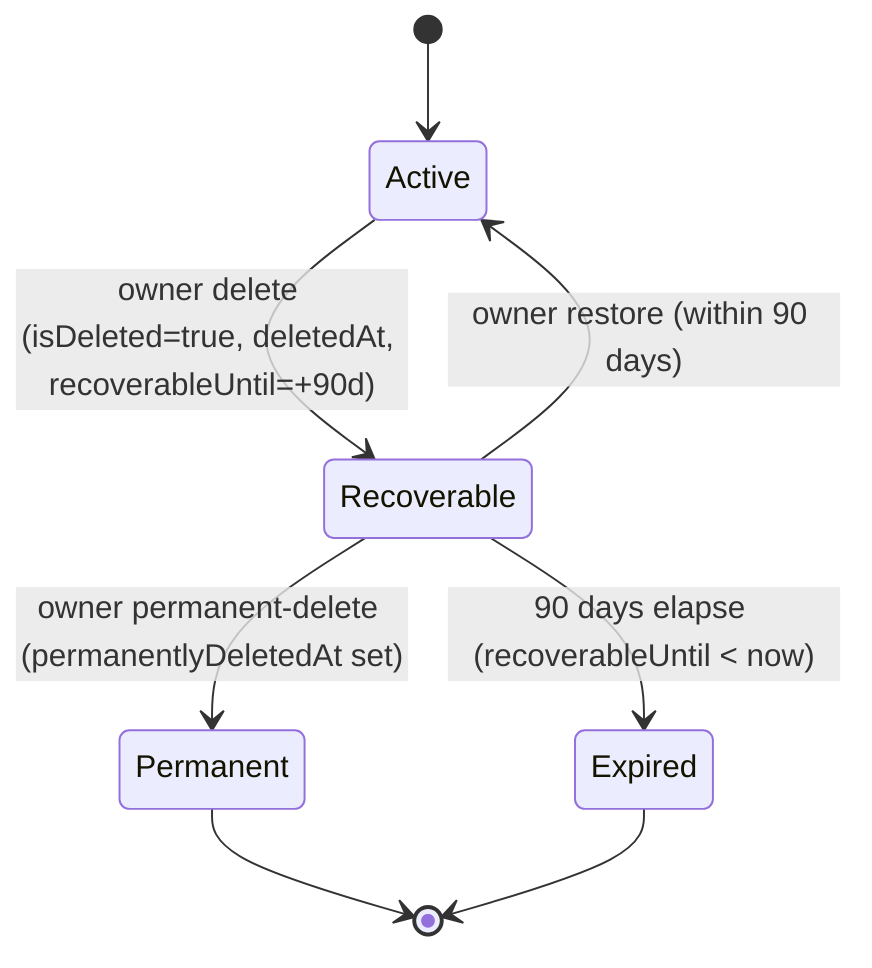

Organizations are the tenancy boundary for Propwise CRM. This specification defines how an **organization owner** deletes their workspace, what happens to billing, sessions, real-time connections, and background processing, and how the workspace can be **restored by the owner within a 90-day window** or **permanently removed** earlier.

<Info>
Deletion is a **reversible soft delete**. The organization row stays in the database with `isDeleted = true` and all CRM data intact. There is **no automated hard purge** in this phase.
</Info>

## Overview

The lifecycle is driven by a single boolean (`isDeleted`) plus four lifecycle timestamps. There is **no separate `status` enum** — this matches the existing `isDeleted: false` queries across the codebase and avoids syncing two fields. The four named states (Active / Recoverable / Permanent / Expired) are **computed at query time** from `isDeleted`, `permanentlyDeletedAt`, and `recoverableUntil`.

### Key Features

<CardGroup cols={2}>
  <Card title="Immediate access revocation" icon="ban">
    All org-scoped sessions revoked; no API call succeeds for that org after delete
  </Card>
  <Card title="Owner-only recovery" icon="clock-rotate-left">
    Only the owner can restore within 90 days or permanently delete immediately
  </Card>
  <Card title="Real-time teardown" icon="bolt">
    WebSockets disconnected, Meta webhooks paused, background jobs excluded
  </Card>
  <Card title="Billing integration" icon="credit-card">
    Paid subscriptions set to cancel at period end automatically
  </Card>
</CardGroup>

## Product Decisions

<AccordionGroup>
  <Accordion title="Access Control">
    **Organization owner only** can delete through the product UI. The endpoint requires:
    - `organization.owner_id` must match the authenticated user
    - RBAC permission `system.owner` (`OrgPermissionKey.SYSTEM_OWNER`) for defense in depth
    
    <Warning>
    Not system admin via product settings, not org Admin (`system.admin` alone is insufficient).
    </Warning>
  </Accordion>

  <Accordion title="Recovery Options">
    **Self-service recovery** available to the owner:
    - **Restore** within **90 days** from the org picker
    - **Permanently delete** immediately from the org picker
    - Beyond 90 days or after permanent-delete, owner self-service restore is disabled

    **System admin recovery** has no time limits and can restore any deleted organization.
  </Accordion>

  <Accordion title="Billing Behavior">
    **Cancel at period end** approach:
    - Paid orgs stop auto-renewal at the current period end
    - Free orgs (no `stripeSubscriptionId`) skip Stripe processing
    - On restore, resume auto-renewal only if the Stripe subscription is still alive
  </Accordion>

  <Accordion title="Data Retention">
    **Soft delete only** with no hard purge:
    - `isDeleted = true` plus lifecycle timestamps
    - All CRM data remains intact
    - Permanent-delete keeps the row and only sets `permanentlyDeletedAt`
  </Accordion>
</AccordionGroup>

## Lifecycle States

The organization lifecycle follows a state machine with four distinct states:



### State Definitions

| State | Condition | Owner Picker | Members/APIs | Free Slot | Self-Service Restore | Background Jobs |
|-------|-----------|--------------|--------------|-----------|---------------------|-----------------|
| **Active** | `isDeleted = false` | Visible + enterable | Visible per RBAC | Occupied | n/a | Eligible |
| **Recoverable** | `isDeleted = true` AND `permanentlyDeletedAt IS NULL` AND `recoverableUntil >= now` | Visible, not enterable, shows Restore + Permanent-delete | Hidden everywhere | **Occupied** | **Allowed** | Excluded |
| **Permanent** | `isDeleted = true` AND `permanentlyDeletedAt IS NOT NULL` | Hidden | Hidden | **Freed** | Disabled | Excluded |
| **Expired** | `isDeleted = true` AND `permanentlyDeletedAt IS NULL` AND `recoverableUntil < now` | Hidden | Hidden | **Freed** | Disabled | Excluded |

<Note>
The 90-day boundary is evaluated **at read time** (`recoverableUntil >= now`). No cron job flips Recoverable → Expired.
</Note>

## Data Model

### Database Schema

The lifecycle is managed through these fields on the `organizations` table:

```sql
-- Existing field
isDeleted BOOLEAN NOT NULL DEFAULT false,

-- New lifecycle fields
deletedAt TIMESTAMP WITH TIME ZONE,
deletedBy UUID REFERENCES users(id),
recoverableUntil TIMESTAMP WITH TIME ZONE,
permanentlyDeletedAt TIMESTAMP WITH TIME ZONE
```

### Field Invariants

<Steps>
  <Step title="Active State">
    When `isDeleted = false`: all lifecycle fields (`deletedAt`, `deletedBy`, `recoverableUntil`, `permanentlyDeletedAt`) MUST be `NULL`
  </Step>
  <Step title="Deleted State">
    When `isDeleted = true`: `deletedAt` and `recoverableUntil` SHOULD be set, `permanentlyDeletedAt` is set only on permanent-delete
  </Step>
</Steps>

## Owner-Initiated Deletion Flow

<Steps>
  <Step title="Authentication & Authorization">
    - Verify user is organization owner (`organization.owner_id`)
    - Check RBAC permission `system.owner`
    - Validate organization is in Active state
  </Step>

  <Step title="Billing Integration">
    - Call `cancelSubscription(organizationId, userId, immediate = false)`
    - Paid orgs: set cancel-at-period-end
    - Free orgs: skip Stripe processing
  </Step>

  <Step title="Database Update">
    ```sql
    UPDATE organizations 
    SET 
      isDeleted = true,
      deletedAt = NOW(),
      deletedBy = :userId,
      recoverableUntil = NOW() + INTERVAL '90 days'
    WHERE id = :organizationId
    ```
  </Step>

  <Step title="Session Revocation">
    Revoke all org-scoped sessions immediately with reason `ORG_ACCESS_REVOKED`
  </Step>

  <Step title="Real-Time Teardown">
    - Disconnect WebSocket clients in org rooms cluster-wide
    - Pause Meta/WhatsApp webhooks (keeping tokens)
    - Exclude org from cron/queue dispatchers
  </Step>

  <Step title="Member Notifications">
    Send `REMOVED_FROM_ORGANIZATION` notifications to non-owner members
  </Step>
</Steps>

## Restore Flow

### Owner Self-Service Restore

<Tabs>
  <Tab title="API Endpoint">
    ```typescript
    POST /v1/organizations/:id/restore
    
    // Requires IdentityTokenOnly guard
    // Only available for Recoverable state organizations
    ```
  </Tab>

  <Tab title="Process Steps">
    <Steps>
      <Step title="Validation">
        - Verify user is organization owner
        - Check organization is in Recoverable state
        - Validate within 90-day window
      </Step>

      <Step title="Database Restore">
        ```sql
        UPDATE organizations 
        SET 
          isDeleted = false,
          deletedAt = NULL,
          deletedBy = NULL,
          recoverableUntil = NULL,
          permanentlyDeletedAt = NULL
        WHERE id = :organizationId
        ```
      </Step>

      <Step title="Billing Resume">
        Resume Stripe subscription auto-renewal if subscription is still active
      </Step>

      <Step title="Real-Time Reactivation">
        - Re-include org in background job dispatchers
        - Re-subscribe Meta webhooks
        - WebSocket clients must reconnect manually
      </Step>
    </Steps>
  </Tab>
</Tabs>

### System Admin Restore

System administrators can restore any deleted organization regardless of state or time elapsed through the admin dashboard.

<Warning>
System admin restore bypasses the 90-day window and works for Recoverable, Expired, or Permanent states.
</Warning>

## Permanent Delete Flow

The permanent delete operation marks an organization as permanently deleted without removing data:

<Steps>
  <Step title="Owner Action">
    Available from org picker for Recoverable organizations via "Permanently delete" button
  </Step>

  <Step title="Database Update">
    ```sql
    UPDATE organizations 
    SET permanentlyDeletedAt = NOW()
    WHERE id = :organizationId AND isDeleted = true
    ```
  </Step>

  <Step title="Slot Release">
    Organization no longer counts toward owner's free organization limit
  </Step>

  <Step title="Visibility">
    Organization becomes hidden from owner picker and all APIs
  </Step>
</Steps>

<Info>
The organization row and all data remain in the database. Only the visibility and recoverability change.
</Info>

## Sessions and Access Control

### Session Revocation

When an organization is deleted:

- **All org-scoped sessions** are immediately revoked
- Revocation reason: `ORG_ACCESS_REVOKED`
- **AuthGuard enforcement**: All API requests for the deleted org are rejected
- **Legacy token handling**: Immediate `isDeleted` check for tokens without `orgSessionId`

### Access Patterns

<Tabs>
  <Tab title="Members">
    - Lose access to organization entirely
    - Organization disappears from their org picker
    - Cannot access any org-scoped resources
  </Tab>

  <Tab title="Owner">
    - Sees organization in picker (non-enterable) during Recoverable state
    - Can perform Restore or Permanent-delete actions
    - Cannot enter organization or access resources until restored
  </Tab>

  <Tab title="System Admin">
    - Can view all deleted organizations in admin dashboard
    - Can restore or delete any organization regardless of state
    - No time-based restrictions
  </Tab>
</Tabs>

## Real-Time Teardown

### WebSocket Management

<Steps>
  <Step title="Immediate Disconnect">
    All WebSocket clients connected to the deleted organization's rooms are disconnected cluster-wide
  </Step>

  <Step title="Cross-Instance Communication">
    Uses `PostgresIoAdapter` for cluster-wide socket management
  </Step>

  <Step title="Reconnection Handling">
    Clients attempting to reconnect to deleted org rooms are rejected
  </Step>
</Steps>

### Meta Webhooks

<Warning>
Meta webhook handling follows a pause-and-preserve approach to avoid losing webhook configurations.
</Warning>

- **Pause**: Webhook subscriptions are paused but not deleted
- **Token preservation**: WhatsApp/Meta tokens remain stored
- **Restore behavior**: Webhooks are re-activated when organization is restored

## Background Jobs and Crons

### Job Exclusion

Deleted organizations are excluded from:

- Escalation processing
- Distribution workflows  
- Account health checks
- Window expiry processing
- Portal syndication
- Reminder orphan recovery

### In-Flight Job Handling

<Tip>
Queued jobs are not purged. A shared "is org active" guard makes in-flight/queued jobs no-op for deleted organizations.
</Tip>

Jobs already queued will:
- Check organization active status before execution
- Skip processing if organization is deleted
- Log appropriate messages for audit trail

## Free Organization Ownership Cap

The free organization limit enforcement considers organization lifecycle state:

### Slot Accounting Rules

| State | Counts Toward Limit |
|-------|-------------------|
| Active | ✅ Yes |
| Recoverable | ✅ Yes (still occupied) |
| Permanent | ❌ No (slot freed) |
| Expired | ❌ No (slot freed) |

<Note>
This prevents users from circumventing the free organization limit by repeatedly deleting and creating organizations.
</Note>

## API Contract

### Core Endpoints

<CodeGroup>
```typescript DELETE
DELETE /v1/organizations/:id
// Requires: system.owner permission + owner_id match
// Returns: 200 with deletion confirmation
```

```typescript POST
POST /v1/organizations/:id/restore  
// Requires: IdentityTokenOnly, owner_id match, Recoverable state
// Returns: 200 with restored organization data
```

```typescript POST
POST /v1/organizations/:id/permanent-delete
// Requires: IdentityTokenOnly, owner_id match, Recoverable state  
// Returns: 200 with confirmation
```
</CodeGroup>

### System Admin Endpoints

<CodeGroup>
```typescript GET
GET /system-admin/organizations
// Query params: includeDeleted=true
// Returns: organizations with lifecycleState computed field
```

```typescript POST
POST /system-admin/organizations/:id/restore
// No time restrictions, works for any deleted state
// Returns: 200 with restored organization data
```

```typescript DELETE
DELETE /system-admin/organizations/:id
// Uses same pipeline as owner delete but marks permanent immediately
// Returns: 200 with deletion confirmation
```
</CodeGroup>

## Frontend Integration

### Organization Picker

The organization picker shows different states based on user role:

<Tabs>
  <Tab title="Owner View">
    ```typescript
    // Shows Active orgs (enterable) + Recoverable orgs (non-enterable)
    // Recoverable orgs display:
    // - "Pending deletion" badge
    // - Restore button (within 90 days)
    // - Permanently delete button
    ```
  </Tab>

  <Tab title="Member View">
    ```typescript
    // Shows only Active orgs where user has access
    // Deleted orgs completely hidden
    // No restore capabilities
    ```
  </Tab>
</Tabs>

### Danger Zone UI

Located in organization settings (`organization-security-extras.tsx`):

<Steps>
  <Step title="Owner Only">
    Delete option only visible to organization owners
  </Step>

  <Step title="Confirmation Flow">
    Multi-step confirmation with organization name verification
  </Step>

  <Step title="Warning Messages">
    Clear explanation of consequences and recovery options
  </Step>
</Steps>

## Testing Requirements

### Unit Tests

<Check>
**Service Layer Tests**
- `OrganizationService.delete()` with various user roles
- State transition validation (Active → Recoverable → Permanent/Expired)
- Billing integration edge cases
- Session revocation verification
</Check>

### Integration Tests

<Check>
**API Endpoint Tests**  
- Authorization checks for all delete/restore endpoints
- Cross-org access validation
- System admin privilege verification
- Error handling for invalid state transitions
</Check>

### End-to-End Tests

<Check>
**Full Workflow Tests**
- Complete delete → restore cycle
- Permanent delete workflow  
- Multi-user scenarios (owner + members)
- Real-time disconnect verification
</Check>

## Implementation Status

### Completed Phases

<AccordionGroup>
  <Accordion title="Phase 1: Data Model ✅">
    - Database schema with lifecycle fields
    - Entity updates and migrations
    - DTO field additions
  </Accordion>

  <Accordion title="Phase 2: Core Service Pipeline ✅">
    - `softDeleteOrganizationInternal` implementation
    - Billing integration and session revocation
    - Event system (`OrganizationDeletedEvent`)
    - Member notifications
  </Accordion>

  <Accordion title="Phase 3: Owner Self-Service ✅">
    - Restore and permanent-delete endpoints
    - Organization picker integration
    - Auth guard updates
    - Free-org cap enforcement
  </Accordion>

  <Accordion title="Phase 5: Real-Time Teardown ✅">
    - WebSocket disconnect implementation
    - Meta webhook pause functionality
  </Accordion>

  <Accordion title="Phase 7: System Admin Features ✅">
    - Admin dashboard organization list
    - Admin restore and delete capabilities
    - Lifecycle state visualization
  </Accordion>
</AccordionGroup>

### Remaining Work

<Warning>
**Background job filtering** - Cron jobs and queue dispatchers do not yet filter out deleted organizations. This needs to be implemented to complete the teardown process.
</Warning>

## Recovery Beyond 90 Days

For organizations in Expired state, recovery requires system administrator intervention:

<Steps>
  <Step title="Support Request">
    Customer contacts support with organization details
  </Step>

  <Step title="Admin Dashboard">
    System admin locates organization in deleted organizations list
  </Step>

  <Step title="Restore Process">
    Admin uses restore functionality (no time restrictions for admins)
  </Step>

  <Step title="Billing Verification">
    Verify Stripe subscription status and billing continuity
  </Step>
</Steps>

<Info>
System admin restore capability replaces the manual SQL runbook as the primary recovery mechanism for expired organizations.
</Info>